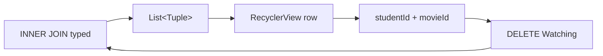

{: .box-note}
הפרק מתחיל מן היישום העובד בסוף
[פרק 3 — JOIN והוספות](/android/sqlite/03.requery-join-and-inserts). נחליף רק את
אזור תוצאות הטקסט ב-`RecyclerView`, נוסיף לכל Watching כפתור Delete, ונמחק את
שורת הקשר המדויקת בעזרת שני חלקי המפתח המורכב שלה.

[חזרה לפרק 3: JOIN והוספות](/android/sqlite/03.requery-join-and-inserts)



## השינוי כולו בשבעה קבצים

{: .table-he}

| קובץ | שינוי מינימלי |
|---|---|
| `app/build.gradle.kts` | תלות אחת של RecyclerView |
| `strings.xml` | כותרת, כותרות עמודות וטקסט לכפתור |
| `activity_main.xml` | כותרת, ראש טבלה והחלפת אזור התוצאה |
| `item_watching.xml` | קובץ חדש: שלוש עמודות וכפתור Delete |
| `WatchAdapter.java` | קובץ חדש: adapter קטן ל-`Tuple`-ים |
| `MainActivity.java` | חיבור הרשימה, ids למחיקה ורענון |
| `Database.java` | פעולת DELETE typed אחת |

ה-entities, ה-schema, ה-seed, שלושת דיאלוגי ההוספה, ה-Manifest,‏ themes,
קטלוג הספריות וכל מערכת הבדיקות נשארים ללא שינוי.

## 1. מוסיפים רק את ספריית RecyclerView

פתחו דרך **Gradle Scripts** את `build.gradle.kts (Module :app)`. בתוך
`dependencies`, הוסיפו שורה אחת ליד שאר ספריות AndroidX:

```diff
     implementation(libs.appcompat)
     implementation(libs.constraintlayout)
     implementation(libs.material)
+    implementation("androidx.recyclerview:recyclerview:1.4.0")
     testImplementation(libs.junit)
```

בצעו **Sync Now**. לא מחליפים את קטלוג הספריות ולא מוחקים אף dependency שיצרה
תבנית Android.

## 2. מגדירים שורה אחת שניתנת למחזור

### 2.1 מוסיפים את הטקסטים

ב-`app > res > values > strings.xml`, הוסיפו:

```diff
     <string name="add_student">Add Student</string>
     <string name="add_movie">Add Movie</string>
     <string name="add_watching">Add Watching</string>
+    <string name="title">🎬 WHO WATCHED WHAT?</string>
+    <string name="column_student">Student</string>
+    <string name="column_movie">Movie</string>
+    <string name="column_rating">Rating</string>
+    <string name="column_action">Action</string>
+    <string name="delete">Delete</string>
+    <string name="rating_value">%1$d</string>
 </resources>
```

הכותרות הופכות את התוצאה לטבלה קריאה. `rating_value` מעבירה גם מספר דרך משאב
מחרוזת; ה-ids שנצטרך למחיקה אינם חלק מן התצוגה.

### 2.2 יוצרים layout לשורה

תחת `app > res > layout`, צרו **Layout Resource File** בשם
`item_watching.xml` עם root מסוג `LinearLayout`, והחליפו את תוכנו:

```xml
<?xml version="1.0" encoding="utf-8"?>
<LinearLayout xmlns:android="http://schemas.android.com/apk/res/android"
    android:layout_width="match_parent"
    android:layout_height="wrap_content"
    android:gravity="center_vertical"
    android:orientation="horizontal"
    android:paddingHorizontal="8dp"
    android:paddingVertical="4dp">

    <TextView
        android:id="@+id/student_name"
        android:layout_width="0dp"
        android:layout_height="wrap_content"
        android:layout_weight="3"
        android:singleLine="true"
        android:textSize="16sp" />

    <TextView
        android:id="@+id/movie_title"
        android:layout_width="0dp"
        android:layout_height="wrap_content"
        android:layout_weight="4"
        android:singleLine="true"
        android:textSize="16sp" />

    <TextView
        android:id="@+id/rating"
        android:layout_width="0dp"
        android:layout_height="wrap_content"
        android:layout_weight="2"
        android:gravity="center"
        android:textSize="16sp" />

    <Button
        android:id="@+id/button_delete"
        android:layout_width="88dp"
        android:layout_height="wrap_content"
        android:minWidth="0dp"
        android:paddingHorizontal="8dp"
        android:text="@string/delete" />
</LinearLayout>
```

המשקלים `3 : 4 : 2` נותנים לסרט מעט יותר מקום מלשם התלמיד ולדירוג. עמודת
הפעולה מקבלת רוחב קבוע של `88dp`;‏ `minWidth` וה-padding הקטן מונעים מסגנון
AppCompat לשבור את המילה Delete לשתי שורות. מאחר ש-View Binding כבר פעיל,
Android תיצור מן הקובץ את `ItemWatchingBinding`.

## 3. מחליפים רק את אזור התוצאות

ב-`activity_main.xml`, הוסיפו כותרת לפני שורת הכפתורים, ותנו לשורה id כדי שנוכל
למקם מתחתיה את ראש הטבלה:

```diff
+    <TextView
+        android:id="@+id/title"
+        android:layout_width="wrap_content"
+        android:layout_height="wrap_content"
+        android:layout_marginStart="16dp"
+        android:layout_marginTop="16dp"
+        android:text="@string/title"
+        android:textSize="24sp"
+        android:textStyle="bold"
+        app:layout_constraintStart_toStartOf="parent"
+        app:layout_constraintTop_toTopOf="parent" />
+
     <LinearLayout
+        android:id="@+id/buttons"
         android:layout_width="0dp"
         android:layout_height="wrap_content"
         android:layout_marginHorizontal="16dp"
-        android:layout_marginTop="16dp"
+        android:layout_marginTop="8dp"
         android:orientation="horizontal"
         app:layout_constraintEnd_toEndOf="parent"
         app:layout_constraintStart_toStartOf="parent"
-        app:layout_constraintTop_toTopOf="parent">
+        app:layout_constraintTop_toBottomOf="@id/title">
```

לאחר סגירת שורת הכפתורים, הוסיפו ראש טבלה שמשתמש בדיוק באותם רוחבים של שורת
Watching:

```xml
    <LinearLayout
        android:id="@+id/column_headers"
        android:layout_width="0dp"
        android:layout_height="wrap_content"
        android:layout_marginHorizontal="16dp"
        android:gravity="center_vertical"
        android:orientation="horizontal"
        android:paddingHorizontal="8dp"
        android:paddingVertical="8dp"
        app:layout_constraintEnd_toEndOf="parent"
        app:layout_constraintStart_toStartOf="parent"
        app:layout_constraintTop_toBottomOf="@id/buttons">

        <TextView
            android:layout_width="0dp"
            android:layout_height="wrap_content"
            android:layout_weight="3"
            android:text="@string/column_student"
            android:textStyle="bold" />

        <TextView
            android:layout_width="0dp"
            android:layout_height="wrap_content"
            android:layout_weight="4"
            android:text="@string/column_movie"
            android:textStyle="bold" />

        <TextView
            android:layout_width="0dp"
            android:layout_height="wrap_content"
            android:layout_weight="2"
            android:gravity="center"
            android:text="@string/column_rating"
            android:textStyle="bold" />

        <TextView
            android:layout_width="88dp"
            android:layout_height="wrap_content"
            android:gravity="center"
            android:text="@string/column_action"
            android:textStyle="bold" />
    </LinearLayout>
```

לבסוף החליפו את ה-`TextView` של התוצאות ב-`RecyclerView`:

```diff

⁞

-    <TextView
-        android:id="@+id/results"
-        android:layout_width="wrap_content"
-        android:layout_height="wrap_content"
-        android:fontFamily="monospace"
-        android:text="Hello World!"
-        android:textSize="17sp"
+    <androidx.recyclerview.widget.RecyclerView
+        android:id="@+id/recycler_view"
+        android:layout_width="0dp"
+        android:layout_height="0dp"
+        android:layout_marginHorizontal="16dp"
+        android:layout_marginTop="8dp"
         app:layout_constraintBottom_toBottomOf="parent"
         app:layout_constraintEnd_toEndOf="parent"
         app:layout_constraintStart_toStartOf="parent"
-        app:layout_constraintTop_toTopOf="parent" />
+        app:layout_constraintTop_toBottomOf="@id/column_headers" />
```

כאן `Hello World!` אינו נמחק כדי “לנקות” את התבנית: כל רכיב התצוגה הישן מוחלף
בטבלה שבאמת מציגה את שורות ה-JOIN. ה-`RecyclerView` נמתח מראש הטבלה ועד תחתית
המסך והוא עצמו מטפל בגלילה. אותם weights ורוחב פעולה ב-header וב-item הם
שמיישרים את ארבע העמודות.

## 4. כותבים adapter קטן ל-Tuple

תחת `app > kotlin+java > com.example.sqlrequery`, צרו Java Class בשם
`WatchAdapter`:

```java
package com.example.sqlrequery;

import android.annotation.SuppressLint;
import android.view.LayoutInflater;
import android.view.ViewGroup;

import androidx.annotation.NonNull;
import androidx.recyclerview.widget.RecyclerView;

import com.example.sqlrequery.databinding.ItemWatchingBinding;
import com.example.sqlrequery.model.MovieEntity;
import com.example.sqlrequery.model.StudentEntity;
import com.example.sqlrequery.model.WatchingEntity;

import java.util.Collections;
import java.util.List;
import java.util.function.Consumer;

import io.requery.query.Tuple;

/** Displays typed join tuples as reusable RecyclerView rows. */
final class WatchAdapter extends RecyclerView.Adapter<WatchAdapter.RowHolder> {
    private List<Tuple> rows = Collections.emptyList();
    private final Consumer<Tuple> delete;

    /** @param delete action that receives the tuple represented by the clicked row */
    WatchAdapter(Consumer<Tuple> delete) {
        this.delete = delete;
    }

    /** Creates one row binding when RecyclerView needs another reusable view. */
    @NonNull
    @Override
    public RowHolder onCreateViewHolder(@NonNull ViewGroup parent, int viewType) {
        ItemWatchingBinding binding = ItemWatchingBinding.inflate(
                LayoutInflater.from(parent.getContext()), parent, false);
        return new RowHolder(binding);
    }

    /** Copies one tuple's values into three columns and connects its Delete button. */
    @Override
    public void onBindViewHolder(@NonNull RowHolder holder, int position) {
        Tuple row = rows.get(position);
        holder.binding.studentName.setText(row.get(StudentEntity.NAME));
        holder.binding.movieTitle.setText(row.get(MovieEntity.TITLE));
        holder.binding.rating.setText(holder.itemView.getContext().getString(
                R.string.rating_value, row.get(WatchingEntity.RATING)));
        holder.binding.buttonDelete.setOnClickListener(v -> delete.accept(row));
    }

    /** @return number of join tuples currently displayed */
    @Override
    public int getItemCount() {
        return rows.size();
    }

    /** Replaces the tiny join result after the query is rerun. */
    @SuppressLint("NotifyDataSetChanged")
    void setRows(List<Tuple> rows) {
        this.rows = rows;
        notifyDataSetChanged();
    }

    /** Holds View Binding for one reusable row. */
    static final class RowHolder extends RecyclerView.ViewHolder {
        private final ItemWatchingBinding binding;

        RowHolder(ItemWatchingBinding binding) {
            super(binding.getRoot());
            this.binding = binding;
        }
    }
}
```

אין כאן מחלקת “שורת תצוגה” נוספת. ה-adapter מקבל ישירות את ה-`Tuple` שהשאילתה
כבר מחזירה וקורא ממנו בעזרת אותם attributes typed. גם `Consumer<Tuple>` חוסך
interface נפרד: ה-adapter מדווח איזו שורה נלחצה, אך אינו יודע דבר על SQLite.

{: .box-note}
ברשימה קטנה של כמה שורות, `notifyDataSetChanged()` ברור יותר מ-`DiffUtil` או
`ListAdapter`. זו החלטת פישוט מכוונת, לא המלצה לכל רשימה גדולה.

## 5. מחברים את RecyclerView ל-Activity

### 5.1 import, שדה ואתחול

ב-`MainActivity`, הוסיפו import:

```diff
 import androidx.core.view.ViewCompat;
 import androidx.core.view.WindowInsetsCompat;
+import androidx.recyclerview.widget.LinearLayoutManager;
```

הוסיפו שדה אחד:

```diff
 public class MainActivity extends AppCompatActivity {
     private ActivityMainBinding binding;
     private EntityDataStore<Persistable> data;
+    private WatchAdapter adapter;
```

בתוך `onCreate`, מיד לאחר פתיחת המסד וה-seed, חברו את שלושת חלקי הרשימה:

```diff
 data = Database.open(this);
 Database.seedIfEmpty(data);

+adapter = new WatchAdapter(this::deleteWatching);
+binding.recyclerView.setLayoutManager(new LinearLayoutManager(this));
+binding.recyclerView.setAdapter(adapter);

 binding.buttonAddStudent.setOnClickListener(v -> showAddStudent());
```

- `WatchAdapter` יודע מה להציג בכל שורה;
- `LinearLayoutManager` מסדר את השורות זו מתחת לזו;
- `RecyclerView` מחזיק את ה-adapter וממחזר את ה-Views שלו.

### 5.2 מעבירים את תוצאת ה-JOIN ל-adapter

החליפו את `showWatchings` והוסיפו אחריה את `deleteWatching`:

<div class="two-columns before-after">
<div markdown="1" class="column">

### לפני

    
private void showWatchings() {
-    StringBuilder text = new StringBuilder("STUDENT | MOVIE | RATING\n\n");
-
    try (Result<Tuple> rows = data
-            .select(StudentEntity.NAME, MovieEntity.TITLE, WatchingEntity.RATING)
            .from(Student.class)
            .join(Watching.class).on(WatchingEntity.STUDENT_ID.eq(StudentEntity.ID))
            .join(Movie.class).on(MovieEntity.ID.eq(WatchingEntity.MOVIE_ID))
            .orderBy(StudentEntity.ID, MovieEntity.ID)
            .get()) {
-        for (Tuple row : rows) {
-            text.append(row.get(StudentEntity.NAME))
-                    .append(" | ")
-                    .append(row.get(MovieEntity.TITLE))
-                    .append(" | ")
-                    .append(row.get(WatchingEntity.RATING))
-                    .append('\n');
-        }
    }
-
-    binding.results.setText(text);
}
    

</div>
<div markdown="1" class="column">

### אחרי

    
private void showWatchings() {
    try (Result<Tuple> rows = data
+            .select(StudentEntity.NAME, MovieEntity.TITLE, WatchingEntity.RATING,
+                    WatchingEntity.STUDENT_ID, WatchingEntity.MOVIE_ID)
            .from(Student.class)
            .join(Watching.class).on(WatchingEntity.STUDENT_ID.eq(StudentEntity.ID))
            .join(Movie.class).on(MovieEntity.ID.eq(WatchingEntity.MOVIE_ID))
            .orderBy(StudentEntity.ID, MovieEntity.ID)
            .get()) {
+        adapter.setRows(rows.toList());
    }
}

+/** Deletes the clicked relationship and refreshes the join result. */
+private void deleteWatching(Tuple row) {
+    Database.deleteWatching(data,
+            row.get(WatchingEntity.STUDENT_ID), row.get(WatchingEntity.MOVIE_ID));
+    showWatchings();
+    toast("Watching deleted");
+}
    

</div>
</div>

`rows.toList()` יוצרת snapshot לפני שבלוק ה-try סוגר את cursor התוצאה. שלושת
הערכים הראשונים ב-`select` מוצגים. שני הערכים האחרונים נשארים בתוך ה-`Tuple`
ומזהים את Watching שנלחץ.

שמות וכותרות אינם מפתחות בטוחים: יכולים להיות שני תלמידים בשם Maya או שני
סרטים באותה כותרת. לעומת זאת, הצמד `studentId + movieId` הוא בדיוק המפתח
המורכב שהגדרנו ב-`Watching`.

## 6. מבצעים DELETE typed

ב-`Database.java`, הוסיפו את הפעולה מיד לאחר `addWatching`:

```diff
     static void addWatching(EntityDataStore<Persistable> data,
                             Student student, Movie movie, int rating) {
         WatchingEntity watching = new WatchingEntity();
         watching.setStudent(student);
         watching.setMovie(movie);
         watching.setRating(rating);
         data.insert(watching);
     }

+    /** Deletes one Watching row using its two-column primary key. */
+    static void deleteWatching(EntityDataStore<Persistable> data, int studentId, int movieId) {
+        data.delete(Watching.class)
+                .where(WatchingEntity.STUDENT_ID.eq(studentId)
+                        .and(WatchingEntity.MOVIE_ID.eq(movieId)))
+                .get().value();
+    }

     private Database() {}
```

הקריאה עדיין typed: גם שם ה-Entity וגם שתי העמודות מגיעים מן המודל שנוצר.
ה-`and` מחייב התאמה של שני חלקי המפתח ולכן מוחק קשר אחד בלבד.

{: .box-warning}
אל תשמיטו את `value()`. פעולות Requery הן lazy:‏ `get()` יוצר תוצאה scalar,
ו-`value()` הוא שמבצע בפועל את פקודת ה-DELETE.

## 7. מריצים ובודקים

1. בצעו Build והריצו את היישום. צריכות להופיע ארבע שורות, ולצד כל אחת כפתור
   Delete.
2. לחצו Delete ליד `Maya | Barbie | 9`. השורה צריכה להיעלם מיד ושלוש האחרות
   להישאר.
3. סגרו והריצו שוב. השורה שנמחקה אינה חוזרת — `seedIfEmpty` לא משחזרת אותה.
4. הוסיפו Watching חדש דרך הכפתור הקיים. הרשימה צריכה להתרענן מיד בלי restart.
5. ב-Logcat חפשו `delete from Watching` והשוו אותו לשרשרת ה-Requery שכתבתם.

## רשימת בדיקה

- נוספה רק ספריית RecyclerView; כל תלויות התבנית והבדיקות נשארו.
- נוספו רק `WatchAdapter.java` ו-`item_watching.xml` כקבצים חדשים.
- כל שורת JOIN מוצגת באמצעות `ItemWatchingBinding`.
- ה-adapter מציג `Tuple` ישירות ואינו ניגש למסד.
- המחיקה משתמשת ב-`studentId` וב-`movieId`, לא בשם ובכותרת.
- לאחר מחיקה השאילתה רצה שוב והרשימה מתרעננת.
- המחיקה נשמרת לאחר restart.

{: .box-success}
הפכנו תוצאת JOIN סטטית לרשימה אינטראקטיבית בלי לשנות את המודל: RecyclerView
ממחזרת שורות, ה-Activity מתרגמת לחיצה לשני חלקי המפתח, ו-Requery מפיקה DELETE
typed של שורת Watching אחת.
