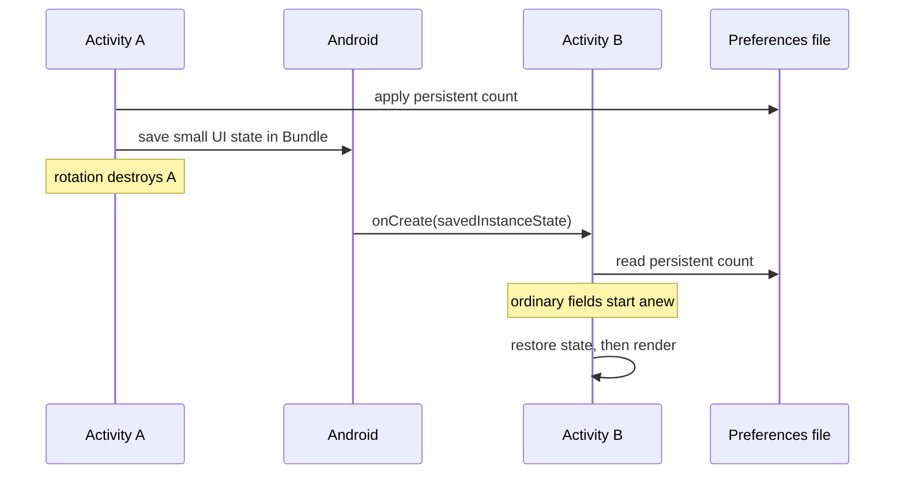

[מפת המעבדות]({{ '/android/topics/' | relative_url }})

{: .box-success}
בסוף המעבדה יופיעו שלושה מונים ב־Activity ומונה נוסף ב־Fragment. נעלה את כולם, נסובב את המכשיר, נהרוג את האפליקציה ונחזור אליה. נוכל לנבא **איזה ערך ישרוד כל פעולה**. בלחיצה נפרדת נהרוס רק את ה־View של ה־Fragment, נחזור עם Back ונראה שאותו מופע Fragment נשאר.

## עצרו ונבאו

לחצתם פעם אחת על כל אחד משלושת המונים ואז סובבתם את המסך. אילו ערכים יוצגו, ולמה? כתבו תחזית לפני פתיחת ההסבר, ואז הצביעו על המשתנה או התנאי בקוד שמצדיקים אותה.

<details markdown="1">
<summary>בדיקת ההבנה</summary>

השדה הרגיל מתחיל ב־0 ב־Activity החדשה. מונה ה־Bundle משוחזר ל־1 עבור יצירה מחדש. מונה ההעדפות נקרא מן האחסון ונשאר 1. סדר השחזור לפני render הוא שמביא את המצב הנכון אל ה־Views החדשים.

</details>

## נקודת התחלה ושאלת חיזוי

התחילו מפרויקט **Empty Views Activity** ב־Java וב־XML, עם החבילה `com.example.topics`. תחילה הפעילו והכירו את View Binding בסעיף הבא; יתר המעבדה נשענת על התבנית לאחר ההסבה. ענף הדוגמה המוכן הוא `codex/lifecycle-state`; השוו אותו לבסיס התבנית כדי לראות את שינויי המעבדה. ב־Android Studio אפשר למצוא את הקבצים דרך **app > kotlin+java > com.example.topics**,‏ **app > res > layout** ו־**app > res > values**.



לפני כתיבת הקוד, רשמו ניחוש לכל שורה:

| פעולה | שדה רגיל ב־Activity | ערך ב־`Bundle` | ערך ב־`SharedPreferences` |
|---:|:---:|:---:|:---:|
| סיבוב מסך | ? | ? | ? |
| מעבר לרקע עם `Don't keep activities` וחזרה | ? | ? | ? |
| Force stop ופתיחה מחדש | ? | ? | ? |

`Bundle` של `onSaveInstanceState` מיועד לשחזור מצב ממשק כשהמערכת יוצרת מחדש רכיב. הוא **אינו מסד נתונים** ואינו התחייבות לשחזור אחרי Force stop או פתיחה חדשה של האפליקציה. `SharedPreferences` הוא מקור נתונים מקומי שנשמר גם אחרי סגירת התהליך. שדה Java רגיל חי רק כל עוד המופע שלו חי.

## מפת מחשבה: ערך, בעלים וזמן חיים

כשאומרים שהערך "נשמר", צריך להשלים: **איפה הוא נמצא, ומי יוכל להחזיר אותו אחרי שהבעלים שלו ייעלם?** לחיצה מעלה שלושה מספרים זהים, אבל הם חיים בשלושה מקומות שונים. `memoryCount` שייך למופע Java הנוכחי; `savedCount` מועתק למעטפת שחזור ש־Android עשויה למסור למופע הבא; `persistentCount` נקרא מקובץ פרטי. הטקסט שעל המסך הוא תצוגה שלהם, ולא המקום שבו כדאי לשמור אותם.



עקבו בתרשים אחר מספר אחד, למשל 2. המספר אינו עובר מעצמו בין שדות של שני מופעים: הקוד קורא אותו מן ה־`Bundle` או מן הקובץ. אחרי Force stop ופתיחה חדשה נשאר מסלול הקובץ, אך אין להניח שיימסר Bundle של המשימה הישנה. אלה שני ניסויים שונים, ולא שני שמות לאותה פעולה.

ל־Fragment יש בנוסף **שני זמני חיים**: האובייקט שמחזיק `count`, ועץ ה־Views שמציג אותו. `detach` והחזרה מה־back stack יכולים להרוס וליצור את העץ בלי להחליף את האובייקט. ה־binding הישן מחזיק הפניות לעץ שנהרס, ולכן מנקים אותו. אין מאפסים את `count` ב־`onCreateView`: יצירת תצוגה אינה בקשה למחוק את הנתון. [מחזור חיי Fragment בתיעוד Android](https://developer.android.com/guide/fragments/lifecycle) מגדיר את מחזור חיי התצוגה בנפרד.

{: .box-note}
בקריאת callback שאלו שתי שאלות: מי קורא לי, ואיזה משאב תקף עכשיו? Android קוראת ל־`onCreateView`; בו מותר ליצור binding. Android קוראת ל־`onDestroyView`; אחריו אסור להשתמש באותו binding. `renderCount` היא מתודה שלנו, ולכן האחריות לקרוא לה רק כשיש View היא שלנו.

## בונים את הניסוי

קובץ חדש מוצג במלואו. בקובץ קיים, קטע `diff` מציג את האזור המשתנה בלבד: מסירים את שורות `-`, מוסיפים את שורות `+` ומשאירים שורות הקשר. אין למחוק קוד תבנית שלא מופיע בקטע.

### 1. מחרוזות התצוגה

ב־**app > res > values > strings.xml** הוסיפו את המחרוזות. המספרים הם placeholders של Android; התצוגה תספק להם ערך באמצעות `getString`.

```diff
 <resources>
     <string name="app_name">topics</string>
+    <string name="lifecycle_intro">Tap Increment, rotate the device, then force stop and relaunch. Which values survive?</string>
+    <string name="memory_value">Activity field: %1$d</string>
+    <string name="saved_value">Saved Bundle: %1$d</string>
+    <string name="persistent_value">SharedPreferences: %1$d</string>
+    <string name="increment">Increment all three</string>
+    <string name="reset">Reset counters</string>
+    <string name="fragment_intro">Fragment view lifecycle (watch LifecycleDemo in Logcat)</string>
+    <string name="fragment_value">Fragment saved count: %1$d</string>
+    <string name="fragment_increment">Increment Fragment</string>
+    <string name="detach_view">Destroy Fragment View (press Back to restore)</string>
 </resources>
```

### 2. ה־View של ה־Fragment

צרו ב־**app > res > layout** את `fragment_lifecycle.xml`. הכפתור האחרון מנתק את ה־Fragment זמנית; Back מחבר אותו שוב. כך אפשר לראות מחזור View חדש **בלי ליצור מופע Fragment חדש**.

```xml
<?xml version="1.0" encoding="utf-8"?>
<LinearLayout xmlns:android="http://schemas.android.com/apk/res/android"
    android:layout_width="match_parent"
    android:layout_height="wrap_content"
    android:orientation="vertical">

    <TextView
        android:layout_width="match_parent"
        android:layout_height="wrap_content"
        android:text="@string/fragment_intro" />

    <TextView
        android:id="@+id/fragment_value"
        android:layout_width="match_parent"
        android:layout_height="wrap_content" />

    <Button
        android:id="@+id/fragment_increment"
        android:layout_width="match_parent"
        android:layout_height="wrap_content"
        android:text="@string/fragment_increment" />

    <Button
        android:id="@+id/detach_view"
        android:layout_width="match_parent"
        android:layout_height="wrap_content"
        android:text="@string/detach_view" />
</LinearLayout>
```

### 3. מחלקת ה־Fragment

צרו ב־**app > kotlin+java > com.example.topics** מחלקת Java בשם `LifecycleFragment`. המחלקה שומרת `count` בשדה שלה ומעתיקה אותו גם ל־`Bundle` לפני שחזור מערכת. `binding` מתייחס **ל־View הנוכחי בלבד**: אנחנו יוצרים אותו ב־`onCreateView` ומנקים אותו ב־`onDestroyView`, כדי שלא להחזיק View שכבר נהרס.

```java
package com.example.topics;

import android.os.Bundle;
import android.util.Log;
import android.view.LayoutInflater;
import android.view.View;
import android.view.ViewGroup;

import androidx.annotation.NonNull;
import androidx.annotation.Nullable;
import androidx.fragment.app.Fragment;

import com.example.topics.databinding.FragmentLifecycleBinding;

/** Demonstrates that a Fragment and its View have separate lifetimes. */
public final class LifecycleFragment extends Fragment {
    private static final String TAG = "LifecycleDemo";
    private static final String SAVED_COUNT = "fragment_count";

    private FragmentLifecycleBinding binding;
    private int count;

    /**
     * Creates the current View tree; the Fragment object may already exist.
     *
     * @param inflater creates Views using the host theme
     * @param container parent used for layout parameters; do not attach yet
     * @param savedInstanceState prior UI state, or null on a fresh creation
     * @return the root of this new View tree
     */
    @Nullable
    @Override
    public View onCreateView(@NonNull LayoutInflater inflater, @Nullable ViewGroup container,
                             @Nullable Bundle savedInstanceState) {
        Log.d(TAG, "Fragment " + System.identityHashCode(this) + " onCreateView");
        // The manager attaches the root; attaching here would attach it twice.
        binding = FragmentLifecycleBinding.inflate(inflater, container, false);
        return binding.getRoot();
    }

    /**
     * Restores the counter and connects actions after the current binding exists.
     * A detach/back cycle retains the field when no saved Bundle is supplied.
     *
     * @param view the newly created root
     * @param savedInstanceState saved counter when Android restores this Fragment
     */
    @Override
    public void onViewCreated(@NonNull View view, @Nullable Bundle savedInstanceState) {
        super.onViewCreated(view, savedInstanceState);
        Log.d(TAG, "Fragment " + System.identityHashCode(this) + " onViewCreated");
        if (savedInstanceState != null) {
            count = savedInstanceState.getInt(SAVED_COUNT);
        }
        binding.fragmentIncrement.setOnClickListener(v -> {
            count++;
            renderCount();
        });
        binding.detachView.setOnClickListener(v -> getParentFragmentManager()
                .beginTransaction()
                .detach(this)
                .addToBackStack("detached_view")
                .commit());
        renderCount();
    }

    /**
     * Copies this component's small UI counter into Android's restoration Bundle.
     * This is a restoration snapshot, not durable storage for a fresh app launch.
     *
     * @param outState destination delivered to a later restored instance
     */
    @Override
    public void onSaveInstanceState(@NonNull Bundle outState) {
        outState.putInt(SAVED_COUNT, count);
        super.onSaveInstanceState(outState);
    }

    /**
     * Releases references to the old View tree while the Fragment may stay alive.
     */
    @Override
    public void onDestroyView() {
        Log.d(TAG, "Fragment " + System.identityHashCode(this)
                + " onDestroyView; clearing binding");
        // The Fragment can outlive this View; release the obsolete references.
        binding = null;
        super.onDestroyView();
    }

    /**
     * Displays the Fragment counter without changing it.
     * Call only between View creation and View destruction.
     */
    private void renderCount() {
        binding.fragmentValue.setText(getString(R.string.fragment_value, count));
    }
}
```

המספר מ־`identityHashCode(this)` מזהה את מופע ה־Fragment **באותו תהליך לצורך התצפית בלבד**; אין לשמור אותו כמזהה עסקי. אחרי `detach` מופיעה ב־Logcat שורת `onDestroyView`, ואחרי Back מופיעה `onCreateView` עם אותו מספר. הספירה נשארת בשדה `count`, אף שה־View ובניית ה־binding התחלפו.

### 4. מסך ה־Activity

ב־**app > res > layout > activity_main.xml** השאירו את `ConstraintLayout` של התבנית ואת המזהה `main`. החליפו רק את `TextView` של Hello World בתוכן הבא. ה־`ScrollView` משאיר את הכפתורים נגישים גם במסך קטן או במצב landscape. `FragmentContainerView` יוצר את `LifecycleFragment` מתוך `android:name`.

```diff
-    <TextView
-        android:layout_width="wrap_content"
-        android:layout_height="wrap_content"
-        android:text="Hello World!"
+    <ScrollView
+        android:layout_width="0dp"
+        android:layout_height="0dp"
         app:layout_constraintBottom_toBottomOf="parent"
         app:layout_constraintEnd_toEndOf="parent"
         app:layout_constraintStart_toStartOf="parent"
-        app:layout_constraintTop_toTopOf="parent" />
+        app:layout_constraintTop_toTopOf="parent">

+        <LinearLayout
+            android:layout_width="match_parent"
+            android:layout_height="wrap_content"
+            android:orientation="vertical"
+            android:padding="24dp">
+
+            <TextView
+                android:layout_width="match_parent"
+                android:layout_height="wrap_content"
+                android:text="@string/lifecycle_intro"
+                android:textSize="18sp" />
+
+            <TextView
+                android:id="@+id/memory_value"
+                android:layout_width="match_parent"
+                android:layout_height="wrap_content"
+                android:layout_marginTop="24dp"
+                tools:text="Activity field: 0" />
+
+            <TextView
+                android:id="@+id/saved_value"
+                android:layout_width="match_parent"
+                android:layout_height="wrap_content"
+                android:layout_marginTop="8dp"
+                tools:text="Saved Bundle: 0" />
+
+            <TextView
+                android:id="@+id/persistent_value"
+                android:layout_width="match_parent"
+                android:layout_height="wrap_content"
+                android:layout_marginTop="8dp"
+                tools:text="SharedPreferences: 0" />
+
+            <Button
+                android:id="@+id/increment"
+                android:layout_width="match_parent"
+                android:layout_height="wrap_content"
+                android:layout_marginTop="16dp"
+                android:text="@string/increment" />
+
+            <Button
+                android:id="@+id/reset"
+                android:layout_width="match_parent"
+                android:layout_height="wrap_content"
+                android:text="@string/reset" />
+
+            <androidx.fragment.app.FragmentContainerView
+                android:id="@+id/lifecycle_fragment"
+                android:name="com.example.topics.LifecycleFragment"
+                android:layout_width="match_parent"
+                android:layout_height="wrap_content"
+                android:layout_marginTop="32dp" />
+        </LinearLayout>
+    </ScrollView>
```

ל־`tools:text` יש תפקיד בתצוגת העיצוב של Android Studio בלבד; ערכי הריצה יגיעו מ־`renderCounts`. `android:name` הוא שם המחלקה המלא של ה־Fragment, ולכן טעות בו תגרום לקריסה בזמן ניפוח המסך.

### 5. שלוש דרכי השמירה ב־MainActivity

ב־**app > kotlin+java > com.example.topics > MainActivity** הוסיפו את הייבוא, הקבועים והשדות. `memoryCount` לא משוחזר בכוונה; הוא קבוצת הביקורת בניסוי. `savedCount` ישוחזר מתוך `savedInstanceState`, ואילו `persistentCount` ייטען מהאחסון המקומי.

```diff
 package com.example.topics;

+import android.content.SharedPreferences;
 import android.os.Bundle;
 ⁞
 public class MainActivity extends AppCompatActivity {
+    private static final String PREFS = "lifecycle_demo";
+    private static final String SAVED_COUNT = "saved_count";
+    private static final String PERSISTENT_COUNT = "persistent_count";
+
     private ActivityMainBinding binding;
+    private int memoryCount;
+    private int savedCount;
+    private int persistentCount;
+    private SharedPreferences preferences;
```

אחרי `ViewCompat.setOnApplyWindowInsetsListener(...)` הקיים, הוסיפו בתוך `onCreate` את הקריאה, המאזינים והציור הראשוני. אם בשורת ה־listener בתבנית שלכם `return insets;` מחובר לשורת `setPadding`, הפרידו אותם לשתי שורות; ההתנהגות נשארת זהה.

```java
        preferences = getSharedPreferences(PREFS, MODE_PRIVATE);
        persistentCount = preferences.getInt(PERSISTENT_COUNT, 0);
        if (savedInstanceState != null) {
            savedCount = savedInstanceState.getInt(SAVED_COUNT);
        }
        binding.increment.setOnClickListener(v -> {
            memoryCount++;
            savedCount++;
            persistentCount++;
            // Persist the model value, never the formatted TextView text.
            preferences.edit().putInt(PERSISTENT_COUNT, persistentCount).apply();
            renderCounts();
        });
        binding.reset.setOnClickListener(v -> {
            memoryCount = 0;
            savedCount = 0;
            persistentCount = 0;
            preferences.edit().remove(PERSISTENT_COUNT).apply();
            renderCounts();
        });
        renderCounts();
```

`apply()` מעדכן את הערך בזיכרון מיד ומבצע את כתיבת הקובץ בהמשך. לחצו על הכפתור, המתינו שהערכים יוצגו ורק אז בצעו Force stop בניסוי. בסוף המחלקה הוסיפו את השמירה הזמנית ואת ציור הערכים. הקריאה ל־`super.onSaveInstanceState` משאירה גם ל־Android לשמור את מצב ה־Views שלו.

```java
    /**
     * Copies this component's small UI counter into Android's restoration Bundle.
     * This is a restoration snapshot, not durable storage for a fresh app launch.
     *
     * @param outState destination delivered to a later restored instance
     */
    @Override
    protected void onSaveInstanceState(Bundle outState) {
        outState.putInt(SAVED_COUNT, savedCount);
        super.onSaveInstanceState(outState);
    }

    /**
     * Displays the three counters from their owning state.
     * Rendering does not increment, restore, or write any counter.
     */
    private void renderCounts() {
        binding.memoryValue.setText(getString(R.string.memory_value, memoryCount));
        binding.savedValue.setText(getString(R.string.saved_value, savedCount));
        binding.persistentValue.setText(getString(R.string.persistent_value, persistentCount));
    }
```

בנו והפעילו את האפליקציה. אם `binding.increment` או `FragmentLifecycleBinding` אינם מזוהים, ודאו שקובצי ה־XML נשמרו, שהמזהים תואמים וש־Gradle Sync/Build הסתיימו.

מעל `@Override` של `onCreate` הקיימת הוסיפו את ה־Javadoc הבא. אין להחליף את גוף המתודה או למחוק את טיפול ה־insets של התבנית:

```java
    /**
     * Creates the current Activity View tree and connects the screen's actions.
     *
     * @param savedInstanceState prior small UI snapshot, or null for a fresh launch
     */
```

## בודקים את התחזיות

1. לחצו פעמיים על **Increment all three** ופעם על **Increment Fragment**. כל מוני ה־Activity אמורים להציג 2, ומונה ה־Fragment יציג 1.
2. סובבו את המכשיר. שדה ה־Activity יחזור ל־0; ה־`Bundle` וה־`SharedPreferences` יישארו 2; מונה ה־Fragment יישאר 1 בזכות ה־`Bundle` שלו.
3. לחצו על **Destroy Fragment View**, ואז על Back של המכשיר. סננו את Logcat לפי `LifecycleDemo`: תראו `onDestroyView` ואחריו `onCreateView` עם אותו מספר מופע. מונה ה־Fragment עדיין 1. זו ההבחנה בין חיי ה־Fragment לחיי ה־View שלו.
4. במסך אפשרויות המפתח הפעילו **Don't keep activities**. עברו למסך הבית וחזרו לאפליקציה דרך המסך האחרון. בדקו שוב את שלושת המונים. בטלו את האפשרות בסיום; תוצאת החזרה עשויה להשתנות אם המערכת פתחה משימה חדשה במקום לשחזר את הקודמת.
5. בצעו **Force stop** דרך הגדרות האפליקציה, ואז פתחו אותה מן הסמל. רק ערך ה־`SharedPreferences` אמור להישאר 2. מחקו נתוני אפליקציה רק אם רוצים להתחיל ניסוי חדש לחלוטין.

| תצפית נמדדת בענף הדוגמה | שדה Activity | `Bundle` | `SharedPreferences` | מונה Fragment |
|---:|:---:|:---:|:---:|:---:|
| אחרי סיבוב, כאשר ערכי ה־Activity התחילו ב־1 | 0 | 1 | 1 | 1 |
| אחרי Force stop ופתיחה מחדש | 0 | 0 | 1 | 0 |

{: .box-note}
סיבוב מסך יוצר Activity חדש, ולכן שדה רגיל מתחיל מחדש. `savedInstanceState` עשוי לשחזר Activity אחרי הריגת תהליך **כאשר Android משחזר את אותה משימה**; אין להסתמך עליו כעל אחסון מתמשך. אחרי Force stop ופתיחה חדשה אין מסלול שחזור כזה. מקור אמת ארוך חיים צריך להיכתב לאחסון מתאים, ולא להישאר רק ב־View או בשדה של Fragment.

## בדיקת הבנה

1. מה יקרה למונה ה־Fragment אם נמחק את `outState.putInt` ונסובב את המסך? מדוע Back אחרי `detach` עדיין יכול לשמור אותו?
2. למה `binding = null` שייך ל־`onDestroyView` ולא ל־`onDestroy`?
3. אם היינו שומרים רק את ערך `savedCount` ב־`SharedPreferences`, איזה סוג מצב היינו הופכים למתמשך? האם זה מתאים תמיד לטיוטת מסך זמנית?
