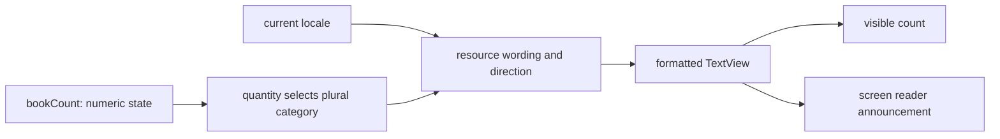

[מפת המעבדות]({{ '/android/topics/' | relative_url }})

{: .box-success}
בסוף המעבדה יהיה מסך קטן של מדף קריאה: כפתור עם סמל מוסיף ספר, קורא מסך יכול להכריז מה הכפתור עושה, הספירה משתנה לפי צורת היחיד/הרבים, והמסך פועל באנגלית ובעברית. נבדוק גם גופן גדול, מסך צר, מצב landscape וניגודיות.

## למה צריך לבדוק את כל זה?

סמל `+` מובן למי שרואה אותו, אך לקורא מסך דרוש שם פעולה. כפתור זעיר קשה ללחוץ גם אם הסמל ברור. טקסט שנקבע בפיקסלים או בתוך גובה קבוע עלול להיחתך כשמגדילים גופן. תרגום מחרוזות בלבד אינו מספיק אם האילוצים עדיין תלויים ב־`left`/`right`, ואם המספר 1 מוצג באותה צורת רבים כמו 2.

התחילו מענף `master` בפרויקט **topics** (`com.example.topics`):‏ Empty Views Activity ב־Java/XML עם View Binding. ענף הדוגמה הוא `codex/accessibility-adaptive`. קובץ חדש מוצג במלואו; בקובץ קיים מופיע שינוי ממוקד. כל כותרות המיקום להלן משתמשות בתצוגת **Android** של Android Studio.

## מסך אחד, שלוש דרכים להשתמש בו

נגישות אינה כפתור שאפשר להפעיל בסוף. אותה פעולה צריכה להיות ניתנת לגילוי במבט, במגע ובהאזנה. נפריד בין **סמל** שמצויר, **אזור מגע** שמקבל לחיצה, ו**שם פעולה** שקורא המסך אומר. הגדלת הסמל לבדה לא בהכרח מגדילה את אזור המגע; הוספת תיאור לבדה לא מונעת מטקסט להיחתך בגופן גדול.



לדוגמה, `getQuantityString(R.plurals.book_count, 2, 2)` משתמש ב־2 הראשון לבחירת קטגוריית הרבים ובשני למילוי placeholder, אם יש כזה במחרוזת שנבחרה. המילה "שניים" אינה תכונה של המספר ב־Java; היא החלטת שפה במשאבים. אחרי החלפת שפה נשאר **המספר** 2, אבל הניסוח, כיוון הפריסה ועץ ה־Views עשויים להשתנות. לכן שומרים מספר ומרנדרים מחדש, ולא שומרים את הטקסט `2 books`.

`dp` מתאים לממדי ממשק שאמורים להישאר דומים בצפיפויות שונות; `sp` מתאים לטקסט המכבד את העדפת גודל הגופן. `wrap_content` וגלילה נותנים לטקסט שהוגדל מקום אמיתי. `start` ו־`end` מתארים תחילת וסוף קריאה; `left` ו־`right` הם צדדים פיזיים. כפתור שמוצמד לתחילת שורה עובר צד בעברית, אבל אין להפוך באופן שרירותי תמונה או מספר.

{: .box-note}
בכל שינוי שאלו: מה יקרה כשלא רואים את הסמל, כשהאצבע לא מדויקת, וכשהטקסט מתארך? מסך נגיש מספק אותה משמעות במסלולים האלה. בדיקה עם TalkBack וגופן גדול יכולה לחשוף שני כשלים שונים באותו כפתור.

## עצרו ונבאו

מספר הספרים הוא 2. האם נכון לבנות תמיד את הטקסט על ידי חיבור המספר למילה קבועה? כתבו תחזית לפני פתיחת ההסבר, ואז הצביעו על המשתנה או התנאי בקוד שמצדיקים אותה.

<details markdown="1">
<summary>בדיקת ההבנה</summary>

לא. המספר בוחר את קטגוריית plural במשאבי השפה הנוכחית, ו־getQuantityString מעצבת את הטקסט המתאים. בשפות שונות אותו מספר יכול לבחור ניסוח שונה; מצב התוכנית נשאר מספר, והניסוח הוא אחריות משאבים.

</details>

## 1. מחרוזות ורבים באנגלית

ב־**app > res > values > strings.xml** החליפו את שם ברירת המחדל והוסיפו את המחרוזות. `plurals` מאפשר ל־Android לבחור צורה לפי מספר; הפרמטר השני ב־`getQuantityString` יספק את המספר שמוצג ב־`%1$d`.

```diff
 <resources>
-    <string name="app_name">topics</string>
+    <string name="app_name">Topics</string>
+    <string name="library_title">My reading shelf</string>
+    <string name="library_instruction">Add books and listen to the count with a screen reader. Try a larger font and a smaller screen.</string>
+    <string name="add_book">Add a book</string>
+    <string name="reset_books">Reset count</string>
+    <string name="switch_language">עברית</string>
+    <plurals name="book_count">
+        <item quantity="one">%1$d book</item>
+        <item quantity="other">%1$d books</item>
+    </plurals>
 </resources>
```

## 2. המשאבים בעברית

צרו ב־**app > res** תיקיית values ללוקאל עברי בשם `values-iw`, ובתוכה `strings.xml`. Android משתמש בקוד המשאב ההיסטורי `iw` לעברית; בזמן ריצה תג השפה עשוי להופיע כ־`he`. אם כותבים את הקובץ ב־`values-he` בפרויקט הזה, הבנייה עוברת אך התצוגה במכשיר הבדיקה נשארת באנגלית. [תיעוד שפות לאפליקציה של Android](https://developer.android.com/guide/topics/resources/app-languages) כולל את `iw` בדוגמת הגדרות השפות.

```xml
<?xml version="1.0" encoding="utf-8"?>
<resources>
    <string name="app_name">נושאים</string>
    <string name="library_title">מדף הקריאה שלי</string>
    <string name="library_instruction">הוסיפו ספרים והאזינו למספרם בקורא מסך. נסו גופן גדול ומסך קטן.</string>
    <string name="add_book">הוספת ספר</string>
    <string name="reset_books">איפוס הספירה</string>
    <string name="switch_language">English</string>
    <plurals name="book_count">
        <item quantity="one">ספר אחד</item>
        <item quantity="two">שני ספרים</item>
        <item quantity="other">%1$d ספרים</item>
    </plurals>
</resources>
```

ההכרעה `one`/`two`/`other` היא החלטת שפה. לכן אין לכתוב בקוד Java תנאי `if (count == 1)` עם טקסט עברי קשיח. בדקו בפועל 0, 1, 2 ו־3 ספרים.

## 3. סמל ושפות האפליקציה

צרו ב־**app > res > drawable** קובץ `ic_add.xml`. ה־path מצייר סמל בגודל 24dp; גודל אזור הלחיצה ייקבע **ב־ImageButton**, ולא לפי גודל הציור.

```xml
<?xml version="1.0" encoding="utf-8"?>
<vector xmlns:android="http://schemas.android.com/apk/res/android"
    android:width="24dp"
    android:height="24dp"
    android:viewportWidth="24"
    android:viewportHeight="24">
    <path
        android:fillColor="@android:color/white"
        android:pathData="M19,13H13V19H11V13H5V11H11V5H13V11H19V13Z" />
</vector>
```

צרו ב־**app > res > xml** את `locales_config.xml`. הרשימה מאפשרת לבחור שפת אפליקציה גם בהגדרות המערכת בגרסאות Android שתומכות בכך. `iw` כאן תואם לתיקיית המשאבים.

```xml
<?xml version="1.0" encoding="utf-8"?>
<locale-config xmlns:android="http://schemas.android.com/apk/res/android">
    <locale android:name="en" />
    <locale android:name="iw" />
</locale-config>
```

ב־**app > manifests > AndroidManifest.xml** הוסיפו ל־`application` את `localeConfig`, וגם את ה־service שמאפשר ל־AppCompat לשמור בחירת שפה במכשירי Android 12 ומטה. `android:supportsRtl="true"` כבר קיים בתבנית; השאירו אותו. [תיעוד Android לשפות אפליקציה](https://developer.android.com/guide/topics/resources/app-languages) מתאר את `autoStoreLocales` ואת השחזור שלו בגרסאות הישנות.

```diff
     <application
         ⁞
         android:label="@string/app_name"
+        android:localeConfig="@xml/locales_config"
         android:roundIcon="@mipmap/ic_launcher_round"
         android:supportsRtl="true"
         android:theme="@style/Theme.Topics">
+        <service
+            android:name="androidx.appcompat.app.AppLocalesMetadataHolderService"
+            android:enabled="false"
+            android:exported="false">
+            <meta-data
+                android:name="autoStoreLocales"
+                android:value="true" />
+        </service>
         <activity
```

## 4. מסך גמיש ונגיש

ב־**app > res > layout > activity_main.xml** השאירו את `ConstraintLayout` החיצוני עם `id="@+id/main"`, והחליפו את ה־`TextView` של Hello World ב־`ScrollView` הבא. אין גבהים קבועים לטקסט. `ScrollView` מאפשר להגיע לכל הפעולות גם כשהתוכן גבוה מהמסך. התוכן נמתח במסך צר אך נעצר ב־600dp במסך רחב.

```xml
    <ScrollView
        android:layout_width="0dp"
        android:layout_height="0dp"
        android:fillViewport="true"
        app:layout_constraintBottom_toBottomOf="parent"
        app:layout_constraintEnd_toEndOf="parent"
        app:layout_constraintStart_toStartOf="parent"
        app:layout_constraintTop_toTopOf="parent">

        <androidx.constraintlayout.widget.ConstraintLayout
            android:layout_width="match_parent"
            android:layout_height="wrap_content"
            android:minHeight="300dp"
            android:paddingStart="24dp"
            android:paddingEnd="24dp">

            <LinearLayout
                android:id="@+id/content"
                android:layout_width="0dp"
                android:layout_height="wrap_content"
                android:layout_marginTop="32dp"
                android:layout_marginBottom="32dp"
                android:orientation="vertical"
                app:layout_constraintEnd_toEndOf="parent"
                app:layout_constraintStart_toStartOf="parent"
                app:layout_constraintTop_toTopOf="parent"
                app:layout_constraintWidth_max="600dp">

                <TextView
                    android:layout_width="match_parent"
                    android:layout_height="wrap_content"
                    android:text="@string/library_title"
                    android:textAppearance="?attr/textAppearanceHeadlineMedium" />

                <TextView
                    android:layout_width="match_parent"
                    android:layout_height="wrap_content"
                    android:layout_marginTop="16dp"
                    android:text="@string/library_instruction"
                    android:textAppearance="?attr/textAppearanceBodyLarge" />

                <TextView
                    android:id="@+id/book_count"
                    android:layout_width="match_parent"
                    android:layout_height="wrap_content"
                    android:layout_marginTop="24dp"
                    android:accessibilityLiveRegion="polite"
                    android:textAppearance="?attr/textAppearanceTitleLarge"
                    tools:text="2 books" />

                <ImageButton
                    android:id="@+id/add_book"
                    android:layout_width="56dp"
                    android:layout_height="56dp"
                    android:layout_marginTop="16dp"
                    android:background="?attr/selectableItemBackgroundBorderless"
                    android:contentDescription="@string/add_book"
                    android:src="@drawable/ic_add"
                    app:tint="?attr/colorOnSurface" />

                <Button
                    android:id="@+id/reset_books"
                    android:layout_width="wrap_content"
                    android:layout_height="wrap_content"
                    android:layout_marginTop="8dp"
                    android:text="@string/reset_books" />

                <Button
                    android:id="@+id/switch_language"
                    android:layout_width="wrap_content"
                    android:layout_height="wrap_content"
                    android:layout_marginTop="8dp"
                    android:text="@string/switch_language" />
            </LinearLayout>
        </androidx.constraintlayout.widget.ConstraintLayout>
    </ScrollView>
```

ל־`TextView` יש טקסט שקורא המסך יודע לקרוא; אין צורך להוסיף לו `contentDescription` זהה. לסמל `+` חסר שם פעולה ולכן ל־`ImageButton` יש `contentDescription="@string/add_book"`. אזור הלחיצה הוא 56×56dp, מעל המלצת Android ל־48×48dp; הסמל עצמו קטן יותר. `accessibilityLiveRegion="polite"` מבקש להכריז על שינוי הספירה בלי לקטוע הכרזה חשובה. `start`/`end` משנים צד לפי כיוון השפה, ו־`colorOnSurface` נשען על צבעי ה־theme גם במצב כהה. [הנחיות הנגישות של Android ל־Views](https://developer.android.com/guide/topics/ui/accessibility/views/apps-views) מסבירות תיאור פעולה וגודל יעד מגע.

## 5. קושרים את הפעולות ל־View Binding

ב־**app > kotlin+java > com.example.topics > MainActivity** הוסיפו את שני הייבואים, את מפתח השחזור ואת המונה. המעבר בין שפות יוצר מחדש את ה־Activity; לכן נשמור את מספר הספרים ב־`Bundle` כדי שהתרגיל לא יאבד את הספירה בזמן בדיקת התרגום.

```diff
 import androidx.appcompat.app.AppCompatActivity;
+import androidx.appcompat.app.AppCompatDelegate;
 import androidx.core.graphics.Insets;
+import androidx.core.os.LocaleListCompat;
 ⁞
 public class MainActivity extends AppCompatActivity {
+    private static final String SAVED_BOOK_COUNT = "book_count";
     private ActivityMainBinding binding;
+    private int bookCount;
```

אחרי ה־listener הקיים של `ViewCompat.setOnApplyWindowInsetsListener`, הוסיפו את הקוד הבא בתוך `onCreate`. אם בתבנית `return insets;` מחובר לשורת `setPadding`, הפרידו לשתי שורות בלי לשנות את הפעולה. הכפתור השלישי בוחר את השפה השנייה דרך `AppCompatDelegate`; שתי הצורות `he` ו־`iw` מכוסות בבדיקת השפה הנוכחית.

```java
        if (savedInstanceState != null) {
            bookCount = savedInstanceState.getInt(SAVED_BOOK_COUNT);
        }
        binding.addBook.setOnClickListener(v -> {
            bookCount++;
            renderCount();
        });
        binding.resetBooks.setOnClickListener(v -> {
            bookCount = 0;
            renderCount();
        });
        binding.switchLanguage.setOnClickListener(v -> {
            String language = getResources().getConfiguration().getLocales().get(0).getLanguage();
            String nextLanguage = ("he".equals(language) || "iw".equals(language))
                    ? "en" : "he";
            AppCompatDelegate.setApplicationLocales(
                    LocaleListCompat.forLanguageTags(nextLanguage));
        });
        renderCount();
```

בסוף המחלקה, לפני `}`, הוסיפו את שתי המתודות. `getQuantityString` מקבל פעם אחת את המספר לבחירת הצורה ופעם נוספת כערך להצגה. אין לשמור `View` או טקסט מתורגם בשדה; אחרי שינוי שפה מציירים מחדש מתוך `bookCount`.

```java
    /**
     * Saves the numeric count before rotation or a locale change recreates the screen.
     *
     * @param outState restoration data; do not store translated text here
     */
    @Override
    protected void onSaveInstanceState(Bundle outState) {
        outState.putInt(SAVED_BOOK_COUNT, bookCount);
        super.onSaveInstanceState(outState);
    }

    /**
     * Formats the same numeric state using the current locale and plural category.
     * The quantity selects wording; the format argument supplies a displayed number.
     */
    private void renderCount() {
        binding.bookCount.setText(getResources().getQuantityString(
                // First count chooses the category; second fills any %1$d placeholder.
                R.plurals.book_count, bookCount, bookCount));
    }
```

בנו והפעילו. אם העברית נשארת באנגלית, בדקו קודם שהתיקייה נקראת `values-iw`, שה־APK החדש הותקן וששפת האפליקציה הוחלפה בפועל.

אם Lint מזהיר ש־`localeConfig` פועל רק מ־Android 13, זו אזהרת תאימות צפויה: הגדרת המערכת משמשת מ־API 33, ו־AppCompat מטפל בבחירת השפה בגרסאות הקודמות. אזהרות על צבעי `black`/`white` שאינם בשימוש שייכות לקובץ התבנית; אין צורך למחוק אותו כדי להשלים את המעבדה.

מעל `@Override` של `onCreate` הקיימת הוסיפו את ה־Javadoc הבא. אין להחליף את גוף המתודה או למחוק את טיפול ה־insets של התבנית:

```java
    /**
     * Creates the current Activity View tree and connects the screen's actions.
     *
     * @param savedInstanceState prior small UI snapshot, or null for a fresh launch
     */
```

## מסלול בדיקה שאפשר להדגים

1. באנגלית, לחצו על הסמל פעם ופעמיים: הציפייה היא `1 book`, ואז `2 books`. החזירו ל־0 ובדקו `0 books`.
2. הפעילו TalkBack בהגדרות הנגישות. עברו בסדר המיקוד: כותרת, הסבר, ספירה, סמל, איפוס ושפה. על הסמל צריך להישמע **Add a book** ולא רק “button” או “unlabeled”. לחיצה על הסמל צריכה לעדכן גם את ההכרזה על הספירה.
3. לחצו **עברית**. ודאו שהכותרת, הסמל, הכפתורים והספירה תורגמו, ושהכפתור עובר לצד ימין בגלל RTL. בדקו `ספר אחד`, `שני ספרים`, ואז `3 ספרים`. לחצו **English** ובדקו שהמונה נשאר באותו מספר.
4. במכשיר או אמולטור קטן ובמכשיר רחב, הגדילו את **Font size** בהגדרות. עברו גם ל־landscape. ודאו ששום שורה או כפתור אינם נחתכים, שאפשר להגיע לכל הפעולות בגלילה ושהתוכן אינו נמתח לרוחב כל מסך גדול. [Layout Validation של Android Studio](https://developer.android.com/studio/views/layout-editor) יכול להציג תצוגות בכמה גדלים ושפות.
5. הפעילו מצב כהה והריצו Accessibility Scanner. בדקו ניגודיות, גודל יעד מגע וסדר קריאה; תקנו ממצא קונקרטי לפני שמסיקים שהמסך נגיש. בדיקה אוטומטית אינה תחליף להאזנה למסלול ב־TalkBack.

{: .box-note}
בענף הדוגמה אומתו באמולטור שמות הפעולה באנגלית ובעברית, המעבר ל־RTL וצורות הרבים 0/1/2. בדיקת מסך קטן, גופן מוגדל ו־TalkBack היא חלק מהתרגול הידני שיש לבצע על מכשיר או אמולטור מתאים.

## שאלות הסבר

1. מה יקרה אם נשאיר `android:src` אך נסיר `contentDescription` מן הסמל? האם טקסט כפתור האיפוס צריך תיאור נוסף?
2. מה ההבדל בין 24dp של ציור הסמל לבין 56dp של אזור הלחיצה?
3. למה `paddingStart` עדיף על `paddingLeft` במסך שמתורגם לעברית?
4. למה מעבר שפה משחזר `bookCount` מתוך `Bundle`, אך לא שומר אותו לצמיתות אחרי Force stop?
