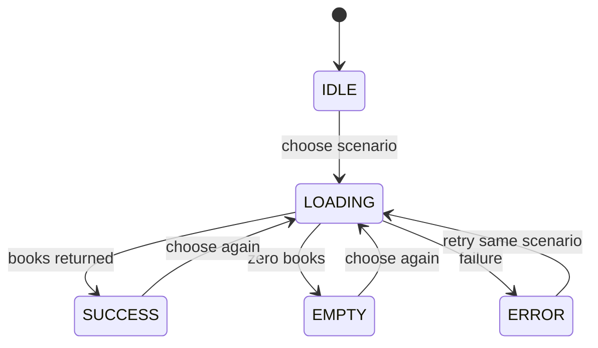
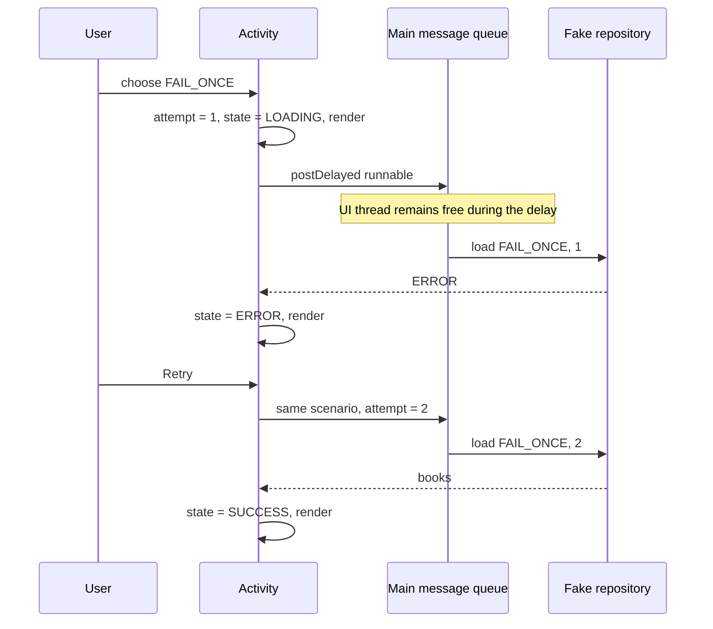

[מפת המעבדות]({{ '/android/topics/' | relative_url }})

{: .box-success}
בסוף המעבדה שלושה כפתורים יבקשו נתונים ממקור מדומה: רשימת ספרים, רשימה ריקה, או כשל בניסיון הראשון. בזמן טעינה יוצגו הודעה וסמן התקדמות, ולחיצה כפולה לא תתחיל בקשה שנייה. אחרי כשל, Retry יחזור על **אותה בקשה** ויצליח. סיבוב מסך לא יעלים תוצאה שכבר התקבלה ולא ישאיר callback שמעדכן Activity שנהרס.

## לפני הקוד: מהו מצב מסך?

טקסט כמו “Loading…” לבדו אינו מספיק. המסך צריך לדעת האם הוא ממתין, מציג נתונים, מציג ריק, או מציג כשל. כל מצב קובע **יחד** את ההודעה, הסמן, רשימת הספרים, כפתור Retry והיכולת להתחיל בקשה חדשה. אם כל View מתעדכן במקומות שונים בקוד, קל להשאיר כפתור Retry גלוי אחרי הצלחה או להציג רשימה ישנה בזמן שגיאה.



מתחילים מענף `master` בפרויקט **topics** (`com.example.topics`), עם Empty Views Activity,‏ Java/XML ו־View Binding. ענף התוצאה הוא `codex/ui-states-retry`. המקור במעבדה הוא `FakeBookRepository`: הוא מחזיר תוצאות קבועות כדי שאפשר יהיה לשחזר כל מצב בכיתה בלי שרת. הוא **אינו לקוח רשת**; אם מחליפים אותו ב־API או במסד נתונים, את העבודה האמיתית יש לבצע מחוץ ל־main thread. השיעור כאן הוא החוזה בין תוצאת המקור למצב המסך.

## עוקבים אחרי בקשה אחת עד הסוף

נניח שנבחר `FAIL_ONCE`. `scenario` עונה על "מה ביקשנו?", `attempt` על "איזה ניסיון זה?", ו־`state` על "מה מותר למסך להציג עכשיו?" בניסיון 1 נפרסם Loading ואז Error. Retry משאיר את התרחיש, מעלה רק את הניסיון ל־2 ומתחיל שוב. בחירת תרחיש חדש מתחילה ניסיון 1. אם היינו מעלים את הניסיון גם אחרי סיבוב, הסיבוב היה הופך בטעות לפעולת Retry.



ה־`Runnable` הוא פעולה שנמסרת לביצוע מאוחר יותר; ביטוי lambda מתאר את הפעולה ואינו מבצע אותה מיד. `postDelayed` מכניסה אותה לתור של ה־Looper שבחרנו. כאן זה תור ה־main thread: ההמתנה אינה חוסמת אותו, אבל **גוף הפעולה כן רץ בו** כשהתור מגיע אליה. לכן השהיה מדומה אינה הוכחה שעבודה חוסמת תתבצע ברקע.

`render` מרכזת כללים שאמורים להתקיים תמיד: Retry גלוי רק בשגיאה, רשימה גלויה רק בהצלחה, ואין בקשה חדשה בטעינה. אלה כללי עקביות של המסך. כיבוי הכפתורים מספק משוב למשתמש; בדיקת `state` ב־`choose` מגינה גם אם פעולה נקראת ישירות בקוד. ב־`onDestroy` מסירים את הפעולה הישנה מן התור, משום שהיא מחזיקה הפניה ל־Activity הישן. ה־Activity החדש רשאי לתזמן מחדש את הניסוי מתוך צילום המצב, בלי להשתמש ב־binding הישן.

## עצרו ונבאו

בתרחיש FAIL_ONCE טעינה נכשלה. מה יקרה אם Retry תאפס את attempt ל־1? כתבו תחזית לפני פתיחת ההסבר, ואז הצביעו על המשתנה או התנאי בקוד שמצדיקים אותה.

<details markdown="1">
<summary>בדיקת ההבנה</summary>

נישאר בכשל הראשון שוב ושוב. Retry משתמשת באותו scenario ומתקדמת לניסיון הבא; בחירת scenario חדשה מתחילה רצף חדש. אלה שתי פעולות שונות גם אם שתיהן מסתיימות במסך LOADING.

</details>

## 1. מקור נתונים צפוי

צרו Java Class בשם `FakeBookRepository` בתוך **app > kotlin+java > com.example.topics**. `Scenario` הוא סוג הבקשה; `Result` מחזיר סטטוס ומערך ספרים. הכשל ב־`FAIL_ONCE` מתרחש רק כאשר `attempt == 1`, ולכן Retry הוא תרגיל שאפשר להוכיח בו התאוששות.

```java
package com.example.topics;

/** Predictable responses let students exercise every UI outcome without a server. */
public final class FakeBookRepository {
    public enum Scenario { BOOKS, EMPTY, FAIL_ONCE }
    public enum Status { SUCCESS, ERROR }

    public static final class Result {
        public final Status status;
        public final String[] books;

        /**
         * Bundles a source outcome with its payload; an empty successful payload is valid.
         *
         * @param status success or failure of the source operation
         * @param books returned titles, possibly an empty array
         */
        private Result(Status status, String[] books) {
            this.status = status;
            this.books = books;
        }
    }

    /**
     * Produces a deterministic source result without network or disk I/O.
     *
     * @param scenario response family selected by the user
     * @param attempt one-based attempt; FAIL_ONCE fails only for 1
     * @return outcome to translate into ERROR, EMPTY, or SUCCESS in the UI
     */
    public Result load(Scenario scenario, int attempt) {
        if (scenario == Scenario.FAIL_ONCE && attempt == 1) {
            return new Result(Status.ERROR, new String[0]);
        }
        if (scenario == Scenario.EMPTY) {
            return new Result(Status.SUCCESS, new String[0]);
        }
        return new Result(Status.SUCCESS, new String[]{"Ada", "Grace", "Linus"});
    }
}
```

שימו לב: `SUCCESS` ממקור הנתונים עם מערך באורך 0 אינו שגיאה. ה־Activity יתרגם אותו למצב UI בשם `EMPTY`. גם “אין ספרים” הוא תשובה תקינה שיש להציג בבירור.

## 2. מחרוזות לכל תוצאה

ב־**app > res > values > strings.xml** הוסיפו את הטקסטים. תיאור השגיאה מציע פעולה שהמשתמש יכול לבצע, בלי להציג לו פרטי מימוש או stack trace.

```diff
 <resources>
     <string name="app_name">topics</string>
+    <string name="ui_states_title">Loading is only one state</string>
+    <string name="ui_states_instruction">Choose a response. The fake repository answers after a short delay.</string>
+    <string name="load_books">Load books</string>
+    <string name="load_empty">Load an empty shelf</string>
+    <string name="load_fail_once">Fail once, then succeed</string>
+    <string name="retry">Retry</string>
+    <string name="state_idle">Choose a result to load.</string>
+    <string name="state_loading">Loading…</string>
+    <string name="state_empty">The shelf is empty.</string>
+    <string name="state_error">Could not load the shelf. Try again.</string>
+    <string name="state_success">Books loaded:</string>
 </resources>
```

## 3. מקום לתוכן ולמשוב

ב־**app > res > layout > activity_main.xml** השאירו את `ConstraintLayout` החיצוני עם `id="@+id/main"`. החליפו רק את ה־`TextView` של Hello World ב־`ScrollView` הבא. ארבעת ה־Views התחתונים הם הפלט: `loading`,‏ `status`,‏ `book_list` ו־`retry`. מצבם ההתחלתי ב־XML מונע הבזק של תוכן ישן לפני שה־Activity מצייר את המצב הראשון.

```xml
    <ScrollView
        android:layout_width="0dp"
        android:layout_height="0dp"
        app:layout_constraintBottom_toBottomOf="parent"
        app:layout_constraintEnd_toEndOf="parent"
        app:layout_constraintStart_toStartOf="parent"
        app:layout_constraintTop_toTopOf="parent">

        <LinearLayout
            android:layout_width="match_parent"
            android:layout_height="wrap_content"
            android:orientation="vertical"
            android:padding="24dp">

            <TextView
                android:layout_width="match_parent"
                android:layout_height="wrap_content"
                android:text="@string/ui_states_title"
                android:textSize="22sp" />

            <TextView
                android:layout_width="match_parent"
                android:layout_height="wrap_content"
                android:layout_marginTop="8dp"
                android:text="@string/ui_states_instruction" />

            <Button
                android:id="@+id/load_books"
                android:layout_width="match_parent"
                android:layout_height="wrap_content"
                android:layout_marginTop="24dp"
                android:text="@string/load_books" />

            <Button
                android:id="@+id/load_empty"
                android:layout_width="match_parent"
                android:layout_height="wrap_content"
                android:text="@string/load_empty" />

            <Button
                android:id="@+id/load_fail_once"
                android:layout_width="match_parent"
                android:layout_height="wrap_content"
                android:text="@string/load_fail_once" />

            <ProgressBar
                android:id="@+id/loading"
                android:layout_width="wrap_content"
                android:layout_height="wrap_content"
                android:layout_marginTop="24dp"
                android:visibility="gone" />

            <TextView
                android:id="@+id/status"
                android:layout_width="match_parent"
                android:layout_height="wrap_content"
                android:layout_marginTop="16dp"
                android:accessibilityLiveRegion="polite"
                android:text="@string/state_idle"
                android:textSize="18sp" />

            <TextView
                android:id="@+id/book_list"
                android:layout_width="match_parent"
                android:layout_height="wrap_content"
                android:layout_marginTop="8dp"
                android:visibility="gone" />

            <Button
                android:id="@+id/retry"
                android:layout_width="match_parent"
                android:layout_height="wrap_content"
                android:layout_marginTop="16dp"
                android:text="@string/retry"
                android:visibility="gone" />
        </LinearLayout>
    </ScrollView>
```

ה־`ScrollView` מונע מהכפתור התחתון להיחתך במסך קטן. `accessibilityLiveRegion="polite"` מאפשר לקורא מסך להכריז על שינוי ב־status. אין צורך לשים `contentDescription` על TextView שכבר מכיל את ההודעה.

## 4. מצב מפורש ב־MainActivity

ב־**app > kotlin+java > com.example.topics > MainActivity** הוסיפו ייבואים, מפתחות, enum ושדות. `UiState` מתאר **מה המסך מציג**; `Scenario` מתאר **מה ביקשנו מן המקור**. אלו שאלות שונות: תרחיש `FAIL_ONCE` עובר מ־`LOADING` ל־`ERROR`, אחר כך שוב ל־`LOADING` ולבסוף ל־`SUCCESS`.

```diff
 import android.os.Bundle;
+import android.os.Handler;
+import android.os.Looper;
+import android.view.View;
 ⁞
 public class MainActivity extends AppCompatActivity {
+    private static final String STATE_KEY = "ui_state";
+    private static final String SCENARIO_KEY = "scenario";
+    private static final String ATTEMPT_KEY = "attempt";
+    private static final String BOOKS_KEY = "books";
+
+    private enum UiState { IDLE, LOADING, EMPTY, ERROR, SUCCESS }
+
     private ActivityMainBinding binding;
+    private final Handler handler = new Handler(Looper.getMainLooper());
+    private final FakeBookRepository repository = new FakeBookRepository();
+    private Runnable pendingLoad;
+    private UiState state = UiState.IDLE;
+    private FakeBookRepository.Scenario scenario = FakeBookRepository.Scenario.BOOKS;
+    private int attempt;
+    private String[] books = new String[0];
```

בסוף `onCreate`, אחרי ה־listener הקיים של WindowInsets, הוסיפו את השחזור ואת המאזינים. אם `return insets;` מחובר לשורת `setPadding` בתבנית שלכם, הפרידו לשתי שורות בלבד. ב־`Bundle` נשמרים המצב, התרחיש, מספר הניסיון והספרים שכבר הוצגו. אם סובבנו מסך בזמן `LOADING`, ה־Activity החדש מתזמן מחדש את **אותו ניסיון**, בלי לספור Retry נוסף.

```java
        if (savedInstanceState != null) {
            state = UiState.valueOf(savedInstanceState.getString(STATE_KEY, UiState.IDLE.name()));
            scenario = FakeBookRepository.Scenario.valueOf(savedInstanceState.getString(
                    SCENARIO_KEY, FakeBookRepository.Scenario.BOOKS.name()));
            attempt = savedInstanceState.getInt(ATTEMPT_KEY);
            books = savedInstanceState.getStringArray(BOOKS_KEY);
            if (books == null) {
                books = new String[0];
            }
        }
        binding.loadBooks.setOnClickListener(v -> choose(FakeBookRepository.Scenario.BOOKS));
        binding.loadEmpty.setOnClickListener(v -> choose(FakeBookRepository.Scenario.EMPTY));
        binding.loadFailOnce.setOnClickListener(v -> choose(FakeBookRepository.Scenario.FAIL_ONCE));
        binding.retry.setOnClickListener(v -> {
            if (state != UiState.ERROR) {
                return;
            }
            attempt++;
            state = UiState.LOADING;
            scheduleLoad();
        });
        if (state == UiState.LOADING) {
            scheduleLoad();
        } else {
            render();
        }
```

הוסיפו את `choose` ואת `scheduleLoad` אחרי `onCreate`. ההשהיה של 1500ms נועדה רק להפוך את מצב הטעינה לגלוי. אין כאן קריאת רשת. `Handler` מריץ את ה־Runnable על ה־main thread; **אין להחליף** את `repository.load` בקוד HTTP חוסם באותו Runnable. כשהתוצאה מגיעה, ממפים אותה ל־`ERROR`,‏ `EMPTY` או `SUCCESS`, ואז מציירים מחדש.

```java
    /**
     * Starts a new scenario only when no load is in flight.
     *
     * @param selected scenario to remember for both this request and its Retry
     */
    private void choose(FakeBookRepository.Scenario selected) {
        if (state == UiState.LOADING) {
            return;
        }
        scenario = selected;
        attempt = 1;
        state = UiState.LOADING;
        scheduleLoad();
    }

    /**
     * Publishes loading now and queues the current deterministic attempt for later.
     * Runs on the main thread; the delayed callback must never perform blocking I/O.
     */
    private void scheduleLoad() {
        render();
        pendingLoad = () -> {
            // This callback is now executing, not waiting in the queue.
            pendingLoad = null;
            FakeBookRepository.Result result = repository.load(scenario, attempt);
            books = result.books;
            if (result.status == FakeBookRepository.Status.ERROR) {
                state = UiState.ERROR;
            // A successful request can contain no books; that is not a failure.
            } else if (books.length == 0) {
                state = UiState.EMPTY;
            } else {
                state = UiState.SUCCESS;
            }
            render();
        };
        handler.postDelayed(pendingLoad, 1500);
    }
```

הוסיפו את `render` כמתודה היחידה שמחליטה מה גלוי ומה לחיץ. שלושת כפתורי הבקשה מושבתים בזמן `LOADING`, וכפתור Retry גלוי רק ב־`ERROR`. ב־`SUCCESS` מציגים את הנתונים שהוחזרו, ולא טקסט הצלחה ריק.

```java
    /**
     * Projects the current state onto every output View without changing the model.
     * All visibility and enabled rules belong here so no stale UI combination remains.
     */
    private void render() {
        boolean loading = state == UiState.LOADING;
        binding.loadBooks.setEnabled(!loading);
        binding.loadEmpty.setEnabled(!loading);
        binding.loadFailOnce.setEnabled(!loading);
        binding.loading.setVisibility(loading ? View.VISIBLE : View.GONE);
        binding.retry.setVisibility(state == UiState.ERROR ? View.VISIBLE : View.GONE);
        binding.bookList.setVisibility(state == UiState.SUCCESS ? View.VISIBLE : View.GONE);
        switch (state) {
            case IDLE:
                binding.status.setText(R.string.state_idle);
                break;
            case LOADING:
                binding.status.setText(R.string.state_loading);
                break;
            case EMPTY:
                binding.status.setText(R.string.state_empty);
                break;
            case ERROR:
                binding.status.setText(R.string.state_error);
                break;
            case SUCCESS:
                binding.status.setText(R.string.state_success);
                binding.bookList.setText(String.join("\n", books));
                break;
        }
    }
```

לבסוף הוסיפו שמירת מצב וניקוי. הסרת ה־callback ב־`onDestroy` מונעת מה־Activity הישן לעדכן את ה־binding שלו אחרי שהמסך נוצר מחדש. אם המצב שנשמר היה `LOADING`, ה־Activity החדש יתזמן את הניסוי מחדש כפי שראינו ב־`onCreate`.

```java
    /**
     * Records the request identity and displayed result for recreation.
     *
     * @param outState destination for this small UI restoration snapshot
     */
    @Override
    protected void onSaveInstanceState(Bundle outState) {
        outState.putString(STATE_KEY, state.name());
        outState.putString(SCENARIO_KEY, scenario.name());
        outState.putInt(ATTEMPT_KEY, attempt);
        outState.putStringArray(BOOKS_KEY, books);
        super.onSaveInstanceState(outState);
    }

    /**
     * Removes this Activity's queued callback so it cannot update an obsolete binding.
     */
    @Override
    protected void onDestroy() {
        if (pendingLoad != null) {
            // Cancel the callback owned by this Activity, not the new instance.
            handler.removeCallbacks(pendingLoad);
        }
        super.onDestroy();
    }
```

מעל `@Override` של `onCreate` הקיימת הוסיפו את ה־Javadoc הבא. אין להחליף את גוף המתודה או למחוק את טיפול ה־insets של התבנית:

```java
    /**
     * Creates the current Activity View tree and connects the screen's actions.
     *
     * @param savedInstanceState prior small UI snapshot, or null for a fresh launch
     */
```

## בודקים כל מעבר, כולל כשל

| פעולה | מה צריך לראות | מה לא צריך להישאר |
|---:|---:|---:|
| פתיחה ראשונה | הוראה לבחור תוצאה | Spinner, רשימה, Retry |
| לחיצה על **Load books** | Loading ואז שלושה שמות | Retry |
| לחיצה על **Load an empty shelf** | הודעת ריק | רשימה ישנה, Retry |
| לחיצה על **Fail once, then succeed** | Loading ואז הודעת שגיאה ו־Retry | שמות ספרים ישנים |
| לחיצה על **Retry** | Loading ואז שלושה שמות | הודעת השגיאה ו־Retry |

בזמן Loading נסו ללחוץ פעמיים מהר על אותו כפתור או על כפתור תרחיש אחר. הכפתורים צריכים להיות מושבתים; הניסיון הראשון של `FAIL_ONCE` צריך עדיין להסתיים בשגיאה אחת, ורק Retry יעביר אותו להצלחה. סובבו את המכשיר כשהתוצאה גלויה: אותה תוצאה צריכה להישאר. חזרו על הבדיקה בזמן טעינה וודאו שהתוצאה הסופית מופיעה פעם אחת וללא קריסה.

{: .box-note}
בענף הדוגמה אומתו באמולטור המצבים Loading,‏ Error,‏ Retry→Success ו־Empty, השבתת כפתור בזמן טעינה, והצגת Success אחרי סיבוב. זהו מקור מדומה מכוון; תרגיל המשך הוא לחבר את אותו חוזה ל־API או למסד ולבדוק כשל אמיתי ורשימה ריקה בלי לשנות את כללי `render`.

## שאלות הסבר

1. למה `EMPTY` הוא מצב אחר מ־`ERROR`, אף שבשניהם אין ספרים על המסך?
2. מה יקרה אם נציג Retry בשגיאה אך לא נשמור את `scenario` ואת `attempt`?
3. למה אין לבצע HTTP ישירות ב־Runnable של ה־`Handler` הזה?
4. אילו שורות יש להוסיף ל־`render` אם רוצים גם מצב **נתונים ישנים זמינים בזמן רענון**?
