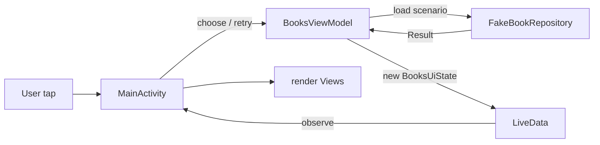
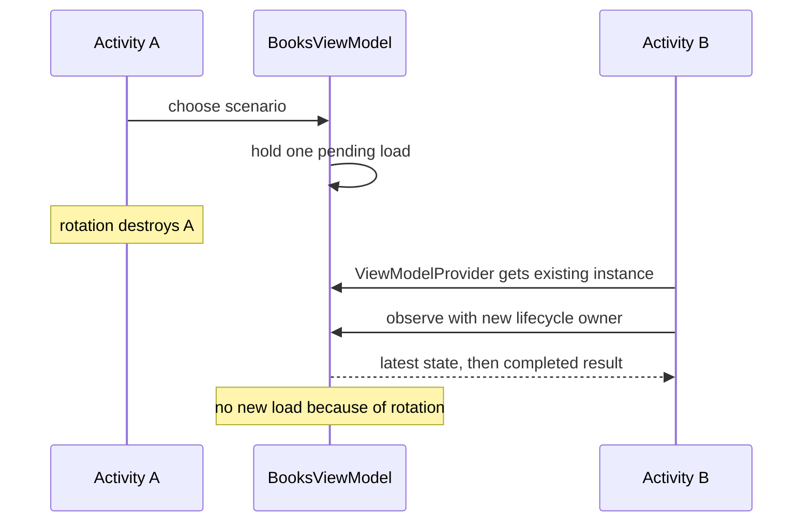

[מפת המעבדות]({{ '/android/topics/' | relative_url }}) · [המעבדה הקודמת: מצבי UI]({{ '/android/topics/03-ui-states-retry/' | relative_url }})

{: .box-success}
בסוף המעבדה ההתנהגות מן הפרק הקודם תישאר זהה — Loading,‏ Empty,‏ Error,‏ Success ו־Retry — אך ה־Activity יפסיק לנהל בעצמו בקשה ומצב. `BooksViewModel` יחזיק את מקור האמת, `LiveData` תודיע ל־Activity על צילום מצב חדש, ו־`FakeBookRepository` ימשיך לענות על בקשות. סיבוב מסך בזמן טעינה לא יתחיל בקשה נוספת.

## נקודת התחלה ומפת אחריות

התחילו מענף **`codex/ui-states-retry`**, אחרי [מעבדה 03]({{ '/android/topics/03-ui-states-retry/' | relative_url }}). ענף התוצאה הוא **`codex/viewmodel-repository`**. השוו את שני הענפים כדי לראות refactoring של מסך שכבר עובד. אין שינוי ב־XML או במחרוזות.

| שכבה | אחריות אחרי השינוי | מה אינה עושה |
|---:|---:|---:|
| `MainActivity` | מוסרת פעולות משתמש ומציירת `BooksUiState` | אינה סופרת ניסיונות או מחליטה אם תוצאה ריקה היא שגיאה |
| `BooksViewModel` | מחזיקה מצב, תרחיש, ניסיון ובקשה; ממפה תוצאה למצב | אינה מחזיקה `TextView` או `binding` |
| `FakeBookRepository` | מחזירה תוצאה לתרחיש שנבחר | אינה משנה Views או מחליטה מה גלוי |



המסך שולח **פעולה**, ה־ViewModel מחליטה על המעבר, והמסך מצייר **צילום מצב** חדש. [תיעוד Android ל־LiveData](https://developer.android.com/topic/libraries/architecture/livedata) מתאר Observer שרשום עם `LifecycleOwner`; [תיעוד שמירת מצב](https://developer.android.com/topic/libraries/architecture/saving-states) מסביר ש־ViewModel שורדת שינוי תצורה אך לא הריגת תהליך.

## למה להעביר אחריות אם המסך כבר עובד?

בפרק 03 ה־Activity הייתה גם בעלת הנתונים וגם בעלת ה־Views. אחרי סיבוב נדרש לשחזר בקשה ולתזמן אותה מחדש. כאן משנים את **מי שחי מספיק זמן** להחזיק את הבקשה: `ViewModelProvider` משייכת את ה־ViewModel לבעלים מוגדר, ומחזירה אותה גם ל־Activity החדש אחרי שינוי תצורה. כתיבת `new BooksViewModel()` בתוך `onCreate` הייתה יוצרת מופע חדש בכל פעם ומבטלת את היתרון הזה.



`LiveData<BooksUiState>` אינה שרשור רקע. היא דרך למסור ערכי מצב לצופה שמחזור חייו ידוע. ה־Activity הפעיל מקבל את הערך האחרון; observer של Activity שנהרס מוסר אוטומטית. `MutableLiveData` פרטית מאפשרת לבעלת המצב לפרסם ערך, ואילו טיפוס ההחזרה הציבורי `LiveData` מגביל את הממשק של הקורא לצפייה. זהו שימוש בהסתרת מידע ב־Java, ולא רק קיצור קוד.

גם `final` לבדו אינו הופך מערך לבלתי משתנה: הוא אוסר להחליף את ההפניה, אבל עדיין מאפשר לשנות תא. לכן הבנאי מעתיק את הקלט, ו־`getBooks` מחזירה עותק. אם המסך ישנה את המערך שקיבל, צילום המצב המקורי יישאר כפי שפורסם. ההעתקה כאן שטחית ומספיקה ל־`String`, שאינו ניתן לשינוי; במודל עם אובייקטים ניתנים לשינוי נצטרך לחשוב גם עליהם.

{: .box-note}
ה־Repository עונה לשאלה מאיפה הנתון מגיע; ה־ViewModel מחליטה מה תוצאתו אומרת למסך; ה־Activity מחליטה איך להציג את המצב ב־Views. ה־ViewModel אינה מחזיקה binding, מפני שהיא יכולה לשרוד את עץ ה־Views הזה. [תיעוד ViewModel של Android](https://developer.android.com/topic/libraries/architecture/viewmodel) מסביר את היקף החיים והניקוי.

## עצרו ונבאו

המסך הסתובב בזמן טעינה. האם Activity החדשה צריכה לקרוא שוב choose כדי להראות את התוצאה? כתבו תחזית לפני פתיחת ההסבר, ואז הצביעו על המשתנה או התנאי בקוד שמצדיקים אותה.

<details markdown="1">
<summary>בדיקת ההבנה</summary>

לא. היא מקבלת את ViewModel הקיימת ונרשמת לתצפית עם בעל מחזור החיים החדש. הטעינה נשארת בבעלות ViewModel, וה־Activity רק מציגה את המצב. קריאה חוזרת הייתה מתחילה פעולה עסקית בגלל שינוי תצוגה.

</details>

## 1. מוסיפים שתי תלויות

ב־**Gradle Scripts > libs.versions.toml** הוסיפו גרסת Lifecycle ושתי ספריות. השאירו את תלויות התבנית ואת `test`/`androidTest` כפי שהן.

```diff
 [versions]
 ⁞
 constraintlayout = "2.2.2"
+lifecycle = "2.11.0"
 ⁞
 [libraries]
 ⁞
 constraintlayout = { group = "androidx.constraintlayout", name = "constraintlayout", version.ref = "constraintlayout" }
+lifecycle-viewmodel = { group = "androidx.lifecycle", name = "lifecycle-viewmodel", version.ref = "lifecycle" }
+lifecycle-livedata = { group = "androidx.lifecycle", name = "lifecycle-livedata", version.ref = "lifecycle" }
```

ב־**Gradle Scripts > build.gradle.kts (Module :app)** הוסיפו את שתי השורות תחת `dependencies`, ואז בצעו Gradle Sync לפני שמכניסים מחלקות שמייבאות `ViewModel` או `LiveData`.

```diff
     implementation(libs.constraintlayout)
+    implementation(libs.lifecycle.viewmodel)
+    implementation(libs.lifecycle.livedata)
     implementation(libs.material)
```

## 2. צילום מצב אחד שאי אפשר לשנות מאחורי גבו של המסך

צרו Java Class בשם `BooksUiState` ב־**app > kotlin+java > com.example.topics**. במקום enum ועוד מערך נפרד ב־Activity, האובייקט מאגד את סוג המצב עם הספרים שלו. הבנאי וה־getter מעתיקים את המערך, כך שקוד שקיבל אותו לא יוכל לשנות בדיעבד צילום מצב שכבר פורסם.

```java

package com.example.topics;

/** One immutable snapshot containing everything the screen needs to render. */
public final class BooksUiState {
    public enum Kind { IDLE, LOADING, EMPTY, ERROR, SUCCESS }

    public final Kind kind;
    private final String[] books;

    /**
     * Creates a snapshot independent of the caller's array.
     *
     * @param kind what the screen should display
     * @param books payload elements copied on entry
     */
    private BooksUiState(Kind kind, String[] books) {
        this.kind = kind;
        // Copy on entry: the caller must not rewrite a published snapshot.
        this.books = books.clone();
    }

    /**
     * Creates a state with no displayed books.
     *
     * @param kind IDLE, LOADING, EMPTY, or ERROR in this lab
     * @return a new snapshot with an empty payload
     */
    public static BooksUiState of(Kind kind) {
        return new BooksUiState(kind, new String[0]);
    }

    /**
     * Creates the successful snapshot from returned book data.
     *
     * @param books payload elements to copy into the snapshot
     * @return a SUCCESS state independent of the input array
     */
    public static BooksUiState success(String[] books) {
        return new BooksUiState(Kind.SUCCESS, books);
    }

    /**
     * Returns a defensive copy so a caller cannot mutate the published state.
     *
     * @return a separate array containing this snapshot's payload elements
     */
    public String[] getBooks() {
        // Copy on exit: observers receive data, not permission to mutate our state.
        return books.clone();
    }
}
```

## 3. מעבירים את ההחלטות אל BooksViewModel

צרו Java Class בשם `BooksViewModel` באותה חבילה. `MutableLiveData` נשארת פרטית; `getState()` מחזירה רק `LiveData`, כדי שה־Activity תוכל **לצפות** אך לא לקרוא `setValue`. `choose` ו־`retry` הן נקודות הכניסה לפעולות המשתמש. `onCleared` מבטל בקשה מדומה כשה־ViewModel באמת מסתיימת; הוא אינו מופעל רק בגלל סיבוב מסך.

```java

package com.example.topics;

import android.os.Handler;
import android.os.Looper;

import androidx.lifecycle.LiveData;
import androidx.lifecycle.MutableLiveData;
import androidx.lifecycle.ViewModel;

/** Owns a screen's state and request while Activities come and go. */
public final class BooksViewModel extends ViewModel {
    private final Handler handler = new Handler(Looper.getMainLooper());
    private final FakeBookRepository repository = new FakeBookRepository();
    private final MutableLiveData<BooksUiState> state =
            new MutableLiveData<>(BooksUiState.of(BooksUiState.Kind.IDLE));
    private FakeBookRepository.Scenario scenario = FakeBookRepository.Scenario.BOOKS;
    private int attempt;
    private Runnable pendingLoad;

    /**
     * Exposes lifecycle-aware observation while keeping publication private.
     *
     * @return read-only API for the latest screen snapshot
     */
    public LiveData<BooksUiState> getState() {
        return state;
    }

    /**
     * Accepts a new scenario only outside LOADING and resets its attempt count.
     *
     * @param selected scenario retained for a later Retry
     */
    public void choose(FakeBookRepository.Scenario selected) {
        if (currentKind() == BooksUiState.Kind.LOADING) {
            return;
        }
        scenario = selected;
        attempt = 1;
        scheduleLoad();
    }

    /**
     * Repeats the remembered failed scenario; other states ignore this action.
     */
    public void retry() {
        if (currentKind() != BooksUiState.Kind.ERROR) {
            return;
        }
        attempt++;
        scheduleLoad();
    }

    /**
     * Reads the current snapshot kind, using IDLE if no value exists yet.
     *
     * @return the state used to guard incoming actions
     */
    private BooksUiState.Kind currentKind() {
        BooksUiState current = state.getValue();
        return current == null ? BooksUiState.Kind.IDLE : current.kind;
    }

    /**
     * Publishes LOADING and queues one nonblocking fake response on the main thread.
     * The callback belongs to this ViewModel, so rotation does not reschedule it.
     */
    private void scheduleLoad() {
        state.setValue(BooksUiState.of(BooksUiState.Kind.LOADING));
        pendingLoad = () -> {
            pendingLoad = null;
            FakeBookRepository.Result result = repository.load(scenario, attempt);
            if (result.status == FakeBookRepository.Status.ERROR) {
                state.setValue(BooksUiState.of(BooksUiState.Kind.ERROR));
            } else if (result.books.length == 0) {
                state.setValue(BooksUiState.of(BooksUiState.Kind.EMPTY));
            } else {
                state.setValue(BooksUiState.success(result.books));
            }
        };
        // This queue is still the UI queue; delaying is not background I/O.
        handler.postDelayed(pendingLoad, 1500);
    }

    /**
     * Cancels owned queued work when this ViewModel is permanently discarded.
     * A configuration change alone does not trigger this cleanup.
     */
    @Override
    protected void onCleared() {
        if (pendingLoad != null) {
            handler.removeCallbacks(pendingLoad);
        }
    }
}
```

ה־`Handler` משאיר את ההשהיה המדומה מן הפרק הקודם. הוא רץ על ה־main thread, ולכן אין להכניס לתוכו קריאת HTTP או שאילתת מסד חוסמת. כשנחליף את המקור המדומה במקור אמיתי, ה־Repository תבצע I/O ברקע ותחזיר תוצאה ל־ViewModel.

## 4. MainActivity מוסרת פעולות וצופה במצב

ב־**app > kotlin+java > com.example.topics > MainActivity** הסירו את שדות ה־`Handler`, ה־Repository, התרחיש, הניסיון, הספרים ומפתחות ה־`Bundle`. גם `enum UiState` הפנימי עובר ל־`BooksUiState.Kind`. הוסיפו במקומם שדה ViewModel וייבוא:

```diff
 import android.os.Bundle;
-import android.os.Handler;
-import android.os.Looper;
 import android.view.View;
 ⁞
 import androidx.core.view.WindowInsetsCompat;
+import androidx.lifecycle.ViewModelProvider;
 ⁞
 public class MainActivity extends AppCompatActivity {
-    private static final String STATE_KEY = "ui_state";
-    private static final String SCENARIO_KEY = "scenario";
-    private static final String ATTEMPT_KEY = "attempt";
-    private static final String BOOKS_KEY = "books";
-
-    private enum UiState { IDLE, LOADING, EMPTY, ERROR, SUCCESS }
-
     private ActivityMainBinding binding;
-    private final Handler handler = new Handler(Looper.getMainLooper());
-    private final FakeBookRepository repository = new FakeBookRepository();
-    private Runnable pendingLoad;
-    private UiState state = UiState.IDLE;
-    private FakeBookRepository.Scenario scenario = FakeBookRepository.Scenario.BOOKS;
-    private int attempt;
-    private String[] books = new String[0];
+    private BooksViewModel viewModel;
```

בתוך `onCreate`, אחרי ה־listener של WindowInsets, הסירו את בלוק שחזור ה־`Bundle` ואת המאזינים הישנים; במקומם הוסיפו את הקטע הבא. `ViewModelProvider(this)` מחזיר את אותו ViewModel אחרי סיבוב. `observe(this, this::render)` מוסר את המצב האחרון ל־Activity החדש, ומפסיק למסור עדכונים כשה־Activity הישן נהרס.

```java
        viewModel = new ViewModelProvider(this).get(BooksViewModel.class);
        binding.loadBooks.setOnClickListener(v -> viewModel.choose(FakeBookRepository.Scenario.BOOKS));
        binding.loadEmpty.setOnClickListener(v -> viewModel.choose(FakeBookRepository.Scenario.EMPTY));
        binding.loadFailOnce.setOnClickListener(v -> viewModel.choose(FakeBookRepository.Scenario.FAIL_ONCE));
        binding.retry.setOnClickListener(v -> viewModel.retry());
        viewModel.getState().observe(this, this::render);
```

מחקו מ־`MainActivity` את המתודות הישנות `choose`,‏ `scheduleLoad`,‏ `onSaveInstanceState` ו־`onDestroy`: האחריות עברה ל־ViewModel או שאינה נחוצה עוד לשחזור סיבוב. `render` נשארת ב־Activity כי היא נוגעת ב־Views. שנו רק את ההפניות למצב שהתקבל:


-    private void render() {
-        boolean loading = state == UiState.LOADING;
+    private void render(BooksUiState state) {
+        boolean loading = state.kind == BooksUiState.Kind.LOADING;
         binding.loadBooks.setEnabled(!loading);
         ⁞
-        binding.retry.setVisibility(state == UiState.ERROR ? View.VISIBLE : View.GONE);
-        binding.bookList.setVisibility(state == UiState.SUCCESS ? View.VISIBLE : View.GONE);
-        switch (state) {
+        binding.retry.setVisibility(state.kind == BooksUiState.Kind.ERROR ? View.VISIBLE : View.GONE);
+        binding.bookList.setVisibility(state.kind == BooksUiState.Kind.SUCCESS ? View.VISIBLE : View.GONE);
+        switch (state.kind) {
             ⁞
             case SUCCESS:
                 binding.status.setText(R.string.state_success);
-                binding.bookList.setText(String.join("\n", books));
+                binding.bookList.setText(String.join("\n", state.getBooks()));
                 break;
         }


אין להעתיק ל־ViewModel את `binding` או `TextView`: היא אינה בעלת ה־View. `FakeBookRepository` ו־XML נשארים כפי שהיו.

מעל החתימה החדשה של `render`, החליפו את התיעוד הישן בתיעוד המתאים לפרמטר החדש:

```java
    /**
     * Displays one received snapshot without modifying the ViewModel's state.
     *
     * @param state latest snapshot delivered to this active Activity
     */
```

## בודקים מה באמת שורד

1. הפעילו `FAIL_ONCE`, ובזמן Loading סובבו. אמורה להופיע שגיאה אחת. לחצו Retry; אחריו אמורים להופיע שלושת הספרים.
2. סובבו כשהרשימה כבר גלויה. אותו מצב Success צריך להופיע מיד, בלי Loading חדש. הסבירו מי מסר אותו ל־Activity החדש.
3. בצעו Force stop ופתחו מחדש. המסך חוזר ל־Idle: ה־ViewModel חיה בזיכרון התהליך בלבד. לשחזור שאילתה קטנה אחרי הריגת תהליך ביוזמת המערכת השתמשו ב־`SavedStateHandle`; לנתוני ספרים מתמשכים דרוש מקור אמת מקומי או מרוחק. [טבלת ההשוואה של Android](https://developer.android.com/topic/libraries/architecture/saving-states) מבדילה בין האפשרויות.
4. בדקו Empty והקשה כפולה. התוצאה צריכה להישאר זהה לפרק 03. Refactoring משנה אחריות בקוד בלי לשבור התנהגות.

{: .box-note}
בענף הדוגמה הבנייה ו־Lint עברו; באמולטור אומתו כשל שהגיע אחרי סיבוב, Retry שהצליח ו־Idle לאחר Force stop. Lint מדווח רק על שני צבעי תבנית שאינם בשימוש. המקור עדיין מדומה, ולכן שיעורי רשת/מסד יצטרכו ליישם עבודה אמיתית ברקע.

## העברה לפרויקט אחר

בחרו מסך אחר שכבר יש בו תוצאה ריקה, שגיאה ונתונים — למשל רשימת מטלות. בלי להעתיק את שמות הספרים, כתבו תחילה שלוש חתימות: `Repository.load(...)`,‏ `ViewModel.getState()` ו־`Activity.render(...)`. אחר כך יישמו את אותו כיוון זרימה:

1. כפתור במסך קורא לפעולה ב־ViewModel, בלי לגשת ישירות למקור הנתונים.
2. ה־ViewModel ממפה תוצאה לצילום מצב מפורש אחד, כולל Empty ו־Error.
3. המסך צופה במצב ומצייר אותו. סיבוב בזמן טעינה אינו יוצר בקשה כפולה, ו־Retry מפעיל שוב את הבקשה שנכשלה.

הראו למורה diff לפני/אחרי, הדגמה של סיבוב ושל כשל, והסבר מדוע ה־Repository אינו מחזיק `Activity` או `View`.
