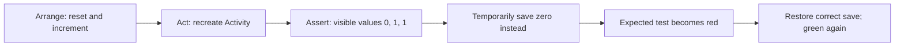

[מפת המעבדות]({{ '/android/topics/' | relative_url }}) · [המעבדה הקודמת: מחזור חיים]({{ '/android/topics/01-lifecycle-state/' | relative_url }})

{: .box-success}
בסוף המעבדה יהיו שלוש בדיקות UI שרצות על אמולטור: סיבוב מסך, יצירה מחדש של View של Fragment, ופתיחה חדשה של Activity עם ערך שנשמר. נשבור זמנית שורת שמירה אחת, נראה בדיקה אחת נכשלת בדיוק במקום המתאים, נחזיר את השורה ונראה את הבדיקות עוברות.

## בוחרים את סוג הבדיקה לפי הסיכון

התחילו מענף **`codex/lifecycle-state`** אחרי [מעבדה 01]({{ '/android/topics/01-lifecycle-state/' | relative_url }}). ענף התוצאה הוא **`codex/android-ui-tests`**. כאן לא משנים את קוד האפליקציה: מוסיפים בדיקות שתופסות רגרסיה בהתנהגות שכבר עובדת.

| שאלה | מיקום | מה צריך לרוץ |
|---:|:---|---:|
| האם פונקציית Java טהורה מחזירה ערך נכון? | `app > kotlin+java > com.example.topics (test)` | JVM במחשב, בלי Activity |
| האם לחיצה, סיבוב או Fragment מציגים מצב נכון? | `app > kotlin+java > com.example.topics (androidTest)` | מכשיר או אמולטור, Android ו־UI אמיתי |

קובצי התבנית `ExampleUnitTest` ו־`ExampleInstrumentedTest` נשארים בפרויקט. בדיקת `2 + 2` אינה מאמתת שחזור מסך; לכן נוסיף בדיקה חדשה ב־`androidTest` במקום להציג את בדיקת התבנית כראיה לנושא. [תיעוד Android לבדיקות מקומיות ועל מכשיר](https://developer.android.com/training/testing/fundamentals) מבחין בין סביבת JVM לבין מכשיר Android.

## בדיקה היא טענה שניתן להפריך

נכתוב כל בדיקה בשלושה חלקים: **הכנה** של מצב ידוע, **פעולה** אחת שמפעילה את הסיכון, ו**טענה** על תוצאה גלויה. בבדיקת הסיבוב, הכנה היא איפוס והגדלה ל־1; הפעולה היא `recreate`; הטענה היא שלישיית ערכים `0, 1, 1`. אם רק נבדוק שהמסך נפתח, גם אפליקציה שאיבדה את הנתון תעבור את הבדיקה.



`onView(withId(...))` מחפשת View; `perform(click())` מפעילה פעולה; `check(matches(withText(...)))` בודקת את התוצאה. אלה שלושה תפקידים שונים. בניית הטקסט עם `targetContext().getString` משתמשת במשאבי **האפליקציה הנבדקת**, כך שהבדיקה אינה מקבעת ניסוח באנגלית. הבדיקה עדיין יכולה לזהות מספר שגוי גם אם התרגום משתנה.

`try (ActivityScenario<...> scenario = ...)` הוא try-with-resources של Java: בסיום הבלוק קוראים ל־`close`, גם כאשר assertion זורקת חריגה. ניקוי אינו חלק קוסמטי; Activity שנשארה פתוחה יכולה להשפיע על הבדיקה הבאה. כל בדיקה צריכה להכין את המצב שלה ולא לסמוך על סדר הרצה בין מתודות `@Test`.

`recreate()` מפעילה הריסה ויצירה מחדש של Activity ומסלול שחזור מצב; היא מאפשרת בדיקה חוזרת של הסיכון שבסיבוב, אבל אינה מסובבת פיזית את מידות המסך ואינה הורגת את תהליך האפליקציה. בדיקה על תהליך חדש ובדיקה על פריסה ב־landscape דורשות תרחישים נוספים. Espresso מתאמת פעולות עם עבודת UI מוכרת; עבור עבודה אסינכרונית שהיא אינה מכירה נדרש אות סיום מתאים, כגון IdlingResource, ולא ניחוש זמן המתנה. [מדריך Espresso](https://developer.android.com/training/testing/espresso) מסביר את הסנכרון.

## עצרו ונבאו

בדיקת סיבוב ירוקה, אבל בדיקת Fragment אדומה. האם אפשר להסיק שהשמירה המקומית שבורה? כתבו תחזית לפני פתיחת ההסבר, ואז הצביעו על המשתנה או התנאי בקוד שמצדיקים אותה.

<details markdown="1">
<summary>בדיקת ההבנה</summary>

לא. כל בדיקה צריכה להעיד על חוזה מסוים. בדיקת Fragment עוסקת ב־View חדשה וב־binding שמתנקה; בדיקת המונים עוסקת בגבולות אחסון אחרים. קראו את ה־assertion שנכשל לפני שמחליפים השערה.

</details>

## 1. מוסיפים ActivityScenario בלי למחוק תשתית בדיקות

ב־**Gradle Scripts > libs.versions.toml** הוסיפו את `androidx.test:core`. ספריות Espresso ו־JUnit של `androidTest`, וגם JUnit של `test`, כבר קיימות בתבנית — אל תמחקו אותן.

```diff
 [versions]
 ⁞
 constraintlayout = "2.2.2"
+testCore = "1.7.0"
 ⁞
 [libraries]
 ⁞
 constraintlayout = { group = "androidx.constraintlayout", name = "constraintlayout", version.ref = "constraintlayout" }
+androidx-test-core = { group = "androidx.test", name = "core", version.ref = "testCore" }
```

ב־**Gradle Scripts > build.gradle.kts (Module :app)** הוסיפו רק שורת `androidTestImplementation`, ואז בצעו Gradle Sync.

```diff
     androidTestImplementation(libs.espresso.core)
     androidTestImplementation(libs.ext.junit)
+    androidTestImplementation(libs.androidx.test.core)
```

## 2. בדיקות שמסתכלות על מה שהמשתמש רואה

צרו Java Class בשם `LifecycleUiTest` ב־**app > kotlin+java > com.example.topics (androidTest)**. `ActivityScenario` פותחת ויוצרת מחדש את ה־Activity; Espresso לוחצת על כפתורים ומאמתת טקסט של Views. `assertCounters` משווה את הערכים הגלויים ולא קוראת שדות פרטיים מתוך המחלקה.

```java

package com.example.topics;

import android.content.Context;

import androidx.test.core.app.ActivityScenario;
import androidx.test.ext.junit.runners.AndroidJUnit4;
import androidx.test.platform.app.InstrumentationRegistry;

import org.junit.Test;
import org.junit.runner.RunWith;

import static androidx.test.espresso.Espresso.onView;
import static androidx.test.espresso.Espresso.pressBack;
import static androidx.test.espresso.action.ViewActions.click;
import static androidx.test.espresso.assertion.ViewAssertions.matches;
import static androidx.test.espresso.matcher.ViewMatchers.withId;
import static androidx.test.espresso.matcher.ViewMatchers.withText;

/** UI regressions that a JVM-only test cannot exercise. */
@RunWith(AndroidJUnit4.class)
public final class LifecycleUiTest {
    /**
     * Verifies the recreation contract: fields reset, saved and persistent counts survive.
     * Sets its own initial counts so test order cannot determine the result.
     */
    @Test
    public void rotationRestoresBundleButNotActivityField() {
        try (ActivityScenario<MainActivity> scenario = ActivityScenario.launch(MainActivity.class)) {
            onView(withId(R.id.reset)).perform(click());
            onView(withId(R.id.increment)).perform(click());
            assertCounters(1, 1, 1);

            // Recreate the Activity; this does not kill its process or rotate its display.
            scenario.recreate();
            assertCounters(0, 1, 1);
        }
    }

    /**
     * Verifies that detach/back replaces the View without resetting the Fragment counter.
     */
    @Test
    public void fragmentViewCanBeRecreatedWithoutLosingFragmentCount() {
        try (ActivityScenario<MainActivity> ignored = ActivityScenario.launch(MainActivity.class)) {
            onView(withId(R.id.fragment_increment)).perform(click());
            onView(withId(R.id.fragment_value)).check(matches(withText(
                    targetContext().getString(R.string.fragment_value, 1))));

            onView(withId(R.id.detach_view)).perform(click());
            pressBack();
            onView(withId(R.id.fragment_value)).check(matches(withText(
                    targetContext().getString(R.string.fragment_value, 1))));
        }
    }

    /**
     * Verifies a fresh Activity launch after closing the previous one.
     * This does not simulate process death or Force stop.
     */
    @Test
    public void newLaunchKeepsOnlyPersistentCount() {
        try (ActivityScenario<MainActivity> ignored = ActivityScenario.launch(MainActivity.class)) {
            onView(withId(R.id.reset)).perform(click());
            onView(withId(R.id.increment)).perform(click());
        }
        try (ActivityScenario<MainActivity> ignored = ActivityScenario.launch(MainActivity.class)) {
            assertCounters(0, 0, 1);
        }
    }

    /**
     * Asserts user-visible values using the target app's current string resources.
     *
     * @param memory expected ordinary field value
     * @param saved expected restored UI value
     * @param persistent expected stored preference value
     */
    private static void assertCounters(int memory, int saved, int persistent) {
        Context context = targetContext();
        onView(withId(R.id.memory_value)).check(matches(withText(
                context.getString(R.string.memory_value, memory))));
        onView(withId(R.id.saved_value)).check(matches(withText(
                context.getString(R.string.saved_value, saved))));
        onView(withId(R.id.persistent_value)).check(matches(withText(
                context.getString(R.string.persistent_value, persistent))));
    }

    /**
     * Obtains the application-under-test context rather than the test APK context.
     *
     * @return context whose resources define the displayed labels
     */
    private static Context targetContext() {
        return InstrumentationRegistry.getInstrumentation().getTargetContext();
    }
}
```

שלוש הבדיקות בוחנות שלושה חוזים שונים:

1. `rotationRestoresBundleButNotActivityField`: אחרי Reset ולחיצה אחת, כל הערכים 1. אחרי `scenario.recreate()` שדה ה־Activity הוא 0, אך ה־Bundle והאחסון המקומי הם 1.
2. `fragmentViewCanBeRecreatedWithoutLosingFragmentCount`: לוחצים בתוך ה־Fragment, מנתקים את ה־View וחוזרים עם Back. הטקסט נשאר 1. בדיקה זו הייתה נכשלת אם היינו מאפסים את `count` בכל `onCreateView`.
3. `newLaunchKeepsOnlyPersistentCount`: סוגרים Activity ופותחים חדש. השדה וה־Bundle מתחילים מ־0, ו־`SharedPreferences` נשאר 1. זו **פתיחה חדשה**, לא הוכחה לשחזור משימה אחרי הריגת תהליך ביוזמת המערכת.

כל בדיקה מתחילה ב־Reset או פותחת מסך חדש אחרי בדיקה שקבעה את המצב הדרוש. `try` סוגר את `ActivityScenario` גם כשה־assertion נכשל, כדי שלא תישאר Activity פעילה שתשפיע על הבדיקה הבאה.

## 3. מריצים וקוראים ראיה

בחרו אמולטור פעיל. אפשר להריץ את `LifecycleUiTest` מסמל ההפעלה ליד המחלקה ב־Android Studio, או דרך חלון Terminal של הפרויקט:

```powershell
.\gradlew.bat :app:testDebugUnitTest
.\gradlew.bat :app:connectedDebugAndroidTest
```

הפקודה הראשונה מריצה את בדיקת ה־JVM הקיימת; השנייה מריצה את בדיקות `androidTest` על האמולטור. ב־**Run** חפשו את שם הבדיקה שנכשלה ואת הודעת ה־assertion הראשונה, לא רק את השורה `BUILD FAILED`. בענף הדוגמה ריצת המכשיר הפיקה `tests="4" failures="0"`: שלוש הבדיקות החדשות ובדיקת התבנית.

כעת בצעו ניסוי רגרסיה **זמני בלבד**: ב־`MainActivity.onSaveInstanceState` החליפו את הערך שנשמר מ־`savedCount` ל־`0`, הריצו שוב, וקראו איזו בדיקה נכשלת. בענף הדוגמה הניסוי הזה הפיק `tests="4" failures="1"`: רק `rotationRestoresBundleButNotActivityField` נכשלה, עם ציפייה ל־`Saved Bundle: 1`. החזירו מיד את השורה ל־`outState.putInt(SAVED_COUNT, savedCount);` והריצו שוב — ארבע הבדיקות צריכות לעבור. **אל תשאירו את הבאג בענף התוצאה.**

{: .box-note}
הבדיקה אינה "טובה" רק כי היא ירוקה. הניסוי האדום מראה שהיא רגישה לשינוי המכוון; החזרה לירוק מראה שהענף נשאר תקין. הראיה כאן מוגבלת למחזור חיים, Fragment ושמירה קלה. היא אינה מאמתת הרשאות, offline, migration או כל API בפרויקט גמר.

## איך מרחיבים בלי לכתוב בדיקות מקריות?

| דרישה עתידית | כשל שכדאי ליצור בבדיקה | שליטה בתלות |
|---:|---:|---:|
| הרשאה | סירוב ואז אישור | להפעיל תרחיש על אמולטור עם מצב הרשאות ידוע ולבדוק שתי תוצאות |
| offline | אין רשת אך מוצגים נתונים שמורים | מקור רשת מדומה או אמולטור שמצבו נקבע מראש |
| migration | פתיחת נתונים מגרסת schema קודמת | מסד גרסה ישנה כ־fixture לפני השדרוג |
| עבודה אסינכרונית | תשובה ישנה מגיעה אחרי פעולה חדשה | scheduler/שרת מדומה שניתן לשלוט בסדר התשובות שלו |

אל תוסיפו `Thread.sleep` ארוך רק כדי "לחכות עד שהבדיקה תעבור". שלטו בזמן, ברשת ובהרשאות או המתינו לאות ברור מן האפליקציה. הבדיקה צריכה להישאר יציבה גם במחשב איטי ולבדוק תוצאה שהמשתמש יכול להבחין בה.

## שאלות הסבר

1. למה בדיקת JVM לא יכולה ללחוץ על כפתור Activity אמיתי בלי סביבת Android?
2. מה ההבדל בין `scenario.recreate()` לבין סגירה ופתיחה חדשה של Activity?
3. איזו תקלה ייחודית תגלה בדיקת UI שאינה גלויה בבדיקת `FakeBookRepository.load()` בלבד?
4. למה חשוב להחזיר את שורת הבאג אחרי הניסוי האדום?
