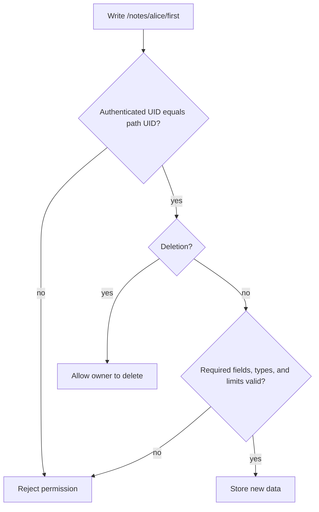

[מפת המעבדות]({{ '/android/topics/' | relative_url }}) · [חדרי RTDB במשחק]({{ '/android/projectSteps/021a.TicTacToeRTDBRooms' | relative_url }})

{: .box-success}
בסוף המעבדה יהיו כללי שרת ובדיקות אוטומטיות עם שלוש זהויות: Alice,‏ Bob ואורח. הבדיקות מראות מי רשאי לקרוא ולכתוב ב־`/notes/<uid>/<noteId>`, וגם שבעלים אינם רשאים לשמור נתון פגום. התרגול רץ ב־Firebase Emulator Suite עם מזהה פרויקט דמה; לא צריך חשבון Firebase או `google-services.json`.

## למה בדיקה ב־UI אינה מספיקה?

נקודת ההתחלה היא `master` בפרויקט **topics**; ענף התוצאה הוא **`codex/rtdb-security-rules`**. ה־Activity של תבנית View Binding נשארת כפי שהיא. הקוד החדש נמצא בשורש הפרויקט, מחוץ למודול `app`, משום שכללי RTDB נאכפים בשרת ולא במסך Android.

נניח שמסך Android מציג רק הערות של Alice. הסתרת הערות של Bob במסך אינה חוסמת קריאה ישירה לנתיב שלו. בקשת רשת יכולה להגיע גם מלקוח אחר, משינוי APK או מסקריפט. לכן הבדיקה החשובה היא בקשה של Bob ישירות אל `/notes/alice/first`, בלי לעבור במסך. [כללי RTDB](https://firebase.google.com/docs/database/security) בודקים כל בקשת קריאה/כתיבה בשרת.

| זהות | נתיב | פעולה | תוצאה רצויה |
|---:|:---|---:|---:|
| Alice | `/notes/alice/first` | יצירה, קריאה, עדכון, מחיקה | מותר |
| Bob | `/notes/alice/first` | קריאה או כתיבה | נדחה |
| אורח | `/notes/alice/first` | קריאה או כתיבה | נדחה |
| Alice | `/notes/alice/bad` | כתיבת הערה חסרת שדה או עם שדה זר | נדחה |
| Bob | `/notes` | קריאת כל אוספי המשתמשים | נדחה |

## שתי שאלות שרת: מי אתה, ומה אתה מנסה לשמור?

**אימות זהות** נותן לבקשה UID מוכר; **הרשאה** קובעת מה UID זה רשאי לעשות. הנתיב `/notes/alice/first` אינו מוכיח שהמבקש הוא Alice: גם Bob יכול לכתוב את המילה `alice` בכתובת. לכן הכלל משווה את `auth.uid`, שנמסר מתוך זהות הבקשה, אל `$uid`, שנלקח מהנתיב. השוויון נחוץ גם כשה־UI מציע למשתמש רק את הנתיב שלו.



התרשים מפריד הרשאה מתיקוף. גם Alice אינה יכולה לשמור `isAdmin: true` בהערה, כי זה שדה שלא הוגדר בחוזה. `newData` היא תמונת הנתון לאחר הכתיבה המוצעת, ולא רק השדה היחיד ששלחנו. כך אפשר לבדוק שהערה מעודכנת עדיין מכילה את כל שדות החובה. החריג למחיקה שלמה מכוון: בעת מחיקה אין אובייקט חדש שחייב להכיל `text`.

כללי RTDB **אינם מסנן תוצאות**: אין לקרוא `/notes` ולצפות שהשרת יחזיר רק את חלקה של Alice. שולחים קריאה לנתיב שהכללים מרשים לקרוא. גם כלל מאפשר בהורה אינו מתבטל רק משום שילד מחמיר אותו; לכן מתחילים מגבול צר ובודקים בקשות ישירות לכל גבול שרוצים להגן עליו. [תחביר כללי RTDB](https://firebase.google.com/docs/database/security/core-syntax) מסביר ירושת הרשאה ואת גבולות הנתיב.

בבדיקות `await` מחכה להכרעה של פעולה אסינכרונית. בלי ההמתנה הבדיקה עלולה להסתיים לפני שהתשובה הגיעה. `assertFails` אינה כישלון בדיקה: הבדיקה מצליחה כאשר פעולת לקוח לא מורשה נדחית כצפוי. אחרי שינוי כללים נבדוק שתי קבוצות יחד: פעולות מותרות שלא נשברו ופעולות אסורות שלא נפתחו. שרת Emulator מאפשר לבודד את הכללים בלי לגעת במידע אמיתי.

## עצרו ונבאו

בעלים מוחקת note באמצעות כתיבת null. האם כלל שמחייב title למידע חדש אמור לחסום אותה? כתבו תחזית לפני פתיחת ההסבר, ואז הצביעו על המשתנה או התנאי בקוד שמצדיקים אותה.

<details markdown="1">
<summary>בדיקת ההבנה</summary>

לא במסלול המחיקה הזה. הרשאת write של הבעלים עדיין נבדקת, אך validation של נתון שנמחק אינה דרישה לקיומו של title חדש. משתמשת אחרת אינה יכולה לעקוף בעלות באמצעות מחיקה; הרשאה ומבנה הנתון הן בדיקות שונות.

</details>

## 1. מגדירים נתיב וכללי ברירת מחדל סגורה

בשורש הפרויקט צרו `database.rules.json`. קובצי שורש לא תמיד מופיעים בתצוגת **Android** של Android Studio; פתחו אותם בעזרת **Search Everywhere** או בחלון הקבצים של מערכת ההפעלה.

```json
{
  "rules": {
    "notes": {
      "$uid": {
        ".read": "auth !== null && auth.uid === $uid",
        "$noteId": {
          ".write": "auth !== null && auth.uid === $uid",
          ".validate": "newData.hasChildren(['text', 'updatedAt'])",
          "text": {
            ".validate": "newData.isString() && newData.val().length > 0 && newData.val().length <= 120"
          },
          "updatedAt": {
            ".validate": "newData.isNumber() && newData.val() > 0"
          },
          "$other": {
            ".validate": false
          }
        }
      }
    }
  }
}
```

`$uid` ו־`$noteId` הם חלקים משתנים של הנתיב; הם **אינם** זהות מאומתת. `auth.uid` מגיע מזהות Firebase של המבקש. תנאי הקריאה והכתיבה משווים ביניהם. אין כלל שמעניק גישה בשורש `/notes`, לכן קריאה של כל האוסף נדחית. כלל הכתיבה נמצא ברמת הערה יחידה, ולכן גם בעלים לא יכולים לכתוב את כל `/notes/alice` בפעולה אחת.

`.write` מחליט אם זהות המבקש רשאית לפעול. `.validate` בודק את **הנתון החדש** לאחר שהכתיבה הותרה: חייבים `text` ו־`updatedAt`, הטקסט אינו ריק ואורכו לכל היותר 120, חותמת הזמן מספר חיובי, ושם שדה לא מוכר נדחה על ידי `$other`. מחיקת הערה שלמה מותרת לבעלים: Firebase אינו מפעיל `.validate` על מחיקה. אל תוסיפו כלל `".read": true` או `".write": true` בהורה — הרשאה בהורה חלה גם על ילדים ועלולה לעקוף את ההגבלה הצרה.

## 2. מריצים שרת מקומי בלבד

צרו `firebase.json` בשורש הפרויקט:

```json
{
  "database": {
    "rules": "database.rules.json"
  },
  "emulators": {
    "database": {
      "host": "127.0.0.1",
      "port": 9000
    },
    "ui": {
      "enabled": false
    }
  }
}
```

הגדירו את סביבת הבדיקות ב־`package.json`. זהו כלי בדיקה ל־Firebase Rules, לא תלות של אפליקציית Android:

```json
{
  "name": "topics-rtdb-rules-lab",
  "private": true,
  "type": "module",
  "scripts": {
    "test:rules": "node --test tests/rtdb-rules.test.js"
  },
  "devDependencies": {
    "@firebase/rules-unit-testing": "5.0.2",
    "firebase": "12.19.0"
  }
}
```

הוסיפו ל־`.gitignore` את `node_modules/`,‏ `database-debug.log`,‏ `firebase-debug.log` ו־`ui-debug.log`. את `package-lock.json` כן שומרים: הוא נוצר על ידי `npm install` ומאפשר התקנה שחוזרת על אותן גרסאות. נדרשים Node.js,‏ Java ו־Firebase CLI במחשב; להרצה מקומית של אמולטור ה־Database אין צורך בהתחברות לחשבון Firebase.

{: .box-note}
בדיקות Rules ירוקות מוכיחות את תרחישי ההרשאה שבדקנו; הן אינן בדיקת בריאות של ספריות Node. הריצו גם `npm audit` וקראו איזה package מושפע ובאיזה מסלול הוא משמש. התלויות כאן הן `devDependencies` של כלי הבדיקה, ולא ספריות שנכנסות ל־APK. עדכון major או `npm audit fix --force` יכול לשנות API ולשבור את הניסוי; שינוי גרסאות צריך להסתיים בהרצה חוזרת של בדיקות הכללים, לא רק בהיעלמות אזהרה.

## 3. בודקים בקשות אמיתיות עם זהויות מדומות

צרו בשורש הפרויקט את `tests/rtdb-rules.test.js`:

```js
import { after, before, test } from 'node:test';
import { readFileSync } from 'node:fs';
import assert from 'node:assert/strict';
import {
  assertFails,
  assertSucceeds,
  initializeTestEnvironment,
} from '@firebase/rules-unit-testing';
import { get, ref, remove, set } from 'firebase/database';

let env;

before(async () => {
  env = await initializeTestEnvironment({
    projectId: 'demo-topics',
    database: {
      host: '127.0.0.1',
      port: 9000,
      rules: readFileSync('database.rules.json', 'utf8'),
    },
  });
});

after(async () => {
  await env?.cleanup();
});

test('owner can create, read, update, and delete a valid note', async () => {
  const db = env.authenticatedContext('alice').database();
  const note = ref(db, 'notes/alice/first');
  await assertSucceeds(set(note, { text: 'Draft', updatedAt: 1 }));
  assert.deepEqual((await assertSucceeds(get(note))).val(), { text: 'Draft', updatedAt: 1 });
  await assertSucceeds(set(note, { text: 'Revised', updatedAt: 2 }));
  await assertSucceeds(remove(note));
});

test('another user and a guest cannot read or write Alice’s path', async () => {
  // The identity is Bob even when the requested path contains Alice's UID.
  const bob = env.authenticatedContext('bob').database();
  const guest = env.unauthenticatedContext().database();
  await assertFails(get(ref(bob, 'notes/alice/first')));
  await assertFails(set(ref(bob, 'notes/alice/stolen'), { text: 'No', updatedAt: 1 }));
  await assertFails(get(ref(guest, 'notes/alice/first')));
  await assertFails(set(ref(guest, 'notes/alice/new'), { text: 'No', updatedAt: 1 }));
  // Rules authorize a path; they do not filter a parent read to visible children.
  await assertFails(get(ref(bob, 'notes')));
});

test('the server rejects malformed data even from the owner', async () => {
  const db = env.authenticatedContext('alice').database();
  await assertFails(set(ref(db, 'notes/alice/empty'), { text: '', updatedAt: 1 }));
  await assertFails(set(ref(db, 'notes/alice/missing'), { text: 'No timestamp' }));
  await assertFails(set(ref(db, 'notes/alice/extra'), {
    text: 'Valid text', updatedAt: 1, isAdmin: true,
  }));
});
```

`authenticatedContext('alice')` ו־`authenticatedContext('bob')` יוצרים בקשות עם UID שונים לצורך הבדיקה. הן אינן חשבונות אמיתיים; סביבת הבדיקות מצמידה להן זהות מדומה מול האמולטור. `assertFails` מצליחה רק אם ההבטחה נדחית בשל `permission_denied`; כך שגיאת רשת אקראית לא תיחשב כהוכחה שהכללים עובדים. `assertSucceeds` דורשת שהפעולה תצליח.

פתחו Terminal בשורש הפרויקט והריצו:

```text
npm install
firebase emulators:exec --only database --project demo-topics "npm run test:rules"
```

שלוש הבדיקות צריכות לעבור. צפויות גם שורות `permission_denied` עבור הבקשות העוינות — אלו בדיוק התוצאות שהבדיקות דורשות. `emulators:exec` סוגר את האמולטור בסיום. `demo-topics` הוא מזהה דמה; שמרו עליו זהה בפקודה ובקובץ הבדיקה.

## 4. מוודאים שהבדיקה באמת מגלה פרצת הרשאה

שנו זמנית את `.read` ל־`true` ברמת `$uid`, הריצו שוב את אותה הפקודה וראו שבדיקת Bob/אורח נכשלת: קריאה שלא הייתה אמורה להצליח הצליחה. החזירו את התנאי `auth !== null && auth.uid === $uid` והריצו שוב — שלוש בדיקות עוברות. אם מרחיבים כלל, חובה לבדוק גם **מי קיבל גישה בטעות** ולא רק שהבעלים עדיין מצליח לעבוד.

{: .box-note}
הבדיקה מוכיחה התנהגות של **כללי הקובץ מול האמולטור**. היא אינה מוכיחה שכללים אלה כבר פורסמו לפרויקט Firebase אמיתי. לפני הפצה בדקו את כללי הסביבה שאליה האפליקציה מחוברת, ומנעו מבדיקות דמה לפנות בטעות לפרויקט production. [תיעוד Firebase לכתיבת בדיקות Rules](https://firebase.google.com/docs/rules/unit-tests) ו־[הפעלת Emulator Suite](https://firebase.google.com/docs/emulator-suite/install_and_configure) מסבירים את ההפרדה.
