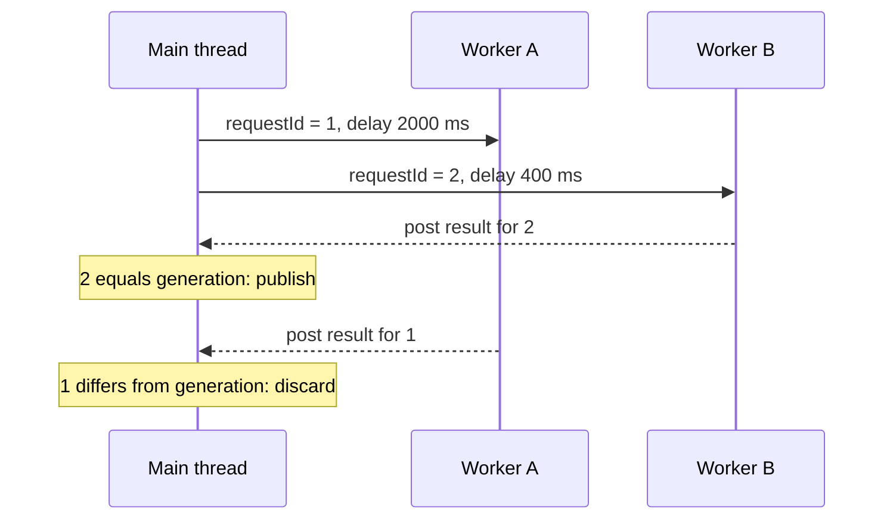

[מפת המעבדות]({{ '/android/topics/' | relative_url }}) · [הבסיס: ViewModel ו־Repository]({{ '/android/topics/04-viewmodel-repository/' | relative_url }})

{: .box-success}
בסוף המעבדה שולחים שתי בקשות חופפות: הראשונה איטית (2 שניות), השנייה מהירה (0.4 שניות). התשובה המהירה מציגה `New result`; כשהתשובה הישנה מגיעה אחריה, היא אינה רשאית להחליף את המסך. כפתור Cancel וסיבוב מסך מדגימים את מחזור החיים של העבודה.

התחילו מענף **`codex/viewmodel-repository`** אחרי [מעבדה 04]({{ '/android/topics/04-viewmodel-repository/' | relative_url }}). ענף התוצאה הוא **`codex/async-races`**. שלושת התרחישים הקודמים — ספרים, רשימה ריקה וכישלון פעם אחת עם Retry — ממשיכים לעבוד.

| זמן | בקשה איטית | בקשה מהירה | מה מותר להציג? |
|---:|---:|---:|---:|
| 0.0 שניות | התחילה | התחילה אחריה | טעינה |
| 0.4 שניות | עדיין עובדת | החזירה `New result` | התוצאה החדשה |
| 2.0 שניות | החזירה `Old result` | כבר הסתיימה | עדיין התוצאה החדשה |

`Future.cancel(true)` מבקש לבטל עבודה שעדיין רצה, אך אינו מוחק בהכרח callback שכבר הוצב בתור של ה־main thread. לכן משתמשים גם ב־`generation`: כל פעולה חדשה מקבלת מספר דור, ורק callback שמספרו שווה לדור הנוכחי רשאי לצייר למסך.

## סדר התחלה אינו סדר סיום

שתי הבקשות נשלחות בסדר ידוע, אבל עובדות בשרשורים נפרדים. הראשונה ישנה שתי שניות והשנייה פחות מחצי שנייה; לכן התשובה החדשה מגיעה קודם. אם נפרסם כל תוצאה שמגיעה, המסך יחזור אחורה בסוף. ההכרעה הרצויה במעבדה היא **הבקשה החדשה ביותר מנצחת**, ולא התשובה האחרונה שהגיעה.



`requestId` הוא עותק מקומי של המספר בזמן השליחה; `generation` הוא המספר העדכני בזמן החזרה. ה־worker מחשב נתונים ומוסר lambda לתור הראשי. **בתוך אותה lambda** בודקים שוויון ומפרסמים. אילו בדקנו שוויון ב־worker ורק אחר כך היינו מפרסמים, Cancel היה יכול להתרחש בין הבדיקה לשימוש. כאן כל שינויי הדור וה־state נעשים ב־main thread; אין צורך להפוך את הדור ל־`volatile` כאשר נשמר הגבול הזה.

`Future<?>` היא ידית למשימה שנשלחה; `cancel(true)` מבקשת interrupt אם היא רצה. interrupt הוא בקשה לשיתוף פעולה, לא הריגה בכוח. `Thread.sleep` מגיבה אליה בחריגה; קוד שלא בודק interruption עשוי להמשיך לעבוד. לכן גם after-cancel result שלא ניתן לעצור חייב להיפסל. ב־catch מחזירים את דגל ה־interrupt כדי לא לבלוע את אות הביטול.

שימו לב שהדוגמה מתחילה **שני דורות** ומשאירה את האיטי רץ כדי שנוכל לראות את התשובה הישנה נדחית. Cancel זמין רק ב־LOADING; אחרי ההצלחה המהירה כבר מוצג SUCCESS, אך האיטי עשוי עדיין לרוץ עד שיסיים. בקשה חדשה או ניקוי ה־ViewModel מבטלים את העבודה שנותרה. מדיניות זו מתאימה לתרגיל; במוצר אפשר לבטל קודם את העבודה הישנה כדי לחסוך משאבים בלי לוותר על בדיקת הזהות.

## עצרו ונבאו

העבודה האיטית כבר פרסמה Runnable ל־main ואז התחילה בקשה חדשה. האם Future.cancel מספיקה? כתבו תחזית לפני פתיחת ההסבר, ואז הצביעו על המשתנה או התנאי בקוד שמצדיקים אותה.

<details markdown="1">
<summary>בדיקת ההבנה</summary>

לא. ה־Runnable כבר עשויה להיות בתור אחר. בדיקת הדור מתבצעת כשמקבלים את התוצאה על main, ולכן תוצאה ששייכת לבקשה הישנה נפסלת גם אם הביטול לא עצר אותה בזמן.

</details>

## 1. יוצרים מקור תוצאות איטי במכוון

ב־**app > kotlin+java > com.example.topics > FakeBookRepository** הוסיפו מתודה אחרי `load(...)` הקיימת:

```java
/**
 * Blocks a worker for a controlled delay and returns a labeled response.
 *
 * @param label text identifying this particular request
 * @param delayMs simulated latency in milliseconds
 * @return one labeled result
 * @throws InterruptedException if cooperative cancellation interrupts the delay
 */
public String[] loadRace(String label, long delayMs) throws InterruptedException {
    Thread.sleep(delayMs);
    return new String[]{label};
}
```

ה־`sleep` מייצג כאן תשובה איטית, לא פתרון לעבודה אמיתית. אסור לקרוא למתודה זו מה־main thread: המסך יפסיק להגיב. בהמשך ה־ViewModel שולח אותה ל־`ExecutorService` עם שני threads, כדי ששתי הבקשות אכן ירוצו בחפיפה.

## 2. מוסיפים ביטול וזהות בקשה ל־ViewModel

ב־**BooksViewModel** הוסיפו imports של `ExecutorService`,‏ `Executors` ו־`Future`, ואז שדות לצד השדות הקיימים:

```java
private final ExecutorService workers = Executors.newFixedThreadPool(2);
private Future<?> slowRequest;
private Future<?> fastRequest;
private int generation;
```

הוסיפו את הפעולות הציבוריות. ה־ViewModel נשאר בעליו של מצב המסך:

```java
/**
 * Starts overlapping worker requests with different IDs; only the newest may publish.
 */
public void startRace() {
    if (currentKind() == BooksUiState.Kind.LOADING) {
        return;
    }
    cancelPendingWork();
    state.setValue(BooksUiState.of(BooksUiState.Kind.LOADING));
    int oldRequest = ++generation;
    slowRequest = submitRace("Old result (2 s)", 2000, oldRequest);
    int newRequest = ++generation;
    fastRequest = submitRace("New result (0.4 s)", 400, newRequest);
}

/**
 * Invalidates queued results and interrupts owned work while the UI is loading.
 */
public void cancel() {
    if (currentKind() != BooksUiState.Kind.LOADING) {
        return;
    }
    generation++;
    cancelPendingWork();
    state.setValue(BooksUiState.of(BooksUiState.Kind.IDLE));
}

/**
 * Computes on a worker, then checks relevance and publishes on the main thread.
 *
 * @param label result text for observation
 * @param delayMs controlled worker delay
 * @param requestId generation captured when this request began
 * @return cancellation handle for the submitted worker task
 */
private Future<?> submitRace(String label, long delayMs, int requestId) {
    return workers.submit(() -> {
        try {
            String[] books = repository.loadRace(label, delayMs);
            handler.post(() -> {
                // Decide at publication time, on the thread that owns generation.
                if (requestId == generation) {
                    state.setValue(BooksUiState.success(books));
                }
            });
        } catch (InterruptedException interrupted) {
            // Preserve the cancellation signal rather than swallowing it.
            Thread.currentThread().interrupt();
        }
    });
}
```

`oldRequest` מקבל דור קודם; `newRequest` מקבל דור חדש יותר. התוצאה מחושבת ב־worker, אבל `LiveData.setValue` נקראת רק על ה־main thread. השורה `requestId == generation` היא ההגנה המרכזית: גם אם callback ישן מגיע, הוא אינו משנה את ה־state. ביטול בזמן `sleep` גורם ל־`InterruptedException` ולסיום בלי פרסום תוצאה.

בתחילת `scheduleLoad()` הקיימת הוסיפו `cancelPendingWork();` ו־`generation++;` לפני `state.setValue(LOADING)`. כך לחיצה רגילה על Load אחרי תחרות מבטלת עבודה ישנה ומפסילה callbacks שלה. החליפו את `onCleared()` והוסיפו ניקוי משותף:

```java
/**
 * Invalidates late publications and releases workers when this ViewModel ends.
 */
@Override
protected void onCleared() {
    generation++;
    cancelPendingWork();
    workers.shutdownNow();
}

/**
 * Removes the queued fake load and interrupts both owned worker tasks.
 * Generation must be changed by the caller to invalidate already posted results.
 */
private void cancelPendingWork() {
    if (pendingLoad != null) {
        handler.removeCallbacks(pendingLoad);
        pendingLoad = null;
    }
    if (slowRequest != null) {
        slowRequest.cancel(true);
        slowRequest = null;
    }
    if (fastRequest != null) {
        fastRequest.cancel(true);
        fastRequest = null;
    }
}
```

`onCleared()` נקראת כשה־ViewModel באמת מוסר, לא בכל סיבוב מסך. לכן סיבוב בזמן המתנה אינו מבטל את התוצאה; ה־Activity החדשה נרשמת ל־LiveData הקיים. כשה־ViewModel נעלם סופית, משחררים את ה־workers.

## 3. מחברים שני כפתורים למסך הקיים

ב־**app > res > values > strings.xml** שנו את ההסבר והוסיפו שני ערכים:


-    <string name="ui_states_instruction">Choose a response. The fake repository answers after a short delay.</string>
+    <string name="ui_states_instruction">Choose a response or race two requests. The fake repository answers after a delay.</string>
+    <string name="start_race">Start slow, then fast request</string>
+    <string name="cancel_pending">Cancel pending request</string>


ב־**app > res > layout > activity_main.xml** הוסיפו אחרי `load_fail_once` שני Buttons: הראשון `id="@+id/start_race"` עם `text="@string/start_race"`, והשני `id="@+id/cancel_pending"` עם `text="@string/cancel_pending"` ו־`visibility="gone"`. לשניהם `layout_width="match_parent"` ו־`layout_height="wrap_content"`. המבנה הקיים של רשימה, מצב ו־Retry נשאר.

ב־**MainActivity** הוסיפו ב־`onCreate` מאזינים, ואחרי `loadFailOnce.setEnabled` ב־`render` הוסיפו את שינויי המצב:

```java
binding.startRace.setOnClickListener(v -> viewModel.startRace());
binding.cancelPending.setOnClickListener(v -> viewModel.cancel());

// In render(BooksUiState state):
binding.startRace.setEnabled(!loading);
binding.cancelPending.setVisibility(loading ? View.VISIBLE : View.GONE);
```

בזמן Loading כפתור Cancel גלוי וכפתורי התחלת הבקשות מושבתים. כשה־state חוזר ל־IDLE או SUCCESS, `render` מסתיר את Cancel אוטומטית.

## 4. מאמתים שלושה מסלולים

ב־**Gradle Scripts > libs.versions.toml** הוסיפו `testCore = "1.7.0"` למקטע `[versions]`, ו־`androidx-test-core = { group = "androidx.test", name = "core", version.ref = "testCore" }` למקטע `[libraries]`. ב־**Gradle Scripts > build.gradle.kts (Module :app)** הוסיפו `androidTestImplementation(libs.androidx.test.core)` לצד Espresso ו־JUnit הקיימים. אל תסירו את בדיקות התבנית.

צרו `AsyncRaceUiTest` ב־**app > kotlin+java > com.example.topics (androidTest)**. בענף התוצאה יש שלוש בדיקות `ActivityScenario` ו־Espresso:

1. לחיצה על Race, המתנה 0.8 שניות ואימות `New result (0.4 s)`; המתנה עד אחרי 2 שניות ואימות שהתוצאה **עדיין** חדשה.
2. לחיצה על Race ומיד Cancel; אחרי 2.4 שניות עדיין מוצג מצב IDLE.
3. לחיצה על Race, `scenario.recreate()` ואז אימות שהתוצאה החדשה מוצגת ב־Activity החדשה.

הקובץ הבא מממש את שלוש התצפיות. ההמתנות כאן שייכות **למקור המדומה בעל זמני ההשהיה הידועים**, ורצות בשרשור הבדיקה; הן אינן דרך כללית להמתין ל־HTTP או למסד. נבדוק פעם אחרי התשובה המהירה ופעם אחרי חלון התשובה האיטית. אם עומס על מכשיר בדיקה גורם לחריגה מן החלונות, הרחבת `sleep` לבדה אינה פתרון מוצר: נשתמש ב־scheduler נשלט או באות סיום לכל בקשה. זה גם גבול הראיה של בדיקת התזמון הקטנה.
### הקוד המלא של AsyncRaceUiTest

```java
package com.example.topics;

import androidx.test.core.app.ActivityScenario;
import androidx.test.ext.junit.runners.AndroidJUnit4;

import org.junit.Test;
import org.junit.runner.RunWith;

import static androidx.test.espresso.Espresso.onView;
import static androidx.test.espresso.action.ViewActions.click;
import static androidx.test.espresso.assertion.ViewAssertions.matches;
import static androidx.test.espresso.matcher.ViewMatchers.withId;
import static androidx.test.espresso.matcher.ViewMatchers.withText;

/** A late response must not replace a newer one or a cancelled screen. */
@RunWith(AndroidJUnit4.class)
public final class AsyncRaceUiTest {
    /**
     * Observes the scripted fast result twice, before and after the slow-result window.
     *
     * @throws InterruptedException if the controlled test wait is interrupted
     */
    @Test
    public void slowOldResultCannotOverwriteFastNewResult() throws InterruptedException {
        try (ActivityScenario<MainActivity> ignored = ActivityScenario.launch(MainActivity.class)) {
            onView(withId(R.id.start_race)).perform(click());
            Thread.sleep(800);
            onView(withId(R.id.book_list)).check(matches(withText("New result (0.4 s)")));
            Thread.sleep(1700);
            onView(withId(R.id.book_list)).check(matches(withText("New result (0.4 s)")));
        }
    }

    /**
     * Checks that scripted requests cannot republish after the user cancels.
     *
     * @throws InterruptedException if the controlled test wait is interrupted
     */
    @Test
    public void cancelPreventsLateResult() throws InterruptedException {
        try (ActivityScenario<MainActivity> ignored = ActivityScenario.launch(MainActivity.class)) {
            onView(withId(R.id.start_race)).perform(click());
            onView(withId(R.id.cancel_pending)).perform(click());
            Thread.sleep(2400);
            onView(withId(R.id.status)).check(matches(withText(R.string.state_idle)));
        }
    }

    /**
     * Checks delivery to the recreated screen while the ViewModel owns the work.
     *
     * @throws InterruptedException if the controlled test wait is interrupted
     */
    @Test
    public void rotationKeepsOneLatestResult() throws InterruptedException {
        try (ActivityScenario<MainActivity> scenario = ActivityScenario.launch(MainActivity.class)) {
            onView(withId(R.id.start_race)).perform(click());
            scenario.recreate();
            Thread.sleep(900);
            onView(withId(R.id.book_list)).check(matches(withText("New result (0.4 s)")));
        }
    }
}
```

הריצו `:app:connectedDebugAndroidTest` על אמולטור. אם מסירים זמנית את תנאי `requestId == generation` ומפרסמים תמיד, הניסוי הראשון אמור להציג בסוף `Old result`; החזירו את התנאי והריצו שוב. כך הבדיקה מאמתת את הסיבה שבגללה נוסף מזהה הבקשה.

לקריאה נוספת: [ViewModel](https://developer.android.com/topic/libraries/architecture/viewmodel), [תהליכים ו־threads ב־Android](https://developer.android.com/guide/components/processes-and-threads).
