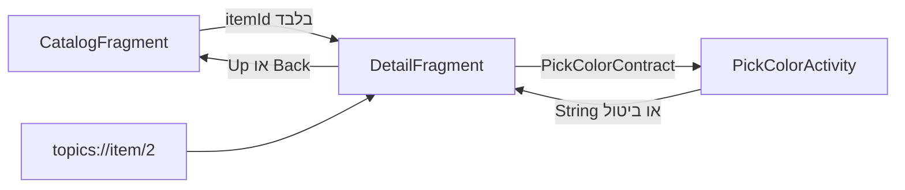
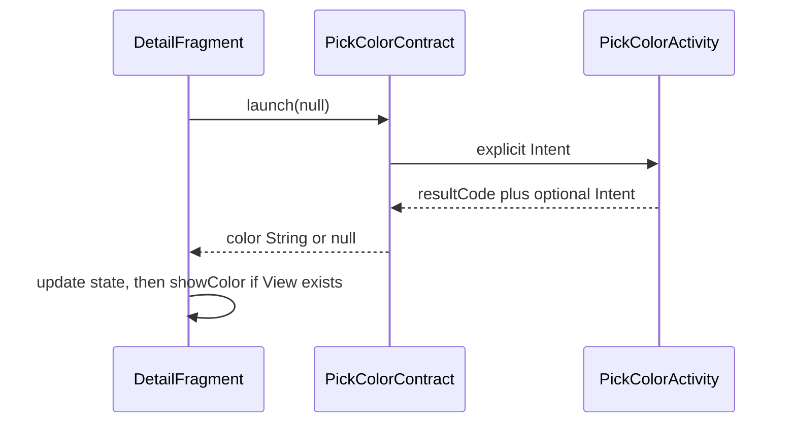

[מפת המעבדות]({{ '/android/topics/' | relative_url }})

{: .box-success}
בסוף המעבדה יש מסך קטלוג, מסך פריט ומסך בחירת צבע. כניסה לפריט מעבירה **מזהה** ולא אובייקט שלם; Back ו־Up חוזרים לקטלוג; קישור `topics://item/2` פותח פריט ישירות; בחירת צבע חוזרת כתוצאה מטיפוס `String` ושורדת יצירה מחדש של המסך.

התחילו מ־`master` בפרויקט **topics**. ענף התוצאה הוא **`codex/navigation-flow`**. זהו מעבר ממסך Empty Views יחיד לגרף קטן וברור; אין צורך להחליף את שאר תשתית התבנית.

## מפת הזרימה



**Back** הוא פעולת המשתמש לחזור למקום הקודם ב־task/back stack. **Up** הוא פעולת הממשק לחזור להורה ההיררכי באפליקציה. כשנכנסים מקטלוג לפריט הן נראות דומות; אחרי כניסה מקישור חיצוני הן עשויות להיות שונות. ב־[תיעוד Android ל־deep links](https://developer.android.com/guide/navigation/design/deep-link) מוסבר גם תפקיד `FLAG_ACTIVITY_NEW_TASK` במבנה ה־Back stack.

## נתון ניווט, מצב בחירה וחוזה תוצאה

ה־`itemId` עונה על "איזה פריט פתחנו?" ו־`selectedColor` על "מה בחרנו עבור התצוגה הזאת?" מעבר בין מסכים צריך להעביר את מזהה הפריט; מקור האמת מספק את השם. אם נעביר שם בלבד, שינוי השם במקור לא יגיע למסך. אם נעביר אובייקט גדול, נצמיד את שני המסכים למבנה שלו ולמגבלות ה־Bundle. גם deep link מספק ID, ולכן כל נקודות הכניסה משתמשות באותו מסלול טעינה ותיקוף.



`ActivityResultContract<Void, String>` הוא חוזה מטיפוסים: `Void` אומר שאין קלט לבחירה, ו־`String` הוא סוג התוצאה. `createIntent` אורזת את בקשת הפתיחה; `parseResult` מפרקת תשובת מערכת; `registerForActivityResult` מקשרת תוצאה אל callback. אלה לא שלוש דרכים שונות לפתוח מסך, אלא שלושה שלבים של אותו חוזה. Back בבוחר מחזיר ביטול; `null` אינו בקשה למחוק את הצבע הקודם.

רושמים את ה־launcher באופן עקבי לפני שהרכיב מגיע למצב פעיל, כאן כשדה Fragment. כך המערכת יכולה למסור תוצאה גם אחרי יצירה מחדש. ה־callback שומר קודם את `selectedColor`, ו־`showColor` נוגעת ב־Views רק אם יש binding: תוצאת בחירה ומועד יצירת התצוגה אינם בהכרח אותו רגע. בניית View חדש תציג מחדש את הבחירה השמורה.

ה־NavHost מחזיק את היעד וה־back stack; Fragment מציגה תוכן. ביציאה מפריט אפשר להרוס את ה־View שלו בלי שכל נתוני הניווט ייעלמו. לכן מנקים binding במחזור חיי **View**, ומשחזרים נתון זמני ב־`Bundle` כאשר נוצר מופע Fragment חדש. המשיכו לבדוק ID חסר או לא קיים גם אם כל כפתורי הקטלוג כרגע תקינים: קישור חיצוני הוא קלט נוסף ולא מהימן.

## עצרו ונבאו

deep link מביא itemId שלא קיים בקטלוג. האם לפתוח בכל זאת פריט לפי מיקום ברשימה? כתבו תחזית לפני פתיחת ההסבר, ואז הצביעו על המשתנה או התנאי בקוד שמצדיקים אותה.

<details markdown="1">
<summary>בדיקת ההבנה</summary>

לא. ID הוא קלט שיש לבדוק, לא מיקום בטוח במערך. ה־Repository מחפשת זהות ומחזירה היעדר תוצאה; המסך מציג את מצב הפריט החסר. כך קישור חיצוני שגוי אינו גורם לחריגת אינדקס.

</details>

ב־`MainActivity.java` הוסיפו מעל `@Override` של `onCreate` את ה־Javadoc המשותפת שב[מפת המעבדות]({{ '/android/topics/' | relative_url }}#איך-לומדים-מהקוד-לא-רק-מעתיקים-אותו). שאר callbacks ומתודות מתועדות בקטעי הקוד של השיעור; התיעוד הזה נשאר גם במעבדת המשך.

## 1. מוסיפים Navigation Component וגרף

ב־**Gradle Scripts > libs.versions.toml** הוסיפו `navigation = "2.10.2"` למקטע `[versions]` ואת `navigation-fragment = { group = "androidx.navigation", name = "navigation-fragment", version.ref = "navigation" }` למקטע `[libraries]`. ב־**Gradle Scripts > build.gradle.kts (Module :app)** הוסיפו `implementation(libs.navigation.fragment)`, ואז בצעו Sync. ה־Navigation Component מחזיק את היעד הנוכחי ואת המחסנית; אין צורך לנהל בעצמנו `FragmentTransaction` לכל לחיצה.

צרו קובץ `nav_graph.xml` בתוך **app > res > navigation**. אם התיקייה אינה קיימת, צרו Android Resource Directory מסוג `navigation`:

```xml
<?xml version="1.0" encoding="utf-8"?>
<navigation xmlns:android="http://schemas.android.com/apk/res/android"
    xmlns:app="http://schemas.android.com/apk/res-auto"
    android:id="@+id/nav_graph"
    app:startDestination="@id/catalogFragment">

    <fragment
        android:id="@+id/catalogFragment"
        android:name="com.example.topics.CatalogFragment"
        android:label="Catalog">
        <action
            android:id="@+id/action_catalog_to_detail"
            app:destination="@id/detailFragment" />
    </fragment>

    <fragment
        android:id="@+id/detailFragment"
        android:name="com.example.topics.DetailFragment"
        android:label="Item">
        <argument
            android:name="itemId"
            app:argType="integer" />
        <deepLink app:uri="topics://item/{itemId}" />
    </fragment>
</navigation>
```

ה־`action` מתאר מעבר מתוך הקטלוג. ה־`argument` אומר ש־`itemId` הוא מספר. ה־deep link מספק אותו מספר מתוך הכתובת. לא מעבירים `Item` שלם ב־`Bundle`: במסך היעד טוענים את הפריט מחדש ממקור האמת לפי ה־ID. זה מצמצם תלות בגרסת המחלקה ובגודל ה־Intent.

ב־**app > manifests > AndroidManifest.xml** הוסיפו בתוך ההגדרה הקיימת של `MainActivity`, אחרי ה־`intent-filter`, את `<nav-graph android:value="@navigation/nav_graph" />`. בזמן הבנייה Navigation יוצר מכך את מסנני ה־Intent של הקישורים. הוסיפו גם Activity לא מיוצאת לתוצאת הצבע:

```xml
<activity
    android:name=".PickColorActivity"
    android:exported="false" />
```

## 2. מחברים את ה־NavHost ואת Up

ב־**app > res > layout > activity_main.xml** השאירו את ה־`ConstraintLayout` החיצוני ואת `id="@+id/main"` בשביל מאזין ה־insets של התבנית. החליפו את `Hello World` בכפתור Up וב־`FragmentContainerView`:

```xml
<Button
    android:id="@+id/up_button"
    android:layout_width="wrap_content"
    android:layout_height="wrap_content"
    android:text="@string/navigate_up"
    android:visibility="gone"
    app:layout_constraintStart_toStartOf="parent"
    app:layout_constraintTop_toTopOf="parent" />

<androidx.fragment.app.FragmentContainerView
    android:id="@+id/nav_host"
    android:name="androidx.navigation.fragment.NavHostFragment"
    android:layout_width="0dp"
    android:layout_height="0dp"
    app:defaultNavHost="true"
    app:navGraph="@navigation/nav_graph"
    app:layout_constraintBottom_toBottomOf="parent"
    app:layout_constraintEnd_toEndOf="parent"
    app:layout_constraintStart_toStartOf="parent"
    app:layout_constraintTop_toBottomOf="@id/up_button" />
```

`defaultNavHost=true` מחבר את פעולת Back של המערכת ל־NavController. ב־`MainActivity` הוסיפו import של `View`,‏ `NavController` ו־`NavHostFragment`. אחרי מאזין ה־insets, מצאו את ה־host וחברו את Up. ה־destination listener מסתיר את Up בקטלוג ומראה אותו בפריט:

```java
NavHostFragment host = (NavHostFragment) getSupportFragmentManager()
        .findFragmentById(R.id.nav_host);
if (host == null) throw new IllegalStateException("Missing navigation host");
NavController nav = host.getNavController();
binding.upButton.setOnClickListener(v -> nav.navigateUp());
nav.addOnDestinationChangedListener((controller, destination, arguments) ->
        binding.upButton.setVisibility(destination.getId() == R.id.catalogFragment
                ? View.GONE : View.VISIBLE));
```

שמרו את `EdgeToEdge`, ניפוח View Binding ו־insets של התבנית. פצלו את שורת `setPadding`/`return insets` לשתי שורות כדי שהמאזין יישאר קריא. את `navigateUp()` מפעילים מתוך לחצן Up; Back נשאר בשליטת ה־NavHost.

## 3. בונים קטלוג ופריט עם View Binding

צרו ב־**app > res > layout** את `fragment_catalog.xml`:‏ `LinearLayout` אנכי עם padding של `24dp`, כותרת `@string/catalog_title` בגודל `24sp`, ושני Buttons ברוחב מלא `@+id/open_first` ו־`@+id/open_second`. צרו `fragment_detail.xml`:‏ `LinearLayout` דומה עם `TextView id=item_name`,‏ `Button id=pick_color` ו־`TextView id=color_result`. הוסיפו מחרוזות מתאימות ל־**app > res > values > strings.xml**, למשל `open_first`,‏ `open_second`,‏ `item_name` (`Item %1$d: %2$s`) ו־`missing_item` (`Item %1$d was not found.`). לשני המכלים רוחב `match_parent`, גובה `match_parent`; לילדים רוחב `match_parent` וגובה `wrap_content`. לשני כפתורי הקטלוג טקסט מהמחרוזת בעלת אותו שם; לכפתור `pick_color` טקסט `@string/pick_color`. מחרוזות התוצאה ייקבעו בקוד כדי ששחזור state יוכל לעדכן אותן.

ל־`strings.xml` הוסיפו את כל המחרוזות הבאות, לפני `</resources>`, בלי למחוק `app_name`:

```xml
    <string name="navigate_up">Up to catalog</string>
    <string name="catalog_title">Choose an item</string>
    <string name="open_first">Open item 1</string>
    <string name="open_second">Open item 2</string>
    <string name="item_name">Item %1$d: %2$s</string>
    <string name="missing_item">Item %1$d was not found.</string>
    <string name="pick_color">Pick a color</string>
    <string name="color_none">No color selected</string>
    <string name="color_selected">Selected color: %1$s</string>
    <string name="color_red">Red</string>
    <string name="color_blue">Blue</string>
```

ב־**app > kotlin+java > com.example.topics** צרו מקור נתונים קטן בשם `ItemRepository`:

```java
package com.example.topics;

/** Tiny local source of truth; screens pass IDs and ask this source for data. */
public final class ItemRepository {
    /**
     * Prevents construction of this static, fixed lab data source.
     */
    private ItemRepository() { }

    /**
     * Looks up the current item name by stable identity.
     *
     * @param id identifier received from navigation
     * @return item name, or null when this ID is unknown
     */
    public static String findName(int id) {
        if (id == 1) return "Compass";
        if (id == 2) return "Notebook";
        return null;
    }
}
```

צרו את שתי המחלקות החדשות הבאות. לקטלוג יש רק פעולת ניווט עם ID; לפרטים יש גם מצב בחירה שחי בנפרד מן ה־View. בכל מחלקה יוצרים binding עבור התצוגה הנוכחית ומשחררים אותה כשהתצוגה נהרסת. אין לשנות את קבצי ה־Fragment של מעבדות אחרות.

### CatalogFragment.java — קטלוג שמוסר זהות

```java
package com.example.topics;

import android.os.Bundle;
import android.view.LayoutInflater;
import android.view.View;
import android.view.ViewGroup;

import androidx.annotation.NonNull;
import androidx.annotation.Nullable;
import androidx.fragment.app.Fragment;
import androidx.navigation.fragment.NavHostFragment;

import com.example.topics.databinding.FragmentCatalogBinding;

/** Start destination; sends only an item ID to the detail destination. */
public final class CatalogFragment extends Fragment {
    private FragmentCatalogBinding binding;

    /**
     * Creates this Fragment's current View without attaching it twice.
     *
     * @param inflater host-aware layout inflater
     * @param container parent providing layout parameters
     * @param savedInstanceState optional restoration state
     * @return the root whose binding is valid until onDestroyView
     */
    @Nullable
    @Override
    public View onCreateView(@NonNull LayoutInflater inflater, @Nullable ViewGroup container,
                             @Nullable Bundle savedInstanceState) {
        binding = FragmentCatalogBinding.inflate(inflater, container, false);
        return binding.getRoot();
    }

    /**
     * Connects actions and renders this destination after the current View exists.
     *
     * @param view newly created root
     * @param savedInstanceState optional state to restore before displaying results
     */
    @Override
    public void onViewCreated(@NonNull View view, @Nullable Bundle savedInstanceState) {
        binding.openFirst.setOnClickListener(v -> open(1));
        binding.openSecond.setOnClickListener(v -> open(2));
    }

    /**
     * Navigates from the catalog with a stable identity, not a copied item object.
     *
     * @param id identifier to place in the declared itemId argument
     */
    private void open(int id) {
        Bundle args = new Bundle();
        args.putInt("itemId", id);
        NavHostFragment.findNavController(this).navigate(R.id.action_catalog_to_detail, args);
    }

    /**
     * Releases the obsolete View binding while navigation state may remain alive.
     */
    @Override
    public void onDestroyView() {
        binding = null;
        super.onDestroyView();
    }
}
```

### DetailFragment.java — פריט ובחירה משוחזרת

```java
package com.example.topics;

import android.os.Bundle;
import android.view.LayoutInflater;
import android.view.View;
import android.view.ViewGroup;

import androidx.activity.result.ActivityResultLauncher;
import androidx.annotation.NonNull;
import androidx.annotation.Nullable;
import androidx.fragment.app.Fragment;

import com.example.topics.databinding.FragmentDetailBinding;

/** Resolves the destination argument from the source and keeps the result as view state. */
public final class DetailFragment extends Fragment {
    private static final String SAVED_COLOR = "selectedColor";
    private FragmentDetailBinding binding;
    private String selectedColor;
    private final ActivityResultLauncher<Void> pickColor =
            registerForActivityResult(new PickColorContract(), color -> {
                if (color != null) {
                    // The result belongs to state even when there is no current View.
                    selectedColor = color;
                    showColor();
                }
            });

    /**
     * Creates this Fragment's current View without attaching it twice.
     *
     * @param inflater host-aware layout inflater
     * @param container parent providing layout parameters
     * @param savedInstanceState optional restoration state
     * @return the root whose binding is valid until onDestroyView
     */
    @Nullable
    @Override
    public View onCreateView(@NonNull LayoutInflater inflater, @Nullable ViewGroup container,
                             @Nullable Bundle savedInstanceState) {
        binding = FragmentDetailBinding.inflate(inflater, container, false);
        return binding.getRoot();
    }

    /**
     * Connects actions and renders this destination after the current View exists.
     *
     * @param view newly created root
     * @param savedInstanceState optional state to restore before displaying results
     */
    @Override
    public void onViewCreated(@NonNull View view, @Nullable Bundle savedInstanceState) {
        int itemId = requireArguments().getInt("itemId");
        String name = ItemRepository.findName(itemId);
        binding.itemName.setText(name == null
                ? getString(R.string.missing_item, itemId)
                : getString(R.string.item_name, itemId, name));
        if (savedInstanceState != null) {
            selectedColor = savedInstanceState.getString(SAVED_COLOR);
        }
        showColor();
        binding.pickColor.setOnClickListener(v -> pickColor.launch(null));
    }

    /**
     * Renders saved selection only when this Fragment currently owns a View.
     */
    private void showColor() {
        if (binding != null) {
            binding.colorResult.setText(selectedColor == null
                    ? getString(R.string.color_none)
                    : getString(R.string.color_selected, selectedColor));
        }
    }

    /**
     * Copies the color selection for a newly restored Fragment instance.
     *
     * @param outState destination for the small selection snapshot
     */
    @Override
    public void onSaveInstanceState(@NonNull Bundle outState) {
        super.onSaveInstanceState(outState);
        outState.putString(SAVED_COLOR, selectedColor);
    }

    /**
     * Releases the obsolete View binding while navigation state may remain alive.
     */
    @Override
    public void onDestroyView() {
        binding = null;
        super.onDestroyView();
    }
}
```

## 4. מחזירים תוצאה טיפוסית מ־Activity

צרו `activity_pick_color.xml` עם `LinearLayout` אנכי בגודל `match_parent` לשני הממדים וב־padding של `24dp`, ושני Buttons ברוחב מלא ובגובה `wrap_content`: `choose_red` עם `@string/color_red` ו־`choose_blue` עם `@string/color_blue`. ה־binding של הקובץ הוא `ActivityPickColorBinding`.

צרו את `PickColorActivity.java` הבאה. זו Activity חדשה ולכן מציגים את הקובץ במלואו. כמו בתבנית, טיפול ה־insets שומר תוכן מחוץ לפסי המערכת; הלחיצה מחזירה Intent קטן עם צבע בלבד.

### PickColorActivity.java — תוצאה מפורשת

```java
package com.example.topics;

import android.content.Intent;
import android.os.Bundle;

import androidx.activity.EdgeToEdge;
import androidx.appcompat.app.AppCompatActivity;
import androidx.core.graphics.Insets;
import androidx.core.view.ViewCompat;
import androidx.core.view.WindowInsetsCompat;

import com.example.topics.databinding.ActivityPickColorBinding;

/** Small result-producing Activity; Back returns RESULT_CANCELED automatically. */
public final class PickColorActivity extends AppCompatActivity {
    private ActivityPickColorBinding binding;

    /**
     * Creates the new picker screen and connects explicit color-result actions.
     *
     * @param savedInstanceState optional Android restoration snapshot
     */
    @Override
    protected void onCreate(Bundle savedInstanceState) {
        super.onCreate(savedInstanceState);
        EdgeToEdge.enable(this);
        binding = ActivityPickColorBinding.inflate(getLayoutInflater());
        setContentView(binding.getRoot());
        ViewCompat.setOnApplyWindowInsetsListener(binding.getRoot(), (v, insets) -> {
            Insets bars = insets.getInsets(WindowInsetsCompat.Type.systemBars());
            v.setPadding(bars.left, bars.top, bars.right, bars.bottom);
            return insets;
        });
        binding.chooseRed.setOnClickListener(v -> finishWithColor(getString(R.string.color_red)));
        binding.chooseBlue.setOnClickListener(v -> finishWithColor(getString(R.string.color_blue)));
    }

    /**
     * Sets a successful result before closing the picker.
     *
     * @param color selected name encoded in the contract's result Intent
     */
    private void finishWithColor(String color) {
        setResult(RESULT_OK, new Intent().putExtra(PickColorContract.EXTRA_COLOR, color));
        finish();
    }
}
```

לחיצה על Back במסך הבוחר אינה קוראת למתודה הזו; התוצאה היא `RESULT_CANCELED`. כדי ש־`DetailFragment` לא תפרש בעצמה Intent גולמי, צרו `PickColorContract`:

```java
package com.example.topics;

import android.app.Activity;
import android.content.Context;
import android.content.Intent;

import androidx.activity.result.contract.ActivityResultContract;
import androidx.annotation.NonNull;
import androidx.annotation.Nullable;

/** Converts an Activity result Intent to a nullable color name. */
public final class PickColorContract extends ActivityResultContract<Void, String> {
    public static final String EXTRA_COLOR = "com.example.topics.COLOR";

    /**
     * Encodes a picker request as an explicit Intent to our internal Activity.
     *
     * @param context context used to construct the Intent
     * @param input unused; this contract takes no input
     * @return Intent for PickColorActivity
     */
    @NonNull
    @Override
    public Intent createIntent(@NonNull Context context, Void input) {
        return new Intent(context, PickColorActivity.class);
    }

    /**
     * Decodes only a successful picker response; cancellation leaves state unchanged.
     *
     * @param resultCode Activity success or cancellation code
     * @param intent optional returned payload
     * @return chosen color, or null for cancellation or missing data
     */
    @Nullable
    @Override
    public String parseResult(int resultCode, @Nullable Intent intent) {
        if (resultCode != Activity.RESULT_OK || intent == null) return null;
        return intent.getStringExtra(EXTRA_COLOR);
    }
}
```

ב־`DetailFragment` רשמו launcher כשדה, לפני יצירת ה־View. התוצאה היא `String` או `null`, לא `ActivityResult` שהמסך צריך לפרק:

```java
private final ActivityResultLauncher<Void> pickColor =
        registerForActivityResult(new PickColorContract(), color -> {
            if (color != null) {
                // Keep the result as state even if this Fragment has no current View.
                selectedColor = color;
                showColor();
            }
        });

// In onViewCreated:
binding.pickColor.setOnClickListener(v -> pickColor.launch(null));
```

`showColor()` מעדכנת `binding.colorResult` רק אם ה־binding קיים, עם `color_none` או `color_selected`. כשחוזרים מתוצאת Activity אחרי שינוי תצורה, ה־launcher הרשום ב־Fragment מקבל את התוצאה במחזור החיים המתאים. במעבדה זו הצבע הוא שם פשוט; בפרויקט אמיתי תוצאה יכולה להיות URI של מסמך או ID של נתון שנבחר.

## 5. בודקים את כל נקודות הכניסה

ב־**Gradle Scripts > libs.versions.toml** הוסיפו `testCore = "1.7.0"` ו־`androidx-test-core = { group = "androidx.test", name = "core", version.ref = "testCore" }`. ב־**Gradle Scripts > build.gradle.kts (Module :app)** הוסיפו `androidTestImplementation(libs.androidx.test.core)`. צרו `NavigationFlowTest` ב־**app > kotlin+java > com.example.topics (androidTest)**; בדיפ התוצאה יש שלוש בדיקות Espresso/ActivityScenario:

1. קטלוג → פריט 1 → בחירת Blue → חזרה לפריט → `scenario.recreate()` → הצבע נשאר → Up מחזיר לקטלוג.
2. קטלוג → פריט 2 → Back של המערכת מחזיר לקטלוג.
3. `Intent.ACTION_VIEW` אל `topics://item/2` פותח ישירות `Item 2: Notebook`; Up מחזיר לקטלוג.

### הקוד המלא של NavigationFlowTest

```java
package com.example.topics;

import android.content.Intent;
import android.net.Uri;

import androidx.test.core.app.ActivityScenario;
import androidx.test.ext.junit.runners.AndroidJUnit4;
import androidx.test.platform.app.InstrumentationRegistry;

import org.junit.Test;
import org.junit.runner.RunWith;

import static androidx.test.espresso.Espresso.onView;
import static androidx.test.espresso.Espresso.pressBack;
import static androidx.test.espresso.action.ViewActions.click;
import static androidx.test.espresso.assertion.ViewAssertions.matches;
import static androidx.test.espresso.matcher.ViewMatchers.withId;
import static androidx.test.espresso.matcher.ViewMatchers.withText;

/** Observes a graph destination, a typed result, Back/Up, and a deep link. */
@RunWith(AndroidJUnit4.class)
public final class NavigationFlowTest {
    /**
     * Checks typed selection, restoration, and Up to the hierarchical catalog destination.
     */
    @Test
    public void itemResultSurvivesRotationAndUpReturnsToCatalog() {
        try (ActivityScenario<MainActivity> scenario = ActivityScenario.launch(MainActivity.class)) {
            onView(withId(R.id.open_first)).perform(click());
            onView(withId(R.id.item_name)).check(matches(withText("Item 1: Compass")));
            onView(withId(R.id.pick_color)).perform(click());
            onView(withId(R.id.choose_blue)).perform(click());
            onView(withId(R.id.color_result)).check(matches(withText("Selected color: Blue")));
            scenario.recreate();
            onView(withId(R.id.color_result)).check(matches(withText("Selected color: Blue")));
            onView(withId(R.id.up_button)).perform(click());
            onView(withId(R.id.open_second)).check(matches(withText(R.string.open_second)));
        }
    }

    /**
     * Checks the system Back action removes the current detail destination.
     */
    @Test
    public void backPopsOneDestination() {
        try (ActivityScenario<MainActivity> ignored = ActivityScenario.launch(MainActivity.class)) {
            onView(withId(R.id.open_second)).perform(click());
            pressBack();
            onView(withId(R.id.open_first)).check(matches(withText(R.string.open_first)));
        }
    }

    /**
     * Checks an external entry identifies item 2 without first clicking its catalog button.
     */
    @Test
    public void deepLinkLoadsItemById() {
        Intent link = new Intent(Intent.ACTION_VIEW, Uri.parse("topics://item/2"));
        link.setPackage(InstrumentationRegistry.getInstrumentation().getTargetContext().getPackageName());
        try (ActivityScenario<MainActivity> ignored = ActivityScenario.launch(link)) {
            onView(withId(R.id.item_name)).check(matches(withText("Item 2: Notebook")));
            onView(withId(R.id.up_button)).perform(click());
            onView(withId(R.id.open_first)).check(matches(withText(R.string.open_first)));
        }
    }
}
```

הריצו `:app:connectedDebugAndroidTest` על אמולטור. לבדיקה ידנית של כניסה מבחוץ אפשר להריץ במחשב שבו מותקן `adb`:

```text
adb shell am start -a android.intent.action.VIEW -d 'topics://item/2'
```

קישור חיצוני נוח לתרגול, אך סכמת `topics://` אינה כתובת HTTPS מאומתת ואינה מיועדת לקישור ציבורי אמין; בפרויקט הפצה השתמשו ב־[Android App Links](https://developer.android.com/training/app-links). כאן היא מאפשרת לראות בקלות שה־ID מגיע מן הכתובת ולא מן המסך הקודם.
