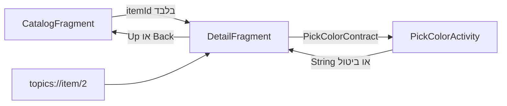

[מפת המעבדות]({{ '/android/topics/' | relative_url }})

{: .box-success}
בסוף המעבדה יש מסך קטלוג, מסך פריט ומסך בחירת צבע. כניסה לפריט מעבירה **מזהה** ולא אובייקט שלם; Back ו־Up חוזרים לקטלוג; קישור `topics://item/2` פותח פריט ישירות; בחירת צבע חוזרת כתוצאה מטיפוס `String` ושורדת יצירה מחדש של המסך.

התחילו מ־`master` בפרויקט **topics**. ענף התוצאה הוא **`codex/navigation-flow`**. זהו מעבר ממסך Empty Views יחיד לגרף קטן וברור; אין צורך להחליף את שאר תשתית התבנית.

## מפת הזרימה



**Back** הוא פעולת המשתמש לחזור למקום הקודם ב־task/back stack. **Up** הוא פעולת הממשק לחזור להורה ההיררכי באפליקציה. כשנכנסים מקטלוג לפריט הן נראות דומות; אחרי כניסה מקישור חיצוני הן עשויות להיות שונות. ב־[תיעוד Android ל־deep links](https://developer.android.com/guide/navigation/design/deep-link) מוסבר גם תפקיד `FLAG_ACTIVITY_NEW_TASK` במבנה ה־Back stack.

## 1. מוסיפים Navigation Component וגרף

ב־**Gradle Scripts > libs.versions.toml** הוסיפו `navigation = "2.10.2"` למקטע `[versions]` ואת `navigation-fragment = { group = "androidx.navigation", name = "navigation-fragment", version.ref = "navigation" }` למקטע `[libraries]`. ב־**Gradle Scripts > build.gradle.kts (Module :app)** הוסיפו `implementation(libs.navigation.fragment)`, ואז בצעו Sync. ה־Navigation Component מחזיק את היעד הנוכחי ואת המחסנית; אין צורך לנהל בעצמנו `FragmentTransaction` לכל לחיצה.

צרו קובץ `nav_graph.xml` בתוך **app > res > navigation**. אם התיקייה אינה קיימת, צרו Android Resource Directory מסוג `navigation`:

```xml
<?xml version="1.0" encoding="utf-8"?>
<navigation xmlns:android="http://schemas.android.com/apk/res/android"
    xmlns:app="http://schemas.android.com/apk/res-auto"
    android:id="@+id/nav_graph"
    app:startDestination="@id/catalogFragment">

    <fragment
        android:id="@+id/catalogFragment"
        android:name="com.example.topics.CatalogFragment"
        android:label="Catalog">
        <action
            android:id="@+id/action_catalog_to_detail"
            app:destination="@id/detailFragment" />
    </fragment>

    <fragment
        android:id="@+id/detailFragment"
        android:name="com.example.topics.DetailFragment"
        android:label="Item">
        <argument
            android:name="itemId"
            app:argType="integer" />
        <deepLink app:uri="topics://item/{itemId}" />
    </fragment>
</navigation>
```

ה־`action` מתאר מעבר מתוך הקטלוג. ה־`argument` אומר ש־`itemId` הוא מספר. ה־deep link מספק אותו מספר מתוך הכתובת. לא מעבירים `Item` שלם ב־`Bundle`: במסך היעד טוענים את הפריט מחדש ממקור האמת לפי ה־ID. זה מצמצם תלות בגרסת המחלקה ובגודל ה־Intent.

ב־**app > manifests > AndroidManifest.xml** הוסיפו בתוך ההגדרה הקיימת של `MainActivity`, אחרי ה־`intent-filter`, את `<nav-graph android:value="@navigation/nav_graph" />`. בזמן הבנייה Navigation יוצר מכך את מסנני ה־Intent של הקישורים. הוסיפו גם Activity לא מיוצאת לתוצאת הצבע:

```xml
<activity
    android:name=".PickColorActivity"
    android:exported="false" />
```

## 2. מחברים את ה־NavHost ואת Up

ב־**app > res > layout > activity_main.xml** השאירו את ה־`ConstraintLayout` החיצוני ואת `id="@+id/main"` בשביל מאזין ה־insets של התבנית. החליפו את `Hello World` בכפתור Up וב־`FragmentContainerView`:

```xml
<Button
    android:id="@+id/up_button"
    android:layout_width="wrap_content"
    android:layout_height="wrap_content"
    android:text="@string/navigate_up"
    android:visibility="gone"
    app:layout_constraintStart_toStartOf="parent"
    app:layout_constraintTop_toTopOf="parent" />

<androidx.fragment.app.FragmentContainerView
    android:id="@+id/nav_host"
    android:name="androidx.navigation.fragment.NavHostFragment"
    android:layout_width="0dp"
    android:layout_height="0dp"
    app:defaultNavHost="true"
    app:navGraph="@navigation/nav_graph"
    app:layout_constraintBottom_toBottomOf="parent"
    app:layout_constraintEnd_toEndOf="parent"
    app:layout_constraintStart_toStartOf="parent"
    app:layout_constraintTop_toBottomOf="@id/up_button" />
```

`defaultNavHost=true` מחבר את פעולת Back של המערכת ל־NavController. ב־`MainActivity` הוסיפו import של `View`,‏ `NavController` ו־`NavHostFragment`. אחרי מאזין ה־insets, מצאו את ה־host וחברו את Up. ה־destination listener מסתיר את Up בקטלוג ומראה אותו בפריט:

```java
NavHostFragment host = (NavHostFragment) getSupportFragmentManager()
        .findFragmentById(R.id.nav_host);
if (host == null) throw new IllegalStateException("Missing navigation host");
NavController nav = host.getNavController();
binding.upButton.setOnClickListener(v -> nav.navigateUp());
nav.addOnDestinationChangedListener((controller, destination, arguments) ->
        binding.upButton.setVisibility(destination.getId() == R.id.catalogFragment
                ? View.GONE : View.VISIBLE));
```

שמרו את `EdgeToEdge`, ניפוח View Binding ו־insets של התבנית. פצלו את שורת `setPadding`/`return insets` לשתי שורות כדי שהמאזין יישאר קריא. את `navigateUp()` מפעילים מתוך לחצן Up; Back נשאר בשליטת ה־NavHost.

## 3. בונים קטלוג ופריט עם View Binding

צרו ב־**app > res > layout** את `fragment_catalog.xml`:‏ `LinearLayout` אנכי עם padding של `24dp`, כותרת `@string/catalog_title` בגודל `24sp`, ושני Buttons ברוחב מלא `@+id/open_first` ו־`@+id/open_second`. צרו `fragment_detail.xml`:‏ `LinearLayout` דומה עם `TextView id=item_name`,‏ `Button id=pick_color` ו־`TextView id=color_result`. הוסיפו מחרוזות מתאימות ל־**app > res > values > strings.xml**, למשל `open_first`,‏ `open_second`,‏ `item_name` (`Item %1$d: %2$s`) ו־`missing_item` (`Item %1$d was not found.`). בדיפ של ענף התוצאה נמצאים ה־XML ויתר המחרוזות המדויקות.

ב־**app > kotlin+java > com.example.topics** צרו מקור נתונים קטן בשם `ItemRepository`:

```java
package com.example.topics;

/** Tiny local source of truth; screens pass IDs and ask this source for data. */
public final class ItemRepository {
    private ItemRepository() { }

    public static String findName(int id) {
        if (id == 1) return "Compass";
        if (id == 2) return "Notebook";
        return null;
    }
}
```

צרו `CatalogFragment` מסוג `Fragment`. ב־`onCreateView` נפחו `FragmentCatalogBinding` והחזירו `binding.getRoot()`. ב־`onViewCreated` חברו `openFirst` אל `open(1)` ו־`openSecond` אל `open(2)`; ב־`onDestroyView` אפסו `binding = null`. המעבר עצמו:

```java
private void open(int id) {
    Bundle args = new Bundle();
    args.putInt("itemId", id);
    NavHostFragment.findNavController(this).navigate(R.id.action_catalog_to_detail, args);
}
```

צרו `DetailFragment` עם `FragmentDetailBinding` באותו דפוס של `onCreateView`/`onDestroyView`. ב־`onViewCreated` קראו את ה־ID מן ה־arguments, בקשו שם מן ה־Repository והציגו גם מקרה של ID לא קיים:

```java
int itemId = requireArguments().getInt("itemId");
String name = ItemRepository.findName(itemId);
binding.itemName.setText(name == null
        ? getString(R.string.missing_item, itemId)
        : getString(R.string.item_name, itemId, name));
```

כל עוד ה־Fragment עצמו קיים, `selectedColor` הוא שדה שלו. כדי לשרוד יצירה מחדש של Activity/Fragment, שמרו אותו ב־`onSaveInstanceState` תחת המפתח `selectedColor`, והחזירו אותו ב־`onViewCreated` לפני הצגת הצבע. שמירת צבע הבחירה אינה מחליפה את `itemId` של יעד הניווט: אלה שני סוגי מצב שונים.

## 4. מחזירים תוצאה טיפוסית מ־Activity

צרו `activity_pick_color.xml` עם `LinearLayout` אנכי ושני Buttons ברוחב מלא: `choose_red` ו־`choose_blue`. הוסיפו את המחרוזות `color_red`,‏ `color_blue`,‏ `pick_color`,‏ `color_none` ו־`color_selected`. צרו `PickColorActivity` שמנפחת `ActivityPickColorBinding`, מפעילה EdgeToEdge/insets ומחברת כל כפתור אל `finishWithColor(...)`:

```java
private void finishWithColor(String color) {
    setResult(RESULT_OK, new Intent().putExtra(PickColorContract.EXTRA_COLOR, color));
    finish();
}
```

לחיצה על Back במסך הבוחר אינה קוראת למתודה הזו; התוצאה היא `RESULT_CANCELED`. כדי ש־`DetailFragment` לא תפרש בעצמה Intent גולמי, צרו `PickColorContract`:

```java
package com.example.topics;

import android.app.Activity;
import android.content.Context;
import android.content.Intent;

import androidx.activity.result.contract.ActivityResultContract;
import androidx.annotation.NonNull;
import androidx.annotation.Nullable;

/** Converts an Activity result Intent to a nullable color name. */
public final class PickColorContract extends ActivityResultContract<Void, String> {
    public static final String EXTRA_COLOR = "com.example.topics.COLOR";

    @NonNull
    @Override
    public Intent createIntent(@NonNull Context context, Void input) {
        return new Intent(context, PickColorActivity.class);
    }

    @Nullable
    @Override
    public String parseResult(int resultCode, @Nullable Intent intent) {
        if (resultCode != Activity.RESULT_OK || intent == null) return null;
        return intent.getStringExtra(EXTRA_COLOR);
    }
}
```

ב־`DetailFragment` רשמו launcher כשדה, לפני יצירת ה־View. התוצאה היא `String` או `null`, לא `ActivityResult` שהמסך צריך לפרק:

```java
private final ActivityResultLauncher<Void> pickColor =
        registerForActivityResult(new PickColorContract(), color -> {
            if (color != null) {
                selectedColor = color;
                showColor();
            }
        });

// In onViewCreated:
binding.pickColor.setOnClickListener(v -> pickColor.launch(null));
```

`showColor()` מעדכנת `binding.colorResult` רק אם ה־binding קיים, עם `color_none` או `color_selected`. כשחוזרים מתוצאת Activity אחרי שינוי תצורה, ה־launcher הרשום ב־Fragment מקבל את התוצאה במחזור החיים המתאים. במעבדה זו הצבע הוא שם פשוט; בפרויקט אמיתי תוצאה יכולה להיות URI של מסמך או ID של נתון שנבחר.

## 5. בודקים את כל נקודות הכניסה

ב־**Gradle Scripts > libs.versions.toml** הוסיפו `testCore = "1.7.0"` ו־`androidx-test-core = { group = "androidx.test", name = "core", version.ref = "testCore" }`. ב־**Gradle Scripts > build.gradle.kts (Module :app)** הוסיפו `androidTestImplementation(libs.androidx.test.core)`. צרו `NavigationFlowTest` ב־**app > kotlin+java > com.example.topics (androidTest)**; בדיפ התוצאה יש שלוש בדיקות Espresso/ActivityScenario:

1. קטלוג → פריט 1 → בחירת Blue → חזרה לפריט → `scenario.recreate()` → הצבע נשאר → Up מחזיר לקטלוג.
2. קטלוג → פריט 2 → Back של המערכת מחזיר לקטלוג.
3. `Intent.ACTION_VIEW` אל `topics://item/2` פותח ישירות `Item 2: Notebook`; Up מחזיר לקטלוג.

הריצו `:app:connectedDebugAndroidTest` על אמולטור. לבדיקה ידנית של כניסה מבחוץ אפשר להריץ במחשב שבו מותקן `adb`:

```text
adb shell am start -a android.intent.action.VIEW -d 'topics://item/2'
```

קישור חיצוני נוח לתרגול, אך סכמת `topics://` אינה כתובת HTTPS מאומתת ואינה מיועדת לקישור ציבורי אמין; בפרויקט הפצה השתמשו ב־[Android App Links](https://developer.android.com/training/app-links). כאן היא מאפשרת לראות בקלות שה־ID מגיע מן הכתובת ולא מן המסך הקודם.
