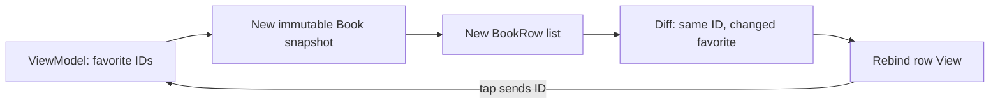

[מפת המעבדות]({{ '/android/topics/' | relative_url }}) · [הבסיס: ViewModel ו־Repository]({{ '/android/topics/04-viewmodel-repository/' | relative_url }})

{: .box-success}
בסוף המעבדה מסך הספרים הקיים מציג 20 פריטים ברשימה גוללת, עם כותרת מסוג שורה אחר. לחיצה על Save מצמידה סימון לספר בעל ID מסוים; הסימון נשאר נכון אחרי גלילה רחוקה וחזרה, טעינה חוזרת וסיבוב מסך. תרחישי Empty ו־Error/Retry הקודמים ממשיכים לעבוד.

התחילו מענף **`codex/viewmodel-repository`** של [מעבדה 04]({{ '/android/topics/04-viewmodel-repository/' | relative_url }}). ענף התוצאה הוא **`codex/recyclerview-diffutil`**. מחליפים רק את דרך הצגת רשימת ההצלחה ואת צורת המודל הדרושה לזהות פריטים; לא משנים את חוזה מצבי המסך.

## מה RecyclerView ממחזרת?

`RecyclerView` אינה יוצרת View לכל אחד מ־20 הספרים בבת אחת. כשהמשתמש גולל, `ViewHolder` שהיה קשור לספר אחד יכול להיקשר לספר אחר. לכן `onBindViewHolder` חייב להציב **את כל הטקסט והמאזינים** לפי הפריט הנוכחי. שדה `favorite` על ViewHolder היה נצמד ל־View הממוחזר, לא לספר. [תיעוד RecyclerView](https://developer.android.com/develop/ui/views/layout/recyclerview) מתאר את ה־Adapter,‏ ViewHolder ו־LayoutManager.

| מושג | אצלנו |
|---:|---:|
| זהות יציבה | `Book.id`:‏ 1–20; כותרת המדף מקבלת `-1` |
| תוכן שעשוי להשתנות | `Book.title` ו־`Book.favorite` |
| מקור מצב Favorite | `Set<Integer> favoriteIds` ב־ViewModel |
| ViewHolder | מחזיק View Binding של `row_header` או `row_book` בלבד |
| DiffUtil | משווה רשימה ישנה לחדשה, כדי לעדכן את השורות שהשתנו |

## אותה תצוגה יכולה להציג שני ספרים שונים

דמיינו שה־ViewHolder הראשון מציג Ada מסומנת, ואחרי גלילה משמש להצגת ספר 15 שאינו מסומן. המערכת ממחזרת **את עץ התצוגה**, לא את המשמעות שלו. אם bind מציבה כוכב רק כשהערך true, הספר החדש יירש את הכוכב הישן. לכן כל bind חייב לכתוב גם את מצב false, ולהחליף את המאזין כך שישלח את ID של הספר הנוכחי.



נשווה ספר בעל ID 1 לפני ואחרי Save: הזהות זהה ולכן `areItemsTheSame` מחזירה true; התוכן השתנה ולכן `areContentsTheSame` מחזירה false. אובייקט חדש אינו בהכרח פריט חדש. אם נעביר ל־DiffUtil את אותו אובייקט ונשנה אותו במקום, הצד "לפני" עשוי כבר להכיל את הערך החדש ולא יישאר הבדל להשוות. לכן `withFavorite` יוצרת ספר חדש, ו־`submitBooks` יוצרת רשימה חדשה.

מיקום 3 אומר רק "השורה השלישית כרגע". הוספת כותרת או מיון משנה אותו; ID מזהה את הספר גם אחריהם. המאזין נוצר מחדש בכל bind ולוכד את `row` של אותו bind, ולא מיקום שנשמר מזמן. stable IDs מאפשרים גם ל־RecyclerView לזהות שורות; הם אינם תחליף לכללי השוויון של DiffUtil.

`clone()` מעתיקה כאן את המערך בלבד, ולא כל `Book` בתוכו. זה מספיק משום שגם Book בלתי משתנה: שדותיו final, הכותרת String, ושינוי favorite מחזיר Book חדשה. favoriteIds שייכת ל־ViewModel ולא ל־ViewHolder, ולכן סיבוב ומיחזור אינם מאבדים אותה. אחרי תהליך חדש ה־Set מתחילה מחדש; המעבדה הבאה תחליף את מקור האמת הזה במסד.

## עצרו ונבאו

View שהראתה ספר מסומן ממוחזרת עבור ספר שאינו מסומן. מה יקרה אם bind תשנה את הכפתור רק כאשר favorite=true? כתבו תחזית לפני פתיחת ההסבר, ואז הצביעו על המשתנה או התנאי בקוד שמצדיקים אותה.

<details markdown="1">
<summary>בדיקת ההבנה</summary>

הכוכב הישן עלול להישאר. bind חייבת להציב גם את מצב המסומן וגם את מצב הלא־מסומן מתוך הנתון הנוכחי. ה־View היא משטח תצוגה ממוחזר; מקור האמת הוא זהות הספר והמודל.

</details>

## 1. מוסיפים RecyclerView ומחליפים את תצוגת ההצלחה

ב־**Gradle Scripts > libs.versions.toml** הוסיפו `recyclerview = "1.4.0"` ל־`[versions]` ואת `recyclerview = { group = "androidx.recyclerview", name = "recyclerview", version.ref = "recyclerview" }` ל־`[libraries]`. ב־**Gradle Scripts > build.gradle.kts (Module :app)** הוסיפו `implementation(libs.recyclerview)` ובצעו Sync.

ב־**app > res > layout > activity_main.xml** החליפו *רק* את `TextView` בעל `id=book_list` ב־`RecyclerView` עם אותו ID. לצורך המעבדה גובהו תחום ל־`240dp`, כך שנדרש גלילה פנימית וחלק מן ה־ViewHolders ייקשרו מחדש. השאירו `visibility="gone"` ואת שאר המסך:

```xml
<androidx.recyclerview.widget.RecyclerView
    android:id="@+id/book_list"
    android:layout_width="match_parent"
    android:layout_height="240dp"
    android:layout_marginTop="8dp"
    android:visibility="gone" />
```

הוסיפו ל־**app > res > values > strings.xml** את `books_heading` = `The shelf`,‏ `favorite_on` = `Saved ★` ו־`favorite_off` = `Save ☆`. עדכנו את `ui_states_instruction` כך שיבקש לטעון, לגלול ולשמור Favorite. שני סמלי הכוכב מלווים גם במילים — המשמעות אינה תלויה בסמל בלבד.

## 2. נותנים לכל ספר ID ומצב בלתי משתנה

ב־**app > kotlin+java > com.example.topics** צרו `Book.java`:

```java
package com.example.topics;

/** A stable item ID and immutable display state survive recycled row views. */
public final class Book {
    public final int id;
    public final String title;
    public final boolean favorite;

    /**
     * Creates immutable display data for one stable book identity.
     *
     * @param id stable positive identity, independent of row position
     * @param title visible title
     * @param favorite current favorite state
     */
    public Book(int id, String title, boolean favorite) {
        this.id = id;
        this.title = title;
        this.favorite = favorite;
    }

    /**
     * Returns updated display data while preserving this book's identity.
     *
     * @param value new favorite state
     * @return new Book; this instance remains unchanged
     */
    public Book withFavorite(boolean value) {
        return new Book(id, title, value);
    }
}
```

לספר חדש יש אותו ID גם אם מצבו `favorite` השתנה. `withFavorite` מחזירה **אובייקט חדש**; כך `DiffUtil` יכולה להשוות תמונת מצב ישנה לחדשה. ב־`BooksUiState` החליפו את כל ההופעות של `String[]`/`new String[0]` ב־`Book[]`/`new Book[0]` (השדה, constructor,‏ `success` ו־`getBooks`):


 public final class BooksUiState {
     ⁞
-    private final String[] books;
+    private final Book[] books;
     ⁞
-    private BooksUiState(Kind kind, String[] books) {
+    private BooksUiState(Kind kind, Book[] books) {
         this.kind = kind;
         this.books = books.clone();
     }
     ⁞
-        return new BooksUiState(kind, new String[0]);
+        return new BooksUiState(kind, new Book[0]);
     ⁞
-    public static BooksUiState success(String[] books) {
+    public static BooksUiState success(Book[] books) {
     ⁞
-    public String[] getBooks() {
+    public Book[] getBooks() {
         return books.clone();
     }
 }


השאירו את ההעתקה `clone()` כדי שקוד חיצוני לא ישנה את מערך ה־state מאחורי גבו של המסך.

ב־`FakeBookRepository.Result` שנו את סוג `books` ל־`Book[]`. תרחישי שגיאה וריק מחזירים `new Book[0]`. תרחיש הצלחה מחזיר 20 ספרים עם ID קבוע; שלושת השמות הראשונים נשארים Ada,‏ Grace ו־Linus:

```java
Book[] books = new Book[20];
String[] first = {"Ada", "Grace", "Linus"};
for (int index = 0; index < books.length; index++) {
    String title = index < first.length ? first[index] : "Book " + (index + 1);
    books[index] = new Book(index + 1, title, false);
}
return new Result(Status.SUCCESS, books);
```

20 שורות מאפשרות לראות מיחזור בפועל, במקום רשימה קצרה שכל שורותיה נשארות על המסך.

## 3. מוסיפים כותרת וספר כשני סוגי שורות

צרו `row_header.xml` ב־**app > res > layout**:‏ `TextView` יחיד עם `id=header_title`, רוחב מלא, `wrap_content`,‏ `padding=12dp` ו־`textSize=20sp`. צרו `row_book.xml`:‏ `LinearLayout` אופקי עם `padding=4dp`, ובו `TextView id=book_title` ברוחב `0dp` עם `layout_weight=1`, ואז `Button id=favorite` בגודל `wrap_content`. ה־TextView מקבל `padding=12dp` ו־`textSize=18sp`. אין כאן ערך Favorite שמור ב־XML; הוא נקבע בכל bind.

צרו `BookRow.java`. כותרת המדף והספרים משתמשים באותה רשימת Adapter, אבל רק לספר יש Favorite:

```java
package com.example.topics;

/** One adapter row: a section header or a book with a stable ID. */
public final class BookRow {
    public static final int HEADER = 0;
    public static final int BOOK = 1;

    public final int type;
    public final long id;
    public final String title;
    public final boolean favorite;

    /**
     * Creates one immutable adapter row; factories choose its meaningful row type.
     *
     * @param type header or book
     * @param id identity unique across this adapter
     * @param title visible row text
     * @param favorite favorite state for a book row
     */
    private BookRow(int type, long id, String title, boolean favorite) {
        this.type = type;
        this.id = id;
        this.title = title;
        this.favorite = favorite;
    }

    /**
     * Creates a heading whose reserved ID does not collide with positive book IDs.
     *
     * @param title heading text
     * @return a header row with no favorite action
     */
    public static BookRow header(String title) {
        return new BookRow(HEADER, -1, title, false);
    }

    /**
     * Projects a book snapshot into adapter data.
     *
     * @param book immutable book to display
     * @return a book row with the same identity and visible state
     */
    public static BookRow book(Book book) {
        return new BookRow(BOOK, book.id, book.title, book.favorite);
    }
}
```

ה־ID של הכותרת (`-1`) אינו מתנגש ב־IDs החיוביים של הספרים. סוג השורה אינו נקבע לפי המיקום: אם מסדרים את הספרים מחדש, אותה זהות נשארת לאותו פריט.

## 4. נותנים ל־ListAdapter לעדכן רק מה שהשתנה

צרו `BookAdapter` שיורשת מ־`ListAdapter<BookRow, RecyclerView.ViewHolder>`. המחלקה המלאה מופיעה בקוד המשלים שבהמשך, עם Javadoc לכל callback ולכל ViewHolder. החלקים שקובעים את התנהגות הרשימה הם:

```java
private static final DiffUtil.ItemCallback<BookRow> DIFF = new DiffUtil.ItemCallback<>() {
    /**
     * Compares logical identity even when displayed content has changed.
     *
     * @param oldItem row from the previous list
     * @param newItem row from the incoming list
     * @return true for matching row type and stable ID
     */
    @Override
    public boolean areItemsTheSame(@NonNull BookRow oldItem, @NonNull BookRow newItem) {
        return oldItem.type == newItem.type && oldItem.id == newItem.id;
    }

    /**
     * Compares every field whose change requires this row to be rebound.
     *
     * @param oldItem previous visible data
     * @param newItem incoming visible data
     * @return true when title and favorite state match
     */
    @Override
    public boolean areContentsTheSame(@NonNull BookRow oldItem, @NonNull BookRow newItem) {
        return oldItem.favorite == newItem.favorite && oldItem.title.equals(newItem.title);
    }
};
```

`areItemsTheSame` שואלת אם זו *אותה שורה* גם כשהתוכן השתנה; `areContentsTheSame` שואלת אם צריך לצייר אותה מחדש. אם Favorite התהפך, התשובה הראשונה היא `true` והשנייה `false`. ה־constructor קורא `super(DIFF)`, שומר callback מסוג `OnFavoriteClick`, וקורא `setHasStableIds(true)`. `getItemId(position)` מחזירה `getItem(position).id`; `getItemViewType(position)` מחזירה `getItem(position).type`.

`submitBooks(Book[] books, String heading)` בונה `ArrayList<BookRow>` חדשה, מוסיפה כותרת רק כשיש ספרים, ואז מוסיפה `BookRow.book(book)` לכל ספר וקוראת `submitList(rows)`. אל תשנו את הרשימה הישנה במקום: `ListAdapter` זקוקה לשתי תמונות מצב כדי לחשב הבדל.

`onCreateViewHolder` מנפחת `RowHeaderBinding` עבור `HEADER` ו־`RowBookBinding` עבור `BOOK`, ומשתמשת בשתי מחלקות ViewHolder קטנות. `onBindViewHolder` מציבה את הכותרת או, בספר, את השם, מצב Favorite ומאזיני הלחיצה. שורות ה־bind החשובות:

```java
BookRow row = getItem(position);
if (holder instanceof HeaderHolder) {
    ((HeaderHolder) holder).binding.headerTitle.setText(row.title);
} else {
    BookHolder bookHolder = (BookHolder) holder;
    bookHolder.binding.bookTitle.setText(row.title);
    // Both true and false overwrite any state left by this recycled View.
    bookHolder.binding.favorite.setText(row.favorite
            ? R.string.favorite_on : R.string.favorite_off);
    bookHolder.binding.favorite.setOnClickListener(v -> onFavoriteClick.onFavoriteClick((int) row.id));
    bookHolder.binding.getRoot().setOnClickListener(v -> onFavoriteClick.onFavoriteClick((int) row.id));
}
```

שני המאזינים שולחים **ID**, לא מספר מיקום. מיקום עלול להשתנות אחרי `submitList`; ID של הספר אינו משתנה. `ListAdapter` מפעילה את חישוב ההבדלים ברקע ומעדכנת את הרשימה בלי `notifyDataSetChanged()` גורף. [המלצת Android ל־ListAdapter](https://developer.android.com/reference/androidx/recyclerview/widget/RecyclerView) מתאימה בדיוק למקרה הזה.

## 5. שומרים את פעולת המשתמש במודל, לא בשורה

ב־`BooksViewModel` הוסיפו `Set<Integer> favoriteIds = new HashSet<>()` ואת imports של `Set`/`HashSet`. הפעולה הבאה מחליפה ספר אחד בתמונת מצב חדשה:

```java
/**
 * Changes state by stable identity, then publishes a new immutable snapshot.
 *
 * @param id book identity received from the row click, never an adapter position
 */
public void toggleFavorite(int id) {
    BooksUiState current = state.getValue();
    if (current == null || current.kind != BooksUiState.Kind.SUCCESS) return;
    // Set.add returns false when the identity is already present: toggle it off.
    if (!favoriteIds.add(id)) favoriteIds.remove(id);
    Book[] books = current.getBooks();
    for (int index = 0; index < books.length; index++) {
        if (books[index].id == id) {
            books[index] = books[index].withFavorite(favoriteIds.contains(id));
            break;
        }
    }
    state.setValue(BooksUiState.success(books));
}
```

בנתיב ההצלחה של `scheduleLoad` הקיימת, החליפו את מסירת `result.books` הישירה בהעתקת המערך ובהחלת `favoriteIds` על כל ספר לפני `state.setValue`. כך טעינה חוזרת של אותו מקור אינה מוחקת בחירת משתמש. השמירה כאן היא בזיכרון של ה־ViewModel: היא שורדת מיחזור שורות, טעינה חוזרת וסיבוב, **אך אינה שמירה קבועה אחרי הריגת תהליך**. לשמירה מתמשכת צריך מקור נתונים מקומי, כמו Room או DataStore, בהתאם למבנה הנתונים.

ב־`MainActivity` הוסיפו שדה `BookAdapter bookAdapter`, ואז אחרי יצירת ה־ViewModel ב־`onCreate`:

```java
bookAdapter = new BookAdapter(viewModel::toggleFavorite);
binding.bookList.setLayoutManager(new LinearLayoutManager(this));
binding.bookList.setAdapter(bookAdapter);
```

הוסיפו import של `LinearLayoutManager`. ב־`render`, השאירו את ההחלטה הקיימת מתי `bookList` גלויה. אחריה שלחו ל־Adapter את הספרים רק במצב SUCCESS; בשאר המצבים שלחו מערך ריק:

```java
bookAdapter.submitBooks(state.kind == BooksUiState.Kind.SUCCESS
        ? state.getBooks() : new Book[0], getString(R.string.books_heading));
```

מחקו את שורת `binding.bookList.setText(String.join(...))` הישנה: `bookList` היא עכשיו RecyclerView, וכל שורה נקשרת דרך ה־Adapter. מצבי Loading,‏ Empty ו־Error/Retry נשארים כפי שהיו.

## 6. בודקים מיחזור ושחזור

ב־**Gradle Scripts > libs.versions.toml** הוסיפו `testCore = "1.7.0"`, ספריית `androidx.test:core`, וספריית `androidx.test.espresso:espresso-contrib` עם `version.ref = "espressoCore"`. ב־**Gradle Scripts > build.gradle.kts (Module :app)** הוסיפו `androidTestImplementation` לשתיהן. `espresso-contrib` מספקת `RecyclerViewActions`, שמאפשרת לגלול לשורה מסוימת בבדיקת UI.

צרו `BookListUiTest` ב־**app > kotlin+java > com.example.topics (androidTest)**. הבדיקה המלאה שבקוד המשלים טוענת ספרים, לוחצת על שורה 1 (אחרי הכותרת), מאמתת `Saved ★`, גוללת לשורה 20 וחזרה, טוענת שוב ומסובבת עם `ActivityScenario.recreate()`. בכל תחנה היא מאמתת את אותו טקסט גלוי. הריצו `:app:connectedDebugAndroidTest` על אמולטור.

בדקו גם ידנית: **Load an empty shelf** צריך להציג מצב ריק בלי כותרת מדף; **Fail once, then succeed** צריך להציג שגיאה ו־Retry, ואז רשימה. בענף התוצאה נבדקו שני המסלולים באמולטור. אם מסירים זמנית מ־`onBindViewHolder` את השורה שמציבה את טקסט Favorite, גללו הרחק וחזרו: ViewHolder ממוחזר עלול להראות מצב של ספר אחר. החזירו את השורה אחרי הניסוי.


## הקוד המשלים במלואו

הקטעים הגלויים בשיעור ממקדים את הרעיון; הקבצים הבאים משלימים את כל הקוד הדרוש, עם תיעוד והערות. קראו את השינוי יחד עם ההסבר שמעליו. הם חלק מן השיעור ואינם דורשים פתיחת ענף דוגמה או אתר שפורסם.

### BookAdapter.java

[פתיחת המקור ישירות]({{ '/android/topics/code/11/BookAdapter.java.md' | relative_url }}) — בקובץ Markdown המקורי, הקוד נמצא ב־`code/11/BookAdapter.java.md` ביחס לשיעור.

<details markdown="1">
<summary>הקוד המלא והשינויים עבור BookAdapter.java</summary>



</details>

### BookListUiTest.java

[פתיחת המקור ישירות]({{ '/android/topics/code/11/BookListUiTest.java.md' | relative_url }}) — בקובץ Markdown המקורי, הקוד נמצא ב־`code/11/BookListUiTest.java.md` ביחס לשיעור.

<details markdown="1">
<summary>הקוד המלא והשינויים עבור BookListUiTest.java</summary>



</details>
