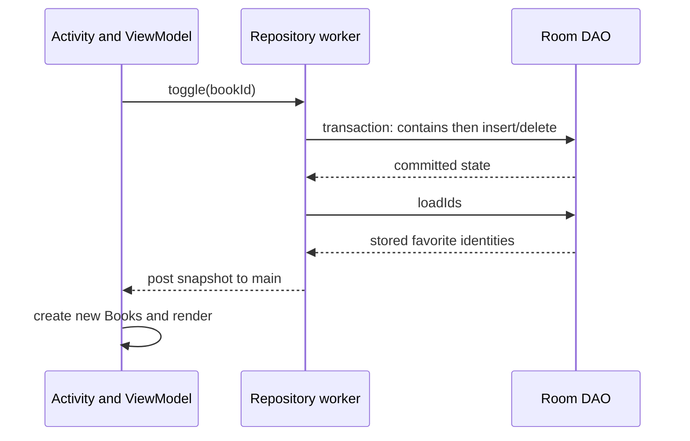

[מפת המעבדות]({{ '/android/topics/' | relative_url }}) · [הרשימה שממנה מתחילים]({{ '/android/topics/11-recyclerview-diffutil/' | relative_url }})

{: .box-success}
בסוף המעבדה סימון Save של ספר נשמר במסד מקומי. הוא מופיע גם לאחר עצירת האפליקציה ופתיחתה מחדש. בהמשך משדרגים את המסד מגרסה 1 לגרסה 2, מוסיפים עמודה, ובודקים שהספר שסומן נשאר. אין צורך בשרת או בחשבון משתמש.

בסיס העבודה הוא ענף **`codex/recyclerview-diffutil`**. בענף התוצאה **`codex/room-persistence`** יש גם commit ביניים עם גרסה 1 עובדת. בחלון **Git > Log** מצאו את ה־commit שבו `TopicsDatabase` עדיין מציינת `version = 1`; מזהה ה־commit תלוי בעותק הפרויקט. התחילו בגרסה 1, הפעילו אותה ושמרו ספר, ורק אז עברו לשדרוג גרסה 2. כך אפשר להבחין בין בדיקת מסד חדש לבין בדיקת migration אמיתי.

## מה שומרים, ואיפה?

במעבדה 11 ה־`ViewModel` החזיק `Set<Integer> favoriteIds` בזיכרון. סיבוב מסך השאיר את אותו ViewModel, אבל סיום התהליך יוצר אותו מחדש ולכן הסימונים נעלמו. כאן **שורת מסד אחת פירושה שספר בעל `bookId` זה הוא Favorite**. `Book` נשאר מודל התצוגה, והמסד שומר רק את המזהה. ה־`ViewModel` מחבר את המזהים שנקראו מהמסד לספרים שמקורם ב־`FakeBookRepository`.

| רכיב | אחריות |
|---:|---:|
| `FavoriteEntity` | מבנה טבלת `favorites` והמפתח הראשי |
| `FavoriteDao` | שאילתות ופעולת toggle אטומית |
| `TopicsDatabase` | גרסת הסכימה והרשאת גישה ל־DAO |
| `FavoritesRepository` | תור עבודה יחיד מחוץ ל־main thread והחזרת תוצאה ל־UI |
| `BooksViewModel` | מצב המסך; אינו מריץ SQL |

`Room` היא שכבה מעל SQLite: ה־annotations מגדירים את הטבלה והשאילתות, וה־annotation processor מייצר מימוש בזמן build. [מדריך Room הרשמי](https://developer.android.com/training/data-storage/room) מסביר את שלושת הרכיבים המרכזיים.

## מי רשאי לומר שהספר נשמר?

המסך אינו מקור האמת לשמירה. לחיצה מוסרת ID ל־ViewModel; ה־Repository מוסרת פעולה לתור I/O; ה־DAO משנה את המסד; ורק קריאה מן המסד מחזירה snapshot חדש למסך. אם נצייר כוכב מיד בלחיצה בלי לבדוק את תוצאת הכתיבה, נוכל להבטיח "נשמר" גם כאשר הכתיבה נכשלה. המעבדה מדגימה נתיב הצלחה; במוצר יש להוסיף חוזה שגיאה.



מפתח ראשי מונע שתי שורות עם אותו `bookId`; transaction מגדירה יחידה אטומית של קריאה ואז כתיבה. אלה הגנות שונות. executor יחיד שומר על סדר הלחיצות שה־Repository קיבלה, אבל אינו מחליף את העסקה במסד. `@Transaction` פועלת דרך מימוש Room שנוצר; אין ליצור DAO בעצמנו או לסמוך רק על שם המתודה.

ב־migration יש **שני חוזים שצריכים להסכים**: תוצאת ה־SQL על מסד ישן, והסכימה ש־Room מצפה למצוא בגרסה החדשה. `DEFAULT ''` ממלא עמודה עבור השורות שכבר קיימות וגם מגדיר ברירת מחדל SQL. `@NonNull` קובע שהעמודה אינה nullable; הוא אינו מבטיח שהטקסט אינו ריק. כאן מחרוזת ריקה היא הערך המתוכנן. שינוי מספר הגרסה לבדו אינו מלמד את SQLite איך לשנות את הטבלה.

בדיקה על מסד חדש מדלגת על מסלול השדרוג. כדי לבדוק migration ניצור **נתון בגרסה 1**, נסגור, נפתח בגרסה 2 ונוודא שהנתון עדיין שם ושהסכימה תקינה. קובצי schemas מתעדים את שתי נקודות הזמן; מחיקת 1.json מאבדת את בסיס הבדיקה. אין להעביר את העמודה מראש לגרסה 1 כדי להקטין diff: השינוי הזה הוא בדיוק הדבר שהניסוי צריך ללמד.

## עצרו ונבאו

שתי פעולות toggle של אותו ID מתקבלות ברצף. מה צריך להיות המצב השמור בסוף, ומי קובעת אותו? כתבו תחזית לפני פתיחת ההסבר, ואז הצביעו על המשתנה או התנאי בקוד שמצדיקים אותה.

<details markdown="1">
<summary>בדיקת ההבנה</summary>

אם הספר התחיל לא מסומן, בסוף אינו מסומן. התור הסדרתי שומר על סדר הפעולות, וכל toggle קוראת ומחליפה מצב בטרנזקציה. המסך מקרין את המצב שאושר במסד; הוא אינו מנחש אותו על ידי ציור שני כוכבים.

</details>

## 1. מכינים Room ומייצאים סכימות

ב־**Gradle Scripts > libs.versions.toml** הוסיפו ל־`[versions]` את `room = "2.8.5"`. ב־`[libraries]` הוסיפו:

```toml
room-runtime = { group = "androidx.room", name = "room-runtime", version.ref = "room" }
room-compiler = { group = "androidx.room", name = "room-compiler", version.ref = "room" }
room-testing = { group = "androidx.room", name = "room-testing", version.ref = "room" }
```

ב־`[plugins]` הוסיפו `room = { id = "androidx.room", version.ref = "room" }`. ב־**Gradle Scripts > build.gradle.kts (Module :app)** הוסיפו את plugin Room, ספריית runtime, מעבד annotations, ספריית בדיקות ותיקייה לסכימות:

```kotlin
plugins {
    alias(libs.plugins.android.application)
    alias(libs.plugins.room)
}

room {
    schemaDirectory("$projectDir/schemas")
}

dependencies {
    // שאר התלויות הקיימות נשארות
    implementation(libs.room.runtime)
    annotationProcessor(libs.room.compiler)
    androidTestImplementation(libs.room.testing)
}
```

בצעו **Sync** לפני כתיבת קוד שתלוי במחלקות ש־Room תייצר. אין למחוק תלויות, בדיקות או קובצי template שאינם קשורים למעבדה. קובצי JSON שבתיקיית `schemas` הם חלק מן המקור: שמרו את גרסה 1 וגם את גרסה 2 ב־Git, כי בדיקת migration זקוקה לתיאור הסכימה הישנה.

## 2. יוצרים גרסה 1 שעובדת

ב־**app > kotlin+java > com.example.topics** צרו `FavoriteEntity.java`:

```java
package com.example.topics;

import androidx.room.Entity;
import androidx.room.PrimaryKey;

/** Version 1: one row means this book ID is a favorite. */
@Entity(tableName = "favorites")
public final class FavoriteEntity {
    @PrimaryKey
    public int bookId;

    /**
     * Creates a version-1 favorite row; row presence means this ID is saved.
     *
     * @param bookId stable book identity used as the primary key
     */
    public FavoriteEntity(int bookId) {
        this.bookId = bookId;
    }
}
```

`bookId` הוא המפתח הראשי: אותו ספר לא יכול להופיע פעמיים בטבלה. צרו באותה חבילה `FavoriteDao.java`:

```java
package com.example.topics;

import androidx.room.Dao;
import androidx.room.Insert;
import androidx.room.Query;
import androidx.room.Transaction;

import java.util.List;

/** Queries and one atomic read-then-write action. */
@Dao
public abstract class FavoriteDao {
    /**
     * Reads stored favorite identities on a worker thread.
     *
     * @return identities whose rows exist, with no ordering guarantee
     */
    @Query("SELECT bookId FROM favorites")
    public abstract List<Integer> loadIds();

    /**
     * Checks row presence within the transaction that decides a toggle.
     *
     * @param id stable book identity
     * @return whether this identity is currently stored
     */
    @Query("SELECT EXISTS(SELECT 1 FROM favorites WHERE bookId = :id)")
    protected abstract boolean contains(int id);

    /**
     * Inserts one favorite row; duplicate primary keys are rejected.
     *
     * @param favorite row to persist
     */
    @Insert
    protected abstract void insert(FavoriteEntity favorite);

    /**
     * Deletes only the row for the requested identity.
     *
     * @param id stable identity to unsave
     */
    @Query("DELETE FROM favorites WHERE bookId = :id")
    protected abstract void delete(int id);

    /**
     * Atomically reads and reverses row presence within one Room transaction.
     *
     * @param id stable book identity
     * @return true when now saved, false when now removed
     */
    @Transaction
    public boolean toggle(int id) {
        if (contains(id)) {
            delete(id);
            return false;
        }
        insert(new FavoriteEntity(id));
        return true;
    }
}
```

`toggle` קוראת ואז כותבת. `@Transaction` עוטפת את שתי הפעולות כיחידה אחת; תור יחיד ב־Repository שומר גם על סדר הלחיצות של המסך. צרו `TopicsDatabase.java`:

```java
package com.example.topics;

import androidx.room.Database;
import androidx.room.RoomDatabase;

/** First schema checkpoint. */
@Database(entities = {FavoriteEntity.class}, version = 1, exportSchema = true)
public abstract class TopicsDatabase extends RoomDatabase {
    /**
     * Provides Room's generated DAO implementation for this database.
     *
     * @return DAO that must be called off the UI thread
     */
    public abstract FavoriteDao favoriteDao();
}
```

בנו את האפליקציה עכשיו. ודאו שנוצר `1.json` תחת `app > schemas > com.example.topics.TopicsDatabase`. אם ה־build נכשל, תקנו אותו לפני המעבר לגרסה 2. אל תשתמשו ב־`fallbackToDestructiveMigration`: הוא מוחק נתוני משתמש כשחסרה דרך שדרוג.

## 3. מריצים גישה למסד מחוץ ל־main thread

צרו `FavoritesRepository.java` באותה חבילה:

```java
package com.example.topics;

import android.app.Application;
import android.os.Handler;
import android.os.Looper;
import androidx.room.Room;
import java.util.HashSet;
import java.util.Set;
import java.util.concurrent.ExecutorService;
import java.util.concurrent.Executors;

/** Runs Room work off main and delivers snapshots on main. */
public final class FavoritesRepository {
    public interface Listener {
        /**
         * Receives a database-confirmed snapshot on the main thread.
         *
         * @param ids stored favorite identities, independent of previous callbacks
         */
        void onFavorites(Set<Integer> ids);
    }

    private final TopicsDatabase database;
    private final ExecutorService io = Executors.newSingleThreadExecutor();
    private final Handler main = new Handler(Looper.getMainLooper());
    private volatile boolean closed;

    /**
     * Owns a database and serial I/O queue using a context independent of any Activity.
     *
     * @param application long-lived application context for opening the private database
     */
    public FavoritesRepository(Application application) {
        database = Room.databaseBuilder(application, TopicsDatabase.class,
                "favorites.db").build();
    }

    /**
     * Queues a read of stored identities without blocking the screen.
     *
     * @param listener recipient of the snapshot delivered on main
     */
    public void load(Listener listener) {
        io.execute(() -> deliver(listener));
    }

    /**
     * Queues the transaction and then reads the resulting identities on the same worker.
     *
     * @param id stable identity to toggle
     * @param listener recipient of the confirmed snapshot on main
     */
    public void toggle(int id, Listener listener) {
        io.execute(() -> {
            database.favoriteDao().toggle(id);
            deliver(listener);
        });
    }

    /**
     * Reads current identities on I/O and posts their snapshot to main if still open.
     *
     * @param listener receiver of the database-confirmed state
     */
    private void deliver(Listener listener) {
        Set<Integer> snapshot = new HashSet<>(database.favoriteDao().loadIds());
        main.post(() -> {
            if (!closed) listener.onFavorites(snapshot);
        });
    }

    /**
     * Suppresses late callbacks and queues database close after accepted I/O work.
     */
    public void close() {
        closed = true;
        // A serial queue closes only after operations already accepted have finished.
        io.execute(database::close);
        io.shutdown();
    }
}
```

Room אינה מאפשרת כאן גישת מסד ב־main thread. ה־Executor מבצע את הקריאה והכתיבה לפי הסדר; ה־Handler מחזיר snapshot ל־main thread, שבו `LiveData.setValue` מעדכנת את המסך. כש־ViewModel מסתיים, `closed` מונע callback מאוחר, וסגירת המסד נכנסת אחרי העבודה שכבר בתור.

ב־`BooksViewModel.java` החליפו את `ViewModel` ב־`AndroidViewModel` והוסיפו constructor שמקבל `Application`. ה־`Application` נותן למסד Context שחי מעבר ל־Activity. השדות והמתודות האחרים של שיעור 11 נשארים:


 import android.os.Handler;
 import android.os.Looper;
+import android.app.Application;
+import androidx.annotation.NonNull;
-import androidx.lifecycle.ViewModel;
+import androidx.lifecycle.AndroidViewModel;
 ⁞
-public final class BooksViewModel extends ViewModel {
+public final class BooksViewModel extends AndroidViewModel {
     ⁞
     private final Set<Integer> favoriteIds = new HashSet<>();
+    private final FavoritesRepository favorites;
+
+    /**
+     * Opens persisted favorites without holding an Activity or its Views.
+     *
+     * @param application context supplied by the AndroidViewModel factory
+     */
+    public BooksViewModel(@NonNull Application application) {
+        super(application);
+        favorites = new FavoritesRepository(application);
+        favorites.load(this::showFavorites);
+    }


החליפו את **כל** `toggleFavorite` הישנה, לרבות הלולאה שמעדכנת ספר אחד, במתודה הקצרה הבאה:

```java
/**
 * Requests a persisted change; the confirmed snapshot determines the displayed star.
 *
 * @param id stable identity of the clicked book
 */
public void toggleFavorite(int id) {
    BooksUiState current = state.getValue();
    if (current == null || current.kind != BooksUiState.Kind.SUCCESS) return;
    favorites.toggle(id, this::showFavorites);
}
```

הוסיפו `showFavorites` חדשה. כל snapshot — גם בקריאה הראשונית וגם אחרי לחיצה — מצייר את אותה אמת:

```java
/**
 * Replaces in-memory projection from a database-confirmed snapshot on main.
 *
 * @param ids all currently stored favorite identities
 */
private void showFavorites(Set<Integer> ids) {
    favoriteIds.clear();
    favoriteIds.addAll(ids);
    BooksUiState current = state.getValue();
    if (current == null || current.kind != BooksUiState.Kind.SUCCESS) return;
    Book[] books = current.getBooks();
    for (int index = 0; index < books.length; index++) {
        books[index] = books[index].withFavorite(
                favoriteIds.contains(books[index].id));
    }
    state.setValue(BooksUiState.success(books));
}
```

הלולאה ב־`scheduleLoad` שכבר קוראת את `favoriteIds` נשארת: אם תוצאת הספרים מגיעה *אחרי* קריאת המסד, היא עדיין מסומנת נכון. בסוף `onCleared()` הוסיפו `favorites.close();` ואז `super.onCleared();`. בנו, הפעילו, לחצו Save על Ada, עצרו את האפליקציה והפעילו מחדש. לאחר Load Books, Ada צריכה להציג `Saved ★`. השוו גם ל־`fce5c9d` כדי לוודא שכל השינויים עד כאן נמצאים בפרויקט.

## 4. משדרגים לגרסה 2 בלי למחוק את הסימון

נוסיף ל־Favorite שדה `note` שאינו `null` (מחרוזת ריקה מותרת), גם אם כרגע הממשק אינו מציג אותו. מטרתו כאן להדגים שינוי סכימה על נתון שכבר שמור. ב־`FavoriteEntity` הוסיפו:


 import androidx.room.Entity;
 import androidx.room.PrimaryKey;
+import androidx.annotation.NonNull;
+import androidx.room.ColumnInfo;
 ⁞
     public int bookId;
+    @NonNull
+    @ColumnInfo(defaultValue = "''")
+    public String note;
 
-    public FavoriteEntity(int bookId) {
+    public FavoriteEntity(int bookId, @NonNull String note) {
         this.bookId = bookId;
+        this.note = note;
     }


לחתימת הבנאי החדשה התאימו גם את ה־Javadoc: הוא יוצר שורה בגרסה 2. הפרמטר `bookId` נשאר המפתח הראשי; הוסיפו `@param note` עם ההסבר `non-null note; empty text is allowed`. זו התאמה לחוזה חדש, ולא שינוי ניסוח של מתודה שלא השתנתה.

ב־`FavoriteDao.toggle` החליפו `new FavoriteEntity(id)` ב־`new FavoriteEntity(id, "")`. ב־`TopicsDatabase` העלו את `version` ל־2 והוסיפו את ה־Migration. `DEFAULT ''` נותן ערך לשורות הישנות; `@ColumnInfo(defaultValue = "''")` אומר ל־Room שזה גם חלק מהסכימה החדשה:

```java
public static final Migration MIGRATION_1_2 = new Migration(1, 2) {
    /**
     * Adds a non-null note without deleting existing favorite rows.
     *
     * @param db version-1 database to upgrade in Room's migration transaction
     */
    @Override
    public void migrate(@NonNull SupportSQLiteDatabase db) {
        db.execSQL("ALTER TABLE favorites ADD COLUMN note TEXT NOT NULL DEFAULT ''");
    }
};
```

הוסיפו imports של `androidx.annotation.NonNull`,‏ `androidx.room.migration.Migration` ו־`androidx.sqlite.db.SupportSQLiteDatabase`. ב־`FavoritesRepository` שנו את בניית המסד כך שה־Migration נרשמת לפני `build()`:


         database = Room.databaseBuilder(application, TopicsDatabase.class,
-                "favorites.db").build();
+                "favorites.db")
+                .addMigrations(TopicsDatabase.MIGRATION_1_2)
+                .build();


בנו שוב ושמרו גם את `2.json`. התקינו את גרסה 2 **מעל** גרסה 1, ללא Clear Storage או הסרה של האפליקציה. טענו את הספרים: Ada עדיין צריכה להציג `Saved ★`. זו ראיה ידנית לכך שהתהליך שדרג מסד קיים; התקנה נקייה בודקת מסלול אחר.

## 5. בודקים migration ועסקה באופן אוטומטי

ב־**app > kotlin+java > com.example.topics (androidTest)** צרו `RoomMigrationTest.java`. `MigrationTestHelper` יוצרת מסד לפי `1.json`, מכניסה רשומה בסכימה הישנה, מריצה את ה־migration, ובודקת גם את הערך החדש וגם את הסכימה החדשה. בדיקה שנייה בודקת את פעולת toggle דרך DAO אמיתי:

```java
package com.example.topics;

import android.database.Cursor;
import androidx.room.Room;
import androidx.room.testing.MigrationTestHelper;
import androidx.sqlite.db.SupportSQLiteDatabase;
import androidx.test.ext.junit.runners.AndroidJUnit4;
import androidx.test.platform.app.InstrumentationRegistry;
import org.junit.Rule;
import org.junit.Test;
import org.junit.runner.RunWith;
import java.io.IOException;
import static org.junit.Assert.*;

@RunWith(AndroidJUnit4.class)
public final class RoomMigrationTest {
    private static final String TEST_DB = "migration-test.db";

    @Rule public MigrationTestHelper helper = new MigrationTestHelper(
            InstrumentationRegistry.getInstrumentation(), TopicsDatabase.class);

    /**
     * Upgrades a database containing an old row and validates both schema and values.
     *
     * @throws IOException if the test database cannot be created or upgraded
     */
    @Test
    public void migrationKeepsFavoriteAndAddsDefaultNote() throws IOException {
        SupportSQLiteDatabase old = helper.createDatabase(TEST_DB, 1);
        old.execSQL("INSERT INTO favorites (bookId) VALUES (7)");
        old.close();

        SupportSQLiteDatabase upgraded = helper.runMigrationsAndValidate(
                TEST_DB, 2, true, TopicsDatabase.MIGRATION_1_2);
        try (Cursor rows = upgraded.query("SELECT bookId, note FROM favorites")) {
            assertTrue(rows.moveToFirst());
            assertEquals(7, rows.getInt(0));
            assertEquals("", rows.getString(1));
            assertFalse(rows.moveToNext());
        }
        upgraded.close();
    }

    /**
     * Exercises the real generated DAO: first toggle inserts, second removes.
     */
    @Test
    public void toggleTransactionChangesExactlyOneRow() {
        TopicsDatabase database = Room.inMemoryDatabaseBuilder(
                InstrumentationRegistry.getInstrumentation().getTargetContext(),
                TopicsDatabase.class).build();
        try {
            FavoriteDao dao = database.favoriteDao();
            assertTrue(dao.toggle(7));
            assertEquals(1, dao.loadIds().size());
            assertFalse(dao.toggle(7));
            assertTrue(dao.loadIds().isEmpty());
        } finally {
            database.close();
        }
    }
}
```

בבדיקת ה־UI של שיעור 11, מחקו את `favorites.db` **לפני** `ActivityScenario.launch`, כדי שסימון שנשאר מהפעלה ידנית לא יהפוך את תוצאת הבדיקה. השתמשו ב־`InstrumentationRegistry.getInstrumentation().getTargetContext().deleteDatabase("favorites.db")`; הוסיפו את ה־import המתאים. בריצת הבדיקות שלנו נדרש גם יישור תלות ה־serialization ש־Room Testing משתמשת בה: ב־`[versions]` הוספנו `serialization = "1.8.1"`, ב־`[libraries]` את `serialization-core = { group = "org.jetbrains.kotlinx", name = "kotlinx-serialization-core", version.ref = "serialization" }`, וב־dependencies את `implementation(libs.serialization.core)`. בלי זה Gradle בחר core 1.7.3 לצד JSON 1.8.1 וה־migration test נכשל ב־`AbstractMethodError`, אף שהאפליקציה עצמה פעלה.

הריצו `:app:connectedDebugAndroidTest`. ניסוי מכוון: החליפו זמנית את `DEFAULT ''` ב־migration בערך אחר. הבדיקה אמורה להיכשל בבדיקת הסכימה/הערך. החזירו את הקוד התקין והריצו שוב. [תיעוד בדיקות migration](https://developer.android.com/training/data-storage/room/migrating-db-versions) מסביר מדוע יש לשמור schemas היסטוריות.

{: .box-note}
גבול המעבדה: `FavoritesRepository` מדגימה threading, סדר פעולות, persistence ו־migration, אך אינה מציגה למשתמש שגיאות I/O או מסד פגום. אם הופכים אותה לרכיב מוצר, הגדירו תוצאת success/error ל־Repository, הציגו כשל ב־UI, והחליטו מתי Retry בטוח. אל תפרשו את `Saved ★` כהוכחה שהנתון נשמר עד שקריאת המסד אישרה אותו.

## שאלות בדיקה

{: .alefbet}
1. מדוע סיבוב מסך לבדו לא הוכיח שה־Favorite נשמר בדיסק?
2. מה מונע שתי שורות Favorite עבור אותו ספר, ומה מבטיחה `@Transaction`?
3. מה יקרה לשורה קיימת אם נוסיף `note TEXT NOT NULL` בלי `DEFAULT`?
4. איזו בדיקה תיכשל אם נשכח לרשום את `MIGRATION_1_2` בבניית המסד?
5. איזו תוספת דרושה כדי ששגיאת כתיבה למסד תופיע למשתמש במקום להישאר רק ב־log?
