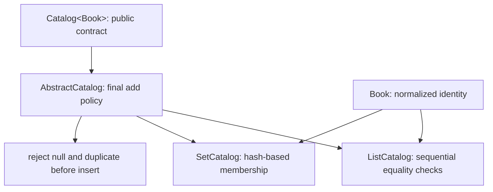

[מפת המעבדות]({{ '/android/topics/' | relative_url }}) · [השוואת Composition וירושה]({{ '/android/CollectCircles/04.collect-circles-oop-afterthought' | relative_url }})

{: .box-success}
בסוף המעבדה מסך קטן מחזיק אותם 40 ספרים בשני קטלוגים. חיפוש `B-40` מוצא ספר בשניהם, אבל הקטלוג שמבוסס על `ArrayList` מדווח שבדק 40 פריטים. הוספת קוד שכבר קיים מציגה הודעת שגיאה בלי לשנות את מספר הספרים. בדיקות JVM מאמתות את כללי הזהות של ספר ואת שתי צורות האחסון.

בסיס ההשוואה הוא `master` של פרויקט **topics**:‏ Empty Views Activity עם View Binding. ענף התוצאה הוא **`codex/java-oop-contracts`**. כל הקוד החדש ב־Java; ממשק המסך נשאר XML. הסדר כאן חשוב: בונים ובודקים קודם את המחלקות שאינן תלויות ב־Android, ורק אז מחברים אותן למסך.

## פולימורפיזם הוא הבטחה להתנהגות, לא רק קשר בין מחלקות

כאשר המשתנה הוא `Catalog<Book>`, הקומפיילר יודע שיש `add`,‏ `contains` ו־`size`, ושמותר למסור להן Book. בזמן ריצה המופע קובע אם חיפוש יעבור בלולאה או ב־HashSet. המסך לא צריך לדעת את פרטי האחסון כדי לבקש "האם הספר קיים?". זאת המשמעות המעשית של החלפת מימוש בלי החלפת קוד המשתמש בחוזה.



`interface` מתאר יכולת; `abstract` מאפשר גם לממש חלק ממנה; `final add` מקבע את סדר הכללים; `protected insert` היא נקודת ההרחבה שהיורשת מספקת. בקריאה `add(book)`, מחלקת הבסיס קוראת ל־`contains` של המימוש בפועל, ורק אם אין כפילות קוראת ל־`insert`. כך שתי צורות אחסון חולקות מדיניות אבל אינן חייבות לשתף מבנה נתונים.

`equals` מבטאת זהות בתחום שלנו: קוד מנורמל, לא כותרת ולא כתובת האובייקט בזיכרון. `hashCode` מסייעת למצוא אזור חיפוש; היא אינה מזהה ייחודי. שוויון מחייב hash שווה, אבל hash שווה אינו מחייב שוויון. שינוי שדה שמשתתף בזהות אחרי הכנסה ל־HashSet עלול להשאיר את הפריט במקום שמתאים ל־hash הישן. כאן String ושדות final מונעים את השינוי הזה.

`Locale.ROOT` הופכת נרמול קוד להחלטה שאינה תלויה בשפת הטלפון. לעומת זאת, טקסט לתלמיד נשאר במשאבי השפה. גם סיבוכיות היא חוזה עם הנחות: O(1) ממוצעת לחיפוש HashSet מניחה פיזור hash מתאים; `lastChecks` סופרת רק השוואות מפורשות בלולאת List. היא אינה שעון ביצועים ואינה מודדת את הפעולות של Set.

חריגה היא דרך לדווח שהפעולה לא עמדה בתנאי החוזה. הבנאי דוחה קוד ריק לפני שנוצר ספר; `add` דוחה כפילות לפני שהאוסף משתנה. המסך תופס כשל צפוי ומתרגם אותו להודעה. מחלקות Java אינן צריכות להכיר Toast או Activity כדי להיות ניתנות לבדיקה. שני הקטלוגים במסך זה נשארים מסונכרנים תחת אותו קלט וכללי זהות; הם אינם עסקה אטומית בין שני מאגרי מוצר.

## עצרו ונבאו

שני Book שונים נושאים אותו code וכותרת שונה. האם הם אותו פריט לפי החוזה, ומה על hashCode לעשות? כתבו תחזית לפני פתיחת ההסבר, ואז הצביעו על המשתנה או התנאי בקוד שמצדיקים אותה.

<details markdown="1">
<summary>בדיקת ההבנה</summary>

כן, הזהות במעבדה נקבעת על פי code המנורמל. כותרת היא תוכן ולא חלק מן הזהות. מכיוון ש־equals מחזירה true, hashCode חייבת להיות שווה גם היא; שילוב הכותרת ב־hash ישבור את החוזה של HashSet.

</details>

## 1. מחליטים מה הופך שני ספרים ל"אותו ספר"

לספר יש קוד וכותרת. הכותרת עשויה להשתנות, אבל הקוד מזהה אותו. ב־**app > kotlin+java > com.example.topics** צרו `Book.java`:

```java
package com.example.topics;

import java.util.Locale;
import java.util.Objects;

/** An immutable book whose identity is its normalized code. */
public final class Book {
    public final String code;
    public final String title;

    /**
     * Creates immutable identity from a trimmed, locale-independent uppercase code.
     *
     * @param code nonblank identifier to normalize
     * @param title non-null display title, which is not part of identity
     * @throws IllegalArgumentException if code is null or blank
     * @throws NullPointerException if title is null
     */
    public Book(String code, String title) {
        if (code == null || code.trim().isEmpty()) {
            throw new IllegalArgumentException("Book code is required");
        }
        // Machine identity must not change with the phone's display language.
        this.code = code.trim().toUpperCase(Locale.ROOT);
        this.title = Objects.requireNonNull(title, "title");
    }

    /**
     * Compares normalized book identity, ignoring display title.
     *
     * @param other object to compare, possibly null or another type
     * @return true for the same normalized code
     */
    @Override
    public boolean equals(Object other) {
        if (this == other) return true;
        if (!(other instanceof Book)) return false;
        return code.equals(((Book) other).code);
    }

    /**
     * Hashes exactly the identity fields used by equals.
     *
     * @return equal hash values for equal books; collisions can still occur
     */
    @Override
    public int hashCode() {
        return code.hashCode();
    }
}
```

`new Book(" b-40 ", "שם ישן")` ו־`new Book("B-40", "שם חדש")` שווים אצלנו: שניהם מזהים את `B-40`. נרמול הקוד בבנאי מונע זהויות שונות רק בגלל רווחים או אותיות קטנות. השדות `final` מונעים שינוי קוד אחרי הכנסה ל־`HashSet`.

כלל Java החשוב כאן: **אם `equals` מחזירה true, גם `hashCode` חייבת להחזיר אותו ערך**. לכן שתיהן תלויות באותו `code`, ולא בכותרת. `hashCode` זהה *אינה* מוכיחה ששני ספרים שווים; התנגשויות hash אפשריות, ואז האוסף בודק גם `equals`.

## 2. מגדירים חוזה משותף והתנהגות משותפת

`interface` מגדיר מה קטלוג יודע לעשות, בלי להחליט איך יאחסן ספרים. צרו `Catalog.java`:

```java
package com.example.topics;

/** Operations shared by catalogs with different storage structures. */
public interface Catalog<T> {
    /**
     * Adds one non-null unique item.
     *
     * @param item item to store
     * @throws DuplicateItemException if an equal item is already present
     * @throws NullPointerException if item is null
     */
    void add(T item);
    /**
     * Tests membership using the equality contract of the item type.
     *
     * @param item lookup identity
     * @return whether an equal item is present
     */
    boolean contains(T item);
    /**
     * Counts unique stored items.
     *
     * @return current catalog size
     */
    int size();
}
```

`T` הוא פרמטר טיפוס. בהמשך `Catalog<Book>` מבטיח שהפעולות מקבלות `Book`; הקומפיילר לא יאפשר להוסיף אליו בטעות `String`. עכשיו צרו חריגה ייעודית `DuplicateItemException.java`:

```java
package com.example.topics;

/** A duplicate is a recoverable user action, not a crash. */
public final class DuplicateItemException extends IllegalArgumentException {
    /**
     * Describes a rejected duplicate insertion that leaves the catalog unchanged.
     */
    public DuplicateItemException() {
        super("This book code already exists");
    }
}
```

הוספה צריכה לדחות `null` וכפילות בשני הקטלוגים. `AbstractCatalog` מממשת פעם אחת את המדיניות, אבל משאירה את פעולת האחסון למחלקה היורשת. צרו `AbstractCatalog.java`:

```java
package com.example.topics;

import java.util.Objects;

/** Shares the add contract while leaving storage to subclasses. */
public abstract class AbstractCatalog<T> implements Catalog<T> {
    /**
     * Enforces the shared insertion policy before delegating storage to a subclass.
     *
     * @param item non-null item to insert
     * @throws NullPointerException if item is null
     * @throws DuplicateItemException if an equal item is already stored
     */
    @Override
    public final void add(T item) {
        Objects.requireNonNull(item, "item");
        if (contains(item)) {
            throw new DuplicateItemException();
        }
        // Dispatch to the subclass only after the shared contract is satisfied.
        insert(item);
    }

    /**
     * Stores an item after the base add method has validated its insertion.
     *
     * @param item validated item to store; this method does not repeat the policy
     */
    protected abstract void insert(T item);
}
```

`abstract` אומר שלא יוצרים `new AbstractCatalog<>()`; צריך מחלקה שמספקת `insert`,‏ `contains` ו־`size`. `final` על `add` מונע מיורשת לעקוף את בדיקת הכפילות. כאן יש מקום מוצדק לירושה, משום ששני המימושים משתפים **אותה מדיניות הוספה**. בשימוש רגיל במסך, המשתנה יכול להיות מסוג הממשק `Catalog<Book>` בלי לדעת איזה מבנה נתונים עומד מאחוריו.

## 3. מממשים List ו־Set ומסבירים את המחיר

צרו `ListCatalog.java`:

```java
package com.example.topics;

import java.util.ArrayList;
import java.util.List;
import java.util.Objects;

/** Linear search; lastChecks makes the work visible. */
public final class ListCatalog<T> extends AbstractCatalog<T> {
    private final List<T> items = new ArrayList<>();
    private int lastChecks;

    /**
     * Tests membership according to item equality in this storage implementation.
     *
     * @param item identity to search for
     * @return whether an equal item is stored
     */
    @Override
    public boolean contains(T item) {
        lastChecks = 0;
        for (T candidate : items) {
            lastChecks++;
            if (Objects.equals(candidate, item)) return true;
        }
        return false;
    }

    /**
     * Stores an item after the base add method has validated its insertion.
     *
     * @param item validated item to store; this method does not repeat the policy
     */
    @Override
    protected void insert(T item) {
        items.add(item);
    }

    /**
     * Counts stored unique items.
     *
     * @return current number of stored items
     */
    @Override
    public int size() {
        return items.size();
    }

    /**
     * Reports comparisons made by the most recent List membership check.
     *
     * @return comparison count, not elapsed time or HashSet work
     */
    public int getLastChecks() {
        return lastChecks;
    }
}
```

צרו `SetCatalog.java`:

```java
package com.example.topics;

import java.util.HashSet;
import java.util.Set;

/** Hash-based membership uses Book.equals and Book.hashCode. */
public final class SetCatalog<T> extends AbstractCatalog<T> {
    private final Set<T> items = new HashSet<>();

    /**
     * Tests membership according to item equality in this storage implementation.
     *
     * @param item identity to search for
     * @return whether an equal item is stored
     */
    @Override
    public boolean contains(T item) {
        return items.contains(item);
    }

    /**
     * Stores an item after the base add method has validated its insertion.
     *
     * @param item validated item to store; this method does not repeat the policy
     */
    @Override
    protected void insert(T item) {
        items.add(item);
    }

    /**
     * Counts stored unique items.
     *
     * @return current number of stored items
     */
    @Override
    public int size() {
        return items.size();
    }
}
```

| פעולה | `ArrayList` עם סריקה | `HashSet` |
|---:|---:|---:|
| חיפוש ספר בסוף אוסף של `n` ספרים | עד `n` השוואות:‏ O(n) | O(1) בממוצע; במקרה הגרוע O(n) |
| הוספה דרך `AbstractCatalog.add` | קודם חיפוש כפילות O(n), אחריו append | קודם חיפוש כפילות O(1) בממוצע, אחריו insert |
| סדר הפריטים | נשמר סדר הכנסה | אין הבטחה לסדר הכנסה |
| שוויון ספרים | `equals` | `hashCode` ואז `equals` לפי הצורך |

המדד `lastChecks` סופר רק השוואות של מימוש ה־List; הוא **אינו** מדידה של מספר פעולות פנימיות ב־`HashSet` או של זמן ריצה. אם נדרשים הצגה לפי סדר והוספה בסוף, List שימושי; אם השאלה המרכזית היא "האם הפריט קיים?", Set מתאים יותר. הבחירה תלויה בצורך, לא בשם הקצר של המחלקה.

## 4. בודקים את המחלקות בלי להפעיל Android

ב־**app > kotlin+java > com.example.topics (test)** צרו `CatalogTest.java`:

```java
package com.example.topics;

import org.junit.Test;
import static org.junit.Assert.*;

public final class CatalogTest {
    /**
     * Checks that normalized identity defines equality and the matching hash contract.
     */
    @Test
    public void normalizedCodeDefinesEqualityAndHash() {
        Book first = new Book(" b-40 ", "First title");
        Book sameCode = new Book("B-40", "Different title");
        assertEquals(first, sameCode);
        assertEquals(first.hashCode(), sameCode.hashCode());
    }

    /**
     * Checks shared membership behavior while exposing List's linear comparisons.
     */
    @Test
    public void listAndSetAgreeButListScansToLastItem() {
        ListCatalog<Book> list = new ListCatalog<>();
        SetCatalog<Book> set = new SetCatalog<>();
        for (int number = 1; number <= 40; number++) {
            Book book = new Book("B-" + number, "Book " + number);
            list.add(book);
            set.add(book);
        }
        Book last = new Book("b-40", "Lookup");
        assertTrue(list.contains(last));
        assertEquals(40, list.getLastChecks());
        assertTrue(set.contains(last));
        assertFalse(set.contains(new Book("B-99", "Missing")));
    }

    /**
     * Checks rejected operations leave the catalog size unchanged.
     */
    @Test
    public void duplicateAndBlankCodeAreRejectedWithoutChangingSize() {
        Catalog<Book> catalog = new SetCatalog<>();
        catalog.add(new Book("B-7", "Original"));
        try {
            catalog.add(new Book(" b-7 ", "Duplicate"));
            fail("DuplicateItemException expected");
        } catch (DuplicateItemException expected) {
            assertEquals(1, catalog.size());
        }
        try {
            new Book("  ", "Invalid");
            fail("IllegalArgumentException expected");
        } catch (IllegalArgumentException expected) {
            assertEquals(1, catalog.size());
        }
    }
}
```

הריצו `:app:testDebugUnitTest`. אלה בדיקות JVM מהירות משום שהמחלקות שנבדקות אינן משתמשות ב־Activity,‏ View או Context. נסו זמנית לשנות `Book.hashCode()` כך שתחזיר `Objects.hash(code, title)`; בדיקת ה־Set עשויה להיכשל, כי שני ספרים ש־`equals` מחשיבה שווים יקבלו hash שונה. החזירו את `code.hashCode()` והריצו שוב.

## 5. מחברים למסך View Binding

ב־**app > res > layout > activity_main.xml** החליפו את `TextView` של `Hello World!` ב־`LinearLayout` אנכי, constrained ל־`top`,‏ `start` ו־`end` של `parent`. הגדירו בו `padding=20dp` וחמישה ילדים בסדר הזה:

1. `TextView` הוראות עם `text=@string/catalog_instruction`,‏ `textSize=18sp`.
2. `EditText id=book_code` עם `hint=@string/code_hint`,‏ `inputType=textCapCharacters`.
3. `Button id=add_book` עם `text=@string/add_book`.
4. `Button id=find_book` עם `text=@string/find_book`.
5. `TextView id=result` עם `text=@string/starting_result`,‏ `paddingTop=12dp`,‏ `textSize=18sp`.

לכל הילדים `layout_width=match_parent` ו־`layout_height=wrap_content`; ל־`LinearLayout` עצמו `layout_width=0dp` ו־`layout_height=wrap_content`. השאירו את `ConstraintLayout id=main` ואת מאזין ה־window insets הקיים. אין צורך להחליף את כל קובץ התבנית.

ב־**app > res > values > strings.xml** הוסיפו את המשאבים הבאים (בלי למחוק את `app_name`):

```xml
<string name="catalog_instruction">Two catalogs hold 40 books. Try B-40 or B-99.</string>
<string name="code_hint">Book code</string>
<string name="add_book">Add book</string>
<string name="find_book">Find book</string>
<string name="starting_result">Enter a code, then choose an action.</string>
<string name="added">Added %1$s. Total: %2$d books.</string>
<string name="duplicate_book">That book code already exists.</string>
<string name="code_required">Enter a book code first.</string>
<string name="yes">yes</string>
<string name="no">no</string>
<string name="lookup_result">%1$s — List: %2$s after %3$d comparisons; Set: %4$s.</string>
```

ב־`MainActivity` הוסיפו `import java.util.Locale;` ושני שדות:

```java
private final ListCatalog<Book> listCatalog = new ListCatalog<>();
private final SetCatalog<Book> setCatalog = new SetCatalog<>();
```

אחרי הגדרת מאזין ה־insets ב־`onCreate`, מלאו את שני הקטלוגים באותם ספרים וקשרו לחיצות. שאר קוד התבנית נשאר:

```java
for (int number = 1; number <= 40; number++) {
    String code = String.format(Locale.ROOT, "B-%02d", number);
    Book book = new Book(code, "Book " + number);
    listCatalog.add(book);
    setCatalog.add(book);
}
binding.addBook.setOnClickListener(view -> addBook());
binding.findBook.setOnClickListener(view -> findBook());
```

הוסיפו ל־Activity שתי מתודות. המסך מטפל בקלט ובתוצאה; הוא אינו מכיל את לולאת החיפוש או את כללי הזהות:

```java
/**
 * Converts entered code into a Book and reports expected validation failures in the UI.
 */
private void addBook() {
    try {
        Book book = new Book(binding.bookCode.getText().toString(), "Student book");
        listCatalog.add(book);
        setCatalog.add(book);
        binding.result.setText(getString(R.string.added, book.code, listCatalog.size()));
    } catch (DuplicateItemException duplicate) {
        binding.result.setText(R.string.duplicate_book);
    } catch (IllegalArgumentException invalid) {
        binding.result.setText(R.string.code_required);
    }
}

/**
 * Runs the same membership query through both catalogs and displays List work.
 */
private void findBook() {
    try {
        Book query = new Book(binding.bookCode.getText().toString(), "Lookup");
        boolean inList = listCatalog.contains(query);
        int checks = listCatalog.getLastChecks();
        boolean inSet = setCatalog.contains(query);
        binding.result.setText(getString(R.string.lookup_result, query.code,
                inList ? getString(R.string.yes) : getString(R.string.no), checks,
                inSet ? getString(R.string.yes) : getString(R.string.no)));
    } catch (IllegalArgumentException invalid) {
        binding.result.setText(R.string.code_required);
    }
}
```

הפעילו: חפשו `B-40`,‏ `B-99` ו־`b-01`; הוסיפו קוד חדש, חפשו אותו, ואז נסו להוסיף אותו שוב. `DuplicateItemException` נתפסת לפני `IllegalArgumentException` משום שהיא יורשת ממנה. אם נהפוך את הסדר, ה־catch הרחב יסתיר את הטיפול המיוחד בכפילות ואף יגרום לשגיאת קומפילציה של catch שאינו נגיש.

{: .box-note}
גבול המעבדה: הקטלוגים חיים בזיכרון ה־Activity. סיבוב מסך יוצר Activity חדשה עם 40 ספרי הדוגמה, ולכן ספר שהתלמיד הוסיף במסך לא נשמר. [מעבדת מחזור החיים]({{ '/android/topics/01-lifecycle-state/' | relative_url }}) ו[מעבדת Room]({{ '/android/topics/12-room-persistence/' | relative_url }}) עוסקות בשתי דרכי שמירה שונות. כאן משאירים את הדוגמה קטנה כדי לבודד את חוזי ה־Java.

## שאלות בדיקה

{: .alefbet}
1. אם נשנה כותרת לספר בעל אותו קוד, האם הוא צריך להיחשב לאותו ספר? היכן ההחלטה הזאת כתובה?
2. מדוע `HashSet` צריכה גם `hashCode` וגם `equals`?
3. מה `interface` מאפשרת שאי אפשר לבטא במחלקה מופשטת בלבד כאשר למחלקה כבר יש `extends` אחר?
4. מדוע `add` במחלקת הבסיס היא `final`, אבל `insert` היא `abstract`?
5. מה ההבדל בין מספר ההשוואות שספרנו לבין זמן ריצה שנמדד במילישניות?
