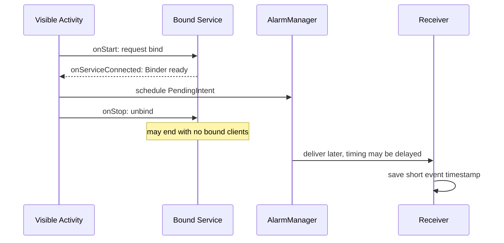

[מפת המעבדות]({{ '/android/topics/' | relative_url }}) · [WorkManager במסלול CollectCircles]({{ '/android/CollectCircles/14.collect-circles-first-worker' | relative_url }})

{: .box-success}
בסוף המעבדה המסך נקשר ל־Service שמודדת את משך החיבור הגלוי, ומזמין alarm לא מדויק דרך המערכת. כשה־alarm מגיע, `BroadcastReceiver` פרטית רושמת מועד קצר. אפשר לסגור את המסך, לפתוח אותו שוב ולקרוא את מועד האירוע. אפשר גם לבטל alarm ממתינה. שתי הפעולות מדגימות **תפקידים שונים**, לא שתי דרכים זהות לבצע עבודת רקע.

בסיס ההשוואה הוא `master` של פרויקט **topics**; ענף התוצאה הוא **`codex/services-alarms-receivers`**. [מדריך בחירת מנגנון רקע של Android](https://developer.android.com/develop/background-work) הוא מקור ההחלטות במעבדה. כל הקוד משתמש ב־Java,‏ XML ו־View Binding שכבר נמצאת בבסיס.

## בוחרים מנגנון לפי הצורך

| צורך | בחירה | מה הוא מבטיח כאן |
|---:|---:|---:|
| יכולת משותפת למסך **כל עוד הוא גלוי** | Bound Service | ה־Activity נקשרת ב־`onStart` ומתנתקת ב־`onStop`; השירות יכול להיעלם כשאין לקוחות |
| אירוע שמתבקש **לא לפני זמן מסוים**, גם אם המסך נסגר | `AlarmManager` עם `PendingIntent` | המערכת שולחת Intent ל־Receiver; המועד אינו מדויק |
| תגובה קצרה לאירוע מערכת או alarm | `BroadcastReceiver` | `onReceive` קצרה; היא אינה מקום לתהליך ארוך |
| משימה דחויה שצריכה תנאים, retry או שרידות | `WorkManager` | מנהל את עבודת הרקע; [שיעור WorkManager הקיים]({{ '/android/CollectCircles/14.collect-circles-first-worker' | relative_url }}) מתרגל אותו |
| עבודה מיידית שהמשתמש מודע אליה ושחייבת להמשיך זמן מוגבל | Foreground Service מתאים לסוג העבודה | דורש notification, סוג שירות והרשאות/תנאי התחלה מתאימים; אינו ברירת המחדל לכל timer |

`Service` אינה thread בפני עצמה: קוד מחזור החיים שלה רץ ב־main thread אם לא העברנו עבודה כבדה ל־executor. שירות bound בלבד גם אינו הבטחה שהאפליקציה תמשיך לעבוד אחרי שהמשתמש יצא. Android מגביל הפעלת foreground service מתוך הרקע, ומ־Android 14 צריך להצהיר על סוג מתאים ב־Manifest; ל־`shortService` יש מגבלת זמן קצרה. קראו את [סקירת השירותים](https://developer.android.com/develop/background-work/services) ואת [סוגי ה־foreground service](https://developer.android.com/develop/background-work/services/fgs/service-types) לפני שמחליפים את הדוגמה לשירות foreground אמיתי.

## רכיב Android, שרשור וגורם מתזמן הם שלוש שאלות שונות

Service היא רכיב שהמערכת מנהלת; היא אינה יוצרת אוטומטית thread רקע. השעון שלנו רק מחזיר הפרש בין שני מספרים ולכן אינו צריך לולאה שמתעוררת בכל שנייה. בזמן לחיצה מחשבים `elapsedRealtime() - startedAt`. השעון הוא של **מופע השירות**, ויכול להתחיל מחדש כשהמערכת יוצרת מופע חדש; הוא אינו מד זמן כולל ומתמשך של משתמש.



`bindService` חוזרת לפני callback החיבור. לכן `bindingRequested` ו־`clock != null` אינם אותו מצב: הראשון אומר שיש בקשת חיבור שצריך לשחרר, והשני שיש כבר ממשק שאפשר לקרוא. `onServiceDisconnected` מודיעה על ניתוק בלתי צפוי; אין לסמוך עליה כניקוי של unbind רגיל. ב־`onStop` אנחנו מאפסים את ההפניה בעצמנו.

PendingIntent היא הרשאה מוגדרת למערכת לבצע Intent בשמנו בהמשך. אותה זהות בקשה מאפשרת החלפה וביטול; התוספות ב־Intent אינן לבדן זהות של PendingIntent. `exported=false` מגבילה גישה לרכיב, בעוד `FLAG_IMMUTABLE` מגבילה שינוי של בקשת הפעולה שנמסרה. שתי ההגנות פועלות בגבולות שונים.

הפרש מונוטוני מודד משך; זמן קיר מציין מועד לבני אדם. אין לחסר חותמת `currentTimeMillis` מערך `elapsedRealtime`: נקודות האפס שלהם שונות. בחרנו מונוטוני להזמנת alarm יחסית לעכשיו, וזמן קיר לתיעוד מועד המסירה. alarm יכולה להימסר אחרי סגירת המסך, אבל Force stop, אתחול ותנאי סוללה דורשים טיפול נפרד; היא אינה חוזה להרצת עבודה ממושכת.

## עצרו ונבאו

bindService החזירה, אך onServiceConnected עוד לא התקבלה. האם כבר אפשר לקרוא דרך Binder? כתבו תחזית לפני פתיחת ההסבר, ואז הצביעו על המשתנה או התנאי בקוד שמצדיקים אותה.

<details markdown="1">
<summary>בדיקת ההבנה</summary>

לא. בקשת bind מתחילה חיבור אסינכרוני. רק callback עם Binder מוכנה מאפשרת קריאה לשירות. לכן המסך מפריד בין בקשת חיבור ובין שירות מחובר, ומנקה את הבעלות כשהלקוח יוצא.

</details>

## 1. יוצרים Service שנקשרים אליה רק כשהמסך גלוי

ב־**app > kotlin+java > com.example.topics** צרו `SessionClockService.java`:

```java
package com.example.topics;

import android.app.Service;
import android.content.Intent;
import android.os.Binder;
import android.os.IBinder;
import android.os.SystemClock;
import androidx.annotation.Nullable;

/** A bound service that exists only while a visible client is bound. */
public final class SessionClockService extends Service {
    public final class ClockBinder extends Binder {
        /**
         * Computes elapsed time without a periodic timer or UI dependency.
         *
         * @return seconds since this Service instance was created, including device sleep
         */
        public long elapsedSeconds() {
            return (SystemClock.elapsedRealtime() - startedAt) / 1000;
        }
    }

    private final ClockBinder binder = new ClockBinder();
    private long startedAt;

    /**
     * Records the monotonic origin when Android creates this bound Service instance.
     */
    @Override
    public void onCreate() {
        super.onCreate();
        startedAt = SystemClock.elapsedRealtime();
    }

    /**
     * Exposes this same-process service API to a successfully bound client.
     *
     * @param intent binding request delivered by Android
     * @return Binder providing the elapsed-time operation
     */
    @Nullable
    @Override
    public IBinder onBind(Intent intent) {
        return binder;
    }
}
```

`SystemClock.elapsedRealtime()` הוא שעון מונוטוני שכולל זמן שינה של המכשיר ומתאים למדידת **משך**; שעה על הקיר עלולה להשתנות. `ClockBinder` חושפת פעולה למסך שקשר את השירות. לא קוראים לה דרך `new SessionClockService()`: המערכת יוצרת Service לפי הרישום ב־Manifest.

ב־**app > manifests > AndroidManifest.xml**, בתוך `<application>`, רשמו:

```xml
<service
    android:name=".SessionClockService"
    android:exported="false" />
```

`exported=false` אומר שאפליקציות אחרות לא יכולות לקשור את השירות הזה. עדיין נצטרך לרשום את ה־Receiver בהמשך; אין צורך בהרשאת foreground service, כי זו **אינה** foreground service.

## 2. מתכננים alarm לא מדויק ו־Receiver קצרה

צרו `ReminderReceiver.java`:

```java
package com.example.topics;

import android.content.BroadcastReceiver;
import android.content.Context;
import android.content.Intent;
import android.util.Log;

/** Records an alarm event quickly; no long work inside onReceive. */
public final class ReminderReceiver extends BroadcastReceiver {
    public static final String ACTION_REMINDER = "com.example.topics.REMINDER";
    public static final String PREFS = "alarm_events";
    public static final String LAST_DELIVERY = "last_delivery";

    /**
     * Records this private reminder event quickly, without starting long work.
     *
     * @param context receiver context used for private preferences
     * @param intent delivered event, checked against the expected action
     */
    @Override
    public void onReceive(Context context, Intent intent) {
        if (!ACTION_REMINDER.equals(intent.getAction())) return;
        long deliveredAt = System.currentTimeMillis();
        context.getSharedPreferences(PREFS, Context.MODE_PRIVATE)
                .edit().putLong(LAST_DELIVERY, deliveredAt).apply();
        Log.i("ReminderReceiver", "Reminder alarm delivered");
    }
}
```

ה־Receiver רק רושמת מתי נמסר האירוע. `System.currentTimeMillis()` מתאים ל**מועד בלוח השנה**, שאותו נציג למשתמש. אם הייתה כאן עבודת סנכרון ממושכת, ה־Receiver הייתה מוסרת אותה ל־WorkManager במקום להחזיק את `onReceive` פתוחה. אל תכניסו ל־Log נתונים אישיים או מזהים של משתמשים.

רשמו גם אותה בתוך `<application>` ב־Manifest:

```xml
<receiver
    android:name=".ReminderReceiver"
    android:exported="false" />
```

צרו `ReminderAlarms.java`:

```java
package com.example.topics;

import android.app.AlarmManager;
import android.app.PendingIntent;
import android.content.Context;
import android.content.Intent;
import android.os.SystemClock;
import java.util.Objects;

/** One inexact, replaceable alarm delivered to our private receiver. */
public final class ReminderAlarms {
    public static final long DELAY_MS = 15_000L;

    /**
     * Prevents instances of this static alarm helper.
     */
    private ReminderAlarms() { }

    /**
     * Describes the same replaceable private broadcast each time it is requested.
     *
     * @param context context used to identify our explicit receiver
     * @return immutable PendingIntent whose identity is shared by schedule and cancel
     */
    private static PendingIntent pendingIntent(Context context) {
        Intent intent = new Intent(context, ReminderReceiver.class)
                .setAction(ReminderReceiver.ACTION_REMINDER);
        return PendingIntent.getBroadcast(context, 1, intent,
                PendingIntent.FLAG_UPDATE_CURRENT | PendingIntent.FLAG_IMMUTABLE);
    }

    /**
     * Requests one inexact wakeup alarm, replacing a previous matching request.
     *
     * @param context context providing AlarmManager; delivery is not an exact deadline
     */
    public static void schedule(Context context) {
        AlarmManager manager = Objects.requireNonNull(
                (AlarmManager) context.getSystemService(Context.ALARM_SERVICE));
        manager.set(AlarmManager.ELAPSED_REALTIME_WAKEUP,
                SystemClock.elapsedRealtime() + DELAY_MS, pendingIntent(context));
    }

    /**
     * Cancels the pending alarm with the same PendingIntent identity.
     *
     * @param context context providing AlarmManager; already delivered events remain recorded
     */
    public static void cancel(Context context) {
        AlarmManager manager = Objects.requireNonNull(
                (AlarmManager) context.getSystemService(Context.ALARM_SERVICE));
        manager.cancel(pendingIntent(context));
    }
}
```

ה־`PendingIntent` נותנת למערכת את הרשאת האפליקציה למסור Intent מפורש ל־Receiver שלנו **מאוחר יותר**. אותה פעולה, רכיב ו־request code מזהים את אותה alarm, לכן `schedule` מחליפה בקשה קודמת ו־`cancel` מוצאת אותה. `FLAG_IMMUTABLE` מונע שינוי של פרטי ה־Intent בידי מי שמקבל את ה־PendingIntent. `ELAPSED_REALTIME_WAKEUP` משתמש באותו בסיס זמן מונוטוני של `SystemClock.elapsedRealtime()`.

`set()` כאן **אינה alarm מדויקת**. 15 שניות הן מועד הבקשה המוקדם ביותר, לא הבטחה להופעה אחרי 15 שניות. Android עשוי לדחות alarm לא מדויקת לצורכי סוללה; ב־Android 12+ חלון המסירה עשוי להגיע גם לעשרות דקות בתנאים מסוימים. [מדריך AlarmManager הרשמי](https://developer.android.com/develop/background-work/services/alarms) מסביר מתי די ב־inexact ומתי מוצר כמו שעון מעורר עשוי להצדיק exact alarm והרשאות/הגבלות נוספות. המעבדה אינה מבקשת exact alarm permission.

## 3. מחברים למסך ונקשרים לפי מחזור החיים

ב־**app > res > layout > activity_main.xml** החליפו רק את `TextView` של `Hello World!` ב־`LinearLayout` אנכי constrained ל־`top`,‏ `start` ו־`end` של `parent`, עם `padding=20dp`. סדר הילדים:

1. `TextView` הוראות עם `text=@string/lab_instruction` ו־`textSize=18sp`.
2. `Button id=read_clock` עם `text=@string/read_clock`.
3. `Button id=schedule_alarm` עם `text=@string/schedule_alarm`.
4. `Button id=cancel_alarm` עם `text=@string/cancel_alarm`.
5. `Button id=read_alarm` עם `text=@string/read_alarm`.
6. `TextView id=result` עם `text=@string/starting_result`,‏ `paddingTop=12dp` ו־`textSize=18sp`.

לילדים `layout_width=match_parent`,‏ `layout_height=wrap_content`; ל־`LinearLayout` רוחב `0dp` וגובה `wrap_content`. השאירו את ה־`ConstraintLayout id=main` ואת הטיפול הקיים ב־insets. ב־**app > res > values > strings.xml** הוסיפו:

```xml
<string name="lab_instruction">Bound clock while this screen is visible; an inexact alarm can arrive later.</string>
<string name="read_clock">Read bound clock</string>
<string name="schedule_alarm">Schedule inexact alarm</string>
<string name="cancel_alarm">Cancel alarm</string>
<string name="read_alarm">Read last alarm event</string>
<string name="starting_result">Choose an action.</string>
<string name="clock_connecting">Clock service is connecting.</string>
<string name="clock_elapsed">Bound clock: %1$d seconds.</string>
<string name="alarm_scheduled">Alarm requested for no earlier than 15 seconds; Android may delay it.</string>
<string name="alarm_cancelled">Pending alarm cancelled.</string>
<string name="no_alarm_yet">No alarm event recorded yet.</string>
<string name="alarm_delivered">Last alarm event: %1$s.</string>
```

ב־`MainActivity.java` הוסיפו imports ל־`ComponentName`,‏ `Context`,‏ `Intent`,‏ `ServiceConnection`,‏ `IBinder`,‏ `DateFormat` ו־`Date`. הוסיפו את שדות החיבור:

```java
private SessionClockService.ClockBinder clock;
private boolean bindingRequested;
private final ServiceConnection clockConnection = new ServiceConnection() {
    /**
     * Stores the local Binder only after asynchronous binding succeeds.
     *
     * @param name connected component
     * @param service Binder from our nonexported local clock Service
     */
    @Override
    public void onServiceConnected(ComponentName name, IBinder service) {
        clock = (SessionClockService.ClockBinder) service;
    }

    /**
     * Drops the Binder after an unexpected service disconnect.
     *
     * @param name disconnected component; normal unbind is handled separately
     */
    @Override
    public void onServiceDisconnected(ComponentName name) {
        clock = null;
    }
};
```

אחרי קוד ה־insets הקיים ב־`onCreate`, קשרו את הכפתורים:

```java
binding.readClock.setOnClickListener(view -> {
    binding.result.setText(clock == null ? getString(R.string.clock_connecting)
            : getString(R.string.clock_elapsed, clock.elapsedSeconds()));
});
binding.scheduleAlarm.setOnClickListener(view -> {
    ReminderAlarms.schedule(this);
    binding.result.setText(R.string.alarm_scheduled);
});
binding.cancelAlarm.setOnClickListener(view -> {
    ReminderAlarms.cancel(this);
    binding.result.setText(R.string.alarm_cancelled);
});
binding.readAlarm.setOnClickListener(view -> showLastAlarm());
```

הוסיפו שלוש מתודות ל־Activity:

```java
/**
 * Requests a service binding while this screen is visible.
 */
@Override
protected void onStart() {
    super.onStart();
    bindingRequested = bindService(new Intent(this, SessionClockService.class),
            clockConnection, Context.BIND_AUTO_CREATE);
}

/**
 * Unbinds any requested connection and releases the local Binder reference.
 */
@Override
protected void onStop() {
    // Unbind even if the asynchronous Binder callback has not arrived yet.
    if (bindingRequested) {
        unbindService(clockConnection);
        bindingRequested = false;
    }
    clock = null;
    super.onStop();
}

/**
 * Formats the persisted delivery timestamp using the current locale.
 */
private void showLastAlarm() {
    long deliveredAt = getSharedPreferences(ReminderReceiver.PREFS, MODE_PRIVATE)
            .getLong(ReminderReceiver.LAST_DELIVERY, 0L);
    if (deliveredAt == 0L) {
        binding.result.setText(R.string.no_alarm_yet);
    } else {
        String time = DateFormat.getTimeInstance().format(new Date(deliveredAt));
        binding.result.setText(getString(R.string.alarm_delivered, time));
    }
}
```

ה־`ServiceConnection` היא callback אסינכרוני; לחיצה מהירה מאוד על Read Clock עשויה להציג "connecting". `bindingRequested` עוקב אחרי **בקשת** החיבור, כך ש־`onStop` תבצע `unbindService` גם אם callback החיבור עוד לא הגיעה. אחרי היציאה מהמסך אין Activity שמחזיקה Binder. ה־alarm, לעומת זאת, כבר רשומה אצל המערכת ואינה תלויה בחיבור הזה.

## 4. מאמתים את ההבדל בפועל

1. הריצו `:app:assembleDebug`. הפעילו, המתינו כמה שניות ולחצו **Read bound clock**. סגרו ופתחו את המסך; השירות bound בלבד ולכן מונה חדש עשוי להתחיל מאפס.
2. לחצו **Schedule inexact alarm**. ב־Android Studio/ADB בדקו `adb shell dumpsys alarm` וחפשו `com.example.topics.REMINDER`; זו ראיה שהמערכת מחזיקה בקשה. סגרו את המסך והמתינו למסירה, שיכולה להתעכב מעבר ל־15 שניות.
3. פתחו את האפליקציה ולחצו **Read last alarm event**. ה־Receiver שמרה מועד. ב־Logcat סננו `ReminderReceiver`. אפשר לבצע force stop **אחרי שהאירוע כבר נמסר**, לפתוח שוב ולראות שהמועד נשמר.
4. קבעו alarm חדשה ומיד לחצו **Cancel alarm**. ב־`dumpsys alarm` חפשו אירוע `alarm_cancelled`; רשומות היסטוריה עשויות עדיין להזכיר את שם ה־alarm, ולכן אל תסיקו מביטוי חיפוש יחיד שיש בקשה ממתינה.

אם המערכת מתעכבת, אל תהפכו את הקוד ל־`setExact()` רק כדי לגרום להדגמה קצרה יותר. בדקו את הבקשה ב־`dumpsys`, את ה־Receiver ואת מחזור החיים בנפרד. Force stop **לפני** המסירה אינו שקול לסגירת המסך הרגילה, ועלול לבטל את הבקשה או למנוע מסירה עד הפעלת האפליקציה מחדש.

{: .box-note}
גבול המעבדה: אין כאן notification למשתמש ואין חידוש alarm אחרי אתחול המכשיר. אלו יהיו דרישות מוצר נוספות, שיחייבו תכנון הרשאות/חוויית משתמש וייתכן Receiver ל־boot. המעבדה ממחישה את ההבדל בין חיבור שירות למסך, תזמון אירוע, ותגובה קצרה של Receiver; היא אינה תבנית להבטחת תזמון מדויק או לעבודה ארוכה.

## שאלות בדיקה

{: .alefbet}
1. איזו פעולה עדיין יכולה להתקיים אחרי `onStop` של ה־Activity, ומי מחזיק אותה?
2. מדוע `onReceive` שלנו רק רושמת זמן ולא מורידה קובץ גדול?
3. מתי עדיף לבחור WorkManager במקום alarm, ומתי alarm מדויקת עשויה להיות מוצדקת?
4. למה `FLAG_IMMUTABLE` ו־`exported=false` אינם אותה הגנה?
5. האם Service bound שרצה ב־main thread פותרת בעיית הקפאת UI? הסבירו.
