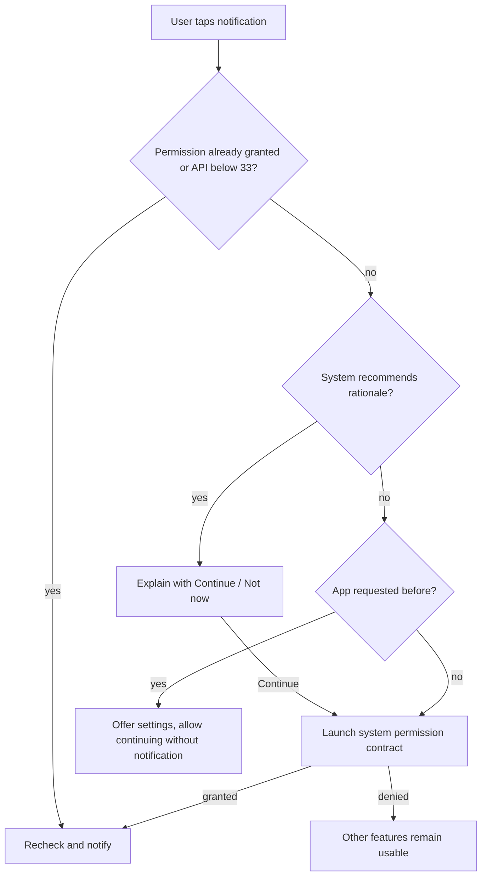

[מפת המעבדות]({{ '/android/topics/' | relative_url }}) · [מדריך ההרשאות הבסיסי]({{ '/android/alon/13.android_permissions_tutorial_Version2' | relative_url }})

{: .box-success}
בסוף המעבדה כפתור התראה מבקש `POST_NOTIFICATIONS` רק כשהתלמיד בוחר לשלוח הודעה. סירוב משאיר את בחירת התמונה והמסמך פעילה; ניסיון נוסף מציג הסבר או דרך להגדרות לפי מצב המערכת. שלושה contracts נוספים פותחים Photo Picker, בורר מסמכים ומצלמה לתמונת preview — ללא הרשאות רחבות לגלריה או לקבצים.

בסיס העבודה הוא ענף `master` של פרויקט **topics**, עם Java,‏ XML ו־View Binding. ענף התוצאה הוא **`codex/permission-contracts`**. המעבדה מתמקדת בתגובה של האפליקציה לתשובת המשתמש, לא רק בהופעת חלון ההרשאה.

## בוחרים את הבקשה הקטנה ביותר

| פעולת משתמש | Contract | הרשאת runtime של האפליקציה כאן | תוצאה |
|---:|:---|:---:|---:|
| שליחת הודעת מעבדה | `RequestPermission` | `POST_NOTIFICATIONS` ב־Android 13+ | `Boolean` granted/denied |
| בחירת תמונה קיימת | `PickVisualMedia` | אין בקשת גלריה רחבה | `content://` URI או `null` |
| פתיחת PDF/טקסט | `OpenDocument` | אין בקשת storage רחבה | URI או `null`; אפשר לבקש שמירת גישת קריאה |
| צילום preview קטן דרך אפליקציית מצלמה | `TakePicturePreview` | אין בקשת `CAMERA` באפליקציה הזאת | `Bitmap` או `null`; התמונה **אינה נשמרת** |

ה־[Photo Picker הרשמי](https://developer.android.com/training/data-storage/shared/photo-picker) נותן בחירה נקודתית בלי הרשאת גישה לכל התמונות. `TakePicturePreview` מחזיר תמונה קטנה בזיכרון; צילום מלא לקובץ ו־`FileProvider` ילמדו במעבדת המצלמה. אל תבקשו `CAMERA` רק משום שהאפליקציה מפעילה אפליקציית מצלמה אחרת דרך contract.

## הרשאה רחבה מול בחירה נקודתית

הרשאת runtime מאפשרת סוג פעולה, למשל שליחת התראות רגילות. בורר תמונה נותן לאפליקציה גישה לפריט שהמשתמש בחר. אין צורך לתת לאפליקציה גישה לכל הגלריה כדי לבחור תמונה אחת. `content://` URI מזהה משאב אצל ספק; פותחים אותו באמצעות `ContentResolver`, ולא על ידי הפיכתו שרירותית לנתיב של `File`.



התרשים מתאר החלטה של האפליקציה על **הפעולה הבאה**, לא ניסיון לנחש מדוע המשתמש או המערכת סירבו. false של rationale יכולה להופיע לפני בקשה ראשונה וגם במצבים שבהם לא יוצג שוב חלון. `asked_notification` מתעד מה האפליקציה עשתה; הוא אינו מוכיח מה המשתמש ראה. לכן ההודעה מציעה אפשרות ולא מאשימה אותו.

שדות launcher נרשמים באופן עקבי לפני ההפעלה. הקריאה `launch` מתחילה בקשת מערכת; lambda מקבלת תשובה מאוחר יותר. על כל חוזה נוכל לכתוב שלישייה: טיפוס קלט, טיפוס תוצאה, ומשמעות ביטול. התראה מחזירה Boolean; בחירה מחזירה URI; preview מחזירה Bitmap בזיכרון. אין להחליף בין התוצאות רק משום שכולן מגיעות מ־Activity אחרת.

`takePersistableUriPermission` מבקשת לשמור **גישת קריאה**, ולא מעתיקה את המסמך לתוך האפליקציה. כדי להשתמש בו בעתיד צריך גם לשמור את ה־URI ולדעת להתמודד עם הסרה או שינוי של הספק. במעבדה הזאת רק מדווחים על סוג הגישה; אין להבטיח שהמסמך עצמו נשמר. גם `notify` היא בקשת פרסום: הגדרות ערוץ או התראות של המשתמש עדיין עשויות להשפיע על מה שיוצג בפועל.

## עצרו ונבאו

shouldShowRequestPermissionRationale מחזירה false. האם זה מוכיח שהמשתמש סירב לצמיתות? כתבו תחזית לפני פתיחת ההסבר, ואז הצביעו על המשתנה או התנאי בקוד שמצדיקים אותה.

<details markdown="1">
<summary>בדיקת ההבנה</summary>

לא. false יכולה להתקבל גם לפני הבקשה הראשונה. היסטוריית asked_notification היא מידע על פעולה שלנו, ולא ראיה למה שהמשתמש ראה. ההחלטה הבאה מציעה בקשה ראשונה או הגדרות בלי לקבוע סיבת סירוב בוודאות.

</details>

## 1. מכינים כפתורים ומשאבים

ב־**app > manifests > AndroidManifest.xml**, ישירות בתוך `<manifest>` ולפני `<application>`, הוסיפו:

```xml
<uses-permission android:name="android.permission.POST_NOTIFICATIONS" />
```

ב־**app > res > layout > activity_main.xml** החליפו רק את `TextView` של `Hello World!` ב־`LinearLayout` אנכי constrained ל־`top`,‏ `start` ו־`end` של `parent`, עם `padding=20dp`. ששת ילדיו בסדר הזה:

1. `TextView` עם `text=@string/lab_instruction`,‏ `textSize=18sp`.
2. `Button id=notify_me` עם `text=@string/notify_me`.
3. `Button id=pick_photo` עם `text=@string/pick_photo`.
4. `Button id=open_document` עם `text=@string/open_document`.
5. `Button id=camera_preview` עם `text=@string/camera_preview`.
6. `TextView id=result` עם `text=@string/starting_result`,‏ `paddingTop=12dp`,‏ `textSize=18sp`.

לכל ילד `layout_width=match_parent`,‏ `layout_height=wrap_content`; ל־`LinearLayout` רוחב `0dp` וגובה `wrap_content`. השאירו את `ConstraintLayout id=main` והטיפול הקיים ב־window insets. ב־**app > res > values > strings.xml** הוסיפו את המחרוזות מענף התוצאה; אלה החשובות לזרימה:

```xml
<string name="lab_instruction">Choose an action. Only the notification button may request permission.</string>
<string name="notify_me">Send notification</string>
<string name="pick_photo">Choose photo</string>
<string name="open_document">Open PDF or text</string>
<string name="camera_preview">Camera preview</string>
<string name="starting_result">No result yet.</string>
<string name="notification_rationale">Allow notifications to see this lab message. You can continue without them.</string>
<string name="notification_denied">Notification not sent. Photo and document actions still work.</string>
<string name="notification_settings_explanation">Notifications are still off. Open app settings if you want to enable them.</string>
<string name="selection_cancelled">Selection cancelled; no data was changed.</string>
```

הוסיפו גם `notification_channel` = `Lab messages`,‏ `notification_title` = `Contracts lab`,‏ `notification_body` = `Permission granted; the notification was sent.`,‏ `notification_sent` = `Notification sent.`,‏ `continue_request` = `Continue`,‏ `not_now` = `Not now`,‏ `open_settings` = `Open settings`,‏ `selected_type` = `Selected image type: %1$s`,‏ `document_selected` = `Document access kept for type: %1$s`,‏ `document_temporary` = `Document opened, but persistent access was unavailable.`, ו־`preview_size` = `Camera preview size: %1$d × %2$d (not saved).` השאירו את `app_name` הקיים.

## 2. רושמים contracts לפני הפעלתם

ב־`MainActivity.java` הוסיפו imports עבור `ActivityResultLauncher`,‏ `ActivityResultContracts`,‏ `PickVisualMediaRequest`,‏ `Bitmap`,‏ `Uri` ו־`Intent`. הגדירו את ארבעת ה־launchers כשדות של ה־Activity, לפני `onCreate`:

```java
private final ActivityResultLauncher<String> requestNotification = registerForActivityResult(
        new ActivityResultContracts.RequestPermission(), granted -> {
            if (granted) postNotification();
            else binding.result.setText(R.string.notification_denied);
        });

private final ActivityResultLauncher<PickVisualMediaRequest> pickPhoto =
        registerForActivityResult(new ActivityResultContracts.PickVisualMedia(), uri ->
                binding.result.setText(uri == null ? getString(R.string.selection_cancelled)
                        : getString(R.string.selected_type,
                                getContentResolver().getType(uri))));

private final ActivityResultLauncher<String[]> openDocument = registerForActivityResult(
        new ActivityResultContracts.OpenDocument(), uri -> {
            if (uri == null) {
                binding.result.setText(R.string.selection_cancelled);
                return;
            }
            try {
                // Persist the read grant, not a copy of the document or its URI string.
                getContentResolver().takePersistableUriPermission(uri,
                        Intent.FLAG_GRANT_READ_URI_PERMISSION);
                binding.result.setText(getString(R.string.document_selected,
                        getContentResolver().getType(uri)));
            } catch (SecurityException noPersistentGrant) {
                binding.result.setText(R.string.document_temporary);
            }
        });

private final ActivityResultLauncher<Void> cameraPreview = registerForActivityResult(
        new ActivityResultContracts.TakePicturePreview(), this::showPreview);
```

ה־contract מפרידה בין **קלט** (`String`, בקשת מדיה, מערך MIME או `Void`) לבין **תוצאה** (`Boolean`,‏ URI או `Bitmap`). `null` בבחירה/צילום פירושו שהמשתמש ביטל או שלא הוחזרה תוצאה; אין למחוק מידע קיים במקרה הזה. `content://` URI הוא *הרשאת גישה לפריט*, לא נתיב קובץ גלובלי. `OpenDocument` מאפשרת לשמור גישת קריאה למסמך שנבחר, אבל הספק יכול לא לתת grant מתמשך, ולכן הקוד מציג מצב חלופי. [תיעוד contracts](https://developer.android.com/reference/androidx/activity/result/contract/package-summary) מתאר את טיפוסי הקלט והתוצאה.

## 3. מבקשים הרשאה רק בתוך פעולת ההתראה

הוסיפו imports ל־`Manifest`,‏ `Build`,‏ `PackageManager`,‏ `Settings`,‏ `Notification`,‏ `NotificationChannel`,‏ `NotificationManager`,‏ `AlertDialog`,‏ `ActivityCompat`,‏ `ContextCompat` ו־`RequiresApi`. הוסיפו שדה `private static final String CHANNEL = "contract_lab";`.

הזרימה מתחילה בלחיצה: אם ההרשאה כבר ניתנה, שולחים הודעה. אם המערכת ממליצה על הסבר, מציגים הסבר עם אפשרות ביטול. אם כבר ביקשנו בעבר ואין המלצת rationale, מציעים הגדרות במקום לפתוח שוב ושוב חלון מערכת:

```java
/**
 * Chooses a context-sensitive permission action only after the notification button.
 * Denial leaves unrelated photo and document features available.
 */
private void askToNotify() {
    if (Build.VERSION.SDK_INT < 33 || ContextCompat.checkSelfPermission(this,
            Manifest.permission.POST_NOTIFICATIONS) == PackageManager.PERMISSION_GRANTED) {
        postNotification();
        return;
    }
    if (ActivityCompat.shouldShowRequestPermissionRationale(this,
            Manifest.permission.POST_NOTIFICATIONS)) {
        new AlertDialog.Builder(this)
                .setMessage(R.string.notification_rationale)
                .setPositiveButton(R.string.continue_request,
                        (dialog, which) -> launchPermission())
                .setNegativeButton(R.string.not_now,
                        (dialog, which) -> binding.result.setText(R.string.notification_denied))
                .show();
    } else if (getPreferences(MODE_PRIVATE).getBoolean("asked_notification", false)) {
        new AlertDialog.Builder(this)
                .setMessage(R.string.notification_settings_explanation)
                .setPositiveButton(R.string.open_settings, (dialog, which) -> startActivity(
                        new Intent(Settings.ACTION_APPLICATION_DETAILS_SETTINGS,
                                Uri.parse("package:" + getPackageName()))))
                .setNegativeButton(R.string.not_now, null)
                .show();
    } else {
        launchPermission();
    }
}

/**
 * Records our request history and launches the Android 13+ permission contract.
 */
@RequiresApi(33)
private void launchPermission() {
    getPreferences(MODE_PRIVATE).edit().putBoolean("asked_notification", true).apply();
    requestNotification.launch(Manifest.permission.POST_NOTIFICATIONS);
}
```

`shouldShowRequestPermissionRationale()` מחזירה **המלצה להצגת הסבר**, לא דגל אמין של "Don't ask again". היא יכולה להיות false גם לפני הבקשה הראשונה. לכן שומרים בנפרד אם *האפליקציה* כבר ביקשה. גם אז לא קובעים בוודאות מדוע המערכת סירבה; מציעים הגדרות ודרך להמשיך. [מדריך בקשת הרשאות](https://developer.android.com/training/permissions/requesting) דורש לבקש בהקשר המתאים ולתת למשתמש להמשיך כשהוא מסרב.

ב־`onCreate`, אחרי הגדרת ה־insets, צרו channel וחברו את הכפתורים:

```java
NotificationManager manager = getSystemService(NotificationManager.class);
manager.createNotificationChannel(new NotificationChannel(CHANNEL,
        getString(R.string.notification_channel), NotificationManager.IMPORTANCE_DEFAULT));
binding.notifyMe.setOnClickListener(view -> askToNotify());
binding.pickPhoto.setOnClickListener(view -> pickPhoto.launch(
        new PickVisualMediaRequest.Builder()
                .setMediaType(ActivityResultContracts.PickVisualMedia.ImageOnly.INSTANCE)
                .build()));
binding.openDocument.setOnClickListener(view -> openDocument.launch(
        new String[]{"application/pdf", "text/plain"}));
binding.cameraPreview.setOnClickListener(view -> cameraPreview.launch(null));
```

הוסיפו את שתי המתודות שמבצעות את התוצאה. `postNotification` בודקת שוב את ההרשאה מיד לפני השליחה, כי משתמש יכול לשנות הרשאות בהגדרות בזמן שהאפליקציה פתוחה:

```java
/**
 * Rechecks permission immediately before requesting notification publication.
 * Channel and user settings may still affect whether the notification is visible.
 */
private void postNotification() {
    if (Build.VERSION.SDK_INT >= 33 && ContextCompat.checkSelfPermission(this,
            Manifest.permission.POST_NOTIFICATIONS) != PackageManager.PERMISSION_GRANTED) {
        binding.result.setText(R.string.notification_denied);
        return;
    }
    Notification notification = new Notification.Builder(this, CHANNEL)
            .setSmallIcon(android.R.drawable.ic_dialog_info)
            .setContentTitle(getString(R.string.notification_title))
            .setContentText(getString(R.string.notification_body))
            .build();
    getSystemService(NotificationManager.class).notify(1, notification);
    binding.result.setText(R.string.notification_sent);
}

/**
 * Reports a temporary camera Bitmap without claiming a file was saved.
 *
 * @param bitmap small preview image, or null for cancellation/no result
 */
private void showPreview(Bitmap bitmap) {
    binding.result.setText(bitmap == null ? getString(R.string.selection_cancelled)
            : getString(R.string.preview_size, bitmap.getWidth(), bitmap.getHeight()));
}
```

ב־Android 13 ומעלה `POST_NOTIFICATIONS` היא הרשאת runtime להודעות רגילות; בגרסאות מוקדמות יותר אין לבקש אותה. [תיעוד הרשאת התראות](https://developer.android.com/develop/ui/compose/notifications/notification-permission) מפרט את ההבדלים. `TakePicturePreview` מחזירה Bitmap קטן לשימוש זמני; אין כאן שמירה, סיבוב EXIF או קובץ שניתן לפתוח שוב אחרי restart.

## 4. בודקים גם סירוב וגם ביטול

1. התקינו והפעילו על מכשיר/אמולטור עם Android 13+. לחצו **Send notification** וסרבו. ודאו שהמסך מסביר שההודעה לא נשלחה, ושהכפתורים האחרים עדיין פעילים.
2. לחצו שוב. אם המערכת מחזירה rationale, בחרו **Not now** ואז נסו שוב עם **Continue**. סרבו שוב; בפעם הבאה האפליקציה מציעה **Open settings**. התנהגות חלון המערכת עשויה להשתנות בין גרסאות, לכן בודקים את התוצאה ולא מניחים שמספר הלחיצות תמיד זהה.
3. אשרו דרך חלון ההרשאה או הגדרות האפליקציה ולחצו **Send notification**. ודאו שה־UI מציגה `Notification sent` ושבמגש ההתראות מופיעה `Contracts lab`.
4. פתחו **Choose photo** ובטלו. פתחו **Open PDF or text** ובטלו. בשניהם צריכה להופיע `Selection cancelled`. צלמו תמונת preview: במסך יופיעו הממדים, למשל `180 × 240`, עם הבהרה שהיא לא נשמרה.
5. בדקו שה־Manifest מבקש רק `POST_NOTIFICATIONS`, בלי הרשאות `READ_MEDIA_IMAGES`,‏ `READ_EXTERNAL_STORAGE` או `CAMERA` לצורך ארבע הפעולות האלה. זו ראיה לכך שה־contracts נותנות גישה נקודתית לפי בחירת המשתמש.

{: .box-note}
גבול המעבדה: `TakePicturePreview` אינה דרך לשמור צילום באיכות מלאה. למוצר שצריך קובץ תמונה נשתמש ב־`TakePicture` עם `content://` URI של `FileProvider`, נבדוק metadata/כיוון צילום וננהל קובץ זמני. גם גישת מסמך מתמשכת תלויה בספק ובצורך של המוצר; אל תשמרו URI רק כדי להחזיק מידע שאינכם משתמשים בו.

## שאלות בדיקה

{: .alefbet}
1. מדוע `shouldShowRequestPermissionRationale() == false` לא מוכיח שהמשתמש בחר "Don't ask again"?
2. אילו פעולות ממשיכות לעבוד אחרי סירוב להתראות, ומדוע?
3. מה ההבדל בין `content://` URI של פריט נבחר לבין נתיב קובץ מוחלט?
4. מדוע `TakePicturePreview` אינה מתאימה לשמירת תמונת פרופיל גדולה שתשרוד הפעלה מחדש?
5. מתי צריך לבדוק מחדש הרשאה שכבר אושרה בעבר?
