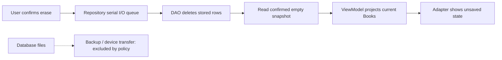

[מפת המעבדות]({{ '/android/topics/' | relative_url }}) · [Favorite שנשמר ב־Room]({{ '/android/topics/12-room-persistence/' | relative_url }}) · [לקוח HTTP]({{ '/android/topics/08-http-client/' | relative_url }})

{: .box-success}
בסוף המעבדה המשתמש יכול למחוק את כל סימוני ה־Favorite המקומיים, והם לא חוזרים אחרי הפעלה מחדש. קובץ כללי הגיבוי מחריג את מסדי הנתונים של אפליקציית המעבדה מן הגיבוי בענן וממעבר בין מכשירים. בנוסף נבדוק בתוך APK בנוי מחרוזת **לא רגישה** שהוטמעה בקוד, כדי להבין מדוע מפתח שירות ששולב באפליקציה אינו סוד.

בסיס ההשוואה הוא **`codex/room-persistence`**, שבו Favorite כבר נשמרת במסד. ענף התוצאה הוא **`codex/privacy-data-control`**. השינוי בר־בדיקה: שמרו, מחקו, הרגו את התהליך וטענו מחדש. בחירת מדיניות backup היא החלטת מוצר; במעבדה הזאת בוחרים במפורש **שמירה על המכשיר הזה בלבד**.

## נתון יכול להשאיר יותר מעותק אחד

לסימון Favorite יש עותק במסד, הקרנה ב־Set של ה־ViewModel וציור על כפתור. מחיקת הכוכב בלבד אינה מוחקת את הנתון; מחיקת המסד בלבד בלי פרסום מצב חדש משאירה תצוגה מטעה עד הטעינה הבאה. לכן מתחילים ממקור האמת ומוסרים snapshot ריק בחזרה למסך. זה אותו כיוון זרימה של Save, עם פעולת DAO אחרת.



דמיינו Save,‏ Save,‏ Erase שנשלחו בסדר הזה. שימוש באותו executor סדרתי גורם למחיקה לבוא אחרי שתי הכתיבות שכבר התקבלו. אם נפתח תור מחיקה נפרד, הוא עלול למחוק קודם ואז כתיבה ממתינה תחזיר סימון. גם בעת תכנון פרטיות צריך להבין תזמון, ולא רק את פקודת SQL.

נפריד בין שלושה גבולות הגנה: `.gitignore` מצמצמת חשיפה דרך קוד המקור; הגדרות backup מצמצמות העתקת קבצים; כללי שרת מגבילים פעולה על מידע מרוחק. אף אחד מהם אינו עושה את העבודה של האחרים. API key שמוזרק לבנייה אינו ב־Git, אבל יכול להיות ב־APK. HTTPS מגינה על המעבר, אבל אינה נותנת למבקש הרשאת בעלים.

**מחיקה לוגית** כאן פירושה ששורות Favorite אינן נגישות עוד דרך DAO ולא חוזרות בהפעלה מחדש. היא אינה הבטחה למחיקה פורנזית של כל בית בדיסק, journal או עותק היסטורי. בהתאם למוצר צריך לבחור גבול הבטחה מדויק ולבדוק כל מקום שבו נשמר מידע. במעבדה אין שרת, ואין צורך להוסיף איסוף נתונים כדי להמחיש פרטיות.

## עצרו ונבאו

שתי פעולות Save ממתינות בתור, ואז המשתמש מאשר Erase. למה לא להפעיל את המחיקה ב־executor אחר כדי שתהיה מהירה? כתבו תחזית לפני פתיחת ההסבר, ואז הצביעו על המשתנה או התנאי בקוד שמצדיקים אותה.

<details markdown="1">
<summary>בדיקת ההבנה</summary>

כי מחיקה מהירה יכולה להסתיים לפני Save ישנה, והכתיבה המאוחרת תחזיר נתון שהמשתמש ביקש למחוק. אותו תור סדרתי מבצע את המחיקה אחרי הכתיבות שכבר התקבלו, ואז קורא ומציג את המצב המאושר.

</details>

## 1. ממפים את הנתונים לפני שכותבים קוד

| נתון/הרשאה | קיים במעבדה? | החלטה |
|---:|:---:|---:|
| מזהי ספרים שסומנו | כן, בטבלת `favorites` | שומרים רק `bookId` ו־`note` ריק; נותנים מחיקה ברורה |
| חשבון, כתובת דוא״ל ומיקום | לא | אין לאסוף אותם כדי להפעיל Favorite מקומית |
| גיבוי לענן ומעבר מכשיר | ברירת המחדל של template עשויה לכלול מסד | מחריגים מסדי נתונים של המעבדה בשני המסלולים |
| קריאת רשת | לא בענף הזה | לא מוסיפים `INTERNET` או API key בלי תכונה שדורשת אותם |
| Logcat | אין לוג של Favorite | לא מדפיסים תוכן משתמש או token כדי לא ליצור עותק נוסף |

פרטיות מתחילה בצמצום: מידע שלא נאסף אינו צריך מחיקה, הרשאה או הגנה במעבר. [מדריך Design for Safety של Android](https://developer.android.com/quality/privacy-and-security) מדגיש צמצום הרשאות, גישה וחשיפה של נתונים.

## 2. מוסיפים מחיקה למקור האמת

ב־**app > kotlin+java > com.example.topics > FavoriteDao.java** הוסיפו שאילתה שמוחקת את כל שורות הטבלה. שאר השאילתות וה־transaction של `toggle` נשארות:

```java
/**
 * Deletes every local favorite row on the database worker.
 * This is logical removal from the table, not a forensic erasure guarantee.
 */
@Query("DELETE FROM favorites")
public abstract void deleteAll();
```

ב־`FavoritesRepository.java` הוסיפו פעולה שעוברת באותו תור Executor כמו הקריאה וה־toggle, ואחריה מחזירה snapshot עדכני ל־main thread:

```java
/**
 * Queues deletion after prior accepted operations and then reads confirmed state.
 *
 * @param listener recipient of the post-deletion snapshot on main
 */
public void clear(Listener listener) {
    io.execute(() -> {
        // Use the same serial queue as toggle, so an earlier save cannot finish later.
        database.favoriteDao().deleteAll();
        deliver(listener);
    });
}
```

ב־`BooksViewModel.java` הוסיפו:

```java
/**
 * Requests removal from persistent storage, then reuses the confirmed-state renderer.
 */
public void clearFavorites() {
    favorites.clear(this::showFavorites);
}
```

לא מנקים רק את `favoriteIds` שבזיכרון: זה היה משנה את המסך עד ההפעלה הבאה, ואז הנתון השמור היה חוזר. `showFavorites` הקיימת מקבלת את התוצאה אחרי המחיקה ומעדכנת כל `Book` לפי ה־Set החדש. אותו תור מונע מצב שבו שתי לחיצות Save ומחיקה נכתבות למסד בסדר אחר מן הסדר שבו נשלחו.

## 3. נותנים למשתמש שליטה גלויה

ב־**app > res > layout > activity_main.xml**, הוסיפו *אחרי* `RecyclerView id=book_list` ולפני כפתור Retry:

```xml
<Button
    android:id="@+id/clear_saved"
    android:layout_width="match_parent"
    android:layout_height="wrap_content"
    android:layout_marginTop="8dp"
    android:text="@string/clear_saved" />
```

הכפתור זמין גם לפני טעינת הרשימה: זכות המחיקה אינה תלויה בכך שהמשתמש קודם הציג את הנתונים. ב־**app > res > values > strings.xml** הוסיפו `clear_saved` = `Erase saved choices` ו־`clear_saved_confirm` = `Erase all saved favorites on this device?`. הרחיבו את `ui_states_instruction` הקיימת למשפט: `Choose a response. Load books to scroll and save a favorite. Saved choices are stored on this device; you can erase them.`

ב־`MainActivity.java` הוסיפו import ל־`androidx.appcompat.app.AlertDialog` ואת ה־listener ב־`onCreate`, ליד שאר לחיצות הכפתורים:

```java
binding.clearSaved.setOnClickListener(v -> new AlertDialog.Builder(this)
        .setMessage(R.string.clear_saved_confirm)
        .setPositiveButton(R.string.clear_saved, (dialog, which) ->
                viewModel.clearFavorites())
        .setNegativeButton(android.R.string.cancel, null)
        .show());
```

ה־Dialog מפרידה בין לחיצה מקרית לבין בקשה למחוק. `Cancel` לא שולחת פקודה למסד. מחיקת Favorite מקומית אינה "מחיקת חשבון": למוצר עם שרת, גיבויים או מידע אצל צדדים שלישיים צריך לתכנן מחיקה בכל מקור רלוונטי ולהסביר למשתמש מה נשאר.

## 4. מחליטים מה קורה בגיבוי

ב־**Search Everywhere** פתחו `data_extraction_rules.xml`, שקיים כבר בתבנית. `app > manifests > AndroidManifest.xml` מפנה אליו דרך `android:dataExtractionRules`. החליפו את הערות ה־TODO שבתוכו בכלל מפורש:

```xml
<data-extraction-rules>
    <cloud-backup>
        <exclude domain="database" path="." />
    </cloud-backup>
    <device-transfer>
        <exclude domain="database" path="." />
    </device-transfer>
</data-extraction-rules>
```

`path="."` בתחום `database` מחריג את כל תיקיית מסדי הנתונים של האפליקציה. זה מכוון בדוגמה הקטנה הזאת, שבה יש רק `favorites.db`; באפליקציה עם מסדים נוספים צריך לבחור כלל מדויק יותר ולבדוק את השפעתו. `cloud-backup` ו־`device-transfer` הם שני ערוצי העברה שונים, ולכן מציינים את שניהם. `minSdk` של הפרויקט הוא 31; אין לשנות את `backup_rules.xml` הישן שאינו חלק מנתיב ההרצה כאן. [תיעוד Auto Backup](https://developer.android.com/identity/data/autobackup) מפרט את תחומי הקבצים וכללי ההחרגה.

אי־גיבוי אינו מחיקה של עותקים שכבר יצאו בעבר ממערכת אחרת. במחזור חיים של מוצר אמיתי צריך להחליט גם על retention, שחזור ודרך לפנות לספקי שירות חיצוניים. כאן נשארים עם מסד מקומי אחד, ולכן אפשר להראות בדיוק מה נמחק.

## 5. בודקים מחיקה ו־restart

ב־**app > kotlin+java > com.example.topics (androidTest) > RoomMigrationTest.java** הוסיפו בדיקה למסד אמיתי בזיכרון:

```java
/**
 * Checks that deleting stored rows removes both saved identities.
 */
@Test
public void clearDeletesEveryFavorite() {
    TopicsDatabase database = Room.inMemoryDatabaseBuilder(
            InstrumentationRegistry.getInstrumentation().getTargetContext(),
            TopicsDatabase.class).build();
    try {
        FavoriteDao dao = database.favoriteDao();
        dao.toggle(7);
        dao.toggle(8);
        assertEquals(2, dao.loadIds().size());
        dao.deleteAll();
        assertTrue(dao.loadIds().isEmpty());
    } finally {
        database.close();
    }
}
```

הריצו `:app:connectedDebugAndroidTest`. אחר כך באמולטור: Load books → Save על Ada → ודאו `Saved ★` → Erase saved choices → אשרו → ודאו `Save ☆`. בצעו force stop **אחרי אישור המחיקה**, פתחו שוב וטענו ספרים: `Save ☆` צריך להישאר. בדיקת מסד בזיכרון בודקת את השאילתה; הבדיקה הידנית אחרי restart בודקת גם את החיבור ל־UI ואת הקובץ המקומי.

## 6. מוכיחים שמה שנכנס ל־APK אינו סוד

בנו `:app:assembleDebug`. במעבדה הזאת המחרוזת `favorites.db` היא שם קובץ ציבורי ולא מפתח. בדקו שהיא מופיעה באחד מקובצי ה־DEX בתוך ה־APK:

```powershell
python -c "import zipfile; z=zipfile.ZipFile('app/build/outputs/apk/debug/app-debug.apk'); print(any(b'favorites.db' in z.read(n) for n in z.namelist() if n.endswith('.dex')))"
```

התוצאה בענף התוצאה היא `True`. אותו עיקרון חל על ערך שנקרא מ־`local.properties` אך הוזרק ל־`BuildConfig` או למשאב שמצורף ל־APK: הוא **מחוץ ל־Git**, אבל כבר **בתוך קובץ שהמשתמש יכול לקבל**. אל תכניסו מפתח שרת רגיש לאפליקציית לקוח. אם ספק דורש API key לקוח, הגבילו אותו בצד הספק ככל האפשר לפי חבילה/חתימה/שירות, הפרידו סביבת פיתוח מייצור, ואל תסמכו עליו כעל הרשאת המשתמש. כשנדרש סוד אמיתי לקריאת שירות, החזיקו אותו בשרת ודרשו אימות והרשאות בצד השרת. [סיכון של static API key באפליקציה](https://developer.android.com/privacy-and-security/risks/insecure-api-usage) מתואר בתיעוד האבטחה של Android.

`Android Keystore` מיועד להגנת מפתחות שנוצרו/נשמרו *על המכשיר* עם מגבלות שימוש; הוא אינו הופך מפתח שרת זהה שמוטמע בכל APK לסוד. [תיעוד Android Keystore](https://developer.android.com/privacy-and-security/keystore) מפרט את גבול ההגנה הזה.

## 7. מציבים גבול גם לתקשורת ול־logs

[מעבדת HTTP]({{ '/android/topics/08-http-client/' | relative_url }}) משתמשת ב־URL ציבורי עם `https://` ומחזירה למסך רק סוג שגיאה, status ו־Content-Type. בתוכנה שמטפלת במידע אישי, בדקו שה־endpoint הוא HTTPS, שאין `usesCleartextTraffic="true"` שנוסף רק כדי לעקוף שגיאה, וש־Logcat אינו מכיל Authorization headers, גוף בקשה, URI עם token או מידע אישי. Android חוסם cleartext כברירת מחדל לאפליקציות שמכוונות ל־API 28+, אך צריך עדיין לבחור endpoint ו־SDKs מתאימים ולבדוק בפועל. [תיעוד הגדרת cleartext](https://developer.android.com/guide/topics/manifest/application-element) מסביר את הדגל.

HTTPS מצפין תעבורה בדרך ומאמת את השרת לפי TLS; הוא **אינו** מחליף Auth, כללי גישה בצד השרת, או החלטה איזה נתון בכלל צריך לשלוח. במקרה של Favorite מקומית אין שום צורך לשלוח מזהי ספרים לשרת, ולכן בענף הזה אין כלל הרשאת `INTERNET`.

## שאלות בדיקה

{: .alefbet}
1. מה ההבדל בין מחיקת Set ב־ViewModel לבין `DELETE FROM favorites` במסד?
2. מדוע ה־backup rules מציינות גם ענן וגם מעבר ישיר בין מכשירים?
3. מה מוכיחה הופעת `favorites.db` בתוך ה־APK לגבי `BuildConfig` עם API key?
4. איזה מידע צריך להימחק אם בעתיד האפליקציה תשמור גם פרופיל משתמש בשרת?
5. האם HTTPS לבדו מונע ממשתמש אחר לקרוא מידע שאינו שלו? היכן נאכפת הבעלות?
