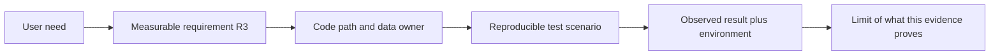
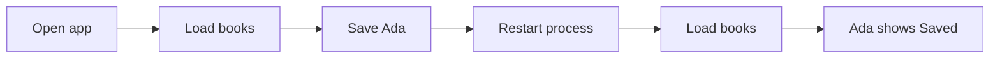
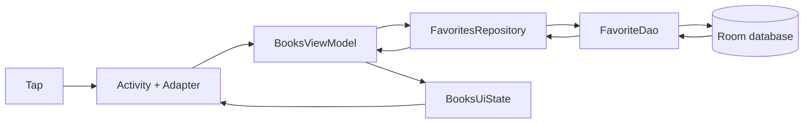

[מפת המעבדות]({{ '/android/topics/' | relative_url }}) · [המסד שעליו מבוססת הדוגמה]({{ '/android/topics/12-room-persistence/' | relative_url }})

{: .box-success}
בסוף המעבדה תלמיד אחר יכול לפתוח את פרויקט **topics**, להבין איזו בעיה מסך הספרים פותר, להריץ אותו, לאתר את רכיבי הקוד המרכזיים, ולבדוק טענה אחת חשובה: Favorite של Ada נשמרת אחרי restart. התוצר הוא ארבעה מסמכים קצרים וצילום ראיה בענף **`codex/project-evidence`**. קוד האפליקציה עצמו לא משתנה בענף הזה.

בסיס ההשוואה הוא **`codex/room-persistence`**. זה מכוון: כאשר מלמדים אפיון, תיעוד והצגה, ה־diff יכול להיות תיעוד שמסביר **מערכת קיימת שנבדקה**. אל תתארו תכונה עתידית בלשון עבר ואל תכתבו "עובד" בלי תרחיש ותוצאה שניתן לשחזר.

## טענה, ראיה ומגבלה צריכות להתחבר

"השתמשתי ב־Room" היא טענה על כלי; "Ada נשארת מסומנת אחרי תהליך חדש" היא טענה על התנהגות. כדי לתמוך בה נציין מצב התחלה, פעולה, תוצאה וזיהוי של הגרסה והמכשיר. צילום של כוכב תומך בטענה שהכוכב נראה באותו רגע; הוא לבדו לא מראה שמירת דיסק או restart. אפשר להסביר את הטענה היטב גם כשהראיה עדיין חסרה, כל עוד מציינים זאת במפורש.

תיעוד טוב מאפשר לצופה להגיע מן הדרישה אל מתודה ואל בדיקה. אם הדרישה היא שמירה אחרי restart, הצביעו על `FavoriteDao.toggle`, תור ה־Repository וקריאת המסד בפתיחה. אם הבדיקה מבצעת רק `recreate`, היא אינה מספקת את הראיה של תהליך חדש, גם כאשר היא ירוקה. דרישות שונות יכולות להשתמש באותו קוד אבל צריכות תרחישים שונים.

לכל החלטה כתבו חלופה ומחיר: Set בזיכרון פשוט יותר אבל אינו שורד תהליך; Room שורדת אבל דורשת סכימה, threading ו־migration. כך תרשים ארכיטקטורה הופך להסבר של בחירה. אל תוסיפו לתרשים רכיב שאין לו תפקיד בקוד; אל תציירו חץ אם אינכם יכולים להצביע על מי שולח ומה נשלח בו.

**בפרויקט שלכם צרו את המסמכים מן התוצאות שלכם.** תאריכי הבדיקה, שמות המכשירים, מספר הבדיקות וצילום בענף הדוגמה שייכים לפרויקט ההוא. אם יש רק build מוצלח, כתבו זאת והשאירו בדיקת restart כלא בוצעה. מגבלה מפורשת עוזרת לקורא להבין את הגרסה הנוכחית ולבחור ניסוי הבא; היא אינה פוגעת בהסבר מקצועי.

## עצרו ונבאו

בתמונה רואים Saved ליד Ada. איזו ראיה עוד חסרה כדי להוכיח שהסימון שרד סגירת תהליך? כתבו תחזית לפני פתיחת ההסבר, ואז הצביעו על המשתנה או התנאי בקוד שמצדיקים אותה.

בדיקת ההבנה

צריך רצף שניתן לשחזר: Save, סגירת התהליך, פתיחה חדשה, Load, והתוצאה שנצפתה אחרי הפתיחה. צילום של רגע אחד אינו מראה את גבול הזיכרון. תעדו גם סביבת ריצה ומגבלות, כדי שאחר יוכל לחזור על הבדיקה.

## 1. מתחילים מהבעיה ומהתוצאה הנצפית

בחרו משפט מוצר קטן: "קורא מסמן ספר שמעניין אותו ומוצא את הסימון גם אחרי סגירת האפליקציה". ממנו נגזור מסלול בדיקה:

בענף התוצאה, `docs/requirements.md` מגדיר שש דרישות עם מזהים `R1`–`R6`. למשל:

| מזהה | דרישה | בדיקת קבלה |
|---:|---:|---:|
| `R2` | סימון נצמד לזהות ספר, לא למיקום שורה | סמן Ada, גלול הרחק וחזור, טען מחדש וסובב; Ada נשארת מסומנת |
| `R3` | Favorite נשמרת מקומית | אחרי `Saved ★`, עצור את התהליך, פתח וטען שוב; Ada עדיין `Saved ★` |
| `R4` | שדרוג סכימה שומר מידע | צור מסד v1 עם ID 7, שדרג ל־v2, וקרא ID 7 עם `note` ריק |

טבלת הדרישות אינה רשימת API. היא קושרת **פעולת משתמש → תוצאה שאפשר לצפות בה**. `R4` אינה גלויה במסך, לכן קושרים אותה לבדיקת migration. אם תשובה לבדיקה תלויה ב"כנראה", חסר קריטריון קבלה או ראיה.

## 2. מציירים מי מחזיק כל מצב

`docs/architecture.md` מציג זרימת נתונים אחת. קראו אותה מול הקוד שב־**app > kotlin+java > com.example.topics**:

`MainActivity` מטפלת ב־View Binding, לחיצות וציור מצב. `BooksViewModel` מחזיקה את מצב המסך. `FavoritesRepository` מעבירה עבודת Room ל־Executor ומחזירה snapshot ל־main thread. `FavoriteDao` מבצעת את השאילתה וה־transaction. `BookAdapter` מצייר את הספר לפי ID; הוא לא שומר אמת במסך ממוחזר.

הוסיפו למסמך **טבלת אחריות** לכל רכיב: "מה הוא מחזיק" ו"מה הוא לא מחזיק". הגבול השני חשוב לא פחות מן הראשון. למשל, Activity אינה מריצה SQL, ו־DAO אינה מחליטה מה להציג בשגיאה. מתחת לתרשים רשמו גם מודל נתונים: טבלת `favorites`, מפתח ראשי `bookId`, גרסת סכימה 2 ועמודת `note` עם ברירת מחדל. זה מאפשר לבוחן לעבור מן התרשים לשורת קוד ולבדיקה.

## 3. מתעדים החלטה עם מחיר, לא רק שם תבנית

ב־`docs/architecture.md` כל החלטה כוללת סיבה ומחיר:

| החלטה | סיבה | מחיר/גבול |
|---:|---:|---:|
| Room במקום Set בזיכרון | סימון צריך לשרוד סיום תהליך | סכימה ו־migration דורשות תכנון ובדיקות |
| Executor יחיד | עבודת DB מחוץ ל־main וסדר פעולות ברור | אינו פתרון כללי לכל עומס במקביל |
| `@Transaction` ל־toggle | קריאה וכתיבה כפעולה אטומית במסד | אינו פותר תחרות בין מכשירים בענן |

המשפט "השתמשנו ב־MVVM כי זו ארכיטקטורה טובה" אינו מסביר החלטה. הסבירו איזה באג או קושי חלוקת האחריות מונעת. בדוגמה הזאת, הסימון אינו נודד ל־ViewHolder אחר בזמן מיחזור, ו־Activity חדשה אחרי סיבוב יכולה לצייר מצב שמגיע מן ViewModel/מסד.

## 4. בונים תיק ראיות שאפשר לבדוק מחדש

בדוגמת תיק הראיות, `docs/verification.md` מתעד פקודת הרצה, מכשיר וארבע בדיקות: בדיקת UI של מיחזור/טעינה/סיבוב, בדיקת migration מ־v1 ל־v2, בדיקת toggle במסד ובדיקת template שלא הוסרה. התוצאה היא **4 tests,‏ 0 failures,‏ 0 errors**. בפרויקט שלכם רשמו את התאריך והפלט של הריצה שלכם. לפני התקנה קראו את [בחירת מכשיר מפורשת]({{ '/android/topics/#בוחרים-מכשיר-לפני-התקנה-ובדיקה' | relative_url }}); הרצה על מכשיר שלא התכוונתם לבחור אינה ראיה לתרחיש שתכננתם. בהרצה דרך `am instrument` התוצאה מופיעה בטרמינל, ויש לשמור את הפלט; דוח JUnit של ריצת Gradle קודמת אינו שייך אוטומטית לריצה החדשה.

בנוסף בוצע מסלול ידני: התקנת APK, שמירת Ada, force stop, פתיחה מחדש וטעינת ספרים. הצילום `docs/evidence/favorite-after-restart.png` מציג את המצב הסופי `Saved ★`. הצילום לבדו **אינו מוכיח** שקרה restart; רצף הפעולות והבדיקה האוטומטית משלימים את הראיה. בדיקת migration מתחילה מ־`1.json` ישן — התקנה נקייה של v2 לא הייתה בודקת את אותו דבר.

ב־**Search Everywhere** פתחו את `README.md` ואת הקבצים ב־`docs/` בענף התוצאה. אלו קבצי שורש שעשויים לא להופיע בתצוגת **Android** של Android Studio. `README.md` נותן הוראות הפעלה ומגבלות; `requirements.md` קושר דרישות לבדיקות; `architecture.md` קושר רכיבים לנתונים; `verification.md` אומר מה בדיוק נבדק. אין להעתיק את מסקנת הבדיקות לפרויקט אחר בלי להריץ אותן שם.

## 5. מציגים שלוש דקות בלי להסתיר מגבלה

`docs/demo-script.md` מציע סדר קצר:

1. **0:00–0:30:** בעיית הקורא ודרישת ההתמדה.
2. **0:30–1:30:** טעינה, שמירה, גלילה ו־restart מול המסך האמיתי.
3. **1:30–2:20:** הצבעה על Activity → ViewModel → Repository → DAO → Room וחזרה ל־UI.
4. **2:20–3:00:** בדיקות migration/UI, ואז מגבלה אמיתית: שגיאת כתיבה למסד עדיין אינה מוצגת למשתמש.

למגבלה יש הצעת תיקון קונקרטית: תוצאת success/error טיפוסית ב־Repository, הצגת שגיאה למסך והחלטת Retry בטוחה. לא מתקנים אותה במסמך בלבד; המסמך מונע טענה לא מדויקת לגבי גרסה נוכחית. המטרה היא שהצופה יוכל לשאול "איך אתה יודע?" ולקבל קובץ, בדיקה ותרחיש רלוונטיים.

## 6. מעבירים לפרויקט של התלמיד

בחרו תכונה אחת שכבר עובדת בפרויקט שלכם. צרו `README.md` וארבעה קבצים קצרים תחת `docs/`, או מסמך שקול עם אותם חלקים. לכל טענה מרכזית כתבו:

| שאלה | מה למסור |
|---:|---:|
| מה הבעיה ומי המשתמש? | משפט מוצר ותרחיש שימוש אחד |
| מהי תוצאה מוצלחת? | דרישה ממוספרת ובדיקת קבלה נצפית |
| מי מחזיק נתונים ומי מצייר? | תרשים רכיבים ומודל נתונים עם גבולות אחריות |
| איך בדקתם? | פקודה, מכשיר/גרסה, תוצאת בדיקה ורצף ידני אם צריך |
| מה עדיין לא עובד? | מגבלה אמיתית והצעת תיקון שאפשר לממש |

השתמשו בצילום או וידאו רק כשיש להם תפקיד ראייתי ברור, ואל תכללו בהם פרטים אישיים, token או נתוני תלמידים. הדרישה היא להראות שליטה בקוד ובנתונים של **הפרויקט שלכם**, לא לשחזר את טקסט הדוגמה.

## שאלות בדיקה

{: .alefbet}
1. איזו ראיה מוכיחה ש־Favorite נשמרה אחרי תהליך חדש, ואיזו ראיה רק מראה את המסך הסופי?
2. כיצד מבדילים בין בדיקת migration ובין התקנה חדשה של סכימה v2?
3. מה חסר אם במסמך ארכיטקטורה יש שמות רכיבים אבל אין מקור אמת או כיוון זרימת מידע?
4. איזה חלק בהדגמה שלכם הייתם מקצרים אם נשארה דקה אחת, ומה עדיין חייב להיאמר?
