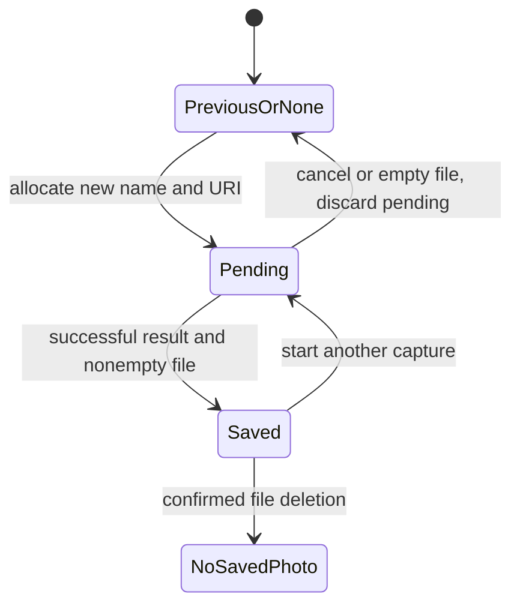

[מפת המעבדות]({{ '/android/topics/' | relative_url }}) · [מעבדת ההרשאות הקודמת]({{ '/android/topics/15-permission-result-contracts/' | relative_url }})

{: .box-success}
בסוף השיעור צילום דרך אפליקציית מצלמה נשמר בקובץ פרטי של האפליקציה, מוצג שוב אחרי סגירה ופתיחה, ונמחק בלחיצה. בחירת תמונה קיימת ממשיכה לעבוד דרך Photo Picker בלי גישה לכל הגלריה. אפשר להבחין בין תמונת preview קטנה שלא נשמרת, תמונה שנבחרה דרך `content://`, ותמונה מלאה שהאפליקציה מחזיקה.

בסיס ההשוואה הוא **`codex/permission-contracts`** וענף התוצאה הוא **`codex/camera-gallery-storage`** בפרויקט **topics**. התחילו מן הענף הקודם, לא מ־`master`: הכפתורים וה־contracts הראשונים כבר קיימים.

## שלושה מקורות, שלוש בעלויות

| פעולה | מי מחזיק בקובץ? | מה האפליקציה מקבלת? | האם שורד הפעלה מחדש? |
|---:|---:|---:|:---:|
| `TakePicturePreview` | אין קובץ מובטח | `Bitmap` מוקטן בזיכרון | לא |
| `PickVisualMedia` | ספק המדיה | URI והרשאת קריאה לפריט שנבחר | רק אם מתכננים גישה מתמשכת; כאן מציגים מיד |
| `TakePicture` | האפליקציה שלנו | `Boolean`; התמונה נכתבת ל־URI שנתנו מראש | כן, כל עוד הקובץ נשמר |

ה־URI של ה־Photo Picker הוא **מזהה גישה**, לא מסלול שאפשר להמיר בבטחה ל־`File`. כך נשמרת הבחירה המצומצמת של המשתמש. לפי [מדריך Photo Picker](https://developer.android.com/training/data-storage/shared/photo-picker), בחירה נקודתית אינה דורשת הרשאת גישה רחבה לתמונות. בצילום המלא כאן אפליקציית המצלמה היא שמפעילה את החומרה; הפרויקט אינו מבקש `CAMERA` או הרשאת אחסון. אם עוברים בעתיד ל־CameraX *בתוך* האפליקציה, מדיניות ההרשאה שונה.

## צילום הוא פעולה בשני שלבים

לפני פתיחת המצלמה יש לנו **יעד אפשרי**, לא תמונה שמורה. `pendingPhotoName` מזהה את קובץ הניסיון; ההעדפה `photo` מזהה את התמונה שהושלמה. רק אחרי תוצאת true ובדיקת תוכן מעדכנים את ההעדפה. ביטול מוחק את הניסיון החדש, ומשאיר את התמונה הקודמת. הפרדה זו מונעת מחיקת תמונה טובה רק משום שהמשתמש פתח מצלמה והתחרט.



שמרו את השם הממתין ב־Bundle כי Android יכולה ליצור Activity חדשה בזמן שאפליקציית המצלמה בחזית. אל תשמרו בה Bitmap: Bundle הוא מנגנון מצב קטן ומוגבל, לא מיכל של מיליוני פיקסלים. URI זמני מספק למצלמה גישה מצומצמת ליעד דרך FileProvider בלי לחשוף את תיקיית הקבצים כולה.

בקירוב, Bitmap בגודל 4000×3000 עם ארבעה בתים לפיקסל דורש כ־48 מיליון בתים, גם אם JPEG מכווץ קטן בהרבה. `inJustDecodeBounds` קוראת מידות בלי להקצות את כל הפיקסלים, ו־`inSampleSize` מצמצמת את הפענוח לתצוגה. EXIF הוא metadata שמסביר כיוון; לעיתים דרוש גם mirror ולא רק סיבוב. גודל פיקסלים, גודל קובץ ומידות ImageView הם שלוש כמויות שונות.

גם פענוח ברקע יכול להחזיר תשובה מאוחרת: המשתמש מחק תמונה או בחר אחרת בזמן העבודה. יש לבדוק זהות/דור לפני פרסום Bitmap, כמו בבקשת רשת. הצלחת מחיקה צריכה להתקבל מן הקובץ; הסרת ההעדפה לפני `File.delete` מוצלחת תסתיר קובץ שנותר בפועל. במוצר הגדירו גם טיפול בכשל ובקבצים יתומים אחרי הפסקת תהליך באמצע צילום.

## עצרו ונבאו

A היא התמונה השמורה. פתחתם צילום B וביטלתם במצלמה. מה צריכה ההעדפה המקומית להזכיר? כתבו תחזית לפני פתיחת ההסבר, ואז הצביעו על המשתנה או התנאי בקוד שמצדיקים אותה.

<details markdown="1">
<summary>בדיקת ההבנה</summary>

את A. שם pending הוא יעד ניסיון שטרם הושלם, ולכן אינו מחליף את שם התמונה השמורה בתחילת הצילום. רק תשובה מוצלחת וקובץ לא ריק מעבירים את הבעלות לתמונה החדשה; ביטול משליך את הניסיון.

</details>

## 1. חושפים רק תיקייה אחת למצלמה

ב־**app > res > xml** צרו `file_paths.xml`:

```xml
<?xml version="1.0" encoding="utf-8"?>
<paths xmlns:android="http://schemas.android.com/apk/res/android">
    <files-path name="photos" path="photos/" />
</paths>
```

ב־**app > manifests > AndroidManifest.xml**, בתוך `<application>` ולפני `<activity>`, הוסיפו:

```xml
<provider
    android:name="androidx.core.content.FileProvider"
    android:authorities="${applicationId}.files"
    android:exported="false"
    android:grantUriPermissions="true">
    <meta-data
        android:name="android.support.FILE_PROVIDER_PATHS"
        android:resource="@xml/file_paths" />
</provider>
```

`FileProvider` ממיר קובץ פרטי ל־`content://` ומאפשר גישה זמנית לאפליקציית המצלמה. ה־`authority` חייב להתאים לקריאה בקוד. ההגדרה אינה חושפת את כל `files/`, אלא רק את `files/photos/`. קראו גם את [תיעוד FileProvider](https://developer.android.com/reference/androidx/core/content/FileProvider) על התאמה בין הנתיב, ה־URI והרשאת הגישה.

## 2. מוסיפים תצוגה ופעולות

ב־**app > res > layout > activity_main.xml**, אחרי כפתור `camera_preview` ולפני `result`, הוסיפו שני `Button` עם המזהים `take_picture` ו־`delete_photo` ו־`ImageView id=image`. לשני הכפתורים רוחב `match_parent`, גובה `wrap_content`; ל־ImageView רוחב `match_parent`, גובה `220dp`,‏ `scaleType="fitCenter"`, ותיאור נגישות `@string/photo_preview_description`. השאירו את הכפתורים הקיימים. ב־**app > res > values > strings.xml** הוסיפו:

```xml
<string name="take_picture">Take full photo</string>
<string name="delete_photo">Delete saved photo</string>
<string name="photo_preview_description">Selected or captured photo</string>
<string name="saved_photo">Saved photo: %1$d bytes, %2$d × %3$d pixels, EXIF rotation %4$d°.</string>
<string name="photo_missing">Saved photo is missing or unreadable.</string>
<string name="photo_deleted">Saved photo deleted.</string>
```

## 3. מייצרים URI לפני פתיחת המצלמה

ב־`MainActivity.java` הוסיפו את ה־imports ל־`File`,‏ `UUID`,‏ `FileProvider`,‏ `ActivityResultLauncher` ו־`Uri`. הוסיפו שדה `pendingPhotoName` ו־launcher חדש לצד ארבעת ה־launchers הקודמים:

```java
private String pendingPhotoName;
private final ActivityResultLauncher<Uri> takePicture = registerForActivityResult(
        new ActivityResultContracts.TakePicture(), saved -> {
            if (pendingPhotoName == null) return;
            File photo = new File(photoDirectory(), pendingPhotoName);
            if (saved && photo.length() > 0) {
                String previous = getPreferences(MODE_PRIVATE).getString("photo", null);
                getPreferences(MODE_PRIVATE).edit().putString("photo", pendingPhotoName).apply();
                if (previous != null && !previous.equals(pendingPhotoName)) {
                    new File(photoDirectory(), previous).delete();
                }
                showSavedPhoto(photo);
            } else {
                // Cancellation discards only this attempt, never the previous saved photo.
                photo.delete();
                binding.result.setText(R.string.selection_cancelled);
            }
            pendingPhotoName = null;
        });
```

ה־[contract הרשמי](https://developer.android.com/reference/androidx/activity/result/contract/ActivityResultContracts.TakePicture) מקבל URI ומחזיר `true` אם התמונה נשמרה. כאן בודקים גם שקיים תוכן, כך שלא מציגים קובץ ריק. ביטול מוחק רק את הקובץ החדש והזמני; התמונה הקודמת נשארת. עם צילום חדש מוצלח מוחקים את הקודם כדי שלא יצטברו קבצים פרטיים ללא גבול.

בתוך `onCreate`, מיד אחרי `setContentView`, שחזרו את השם הזמני מ־`savedInstanceState`, ולצד חיבורי הכפתורים הקיימים הוסיפו:

```java
if (savedInstanceState != null) pendingPhotoName = savedInstanceState.getString("pending_photo");
binding.takePicture.setOnClickListener(view -> captureFullPhoto());
binding.deletePhoto.setOnClickListener(view -> deleteSavedPhoto());
String savedPhoto = getPreferences(MODE_PRIVATE).getString("photo", null);
if (savedPhoto != null) showSavedPhoto(new File(photoDirectory(), savedPhoto));
```

הוסיפו את השיטות הבאות ל־Activity:

```java
/**
 * Saves the pending capture identity while another Activity may be using the camera.
 *
 * @param outState small restoration Bundle; no Bitmap is stored here
 */
@Override
protected void onSaveInstanceState(Bundle outState) {
    outState.putString("pending_photo", pendingPhotoName);
    super.onSaveInstanceState(outState);
}

/**
 * Returns this app's private photo directory, creating it when necessary.
 *
 * @return directory covered by the narrow FileProvider paths rule
 * @throws IllegalStateException if the directory cannot be created
 */
private File photoDirectory() {
    File directory = new File(getFilesDir(), "photos");
    if (!directory.exists() && !directory.mkdirs())
        throw new IllegalStateException("Cannot create photos directory");
    return directory;
}

/**
 * Allocates a new pending destination and launches an external camera with its URI.
 * The last completed photo remains selected until this attempt succeeds.
 */
private void captureFullPhoto() {
    pendingPhotoName = UUID.randomUUID() + ".jpg";
    File photo = new File(photoDirectory(), pendingPhotoName);
    Uri uri = FileProvider.getUriForFile(this, getPackageName() + ".files", photo);
    takePicture.launch(uri);
}
```

ה־`Bundle` שומר את *שם הקובץ הממתין* אם ה־Activity נוצרת מחדש בזמן שהמצלמה פתוחה; ההעדפה המקומית שומרת את *שם הקובץ האחרון שהושלם* בין הפעלות. אל תשמרו Bitmap גדול ב־Bundle. שם UUID הוא מזהה קובץ מקומי ולא הרשאה. `captureFullPhoto()` בקוד המשלים גם מטפלת ב־`ActivityNotFoundException` אם אין אפליקציית מצלמה. `filesDir` הוא אחסון ייעודי לאפליקציה; לצורך פרסום בגלריה של המכשיר תידרש זרימת `MediaStore` נפרדת לפי [מדריך המדיה המשותפת](https://developer.android.com/training/data-storage/shared/media).

## 4. מפענחים תמונה בגודל תצוגה ומתייחסים ל־EXIF

הוסיפו `ExecutorService imageWorker = Executors.newSingleThreadExecutor()` כשדה. `showSavedPhoto(File)` בקוד המשלים קוראת תחילה את גבולות התמונה באמצעות `BitmapFactory.Options.inJustDecodeBounds`, בוחרת `inSampleSize` עד שהצד הארוך אינו עולה בערך על 800 פיקסלים, מפענחת ברקע, ואז קוראת `ExifInterface.TAG_ORIENTATION` ומפעילה `Matrix` להיפוך/סיבוב. Mirror אופקי/אנכי ו־transpose/transverse דורשים היפוך בנוסף לסיבוב; בדקו אותם בנפרד. רק את העדכון של `ImageView` ו־`result` היא מעבירה ל־UI thread באמצעות `runOnUiThread`. ב־`onDestroy` קוראים `imageWorker.shutdown()`.

זה החלק שבו *גודל הקובץ* ו־*גודל ה־Bitmap בזיכרון* נפרדים: JPEG של כמה מאות KB יכול להיפתח למיליוני פיקסלים. טעינת תמונה מלאה על ה־UI thread עלולה להקפיא מסך או לגרום לכשל זיכרון. EXIF עשוי לקבוע שהפיקסלים נשמרו לרוחב אף שהתמונה צריכה להופיע לאורך. השוו את מספר המעלות שמציג המסך לצילום אנכי ואופקי. קראו את [ExifInterface](https://developer.android.com/reference/android/media/ExifInterface) ואת [BitmapFactory.Options](https://developer.android.com/reference/android/graphics/BitmapFactory.Options).

בקוד המשלים נמצאות גם `deleteSavedPhoto()` ו־`showSavedPhoto` המלאות. עקבו אחריהן: המחיקה מסירה קובץ והעדפה רק לאחר הצלחת `File.delete()`, ו־callback ישן של פענוח אינו רשאי להחזיר למסך תמונה שנמחקה. `imageGeneration` משתנה בכל בקשת פענוח, בחירת תמונה אחרת, מחיקה מוצלחת או destruction. בודקים אותו גם בתוצאת הצלחה וגם בכשל אחרי ההעברה ל־main. בדיקת שם הקובץ בהעדפה מוודאת בנוסף שזו עדיין התמונה השמורה. כל קריאת השדה ושינוי שלו מתבצעים על main; שרשור הפענוח משתמש רק ב־`expected` שנלכד עבורו.

## 5. מציגים גם בחירה קיימת

ב־callback של `pickPhoto` הקיים החליפו את הביטוי היחיד בבלוק: אם `uri == null`, הציגו `selection_cancelled`; אחרת הציגו את MIME type וקראו `binding.image.setImageURI(uri)`, אחרי הגדלת `imageGeneration`. זו דרך קצרה לתצוגה זמנית; לטעינת תמונות גדולות מספק חיצוני במוצר נשתמש גם כאן בפענוח ברקע ובגודל יעד, ולא נניח שהקריאה הקצרה אינה מבצעת עבודה על main. זהו preview זמני של הפריט שנבחר; אין כאן העתקה לאחסון פרטי או התחייבות להציג אותו אחרי restart. שימו לב שמספרי `content://` ומבנה הנתיבים של ספק המדיה אינם API של קבצים.


## הקוד המשלים במלואו

הקטעים הגלויים בשיעור ממקדים את הרעיון; הקבצים הבאים משלימים את כל הקוד הדרוש, עם תיעוד והערות. קראו את השינוי יחד עם ההסבר שמעליו. הם חלק מן השיעור ואינם דורשים פתיחת ענף דוגמה או אתר שפורסם.

### MainActivity.java

[פתיחת המקור ישירות]({{ '/android/topics/code/19/MainActivity.java.md' | relative_url }}) — בקובץ Markdown המקורי, הקוד נמצא ב־`code/19/MainActivity.java.md` ביחס לשיעור.

<details markdown="1">
<summary>הקוד המלא והשינויים עבור MainActivity.java</summary>



</details>

### activity_main.xml

[פתיחת המקור ישירות]({{ '/android/topics/code/19/activity_main.xml.md' | relative_url }}) — בקובץ Markdown המקורי, הקוד נמצא ב־`code/19/activity_main.xml.md` ביחס לשיעור.

<details markdown="1">
<summary>הקוד המלא והשינויים עבור activity_main.xml</summary>



</details>

### strings.xml

[פתיחת המקור ישירות]({{ '/android/topics/code/19/strings.xml.md' | relative_url }}) — בקובץ Markdown המקורי, הקוד נמצא ב־`code/19/strings.xml.md` ביחס לשיעור.

<details markdown="1">
<summary>הקוד המלא והשינויים עבור strings.xml</summary>



</details>

### file_paths.xml

[פתיחת המקור ישירות]({{ '/android/topics/code/19/file_paths.xml.md' | relative_url }}) — בקובץ Markdown המקורי, הקוד נמצא ב־`code/19/file_paths.xml.md` ביחס לשיעור.

<details markdown="1">
<summary>הקוד המלא והשינויים עבור file_paths.xml</summary>



</details>

## בדיקה על אמולטור

1. צלמו דרך **Take full photo** ואשרו במסך המצלמה. ודאו ש־`result` מציג בתים, רוחב/גובה וסיבוב EXIF ושהתמונה נראית.
2. סגרו בכוח את האפליקציה ופתחו שוב: אותה תמונה מופיעה. בדיקת המעבדה הראתה קובץ JPEG של **63,540 bytes** בגודל **1440×1920** גם אחרי restart.
3. לחצו **Delete saved photo**. ודאו שהתמונה והקובץ נעלמו. צלמו שוב ובטלו: הביטול אינו יוצר תמונה שמורה חדשה.
4. בחרו תמונה דרך Photo Picker, בטלו בחירה בניסיון נוסף, והשוו להתנהגות הצילום. בדקו גם סיבוב מסך כשהמצלמה פתוחה, תמונה בעלת EXIF שונה, מכשיר קטן וקורא מסך.

**שאלת העברה:** אם המוצר דורש שתמונה תופיע בגלריה של יישומים אחרים, איזה רכיב אחסון תחליפו ולמה `FileProvider` פרטי אינו פתרון לפרסום קבוע? אם המוצר צריך את המצלמה בתוך המסך, אילו הרשאות ומחזור חיים משתנים?
