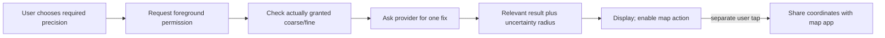

[מפת המעבדות]({{ '/android/topics/' | relative_url }}) · [מעבדת סירוב והרשאות]({{ '/android/topics/15-permission-result-contracts/' | relative_url }})

{: .box-success}
בסוף המעבדה המשתמש בוחר **מצא מיקום מקורב** או **שדרג לדיוק גבוה**. האפליקציה מבקשת הרשאת foreground רק בלחיצה, מקבלת נקודה אחת, מציגה רדיוס דיוק במטרים, ומעבירה את הנקודה לאפליקציית מפה רק בלחיצה נפרדת. סירוב, ספק מיקום כבוי, היעדר fix והיעדר אפליקציית מפה הם מצבים גלויים.

בסיס ההשוואה בפרויקט **topics** הוא `master`, וענף התוצאה הוא **`codex/location-maps`**. זהו תרחיש של *הצגת מקומי על מפה*, ללא מעקב רציף וללא שרת. אין צורך במפתח Google Maps או בהרשאת רקע לתוצאה הזו.

## איזו רמת דיוק נחוצה?

| צורך משתמש | הרשאה | דוגמת מוצר | עלות פרטיות |
|---:|:---|---:|---:|
| למצוא שירותים בעיר | `ACCESS_COARSE_LOCATION` | רשימת ספריות בסביבה | אזור כללי |
| להגיע לנקודה מדויקת | `ACCESS_FINE_LOCATION` יחד עם coarse | מיקום כניסה לבניין | נקודה מדויקת יותר |

לפי [מדריך הרשאות המיקום](https://developer.android.com/develop/sensors-and-location/location/permissions/runtime), Android 12+ מאפשר למשתמש להעניק **Approximate** גם כשמבקשים דיוק מלא. לכן, בעת שדרוג, מבקשים `FINE` ו־`COARSE` באותה בקשה וממשיכים לעבוד גם אם ניתנה רק `COARSE`. אל תפרשו `getAccuracy()` כהבטחה: זה אומדן רדיוס, ותנאי שטח/רשת/מכשיר משפיעים עליו. שינוי בהגדרת הדיוק עלול להפעיל מחדש את תהליך האפליקציה.

## בקשת דיוק אינה הבטחת דיוק

האפליקציה יכולה לבקש fine, המשתמש יכול לבחור coarse, והספק יכול להחזיר נקודה שרדיוס אי־הוודאות שלה גדול. אלה שלושה שלבים שונים. `preciseRequested` זוכר את כוונת הפעולה; `has(FINE)` אומר מה המערכת התירה; `getAccuracy()` מתאר אומדן של **המדידה שהתקבלה**. אין להסיק מאישור הרשאה שהנקודה נמצאת בדיוק בכניסה לבניין.



`getCurrentLocation` מקבלת CancellationSignal וביצוע callback ב־executor שבחרנו; `getMainExecutor` מאפשר לעדכן Views שם. null היא תוצאת "אין נקודה", לא קואורדינטות 0,0. לפני בקשה חדשה מנקים את הנקודה הישנה ומשביתים Open Map, כדי שכפתור פעיל לא ישלח בטעות מיקום קודם.

ביטול ב־`onStop` חוסך עבודה כשהמסך אינו גלוי, והגדלת דור פוסלת callback שכבר עבר לתור. הגנה על רלוונטיות והגנה על הרשאה נפרדות: גם callback שייך לדור נכון אינו מצדיק שימוש בהרשאה שכבר השתנתה. לכן בודקים לפני שימוש ומטפלים גם ב־SecurityException.

המפה היא אפליקציה אחרת. יצירת `geo:` URI ו־ACTION_VIEW מעבירה לה מידע בלחיצה נפרדת; אין כאן SDK מפה בתוך המסך. `Locale.US` ב־URI מבטיחה נקודה עשרונית, בעוד טקסט התצוגה יכול להשתמש בשפת המשתמש. שימו לב גם לסדר: `adb emu geo fix` מקבל longitude ואז latitude, בעוד הרבה APIs ותיאורי מיקום מציגים latitude תחילה.

## עצרו ונבאו

preciseRequested=true, אבל המשתמש העניק רק coarse. כיצד תוצג התוצאה? כתבו תחזית לפני פתיחת ההסבר, ואז הצביעו על המשתנה או התנאי בקוד שמצדיקים אותה.

<details markdown="1">
<summary>בדיקת ההבנה</summary>

כמקורבת, אם התקבלה נקודה. preciseRequested שומרת כוונת פעולה; has(FINE) קובעת האם הותר דיוק גבוה. רדיוס accuracy שייך למדידה בפועל, ואינו נובע ישירות מן הבקשה או מן ההרשאה.

</details>

## 1. מכריזים רק על foreground

ב־**app > manifests > AndroidManifest.xml**, לפני `<application>`, הוסיפו:

```xml
<uses-permission android:name="android.permission.ACCESS_COARSE_LOCATION" />
<uses-permission android:name="android.permission.ACCESS_FINE_LOCATION" />
```

אין `ACCESS_BACKGROUND_LOCATION`: התרחיש זקוק לנקודה אחת כשהמסך פתוח. הוספת הרשאת רקע רק כדי להשלים רשימת APIs תהיה בקשה גדולה יותר ללא צורך מוצרי.

## 2. בונים מסך עם שלוש החלטות

ב־**app > res > layout > activity_main.xml** החליפו את `Hello World!` ב־`LinearLayout` אנכי constrained ל־`top/start/end` של ההורה, `padding=24dp`. ילדיו: `TextView` הסבר `@string/location_intro` בגודל `20sp`; כפתורי `approximate`,‏ `precise`,‏ `open_map`; ו־`TextView id=status` עם `accessibilityLiveRegion="polite"`. כפתור המפה מתחיל עם `enabled="false"` כי אין נקודה להציג. כל הילדים ברוחב `match_parent` ובגובה `wrap_content`. השאירו את טיפול ה־window insets שכבר קיים.

ב־**app > res > values > strings.xml** הוסיפו טקסט למצבי idle, denied, provider off, locating, no fix, no map app ותוצאת מיקום. בענף התוצאה ה־`location_result` משתמש ב־`%2$.5f`/`%3$.5f` לקואורדינטות וב־`%4$.0f` לרדיוס במטרים. הצגת הרדיוס עוזרת להסביר מדוע נקודה מקורבת אינה מקום מדויק.

סיבוב מסך מסיים את הבקשה שבבעלות ה־Activity הישנה. במעבדה שומרים רק את בחירת רמת הדיוק; לא משחזרים נקודה ישנה ולא מתחילים בקשה חדשה אוטומטית. אחרי שחזור המשתמש לוחץ שוב לקבלת fix. אם מוצר צריך להמשיך טעינה בזמן סיבוב, יש להעביר את בעלות הבקשה לבעל מצב מתאים ולחבר מחדש את התצוגה, כפי שנלמד במעבדת ViewModel.

## 3. מבקשים הרשאה ברגע הפעולה

ב־`MainActivity.java` הוסיפו את השדות ואת שני ה־contracts. הראשון מבקש רק coarse; השני מבקש את שתיהן יחד:

```java
private CancellationSignal pending;
private Location shownLocation;
private boolean preciseRequested;
private final ActivityResultLauncher<String> askCoarse = registerForActivityResult(
        new ActivityResultContracts.RequestPermission(), granted -> {
            if (granted) locate();
            else binding.status.setText(R.string.location_denied);
        });
private final ActivityResultLauncher<String[]> askPrecise = registerForActivityResult(
        new ActivityResultContracts.RequestMultiplePermissions(), grants -> {
            if (Boolean.TRUE.equals(grants.get(Manifest.permission.ACCESS_COARSE_LOCATION))) locate();
            else binding.status.setText(R.string.location_denied);
        });
```

חברו את הכפתורים ב־`onCreate`:

```java
binding.approximate.setOnClickListener(v -> {
    preciseRequested = false;
    if (has(Manifest.permission.ACCESS_COARSE_LOCATION)) locate();
    else askCoarse.launch(Manifest.permission.ACCESS_COARSE_LOCATION);
});
binding.precise.setOnClickListener(v -> {
    preciseRequested = true;
    if (has(Manifest.permission.ACCESS_FINE_LOCATION)) locate();
    else askPrecise.launch(new String[]{Manifest.permission.ACCESS_FINE_LOCATION,
            Manifest.permission.ACCESS_COARSE_LOCATION});
});
binding.openMap.setOnClickListener(v -> openMap());
```

`has(permission)` בענף התוצאה קוראת ל־`ContextCompat.checkSelfPermission`. אם המשתמש בחר מקורב בחלון השדרוג, ה־callback מקבל coarse ו־`locate()` בודקת מחדש אם fine באמת קיימת. ה־UI אינו מניח שהמשתמש בחר באפשרות שרצינו.

## 4. מבקשים נקודה אחת ומפסיקים בזמן

ב־`locate()` בטלו `pending` קודם, בדקו איזו הרשאה ניתנה, בדקו שספק `GPS_PROVIDER` פעיל, ואז קראו ל־`LocationManager.getCurrentLocation(provider, pending, getMainExecutor(), callback)`. ב־callback, `null` הוא **אין fix**; נקודה אמיתית נשמרת רק ב־`shownLocation`, ומוצגים latitude, longitude ו־`getAccuracy()`. רק אז מאפשרים את כפתור המפה. עטפו את הקריאה ב־`try/catch (SecurityException)` למקרה שההרשאה השתנתה בין בדיקה לשימוש.

כל בקשה מגדילה `requestGeneration` וה־callback מתעלם מתוצאה שאינה שייכת לדור הנוכחי; התחלת בקשה גם מנקה את הנקודה הקודמת ומשביתה את כפתור המפה כדי שלא תישלח נקודה ישנה. `onStop` מגדילה את הדור ומבטלת את הבקשה. שמרו את `preciseRequested` ב־`onSaveInstanceState`, משום שתשובת ההרשאה עלולה להגיע אחרי יצירה מחדש של ה־Activity.

```java
boolean precise = preciseRequested && has(Manifest.permission.ACCESS_FINE_LOCATION);
String provider = LocationManager.GPS_PROVIDER;
if (!manager.isProviderEnabled(provider)) {
    binding.status.setText(R.string.location_off);
    return;
}
pending = new CancellationSignal();
manager.getCurrentLocation(provider, pending, getMainExecutor(), location -> {
    pending = null;
    if (location == null) { binding.status.setText(R.string.no_fix); return; }
    shownLocation = location;
    binding.status.setText(getString(R.string.location_result,
            precise ? "precise" : "approximate", location.getLatitude(),
            location.getLongitude(), location.getAccuracy()));
    binding.openMap.setEnabled(true);
});
```

זהו קטע ממוקד; בענף התוצאה נמצאים השיטה המלאה וה־`try/catch`. השתמשנו בספק GPS כדי להזריק נקודה באמולטור באופן שחוזר על עצמו. הרשאת coarse עדיין מחזירה נקודה **מגושמת**: בבדיקה נמדד רדיוס `2000m` מול `5m` בהרשאת fine. GPS עשוי להיות איטי או לא לתת fix בתוך מבנה. במוצר רב־מכשירי, שקלו ספק fused עם התאמת דיוק/הספק, fallback ו־timeout; [תיעוד LocationManager](https://developer.android.com/reference/android/location/LocationManager) מתאר גם את מגבלות `getCurrentLocation`. בקשה **חד־פעמית** וחסימת בקשה כשהמסך נסגר חוסכות עבודה ביחס להאזנה רציפה.

```java
/**
 * Invalidates late fixes and cancels this screen's current location request.
 * No new location is published while the screen is stopped.
 */
@Override
protected void onStop() {
    // Cancellation may race with delivery; invalidate a result already queued on main.
    requestGeneration++;
    if (pending != null) {
        pending.cancel();
        pending = null;
    }
    super.onStop();
}
```

## 5. מעבירים נקודה למפה רק אחרי לחיצה

`openMap()` בונה URI מסוג `geo:latitude,longitude?z=14` עם `Locale.US`, פותחת `Intent.ACTION_VIEW`, ומציגה הודעה אם אין אפליקציה תומכת (`ActivityNotFoundException`). שימוש ב־`Locale.US` משאיר נקודה עשרונית ב־URI גם בטלפון ששפתו משתמשת בסימן אחר. [תיעוד ה־geo intent](https://developer.android.com/guide/components/intents-common#Maps) מפרט את הפורמט. מסירת הנקודה לאפליקציית מפה היא חשיפת מידע לאפליקציה נוספת, לכן היא פעולה נפרדת שמובנת למשתמש.


## הקוד המשלים במלואו

הקטעים הגלויים בשיעור ממקדים את הרעיון; הקבצים הבאים משלימים את כל הקוד הדרוש, עם תיעוד והערות. קראו את השינוי יחד עם ההסבר שמעליו. הם חלק מן השיעור ואינם דורשים פתיחת ענף דוגמה או אתר שפורסם.

### MainActivity.java

[פתיחת המקור ישירות]({{ '/android/topics/code/20/MainActivity.java.md' | relative_url }}) — בקובץ Markdown המקורי, הקוד נמצא ב־`code/20/MainActivity.java.md` ביחס לשיעור.

<details markdown="1">
<summary>הקוד המלא והשינויים עבור MainActivity.java</summary>



</details>

### activity_main.xml

[פתיחת המקור ישירות]({{ '/android/topics/code/20/activity_main.xml.md' | relative_url }}) — בקובץ Markdown המקורי, הקוד נמצא ב־`code/20/activity_main.xml.md` ביחס לשיעור.

<details markdown="1">
<summary>הקוד המלא והשינויים עבור activity_main.xml</summary>



</details>

### strings.xml

[פתיחת המקור ישירות]({{ '/android/topics/code/20/strings.xml.md' | relative_url }}) — בקובץ Markdown המקורי, הקוד נמצא ב־`code/20/strings.xml.md` ביחס לשיעור.

<details markdown="1">
<summary>הקוד המלא והשינויים עבור strings.xml</summary>



</details>

## בדיקות ותכנון מחדש

1. באמולטור קבעו מיקום דרך **Extended Controls > Location** או `adb emu geo fix 34.7818 32.0853` (longitude קודם, latitude אחר כך). לחצו על מקורב ואשרו. בדקו שהרדיוס גדול ושכפתור המפה נפתח רק אחרי fix.
2. שדרגו למדויק. בבדיקת המעבדה התקבלו `32.08530, 34.78180` עם רדיוס `5m`; המקורב החזיר נקודה מטושטשת ורדיוס `2000m`. המפה נפתחה ביישום Maps באמולטור.
3. בטלו הרשאה, כבו Location במכשיר, נסו שוב בלי לקבוע נקודה ובדקו הודעות שונות. התחילו בקשה ואז עברו למסך אחר: `onStop` מבטל אותה.
4. הסבירו מתי יעד משתמש מצדיק דיוק גבוה, ומתי רשימת מקומות קרובים יכולה לעבוד עם coarse. תכננו שדרוג ל־fused provider, timeout ושחזור state אחרי סיבוב לפני שימוש במוצר אמיתי.
