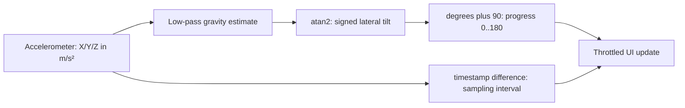

[מפת המעבדות]({{ '/android/topics/' | relative_url }}) · [מפגש Sensors]({{ '/android/zeev/meetings#id-meeting-2-sensors' | relative_url }})

{: .box-success}
בסוף המעבדה פס אופקי ומספר מעלות מגיבים להטיית המכשיר. המסך מציג גם את שלושת רכיבי האומדן המסונן ביחידות `m/s²` ואת הזמן שנמדד בין דגימות. כשעוברים לאפליקציה אחרת ההאזנה נפסקת, וכשחוזרים היא נרשמת מחדש.

בסיס ההשוואה בפרויקט **topics** הוא `master`; ענף התוצאה הוא **`codex/sensors-tilt`**. אין צורך בהרשאת מיקום כדי לקרוא את מד התאוצה בתרחיש זה. על מכשיר ללא Accelerometer מוצגת הודעה במקום ניסיון להירשם לחיישן שאינו קיים.

## מה החיישן מודד?

| רכיב | כיוון במערכת הצירים של המכשיר | יחידה | מה רואים כשהטלפון נח? |
|---:|---:|:---:|---:|
| `values[0]` | X, לרוחב המסך | `m/s²` | תלוי בהטיה לצדדים |
| `values[1]` | Y, לאורך המסך | `m/s²` | תלוי בהטיה קדימה/אחורה |
| `values[2]` | Z, ניצב למסך | `m/s²` | בערך ‎`±9.81` כשהמסך אופקי |

לפי [תיעוד חיישני התנועה](https://developer.android.com/develop/sensors-and-location/sensors/sensors_motion), מד התאוצה כולל את השפעת הכבידה ואת תאוצת התנועה. לכן קריאה בודדת אינה בהכרח זווית יציבה. `TYPE_LINEAR_ACCELERATION` מנסה להסיר כבידה ומתאים לשאלה אחרת; `TYPE_GYROSCOPE` מחזיר קצב סיבוב ב־rad/s, לא זווית מוחלטת.

## מן המדידה אל התצוגה: ארבע החלטות

מד התאוצה נותן רכיבים במערכת הצירים של המכשיר; הקוד בוחר מה לחשב מהם, איך לסנן, ומתי לצייר. X/Y/Z אינם "ימין/מעלה" לפי כל סיבוב של ה־Activity: מערכת הצירים של החיישן נשענת על הכיוון הטבעי של המכשיר. במוצר שתומך בהטיה יחסית למסך צריך למפות גם את סיבוב התצוגה. כאן נבדוק את ההטיה במערכת הצירים שמוצגת בתרגיל.



במסנן `0.8*old + 0.2*new`, סכום המשקלים הוא 1. אם המדידה החדשה קבועה, האומדן מתקרב אליה במקום לצמוח ללא גבול. באירוע הראשון נעתיק את המדידה כדי לא להתחיל מאומדן אפס שמושך את הקריאה באופן מלאכותי. המשקל קובע פשרה בין חלקות לתגובה; בגלל קצב דגימה שאינו מובטח, הוא גם אינו קבוע זמן פיזיקלי מדויק בכל מכשיר.

`Math.hypot(y,z)` נותנת גודל משולב לא שלילי; `atan2(x,...)` משמרת את סימן ההטיה בציר X. כשהטלפון מונח עם Z חיובי ו־X אפס, הזווית אפס והפס 90. כשה־X חיובי והאחרים קרובים לאפס, הזווית מתקרבת ל־90° והפס ל־180. תנועה מהירה מוסיפה תאוצה שאינה כבידה, ולכן זו הערכת הטיה של מכשיר רגוע ולא מדידה מוחלטת בכל תנועה.

קצב **דגימה** וקצב **ציור** נפרדים: אפשר לעבד כל אירוע למסנן אבל לצייר טקסט רק אחת ל־100ms. `event.timestamp` נותנת זמן מונוטוני של הדגימה בננו־שניות, לא שעה בלוח השנה. רישום והסרה במחזור החיים חוסכים דגימות כשהמסך אינו משתמש בהן; אין להירשם שוב מתוך callback וליצור האזנה כפולה.

## עצרו ונבאו

באומדן ציר X היה 10 והמדידה החדשה היא 0. מה יהיה האומדן הבא עם המסנן שבקוד? כתבו תחזית לפני פתיחת ההסבר, ואז הצביעו על המשתנה או התנאי בקוד שמצדיקים אותה.

<details markdown="1">
<summary>בדיקת ההבנה</summary>

8: החישוב הוא 0.8×10 + 0.2×0. זה מסביר גם את ההחלקה וגם את ההשהיה בתגובה. שינוי קצב הצגת הטקסט אינו משנה את העובדה שכל אירוע שנקלט עובר דרך המסנן.

</details>

## 1. מסך שמראה מדידה ותוצר

ב־**app > res > layout > activity_main.xml** השאירו את `ConstraintLayout id=main` ואת טיפול ה־window insets, והחליפו את `Hello World!` ב־`LinearLayout` אנכי המוצמד ל־`top/start/end`. צרו `TextView` שמסביר את המשימה, `ProgressBar` אופקי `id=tilt` עם `max=180` ו־`progress=90`, ו־`TextView id=reading` לקריאה המספרית. לכל ילד רוחב `match_parent`, גובה `wrap_content`; למכל `padding=24dp`. ב־**app > res > values > strings.xml** הוסיפו `sensor_intro`,‏ `waiting_sensor`,‏ `no_sensor` ו־`sensor_reading` מן הקוד המשלים שבהמשך. ב־`sensor_reading` הציגו X/Y/Z, מעלות ו־ms כדי שאפשר יהיה לבחון את ההתנהגות ולא רק להסתכל על הפס.

## 2. נרשמים רק כשהמסך פעיל

`MainActivity` מממשת `SensorEventListener`. ב־`onCreate` קבלו `SensorManager` ואת חיישן ברירת המחדל, וטפלו ב־`null`:

```java
sensors = getSystemService(SensorManager.class);
accelerometer = sensors.getDefaultSensor(Sensor.TYPE_ACCELEROMETER);
if (accelerometer == null) binding.reading.setText(R.string.no_sensor);
```

שמרו שדות `float[] gravity = new float[3]`,‏ `boolean initialized`,‏ `previousEventNs` ו־`previousDisplayNs`. השדה `gravity` הוא אומדן מסונן של רכיב הכבידה, לא נתוני חיישן חדשים. הרשמה ב־`onResume` והסרה ב־`onPause`:

```java
/**
 * Resets filter timing and registers one listener while this screen is active.
 * The first event initializes the gravity estimate rather than blending with zero.
 */
@Override
protected void onResume() {
    super.onResume();
    initialized = false;
    previousEventNs = 0;
    previousDisplayNs = 0;
    if (accelerometer != null && !sensors.registerListener(this, accelerometer,
            SensorManager.SENSOR_DELAY_UI)) binding.reading.setText(R.string.no_sensor);
}

/**
 * Unregisters the sensor listener before the screen becomes inactive.
 */
@Override
protected void onPause() {
    sensors.unregisterListener(this);
    super.onPause();
}
```

`SENSOR_DELAY_UI` מבקש קצב שמתאים למסך, אך זהו **רמז** למערכת ולא שעון מובטח. [מדריך החיישנים](https://developer.android.com/develop/sensors-and-location/sensors/sensors_overview) ממליץ על הקצב האיטי ביותר שמספיק למוצר ועל הסרת ההאזנה כשהמסך מושהה כדי לחסוך סוללה. אל תרשמו listener חדש בכל `onSensorChanged`.

## 3. מרככים רעש ומחשבים הטיה

ב־`onSensorChanged`, ודאו שהאירוע שייך ל־Accelerometer. באירוע הראשון העתיקו את שלושת הערכים ל־`gravity`. בהמשך, לכל ציר:

```java
// Blend a new sample into the estimate; the weights sum to one.
gravity[axis] = 0.8f * gravity[axis] + 0.2f * event.values[axis];
```

זהו מסנן low-pass פשוט: ‎80% מן האומדן הקודם ו־20% מהמדידה החדשה. נסו ‎`0.95/0.05` ו־`0.5/0.5`: הראשון חלק יותר אבל מגיב לאט, השני מגיב מהר יותר לרעש. כשהמכשיר מיטלטל בחוזקה גם האומדן הזה אינו מפריד כבידה באופן מושלם. מוצר משחק או מדידה מדויקת עשוי להזדקק ל־rotation vector או לעיבוד מתקדם.

`event.timestamp` הוא בננו־שניות. הפרש בין שני אירועים חלקי `1_000_000` נותן ms. בענף התוצאה מעדכנים את הטקסט/פס לכל היותר פעם ב־100ms כדי לא לצייר מחדש על כל דגימה. את הזווית מחשבים כך:

```java
double angle = Math.toDegrees(Math.atan2(gravity[0],
        Math.hypot(gravity[1], gravity[2])));
binding.tilt.setProgress((int) Math.round(angle + 90));
```

`atan2` מתרגמת יחס רכיבים לזווית בין ‎`-90°` ל־`90°`; הוספת 90 ממפה אותה לטווח הפס `0..180`. `Math.hypot` משלב את שני הצירים האחרים בלי לאבד את סימן X. זהו **מד הטיה לצדדים**, לא מצפן ולא זווית יחסית לצפון. `onAccuracyChanged` נשארת ריקה בתרחיש זה; במכשיר הדורש כיול היה צורך לטפל גם באיכות.


## הקוד המשלים במלואו

הקטעים הגלויים בשיעור ממקדים את הרעיון; הקבצים הבאים משלימים את כל הקוד הדרוש, עם תיעוד והערות. קראו את השינוי יחד עם ההסבר שמעליו. הם חלק מן השיעור ואינם דורשים פתיחת ענף דוגמה או אתר שפורסם.

### MainActivity.java

[פתיחת המקור ישירות]({{ '/android/topics/code/21/MainActivity.java.md' | relative_url }}) — בקובץ Markdown המקורי, הקוד נמצא ב־`code/21/MainActivity.java.md` ביחס לשיעור.

<details markdown="1">
<summary>הקוד המלא והשינויים עבור MainActivity.java</summary>



</details>

### activity_main.xml

[פתיחת המקור ישירות]({{ '/android/topics/code/21/activity_main.xml.md' | relative_url }}) — בקובץ Markdown המקורי, הקוד נמצא ב־`code/21/activity_main.xml.md` ביחס לשיעור.

<details markdown="1">
<summary>הקוד המלא והשינויים עבור activity_main.xml</summary>



</details>

### strings.xml

[פתיחת המקור ישירות]({{ '/android/topics/code/21/strings.xml.md' | relative_url }}) — בקובץ Markdown המקורי, הקוד נמצא ב־`code/21/strings.xml.md` ביחס לשיעור.

<details markdown="1">
<summary>הקוד המלא והשינויים עבור strings.xml</summary>



</details>

## בדיקה נצפית

1. הריצו באמולטור. דרך **Extended Controls > Virtual sensors** או `adb emu sensor set acceleration 9.81:0:0` קבעו X חיובי. בבדיקת המעבדה התקבלו `X=9.81` והטיה `90°` עם מרווח דגימה כ־`66ms`.
2. קבעו `adb emu sensor set acceleration 0:0:9.81`. התקבלו `Z=9.81` והטיה `0°`. הפס חוזר למרכז אחרי שהמסנן מתייצב.
3. עברו לאפליקציה אחרת וחזרו: listener נרשמת מחדש בלי כפילות. בדקו במכשיר אמיתי גם רעש קל, תנועה מהירה וסיבוב המסך.
4. הסבירו מדוע לא מספיק לקרוא `values[0]` בלבד כדי לקבל מעלות, ומדוע קצב דגימה גבוה יותר אינו תמיד תוצאה טובה יותר.
