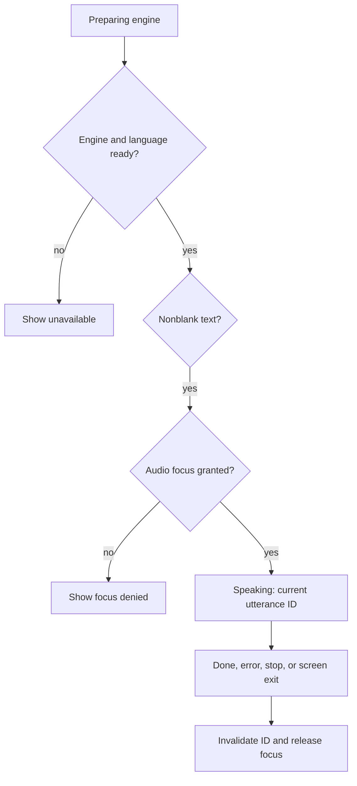

[מפת המעבדות]({{ '/android/topics/' | relative_url }})

{: .box-success}
בסוף המעבדה המשתמש עורך משפט, משמיע אותו דרך מנוע Text-to-Speech או מכתיב משפט דרך אפליקציית זיהוי דיבור. השמעה מבקשת audio focus ומשחררת אותו בסיום או ביציאה מן המסך. ביטול ההכתבה משאיר את הטקסט הקודם, והיעדר מנוע/אפליקציית זיהוי מוצג כמצב מפורש.

בסיס ההשוואה בפרויקט **topics** הוא `master`, וענף התוצאה הוא **`codex/media-speech`**. בחרנו במסלול *דיבור כשירות של אפליקציה אחרת*; אין כאן הקלטת קובץ קול בתוך האפליקציה. זה מאפשר להשוות מי אחראי למיקרופון ולפרטיות.

## גבול האחריות

| פעולה | רכיב | הרשאה באפליקציה שלנו | משאב שחייבים לשחרר |
|---:|:---|:---:|---:|
| אמירת טקסט | `TextToSpeech` | אין | מנוע TTS ו־audio focus |
| הכתבה | `RecognizerIntent` לאפליקציה חיצונית | אין `RECORD_AUDIO` כאן | אפליקציית הזיהוי מנהלת את המיקרופון שלה |
| הקלטת קובץ באפליקציה עצמה — הרחבה | `MediaRecorder` | `RECORD_AUDIO` בזמן ריצה | `MediaRecorder`, קובץ וזרימת כשל |

היעדר הרשאת מיקרופון *באפליקציה הזו* אינו אומר שאין שימוש במיקרופון: בלחיצה על **Dictate** המשתמש עובר לאפליקציית זיהוי שעשויה לבקש הרשאה משלה. [RecognizerIntent](https://developer.android.com/reference/android/speech/RecognizerIntent) מזהיר שזיהוי עשוי להזרים קול לשרת מרוחק; אין להבטיח זיהוי מקומי או פרטיות אופליין בלי לבדוק את המנוע המסוים. אם המוצר שומר קובץ קול, גבול האחריות עובר לאפליקציה שלנו ומחייב הרשאה, הסבר ושמירה/מחיקה מתאימים. [מדריך MediaRecorder](https://developer.android.com/media/platform/mediarecorder) הוא מסלול המשך להקלטה עצמית.

## מנוע קיים, מנוע מוכן וזכות להשמיע

אפשר ליצור אובייקט `TextToSpeech` לפני שהמנוע מוכן. לכן `speaker != null` ו־`speakerReady` אינם אותה בדיקה. גם מנוע מוכן עם טקסט תקין אינו מספיק: נבקש audio focus ונבדוק שהתקבל. אלה שערים נפרדים, וכל אחד יכול להוביל למשוב אחר למשתמש.



audio focus מתאם שימוש בשמע בין אפליקציות; הוא אינו הרשאת מיקרופון. כשמגיע אובדן focus מפסיקים דיבור בהתאם למדיניות הזאת. כשנגמר משפט, משחררים את אותה בקשת focus שקיבלנו. כשה־Activity נהרסת משחררים גם את מנוע TTS, שהוא משאב נפרד. `stop` מפסיקה משפט; `shutdown` מסיימת שימוש במנוע.

`UtteranceProgressListener` יכולה להודיע משרשור מנוע. נמסור את השינוי ל־UI thread לפני שניגע ב־status או במצב שהמסך מחזיק. גם כאן callback מאוחר של משפט קודם אינו צריך לעצור או לשחרר השמעה חדשה; כבר במעבדה נקצה לכל משפט זהות `activeUtterance` ונבדוק אותה אחרי המעבר ל־main. `QUEUE_FLUSH` מחליפה משפט קודם, אך הודעת הסיום שלו עדיין יכולה להגיע. לכן `stopSpeaking` מאפסת את הזהות לפני עצירה, ו־`onDone`/`onError` מקבלות רק את הזהות הפעילה. הזהות שומרת על שייכות התוצאה. עדיין אין להסיק מתוצאת `speak` שהמשפט כבר נשמע עד סופו.

בהכתבה המשתמש מוסר קול לאפליקציית זיהוי אחרת, והיא מחזירה רשימת מועמדים. בחירת המועמד הראשון היא החלטת UI: מציגים אותו לעריכה, לא מבצעים ממנו פעולה רגישה אוטומטית. ביטול משאיר את הטקסט הקודם; רשימה ריקה היא גם מקרה שיש לבדוק. פיצול האחריות מסביר למה אין `RECORD_AUDIO` במעבדה, אך עדיין צריך להסביר למשתמש מה עושה אפליקציית הזיהוי ומה תלוי במנוע שלה.

## עצרו ונבאו

משפט A הוחלף ב־B, ואז onDone של A הגיעה. האם צריך לשחרר את focus של B? כתבו תחזית לפני פתיחת ההסבר, ואז הצביעו על המשתנה או התנאי בקוד שמצדיקים אותה.

<details markdown="1">
<summary>בדיקת ההבנה</summary>

לא. אחרי ההעברה ל־main משווים את utteranceId ל־activeUtterance. הזהות של A כבר אינה הפעילה ולכן מתעלמים מההודעה. עדכון על main פותר גישה ל־Views; בדיקת זהות פותרת שייכות לתהליך הנכון.

</details>

## 1. מסך שאפשר לבדוק בלי לדבר

ב־**app > res > layout > activity_main.xml** השאירו את `ConstraintLayout id=main` ואת טיפול ה־window insets. במקום `Hello World!` הציבו `LinearLayout` אנכי constrained ל־`top/start/end`, עם `padding=24dp`. בתוכו: כותרת הסבר, `EditText id=words` עם `inputType="textCapSentences|textMultiLine"` ודוגמת טקסט, כפתורי `speak`,‏ `stop`,‏ `listen`, ו־`TextView id=status` עם `accessibilityLiveRegion="polite"`. לכל רכיב רוחב `match_parent` וגובה `wrap_content`. ב־**app > res > values > strings.xml** הוסיפו את טקסטי המצב מן הקוד המשלים בהמשך: loading, ready, unavailable, speaking, stopped, focus lost/denied, cancelled, empty, received ו־no recognizer. מצבי כשל מפורשים מאפשרים בדיקה גם ללא שמע.

לפני יצירת המנוע, ב־**app > manifests > AndroidManifest.xml** הוסיפו בתוך `<manifest>` ולפני `<application>` את הצהרת גילוי השירות הבאה. במכשירים עם Android 11 ומעלה היא מאפשרת לאפליקציה שמכוונת לגרסה מודרנית לגלות שירותי TTS:

```xml
<queries>
    <intent>
        <action android:name="android.intent.action.TTS_SERVICE" />
    </intent>
</queries>
```

זו הצהרת package visibility לפי [תיעוד TextToSpeech](https://developer.android.com/reference/android/speech/tts/TextToSpeech), ואינה בקשת הרשאה מהמשתמש.

## 2. מכינים מנוע ומיקוד שמע

ב־`MainActivity.java` הוסיפו שדות `TextToSpeech speaker`,‏ `boolean speakerReady`,‏ `AudioManager audio`,‏ `AudioFocusRequest focus` ו־`boolean hasFocus`,‏ `String activeUtterance` ו־`int utteranceGeneration`. ב־`onCreate` הכינו `AudioAttributes` עם `USAGE_MEDIA` ו־`CONTENT_TYPE_SPEECH`, ואז:

```java
focus = new AudioFocusRequest.Builder(AudioManager.AUDIOFOCUS_GAIN_TRANSIENT)
        .setAudioAttributes(attributes)
        .setWillPauseWhenDucked(true)
        .setOnAudioFocusChangeListener(change -> {
            if (change < 0) runOnUiThread(() -> {
                if (!hasFocus || isDestroyed()) return;
                activeUtterance = null;
                if (speaker != null) speaker.stop();
                releaseFocus();
                binding.status.setText(R.string.focus_lost);
            });
        }).build();
```

`GAIN_TRANSIENT` מתאים למשפט קצר. בהשמעת דיבור בוחרים להפסיק אם אפליקציה אחרת צריכה את הערוץ, במקום להנמיך דיבור שאולי אי אפשר להבין. לפני `speaker.speak(...)` קוראים `audio.requestAudioFocus(focus)` **ובודקים** שהתקבל `AUDIOFOCUS_REQUEST_GRANTED`; אם לא, לא משמיעים. לאחר סיום קוראים `audio.abandonAudioFocusRequest(focus)` עם *אותו* אובייקט. [מדריך audio focus](https://developer.android.com/media/optimize/audio-focus) מסביר את המעברים והגבלות הגרסאות.

יצירת `TextToSpeech` היא אסינכרונית. ה־callback בודק `SUCCESS` ו־`setLanguage(Locale.getDefault())`, ורק אז הופך את `speakerReady` ל־`true`. אם המנוע או השפה אינם זמינים, הכפתור לא מנסה להשמיע. התקינו `UtteranceProgressListener`: `onDone`/`onError` מגיעים משרשור המנוע, לכן מעבירים את `finishSpeaking()` ל־UI thread. ב־`onDestroy` קוראים `speaker.shutdown()` לפי [תיעוד TextToSpeech](https://developer.android.com/reference/android/speech/tts/TextToSpeech).

## 3. הפעלת השמעה, עצירה ויציאה

בלחיצה על **Speak**, קראו את `binding.words.getText().toString().trim()`. טקסט ריק או מנוע לא מוכן אינם ממשיכים. אחרי קבלת audio focus:

```java
hasFocus = true;
activeUtterance = "lesson-" + (++utteranceGeneration);
int result = speaker.speak(words, TextToSpeech.QUEUE_FLUSH, null, activeUtterance);
if (result != TextToSpeech.SUCCESS) finishSpeaking();
else binding.status.setText(R.string.speaking);
```

`QUEUE_FLUSH` מחליף משפט שכבר התחיל במקום לצבור תור. `finishSpeaking()` משחררת focus רק אם `hasFocus` אמיתי. `stopSpeaking()` מאפסת את זהות המשפט, קוראת `speaker.stop()`, משחררת focus ומציגה את מצב העצירה גם אם לא התחיל משפט. קשרו אותה לכפתור **Stop**, וקראו לה גם ב־`onStop`: יציאה מהמסך מפסיקה השמעה של Activity זו. אם בעתיד רוצים השמעה ברקע, נדרש רכיב אחר עם מדיניות foreground מפורשת; אין להשאיר את ה־Activity מחזיקה אודיו אחרי יציאה.

## 4. הכתבה דרך אפליקציה תומכת

הגדירו `ActivityResultLauncher<Intent>` עם `StartActivityForResult`. ב־callback, בדקו `RESULT_OK`,‏ `data != null`, ורשימת `RecognizerIntent.EXTRA_RESULTS` שאינה ריקה לפני הכנסת `words.get(0)` ל־EditText. ביטול אינו מוחק את המשפט הקיים. בלחיצה על **Listen** עצרו TTS, ובנו Intent:

```java
Intent intent = new Intent(RecognizerIntent.ACTION_RECOGNIZE_SPEECH)
        .putExtra(RecognizerIntent.EXTRA_LANGUAGE_MODEL,
                RecognizerIntent.LANGUAGE_MODEL_FREE_FORM)
        .putExtra(RecognizerIntent.EXTRA_LANGUAGE, Locale.getDefault().toLanguageTag());
try {
    recognize.launch(intent);
} catch (ActivityNotFoundException noRecognizer) {
    binding.status.setText(R.string.recognizer_unavailable);
}
```

תמלול הוא **הצעה לעריכה**, לא קלט אמין לביצוע פקודה רגישה. המשתמש רואה ומתקן את התוצאה לפני שימוש. השפה המבוקשת היא העדפה; זמינות וחיבור רשת תלויים באפליקציית הזיהוי.


## הקוד המשלים במלואו

הקטעים הגלויים בשיעור ממקדים את הרעיון; הקבצים הבאים משלימים את כל הקוד הדרוש, עם תיעוד והערות. קראו את השינוי יחד עם ההסבר שמעליו. הם חלק מן השיעור ואינם דורשים פתיחת ענף דוגמה או אתר שפורסם.

### MainActivity.java

[פתיחת המקור ישירות]({{ '/android/topics/code/22/MainActivity.java.md' | relative_url }}) — בקובץ Markdown המקורי, הקוד נמצא ב־`code/22/MainActivity.java.md` ביחס לשיעור.

<details markdown="1">
<summary>הקוד המלא והשינויים עבור MainActivity.java</summary>



</details>

### activity_main.xml

[פתיחת המקור ישירות]({{ '/android/topics/code/22/activity_main.xml.md' | relative_url }}) — בקובץ Markdown המקורי, הקוד נמצא ב־`code/22/activity_main.xml.md` ביחס לשיעור.

<details markdown="1">
<summary>הקוד המלא והשינויים עבור activity_main.xml</summary>



</details>

### strings.xml

[פתיחת המקור ישירות]({{ '/android/topics/code/22/strings.xml.md' | relative_url }}) — בקובץ Markdown המקורי, הקוד נמצא ב־`code/22/strings.xml.md` ביחס לשיעור.

<details markdown="1">
<summary>הקוד המלא והשינויים עבור strings.xml</summary>



</details>

## בדיקה ושאלת העברה

1. באמולטור המעבדה מנוע TTS עבר מ־**Preparing** ל־**Ready**. לחיצה על **Speak** הסתיימה ב־**Playback stopped; audio focus released**. לחצו על **Stop** בזמן משפט ארוך יותר ובדקו שהקול נפסק.
2. לחיצה על **Dictate** פתחה את אפליקציית הזיהוי של המכשיר עם “Try saying something”. לחיצה על Back החזירה **Dictation cancelled; text unchanged**. בדקו זיהוי אמיתי במכשיר עם מיקרופון ורשת לפי תנאי המנוע; תיעוד הקוד כאן אינו הוכחה לתמלול מוצלח.
3. עברו לאפליקציה אחרת בזמן השמעה: `onStop` מפסיק ומשחרר focus. בדקו גם מכשיר ללא מנוע TTS או ללא recognizer.
4. תכננו הרחבת *הודעת קול שמורה*: מתי תבקשו `RECORD_AUDIO`, היכן תשמרו קובץ, כיצד תמחקו אותו, ומה תעשו אם המשתמש מסרב? הסבירו למה הפעולות האלה אינן נחוצות למסלול ההכתבה החיצונית.
