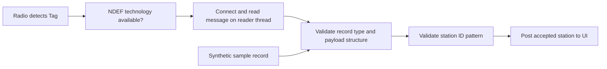

[מפת המעבדות]({{ '/android/topics/' | relative_url }})

{: .box-success}
בסוף המעבדה תלמיד נוגע עם טלפון בתג NDEF שנושא מזהה תחנה כמו `LAB-ROOM-3`. האפליקציה מציגה רק מזהה תקין, מדווחת על תג שאינו NDEF או על קריאה שנקטעה, ומפסיקה Reader Mode כשעוזבים את המסך. כפתור **Try a sample record** מפעיל בדיוק את פענוח ה־NDEF גם באמולטור שאין בו רדיו NFC.

בסיס ההשוואה בפרויקט **topics** הוא `master`; ענף התוצאה הוא **`codex/nfc-classroom-tag`**. זהו מסלול התמחות אחד מתוך Bluetooth/NFC, עם תרחיש שימוש מפורש. כדי להוכיח את הרדיו עצמו דרושים טלפון NFC ותג NDEF פיזי; הבנייה והפענוח הסינתטי אינם ראיה לקריאת תג אמיתי.

## מודל התקשורת

| שלב | הצלחה | כשל שצריך להציג |
|---:|---:|---:|
| יכולת מכשיר | `NfcAdapter` קיים ופעיל | אין שבב / NFC כבוי |
| זיהוי תג | `ReaderCallback` מחזירה `Tag` | אין תג בשדה |
| פתיחת NDEF | `Ndef.get(tag)` אינו `null` | תג בטכנולוגיה שאינה NDEF |
| קריאה | `connect()` ו־`getNdefMessage()` | תג התרחק, I/O, מבנה פגום |
| הבנת תוכן | רשומת Text עם `LAB-...` | URI, טקסט לא צפוי או כמה רשומות |

תג NFC הוא **קלט לא מהימן**. האפליקציה לא פותחת URI ולא מריצה פעולה על סמך טקסט שרירותי. אם מזהה התחנה ישמש בעתיד לקבלת ציוד או נוכחות, שרת עדיין חייב לאמת משתמש והרשאה; קריאת תג לבדה אינה אימות זהות.

## זיהוי תג אינו הבנת התוכן שלו

Reader Mode מוסרת `Tag`, שמתאר טכנולוגיות תקשורת זמינות. `Ndef.get(tag)` שואלת אם אפשר לעבוד עם הודעת NDEF; `getNdefMessage` קוראת אותה; `StationRecord.read` מחליטה אם התוכן הוא מזהה תחנה שהאפליקציה מקבלת. הצלחה בשלב אחד אינה מבטיחה את הבא.



החץ של הדוגמה הסינתטית מתחיל **אחרי הרדיו**. הוא מאפשר לבדוק את אותו parser בלי חומרה, אבל אינו בודק antenna, טווח או תג שהתרחק בזמן קריאה. לכן בדיקות parser וקריאת תג אמיתי הן שתי ראיות משלימות. `finally` סוגרת את החיבור גם כשקריאה נכשלה; הצלחת connect אינה מבטיחה שהתג נשאר בשדה עד סיום הקריאה.

ברשומת Text הבית הראשון כולל דגל קידוד ואורך קוד שפה. צריך לבדוק שה־payload ארוך מספיק לפני שחותכים ממנו את הטקסט; אחרת קלט פגום עלול להפוך לחריגת אינדקס. רק אחרי בדיקות TNF, סוג וקידוד נבדוק תבנית `LAB-...`. URI אינה Text, גם אם הטקסט המודפס שלה נראה כמו מזהה תחנה.

רשומה שמכילה מזהה תחנה תקין עדיין אינה אישור נוכחות או זכות לפתוח דלת. אפשר להעתיק את תוכנה לתג אחר. מזהה אומר "מה כתוב כאן"; אימות משתמש והרשאה אומרים "מי רשאי לפעול ומה מותר לו". אם הופכים את המעבדה למוצר, מחזור חיי הקורא, תוצאת parser והרשאות השרת צריכים להישאר גבולות נפרדים.

## עצרו ונבאו

כפתור הדוגמה מציג LAB-ROOM-3 באמולטור. מה בדיוק הוכחנו, ומה עדיין לא? כתבו תחזית לפני פתיחת ההסבר, ואז הצביעו על המשתנה או התנאי בקוד שמצדיקים אותה.

<details markdown="1">
<summary>בדיקת ההבנה</summary>

הוכחנו שהודעת NDEF Text הסינתטית עוברת דרך אותו parser וה־UI מציגה את המזהה המאושר. לא בדקנו קורא NFC, טווח, תג שהתרחק או תקשורת רדיו. מזהה שאושר מבחינת מבנה גם אינו אימות זהות של אדם.

</details>

## 1. מתקינים גם על מכשיר ללא NFC

ב־**app > manifests > AndroidManifest.xml**, לפני `<application>`, הוסיפו:

```xml
<uses-permission android:name="android.permission.NFC" />
<uses-feature android:name="android.hardware.nfc" android:required="false" />
```

`NFC` היא הרשאת Manifest, לא חלון runtime כמו מיקום. `required="false"` מאפשר להתקין את המעבדה גם על אמולטור ולתרגל פענוח; בזמן ריצה חובה לבדוק אם באמת יש קורא.

ב־**app > res > layout > activity_main.xml** השאירו את `ConstraintLayout id=main` וה־window insets. החליפו `Hello World!` ב־`LinearLayout` אנכי constrained ל־`top/start/end`, עם הסבר, כפתור `id=sample` ו־`TextView id=status` עם live region. ב־**app > res > values > strings.xml** הוסיפו הודעות עבור no reader, NFC off, ready, not NDEF, read failed, unexpected content ו־station. הקוד המשלים בהמשך מציג את כל ה־strings ושינויי ה־XML.

## 2. Reader Mode שייך למסך הפעיל

ב־`MainActivity`, ב־`onCreate`, קבלו `NfcAdapter.getDefaultAdapter(this)`. ב־`onResume`, אם הוא חסר או כבוי הציגו מצב; אחרת הפעילו Reader Mode לארבע משפחות תג נפוצות:

```java
int session = readerGeneration;
nfc.enableReaderMode(this, tag -> readTag(tag, session),
        NfcAdapter.FLAG_READER_NFC_A | NfcAdapter.FLAG_READER_NFC_B
                | NfcAdapter.FLAG_READER_NFC_F | NfcAdapter.FLAG_READER_NFC_V,
        null);
readerEnabled = true;
```

ב־`onPause`, אם `readerEnabled`, קראו `nfc.disableReaderMode(this)` ואפסו את הדגל. כך אין קריאה כשהמסך איננו פעיל. אין להשתמש ב־`FLAG_READER_SKIP_NDEF_CHECK` כאן: לפי [תיעוד NfcAdapter](https://developer.android.com/reference/android/nfc/NfcAdapter), הדגל מדלג על זיהוי NDEF ולכן `Ndef.get(tag)` עשוי לא לעבוד. Reader Mode הוא בחירה מתאימה למסך שקורא תג בזמן שהוא גלוי.

## 3. קוראים את התג בשרשור הקורא

`readTag(Tag, int expected)` מתקבלת מ־ReaderCallback. אם `Ndef.get(tag) == null`, מציגים `nfc_not_ndef`. בכניסה דוחים session ישן עם `if (expected != readerGeneration) return`. הדור `expected` נלכד בעת רישום Reader Mode, ולכן גם callback שמתחילה מאוחר עדיין שייכת למפגש המקורי. אחר כך:

```java
try {
    ndef.connect();
    NdefMessage message = ndef.getNdefMessage();
    // Radio I/O stays on the reader thread; Views are updated only on main.
    runOnUiThread(() -> {
        if (expected == readerGeneration && !isDestroyed()) showMessage(message);
    });
} catch (IOException | FormatException | SecurityException error) {
    runOnUiThread(() -> {
        if (expected == readerGeneration && !isDestroyed())
            binding.status.setText(R.string.nfc_read_failed);
    });
} finally {
    try { ndef.close(); } catch (IOException ignored) { }
}
```

`getNdefMessage()` מבצעת I/O רדיו **חוסם**, ולכן אינה נקראת מן ה־UI thread. [תיעוד Ndef](https://developer.android.com/reference/android/nfc/tech/Ndef) מציין שגם `null` אפשרי; תג שיוצא מן השדה יכול לגרום ל־`TagLostException` (תת־סוג של `IOException`). `close()` חייב להתבצע גם אחרי כשל. עדכון Views נעשה ב־`runOnUiThread`.

ביטול Reader Mode מונע קריאות חדשות, אך קריאה שכבר התחילה עשויה עדיין לסיים. לכן `readerGeneration` מתקדמת בתחילת session וב־`onPause`; ה־lambda של Reader Mode לוכדת את הדור ברישום ומעבירה אותו ל־`readTag`. כל הודעה שמועברת ל־main בודקת שזה עדיין אותו session. כאן השדה הוא `volatile`, כי שרשור הרדיו קורא אותו וה־main משנה אותו. הבדיקה מונעת תוצאה מאוחרת לעדכן מסך שכבר עזבנו; `finally` עדיין סוגרת את החיבור.

## 4. מאשרים רק פורמט של תחנת כיתה

צרו קובץ חדש `StationRecord.java` ב־**app > kotlin+java > com.example.topics**. השיטה `read(NdefMessage)` בקוד המשלים דורשת רשומה אחת בלבד, `TNF_WELL_KNOWN` וסוג `RTD_TEXT`, בודקת שה־payload הוא UTF-8, מדלגת על קוד השפה על פי בית הסטטוס, ואז מאשרת רק תבנית `LAB-[A-Z0-9-]{1,24}`. בשאר המצבים היא מחזירה `null`. כך URI על תג או טקסט כמו `OPEN-DOOR` אינו הופך לפקודה.

לפי [NdefRecord](https://developer.android.com/reference/android/nfc/NdefRecord), רשומת Text שונה מרשומת URI, ו־`createTextRecord("en", "LAB-ROOM-3")` יוצרת הודעת דוגמה. כפתור `sample` בונה `NdefMessage` עם אותה רשומה וקורא `showMessage` כמו מסלול הרדיו; הוא בודק את הפענוח וה־UI, לא את האנטנה.


## הקוד המשלים במלואו

הקטעים הגלויים בשיעור ממקדים את הרעיון; הקבצים הבאים משלימים את כל הקוד הדרוש, עם תיעוד והערות. קראו את השינוי יחד עם ההסבר שמעליו. הם חלק מן השיעור ואינם דורשים פתיחת ענף דוגמה או אתר שפורסם.

### MainActivity.java

[פתיחת המקור ישירות]({{ '/android/topics/code/23/MainActivity.java.md' | relative_url }}) — בקובץ Markdown המקורי, הקוד נמצא ב־`code/23/MainActivity.java.md` ביחס לשיעור.

<details markdown="1">
<summary>הקוד המלא והשינויים עבור MainActivity.java</summary>



</details>

### StationRecord.java

[פתיחת המקור ישירות]({{ '/android/topics/code/23/StationRecord.java.md' | relative_url }}) — בקובץ Markdown המקורי, הקוד נמצא ב־`code/23/StationRecord.java.md` ביחס לשיעור.

<details markdown="1">
<summary>הקוד המלא והשינויים עבור StationRecord.java</summary>



</details>

### StationRecordTest.java

[פתיחת המקור ישירות]({{ '/android/topics/code/23/StationRecordTest.java.md' | relative_url }}) — בקובץ Markdown המקורי, הקוד נמצא ב־`code/23/StationRecordTest.java.md` ביחס לשיעור.

<details markdown="1">
<summary>הקוד המלא והשינויים עבור StationRecordTest.java</summary>



</details>

### activity_main.xml

[פתיחת המקור ישירות]({{ '/android/topics/code/23/activity_main.xml.md' | relative_url }}) — בקובץ Markdown המקורי, הקוד נמצא ב־`code/23/activity_main.xml.md` ביחס לשיעור.

<details markdown="1">
<summary>הקוד המלא והשינויים עבור activity_main.xml</summary>



</details>

### strings.xml

[פתיחת המקור ישירות]({{ '/android/topics/code/23/strings.xml.md' | relative_url }}) — בקובץ Markdown המקורי, הקוד נמצא ב־`code/23/strings.xml.md` ביחס לשיעור.

<details markdown="1">
<summary>הקוד המלא והשינויים עבור strings.xml</summary>



</details>

## בדיקות וגבול הראיה

1. `:app:assembleDebug` ו־`:app:connectedDebugAndroidTest` עברו באמולטור. `StationRecordTest` מאשרת מזהה תקין ודוחה URI וטקסט שאינו לפי התבנית.
2. באמולטור התקבלה ההודעה **This device has no NFC reader**. כפתור הדוגמה הציג **Classroom station: LAB-ROOM-3**. זה מוכיח שמסך הכשל עובד ושה־parser מקבל דוגמה תקינה.
3. על טלפון עם NFC כתבו תג NDEF Text עם `LAB-ROOM-3`, פתחו את האפליקציה וקרבו את התג. בדקו גם NFC כבוי, תג לא־NDEF, הוצאה מהירה מן השדה ורשומה לא צפויה. **בדיקת חומרה זו עדיין לא בוצעה בענף הדוגמה.**
4. אם הפרויקט דורש שידור דו־כיווני או חיבור מתמשך לחיישן, NFC Text עשוי להיות כלי לא נכון; בדקו מסלול Bluetooth עם הרשאות, pairing, states ו־timeouts מתאימים. אל תוסיפו את שתי הטכנולוגיות רק בשביל רשימת נושאים.
