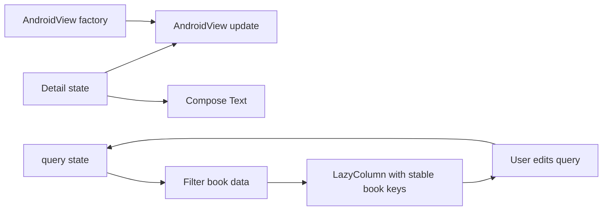

[מפת המעבדות]({{ '/android/topics/' | relative_url }}) · [השיעור הקודם: הוספת תמיכת Compose]({{ '/android/projectSteps/192supportJetPackCompose' | relative_url }})

{: .box-success}
בסוף המעבדה מסך Java/XML הקיים פותח קטלוג Compose. בקטלוג מחפשים כותרת, מסמנים Favorite מקומי, פותחים פריט במסלול ניווט, רואים `TextView` ישן בתוך Compose, וחוזרים לרשימה. בדיקת UI עוברת מסלול חיפוש־פריט־חזרה ומשחזרת את החיפוש אחרי יצירה מחדש של ה־Activity.

בסיס ההשוואה בפרויקט **topics** הוא `master`; ענף התוצאה הוא **`codex/compose-ui-system`**. זהו ענף Kotlin ייעודי בתוך סדרה שברובה Java/XML, משום ש־Compose נכתבת בפונקציות Kotlin `@Composable`. לא מחליפים את כל מסך הבסיס רק כדי ללמוד את המערכת החדשה: השינוי ב־Java הוא כפתור ו־Intent, ו־`ComposeActivity.kt` היא קובץ חדש.

## מפת אחריות של המסך

| מושג | איפה בקוד? | מה קורה למשתמש? |
|---:|:---|---:|
| State | `query` ו־`favorite` | חיפוש וסימון מעדכנים UI |
| Recomposition | קריאה חוזרת לפונקציות שתלויות ב־state | הרשימה והכוכב משתנים בלי `notifyDataSetChanged` |
| Layout/list | `Column`,‏ `Row`,‏ `LazyColumn` | ארבעה ספרים, סינון, שורות ממוחזרות |
| Navigation | `NavHost`,‏ `book/{id}` | לחיצה פותחת פריט; Back חוזר |
| Interop | Java Activity → Compose Activity;‏ `AndroidView` | מעבר מדורג בין Views ל־Compose |
| Testing | `ComposeCatalogTest` | מסלול משתמש ושחזור אחרי recreate |

## חושבים בתיאור מסך מתוך מצב

ב־Views, קוד כמו `setText` משנה רכיב שכבר קיים. ב־Compose הפונקציה מתארת מה צריך להופיע עבור המצב הנוכחי; שינוי state מאפשר לחשב תיאור חדש. recomposition אינה בקשה להפעיל מחדש כל פעולה עסקית. אין לשלוח HTTP או לשמור נתון רק משום שגוף Composable רץ שוב; פעולות כאלה צריכות בעלות ותזמון מפורשים.



`mutableStateOf` מאפשרת ל־Compose לעקוב אחר קריאות ושינויים; `remember` משמרת ערך בין recompositions של אותה נוכחות בממשק; `rememberSaveable` מוסיפה שחזור עבור טיפוסים שניתנים לשמירה. אף אחד מהם אינו מסד נתונים. גם key של ספר אינה שמירה לדיסק: היא עוזרת לשייך שורה לזהות שלה כאשר הסדר משתנה.

favorite המקומית בשורה מלמדת תגובת UI. כאשר שורה יוצאת מן ההרכב בגלל סינון, אין להסיק מן הדוגמה שהבחירה תישמר בכל תרחיש. אם צריך לשתף Favorite בין הרשימה למסך פרטים, נעלה את הבעלות אל בעל מצב משותף ונעביר ערך ו־callback למטה. כך שורה אינה מחזיקה אמת נפרדת מן הפרטים.

`AndroidView.factory` יוצרת View כשהיא נדרשת; `update` מסנכרנת אותה עם הנתון העדכני. קריאה אחת ל־setText רק ב־factory הייתה משאירה טקסט ישן בשינוי state. עץ הסמנטיקה של Compose ועץ Views אינם אותו עץ בדיקה; צריך לבחור כלי לפי הרכיב שמאמתים. בקובצי Kotlin נשתמש ב־KDoc (`/** ... */`) לפני פונקציות, המקביל לתפקיד Javadoc בקוד Java.

## עצרו ונבאו

המשתמש הקליד Android ואז הפעיל scenario.recreate. מדוע החיפוש יכול לחזור בלי לשמור את הרשימה המסוננת? כתבו תחזית לפני פתיחת ההסבר, ואז הצביעו על המשתנה או התנאי בקוד שמצדיקים אותה.

<details markdown="1">
<summary>בדיקת ההבנה</summary>

query היא ערך קטן ב־rememberSaveable. אחרי שחזור מחשבים מחדש את הרשימה מתוך books ו־query. שומרים קלט יציב ומפיקים ממנו תצוגה; אין צורך לשמור עותק נוסף של אותה תוצאה נגזרת.

</details>

## 1. בונים בשני מחסומים תקינים

ב־**Gradle Scripts > libs.versions.toml**, הוסיפו גרסת Kotlin `2.3.21`,‏ Compose BOM `2026.09.00`, ו־Navigation Compose `2.10.2` (הגרסאות בענף התוצאה). הוסיפו aliases ל־Compose compiler plugin, BOM,‏ Material3, foundation, UI, Activity Compose, Navigation Compose ולספריות בדיקה. ב־**Gradle Scripts > build.gradle.kts (Project)**, בתוך `plugins`, הוסיפו:

```kotlin
alias(libs.plugins.compose.compiler) apply false
```

הקוד המשלים בהמשך מראה את השינויים המדויקים בטבלת הגרסאות ובקובץ Gradle של המודול. ב־`app/build.gradle.kts` הפעילו את plugin זה ואת `buildFeatures.compose = true`, ואז הוסיפו רק את ספריות Compose הנצרכות; הכניסו את BOM גם ל־`androidTestImplementation`.

הריצו **`./gradlew :app:assembleDebug` כעת**, לפני יצירת קובץ Kotlin. זהו checkpoint שמפריד שגיאת Gradle/גרסה משגיאת קוד UI. בסיס הפרויקט משתמש ב־AGP 9.4 עם תמיכת Kotlin מובנית; אין להוסיף כאן `org.jetbrains.kotlin.android` ישן רק כי מדריך משנים קודמות השתמש בו. [מדריך Android ל־built-in Kotlin](https://developer.android.com/build/migrate-to-built-in-kotlin) ו־[תוסף Compose Compiler](https://developer.android.com/develop/ui/compose/setup-compose-dependencies-and-compiler) מסבירים את החלוקה. [Compose BOM](https://developer.android.com/develop/ui/compose/bom) מתאמת את גרסאות ספריות Compose, אך לא את Navigation או Activity.

## 2. מעבר קטן מתוך מסך Java

ב־**app > res > layout > activity_main.xml**, השאירו את `ConstraintLayout` ואת `TextView` של התבנית. תנו ל־TextView מזהה `hello` וטקסט `@string/compose_intro`, והוסיפו מתחתיו `Button id=open_compose` עם constraint ל־`@id/hello`. ב־**app > res > values > strings.xml** הוסיפו את שני הטקסטים. ב־`MainActivity.java` הוסיפו import ל־`Intent` ואחרי `setContentView`:

```java
binding.openCompose.setOnClickListener(
        v -> startActivity(new Intent(this, ComposeActivity.class)));
```

ב־**app > manifests > AndroidManifest.xml**, בתוך `<application>`, רשמו `<activity android:name=".ComposeActivity" android:exported="false" />`. המסך הפנימי אינו נקודת כניסה חיצונית. זהו interop ברמת Activity: View Binding ממשיכה לעבוד במסך הראשון, Compose מנהלת את השני.

## 3. State גורם למסך להתעדכן

צרו `ComposeActivity.kt` ב־**app > kotlin+java > com.example.topics**. המחלקה יורשת `ComponentActivity` וקוראת `setContent { CatalogApp() }`. בתוך מסלול `books`, חיפוש נראה כך:

```kotlin
// Save the small query value for recreation, not the entire filtered list.
var query by rememberSaveable { mutableStateOf("") }
OutlinedTextField(
    value = query,
    onValueChange = { query = it },
    label = { Text("Search titles") },
    modifier = Modifier.fillMaxWidth().testTag("search")
)
LazyColumn {
    items(books.filter { it.title.contains(query, ignoreCase = true) },
        key = { it.id }) { book ->
        // Row with title and Favorite action
    }
}
```

`onValueChange` משנה את `query`; Compose מריצה מחדש את החלקים שקוראים את הערך והרשימה המסוננת מתעדכנת. אין צורך לפנות ידנית ל־TextView. `rememberSaveable` שומרת טקסט פשוט דרך state של ה־Activity ולכן החיפוש נשאר אחרי סיבוב/יצירה מחדש. `key = { it.id }` נותן זהות יציבה לשורה גם כשהרשימה מסוננת. לכל שורה בקוד המשלים `favorite` מקומי באמצעות `rememberSaveable(book.id)` ולחצן `☆/★`. זהו state **של הדגמת UI**; הוא אינו מסד או מקור אמת בין מכשירים. [מדריך state](https://developer.android.com/develop/ui/compose/state) מסביר state hoisting כשכמה מסכים צריכים לחלוק נתון.

`safeDrawingPadding()` מרחיקה את תוכן המסך מ־system bars ו־display cutout. זו אחריות ה־insets של מסך Compose. `Column` מסדר רכיבים מלמעלה למטה, `Row` את הכותרת והכפתור זה לצד זה, ו־`Modifier.padding`/`fillMaxWidth` מתארים גודל ומרווח. `LazyColumn` מרכיבה שורות לפי הצורך, בדומה למטרת RecyclerView, אבל API העדכון שונה. השוו את [מדריך הרשימות ב־Compose](https://developer.android.com/develop/ui/compose/lists) למעבדת [RecyclerView]({{ '/android/topics/11-recyclerview-diffutil/' | relative_url }}).

## 4. ניווט עם מזהה, לא עם אובייקט שלם

`CatalogApp` משתמשת ב־`rememberNavController()` וב־`NavHost(startDestination = "books")`. לחיצה על כותרת שורה מבצעת `nav.navigate("book/${book.id}")`. ביעד `book/{id}` קוראים את `id` מ־arguments, מוצאים את הספר ברשימה ומציגים **Book not found** אם אינו קיים. כפתור **Back to books** קורא `popBackStack()`. העברת ID מאפשרת למסך הפרטים לטעון/לאמת מחדש; אל תעבירו אובייקט גדול או View עצמו כארגומנט ניווט. [מדריך Navigation Compose](https://developer.android.com/develop/ui/compose/navigation) מרחיב על routes ו־back stack.

במסך הפרטים נמצאת דוגמת interop הפוכה:

```kotlin
AndroidView(
    // Create once for this View instance; synchronize changing data in update.
    factory = { context -> TextView(context) },
    update = { view -> view.text = "Classic TextView for ID: ${book?.id ?: "?"}" },
    modifier = Modifier.padding(vertical = 16.dp)
)
```

`factory` יוצרת View, ו־`update` מסנכרנת אותה עם state כשה־Composable מתעדכנת. כך אפשר להעביר רכיב קיים בהדרגה. אין כאן סיבה מוצרית להעדיף TextView על Text; הוא מכוון להראות את הגבול בין שתי מערכות ה־UI. [מדריך Views בתוך Compose](https://developer.android.com/develop/ui/compose/migrate/interoperability-apis/views-in-compose) מפרט את הכלי.

## 5. בדיקה שמפרידה בין מסך למנגנון

ב־**app > kotlin+java > com.example.topics** תחת source set `androidTest`, צרו `ComposeCatalogTest.kt`. `createAndroidComposeRule<ComposeActivity>()` מפעילה את Activity שכבר קוראת `setContent`. הבדיקה מכניסה `Android` לשדה `testTag("search")`, פותחת `book-b2`, מאשרת את כותרת הפריט, חוזרת, מוודאת ש־`book-b1` אינו ברשימה, ומבצעת `scenario.recreate()` כדי לבדוק שהחיפוש נשמר. ב־[מדריך בדיקות Compose](https://developer.android.com/develop/ui/compose/testing) יש פעולות סמנטיות כמו `onNodeWithTag`,‏ `performTextInput` ו־`assertIsDisplayed`.

`./gradlew :app:connectedDebugAndroidTest` עבר באמולטור. בדיקת ה־UI הראשונה נכשלה כשניסתה למצוא את תוכן ה־`TextView` הישן כצומת סמנטי של Compose; תוקנה לבדוק את כותרת Compose במסך הפרטים, ואת ה־View הישן בודקים ידנית. בדיקה לא צריכה להניח שכל View מוטמע מופיע כמו `Text` בעץ הסמנטי של Compose.


## הקוד המשלים במלואו

הקטעים הגלויים בשיעור ממקדים את הרעיון; הקבצים הבאים משלימים את כל הקוד הדרוש, עם תיעוד והערות. קראו את השינוי יחד עם ההסבר שמעליו. הם חלק מן השיעור ואינם דורשים פתיחת ענף דוגמה או אתר שפורסם.

### libs.versions.toml

[פתיחת המקור ישירות]({{ '/android/topics/code/24/libs.versions.toml.md' | relative_url }}) — בקובץ Markdown המקורי, הקוד נמצא ב־`code/24/libs.versions.toml.md` ביחס לשיעור.

<details markdown="1">
<summary>הקוד המלא והשינויים עבור libs.versions.toml</summary>



</details>

### build.gradle.kts

[פתיחת המקור ישירות]({{ '/android/topics/code/24/build.gradle.kts.md' | relative_url }}) — בקובץ Markdown המקורי, הקוד נמצא ב־`code/24/build.gradle.kts.md` ביחס לשיעור.

<details markdown="1">
<summary>הקוד המלא והשינויים עבור build.gradle.kts</summary>



</details>

### MainActivity.java

[פתיחת המקור ישירות]({{ '/android/topics/code/24/MainActivity.java.md' | relative_url }}) — בקובץ Markdown המקורי, הקוד נמצא ב־`code/24/MainActivity.java.md` ביחס לשיעור.

<details markdown="1">
<summary>הקוד המלא והשינויים עבור MainActivity.java</summary>



</details>

### ComposeActivity.kt

[פתיחת המקור ישירות]({{ '/android/topics/code/24/ComposeActivity.kt.md' | relative_url }}) — בקובץ Markdown המקורי, הקוד נמצא ב־`code/24/ComposeActivity.kt.md` ביחס לשיעור.

<details markdown="1">
<summary>הקוד המלא והשינויים עבור ComposeActivity.kt</summary>



</details>

### ComposeCatalogTest.kt

[פתיחת המקור ישירות]({{ '/android/topics/code/24/ComposeCatalogTest.kt.md' | relative_url }}) — בקובץ Markdown המקורי, הקוד נמצא ב־`code/24/ComposeCatalogTest.kt.md` ביחס לשיעור.

<details markdown="1">
<summary>הקוד המלא והשינויים עבור ComposeCatalogTest.kt</summary>



</details>

### activity_main.xml

[פתיחת המקור ישירות]({{ '/android/topics/code/24/activity_main.xml.md' | relative_url }}) — בקובץ Markdown המקורי, הקוד נמצא ב־`code/24/activity_main.xml.md` ביחס לשיעור.

<details markdown="1">
<summary>הקוד המלא והשינויים עבור activity_main.xml</summary>



</details>

### strings.xml

[פתיחת המקור ישירות]({{ '/android/topics/code/24/strings.xml.md' | relative_url }}) — בקובץ Markdown המקורי, הקוד נמצא ב־`code/24/strings.xml.md` ביחס לשיעור.

<details markdown="1">
<summary>הקוד המלא והשינויים עבור strings.xml</summary>



</details>

## משימת העברה

הפכו את ה־Favorite לנתון שנשמר ב־Room: מי מחזיק את source of truth, איזה state יגיע ל־Composable, ומה יקרה בסיבוב ובחזרה מהמסך השני? השוו את החוזה למעבדת [Room]({{ '/android/topics/12-room-persistence/' | relative_url }}), וכתבו בדיקה שמתחילה מחדש את התהליך כדי להוכיח שמירה אמיתית.
