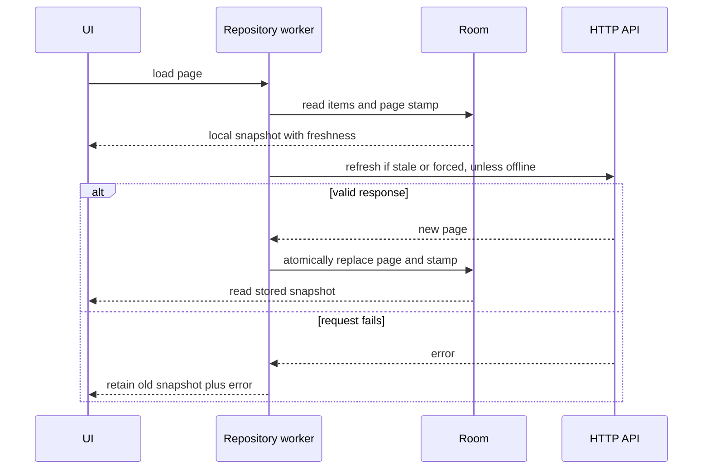

[מפת המעבדות]({{ '/android/topics/' | relative_url }}) · [מעבדת HTTP]({{ '/android/topics/08-http-client/' | relative_url }}) · [מעבדת Room]({{ '/android/topics/12-room-persistence/' | relative_url }})

{: .box-success}
בסוף המעבדה מסך חדש טוען חמישה Todos בכל עמוד מ־API. כל תגובה מוצלחת נשמרת ב־Room, והמסך מציג **רק את הרשומות שנקראו מ־Room**. לחיצה על Offline מדלגת על הרשת ועדיין מציגה עמודים שנשמרו; Refresh שנכשל משאיר את הרשומות הישנות ומציג את הכשל. בדיקה עם MockWebServer מוכיחה את מקרה `HTTP 503` לאחר טעינה מוצלחת.

בסיס ההשוואה בפרויקט **topics** הוא **`codex/http-client`**, וענף התוצאה הוא **`codex/paging-offline-cache`**. ה־HTTP החד־פריטי נשאר עובד; מוסיפים לו מסך ייעודי דרך כפתור. זו פגינציה *ידנית ומפורשת* כדי לראות את ההחלטות. למוצר עם רשימה גדולה, פילטרים ומקורות מורכבים כדאי לעבור אחר כך ל־Paging 3 עם `PagingSource`/`RemoteMediator` על אותו עיקרון של מקור מקומי. [סקירת Paging](https://developer.android.com/topic/libraries/architecture/paging/v3-overview) ו־[רשת עם Room](https://developer.android.com/topic/libraries/architecture/paging/v3-network-db) מתארות את המיפוי.

## חוזה הנתונים

| מצב | מה רואים? | האם קוראים לרשת? | האם מוחקים את העמוד? |
|---:|---:|:---:|:---:|
| אין cache, online | מסך ריק בזמן בקשה | כן | אין מה למחוק |
| cache טרי, גיל פחות מדקה | נתונים מקומיים מיד | לא, אלא ב־Refresh | לא |
| cache ישן | נתונים ישנים עם סימון Stale | כן | רק אחרי תשובה תקינה |
| Offline | נתון מקומי, אם קיים | לא | לא |
| HTTP/רשת נכשלים | נתון מקומי והסבר על הכשל | הבקשה נכשלה | לא |
| HTTP הצליח | עמוד חדש שנשמר אטומית | הבקשה הסתיימה | מחליפים רק את אותו עמוד |

הבחירה המרכזית היא **Room כמקור לתצוגה**, לא מערך Retrofit שמוצג במקביל. כך ה־UI אינו צריך ליישב שתי רשימות סותרות. מדיניות freshness של דקה היא ערך *הדגמה*, לא אמת אוניברסלית: באפליקציית תחבורה דקה עשויה להיות ישנה מדי, ובספריית ספרים קצרה מדי. גם `Offline` כאן הוא מצב הדגמה שמכבה קריאות רשת באפליקציה; הוא אינו משנה את מצב המכשיר.

## שמירה, טריות וזמינות הן שלוש תכונות שונות

נתון שנמצא ב־Room זמין גם בלי הרשת, אבל יכול להיות ישן. תגובת רשת חדשה יכולה להיות טרייה, אבל לא זמינה בהפעלה הבאה עד שנשמרה. לכן ה־UI קוראת רק מן המסד, ומקבלת לצד הנתונים גם מידע על המקור והשלמת הבקשה. `done=false` אומר שאפשר להציג כבר נתון מקומי בעוד שהרענון עדיין עובד; כשל רענון אינו מחייב למחוק את מה שכבר אפשר להציג.



`PageStamp` קיימת גם לעמוד ריק: בלעדיה מערך ריק לא יגלה האם מעולם לא טענו את העמוד או שהשרת ענה בהצלחה שאין בו פריטים. חותמת זמן מתעדת הצלחת טעינה; אין לעדכן אותה לכעת כאשר הרענון נכשל, אחרת הנתון הישן יסומן בטעות כטרי.

בטרנזקציה מחליפים את רשומות העמוד ואת חותמתו יחד. מחיקה, insert וחותמת נפרדות יכולות לחשוף עמוד חלקי או חותמת חדשה עם נתונים ישנים. לפני הכתיבה בודקים את גוף התשובה כדי לא להחליף cache תקין בנתון פגום. TTL של דקה ב־`currentTimeMillis` היא מדיניות הדגמה עם מגבלה: שינוי שעון מכשיר יכול להשפיע על חישוב הגיל; מוצר צריך לבחור שעון ומדיניות שמתאימים לו.

עמוד קצר מגודל הבקשה הוא סימן לסיום **בחוזה הזה**. עמוד מלא אינו הוכחה שיש עוד פריטים, והוספת פריטים בשרת יכולה להזיז גבולות של עמודים ממוספרים. cache לפי page מתאים לניסוי נשלט; cursor ומפתחות remote נדרשים כשחוזה השרת מבטיח רצף אחר. Paging 3 מנהלת יותר מן התזמון והגלילה, אבל אינה מחליטה עבורנו מה נחשב טרי או איזה מידע מותר לשמור.

## עצרו ונבאו

יש PageStamp עם count=0, אבל אין CachedTodo של העמוד. במה זה שונה מהיעדר PageStamp? כתבו תחזית לפני פתיחת ההסבר, ואז הצביעו על המשתנה או התנאי בקוד שמצדיקים אותה.

<details markdown="1">
<summary>בדיקת ההבנה</summary>

חותמת קיימת אומרת שהעמוד נטען בהצלחה והיה ריק בזמן fetchedAt. היעדר חותמת אומר שאין לנו טעינה מוצלחת שמורה של העמוד. בשניהם הרשימה ריקה, אך מדיניות freshness והודעת המקור שונות.

</details>

## 1. תשתית מסד אחרי מחסום Gradle

ב־**Gradle Scripts > libs.versions.toml** הוסיפו Room `2.8.5`,‏ `room-runtime`,‏ `room-compiler` ותוסף Room. הוסיפו `kotlinx-serialization-core` `1.8.1` כדרישת תאימות של גרסת Room הזו בפרויקט AGP הנוכחי. ב־**Gradle Scripts > build.gradle.kts (Project)**, בתוך `plugins`, הוסיפו `alias(libs.plugins.room) apply false`. ב־**Gradle Scripts > build.gradle.kts (Module :app)** הפעילו `alias(libs.plugins.room)`, הגדירו `schemaDirectory("$projectDir/schemas")`, הוסיפו runtime ו־`annotationProcessor(libs.room.compiler)`. השאירו את Retrofit,‏ Gson,‏ MockWebServer ותלויות התבנית הקיימות. הריצו Sync ובנייה לפני כל הפניה למחלקות Room שנוצרות; שמרו את קובץ schema v1 שנוצר בבנייה. הקוד המשלים מראה את התוספות המדויקות ל־Gradle, כולל `androidTestImplementation(libs.mockwebserver)` עבור בדיקת המכשיר.

ב־**app > kotlin+java > com.example.topics** צרו את קובצי המסד החדשים:

- `CachedTodo.java`: `@Entity`, מפתח ראשי `id`, שדות `page`,‏ `userId`,‏ `title`,‏ `completed`, ומתודת `from(Todo,page)` שמפרידה JSON ממבנה האחסון.
- `PageStamp.java`: `@Entity`, מפתח `page`,‏ `fetchedAt` ב־milliseconds ו־`count`. השורה קיימת גם לעמוד תקין וריק — אחרת לא נדע אם הוא לא נטען או נטען ללא תוצאות.
- `PageDao.java`: `items(page)` עם `ORDER BY id`,‏ `stamp(page)`,‏ `clearPage(page)`,‏ `putItems(...)`,‏ `putStamp(...)`.
- `PageCache.java`: `@Database(entities={CachedTodo.class,PageStamp.class}, version=1, exportSchema=true)` ומחזירה `PageDao`.

לא מוחקים את כל הטבלה ברענון: רק את הרשומות של העמוד המבוקש. `id` הוא זהות ה־Todo מהשרת, ו־`page` שומר את גבול העמוד שנשלף. ב־API עם פריטים שנכנסים לראש הרשימה בכל רגע, מספרי עמוד עלולים לזוז ונדרש cursor או מדיניות invalidation; זהו גבול הדוגמה.

## 2. API של עמוד וחוזה סוף

צרו `PagedTodoApi.java`:

```java
public interface PagedTodoApi {
    /**
     * Describes a numbered page request; execution belongs on a worker.
     *
     * @param page one-based page number
     * @param limit maximum requested items
     * @return new single-use request for the decoded page
     */
    @GET("todos")
    Call<List<Todo>> page(@Query("_page") int page, @Query("_limit") int limit);
}
```

בדקנו שהשירות מחזיר `/todos?_page=2&_limit=5` עם חמישה פריטים וכותרות `Link` ו־`X-Total-Count`. בענף הדוגמה `PAGE_SIZE=5`; כאשר מתקבלים פחות מחמישה פריטים, כפתור Next מושבת. אם אורך העמוד הוא בדיוק חמישה, עדיין **לא מוכח** שיש עמוד הבא; ייתכן שהרשימה הסתיימה בדיוק בגבול. במוצר השתמשו ב־`Link`/total או ב־cursor של ה־API כדי לדעת בוודאות. שרת הדוגמה משמש רק למעבדה ואינו מקור נתונים של מוצר.

## 3. ה־Repository מתווכת בין local ל־remote

`PagedTodoRepository` היא קובץ חדש בקוד המשלים. היא יוצרת Room,‏ Retrofit ו־`ExecutorService` יחיד. `load(page, offline, force, listener)` פועלת בסדר הבא:

1. מבטלת `Call` קודם ומגדילה `generation`; הביטול פוסל גם עבודה שעדיין מחכה בתור לפני יצירת Call; עבודה ישנה בתור אינה מפרסמת תוצאה חדשה.
2. קוראת `PageStamp` ואת רשומות העמוד בשרשור הרקע, ומחזירה אותן מיד עם `done=false` אם יש רענון צפוי.
3. אם offline או שהעמוד טרי והמשתמש לא ביקש Refresh, מסיימת בלי HTTP.
4. אחרת מפעילה `Call<List<Todo>>.execute()` ברקע, בודקת status וגוף, וממירה כל `Todo` ל־`CachedTodo` אחרי בדיקת `id/title`.
5. `database.runInTransaction` מוחקת את *אותו עמוד*, מוסיפה את הרשומות וכותבת `PageStamp` עם הזמן ומספר הרשומות. אחרי העסקה קוראת שוב מ־DAO ומחזירה את הנתון המקומי.
6. במקרה HTTP/IOException/JSON לא תקין, מחזירה את רשומות ה־cache והודעת כשל. אין מחיקה ואין סימון כטרי.

קטע ההכרעה המרכזי:

```java
PageStamp stamp = dao.stamp(page);
List<CachedTodo> cached = dao.items(page);
boolean fresh = stamp != null && System.currentTimeMillis() - stamp.fetchedAt < 60_000;
boolean complete = offline || (fresh && !force);
listener.accept(new Result(cached, source, complete,
        stamp != null && stamp.count == PAGE_SIZE));
if (complete) return;
```

והחלפה האטומית:

```java
database.runInTransaction(() -> {
    // Replace one page and its timestamp as one all-or-nothing storage change.
    dao.clearPage(page);
    dao.putItems(incoming);
    dao.putStamp(new PageStamp(page, System.currentTimeMillis(), incoming.size()));
});
List<CachedTodo> stored = dao.items(page);
```

אל תבצעו Room או HTTP ב־UI thread. `runInTransaction` מונעת מצב שבו עמוד ישן נמחק וחדש נכתב רק בחלקו; אם הכתיבה נכשלת, הנתון הקודם נשאר. ב־`close()` ה־Repository מבטלת בקשה פעילה, מסדרת סגירת DB אחרי העבודה בתור ומכבה executor. [מדריך Room](https://developer.android.com/training/data-storage/room) מתאר את שכבות Entity/DAO/Database.

## 4. מסך עמודים שמציג מקור ומצב

ב־`MainActivity.java` הקיים הוסיפו **כפתור אחד** `open_paged` ל־`activity_main.xml` וחברו `Intent` ל־`PagedTodosActivity`; ב־Manifest רשמו Activity פנימית `exported=false`. צרו `activity_paged_todos.xml` חדש עם `ScrollView`, כותרת, `Switch id=offline`, כפתורי `previous`,‏ `next`,‏ `refresh`,‏ `TextView id=status` ו־`TextView id=items`. `PagedTodosActivity` מחזיקה `page=1` ו־`generation`, קוראת ל־Repository, ומציגה כל `CachedTodo` כ־ID, מצב וכותרת. היא משביתה ניווט בזמן בקשה, משחזרת `page/offline` ב־`onSaveInstanceState`, ומתעלמת מ־callback של בקשה ישנה או Activity שנהרסה.

הטקסט במסך מכיל גם מקור התוצאה: **Fresh local page**,‏ **Stale local page**,‏ **Network page saved to Room** או **Offline**. בלי הסימון הזה, משתמש ומפתח אינם יכולים להבחין בין מידע מעודכן לנתון ישן. כפתור Refresh עוקף TTL, אבל Offline ממשיך לדלג על רשת — סדר החלטות מכוון.


## הקוד המשלים במלואו

הקטעים הגלויים בשיעור ממקדים את הרעיון; הקבצים הבאים משלימים את כל הקוד הדרוש, עם תיעוד והערות. קראו את השינוי יחד עם ההסבר שמעליו. הם חלק מן השיעור ואינם דורשים פתיחת ענף דוגמה או אתר שפורסם.

### libs.versions.toml

[פתיחת המקור ישירות]({{ '/android/topics/code/25/libs.versions.toml.md' | relative_url }}) — בקובץ Markdown המקורי, הקוד נמצא ב־`code/25/libs.versions.toml.md` ביחס לשיעור.

<details markdown="1">
<summary>הקוד המלא והשינויים עבור libs.versions.toml</summary>



</details>

### build.gradle.kts

[פתיחת המקור ישירות]({{ '/android/topics/code/25/build.gradle.kts.md' | relative_url }}) — בקובץ Markdown המקורי, הקוד נמצא ב־`code/25/build.gradle.kts.md` ביחס לשיעור.

<details markdown="1">
<summary>הקוד המלא והשינויים עבור build.gradle.kts</summary>



</details>

### MainActivity.java

[פתיחת המקור ישירות]({{ '/android/topics/code/25/MainActivity.java.md' | relative_url }}) — בקובץ Markdown המקורי, הקוד נמצא ב־`code/25/MainActivity.java.md` ביחס לשיעור.

<details markdown="1">
<summary>הקוד המלא והשינויים עבור MainActivity.java</summary>



</details>

### CachedTodo.java

[פתיחת המקור ישירות]({{ '/android/topics/code/25/CachedTodo.java.md' | relative_url }}) — בקובץ Markdown המקורי, הקוד נמצא ב־`code/25/CachedTodo.java.md` ביחס לשיעור.

<details markdown="1">
<summary>הקוד המלא והשינויים עבור CachedTodo.java</summary>



</details>

### PageStamp.java

[פתיחת המקור ישירות]({{ '/android/topics/code/25/PageStamp.java.md' | relative_url }}) — בקובץ Markdown המקורי, הקוד נמצא ב־`code/25/PageStamp.java.md` ביחס לשיעור.

<details markdown="1">
<summary>הקוד המלא והשינויים עבור PageStamp.java</summary>



</details>

### PageDao.java

[פתיחת המקור ישירות]({{ '/android/topics/code/25/PageDao.java.md' | relative_url }}) — בקובץ Markdown המקורי, הקוד נמצא ב־`code/25/PageDao.java.md` ביחס לשיעור.

<details markdown="1">
<summary>הקוד המלא והשינויים עבור PageDao.java</summary>



</details>

### PageCache.java

[פתיחת המקור ישירות]({{ '/android/topics/code/25/PageCache.java.md' | relative_url }}) — בקובץ Markdown המקורי, הקוד נמצא ב־`code/25/PageCache.java.md` ביחס לשיעור.

<details markdown="1">
<summary>הקוד המלא והשינויים עבור PageCache.java</summary>



</details>

### PagedTodoApi.java

[פתיחת המקור ישירות]({{ '/android/topics/code/25/PagedTodoApi.java.md' | relative_url }}) — בקובץ Markdown המקורי, הקוד נמצא ב־`code/25/PagedTodoApi.java.md` ביחס לשיעור.

<details markdown="1">
<summary>הקוד המלא והשינויים עבור PagedTodoApi.java</summary>



</details>

### PagedTodoRepository.java

[פתיחת המקור ישירות]({{ '/android/topics/code/25/PagedTodoRepository.java.md' | relative_url }}) — בקובץ Markdown המקורי, הקוד נמצא ב־`code/25/PagedTodoRepository.java.md` ביחס לשיעור.

<details markdown="1">
<summary>הקוד המלא והשינויים עבור PagedTodoRepository.java</summary>



</details>

### PagedTodosActivity.java

[פתיחת המקור ישירות]({{ '/android/topics/code/25/PagedTodosActivity.java.md' | relative_url }}) — בקובץ Markdown המקורי, הקוד נמצא ב־`code/25/PagedTodosActivity.java.md` ביחס לשיעור.

<details markdown="1">
<summary>הקוד המלא והשינויים עבור PagedTodosActivity.java</summary>



</details>

### PagedTodoRepositoryTest.java

[פתיחת המקור ישירות]({{ '/android/topics/code/25/PagedTodoRepositoryTest.java.md' | relative_url }}) — בקובץ Markdown המקורי, הקוד נמצא ב־`code/25/PagedTodoRepositoryTest.java.md` ביחס לשיעור.

<details markdown="1">
<summary>הקוד המלא והשינויים עבור PagedTodoRepositoryTest.java</summary>



</details>

### activity_main.xml

[פתיחת המקור ישירות]({{ '/android/topics/code/25/activity_main.xml.md' | relative_url }}) — בקובץ Markdown המקורי, הקוד נמצא ב־`code/25/activity_main.xml.md` ביחס לשיעור.

<details markdown="1">
<summary>הקוד המלא והשינויים עבור activity_main.xml</summary>



</details>

### activity_paged_todos.xml

[פתיחת המקור ישירות]({{ '/android/topics/code/25/activity_paged_todos.xml.md' | relative_url }}) — בקובץ Markdown המקורי, הקוד נמצא ב־`code/25/activity_paged_todos.xml.md` ביחס לשיעור.

<details markdown="1">
<summary>הקוד המלא והשינויים עבור activity_paged_todos.xml</summary>



</details>

### strings.xml

[פתיחת המקור ישירות]({{ '/android/topics/code/25/strings.xml.md' | relative_url }}) — בקובץ Markdown המקורי, הקוד נמצא ב־`code/25/strings.xml.md` ביחס לשיעור.

<details markdown="1">
<summary>הקוד המלא והשינויים עבור strings.xml</summary>



</details>

## ראיות ובדיקות

צרו את `PagedTodoRepositoryTest.java` מן הקוד המשלים ב־**app > kotlin+java > com.example.topics (androidTest)**. שרת MockWebServer משתמש ב־HTTP מקומי: במעבדת 08 MockWebServer רץ בבדיקת JVM, שאינה כפופה למדיניות רשת של Android. כאן השרת המקומי נגיש מבדיקת מכשיר ולכן ניצור לראשונה היתר cleartext של **debug בלבד**. ב־Terminal של Android Studio, מתוך שורש הפרויקט, השתמשו ב־PowerShell:

```powershell
New-Item -ItemType Directory -Force app/src/debug
New-Item -ItemType File app/src/debug/AndroidManifest.xml
```

פתחו את הקובץ החדש ב־**Search Everywhere** לפי `app/src/debug/AndroidManifest.xml` וכתבו בו:

```xml
<manifest xmlns:android="http://schemas.android.com/apk/res/android">
    <application android:usesCleartextTraffic="true" />
</manifest>
```

Gradle ממזגת אותו רק בבניית debug. האפליקציה הרגילה במעבדה עדיין משתמשת ב־HTTPS; ההיתר נועד ל־HTTP של MockWebServer על המכשיר. ה־Manifest הראשי וגרסת release אינם מקבלים היתר HTTP גורף. הבדיקה ממתינה בשרשור הבדיקה עם `CountDownLatch`; אסור להמתין כך ב־UI thread. היא משתמשת בעמוד 77 כדי להפרידו מן עמודי ההדגמה.


1. באמולטור, Page 1 נטען מן הרשת ונשמר עם Todos ‏1–5. Next טען את 6–10. סימון Offline בעמוד 2 הציג **Offline: Fresh local page** עם אותן רשומות.
2. בדיקת `PagedTodoRepositoryTest` מפעילה MockWebServer: עמוד 77 מצליח ונשמר, ואז Refresh מחזיר `HTTP 503`. היא מאשרת שה־Todo השמור עדיין מוצג ושהבקשה השתמשה ב־`_page=77&_limit=5`. `:app:connectedDebugAndroidTest` עבר.
3. כבו רשת במכשיר או השתמשו במצב Offline של המעבדה, עברו לעמוד שלא נשמר, וודאו שמתקבל **No cached page** ללא נתונים. חזרו לעמוד שמור ואז הפעילו מחדש את התהליך: הנתון נשאר ב־Room.
4. נסחו מדיניות למוצר שלכם: אחרי כמה זמן עמוד נחשב ישן? האם רענון כושל משאיר נתונים? כיצד יודעים שהגענו לסוף כאשר כמות הפריטים שווה בדיוק לגודל עמוד?

**המשך ל־Paging 3:** החליפו את כפתורי Previous/Next ב־`Pager`,‏ `PagingSource` שקורא מ־Room ו־`RemoteMediator` שמביא עמודים ומנהל מפתחות. השאירו את האינווריאנט: ה־UI מקבלת נתונים מן המסד, והשלמת בקשת רשת משנה את המסד בעסקה. כך ספריית Paging פותרת עומס, גלילה ו־retry בלי לשנות את חוזה ה־offline של המוצר.
