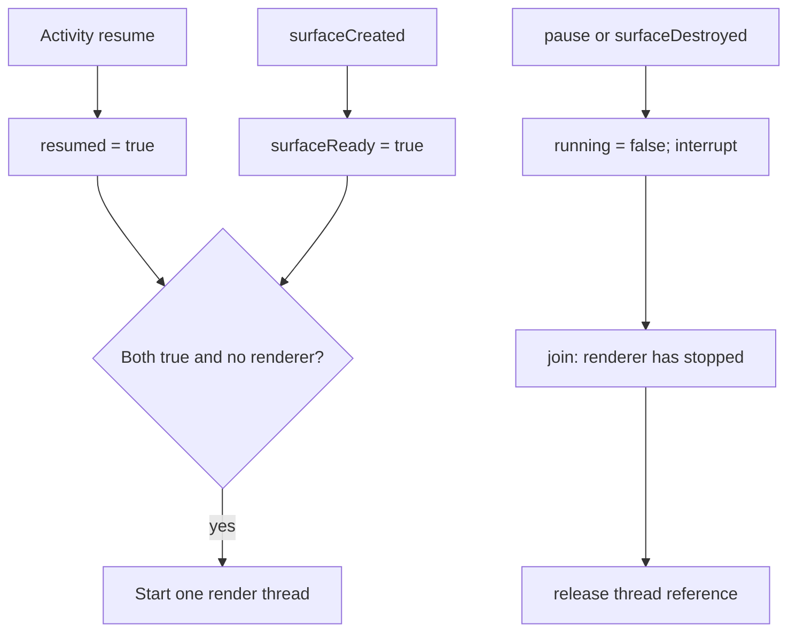

[מפת המעבדות]({{ '/android/topics/' | relative_url }}) · [Canvas ב־CollectCircles]({{ '/android/CollectCircles/01.collect-circles-drawing' | relative_url }})

{: .box-success}
בסוף המעבדה כדור נע ומתנגש בגבולות על `SurfaceView`; נגיעה ממקמת אותו מחדש. שרשור ציור יחיד פועל רק כשה־Activity וה־Surface פעילים, ובדיקת מכשיר מאשרת שמספר הפריימים מפסיק לגדול ב־Pause וחוזר לגדול ב־Resume. ה־Surface מגשימה צורך של *לולאת ציור רציפה* במשחק קטן.

בסיס ההשוואה בפרויקט **topics** הוא `master`, וענף התוצאה הוא **`codex/surfaceview-game-loop`**. השיעור מלמד התמחות אחת לעומק. `ContentProvider` מוסבר בהמשך כחלופה למטרה אחרת לחלוטין — שיתוף נתונים בין אפליקציות — ואין הצדקה להוסיף אותו למשחק הכדור רק כדי לצבור רכיב Android נוסף.

## קודם שואלים מה הבעיה

| צורך אמיתי | כלי מתאים | למה? |
|---:|:---|---:|
| ציור שמשתנה רק אחרי לחיצה | Custom View + `onDraw()`/`invalidate()` | פשוט ומשתלב במחזור הציור הרגיל |
| פריימים רציפים עם חישוב פיזיקה בשרשור ייעודי | `SurfaceView` + `SurfaceHolder` | בעלות ברורה על משטח ציור שנגיש לשרשור רקע |
| שיתוף רשומות עם אפליקציה אחרת באמצעות `content://` והרשאות | `ContentProvider` | חוזה `query`/`insert`/`delete` בין תהליכים |
| נתון שרק האפליקציה עצמה צריכה | Room/קובץ פרטי | אין צורך בחוזה שיתוף חיצוני |

ב־CollectCircles כבר לומדים [ציור מותאם ב־Canvas]({{ '/android/CollectCircles/01.collect-circles-drawing' | relative_url }}). עבור מסך קטן שמתעדכן על אירוע, התחילו משם. [תיעוד ציור מותאם](https://developer.android.com/develop/ui/views/layout/custom-views/custom-drawing) מציג `onDraw`. המעבדה הנוכחית מתחילה כשיש צורך ייחודי: משחק שמצייר שוב ושוב, בערך אחת ל־16ms, ובעל מחזור חיים של Surface. [תיעוד SurfaceView](https://developer.android.com/reference/android/view/SurfaceView) מתאר את השימוש בשרשור משני.

## שני אישורים להתחלה, בעלים אחד לציור

שרשור הציור רשאי להתחיל רק כאשר **המסך resumed וגם המשטח קיים**. אין סדר callback אחד שאפשר להניח תמיד: לפעמים המסך פעיל לפני יצירת המשטח, ולפעמים המשטח קיים כשהמסך אינו פעיל. כל אירוע מעדכן את התנאי שלו וקורא לאותה הכרעה `startIfReady`. בדיקת `renderer != null` מונעת יצירה כפולה.



`running` נקרא בשרשור הציור ונכתב מ־UI, ולכן דרוש מנגנון נראות זיכרון, כאן `volatile`. `positionLock` מגן על קבוצה של ערכים: שינוי x ו־y צריך להיראות יחד. `AtomicInteger` מתאים למונה פריימים שנקרא משרשור בדיקה; הוא אינו מחליף נעילה של כל מיקום הכדור. אלה שלושה כלים לבעיות שונות, לא שלושה איותים לאותה בטיחות.

המהירות בפיקסלים לשנייה כפול `dt` בשניות נותנת מרחק בפיקסלים. בלי `dt`, "360 פיקסלים בכל פריים" היה משנה את מהירות המשחק עם קצב המכשיר. תקרת dt מפחיתה קפיצה אחרי השהיה ארוכה אבל משמיטה חלק מזמן הסימולציה: פשרה גלויה של המשחק הקטן. כשהמרכז מגיע לקיר בודקים גם רדיוס, כדי שהכדור כולו יישאר בתחום.

`lockCanvas` מקבלת משטח לציור; `unlockCanvasAndPost` משחררת ומפרסמת אותו. `finally` מבטיחה שזוג הפעולות ייסגר גם בכשל. shutdown באמצעות `join` ממתינה שהשרשור באמת חדל להשתמש במשטח לפני חזרת `surfaceDestroyed`. אין להחזיק תוך ההמתנה lock שהשרשור צריך כדי לסיים, אחרת אפשר ליצור deadlock. הלולאה חייבת להיות קצרה, להגיב לביטול ולא להמתין לפעולה מן ה־UI שמחכה לה.

## עצרו ונבאו

surfaceCreated התקבלה כשה־Activity עדיין אינה resumed. האם מתחילים שרשור ציור? כתבו תחזית לפני פתיחת ההסבר, ואז הצביעו על המשתנה או התנאי בקוד שמצדיקים אותה.

<details markdown="1">
<summary>בדיקת ההבנה</summary>

לא. startIfReady דורשת שני אישורים וגם שאין renderer קיימת. כשה־Activity תעבור ל־resume היא תבדוק שוב ותתחיל שרשור יחיד. pause או destruction מבטלות אחד התנאים ועוצרות את אותו שרשור לפני שחרור המשטח.

</details>

## 1. מציבים משטח ואזור הסבר

ב־**app > res > layout > activity_main.xml** החליפו את TextView היחיד בשני ילדים של `ConstraintLayout id=main`: `TextView id=instruction` בראש עם `@string/ball_instruction`, ומתחתיו `com.example.topics.BouncingBallView id=ball` ש־`layout_width`/`layout_height` שלו `0dp` והוא constrained ל־`top` של התחתית של ההסבר, ל־`bottom` של ההורה ולשני הצדדים. השאירו את טיפול ה־window insets ב־Activity. ב־**app > res > values > strings.xml** הוסיפו `ball_instruction` ו־`ball_description`; תיאור נגישות מסביר שיש אנימציה ופעולת נגיעה, אף שבמשחק אמיתי צריך גם חלופת שליטה נגישה.

ב־`MainActivity.java` הוסיפו רק קריאות מחזור חיים:

```java
/**
 * Allows drawing while the screen is active; the Surface must also be ready.
 */
@Override
protected void onResume() {
    super.onResume();
    binding.ball.resume();
}

/**
 * Stops owned drawing before the screen becomes inactive.
 */
@Override
protected void onPause() {
    binding.ball.pause();
    super.onPause();
}
```

ה־Activity אינה מציירת בעצמה. היא אומרת ל־View מתי המסך פעיל; ה־View אחראית למשטח ולשרשור. שימרו את שני התנאים: `Activity` יכולה להיות resumed בזמן שה־Surface עוד לא נוצרה, ולהפך.

## 2. Surface תקפה רק בין שני callbacks

צרו `BouncingBallView.java` ב־**app > kotlin+java > com.example.topics**, שיורשת `SurfaceView` ומממשת `SurfaceHolder.Callback`. בבנאי שימרו `holder = getHolder()`, הוסיפו `holder.addCallback(this)`, הכינו `Paint` פעם אחת וחשבו רדיוס ב־dp. השתמשו בשדות `resumed`,‏ `surfaceReady`,‏ `running` ו־`Thread renderer`:

```java
/**
 * Marks the Activity side ready and starts only if the Surface is also ready.
 */
public void resume() { resumed = true; startIfReady(); }
/**
 * Clears the Activity side and waits for owned drawing to stop.
 */
public void pause() { resumed = false; stopRenderer(); }

/**
 * Marks the Surface usable and checks whether the Activity is ready too.
 *
 * @param holder the newly available drawing surface owner
 */
@Override
public void surfaceCreated(SurfaceHolder holder) {
    surfaceReady = true;
    startIfReady();
}
/**
 * Stops and joins drawing before returning control of a disappearing Surface.
 *
 * @param holder Surface owner that must no longer be used on return
 */
@Override
public void surfaceDestroyed(SurfaceHolder holder) {
    surfaceReady = false;
    stopRenderer();
}

/**
 * Starts at most one renderer when both independent lifecycle conditions hold.
 */
private void startIfReady() {
    if (!resumed || !surfaceReady || renderer != null) return;
    running = true;
    renderer = new Thread(this::renderLoop, "ball-renderer");
    renderer.start();
}
```

`SurfaceHolder.Callback` אומרת שהמשטח נגיש רק אחרי `surfaceCreated` ולפני `surfaceDestroyed`. בתיעוד [surfaceDestroyed](https://developer.android.com/reference/android/view/SurfaceHolder.Callback#surfaceDestroyed(android.view.SurfaceHolder)) מודגש ששרשור ציור חייב לסיים להשתמש במשטח **לפני שה־callback חוזר**. לכן `stopRenderer()` מציבה `running=false`, מפריעה ל־sleep וקוראת `join()` לשרשור לפני איפוס ההפניה. אין לפתוח שני render threads אחרי חזרה מהירה לאפליקציה.

## 3. פריים: זמן, תנועה, ציור ופרסום

בלולאה בקוד המשלים זמן הפריים הוא `dt` בשניות מתוך `System.nanoTime()`, עם תקרה של `0.05f`. אם תהליך הושהה, כדור לא יקפוץ בבת אחת מרחק של דקות. המהירויות `vx=360`,‏ `vy=280` הן **פיקסלים לשנייה**. בכל סיבוב מוסיפים `vx*dt`,‏ `vy*dt`, הופכים את סימן המהירות כשמגיעים לקיר ומחזירים את המיקום לגבול החוקי.

```java
Canvas canvas = null;
try {
    canvas = holder.lockCanvas();
    if (canvas != null) {
        canvas.drawColor(Color.rgb(15, 25, 45));
        synchronized (positionLock) {
            x += vx * dt;
            y += vy * dt;
            // Clamp to the visible bounds and reverse velocity at a wall.
            paint.setColor(Color.rgb(64, 210, 244));
            canvas.drawCircle(x, y, radius, paint);
        }
        frames.incrementAndGet();
    }
} finally {
    if (canvas != null) holder.unlockCanvasAndPost(canvas);
}
```

ה־`drawColor` מנקה את כל הבאפר בכל פריים; אין להניח שהוא שומר אוטומטית את הציור הישן. `unlockCanvasAndPost` חייבת להיקרא עבור Canvas שננעלה גם אם החישוב נכשל. `Thread.sleep(Math.max(1, 16-elapsedMs))` נותנת מגבלת קצב פשוטה כדי שהלולאה לא תשרוף CPU. זו קירוב חינוכי, לא סנכרון מקצועי עם קצב המסך או מנוע משחק. [תיעוד SurfaceHolder](https://developer.android.com/reference/android/view/SurfaceHolder) מפרט lock/post.

`onTouchEvent(ACTION_DOWN)` מעדכנת `x/y` של הכדור בתוך אותו `positionLock` שבו משתמש שרשור הציור. זהו הגבול בין UI thread ל־render thread. בלי נעילה, חצי עדכון או ערך ישן יכולים ליצור קפיצה. אין לגעת ב־TextView מתוך שרשור הציור; אם צריך משוב נגיש או ניקוד, שלחו state ל־UI thread.

## 4. בדיקה שמוכיחה שהלולאה נעצרת

כדי להשתמש ב־`ActivityScenario`, הוסיפו ב־**Gradle Scripts > libs.versions.toml** אל הטבלאות הקיימות:

```toml
# [versions]
testCore = "1.7.0"

# [libraries]
androidx-test-core = { group = "androidx.test", name = "core", version.ref = "testCore" }
```

ב־**Gradle Scripts > build.gradle.kts (Module :app)**, בתוך `dependencies`, הוסיפו `androidTestImplementation(libs.androidx.test.core)` ובצעו Sync. השאירו את תלות JUnit/Espresso וקובצי בדיקות התבנית. צרו את `SurfaceLoopTest.java` מתוך הקוד המשלים ב־**app > kotlin+java > com.example.topics (androidTest)**. הבדיקה רצה על אמולטור/מכשיר, משום ש־Surface ומחזור חיי Activity הם התנהגות Android.


בקוד המשלים `getFrameCount()` קוראת `AtomicInteger`. `SurfaceLoopTest` מפעילה את `MainActivity` באמצעות `ActivityScenario`, ממתינה לפריימים, עוברת ל־`Lifecycle.State.STARTED`, ממתינה שוב ומאשרת שהמספר **לא גדל**, ואז חוזרת ל־`RESUMED` ומאשרת שהוא גדל. `:app:connectedDebugAndroidTest` עבר באמולטור. צילום מסך של האמולטור הראה כדור תכלת על רקע כהה; נגיעה מזיזה את נקודת ההתחלה שלו. נסו גם מעבר מהיר Home→אפליקציה, סיבוב מסך וכיבוי/הדלקת מסך. במוצר אמיתי שמרו גם מיקום/מהירות כאשר סיבוב מסך לא אמור לאפס משחק.

## ומה לגבי ContentProvider?

`ContentProvider` מתאים כאשר אפליקציה **אחרת** צריכה לקרוא נתון דרך `ContentResolver` ו־URI מסוג `content://authority/path`, ואנחנו צריכים חוזה, MIME type, הרשאות ו־`Cursor` או API תואם. למשל: אפליקציית מערכת קבצים פותחת מסמך שהאפליקציה שלנו משתפת, או אפליקציית לוח לימודים מפרסמת רשימת שיעורים לאפליקציית בית־ספר אחרת. [תיעוד ContentProvider](https://developer.android.com/guide/topics/providers/content-provider-basics) ו־[FileProvider](https://developer.android.com/reference/androidx/core/content/FileProvider) מציגים שני מסלולים: הראשון לחוזה נתונים כללי, השני לשיתוף קבצים זמני כמו במעבדת [המצלמה]({{ '/android/topics/19-camera-gallery-storage/' | relative_url }}).

**משימת בחירה:** תכננו אפליקציית לוח ציונים ואפליקציית הורה נפרדת. איזו שאילתת `content://` תרצו לאפשר, איזו הרשאה תגן עליה, ואיך תמנעו חשיפת ציוני תלמידים אחרים? רק אם יש צרכן חיצוני אמיתי ובדיקת הרשאות בין שתי אפליקציות, מימוש `ContentProvider` מוצדק. למשחק הכדור כאן אין צרכן כזה.


## הקוד המשלים במלואו

הקטעים הגלויים בשיעור ממקדים את הרעיון; הקבצים הבאים משלימים את כל הקוד הדרוש, עם תיעוד והערות. קראו את השינוי יחד עם ההסבר שמעליו. הם חלק מן השיעור ואינם דורשים פתיחת ענף דוגמה או אתר שפורסם.

### MainActivity.java

[פתיחת המקור ישירות]({{ '/android/topics/code/26/MainActivity.java.md' | relative_url }}) — בקובץ Markdown המקורי, הקוד נמצא ב־`code/26/MainActivity.java.md` ביחס לשיעור.

<details markdown="1">
<summary>הקוד המלא והשינויים עבור MainActivity.java</summary>



</details>

### BouncingBallView.java

[פתיחת המקור ישירות]({{ '/android/topics/code/26/BouncingBallView.java.md' | relative_url }}) — בקובץ Markdown המקורי, הקוד נמצא ב־`code/26/BouncingBallView.java.md` ביחס לשיעור.

<details markdown="1">
<summary>הקוד המלא והשינויים עבור BouncingBallView.java</summary>



</details>

### SurfaceLoopTest.java

[פתיחת המקור ישירות]({{ '/android/topics/code/26/SurfaceLoopTest.java.md' | relative_url }}) — בקובץ Markdown המקורי, הקוד נמצא ב־`code/26/SurfaceLoopTest.java.md` ביחס לשיעור.

<details markdown="1">
<summary>הקוד המלא והשינויים עבור SurfaceLoopTest.java</summary>



</details>

### activity_main.xml

[פתיחת המקור ישירות]({{ '/android/topics/code/26/activity_main.xml.md' | relative_url }}) — בקובץ Markdown המקורי, הקוד נמצא ב־`code/26/activity_main.xml.md` ביחס לשיעור.

<details markdown="1">
<summary>הקוד המלא והשינויים עבור activity_main.xml</summary>



</details>

### strings.xml

[פתיחת המקור ישירות]({{ '/android/topics/code/26/strings.xml.md' | relative_url }}) — בקובץ Markdown המקורי, הקוד נמצא ב־`code/26/strings.xml.md` ביחס לשיעור.

<details markdown="1">
<summary>הקוד המלא והשינויים עבור strings.xml</summary>



</details>


לחיצה מסתיימת בקריאה ל־`performClick()` ב־`ACTION_UP`, כדי שמנגנון הנגישות של View יקבל אירוע click. זה אינו הופך את המשחק לנגיש במלואו; משחק אמיתי צריך גם דרך חלופית להזיז את הכדור בלי מחוות מדויקות.
