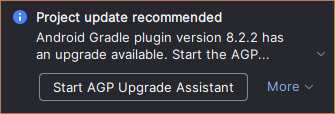
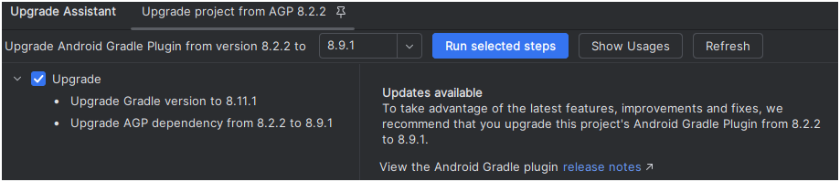
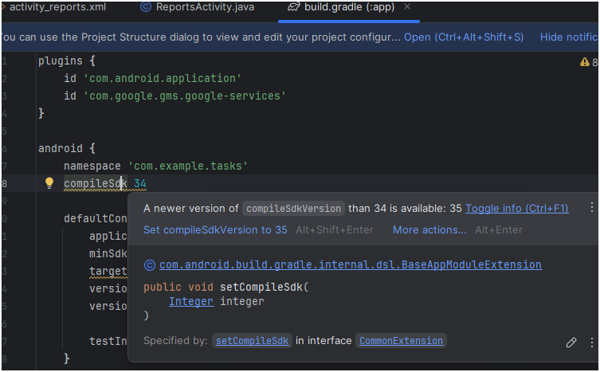
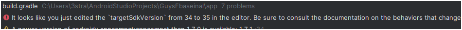

<style>
html {
  direction: ltr !important;
}
body {
  text-align: left !important;
}
</style>


# Resolving AAR Metadata Errors When Adding a New Activity

When adding a new `Empty Activity` (e.g., `ReportsActivity`) to a project configured with older Android SDKs and AGP, you may encounter:

> **Dependency** `androidx.activity:activity:1.10.1` requires compileSdkVersion 35 or later, but this project is currently compiled against android-34.

Follow these steps in order:

---

## 1. Run the AGP Upgrade Assistant (Recommended)

1. If you see a popup as show above, Click the popup **Android Gradle plugin version 8... has an upgrade available** → **Start the AGP Upgrade Assistant**.
2. In the assistant:

   * Select a stable AGP version that is proposed (click **Run selected steps**). 
   * This will take a few minutes to complete
   * Let it update your `build.gradle` files and suggest the Gradle wrapper changes.
   
3. Click **Apply Changes** and then **Sync Now**.

*This automates updating the Android Gradle Plugin and wrapper. If you prefer manual control or encounter issues, proceed to Step 3.*

---

## 2. Ensure API 35 Is Installed

1. Go to **Tools > SDK Manager** → **SDK Platforms**.
2. Verify **Android 14.1 (API Level 35)** is checked. If not, check it and click **Apply**.
3. Wait for installation to finish.

> *Note: If you already have API 35 installed, you can skip this entirely.*

---

## 3. Update `compileSdkVersion` and `targetSdkVersion` (If Errors Persist)

1. Open `app/build.gradle`.
2. In the `android` block, change:

   ```groovy
   compileSdk 34
   targetSdk 34
   ```

   to:

   ```groovy
   compileSdk 35
   // targetSdkVersion remains at 34 unless you’re ready for full migration
   targetSdk 34
   ```
   The lines that should be changed are higlighted, and the Studio's assitant will propose to do the change for you:
   
3. Save and click **Sync Now**.
4. You will be getting a worrying message, (red Error):
---


## 4. Clean & Rebuild
1. First try simply clicking **Build** <span style="color:green">⏵</span> button.
1. If it's not working you may also **Build > Clean Project**
1. Followed by **Build > Rebuild Project**

### The AAR metadata error should now be resolved.

---

## 5. Address Remaining Warnings

Typical fixes for nine warnings include:

* **Unused imports/resources**: remove them.
* **Hardcoded strings**: move to `strings.xml`.
* **Missing translations**: provide translations or suppress intentionally.

Review each warning in the **Build** window and apply or suppress as appropriate.

---

## 6. Commit and push Your Changes
