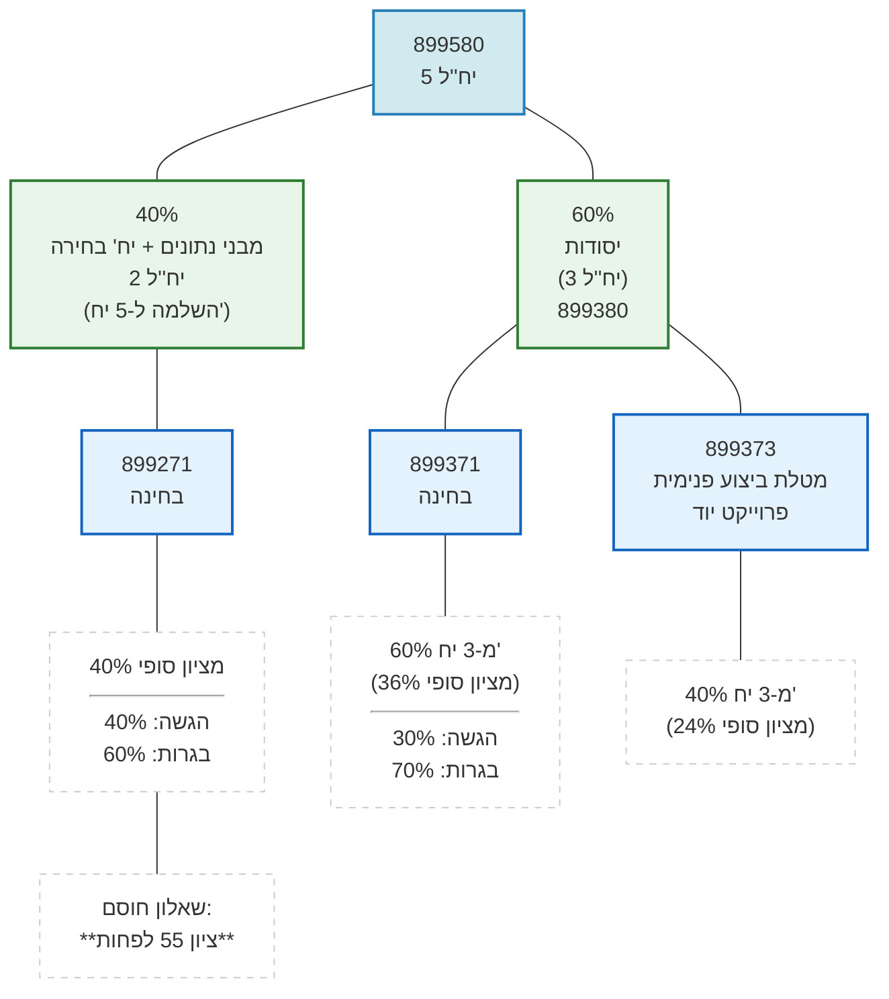

{: .box-note}
תרשים זה אינו כולל את 5 היחידות של פרוייקט הנדסת תוכנה

## חלוקת הניקוד בבגרות {#idGradeStructure}

[על פי מבנה בחינות חדש במדעי המחשב](https://meyda.education.gov.il/files/CSIT/newExamsStructure.pdf)

