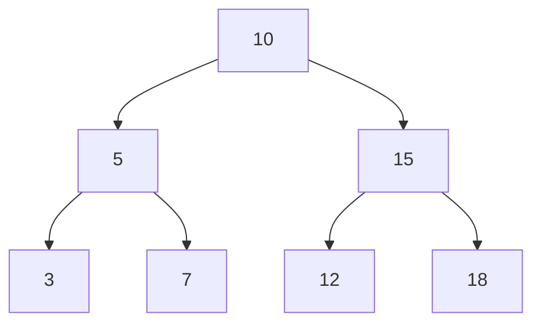

## 6a3.1. גובה עץ בינארי {#id6a3.1.}

עליכם לממש פונקציה בשם `CalculateTreeHeight` אשר מקבלת BinNode⟨int⟩ tree המצביע לשורש של עץ בינארי

הפונקציה צריכה לחשב ולהחזיר את גובה העץ הבינארי הנתון.

### דגשים

1. גובה עץ מוגדר כמספר הקשתות (edges) מהשורש לצומת העמוק ביותר.
2. גובה של עץ עם צומת אחד (שורש בלבד) הוא 0.
3. עליכם להשתמש ברקורסיה כדי לפתור את הבעיה.

### דוגמאות

1. עבור עץ ריק (null), הפונקציה תחזיר: -1
2. עבור עץ עם צומת שורש בלבד, הפונקציה תחזיר: 0
3. עבור העץ הבא:

    ```mermaid
    flowchart TB
      A[5] --> B[3]
      A --> C[8]
      B --> D[1]:::leaf
      C --> E[7]:::leaf
    ```

    הפונקציה תחזיר: 2 (הגובה נמדד לפי מספר הקשתות מהשורש לצומת העמוק ביותר)

## 6a3.2. הדפסת צמתי עץ בינארי בסדר סופי {#id6a3.2.}

עליכם לממש פונקציה חיצונית בשם `PrintPostOrder` אשר מקבלת BinNode⟨int⟩ tree המצביע לשורש של עץ בינארי

הפונקציה צריכה להדפיס את הערכים של כל הצמתים בעץ בסדר Post-Order. כל ערך יודפס בשורה נפרדת.

שימו לב:

1. הפונקציה אינה מחזירה ערך (void).
2. יש להשתמש במחלקה BinNode עבור העץ.
3. ניתן להשתמש בפונקציות עזר של BinTreeUtils ליצירת העץ לצורך בדיקה.
### דוגמאות

1. עבור העץ הבינארי הבא:

    ```mermaid
    flowchart TB
      A[1] --> B[2]
      A --> C[3]:::leaf
      B --> D[4]:::leaf
      B --> E[5]:::leaf
    ```

    הפלט יהיה:

    ```text
    4
    5
    2
    3
    1
    ```

1. עבור העץ הבינארי הבא:

    ```mermaid
    flowchart TB
      A[10] --> B[20]:::leaf
      A --> C[30]:::leaf
    ```

    הפלט יהיה:

    ```text
    20
    30
    10
    ```

## 6a3.3. הדפסת בנים ימניים בעץ בינארי {#id6a3.3.}

עליכם לממש פונקציה חיצונית בשם `PrintRightChildren` אשר מקבלת BinNode⟨int⟩ tree המצביע לשורש של עץ בינארי

1. t - עץ בינארי של מספרים שלמים (מסוג BinNode).

הפונקציה צריכה להדפיס את הערכים של כל הבנים הימניים בעץ, כל ערך בשורה נפרדת.

דגשים:

1. השתמשו במחלקת BinNode.
2. תוכלו להשתמש במעבר על העץ (לדוגמה, DFS או BFS) כדי לבקר בכל הצמתים.
3. בכל צומת, בדקו אם קיים בן ימני (GetRight() אינו null). אם כן, הדפיסו את ערכו (GetValue()).

### דוגמאות

1. עבור העץ הבא:

    ```mermaid
    flowchart TB
      A[10] --> B[5]
      A --> C[15]
      B --> D[2]:::leaf
      B --> E[7]:::leaf
      C --> F[12]:::leaf
      C --> G[18]:::leaf
    ```

    הפלט יהיה:

    ```text
    15
    18
    7
    ```

    (שימו לב שהסדר יכול להשתנות בהתאם לסוג המעבר על העץ. העיקר שכל הבנים הימניים יודפסו.)

1. עבור העץ הבא:

    ```mermaid
    flowchart TB
      A[1] --> B[2]
      A --> C[3]
      B --> D[4]:::leaf
      C --> E[5]:::leaf
      C --> F[6]:::leaf
    ```

    הפלט יהיה:

    ```text
    3
    6
    ```

## 6a3.4. הדפסת עלי עץ בינארי משמאל לימין {#id6a3.4.}

עליכם לממש פונקציה חיצונית בשם `PrintLeavesLeftToRight` אשר מקבלת BinNode⟨int⟩ tree המצביע לשורש של עץ בינארי

1. t - עץ בינארי (מסוג BinNode) שהצמתים שלו הם מטיפוס שלם.

הפונקציה צריכה להדפיס את הערכים של כל העלים בעץ, בסדר משמאל לימין, כאשר כל ערך מופרד ברווח.

הנחיות למימוש:

1. השתמשו במחלקת BinNode עבור צמתי העץ.
2. פונקציה זו אינה צריכה להחזיר ערך (void).
3. יש לוודא שהפלט עומד בפורמט המבוקש (ערכים מופרדים ברווח).
הגדרה של עלה:
עלה הוא צומת שאין לו ילדים (לא ילד שמאלי ולא ילד ימני).

### דוגמאות

1. עבור העץ הבא:

    ```mermaid
    flowchart TB
      A[10] --> B[5]
      A --> C[15]
      B --> D[2]:::leaf
      B --> E[7]:::leaf
      C --> F[12]:::leaf
    ```

    הפלט יהיה: 2 7 12

1. עבור העץ הבא:

    ```mermaid
    flowchart TB
      A[1] --> B[2]
      A --> C[3]:::leaf
      B --> D[4]:::leaf
      B --> E[5]:::leaf
    ```

    הפלט יהיה: 4 5

1. עבור עץ המכיל רק שורש (לדוגמה: 20):

    ```mermaid
    flowchart TB
      A[20]:::leaf
    ```

    הפלט יהיה: 20

## 6a3.5. הדפסת צמתים קטנים מאביהם בעץ בינארי {#id6a3.5.}

עליכם לממש פונקציה חיצונית (לא חלק ממחלקת BinNode) בשם `PrintNodesSmallerThanParent` אשר מקבלת BinNode⟨int⟩ tree המצביע לשורש של עץ בינארי

הפונקציה צריכה לעבור על העץ ולהדפיס את הערך של כל צומת שערכו נמוך מערכו של אביו בעץ. כל ערך יודפס בשורה נפרדת.

### דגשים

1. השתמשו ברקורסיה לפתרון הבעיה.
2. תצטרכו להעביר את ערך האב כפרמטר נוסף לפונקציה הרקורסיבית.
3. עבור השורש של העץ, אין אב, ולכן אין צורך לבדוק את התנאי עבורו. התחילו את הבדיקה מהילדים של השורש.
4. השתמשו ב-Console.WriteLine() להדפסה.
### דוגמאות

נתון העץ הבינארי הבא:



הפלט יהיה:

```text
5
3
7
12
```

**הסבר לדוגמה:**

1. הצומת 5 (ערך 5) קטן מהאב שלו 10.
2. הצומת 3 (ערך 3) קטן מהאב שלו 5.
3. הצומת 7 (ערך 7) גדול מהאב שלו 5 (לא יודפס).
4. הצומת 15 (ערך 15) גדול מהאב שלו 10 (לא יודפס).
5. הצומת 12 (ערך 12) קטן מהאב שלו 15.
6. הצומת 18 (ערך 18) גדול מהאב שלו 15 (לא יודפס).

## 6a3.6. הדפסת צמתים בעלי 2 בנים וערך גדול מאחד מהם {#id6a3.6.}

עליכם לממש פונקציה חיצונית (לא חלק ממחלקת BinNode) בשם `PrintNodesWithTwoChildrenAndGreaterValue` אשר מקבלת BinNode⟨int⟩ tree המצביע לשורש של עץ בינארי

הפונקציה צריכה לעבור על העץ ולהדפיס את ערכי כל הצמתים המקיימים את שני התנאים הבאים:

1. לצומת יש בדיוק שני בנים (גם בן שמאלי וגם בן ימני קיימים).
2. ערך הצומת גדול מערך של לפחות אחד מהבנים שלו (כלומר, ערך הצומת גדול מערך הבן השמאלי, או ערך הצומת גדול מערך הבן הימני).

### דגשים

1. השתמשו במחלקת BinNode.
2. הפונקציה צריכה להיות static.
3. הדפיסו כל צומת מתאים בשורה נפרדת.
4. אין צורך להחזיר ערך מהפונקציה (void).

### קוד עזר

לצורך בניית עץ לבדיקה, תוכלו להשתמש בקוד הבא:

```csharp
BinNode
tree.SetLeft(new BinNode)
tree.SetRight(new BinNode)
tree.GetLeft().SetLeft(new BinNode)
tree.GetLeft().SetRight(new BinNode)
tree.GetRight().SetLeft(new BinNode)
tree.GetRight().SetRight(new BinNode)
```

### דוגמאות

1. נתון העץ הבינארי הבא:

    ```mermaid
    flowchart TB
      A[10] --> B[5]
      A --> C[15]
      B --> D[2]:::leaf
      B --> E[7]:::leaf
      C --> F[12]:::leaf
      C --> G[18]:::leaf
    ```

    1. עבור הצומת 10: יש לו 2 בנים (5, 15). 10 > 5, 10 < 15. התנאי מתקיים (10 גדול מ-5).
    2. עבור הצומת 5: יש לו 2 בנים (2, 7). 5 > 2, 5 < 7. התנאי מתקיים (5 גדול מ-2).
    3. עבור הצומת 15: יש לו 2 בנים (12, 18). 15 > 12, 15 < 18. התנאי מתקיים (15 גדול מ-12).

    הפלט הצפוי יהיה:

    ```text
    10
    5
    15
    ```

1. נתון העץ הבינארי הבא:

    ```mermaid
    flowchart TB
      A[20] --> B[10]
      A --> C[30]
      B --> D[5]:::leaf
      B --> E[8]:::leaf
      C --> F[25]:::leaf
      C --> G[35]:::leaf
    ```

    1. עבור הצומת 20: יש לו 2 בנים (10, 30). 20 > 10, 20 < 30. התנאי מתקיים (20 גדול מ-10).
    2. עבור הצומת 10: יש לו 2 בנים (5, 8). 10 > 5, 10 > 8. התנאי מתקיים (10 גדול מ-5 וגם מ-8).
    3. עבור הצומת 30: יש לו 2 בנים (25, 35). 30 > 25, 30 < 35. התנאי מתקיים (30 גדול מ-25).

    הפלט הצפוי יהיה:

    ```text
    20
    10
    30
    ```
