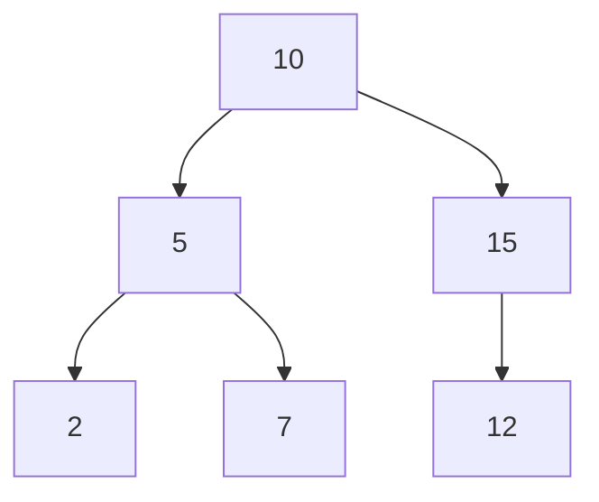

## 6a4.1. בדיקת שוויון בין עצים בינאריים {#id6a4.1.}

עליכם לממש פונקציה חיצונית בשם `AreTreesIdentical` אשר מקבלת שני פרמטרים:

1. tree1 - עץ בינארי (מסוג BinNode) המייצג את העץ הראשון.
2. tree2 - עץ בינארי (מסוג BinNode) המייצג את העץ השני.

הפונקציה צריכה להחזיר `true` אם שני העצים זהים לחלוטין במבנה ובערכים, ו-`false` אחרת.

### דגשים

1. השתמשו בגישה רקורסיבית לפתרון הבעיה.
2. שימו לב למקרי קצה:
3. אם שני העצים ריקים (null), הם נחשבים זהים.
4. אם רק אחד מהעצים ריק והשני לא, הם אינם זהים.
5. עבור עצים שאינם ריקים, יש להשוות את ערכי השורשים שלהם, וכן להשוות באופן רקורסיבית את תתי-העצים השמאליים ואת תתי-העצים הימניים.

### דוגמאות

1. עצים זהים:

    עץ 1:

    ```mermaid
    flowchart TB
      A[1] --> B[2]:::leaf
      A --> C[3]:::leaf
    ```

    עץ 2:

    ```mermaid
    flowchart TB
      D[1] --> E[2]:::leaf
      D --> F[3]:::leaf
    ```

    הפלט יהיה: `True`

2. עצים שאינם זהים (ערך שונה):

    עץ 1:

    ```mermaid
    flowchart TB
      A[1] --> B[2]:::leaf
      A --> C[3]:::leaf
    ```

    עץ 2:

    ```mermaid
    flowchart TB
      D[1] --> E[2]:::leaf
      D --> F[4]:::leaf
    ```

    הפלט יהיה: `False`

3. עצים שאינם זהים (מבנה שונה):

    עץ 1:

    ```mermaid
    flowchart TB
      A[1] --> B[2]:::leaf
      A --> C[3]:::leaf
    ```

    עץ 2:

    ```mermaid
    flowchart TB
      D[1] --> E[2]:::leaf
    ```

    הפלט יהיה: `False`

4. שני עצים ריקים:

    עץ 1:

    ```mermaid
    flowchart TB
      A[null]:::leaf
    ```

    עץ 2:

    ```mermaid
    flowchart TB
      B[null]:::leaf
    ```

    הפלט יהיה `True`

## 6a4.2. תמונת ראי של עצים בינאריים {#id6a4.2.}

עליכם לממש פעולה חיצונית (לא חלק ממחלקת BinNode) בשם `AreMirror` אשר מקבלת שני פרמטרים:

1. tree1 - מצביע לשורש של עץ בינארי (מסוג BinNode)
2. tree2 - מצביע לשורש של עץ בינארי (מסוג BinNode)

הפעולה צריכה להחזיר `true` אם שני העצים הם תמונת ראי מבחינת המבנה שלהם, ו-`false` אחרת.

הגדרה לתמונת ראי:
שני עצים בינאריים `T1` ו-`T2` הם תמונת ראי אם:

1. שניהם ריקים (כלומר, שניהם null).
2. שניהם אינם ריקים, והתנאים הבאים מתקיימים:
3. הערכים בצמתי השורש שלהם שווים (tree1.GetValue() == tree2.GetValue()).
4. העץ השמאלי של T1 (tree1.GetLeft()) הוא תמונת ראי של העץ הימני של T2 (tree2.GetRight()).
5. העץ הימני של T1 (tree1.GetRight()) הוא תמונת ראי של העץ השמאלי של T2 (tree2.GetLeft()).

דגשים

1. הפעולה צריכה להיות סטטית (static).
2. השתמשו במחלקת BinNode.
3. אין צורך לטפל במקרים בהם הערכים בצמתים שונים, רק במבנה.
4. אין צורך לטפל במקרים בהם אחד מהעצים הוא null והשני לא, או במקרים של עצים לא חוקיים (לדוגמה, צמתים שמצביעים על עצמם).

עליכם לממש פעולה חיצונית (לא חלק ממחלקת BinNode) בשם `AreMirror` אשר מקבלת שני פרמטרים:

1. tree1 - מצביע לשורש של עץ בינארי (מסוג BinNode)
2. tree2 - מצביע לשורש של עץ בינארי (מסוג BinNode)

הפעולה צריכה להחזיר `true` אם שני העצים הם תמונת ראי מבחינת המבנה שלהם, ו-`false` אחרת.

**הגדרה לתמונת ראי:**
שני עצים בינאריים `T1` ו-`T2` הם תמונת ראי אם:

1. שניהם ריקים (כלומר, שניהם null).
2. שניהם אינם ריקים, והתנאים הבאים מתקיימים:
3. הערכים בצמתי השורש שלהם שווים (tree1.GetValue() == tree2.GetValue()).
4. העץ השמאלי של T1 (tree1.GetLeft()) הוא תמונת ראי של העץ הימני של T2 (tree2.GetRight()).
5. העץ הימני של T1 (tree1.GetRight()) הוא תמונת ראי של העץ השמאלי של T2 (tree2.GetLeft()).

דגשים

1. הפעולה צריכה להיות סטטית (static).
2. השתמשו במחלקת BinNode.
3. אין צורך לטפל במקרים בהם הערכים בצמתים שונים, רק במבנה.
4. אין צורך לטפל במקרים בהם אחד מהעצים הוא null והשני לא, או במקרים של עצים לא חוקיים (לדוגמה, צמתים שמצביעים על עצמם).

## 6a4.3. עדכון עלי עץ בינארי לערך האב {#id6a4.3.}

עליכם לממש פונקציה חיצונית בשם `UpdateLeavesWithParentValue` אשר מקבלת פרמטר אחד:

1. tree - עץ בינארי (מסוג BinNode) של מספרים שלמים.

הפונקציה צריכה לעדכן את ערכו של כל צומת שהינו עלה (צומת שאין לו ילדים) להיות זהה לערכו של אביו.

דרישות:

1. יש לעבור על העץ באופן רקורסיבי.
2. הפונקציה צריכה להיות חיצונית, כלומר לא מתודה של המחלקה BinNode.
3. אם העץ ריק (null) או אם העץ מכיל רק שורש בודד (אין לו ילדים), אין לבצע שינוי כלשהו.
4. יש להשתמש במחלקת BinNode ובפונקציות העזר של BinTreeUtils במידת הצורך.

הנחיות למימוש רקורסיבי:

1. הפונקציה הרקורסיבית העיקרית תקבל את העץ כפרמטר.
2. בתוך הפונקציה העיקרית, קראו לפונקציית עזר רקורסיבית שתקבל את הצומת הנוכחי ואת הצומת האב שלו.
3. מקרה בסיס: אם הצומת הנוכחי הוא null, עצרו.
4. מקרה רקורסיבי:
5. אם הצומת הנוכחי הוא עלה (אין לו ילד שמאלי ואין לו ילד ימני) ואינו השורש (כלומר, יש לו אב), עדכנו את ערכו לערך של האב.
6. קראו באופן רקורסיבי עבור הילד השמאלי, העבירו את הצומת הנוכחי כאב.
7. קראו באופן רקורסיבי עבור הילד הימני, העבירו את הצומת הנוכחי כאב.

שימו לב:

1. הפונקציה לא צריכה להחזיר ערך (void).
2. אין צורך לטפל במקרי קצה של עצים לא חוקיים (לדוגמה, עץ עם לולאות).

### דוגמאות

1. עבור העץ:

    ```mermaid
    flowchart TB
      A[10] --> B[5]
      A --> C[15]
      B --> D[2]:::leaf
      B --> E[7]:::leaf
      C --> F[12]:::leaf
      C --> G[18]:::leaf
    ```

    לאחר הפעלת הפונקציה, העלים (2, 7, 12, 18) יקבלו את ערכי הוריהם:

    1. 2 יהפוך ל-5
    2. 7 יהפוך ל-5
    3. 12 יהפוך ל-15
    4. 18 יהפוך ל-15

    העץ יעודכן ל:

    ```mermaid
    flowchart TB
      A[10] --> B[5]
      A --> C[15]
      B --> D[5]:::leaf
      B --> E[5]:::leaf
      C --> F[15]:::leaf
      C --> G[15]:::leaf
    ```

2. עבור העץ:

    ```mermaid
    flowchart TB
      A[1] --> B[2]:::leaf
      A --> C[3]:::leaf
    ```

    לאחר הפעלת הפונקציה, העלים (2, 3) יקבלו את ערכי הוריהם:

    1. 2 יהפוך ל-1
    2. 3 יהפוך ל-1

    העץ יעודכן ל:

    ```mermaid
    flowchart TB
      A[1] --> B[1]:::leaf
      A --> C[1]:::leaf
    ```

## 6a4.4. מחיקת צמתי בן יחיד מעץ בינארי {#id6a4.4.}

עליכם לכתוב פונקציה סטטית בשם `DeleteSingleChildNodes` המקבלת כקלט שורש של עץ בינארי. הפונקציה צריכה למחוק כל צומת בעץ שהינו שיש לו רק צאצא אחד - ימני או שמאלי.

אם לצומת  בן יחיד, הצומת יימחק והבן היחיד שלו יתפוס את מקומו.

אין לשנות את ערכי הצמתים, אלא לחבר מחדש את החוליות (pointers). אם השורש עצמו הוא בן יחיד (כלומר, אין לו אח) והוא נמחק לפי הכלל, הפונקציה צריכה להחזיר את בנו היחיד כשורש החדש של העץ.

### קלט

הפונקציה מקבלת קלט מסוג `BinNode`

### פלט

הפונקציה מחזירה  `BinNode`

### דוגמאות עצים לפני ואחרי מחיקת בן יחיד

1. דוגמת  עץ פשוט

    **לפני:**

    ```mermaid
    flowchart TB
      A[10] --> B[5]
      B --> C[3]:::leaf
    ```

    **אחרי:**

    ```mermaid
    flowchart TB
      A[3]:::leaf
    ```

    הסבר:

    1. הצומת 5 הוא בן יחיד (יש לו רק בן שמאלי 3) ולכן נמחק
    2. השורש 10 הוא בן יחיד (יש לו רק בן שמאלי 5) ולכן גם נמחק
    3. הצומת 3 הופך לשורש החדש

1. דוגמת  עץ מורכב יותר

    **לפני:**

    ```mermaid
    flowchart TB
      A[20] --> B[10]
      A --> C[30]
      B --> D[5]
      D --> E[3]:::leaf
      D --> F[7]:::leaf
      C --> G[40]
      G --> H[50]:::leaf
    ```

    **אחרי:**

    ```mermaid
    flowchart TB
      A[20] --> B[5]
      A --> C[50]
      B --> D[3]:::leaf
      B --> E[7]:::leaf
    ```

    הסבר:

    1. הצומת 20 לא נמחק (יש לו שני בנים)
    2. הצומת 30 נמחק (יש לו רק בן ימני 40)
    3. הצומת 40 נמחק (יש לו רק בן ימני 50)
    4. הצומת 50 תופס את מקומם

1. דוגמת  שורש שנמחק

    **לפני:**

    ```mermaid
    flowchart TB
      A[10] --> B[20]
      B --> C[15]:::leaf
      B --> D[25]:::leaf
    ```

    **אחרי:**

    ```mermaid
    flowchart TB
      A[20] --> B[15]:::leaf
      A --> C[25]:::leaf
    ```

    הסבר:

    השורש 10 הוא בן יחיד (יש לו רק בן ימני) ונמחק. הצומת 20 הופך לשורש החדש.

1. דוגמת  שרשרת של בני יחיד

    **לפני:**

    ```mermaid
    flowchart TB
      A[50] --> B[40]
      B --> C[30]
      C --> D[25]:::leaf
      C --> E[35]:::leaf
    ```

    **אחרי:**

    ```mermaid
    flowchart TB
      A[30] --> B[25]:::leaf
      A --> C[35]:::leaf
    ```

    הסבר:

    1. הצומת 40 נמחק (יש לו רק בן ימני 30)
    2. השורש 50 גם נמחק (יש לו רק בן ימני 40)
    3. הצומת 30 הופך לשורש החדש

1. דוגמת  עץ שלא משתנה

    **לפני ואחרי:**

    ```mermaid
    flowchart TB
      A[15] --> B[10]
      A --> C[20]
      B --> D[5]:::leaf
      B --> E[12]:::leaf
      C --> F[18]:::leaf
      C --> G[25]:::leaf
    ```

    הסבר:

    אף צומת לא נמחק כי כל הצמתים או שיש להם שני בנים או שאין להם בנים כלל.

**הכללים:**

1. צומת נמחק אם יש לו רק צאצא אחד (ימני או שמאלי)
2. צומת לא נמחק אם יש לו שני צאצאים או אין לו צאצאים
3. כשצומת נמחק, הצאצא היחיד שלו תופס את מקומו
4. אם השורש נמחק, הפונקציה מחזירה את הצאצא כשורש חדש

## 6a4.5. הוספת בן שמאלי לעלי עץ בינארי {#id6a4.5.}

עליכם לממש פונקציה חיצונית בשם `AddLeftChildToLeaves` אשר מקבלת פרמטר אחד:

1. tree - עץ בינארי של מספרים שלמים (BinNode

הפונקציה צריכה לעבור על העץ ולכל עלה (צומת שאין לו בנים), להוסיף לו בן שמאלי חדש. ערכו של הבן השמאלי החדש צריך להיות זהה לערכו של העלה.

הנחיות למימוש:

1. השתמשו במחלקת BinNode עבור צמתי העץ.
2. עליכם למצוא דרך לגשת לערך האב של כל עלה. ניתן לעשות זאת באמצעות מעבר רקורסיבי על העץ תוך העברת האב כפרמטר, או באמצעות מעבר איטרטיבי עם עזרת מחסנית/תור ושמירת מידע על האב.
3. אם העץ ריק (null), הפונקציה לא צריכה לעשות דבר.

שימו לב:

1. הפונקציה אינה מחזירה ערך (void).
2. אין צורך לטפל במקרי קצה של עץ ריק או עץ עם צומת בודד, אלא ליישם את הלוגיקה הכללית.

### דוגמאות

1. עבור העץ:

    ```mermaid
    flowchart TB
      A[10] --> B[5]
      A --> C[15]:::leaf
      B --> D[2]:::leaf
      B --> E[7]:::leaf
    ```

    העלים הם 2, 7, 15. לאחר הפעלת הפונקציה, העץ יהיה:

    ```mermaid
    flowchart TB
      A[10] --> B[5]
      A --> C[15]
      B --> D[2]
      B --> E[7]
      C --> F[15]
      D --> G[2]:::leaf
      E --> H[7]:::leaf
      F --> I[15]:::leaf
    ```

    ```text
    (הבן השמאלי של 2 הוא 2, של 7 הוא 7, ושל 15 הוא 15)
    ```

1. עבור העץ:

    ```mermaid
    flowchart TB
      A[20] --> B[10]:::leaf
      A --> C[30]
      C --> D[25]:::leaf
      C --> E[35]:::leaf
    ```

    העלים הם 10, 25, 35. לאחר הפעלת הפונקציה, העץ יהיה:

    ```mermaid
    flowchart TB
      A[20] --> B[10]
      A --> C[30]
      B --> D[10]:::leaf
      C --> E[25]
      C --> F[35]
      E --> G[25]:::leaf
      F --> H[35]:::leaf
    ```

    (הבן השמאלי של 10 הוא 10, של 25 הוא 25, ושל 35 הוא 35)

## 6a4.6. הוספת אח לבן יחיד בעץ בינארי {#id6a4.6.}

עליכם לממש פונקציה חיצונית בשם `AddSiblingToSingleChild` אשר מקבלת פרמטר אחד:

1. tree - עץ בינארי מסוג BinNode שהצמתים שלו הם מטיפוס שלם.

הפונקציה צריכה לעבור על העץ ולכל צומת שיש לו בן יחיד, להוסיף לו אח. האח החדש צריך להכיל ערך הקטן ב-1 מערכו של הבן היחיד הקיים.

### דגשים

1. יש להשתמש במחלקה BinNode.
2. הפונקציה אינה צריכה להחזיר ערך (void), אלא לשנות את העץ הקיים.
3. יש לטפל במקרים שבהם העץ ריק או שצומת מסוים הוא עלה (אין לו בנים).
4. אין לגעת בצמתים שיש להם שני בנים או כאלה שאין להם בנים כלל.
5. הפתרון צריך להיות יעיל ולעבור על העץ פעם אחת.

### דוגמאות

1. עבור העץ הבא:

    ```mermaid
    flowchart TB
      A[10] --> B[5]:::leaf
    ```

    לאחר הפעלת הפונקציה, העץ יהיה:

    ```mermaid
    flowchart TB
      A[10] --> B[5]:::leaf
      A --> C[4]:::leaf
    ```

1. עבור העץ הבא:

    ```mermaid
    flowchart TB
      A[20] --> C[15]:::leaf
    ```

    לאחר הפעלת הפונקציה, העץ יהיה:

    ```mermaid
    flowchart TB
      A[20] --> B[14]:::leaf
      A --> C[15]:::leaf
    ```

1. עבור העץ הבא:

    ```mermaid
    flowchart TB
      A[30]:::leaf
    ```

    לאחר הפעלת הפונקציה, העץ יישאר:

    ```mermaid
    flowchart TB
      A[30]:::leaf
    ```

## 6a4.7. כמות צמתים ברמה בעץ בינארי {#id6a4.7.}

עליכם לממש פונקציה חיצונית בשם `CountNodesAtLevel` אשר מקבלת שני פרמטרים:

1. tree - עץ בינארי של מספרים שלמים (מסוג BinNode)
2. level - מספר שלם המייצג את הרמה הרצויה (כאשר שורש העץ הוא ברמה 0)

הפונקציה צריכה להחזיר את כמות הצמתים הקיימים ברמה `level` הנתונה.

### הנחיות

1. יש להשתמש במחלקות המתאימות (למשל BinNode ו-Node).
2. ניתן להשתמש בגישה איטרטיבית (באמצעות תור) או רקורסיבית.

**לדוגמא** נתון העץ הבינארי הבא:



1. עבור רמה L = 0, הפלט יהיה: 1 (הצומת 10)
2. עבור רמה L = 1, הפלט יהיה: 2 (הצמתים 5, 15)
3. עבור רמה L = 2, הפלט יהיה: 3 (הצמתים 2, 7, 12)
4. עבור רמה L = 3, הפלט יהיה: 0 (אין צמתים ברמה זו)

## 6a4.8 גדר העץ הבינארי {#id6a4.8}

במשימה זו, עליכם לממש פעולה בשם `GetTreeFence` בתוך מחלקה סטטית בשם `Solution`. הפעולה תקבל כפרמטר עץ בינארי מסוג `BinNode` ותחזיר רשימת חוליות מסוג `Node` המייצגת את 'גדר העץ'.

'גדר העץ' מוגדרת כמסלול המורכב משלושה חלקים:

1. המסלול מהעלה הימני ביותר אל השורש: התחילו מהצומת הימני ביותר בעץ. עקבו אחר המסלול כלפי מעלה לכיוון השורש. כל צומת במסלול זה (כולל העלה הימני ביותר) צריך להיכלל ברשימה. אם צומת הוא ילד שמאלי של ההורה שלו, הוא לא חלק מהגדר הימנית.
2. השורש: השורש עצמו הוא חלק מ'גדר העץ'.
3. המסלול מהשורש אל העלה השמאלי ביותר: התחילו מהשורש ורדו כלפי מטה לכיוון הצומת השמאלי ביותר. כל צומת במסלול זה (כולל העלה השמאלי ביותר) צריך להיכלל ברשימה. אם צומת הוא ילד ימני של ההורה שלו, הוא לא חלק מהגדר השמאלית.

הנחיות למימוש:

1. הפעולה GetTreeFence צריכה להיות סטטית.
2. הפעולה תקבל BinNode כפרמטר ותחזיר Node.
3. הסדר ברשימת החוליות צריך להיות: עלה ימני ביותר -> צמתים בדרך הימנית העולה לשורש -> שורש -> צמתים בדרך השמאלית היורדת מהשורש -> עלה שמאלי ביותר.

### דוגמאות יצירת העץ וקריאה לפעולה

1. דוגמת עץ פשוט

    ```csharp
    // יצירת עץ לדוגמה
    BinNode
    root.Left = new BinNode
    root.Right = new BinNode
    root.Left.Left = new BinNode
    root.Left.Right = new BinNode
    root.Right.Left = new BinNode
    root.Right.Right = new BinNode

    // קריאה לפעולה
    Node

    // הדפסת התוצאה
    Node
    while (current != null)
    {
    Console.Write(current.Value + " ");
    current = current.Next;
    }
    ```

    פלט צפוי: G C A B D

1. דוגמת עץ עם ענפים חסרים

    ```csharp
    // יצירת עץ לדוגמה
    BinNode
    root2.Left = new BinNode
    root2.Right = new BinNode
    root2.Left.Left = new BinNode
    root2.Right.Right = new BinNode

    // קריאה לפעולה
    Node

    // הדפסת התוצאה
    Node
    while (current2 != null)
    {
    Console.Write(current2.Value + " ");
    current2 = current2.Next;
    }
    ```

    פלט צפוי: Q Z X Y P

## 6a4.9 מסלול עולה בעץ בינארי {#id6a4.9}

במשימה זו, עליכם לכתוב פעולה סטטית בשם `HasAscendingPath` במחלקה `Solution` שתקבל כפרמטר שורש של עץ בינארי (מסוג `BinNode`) ותחזיר `true` אם קיים בעץ מסלול מהשורש לעלה שבו הערכים ממוינים בסדר עולה. אחרת, הפעולה תחזיר `false`.

### הנחיות

חתימת הפעולה: הפעולה צריכה להיות סטטית ולהתאים לחתימה הבאה:

1. public static bool HasAscendingPath(BinNode tree)

הגדרת מסלול עולה: מסלול נחשב עולה אם כל צומת במסלול (למעט השורש) מכיל ערך גדול או שווה לערך של הצומת הקודם לו במסלול.

מסלול מהשורש לעלה: עליכם לבדוק מסלולים שמתחילים בצומת השורש ומסתיימים בצומת עלה (צומת שאין לו ילדים).

מבנה הנתונים `BinNode`: המחלקה `BinNode` ניתנת לכם לשימוש. היא כוללת את המתודות הבאות:

1. public int GetValue(): מחזירה את ערך הצומת.
2. public BinNode GetLeft(): מחזירה את ילד שמאל של הצומת.
3. public BinNode GetRight(): מחזירה את ילד ימין של הצומת.
4. public bool HasLeft(): מחזירה true אם לצומת יש ילד שמאל.
5. public bool HasRight(): מחזירה true אם לצומת יש ילד ימין.
6. public bool IsLeaf(): מחזירה true אם הצומת הוא עלה (אין לו ילדים).

פתרון רקורסיבי: מומלץ לממש את הפתרון באמצעות רקורסיה. ייתכן שתצטרכו פונקציית עזר רקורסיבית שתקבל פרמטרים נוספים (למשל, הערך של הצומת הקודם במסלול).

### דוגמאות

1. עץ עם מסלול עולה קיים:

    ```mermaid
    flowchart TB
      A[1] --> B[2]
      A --> C[3]
      B --> D[4]:::leaf
      C --> E[5]:::leaf
    ```

    ```csharp
    BinNode root = new BinNode(1);
    root.SetLeft(new BinNode(2));
    root.SetRight(new BinNode(3));
    root.GetLeft().SetLeft(new BinNode(4));
    root.GetRight().SetLeft(new BinNode(5));

    // המסלול 1 -> 2 -> 4 הוא מסלול עולה.
    // המסלול 1 -> 3 -> 5 הוא מסלול עולה.

    Console.WriteLine(Solution.HasAscendingPath(root)); // פלט: True
    ```

1. עץ ללא מסלול עולה:

    ```mermaid
    flowchart TB
      A[5] --> B[2]
      A --> C[8]
      B --> D[1]:::leaf
      C --> E[7]:::leaf
    ```

    ```csharp
    BinNode root = new BinNode(5);
    root.SetLeft(new BinNode(2));
    root.SetRight(new BinNode(8));
    root.GetLeft().SetLeft(new BinNode(1));
    root.GetRight().SetLeft(new BinNode(7));

    // המסלול 5 -> 2 -> 1 אינו עולה (5 > 2).
    // המסלול 5 -> 8 -> 7 אינו עולה (8 > 7).

    Console.WriteLine(Solution.HasAscendingPath(root)); // פלט: False
    ```

1. עץ עם מסלול עולה חלקי אך לא עד עלה:

    ```mermaid
    flowchart TB
      A[1] --> B[2]
      A --> C[0]:::leaf
      B --> D[3]:::leaf
      B --> E[4]:::leaf
    ```

    ```csharp
    BinNode root = new BinNode(1);
    root.SetLeft(new BinNode(2));
    root.SetRight(new BinNode(0));
    root.GetLeft().SetLeft(new BinNode(3));
    root.GetLeft().SetRight(new BinNode(4));

    // המסלול 1 -> 2 -> 3 הוא עולה.
    // המסלול 1 -> 2 -> 4 הוא עולה.
    // המסלול 1 -> 0 אינו עולה.

    Console.WriteLine(Solution.HasAscendingPath(root)); // פלט: True
    ```

## 6a4.10 סכום מקסימלי של מסלול בעץ בינארי {#id6a4.10}

לפעמים בחיים, אנחנו צריכים למצוא את הדרך הטובה ביותר מנקודה אחת לאחרת, בין אם זה המסלול המהיר ביותר ב-GPS, או הנתיב הרווחי ביותר בעסק. בתכנות, עצים בינאריים יכולים לייצג מגוון רחב של מבנים היררכיים, כמו מערכת קבצים, יחסי משפחה או אפשרויות קבלת החלטות. למשל, דמיינו שאתם מפתחים אלגוריתם למשחק אסטרטגיה שבו כל צומת בעץ מייצג החלטה, והערך שלו הוא הניקוד שתקבלו. המטרה שלכם היא למצוא את סדרת ההחלטות (המסלול מהשורש לעלה) שתיתן לכם את הניקוד הגבוה ביותר. התרגיל הזה ילמד אתכם איך לנווט בעצים כדי למצוא את המסלול האופטימלי, מיומנות קריטית בעולם פתרון הבעיות.

עליכם לממש פונקציה בשם `FindMaxPathSum` שתקבל כפרמטר צומת שורש של עץ בינארי מסוג `BinNode`. מטרת הפונקציה היא למצוא את המסלול מהשורש (הצומת שהתקבל כפרמטר) לעלה (צומת ללא בנים) בעץ, כך שסכום ערכי הצמתים במסלול זה יהיה הגדול ביותר האפשרי. הפונקציה צריכה להחזיר את סכום המסלול המקסימלי הזה.

שימו לב לדרישות הבאות:

- שם הפונקציה חייב להיות `FindMaxPathSum`.
- הפונקציה תקבל פרמטר אחד מסוג `BinNode

### קלט

הפונקציה תקבל כפרמטר יחיד אובייקט מסוג `BinNode

### פלט

הפונקציה תחזיר ערך מספרי שלם (int) המייצג את סכום המסלול המקסימלי מהשורש לעלה בעץ הבינארי.

### דוגמאות

1. קלט: עץ:

    ```mermaid
    flowchart TB
      A[10] --> B[5]
      A --> C[15]:::leaf
      B --> D[2]:::leaf
      B --> E[7]:::leaf
    ```

    פלט: 30
    (המסלול הוא 10 -> 5 -> 15 או 10 -> 15)

1. קלט: עץ:

    ```mermaid
    flowchart TB
      A[-10] --> B[-5]:::leaf
      A --> C[-15]:::leaf
    ```

    פלט: -15
    (המסלול הוא -10 -> -5)

1. קלט: עץ:

    ```mermaid
    flowchart TB
      A[1] --> B[2]:::leaf
      A --> C[3]
      C --> D[4]:::leaf
      C --> E[5]:::leaf
    ```

    פלט: 9
    (המסלול הוא 1 -> 3 -> 5)

1. קלט: עץ ריק (null)

    ```mermaid
    flowchart TB
      A[null]:::leaf
    ```

    פלט: 2147483648-
    (int.MinValue)
