## 6A5.1 MirrorTree {#id6a5.1}

כתבו פעולה בשם `MirrorTree`, המקבלת עץ בינארי `BinNode⟨int⟩ t`, והופכת אותו לעץ המראה שלו.

עץ מראה הוא עץ שבו בכל צומת שאינו עלה, הבן השמאלי והבן הימני מוחלפים זה בזה.

לדוגמה, עבור העץ הבא:

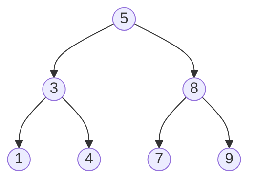

לאחר הפעלת הפעולה יתקבל עץ המראה:

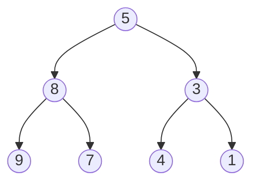

## 6a5.2 IsSymmetric {#id6a5.2}

כתבו פעולה בשם `IsSymmetric`, המקבלת עץ בינארי `BinNode⟨int⟩ t`, ומחזירה `true` אם העץ סימטרי סביב הצומת `t`, אחרת הפעולה תחזיר `false`.

עץ סימטרי הוא עץ שהוא תמונת מראה של עצמו, כלומר תת העץ השמאלי ותת העץ הימני הם תמונות מראה זה של זה.

לדוגמה, העץ הבא סימטרי:

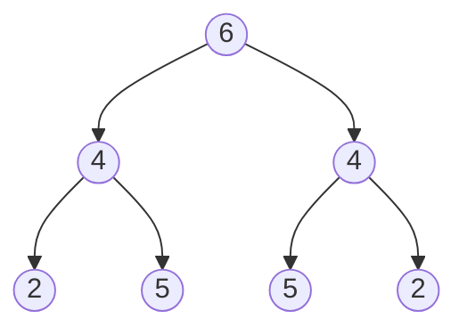

העץ הבא אינו סימטרי:

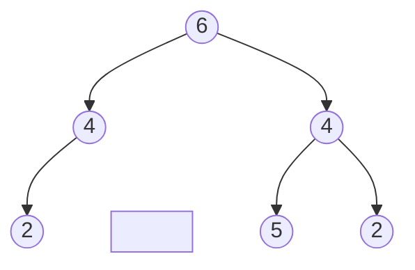

## 6a5.3 IsBalanced {#id6a5.3}

כתבו פעולה בשם `IsBalanced`, המקבלת עץ בינארי `BinNode⟨int⟩ t`, ומחזירה `true` אם העץ מאוזן לפי גובה, אחרת הפעולה תחזיר `false`.

עץ בינארי נחשב מאוזן לפי גובה אם בכל צומת בעץ, ההפרש בערך מוחלט בין גובה תת העץ השמאלי לבין גובה תת העץ הימני הוא לכל היותר 1.

לדוגמה, העץ הבא מאוזן:

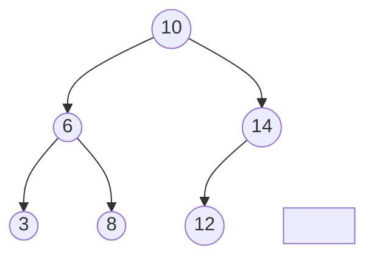

העץ הבא אינו מאוזן:

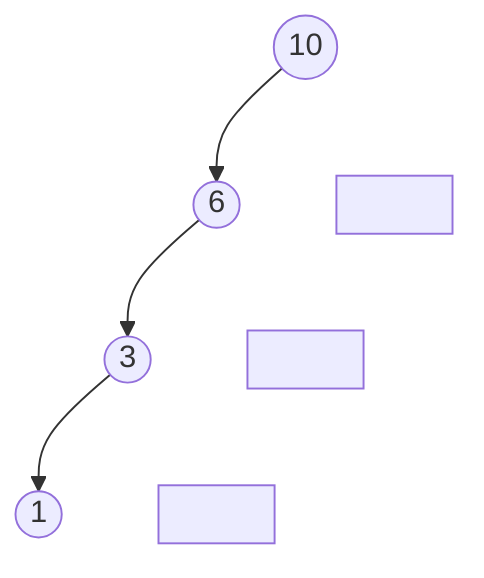

## 6a5.4 HasChildrenSumProperty {#id6a5.4}

כתבו פעולה בשם `HasChildrenSumProperty`, המקבלת עץ בינארי `BinNode⟨int⟩ t`, ומחזירה `true` אם בכל צומת בעץ ערך הצומת שווה לסכום הערכים של בניו המיידיים. אחרת הפעולה תחזיר `false`.

אם לצומת חסר בן שמאלי או בן ימני, יש להתייחס לערך של הבן החסר כאל 0. עלים נחשבים כצמתים שמקיימים את התכונה.

לדוגמה, העץ הבא מקיים את התכונה:

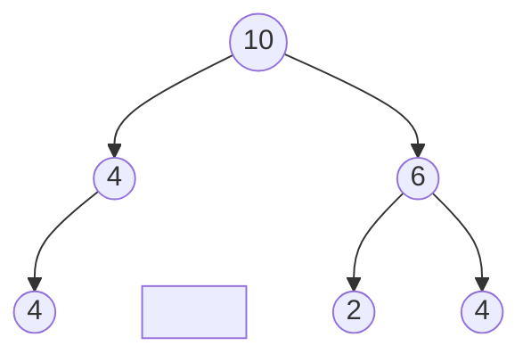

העץ הבא אינו מקיים את התכונה:

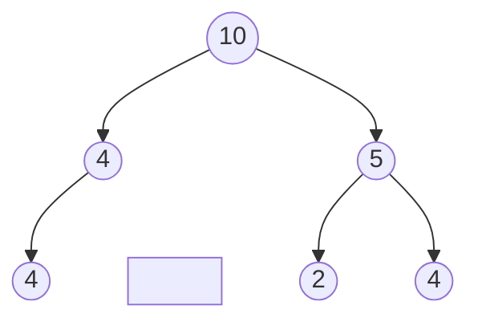

## 6a5.5 NodesAtDistanceK {#id6a5.5}

כתבו פעולה בשם `NodesAtDistanceK`, המקבלת עץ בינארי `BinNode⟨int⟩ tree`, צומת יעד בעץ `BinNode⟨int⟩ t`, ומספר שלם `k`, ומחזירה את כל הצמתים שנמצאים במרחק `k` מצומת היעד.

הנחיות:

- יש להחזיר את הרשימה בסדר ממוין.
- העץ אינו מכיל ערכים כפולים.

לדוגמה, בעץ הבא, אם צומת היעד הוא הצומת שערכו 3 ו־`k = 2`, הצמתים במרחק 2 הם 8 ו־1:

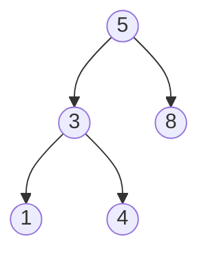

דוגמה נוספת, אם צומת היעד הוא הצומת שערכו 5 ו־`k = 1`, הצמתים במרחק 1 הם 3 ו־8:

## 6a5.6 IsSubtree {#id6a5.6}

כתבו פעולה בשם `IsSubtree`, המקבלת שני עצים בינאריים, `BinNode⟨int⟩ t1` ו־`BinNode⟨int⟩ t2`, ומחזירה `true` אם `t2` הוא תת עץ של `t1`, אחרת הפעולה תחזיר `false`.

עץ `t2` הוא תת עץ של `t1` אם ניתן לבחור צומת כלשהו בתוך `t1`, ולקחת ממנו את כל הצאצאים שלו. אם העץ שהתקבל זהה ל־`t2` גם במבנה וגם בערכי הצמתים, אז `t2` נחשב תת עץ של `t1`.

לדוגמה, בעץ `t1` הבא:

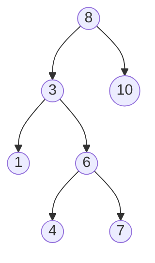

העץ `t2` הבא הוא תת עץ של `t1`:

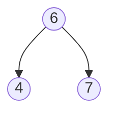
