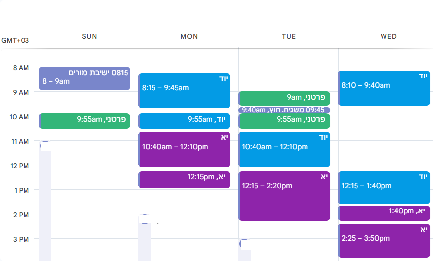

{: .box-note}
**מטרת המפגש**: להגדיר ציפיות, להציג דרישות עבודה וליישר קו כדי שתצליחו השנה.

## מה לומדים השנה

{: .leafify}
- 9 שעות שבועיות.
- מתחילים במבני נתונים: **רקורסיה** ⟵ **שרשרת חוליות** ⟵ מבנים נוספים.
- במקביל: חזרה על **מחלקות**: גם כדי למשוך עבורכם זמן. (עיכול החומר **ברקורסיה** לא פשוט)
- בהמשך נוסיף: **תכנות מונחה עצמים (OOP)** ו**פרויקט Android Studio**.
- החל מפברואר נפתור בגרויות, ואז ניבחן במתכונות ובבגרויות

<!-- תכנית עבודה מרמייד -->

%%{init: {
  "gantt": {
    "displayMode": "compact",
    "leftPadding": 60,
    "rightPadding": 20,
    "topPadding": 30,
    "gridLineStartPadding": 20,
    "barGap": 1,
    "barHeight": 14
  },
  "themeVariables": { "fontSize": "12px" }
} }%%
gantt
title תכנית עבודה – ספט׳ עד יוני 
dateFormat YYYY-MM-DD
axisFormat %b %Y

%% -----------------------------
%% חופשות למידה (בראש התרשים)
%% -----------------------------
section חופשות למידה
כיפור-סוכות :holiday1, 2025-10-01, 14d
חנוכה :holiday2, 2025-12-16, 7d
פסח :holiday3, 2026-03-24, 16d

%% -----------------------------
%% מסלול מבני נתונים (DS Core)
%% -----------------------------
section מבני נתונים
רקורסיה :active, recursion, 2025-09-01, 52d
שרשרת חוליות :ll, after recursion, 42d
מבנים נוספים :more, after ll, 37d

%% -----------------------------
%% חזרה על מחלקות – במקביל, החל שבועיים אחרי ההתחלה
%% -----------------------------
section חזרה על מחלקות 
מחלקות :classes, 2025-09-15, 20d

%% -----------------------------
%% OOP ו-Android Studio – החל חודשיים אחרי ההתחלה
%% -----------------------------
section OOP ו-Android Studio
OOP + Android Studio :oop, 2025-11-01, 2026-02-28

%% -----------------------------
%% Finals (טיימליין רביעי)
%% -----------------------------
section finals
תקופת המבחנים (Finals) :crit, finals, 2026-03-15, 75d

---

## חומרי עזר ומקורות
- **ספרים**: "מבט לחלונות" – _ניתן להסתדר גם בלעדיהם. כמו שנה שעברה_.
- **אתרי קורס**:
  - **מבני.שלי.com** – חומרי הלימוד המלווים.
  - **[campus.il המצגות](/mivney/0minhalot/ChapterCampus)** – תכנים משלימים.
  - [campus.il קישור לקורס](https://courses.campus.gov.il/courses/course-v1:MoE+EDU_Matric_ComputerScienceB_HE+2023_1/course/)

---

## הגשות וציון

{: .leafify}
- **הגשות**: 20%–25% מהציון, **90% מהלמידה וההשפעה על הציון בפועל**.
- עיקר ההגשות במערכת [**הגשות.שלי.com**](https://xn--6dbde3fg.xn--eebf2b.com/) -יהיו גם הגשות ב-**Google Classroom**. המערכת מאפשרת לפלטר את כמות המשימות שיש לפתור ב-3 רמות.
  - לעבוד בתחילה במוד של 66% הגשות. מי שינסו להיות על 100% יתכן שירגישו שעמוס מדי.
  - אם עמוס גם ב-66% - לעבור ל-33% **באופן זמני בלבד**.
  - לקראת בחינות להגיע ל-100%.
- בסופו של דבר תפתרו בין 150-200 תרגילים במבני נתונים. העומס עליכם הוא כמו בקורס של 9 שעות - פי 4 ממקצוע של שעתיים. תקדישו זמן באופן **פרופורציוני** להיקף הקורס.
- מי שלא יתרגלו בצורה עקבית – ירגישו פערים כבר בתחילת השנה.
- אירגון החומרים החשובים שלכם - **בקלאסרום**

<!-- תמונה מוצעת: צילום מסך של הגשות.שלי.com או אייקון "V" של הגשה -->

---

## למה להתחזק ברקורסיה כבר בהתחלה?
- קשה בהתחלה – אבל **המשך החומר נשען ישירות על רקורסיה**.
- השקעה מוקדמת מונעת פערים בהמשך.

<!-- תמונה מוצעת: תרשים זרימה קטן שממחיש קריאה רקורסיבית -->

## רף הקושי
- השנה, החומר **במבני נתונים** (בעיקר רקורסיה ושרשרת חוליות בתחילת השנה) **קשה משמעותית** לעומת השנה שעברה.
- זה **אפשרי** – עם תרגול, שאלות ושיתוף פעולה.

---

## מדיניות התנהלות בכיתה
- **כניסה לשיעור**: דקה **לפני** הזמן – לא דקה אחרי.
- **איחור**: לא להיכנס באמצע – לחכות בחוץ עד שאכניס.
- **טלפונים**: אסורים בשיעור.
- **מחשבים ניידים**: אפשרי אך לא חובה.
  - מי שרוכשים: מומלץ **מסך גדול**.
  - בבית מומלץ **לחבר מסך נוסף** ולעבוד על שני מסכים.
- אוכל - לבקש רשות. יהיה מותר/אסור לפי רמת הסדר המופתי שתשאירו אחריכם

<!-- תמונה מוצעת: אייקון "אין טלפונים" + תמונת סט-אפ עם שני מסכים -->

## תקשורת
- **וואטסאפ** – כמה שיותר בקבוצה (רוב הדברים רלוונטיים לכולם; חשוב לייצר שיח פתוח בקבוצה).
- שאלות פרטיות – אפשר בהודעה אישית, אך קודם לנסות בקבוצה.

<!-- תמונה מוצעת: אייקון/לוגו WhatsApp -->

## בחינות
- **סמסטר א׳**: שתי בחינות.
- **סמסטר ב׳**: בחינה + שתי **מתכונות** (כנראה). אתם ניגשים לשאלונים 899371 (יסודות) ו-899271 (מבני+תמ"ע). בשנה שעברה מבני היתה הבחינה הראשונה ויסודות אחר כך. זה בכל מקרה לא באותו תאריך.

---

## איך מצליחים בקורס

{: .leafify}
- מתרגלים הרבה ועקבי.
- שואלים כשלא ברור – גם שאלות "קטנות".
- מתחילים מוקדם את ההגשות ולא דוחים לרגע האחרון.
- עובדים בזוגות/קבוצות קטנות כשהדבר מתאים – לעזרה הדדית.

## AI

**המלצה גורפת: הימנעו משימוש ב- AI במבני נתונים**

{: .leafify}
- **אל תתנו ל-AI לפתור עבורכם שאלות**. יהיה לכם מספיק שימוש ב-AI **לדברים אחרים**. 
- יש ימים שבזכות ה-AI אני חי את החלום. יש לכם עוד כברת דרך ותגיעו גם אתם לשם.
- **טיפ:** שאלו אתכם שאלה. אל תשלחו קוד מלא לחברים. תנו **רעיון** או **כיוון** ותנו להם לעבוד – כך כולם לומדים.
- שלחו לכם פתרון מלא? **נסו להתעלם**. **אל תשרפו שאלות** סתם. אל תסתכלו. 
- **שרפתם שאלה?** נסו לפתור אותה שוב, שבוע לאחר מכן.
- אתם לא רוצים להיות התלמיד שסימנתי אצלי שהוא מגיש פתרונות AI.
- במבני נתונים, אם תשרפו הרבה שאלות, ה- AI יפגע לכם בהתפתחות החשיבה. חכו עם זה עד סוף מבני נתונים, לפחות. תשאירו את ה-AI לחלק של הלמידה, הסבר של פתרון, הרחבה על נושא, אבל אל תשרפו עליו את השאלות שלנו. אין לי מלאי בלתי מוגבל של שאלות.
- מי שחייבים לעבוד עם AI - תעבדו באנגלית למרות ש-AI עובד טוב מאד בעברית. בסוף בשוק העבודה זה יהיה עוד אחד מהאלמנטים המבדלים (differentiator).
- תנו לו את המחלקה. כדי שידע על ה-Getters && Setters that are NOT C# Native (Java style)

---

## תמיכת מורה ושעות עזר
- שעות פרטניות/תמיכה יתואמו ויעודכנו בהמשך (יפורסם בקבוצה). תשלחו לי **מערכת שעות** שלכם, ותדגישו מתי מסתיים יום הלימודים ומתי יש לכם **שעות חלון**.

<!-- תמונה מוצעת: אייקון מורה/עזרה -->

## תמיכת תלמידי יא' לכיתות יוד

{: .leafify}
- יש לכם **הזדמנות אמיתית לעזור** לתלמידי י' שמתחילים את דרכם ביסודות.
- מי שמעוניינים, מוזמנים להצטרף לשיעורים (בתנאי שזה לא פוגע בשיעור אחר שלכם, או בתיאום איתי ועם המורה השני, במקרים חריגים).
- ההשתתפות תורמת לידע, לחיבור ולתחושת השייכות – וגם לכם: **כשמסבירים, מבינים** ומחדדים יותר.
- נבדוק אפשרות שייחשב לכם כמעורבות חברתית.

## כלים וסביבות עבודה
- בתחילת השנה: מתמקדים בלוגיקה ובתרגול עצמאי. אפשר להעזר בחברים. לא להיעזר ב-AI לפתרון שאלות במבני נתונים. ברור שהוא יכול לפתור.
- פתרון השאלות - **רק ב- Visual Studio**. אחרי שיש פתרון עובד, מדביקים אותו במערכת הבדיקות ובודקים.
- לא לנסות להגיע לציון 100% במערכת. יתכנו שגיאות בבדיקות. גם אם הכל מושלם - לפעמים עדיף שתתקדמו לשאלות נוספות. אל תתחפרו בשאלה רק מפני שלא הכל עבר. אם גם אחרים הגיעו ל-80% אולי זה המקסימום. תתקדמו.
- מי שירצו לכתוב לעצמם בדיקות - אלמד איך
- בהמשך:  GitHub, Android Studio (לפרויקט).

---

## צ׳ק-ליסט פתיחת שנה
- הצטרפות לקבוצת הווטסאפ של הכיתה.
- גישה ל-**מבני.שלי.com** ו-**campus.il**.
- התחברות ל-**הגשות.שלי.com** עם משתמש "ההזדהות האחידה" של משרד החינוך.
- התחברות ל Classroom - רק בעוד כמה ימים.
- בדיקת סביבת עבודה בבית (מחשב, חיבור למסך נוסף אם אפשר).

---

## שאלות❓

## מערכת שעות כרגע:
