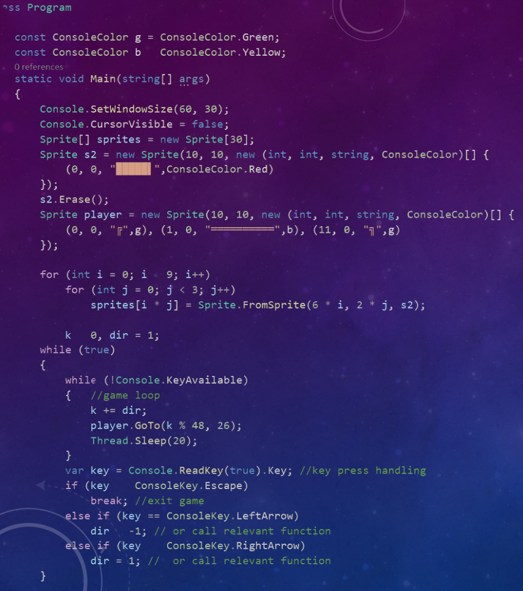
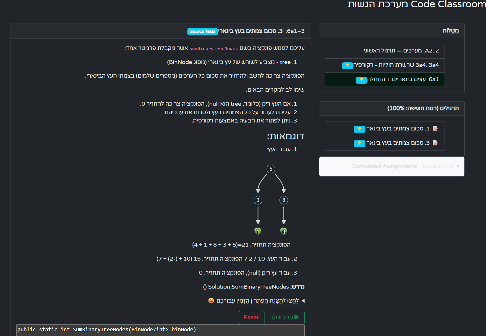
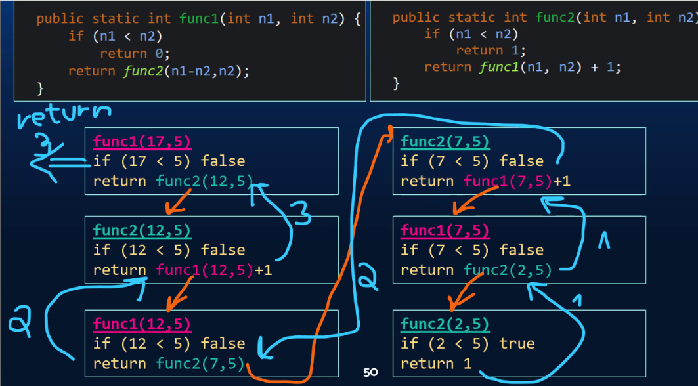

{: dir="rtl" }

# ברוכים הבאים

_מטרת המפגש_: להגדיר ציפיות, להציג דרישות עבודה וליישר קו להצלחה לאורך השנה.

---

## מה לומדים השנה
- 9 שעות שבועיות.
- מתחילים במבני נתונים: **רקורסיה** ⟵ **שרשרת חוליות** ⟵ מבנים נוספים.
- במקביל: חזרה על **מחלקות**: גם כדי למשוך עבורכם זמן. (עיכול החומר **ברקורסיה** לא פשוט)
- בהמשך נוסיף: **תכנות מונחה עצמים (OOP)** ו**פרויקט Android Studio**.
- והחל ממרץ נפתור בגרויות, וניבחן במתכונות

<!-- תמונה מוצעת: דיאגרמה פשוטה של התקדמות השנה (ציר זמן) -->

---
displayMode: compact
---
gantt
title תכנית עבודה – ספט׳ עד יוני 
dateFormat YYYY-MM-DD
axisFormat %b %Y

%% -----------------------------
%% חופשות למידה (בראש התרשים)
%% -----------------------------
section חופשות למידה
כיפור-סוכות :holiday1, 2025-10-01, 14d
חנוכה :holiday2, 2025-12-16, 7d
פסח :holiday3, 2026-03-24, 16d

%% -----------------------------
%% מסלול מבני נתונים (DS Core)
%% -----------------------------
section מבני נתונים
רקורסיה :active, recursion, 2025-09-01, 52d
שרשרת חוליות :ll, after recursion, 42d
מבנים נוספים :more, after ll, 37d

%% -----------------------------
%% חזרה על מחלקות – במקביל, החל שבועיים אחרי ההתחלה
%% -----------------------------
section חזרה על מחלקות 
מחלקות :classes, 2025-09-15, 20d

%% -----------------------------
%% OOP ו-Android Studio – החל חודשיים אחרי ההתחלה
%% -----------------------------
section OOP ו-Android Studio
OOP + Android Studio :oop, 2025-11-01, 2026-02-28

%% -----------------------------
%% Finals (טיימליין רביעי)
%% -----------------------------
section finals
תקופת המבחנים (Finals) :crit, finals, 2026-03-15, 75d

---

## חומרי עזר ומקורות
- **ספרים**: "מבט לחלונות" – _ניתן להסתדר גם בלעדיהם_.
- **אתרי קורס**:
  - **מבני.שלי.com** – חומרי הלימוד המלווים.
  - **[campus.il](mivney/0minhalot/ChapterCampus)** – תכנים משלימים.

---

## הגשות וציון
- **הגשות**: 20–25% מהציון, ו**~90% מהלמידה בפועל**.
- עיקר ההגשות במערכת **הגשות.שלי.com**; יהיו גם הגשות ב-**Google Classroom**.
- מי שלא יתרגלו בצורה עקבית – ירגישו פערים כבר בתחילת השנה.

<!-- תמונה מוצעת: צילום מסך של הגשות.שלי.com או אייקון "V" של הגשה -->

---

## למה להתחזק ברקורסיה כבר בהתחלה?
- קשה בהתחלה – אבל **המשך החומר נשען ישירות על רקורסיה**.
- השקעה מוקדמת מונעת פערים בהמשך.

<!-- תמונה מוצעת: תרשים זרימה קטן שממחיש קריאה רקורסיבית -->

---

## רף הקושי
- השנה חומר ה-**DS** (בעיקר רקורסיה ושרשרת חוליות בתחילת השנה) **קשה משמעותית** לעומת השנה שעברה.
- זה אפשרי – עם תרגול, שאלות ושיתוף פעולה.

---

## מדיניות התנהלות בכיתה
- **כניסה לשיעור**: דקה **לפני** הזמן – לא דקה אחרי.
- **איחור**: לא להיכנס באמצע – לחכות בחוץ עד שאכניס.
- **טלפונים**: אסורים בשיעור.
- **מחשבים ניידים**: אפשרי אך לא חובה.
  - מי שרוכשים: מומלץ **מסך גדול**.
  - בבית מומלץ **לחבר מסך נוסף** ולעבוד על שני מסכים.

<!-- תמונה מוצעת: אייקון "אין טלפונים" + תמונת סט-אפ עם שני מסכים -->

---

## תקשורת
- **וואטסאפ** – כמה שיותר בקבוצה (רוב הדברים רלוונטיים לכולם; חשוב לייצר שיח פתוח בקבוצה).
- שאלות פרטיות – אפשר בהודעה אישית, אך קודם לנסות בקבוצה.

<!-- תמונה מוצעת: אייקון/לוגו WhatsApp -->

---

## בחינות
- **סמסטר א׳**: שתי בחינות.
- **סמסטר ב׳**: בחינה + שתי **מתכונות**.

---

## איך מצליחים בקורס
- מתרגלים הרבה ועקבי.
- שואלים כשלא ברור – גם שאלות "קטנות".
- מתחילים מוקדם את ההגשות ולא דוחים לרגע האחרון.
- עובדים בזוגות/קבוצות קטנות כשהדבר מתאים – לעזרה הדדית.

{: .box-note }
> **טיפ:** אל תשלחו קוד מלא לחבר/ה. תנו **רעיון** או **כיוון** ותנו לחבר/ה לעבוד – כך כולם לומדים.

<!-- תמונה מוצעת: דימוי "Practice makes perfect" או אייקון אימון -->
_הוסף תמונה כאן: אייקון/איור על התמדה ותרגול_

---

## תמיכת מורה ושעות עזר
- שעות פרטניות/תמיכה יתואמו ויעודכנו בהמשך (יפורסם בקבוצה).

<!-- תמונה מוצעת: אייקון מורה/עזרה -->

---

## כלים וסביבות עבודה (גבוה-רמה)
- בתחילת השנה: מתמקדים בלוגיקה ובתרגול עצמאי.
- בהמשך: Visual Studio, GitHub, Android Studio (לפרויקט).

<!-- תמונה מוצעת: לוגואים של VS / GitHub / Android Studio בשורה אחת -->
_הוסף תמונה כאן: לוגואים של הכלים_

---

## צ׳ק-ליסט פתיחת שנה
- הצטרפות לקבוצת הווטסאפ של הכיתה.
- גישה ל-**מבני.שלי.com** ו-**campus.il**.
- הרשאות/גישה ל-**הגשות.שלי.com** + Classroom.
- בדיקת סביבת עבודה בבית (מחשב, חיבור למסך נוסף אם אפשר).

---

## שאלות?
_זמן לשאלות ותיאום ציפיות נוסף._

<!-- תמונה מוצעת: שקופית "Questions?" אינפוגרפית ונעימה -->
_הוסף תמונה כאן: שקופית שאלות מסכמת_

