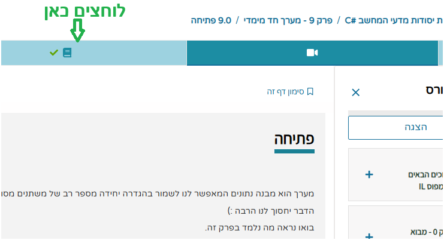

{: .box-note} 
בעמוד זה תמצאו קישורים למצגות קמפוס, ולקורס עצמו, והסברים על עבודה בתוך הקורס.

[campus.il קישור לקורס עצמו](https://courses.campus.gov.il/courses/course-v1:MoE+EDU_Matric_ComputerScienceB_HE+2023_1/course/)

## כיצד להגיע למצגות קמפוס מבני נתונים

סדר הפרקים כאן - לפי סדר ההוראה

[פרק 2 - רקורסיה](https://lomdot.education.gov.il/Qualitest/CS02-recursion_new/index.html)

[פרק 1 - ניתוח זמן ריצה](https://lomdot.education.gov.il/Qualitest/CS01-runTime/index.html){:target="_blank"}

[פרק 5 - שרשרת חוליות](https://lomdot.education.gov.il/Qualitest/CS05-intNode_new/index.html){:target="_blank"}

[פרק 4 - מחסנית](https://lomdot.education.gov.il/Qualitest/CS04-stack_new/index.html){:target="_blank"}

[פרק 3 - תור](https://lomdot.education.gov.il/Qualitest/CS03-queue/index.html){:target="_blank"}

[פרק 6 - עצים בינאריים](https://lomdot.education.gov.il/Qualitest/CS06-trees/index.html){:target="_blank"}

[פרק 7 - בחינות סיכום](https://app.campus.gov.il/learning/course/course-v1:MoE+EDU_Matric_ComputerScienceB_HE+2023_1/block-v1:MoE+EDU_Matric_ComputerScienceB_HE+2023_1+type@sequential+block@5887c3183efb4cc9a9b0c71ad74d869a){:target="_blank"}

[פרק בחינות בגרות](https://app.campus.gov.il/learning/course/course-v1:MoE+EDU_Matric_ComputerScienceB_HE+2023_1/block-v1:MoE+EDU_Matric_ComputerScienceB_HE+2023_1+type@sequential+block@05799afecaf245a5b09887dd55924a41){:target="_blank"}

---

## במידה שזה לא נפתח או לא עדכני:

**במידה שלא, אתם נגשים לתת פרק 0. כאן בדוגמא, 9.0 ביסודות, ובוחרים בלשונית השמאלית:**

ולוחצים כדי לפתוח את המצגת במסך מלא

---

## כיצד להגיע למצגות קמפוס יסודות

חלק מהקישורים פשוט מובילים למצגות:

[פרק 1 הוראות הדפסה ומשתנים](https://lomdot.education.gov.il/Qualitest/CSA01-variables/index.html){:target="_blank"}

[פרק 2 אופרטורים וביטויים לוגיים](https://lomdot.education.gov.il/Qualitest/CSA02-operators_new/index.html){:target="_blank"}

[פרק 3 המחלקה Math](https://lomdot.education.gov.il/Qualitest/CSA03-MathLibrary/index.html){:target="_blank"}

[פרק 4 תנאים](https://lomdot.education.gov.il/Qualitest/CSA04-if/index.html){:target="_blank"}

[פרק 5 לולאות for](https://lomdot.education.gov.il/Qualitest/CSA05-for/index.html){:target="_blank"}

[פרק 6 לולאות while](https://lomdot.education.gov.il/Qualitest/CSA06-while/index.html){:target="_blank"}

[פרק 7 פעולות](https://lomdot.education.gov.il/Qualitest/CSA07-actions/index.html){:target="_blank"}

[פרק 8 מחרוזות](https://lomdot.education.gov.il/Qualitest/CSA08-strings/index.html){:target="_blank"}

[פרק 9 מערך חד ממדי](https://lomdot.education.gov.il/Qualitest/CSA09-1D/index.html){:target="_blank"}

[פרק 10 מערך דו ממדי](https://lomdot.education.gov.il/Qualitest/CSA10-2D/index.html){:target="_blank"}

[פרק 11 עצמים](https://lomdot.education.gov.il/Qualitest/CSA11A-objects/index.html){:target="_blank"}

[פרק 12 הורשה ](https://lomdot.education.gov.il/Qualitest/CSA11C-abstract/index.html){:target="_blank"}

[פרק 13 פולימורפיזם ](https://lomdot.education.gov.il/Qualitest/CSA12/index.html){:target="_blank"}

[פרק 14 ממשקים ](https://lomdot.education.gov.il/Qualitest/CSA13/index.html){:target="_blank"}

