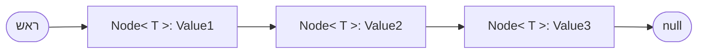

{: .box-note}
נתחיל במחלקה **Bead**, המייצגת חרוז בעל צבע וקישור לחרוז הבא. נבנה שרשרת חרוזים, נלמד כיצד לעבור בין החרוזים, ואז נכליל את אותו רעיון לחוליות מטיפוס `Node<T>`.

<style>
.bead-methods-table th:last-child,
.bead-methods-table td:last-child,
.node-methods-table th:last-child,
.node-methods-table td:last-child {
  direction: ltr;
  text-align: left;
}
.bead-methods-table code,
.node-methods-table code {
  direction: ltr;
  unicode-bidi: isolate;
}
</style>

## מתחילים בחרוז אחד: המחלקה Bead

כל אובייקט מסוג `Bead` מייצג **חרוז אחד**, ובו שני שדות:

- `color` — צבע החרוז, מטיפוס `string`.
- `nextBead` — הפניה לחרוז הבא, מטיפוס `Bead`. הערך `null` מציין שאין חרוז אחריו.

השדה `nextBead` מחזיק הפניה לאובייקט אחר, ולא עותק שלו. כך כמה חרוזים נפרדים יכולים להתחבר לשרשרת אחת.

<details open markdown="1">
<summary>קוד המחלקה Bead — כפי שהיא נתונה בתרגילים</summary>

זהו המימוש מתוך [תרגילי שרשרת החרוזים](), עם הזחה לקריאה נוחה.

```csharp
public class Bead
{
    private string color;
    private Bead nextBead;

    // קונסטרוקטורים
    public Bead(string color) { this.color = color; this.nextBead = null; }
    public Bead(string color, Bead nextBead) { this.color = color; this.nextBead = nextBead; }

    // מתודות Getters
    public string GetColor() { return color; }
    public Bead GetNextBead() { return nextBead; }

    // מתודת Setter
    public void SetNextBead(Bead nextBead) { this.nextBead = nextBead; }

    // מתודת ToString
    public override string ToString() { return color; }

}
```

</details>

### הפעולות של Bead

השדות פרטיים (`private`), ולכן ניגשים אליהם באמצעות הפעולות הציבוריות של המחלקה.

| תפקיד | פעולה |
|---:|:---|
| יוצרת חרוז עם צבע וללא חרוז הבא (`null`) | `Bead(string color)` |
| יוצרת חרוז עם צבע והפניה לחרוז הבא | `Bead(string color, Bead nextBead)` |
| מחזירה את צבע החרוז הנוכחי | `string GetColor()` |
| מחזירה הפניה לחרוז הבא, או `null` | `Bead GetNextBead()` |
| משנה את הקישור לחרוז הבא | `void SetNextBead(Bead nextBead)` |
| מחזירה את צבע החרוז הנוכחי בלבד | `override string ToString()` |
{: .bead-methods-table}

{: .box-warning}
במחלקה זו משנים קישור באמצעות `SetNextBead`, ולא `SetNext`. הפעולה `ToString()` מחזירה רק את צבע החרוז הנוכחי; כדי להדפיס את כל השרשרת צריך לעבור בין החרוזים.

## מחרוז אחד לשרשרת

ניצור שני חרוזים ונקשר את הראשון לשני:

```csharp
Bead head = new Bead("Red");
Bead second = new Bead("Blue");
head.SetNextBead(second);
```

המשתנה `head` מפנה לחרוז הראשון — **ראש השרשרת**. גם `second` וגם הקישור שבחרוז האדום מפנים לאותו חרוז כחול; פעולת הקישור לא יצרה חרוז נוסף.

```csharp
Console.WriteLine(head.GetColor());               // Red
Console.WriteLine(head.GetNextBead().GetColor()); // Blue
Console.WriteLine(second.GetNextBead() == null);  // True
Console.WriteLine(head);                          // Red
```

אפשר לבנות אותה שרשרת גם בעזרת הבנאי שמקבל קישור. זו חלופה לשלוש שורות הבנייה הקודמות:

```csharp
Bead head = new Bead("Red", new Bead("Blue"));
```

### מעבר לאורך השרשרת

נשתמש בהפניה נוספת, `current`, ונקדם אותה בכל צעד לחרוז הבא:

```csharp
Bead current = head;
while (current != null)
{
    Console.WriteLine(current.GetColor());
    current = current.GetNextBead();
}
```

יודפסו `Red` ואז `Blue`, כל צבע בשורה נפרדת. ההשמה ל־`current` רק מקדמת את ההפניה שבעזרתה מטיילים; היא אינה משנה קישור בתוך חרוז. `head` ממשיך להפנות לחרוז הראשון.

{: .box-note}
יש הבדל בין **שרשרת ריקה**, שבה `head == null`, לבין **החרוז האחרון**, שבו `GetNextBead() == null`. בלולאה בודקים שהחרוז הנוכחי קיים לפני שקוראים לפעולה שלו, ולכן מבקרים גם בחרוז האחרון.

### תרגול עם Bead

1. [יצירת שרשרת של שלושה חרוזים](#id3a0.1) — חברו את החרוזים והחזירו את הראש.
2. [יצירת חרוזים ממערך](#id3a0.2) — שמרו על סדר הצבעים במערך.
3. [הדפסת שרשרת](#id3a0.4) — עברו בין החרוזים והקפידו על פורמט ההדפסה הנדרש.
4. [הוספת חרוז לסוף](#id3a0.7) — אתרו את החרוז האחרון וקשרו אליו חרוז חדש.

## משרשרת חרוזים לרשימה מקושרת

השרשרת שבנינו היא **רשימה מקושרת**: כל חוליה (`Node`) מחזיקה נתון והפניה לחוליה הבאה. ב־`Bead` הנתון הוא צבע; בחוליה אחרת הוא יכול להיות מספר או אובייקט מורכב.

בניגוד למערך, אין כאן גישה ישירה לחוליה לפי אינדקס: מתחילים מהראש ומתקדמים בקישורים. אחרי שהגענו למקום הרצוי, אפשר להוסיף חוליה או להסיר חוליה באמצעות שינוי הקישורים, בלי להזיז את שאר האיברים.

### דיאגרמה – רשימה מקושרת

<div class="mermaid">

graph LR
    subgraph A[" "]
        A1["value: 5"]
        A2["next"]
    end
    subgraph B[" "]
        B1["value: 7"]
        B2["next"]
    end
    subgraph C[" "]
        C1["value: 12"]
        C2["next"]
    end
    subgraph D[" "]
        D1["value: 20"]
        D2["null"]
    end

    A2 --> B
    B2 --> C
    C2 --> D
    head -->A

</div>

<details markdown="1">
<summary>מהי חוליה (NodeInt)?</summary>

### NodeInt – שרשרת שלמים

במימוש הפרטי שלנו יש מחלקה בשם **NodeInt** המקשרת בין שלמים. המחלקה מספקת את התכונות הבאות:

|  תיאור בעברית |Method |
| ---: | :--- |
| קונסטרוקטור ליצירת חוליה עם ערך שלם והפניה לחוליה הבאה | `NodeInt(int value, NodeInt next)` |
| מחזירה את הערך השמור בחוליה | `int GetValue()` |
| מחזירה את החוליה הבאה | `NodeInt GetNext()` |
| משנה את החוליה הבאה לחוליה נתונה | `void SetNext(NodeInt next)` |
| מחזירה מחרוזת המייצגת את שרשרת החוליות מתחילת הרשימה | `override string ToString()` |
{: .node-methods-table}

בחוליה מטיפוס **NodeInt** ניתן לשנות את הקישור לחוליה הבאה באמצעות `SetNext`, להוסיף חוליה חדשה בראש הרשימה על ידי יצירת חוליה חדשה שהמצביע שלה מצביע לראש הקודם, או להסיר חוליה על ידי דילוג עליה בהגדרת המצביע. בגלל שאין לנו גישה ישירה לאינדקסים, יש לשמור הפניה לראש הרשימה בכל זמן.

</details>


## ג'נריקס – Node⟨T⟩

במקום לעבוד רק עם מחרוזות, אנו עושים שימוש במחלקה **`Node<T>`** שמחזיקה משתנה מטיפוס כללי `T`. גישה זו מאפשרת לשמור כל טיפוס אובייקט ברשימה מבלי לכתוב קוד נפרד לכל טיפוס.


ההמלצה שלי לשימוש במחלקה היא להשתמש בהפנייה ל-Unit4.dll. **דרך מהירה** לכך היא על ידי Git Clone של הפרוייקט [Turtle22 בקישור זה](https://github.com/3strategy/Turtle22). ניתן להוסיף הפניה ל-dll מכל פרוייקט מסוג .netFramework.

במידה שאתם עובדים ב-Net. עליכם ליצור לעצמכם את המחלקות מהגרסה הרשמית. **חשוב במקרה כזה לא לשנות את הקוד, ולא להוסיף כלום למחלקות**.

## Unit4.dll

**הערת ספרייה**: אם אתם כותבים ב-VS הוסיפו בתחילת הקובץ `using Unit4.CollectionsLib;` (לא נדרש באפליקציה). את Unit4 ניתן [להוריד מכאן](/assets/Unit4.dll).


<details markdown="1">
<summary>מימוש רשמי</summary>


להלן המימוש הרשמי של המחלקה ב-Unit4:

```csharp
public class Node<T>
{
    private T value;
    private Node<T> next;

    //-----------------------------------
    //constructors
    public Node(T value)
    {
        this.value = value;
        this.next = null;
    }
    public Node(T value, Node<T> next)
    {
        this.value = value;
        this.next = next;
    }
    //-----------------------------------
    //getters
    public T GetValue()
    {
        return this.value;
    }
    public Node<T> GetNext()
    {
        return this.next;
    }
    //-----------------------------------
    //setters
    public void SetValue(T value)
    {
        this.value = value;
    }
    public void SetNext(Node<T> next)
    {
        this.next = next;
    }
    //-----------------------------------
    //return true if this.next is not null, else returns false
    public bool HasNext()
    {
        return (this.next != null);
    }
    //-----------------------------------
    //ToString
    public override string ToString()
    {
        return value + "," + next;
    }
}
```
</details>

---

### שימוש במחלקה

```cs
Node<string> head = new Node<string>("Red");
head.SetNext(new Node<string>("Blue"));

Console.WriteLine(head.GetValue());              // Red
Console.WriteLine(head.GetNext().GetValue());    // Blue
```

המחלקה מוגדרת כך שהערך מטיפוס `T` ואנו יכולים להגדיר טיפוס אחר לכל רשימה. בעזרת ג'נריקס ניתן להשתמש במחלקה מבלי לדעת מראש מהו טיפוס הנתונים.

### דיאגרמה – רשימה מקושרת


הדיאגרמה מתארת רשימה מקושרת שבה כל חוליה מצביעה לחוליה הבאה, והחוליה האחרונה מצביעה ל‑null.


<details markdown="1">
<summary>מה אין לנו</summary>

### פעולות שנכתוב בעזרת ממשק החוליה

הפעולות הבאות אינן חלק מהממשק הנתון. נוכל לכתוב אותן כפעולות עזר בעזרת מעבר בין החוליות ושינוי הקישורים. החתימות בטבלה הן הצעות לממשק של פעולות אלו.

| תפקיד | פעולה שנוכל לכתוב |
| ---: | :--- |
| מוסיפה חוליה לסוף הרשימה ומחזירה את הראש המעודכן | `Node<T> Append(Node<T> head, T value)` |
|מוסיפה חוליה חדשה לראש הרשימה ומעדכנת את הראש | `void Prepend(ref Node<T> head, T value)` |
| מחזירה את מספר החוליות ברשימה | `int Count(Node<T> head)` |
| בודקת אם ערך קיים ברשימה | `bool Contains(Node<T> head, T value)` |
|מסירה את החוליה הראשונה בעלת ערך נתון ומחזירה את הראש המעודכן | `Node<T> Remove(Node<T> head, T value)` |
|מוסיפה חוליה חדשה לאחר חוליה נתונה שאינה `null` | `void InsertAfter(Node<T> node, T value)` |
{: .node-methods-table}

</details>

### דגשים לג'נריקס

{: .alefbet}
1. המימוש שלנו משתמש בג'נריקס לקריאה וכתיבה של חוליות עם כל טיפוס נתונים מבלי להגדיר מחלקה חדשה.

2. אתם **לא** נדרשים לכתוב מחלקות גנריות משלכם. מטרת הפרק היא ללמוד להשתמש בהן.

3. שימו לב **שקריאה לפעולה** דרך הפניה שערכה `null` תגרום לחריגת `NullReferenceException`.

## תרגול וקישורים

[תרגילי שרשרת החרוזים — יצירה, מעבר ושינוי קישורים]()
