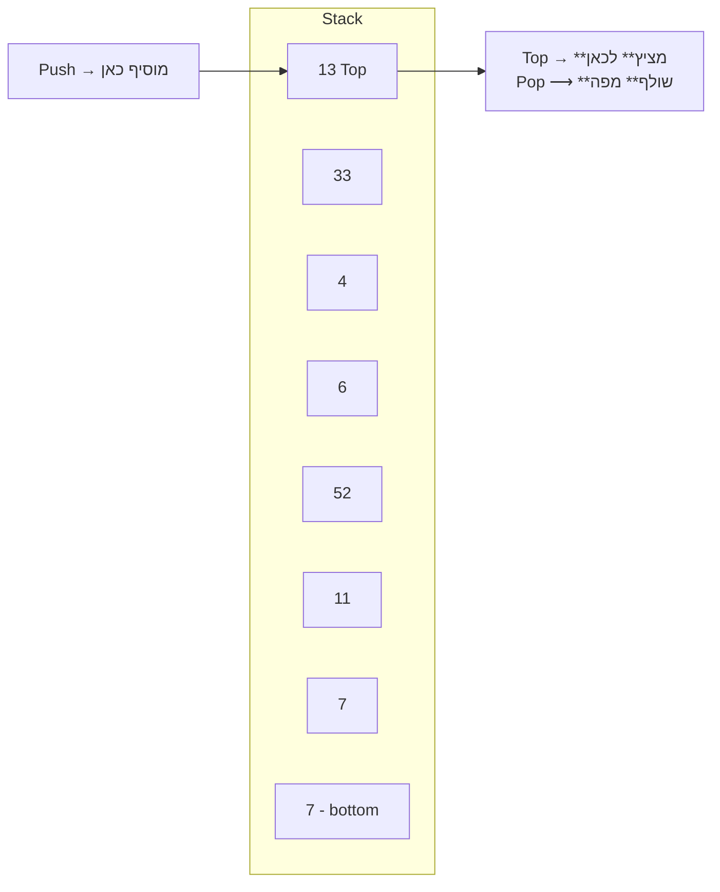

{: .box-note}
מחסנית (Stack) היא מבנה נתונים המתנהג לפי עיקרון **Last‑In‑First‑Out**: הפריט האחרון שנכנס הוא הראשון שיוצא. בפרק זה נלמד כיצד לעבוד עם מחסנית גנרית `<Stack<T` ב‑C# ונעמוד על יתרונותיה וחסרונותיה.

<!-- Source: University of Wisconsin – Notes on Stacks -->

## מהי מחסנית?

[אנימציה](/mivney/4stack/StackAnimation.html)

<details open markdown="1">
<summary>הגדרה ותיאור</summary>

מחסנית היא רשימה ליניארית שבה כל ההוספות והמחיקות מתבצעות בקצה אחד בלבד הנקרא **Top**. הפעולה הבסיסית של המחסנית היא `Push` (דחיפה) – הוספת פריט לראש המחסנית – ו‑`Pop` (שליפה) – הסרת הפריט האחרון שהוכנס. ניתן גם להציץ בפריט בראש המחסנית באמצעות `Top` מבלי להסיר אותו.

</details>

## מימוש מחסנית ב‑C#

ההמלצה שלי היא להשתמש בהפנייה ל-Unit4.dll. דרך מהירה לכך היא על ידי Git Clone של הפרוייקט [Turtle22 בקישור זה](https://github.com/3strategy/Turtle22)

<details markdown="1">
<summary>מימוש רשמי</summary>

מימוש רשמי של משרד החינוך:


```csharp
// Unit4 המימוש הרשמי של 
public class Stack<T>
{
    private Node<T> head;

    //-----------------------------------
    //constructor
    public Stack()
    {
        this.head = null;
    }
    //-----------------------------------
    //adds element x to the top of the stack
    public void Push(T x)
    {
        Node<T> temp = new Node<T>(x);
        temp.SetNext(head);
        head = temp;
    }
    //-----------------------------------
    //removes & returns the element from the top of the stack
    public T Pop()
    {
        T x = head.GetValue();
        head = head.GetNext();
        return x;
    }
    //-----------------------------------
    //returns the element from the top of the stack
    public T Top()
    {
        return head.GetValue();
    }
    //-----------------------------------
    //returns true if there are no elements in stack
    // ...כיוון שאני לא מטיפוסל בלי קצת כתיב מקוצר
    public bool IsEmpty() => head == null;
    //-------------------------------------
    //ToString
    public override string ToString()
    {
        if (this.IsEmpty())
            return "[]";
        string temp = head.ToString();
        return "TOP <== " + temp.Substring(0, temp.Length - 1) + "]";
    }
}
```

</details>


## דיאגרמה – פעולות המחסנית

Stack Operations:




## פעולות זמינות במחלקת `<Stack<T`

|  תיאור | Method |
|--------|--------|
| דוחף פריט לראש המחסנית | `Push(T item)` |
| **מסיר** ומחזיר את הפריט האחרון שנכנס |`()T Pop` | 
|  מחזיר את הפריט האחרון **מבלי להסיר** |`()T Top` |
|  מחזיר אמת אם המחסנית ריקה |`()bool IsEmpty` |
{: .table-rl}


### עקרון פעולה **LIFO**
(Last-In, First-Out)   האחרון שנכנס הוא הראשון שיוצא. כמו במחסנית של נשק, וכמו ב-Pez Dispenser.


### הערות וטעויות נפוצות

{: .subq}
א. ניסיונות קריאה ל‑`Pop` או `Top` על מחסנית ריקה יגרמו לחריגה(Exception). יש לוודא שהמחסנית אינה ריקה לפני קריאה לפעולות אלו.  

{: .subq}
ב. מחסנית מתאימה לאלגוריתמים הפועלים בסדר הפוך (כגון חישוב ביטויים [בפולנית הפוכה](https://en.wikipedia.org/wiki/Reverse_Polish_notation)). שימוש לא נכון עלול לגרום ללוגיקה שגויה.  


{: .subq}
ג. מומלץ להפיכת תורים כפי שנראה בהמשך.


{: .subq}
ד. לא רשאים להשתמש ב-ToString כטכניקה להשוואת מחסניות.


## תרגול וקישורים

תוכלו למצוא תרגילים במערכת ההגשות


