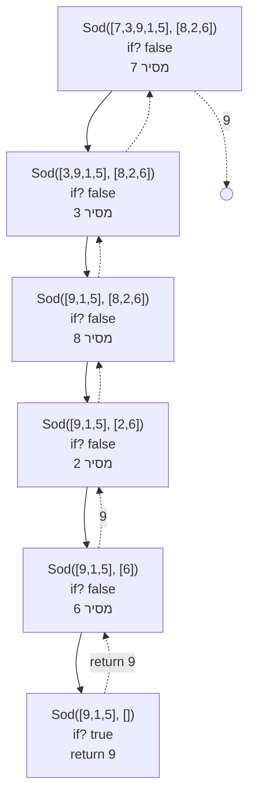
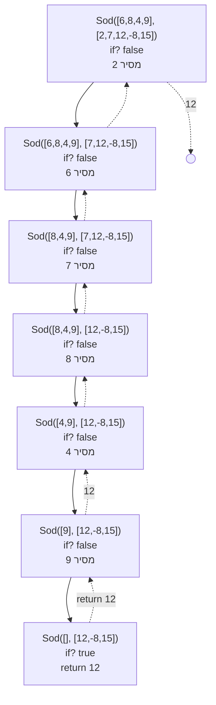
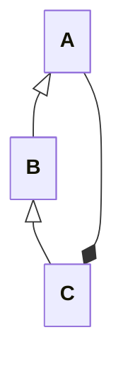
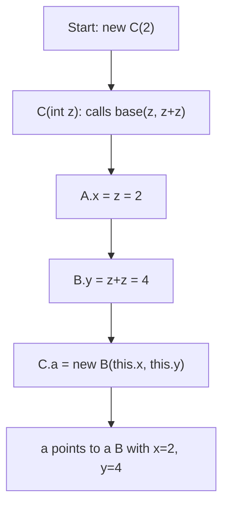
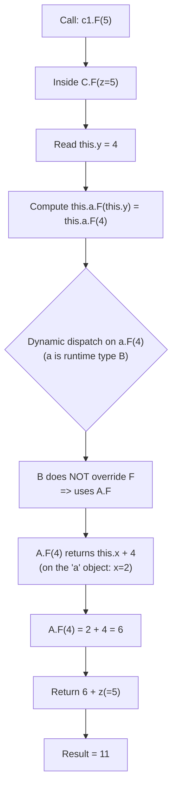
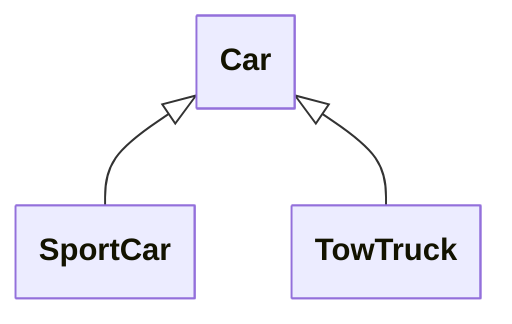

## פתרון שאלה 1 NumChainFromNodes

<details open markdown="1"><summary>פתרון</summary>

```csharp
public static Node<int> NumChainFromNodes(Node<Node<int>> p)
{
    Node<int> curr = new Node<int>(666);
    Node<int> head = curr;

    while (p != null)
    {
        curr.SetNext(new Node<int>(Num(p.GetValue())));
        curr = curr.GetNext();
        p = p.GetNext();
    }

    return head.GetNext();
}

public static int Num(Node<int> ls)
{
    int n = 0;
    int i = 1;

    while (ls != null)
    {
        n = n + ls.GetValue() * i;
        i *= 10;
        ls = ls.GetNext();
    }

    return n;
}
```

</details>

## פתרון שאלה 2 מעקב

<details open markdown="1"><summary>פתרון</summary>



---



</details>

## שאלה 3 האם סדרה חשבונית

<details open markdown="1"><summary>פתרון</summary>

```cs
public static bool Correct(Node<int> ls)
{
    Node<int> sorted = null;

    while (ls != null)
    {
        sorted = InsertSorted(sorted, ls.GetValue());
        ls = ls.GetNext();
    }

    ls = sorted; // ls נח לי לעבוד עם המשתנה 

    int diff = ls.GetValue() - ls.GetNext().GetValue();
    ls = ls.GetNext();

    while (ls.HasNext())
    {
        if (diff != ls.GetValue() - ls.GetNext().GetValue())
            return false;

        ls = ls.GetNext();
    }

    return true;
}
```

**לנוחותכם - הפונקציה הרקורסיבית `InsertSorted`**

```cs
public static Node<int> InsertSorted(Node<int> head, int number) 
{
    // Base case: רשימה ריקה או הכנסה לפני כל הרשימה
    if (head == null || number < head.GetValue()) {
        Node<int> ls = new Node<int>(number);
        ls.SetNext(head);
        return ls;
    }
    // Recursive case: הכנסה רקורסיבית במקום הרלוונטי
    head.SetNext(InsertSorted(head.GetNext(), number));
    return head;
}
```

</details>

## פתרון שאלה 4 - מהרצה בפועל

<details open markdown="1"><summary>פתרון</summary>



<details markdown="1"><summary>מצורף קוד השאלה כדי שתוכלו להריץ</summary>

```cs
class A
{
  protected int x;

  public A(int x)
  {
    this.x = x;
  }
  public virtual int F(int z)
  {
    return this.x + z;
  }
  public override string ToString()
  {
    return "A:" + this.x;
  }
}
class B : A
{
  protected int y;

  public B(int x, int y) : base(x)
  {
    this.y = y;
  }
  public override string ToString()
  {
    return "B:" + this.x + "," + this.y;
  }
}
class C : B
{
  private A a;

  public C(int z) : base(z, z + z)
  {
    this.a = new B(this.x, this.y);
  }
  public override int F(int z)
  {
    return this.a.F(this.y) + z;
  }
}

internal class Program
{
  static void Main(string[] args)
  {
    A[] arr = new A[4];

    arr[0] = new A(0);
    arr[1] = new B(1, 1);
    arr[2] = new C(2);
    arr[3] = new B(3, 5);

    for (int i = 0; i < arr.Length; i++)
      Console.WriteLine(arr[i]);
    for (int i = 0; i < arr.Length; i++)
      if (!(arr[i] is B)) // מומלץ לתרגל גם ללא תנאי
                          // ולחשב מה יודפס עבור כל אחד מאברי המערך
        Console.WriteLine(arr[i].F(i + 1));
  }

}
```

</details>

**output:**

```cs
A:0
B:1,1
B:2,4
B:3,5
1 // B ההדפסה בלולאה השניה. רק הראשון אינו 

/// אילו היינו מדפיסים את השני, שלישי, רביעי

// arr[1]⟶ 3
// arr[2]⟶ 9
// arr[3]⟶ 7
```

לאחר הוספת הקוד הבא:

```cs
C c1 = (C)arr[2];
//C c2 = (C)arr[3]; //InvalidCastException
Console.WriteLine(c1.F(5));
//Console.WriteLine(c2.F(5));


לא ניתן להציל את השורות שהוסרו 
מה שיודפס הוא 

11
```

### שאלה 4 סעיף אחרון - מה תדפיס הקריאה `;Console.WriteLine(c1.F(5))`

#### 1) What is `c1` really?

`c1 = (C)arr[2]` so `c1` is the same object created by:

```csharp
arr[2] = new C(2);
```

#### 2) Track the construction of `new C(2)`



So inside `c1` (a `C` object):

* `this.x = 2`
* `this.y = 4`
* `this.a` is an **A-reference** to an object of runtime type **B** with `(x=2, y=4)`.

---

#### 3) Track the call `c1.F(5)`

##### C overrides `F`, so this is the method that runs:

```csharp
public override int F(int z)
{
  return this.a.F(this.y) + z;
}
```

**צעד אחר צעד:**



---

#### ✅ הערך הסופי שיודפס

```text
11
```

</details>

## שאלה 5

<details open markdown="1"><summary>פתרון</summary>



```cs
Car Ford BLUE 60
SportCar Ferari BLUE 110  Turbo:True
SportCar Ferari BLUE 110  Turbo:True
TowTruck: Isuzu BLUE 90
```

<details markdown="1"><summary>מצורף קוד השאלה כדי שתוכלו להריץ</summary>

```cs
public class Car
{
  private int speed;
  private string manufacturer;    // משתנה המכיל את שם היצרן
  private static string color = "WHITE";
  public const int SPEED_UP = 5;

  public Car(string manufacturer, int speed)
  {
    this.manufacturer = manufacturer;
    this.speed = speed;
  }

  public void ChangeColor(string newColor)
  {
    color = newColor;
  }

  public virtual void SpeedUp()
  {
    if (this.speed + SPEED_UP <= 120)
      this.speed += SPEED_UP;
  }

  public string GetManufacturer()
  {
    return this.manufacturer;
  }

  public override string ToString()
  {
    string car = "Car " + this.manufacturer + " " + Car.color + " " + this.speed;
    return car;
  }
}

public class SportCar : Car
{
  private bool hasTurbo = false;

  public SportCar(string manufacturer, int speed, bool turbo) : base(manufacturer, speed)
  {
    this.hasTurbo = turbo;
  }

  public override void SpeedUp()
  {
    base.SpeedUp();
    base.SpeedUp();
    base.SpeedUp();
  }

  public override string ToString()
  {
    string st = "Sport" + base.ToString() + "  " + "Turbo:" + this.hasTurbo;
    return st;
  }
}


public class TowTruck : Car
{      // מחלקה המייצגת מכונית-גרר
  private Car carToTow;              // משתנה המתאר את המכונית הנגררת

  //  פעולה בונה ומאתחלת מכונית גרר חדשה לפי הפרמטרים המועברים אליה.                       
  //    אם הפרמטר car הוא null, פירושו שמכונית-הגרר אינה גוררת מכונית אחרת. //
  public TowTruck(string manufacturer, int speed, Car car)
     : base(manufacturer, speed)
  {
    this.carToTow = car;
  }

  /* מעדכנת את מהירות הנסיעה של מכונית-הגרר. אם מכונית הגרר גוררת מכונית   אחת  SPEED_UP המהירות גדלה בערך של יחידת .           
                   אחרת, המהירות גדלה בערך של שתי יחידות SPEED_UP.                                
   */
  public override void SpeedUp() //======================= כולל פתרון
  {
    base.SpeedUp();
    if(carToTow == null)
      base.SpeedUp();
    
  }

  //מחזירה מחרוזת המייצגת את מכונית-הגרר וכוללת את היצרן, הצבע והמהירות של מכונית.       
  public override string ToString()
  {
    string towString = "TowTruck: " +
    this.GetManufacturer() + " " +             // line 1
    Car.color + " " + this.speed;              // line 2
    return towString;
  }
}

public partial class Program
{
  public static void Main2(string[] args)
  {
    Car[] ourCars = new Car[4];

    ourCars[0] = new Car("Ford", 55);
    ourCars[1] = new SportCar("Ferari", 80, true);
    ourCars[2] = ourCars[1];                      // line 3
    ourCars[3] = new TowTruck("Isuzu", 80, null);
    SportCar myCar = ourCars[1];                  // line 4
    for (int i = 0; i < ourCars.Length; i++)
      ourCars[i].SpeedUp();
    ourCars[2].ChangeColor("BLUE");               // line 5
    for (int i = 0; i < ourCars.Length; i++)
      Console.WriteLine(ourCars[i]);

  }
}
```

</details>

- line 1 תקין
- **line 2:**
  - `Car.color` isn't accessible due to its protection level
  - `speed` isn't accessible due to its protection level
  - correct fix is to **keep it private and add getters and setters.** some would shortcut and make it protected instead of private. this breaks the encapsulation principal.
  - note that the actual usage of `Class.field` is correct when accessing a static field or property. but if it's protected - you could get to it without `Class.` syntax (but It's not appropriate). On the contrary, those accessing from the outside would need to use `Car.` syntax since they are not referencing an instance. the error on a proper public static would be `Member 'Car.Color' cannot be accessed with an instance reference; qualify it with a type name instead`. (see demo code below)
- line 3: תקין
- **line 4:** לא תקין:
  - Cannot implicitly convert type 'Car' to 'SportCar'. An explicit conversion exists (are you missing a cast?)

<details markdown="1"><summary>finer neuances about atual C# static property access</summary>

```cs
// demo code of a proper C# public static full propery
  private static string color = "WHITE";

  public static string Color
  {
    get { return color; }
    set { color = value; }
  }
  // from within, the childen can use `color =` if it was `protected` and not `private`.
  // they can also write `Color =` 
  // from the outside, only Car.Color would work (you cannot do c1.Color = ).
  // C# is correctly covering and representing the static quality of the property.
```

</details>
</details>

## שאלה 6

<details open markdown="1"><summary>פתרון</summary>


### סעיף א׳ — Leaves

```csharp
public static void Leaves(BinNode<int> t, Queue<int> q)
{
    if (t == null)
        return;

    if (!t.HasLeft() && !t.HasRight())
        q.Insert(t.GetValue());

    Leaves(t.GetRight(), q);
    Leaves(t.GetLeft(), q);
}
```

### סעיף ב׳ — SameLeaves

```csharp
public static bool SameLeaves(BinNode<int> t1, BinNode<int> t2)
{
    Queue<int> q1 = new Queue<int>();
    Queue<int> q2 = new Queue<int>();

    Leaves(t1, q1);
    Leaves(t2, q2);

    while (!q1.IsEmpty() && !q2.IsEmpty())
    {
        if (q1.Remove() != q2.Remove())
            return false;
    }

    return q1.IsEmpty() && q2.IsEmpty();
}
```

---

## הערה על סדר הקריאות (מימין לשמאל)

**כיוון שזה היה עניין שולי - רשמתי על הלוח שאין צורך להתייחס לדרישת הסדר.**

הפתרון עונה על הדרישה "מימין לשמאל":
הקריאה הרקורסיבית ל־`Right` מתבצעת לפני `Left`, ולכן כל העלים שבתת־העץ הימני נכנסים לתור לפני העלים שבתת־העץ השמאלי.

אין הבדל אם בודקים "האם אני עלה" לפני הקריאות הרקורסיביות או בין הקריאות (`Right` ואז בדיקת עלה ואז `Left`), משום שהכנסה לתור מתבצעת רק בצומת שהוא עלה, ולעלה אין ילדים כך שכל קריאה נוספת תחזור מיד על `null`. לכן סדר העלים בתור נשאר זהה.

</details>
