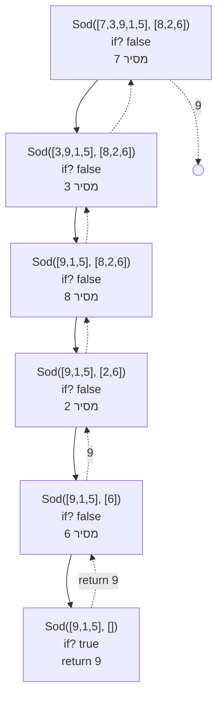
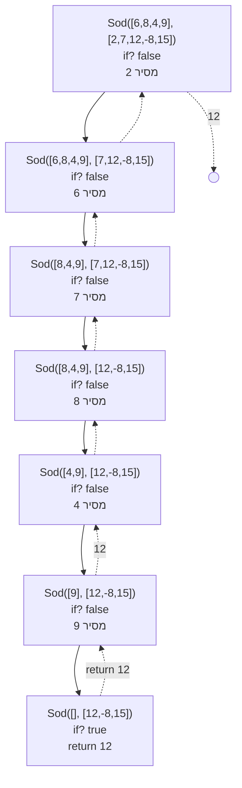
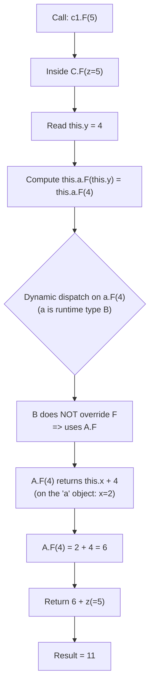

## פתרון שאלה 1 NumChainFromNodes

```csharp
public static Node<int> NumChainFromNodes(Node<Node<int>> p)
{
    Node<int> curr = new Node<int>(666);
    Node<int> head = curr;

    while (p != null)
    {
        curr.SetNext(new Node<int>(Num(p.GetValue())));
        curr = curr.GetNext();
        p = p.GetNext();
    }

    return head.GetNext();
}

public static int Num(Node<int> ls)
{
    int n = 0;
    int i = 1;

    while (ls != null)
    {
        n = n + ls.GetValue() * i;
        i *= 10;
        ls = ls.GetNext();
    }

    return n;
}
```

## פתרון שאלה 2 מעקב



---



## שאלה 3 האם סדרה חשבונית

```cs
public static bool Correct(Node<int> ls)
{
    Node<int> sorted = null;

    while (ls != null)
    {
        sorted = InsertSorted(sorted, ls.GetValue());
        ls = ls.GetNext();
    }

    ls = sorted; // ls נח לי לעבוד עם המשתנה 

    int diff = ls.GetValue() - ls.GetNext().GetValue();
    ls = ls.GetNext();

    while (ls.HasNext())
    {
        if (diff != ls.GetValue() - ls.GetNext().GetValue())
            return false;

        ls = ls.GetNext();
    }

    return true;
}
```

**לנוחותכם - הפונקציה הרקורסיבית `InsertSorted`**

```cs
public static Node<int> InsertSorted(Node<int> head, int number) 
{
    // Base case: רשימה ריקה או הכנסה לפני כל הרשימה
    if (head == null || number < head.GetValue()) {
        Node<int> ls = new Node<int>(number);
        ls.SetNext(head);
        return ls;
    }
    // Recursive case: הכנסה רקורסיבית במקום הרלוונטי
    head.SetNext(InsertSorted(head.GetNext(), number));
    return head;
}
```

## פתרון שאלה 4 - מהרצה בפועל

<details markdown="1"><summary>מצורף קוד השאלה כדי שתוכלו להריץ</summary>

```cs
class A
{
  protected int x;

  public A(int x)
  {
    this.x = x;
  }
  public virtual int F(int z)
  {
    return this.x + z;
  }
  public override string ToString()
  {
    return "A:" + this.x;
  }
}
class B : A
{
  protected int y;

  public B(int x, int y) : base(x)
  {
    this.y = y;
  }
  public override string ToString()
  {
    return "B:" + this.x + "," + this.y;
  }
}
class C : B
{
  private A a;

  public C(int z) : base(z, z + z)
  {
    this.a = new B(this.x, this.y);
  }
  public override int F(int z)
  {
    return this.a.F(this.y) + z;
  }
}

internal class Program
{
  static void Main(string[] args)
  {
    A[] arr = new A[4];

    arr[0] = new A(0);
    arr[1] = new B(1, 1);
    arr[2] = new C(2);
    arr[3] = new B(3, 5);

    for (int i = 0; i < arr.Length; i++)
      Console.WriteLine(arr[i]);
    for (int i = 0; i < arr.Length; i++)
      if (!(arr[i] is B)) // מומלץ לתרגל גם ללא תנאי
                          // ולחשב מה יודפס עבור כל אחד מאברי המערך
        Console.WriteLine(arr[i].F(i + 1));
  }

}
```

</details>

**output:**

```cs
A:0
B:1,1
B:2,4
B:3,5
1 // B ההדפסה בלולאה השניה. רק הראשון אינו 

/// אילו היינו מדפיסים את השני, שלישי, רביעי

// arr[1]⟶ 3
// arr[2]⟶ 9
// arr[3]⟶ 7
```

לאחר הוספת הקוד הבא:

```cs
C c1 = (C)arr[2];
//C c2 = (C)arr[3]; //InvalidCastException
Console.WriteLine(c1.F(5));
//Console.WriteLine(c2.F(5));


לא ניתן להציל את השורות שהוסרו 
מה שיודפס הוא 

11
```

## שאלה 5

## שאלה 5 סעיף אחרון - מה תדפיס הקריאה `Console.WriteLine(c1.F(5));`

### 1) What is `c1` really?

`c1 = (C)arr[2]` so `c1` is the same object created by:

```csharp
arr[2] = new C(2);
```

### 2) Track the construction of `new C(2)`

```mermaid
flowchart TD
  Z[Start: new C(2)] --> BCTOR["C(int z): calls base(z, z+z)"]
  BCTOR --> XSET["A.x = z = 2"]
  XSET --> YSET["B.y = z+z = 4"]
  YSET --> ACTOR["C.a = new B(this.x, this.y)"]
  ACTOR --> AOBJ["a points to a B with x=2, y=4"]
```

So inside `c1` (a `C` object):

* `this.x = 2`
* `this.y = 4`
* `this.a` is an **A-reference** to an object of runtime type **B** with `(x=2, y=4)`.

---

### 3) Track the call `c1.F(5)`

#### C overrides `F`, so this is the method that runs:

```csharp
public override int F(int z)
{
  return this.a.F(this.y) + z;
}
```

**צעד אחר צעד:**



---

### ✅ הערך הסופי שיודפס

```text
11
```


## שאלה 6

### סעיף א׳ — Leaves

```csharp
public static void Leaves(BinNode<int> t, Queue<int> q)
{
    if (t == null)
        return;

    if (!t.HasLeft() && !t.HasRight())
        q.Insert(t.GetValue());

    Leaves(t.GetRight(), q);
    Leaves(t.GetLeft(), q);
}
```

### סעיף ב׳ — SameLeaves

```csharp
public static bool SameLeaves(BinNode<int> t1, BinNode<int> t2)
{
    Queue<int> q1 = new Queue<int>();
    Queue<int> q2 = new Queue<int>();

    Leaves(t1, q1);
    Leaves(t2, q2);

    while (!q1.IsEmpty() && !q2.IsEmpty())
    {
        if (q1.Remove() != q2.Remove())
            return false;
    }

    return q1.IsEmpty() && q2.IsEmpty();
}
```

---

## הערה על סדר הקריאות (מימין לשמאל)

הפתרון עונה על הדרישה "מימין לשמאל":
הקריאה הרקורסיבית ל־`Right` מתבצעת לפני `Left`, ולכן כל העלים שבתת־העץ הימני נכנסים לתור לפני העלים שבתת־העץ השמאלי.

אין הבדל אם בודקים "האם אני עלה" לפני הקריאות הרקורסיביות או בין הקריאות (`Right` ואז בדיקת עלה ואז `Left`), משום שהכנסה לתור מתבצעת רק בצומת שהוא עלה, ולעלה אין ילדים כך שכל קריאה נוספת תחזור מיד על `null`. לכן סדר העלים בתור נשאר זהה.

