<style>
.externalpdf-source-viewer {
  display: none !important;
}
.print-question-source {
  direction: rtl;
  text-align: right;
  border: 1px solid #ddd;
  padding: 0.75rem 1rem;
  margin: 0.5rem 0 1rem;
  background: #fff;
}
.print-pdf-source {
  direction: rtl;
  text-align: right;
  font-size: 0.9rem;
  margin: 0.25rem 0 0.75rem;
}
@media print {
  .externalpdf-source-viewer {
    display: none !important;
  }
  .print-question-source {
    page-break-inside: auto;
    break-inside: auto;
  }
}
</style>


```csharp
// Assumptions for the A helpers:
// class A has:
// int GetC()
// int GetS()
// void SetS(int s)
//
// The chain is sorted by GetC() from small to large.

public static Node<A> InsertOrUpdateSorted(Node<A> lst, A a)
{
    Node<A> dummy = new Node<A>(null, lst);
    Node<A> prev = dummy;
    Node<A> curr = lst;

    while (curr != null && curr.GetValue().GetC() < a.GetC())
    {
        prev = curr;
        curr = curr.GetNext();
    }

    if (curr != null && curr.GetValue().GetC() == a.GetC())
    {
        int newSum = curr.GetValue().GetS() + a.GetS();
        curr.GetValue().SetS(newSum);
    }
    else
    {
        Node<A> added = new Node<A>(a, curr);
        prev.SetNext(added);
    }

    return dummy.GetNext();
}

// Removes at most s total from nodes whose GetC() is at or below c.
// If a node's GetS() becomes 0, the node is removed from the chain.
// ref is needed because the first node may be removed.
public static int ConsumeOrRemove(ref Node<A> lst, int c, int s)
{
    Node<A> dummy = new Node<A>(null, lst);
    Node<A> prev = dummy;
    Node<A> curr = lst;
    int totalRemoved = 0;

    while (curr != null && s > 0)
    {
        A item = curr.GetValue();

        if (item.GetC() > c)
        {
            break;
        }

        int canRemove = item.GetS();
        int removedNow = s;
        if (canRemove < removedNow)
        {
            removedNow = canRemove;
        }

        item.SetS(item.GetS() - removedNow);
        totalRemoved += removedNow;
        s -= removedNow;

        if (item.GetS() == 0)
        {
            prev.SetNext(curr.GetNext());
            curr = prev.GetNext();
        }
        else
        {
            prev = curr;
            curr = curr.GetNext();
        }
    }

    lst = dummy.GetNext();
    return totalRemoved;
}

// Assumption for the C helper:
// class C has:
// int GetP()
//
// Removes cars whose price GetP() is at or below p.
// Returns a chain of the removed cars, in their original order.
// ref is needed because the first node may be removed.
public static Node<C> RemoveCarsAtOrBelowPrice(ref Node<C> lst, int p)
{
    Node<C> dummy = new Node<C>(null, lst);
    Node<C> prev = dummy;
    Node<C> curr = lst;

    Node<C> removedHead = null;
    Node<C> removedTail = null;

    while (curr != null)
    {
        if (curr.GetValue().GetP() <= p)
        {
            Node<C> removed = curr;
            curr = curr.GetNext();
            prev.SetNext(curr);

            removed.SetNext(null);
            if (removedHead == null)
            {
                removedHead = removed;
                removedTail = removed;
            }
            else
            {
                removedTail.SetNext(removed);
                removedTail = removed;
            }
        }
        else
        {
            prev = curr;
            curr = curr.GetNext();
        }
    }

    lst = dummy.GetNext();
    return removedHead;
}

// Cheapest-first version for A.
// Because the chain is sorted by GetC(), the cheapest items are at the start.
// Removes at most s total from the lowest GetC() nodes first.
public static int ConsumeCheapest(ref Node<A> lst, int s)
{
    Node<A> dummy = new Node<A>(null, lst);
    Node<A> prev = dummy;
    Node<A> curr = lst;
    int totalRemoved = 0;

    while (curr != null && s > 0)
    {
        A item = curr.GetValue();

        int removedNow = s;
        if (item.GetS() < removedNow)
        {
            removedNow = item.GetS();
        }

        item.SetS(item.GetS() - removedNow);
        totalRemoved += removedNow;
        s -= removedNow;

        if (item.GetS() == 0)
        {
            prev.SetNext(curr.GetNext());
            curr = prev.GetNext();
        }
        else
        {
            prev = curr;
            curr = curr.GetNext();
        }
    }

    lst = dummy.GetNext();
    return totalRemoved;
}

// Cheapest-first version for C.
// Works even if the car chain is not sorted by price.
// Removes count cheapest cars and returns a chain of the removed cars.
public static Node<C> RemoveCheapestCars(ref Node<C> lst, int count)
{
    Node<C> removedHead = null;
    Node<C> removedTail = null;

    while (lst != null && count > 0)
    {
        int minPrice = FindMinCarPrice(lst);

        Node<C> dummy = new Node<C>(null, lst);
        Node<C> prev = dummy;
        Node<C> curr = lst;

        while (curr != null && curr.GetValue().GetP() != minPrice)
        {
            prev = curr;
            curr = curr.GetNext();
        }

        prev.SetNext(curr.GetNext());
        lst = dummy.GetNext();

        curr.SetNext(null);
        if (removedHead == null)
        {
            removedHead = curr;
            removedTail = curr;
        }
        else
        {
            removedTail.SetNext(curr);
            removedTail = curr;
        }

        count--;
    }

    return removedHead;
}

private static int FindMinCarPrice(Node<C> lst)
{
    int min = lst.GetValue().GetP();
    Node<C> curr = lst.GetNext();

    while (curr != null)
    {
        if (curr.GetValue().GetP() < min)
        {
            min = curr.GetValue().GetP();
        }

        curr = curr.GetNext();
    }

    return min;
}

// 01. QueueSize
public static int QueueSize(Queue<int> q)
{
    Queue<int> temp = new Queue<int>();
    int count = 0;

    while (!q.IsEmpty())
    {
        int value = q.Remove();
        temp.Insert(value);
        count++;
    }

    while (!temp.IsEmpty())
    {
        q.Insert(temp.Remove());
    }

    return count;
}

// 02. CloneQueue
public static Queue<int> CloneQueue(Queue<int> q)
{
    Queue<int> temp = new Queue<int>();
    Queue<int> copy = new Queue<int>();

    while (!q.IsEmpty())
    {
        int value = q.Remove();
        temp.Insert(value);
        copy.Insert(value);
    }

    while (!temp.IsEmpty())
    {
        q.Insert(temp.Remove());
    }

    return copy;
}

// 03. PrintRootToLeafNumbers
public static void PrintRootToLeafNumbers(BinNode<int> tree)
{
    PrintRootToLeafNumbers(tree, 0);
}

private static void PrintRootToLeafNumbers(BinNode<int> tree, int number)
{
    if (tree == null)
    {
        return;
    }

    int nextNumber = number * 10 + tree.GetValue();

    if (tree.GetLeft() == null && tree.GetRight() == null)
    {
        Console.WriteLine(nextNumber);
        return;
    }

    PrintRootToLeafNumbers(tree.GetLeft(), nextNumber);
    PrintRootToLeafNumbers(tree.GetRight(), nextNumber);
}

// 04. GetQueueValueAt
public static int GetQueueValueAt(Queue<int> q, int position)
{
    Queue<int> temp = new Queue<int>();
    int index = 1;
    int result = 0;

    while (!q.IsEmpty())
    {
        int value = q.Remove();

        if (index == position)
        {
            result = value;
        }

        temp.Insert(value);
        index++;
    }

    while (!temp.IsEmpty())
    {
        q.Insert(temp.Remove());
    }

    return result;
}

// 05. AreQueuesEqual
public static bool AreQueuesEqual(Queue<int> q1, Queue<int> q2)
{
    int size1 = QueueSize(q1);
    int size2 = QueueSize(q2);

    if (size1 != size2)
    {
        return false;
    }

    bool equal = true;

    for (int i = 0; i < size1; i++)
    {
        int first = q1.Remove();
        int second = q2.Remove();

        if (first != second)
        {
            equal = false;
        }

        q1.Insert(first);
        q2.Insert(second);
    }

    return equal;
}
```

# Allocated Yod-Alef25 271b/381b Tasks

Source: `C:\Users\3stra\Downloads\attendance-40a15-default-rtdb-export (19).json`

Selection rule: assignment id starts with `271b` or `381b`, assignment is allocated under `coders/classes/Yod-Alef25/classAssignments`, and task is not marked `enabled: false` in the class assignment task flags.

Selected tasks: 47


## 271b2024-6 - בגרות במדעי המחשב שאלון 899271 מועד קיץ 2024

### 271b2024-6 / 01 - שאלה 1

- Required: `Solution.IsMagic`
- Signature metadata: `int[] -> int`
- School solution length: 1458 chars

#### Question Markdown

{: .print-pdf-source}
PDF source: [original question PDF](https://xn--7dbdbn4b5c.xn--eebf2b.com/bagruyot/2024.6.271/q1.pdf)

<div markdown="1" class="print-question-source" dir="rtl">
                                                       פרק ראשון 
                     “איבר קסם" הוא איבר בתור של מספרים שערכו שווה לסכום הערכים של האיבר שלפניו והאיבר שאחריו .           .1  
                                                    הערה  : המספר הראשון בתור והמספר האחרון בתור אינם "איברי קסם" .  
                א  . כתבו פעולה ששמה   isMagic בשפת   Java או   IsMagic בשפת   , C# המקבלת תור –   q מטיפוס שלם ,  
                                                           ומספר שלם –   m הגדול מ־   0 וקטן או שווה לגודל התור .  
                         הפעולה תחזיר   true אם האיבר במקום ה־   m בתור הוא “איבר קסם"  , אחרת היא תחזיר  . false  
                                            הערות  – : בסיום הפעולה חובה לשמור על מבנה התור כפי שהתקבל .  
     – אין להשתמש בסעיף זה במערך או ברשימה מקושרת  . פתרון הכולל שימוש בהם לא יזוכה בנקודות .  
                                                                                   לדוגמה  : עבור התור שלפניכם :  
      ראש                                       סוף 
      התור                                     התור 
         1        2         3         4         5          6           7  
        5         11        6         9         3         6            3  

                                          עבור   m = 1 הפעולה תחזיר  ( false המספר הראשון בתור אינו "איבר קסם") 
                                                                   עבור   m = 2 הפעולה תחזיר  ) 5 + 6 = 11( true  
                                                                  עבור   m = 3 הפעולה תחזיר  )11 + 9 ! 6 ( false  
   כתבו פעולה ששמה   nMagic בשפת   Java או   NMagic בשפת   C# המקבלת תור מטיפוס שלם –   , q ומספר שלם  n                      ב .  
                                                                          הגדול מ־   0 וקטן או שווה לגודל התור .  
   הפעולה תחזיר   true אם כל האיברים הנמצאים במקומות שהם כפולה של  ( n המקום ה־   n בתור  , המקום ה־   2n בתור 
                                  וכן הלאה בדילוגים של   n מקומות) הם “איברי קסם"  . אחרת הפעולה תחזיר  . false  
                                                                    אפשר להשתמש בפעולה שכתבתם בסעיף א .  
                                                         הערות  – : בפעולה זו אין צורך לשמור על התור שהתקבל .  
         – אין להשתמש בסעיף זה במערך או ברשימה מקושרת  . פתרון הכולל שימוש בהם לא יזוכה בנקודות .  
                                                                          דוגמאות  : עבור התור שבדוגמה שלעיל :  
          עבור   n = 2 הפעולה תחזיר   true מכיוון שכל האיברים הנמצאים במקומות שהם כפולה של   )2 , 4 , 6( 2 הם 
                                                                                                “איברי קסם" .  
   עבור   n = 4 הפעולה תחזיר   true מכיוון שהאיבר במקום ה־   4 הוא “איבר קסם" (אין בתור איברים נוספים במקומות 
                                                                                          שהם כפולה של  .)4  
                                   עבור   n = 3 הפעולה תחזיר   false מכיוון שהאיבר במקום ה־   3 אינו “איבר קסם" .  

  / המשך בעמוד  /3  
</div>

#### School Solution

```csharp
public class Solution
{
    public static bool IsMagic(Queue<int> q, int m)
    {
        int size = GetQueueSize(q);
        if (m <= 1 || m >= size)
        {
            return false;
        }

        int previous = 0;
        int current = 0;
        int next = 0;

        for (int i = 1; i <= size; i++)
        {
            int value = q.Remove();
            if (i == m - 1)
            {
                previous = value;
            }
            if (i == m)
            {
                current = value;
            }
            if (i == m + 1)
            {
                next = value;
            }
            q.Insert(value);
        }

        return current == previous + next;
    }

    public static bool NMagic(Queue<int> q, int n)
    {
        if (n <= 0)
        {
            return false;
        }

        int size = GetQueueSize(q);
        for (int position = n; position <= size; position += n)
        {
            if (!IsMagic(q, position))
            {
                return false;
            }
        }

        return true;
    }

    private static int GetQueueSize(Queue<int> q)
    {
        Queue<int> temp = new Queue<int>();
        int size = 0;

        while (!q.IsEmpty())
        {
            int value = q.Remove();
            temp.Insert(value);
            size++;
        }

        while (!temp.IsEmpty())
        {
            q.Insert(temp.Remove());
        }

        return size;
    }
}
```

### 271b2024-6 / 02 - שאלה 2

- Required: `Solution.Patient`
- Signature metadata: `int[] -> int`
- School solution length: 1781 chars

#### Question Markdown

{: .print-pdf-source}
PDF source: [original question PDF](https://xn--7dbdbn4b5c.xn--eebf2b.com/bagruyot/2024.6.271/q2.pdf)

<div markdown="1" class="print-question-source" dir="rtl">
                                                                   נתונה המחלקה    – Patient חולה בחדר מיון  , ולה שתי תכונות :                .2  
                                                                                      – id מספר הזהות של החולה  , מטיפוס שלם            • 
      – priority רמת הדחיפות של הטיפול בחולה  . רמת הדחיפות מיוצגת במספר מטיפוס שלם בין     1 ל־   . 10 ככל שהמספר                          • 
                                                                                            גבוה יותר  , רמת הדחיפות גבוהה יותר .  
                                                                      הניחו שלתכונות המחלקה יש פעולות     get/Get ו־  . set/Set  

                                                                            סדר הטיפול בחולים בחדר המיון מתנהל באופן שלהלן :  
     ככל שרמת הדחיפות של הטיפול גבוהה יותר  , החולה מטופל מוקדם יותר  . כאשר יש יותר מחולה אחד באותה רמת דחיפות ,  
                                                                                 החולה שהגיע קודם לחדר מיון מטופל מוקדם יותר .  

                                   כדי לשמור על סדר הטיפול נבנתה המחלקה    – PriorQueue תור עדיפויות  , ולה תכונה אחת :  
                                                                                                – q הפניה לתור  , מטיפוס   Patient        • 

                                                                                                                   דוגמה לתור   : q  
        ראש                                                                             סוף 
        התור                                                                           התור 


        Patient            Patient            Patient            Patient            Patient             Patient  
      id = 13893         id = 28834         id = 72890         id = 12223         id = 13335          id = 33800  
      priority = 7       priority = 7       priority = 6       priority = 4       priority = 4        priority = 4  


                                       הניחו שהחולים שרמת הדחיפות שלהם זהה מוצגים בדוגמה לפי סדר הגעתם לחדר המיון .  

                                                     ממשו את הפעולה שלפניכם השייכת לממשק המחלקה   : PriorQueue                       א .  
 ) Java – public void priorityInsert (Patient p  
 ) C# – public void PriorityInsert (Patient p  

                         הפעולה מקבלת חולה חדש –    p ומכניסה אותו לתור     q בהתאם לכללים של חדר המיון הכתובים לעיל .  
                                                                                לדוגמה  : עבור התור המוצג לעיל והעצם שלפניכם       :  
                                                        p                Patient  
                                                                   id = 11210  
                                                                   priority = 6  
                                                                                                       התור ייראה כך לאחר ההכנסה :  
        ראש                                                                                             סוף 
        התור                                                                                           התור 


        Patient            Patient            Patient            Patient            Patient             Patient             Patient  
      id = 13893         id = 28834         id = 72890         id = 11210         id = 12223          id = 13335          id = 33800  
      priority = 7       priority = 7       priority = 6       priority = 6       priority = 4        priority = 4        priority = 4  


                                          מדי פעם רמת הדחיפות של חולה מסוים משתנה במהלך שהותו בחדר המיון .         ב .  
                                               ממשו את הפעולה שלפניכם השייכת לממשק המחלקה   : PriorQueue  
 ) Java – public void update (int id, int pri  
 ) C# – public void Update (int id, int pri  

       הפעולה מקבלת מספר זהות של חולה הנמצא בתור –   , id ומספר –    pri המייצג את רמת הדחיפות המעודכנת שלו .  
 הפעולה תעדכן את התכונה     priority של החולה ותמקם אותו בתור לטיפול במקום המתאים לו (בהתאם לרמת הדחיפות 
   המעודכנת –   .)pri אם בתור כבר יש חולים אחרים באותה רמת דחיפות –   , pri החולה הנוכחי –    id יוצב אחריהם כאילו 
                                                                                    הגיע אחריהם לחדר המיון .  
</div>

#### School Solution

```csharp
public class Patient
{
    private int id;
    private int priority;

    public Patient(int id, int priority)
    {
        this.id = id;
        this.priority = priority;
    }

    public int GetId()
    {
        return id;
    }

    public int GetPriority()
    {
        return priority;
    }

    public void SetPriority(int priority)
    {
        this.priority = priority;
    }
}

public class PriorQueue
{
    private Queue<Patient> q;

    public PriorQueue()
    {
        q = new Queue<Patient>();
    }

    public PriorQueue(Queue<Patient> q)
    {
        this.q = q;
    }

    public Queue<Patient> GetQ()
    {
        return q;
    }

    public void PriorityInsert(Patient p)
    {
        Queue<Patient> rebuilt = new Queue<Patient>();
        bool inserted = false;

        while (!q.IsEmpty())
        {
            Patient current = q.Remove();
            if (!inserted && current.GetPriority() < p.GetPriority())
            {
                rebuilt.Insert(p);
                inserted = true;
            }

            rebuilt.Insert(current);
        }

        if (!inserted)
        {
            rebuilt.Insert(p);
        }

        q = rebuilt;
    }

    public void Update(int id, int pri)
    {
        Queue<Patient> rebuilt = new Queue<Patient>();
        Patient updated = null;

        while (!q.IsEmpty())
        {
            Patient current = q.Remove();
            if (updated == null && current.GetId() == id)
            {
                current.SetPriority(pri);
                updated = current;
            }
            else
            {
                rebuilt.Insert(current);
            }
        }

        q = rebuilt;
        if (updated != null)
        {
            PriorityInsert(updated);
        }
    }
}
```

### 271b2024-6 / 04 - שאלה 4

- Required: `Solution.BusStation`
- Signature metadata: `int[] -> int`
- School solution length: 2198 chars

#### Question Markdown

{: .print-pdf-source}
PDF source: [original question PDF](https://xn--7dbdbn4b5c.xn--eebf2b.com/bagruyot/2024.6.271/q4.pdf)

<div markdown="1" class="print-question-source" dir="rtl">
                                                     נתונה המחלקה    – BusStation תחנת אוטובוס  , ולה שלוש תכונות :           .4  
                                                                               – num מספר התחנה  , מטיפוס שלם          • 
      – arr מערך מטיפוס שלם בגודל    , 10 המכיל את מספרי קווי האוטובוס שעוצרים בתחנה  . בתחנה עוצרים עד   10 קווים ,         • 
                                                                            והם נשמרים ברצף מתחילת המערך .  
             – amount כמות קווי האוטובוס שעוצרים בתחנה בפועל  , מטיפוס שלם  . בתחנה עוצר קו אוטובוס אחד לפחות .            • 
                                                            הניחו שלתכונות המחלקה יש פעולות     get/Get ו־  . set/Set  
                                              ממשו את הפעולה שלפניכם השייכת לממשק המחלקה   : BusStation            א .  
 ) Java – public boolean isStopping (int n  
 ) C# – public bool IsStopping (int n  

           הפעולה מקבלת מספר קו אוטובוס –    n מטיפוס שלם  . הפעולה מחזירה     true אם קו האוטובוס עוצר בתחנה ,  
                                                                                       ואחרת מחזירה   . false  

     נתון מערך     arr מטיפוס    , BusStation ובו כל תחנות האוטובוס בעיר מסוימת  . ידוע שכמה מקווי האוטובוס עוצרים      ב .  
                                            בכל אחת מן התחנות בעיר  , ושאר הקווים עוצרים רק בחלק מן התחנות .  
         כתבו פעולה חיצונית ששמה     allStations בשפת     Java או    AllStations בשפת    , C# המקבלת את המערך   . arr  
     הפעולה מחזירה שרשרת חוליות מטיפוס שלם שבכל חוליה מופיע אחד ממספרי הקווים שעוצרים בכל התחנות בעיר 
                                                                    (כל קו כזה יופיע פעם אחת בלבד בשרשרת) .  
                                                                     הערה  : אין חשיבות לסדר הקווים בשרשרת .  
</div>

#### School Solution

```csharp
public class BusStation
{
    private int num;
    private int[] arr;
    private int amount;

    public BusStation(int num, int[] arr, int amount)
    {
        this.num = num;
        this.arr = arr;
        this.amount = amount;
    }

    public int GetNum()
    {
        return num;
    }

    public int[] GetArr()
    {
        return arr;
    }

    public int GetAmount()
    {
        return amount;
    }

    public bool IsStopping(int n)
    {
        for (int i = 0; i < amount; i++)
        {
            if (arr[i] == n)
            {
                return true;
            }
        }

        return false;
    }
}

public class Solution
{
    public static Node<int> AllStations(BusStation[] arr)
    {
        if (arr == null || arr.Length == 0)
        {
            return null;
        }

        Node<int> result = null;
        BusStation firstStation = arr[0];

        for (int i = 0; i < firstStation.GetAmount(); i++)
        {
            int line = firstStation.GetArr()[i];
            if (ContainsNode(result, line))
            {
                continue;
            }

            bool inAll = true;
            for (int j = 1; j < arr.Length && inAll; j++)
            {
                if (!arr[j].IsStopping(line))
                {
                    inAll = false;
                }
            }

            if (inAll)
            {
                result = AddTail(result, line);
            }
        }

        return result;
    }

    private static bool ContainsNode(Node<int> head, int value)
    {
        Node<int> current = head;
        while (current != null)
        {
            if (current.GetValue() == value)
            {
                return true;
            }
            current = current.GetNext();
        }

        return false;
    }

    private static Node<int> AddTail(Node<int> head, int value)
    {
        Node<int> node = new Node<int>(value);
        if (head == null)
        {
            return node;
        }

        Node<int> current = head;
        while (current.GetNext() != null)
        {
            current = current.GetNext();
        }
        current.SetNext(node);
        return head;
    }
}
```

### 271b2024-6 / 05 - שאלה 5

- Required: `Solution.Width`
- Signature metadata: `int[] -> int`
- School solution length: 1304 chars

#### Question Markdown

{: .print-pdf-source}
PDF source: [original question PDF](https://xn--7dbdbn4b5c.xn--eebf2b.com/bagruyot/2024.6.271/q5.pdf)

<div markdown="1" class="print-question-source" dir="rtl">
       “תת־סדרה נגדית" היא רצף של מספרים המתחיל במספר כלשהו ומסתיים במספר הנגדי והשווה לו בערך המוחלט שלהם                   .5  
          (כלומר מתחיל במספר חיובי ומסתיים במספר השלילי המקביל לו או מתחיל במספר שלילי ומסתיים במספר החיובי 
                                                                       המקביל לו)  . הרצף נמצא בתוך סדרה של מספרים .  
                         לדוגמה  : בסדרת המספרים  17, 3, 1, - 4 , 5, 6, 4 , - 3, 7, 23, - 99 : יש שתי תת־סדרות נגדיות :  
                                                                                     3, 1, - 4 , 5, 6, 4, –3        .i  
                                                                                               - 4 , 5, 6, 4       .ii  

          נתונה שרשרת חוליות   lst מטיפוס שלם  , המכילה מספרים חיוביים ושליליים שאינם   , 0 וכולם שונים זה מזה (כלומר 
                                                                                     אין שני מספרים זהים בשרשרת) .  

 כתבו פעולה ששמה   width בשפת   Java או   Width בשפת   C# המקבלת את השרשרת   lst ומספר שלם  ( num חיובי                            א .  
                                                                                    או שלילי) המופיע בשרשרת .  
  הפעולה תחזיר את אורך ה"תת־סדרה נגדית" שהמספר   num מתחיל או מסיים (האורך כולל את המספרים בקצוות) .  
                                                אם המספר הנגדי ל־   num אינו מופיע בשרשרת  , הפעולה תחזיר  . - 1  
                                                                 חובה לשמור על השרשרת  . lst          –        הערות :  
                     אין להשתמש בסעיף זה במערך  . פתרון הכולל שימוש במערך לא יזוכה בנקודות .            – 

                                                                          דוגמאות  : עבור השרשרת   lst שלפניכם :  
  lst  
          -9             -1              1              22              10             -2               9            -10                4 null  

                                      עבור   num = 9 הפעולה תחזיר  ( 7 התת־סדרה .)- 9 , - 1, 1, 22, 10, - 2 , 9 :  
                                                        עבור   num = - 1 הפעולה תחזיר  ( 2 התת־סדרה .)- 1, 1 :  
                      עבור   num = 22 הפעולה תחזיר  ( - 1 משום שהמספר הנגדי לו  , - 22 , אינו מופיע בשרשרת) .  

   כתבו פעולה ששמה   longest בשפת   Java או   Longest בשפת   C# המקבלת את השרשרת   . lst הפעולה תחזיר את                         ב .  
               אורך ה"תת־סדרה נגדית" הגדולה ביותר  . אם אין בשרשרת שום “תת־סדרה נגדית"  , הפעולה תחזיר  . - 1  
                                                                     אפשר להשתמש בפעולה שכתבתם בסעיף א .  
                                                         הערות  – : בפעולה זו אין חובה לשמור על השרשרת  . lst  
                         – אין להשתמש בסעיף זה במערך  . פתרון הכולל שימוש במערך לא יזוכה בנקודות .                    		 

                                                      לדוגמה  : עבור השרשרת   lst שבדוגמה לעיל הפעולה תחזיר  . 7  
  הסבר  : ה"תת־סדרה נגדית" המתחילה במספר   - 9 ומסתיימת במספר   9 מכילה שבעה מספרים והיא הגדולה ביותר .  
</div>

#### School Solution

```csharp
public class Solution
{
    public static int Width(Node<int> lst, int num)
    {
        int index = 1;
        int indexNum = -1;
        int indexOpposite = -1;
        int opposite = -num;

        Node<int> current = lst;
        while (current != null)
        {
            if (current.GetValue() == num)
            {
                indexNum = index;
            }
            if (current.GetValue() == opposite)
            {
                indexOpposite = index;
            }

            current = current.GetNext();
            index++;
        }

        if (indexNum == -1 || indexOpposite == -1)
        {
            return -1;
        }

        int distance = indexNum - indexOpposite;
        if (distance < 0)
        {
            distance = -distance;
        }

        return distance + 1;
    }

    public static int Longest(Node<int> lst)
    {
        int best = -1;

        Node<int> current = lst;
        while (current != null)
        {
            int value = current.GetValue();
            if (value > 0)
            {
                int width = Width(lst, value);
                if (width > best)
                {
                    best = width;
                }
            }
            current = current.GetNext();
        }

        return best;
    }
}
```

### 271b2024-6 / 15 - שאלה 15

- Required: `Solution.Contract`
- Signature metadata: `int[] -> int`
- School solution length: 1883 chars

#### Question Markdown

{: .print-pdf-source}
PDF source: [original question PDF](https://xn--7dbdbn4b5c.xn--eebf2b.com/bagruyot/2024.6.271/q15.pdf)


<div markdown="1" class="print-question-source" dir="rtl">
                                                                                             תכנות מונחה עצמים בשפת  C#  
                                        .15 בחברה להשכרת כלֵ י רכב "סעו לשלום" פותחה מערכת ממוחשבת שבה המחלקות האלה :  
                       –  Contract חוזה  –  Vehicle  , כלִ י רכב  –  Car  , מכונית  –  Truck  , משאית  –  Motorcycle  , אופנוע .  
                                                                                          להלן פירוט תכונות המחלקות :  
    למחלקה חוזה (  )Contract שלוש תכונות  –  name : שם לקוח (מחרוזת)  –  days  , מספר ימי השכרה (מטיפוס שלם) ,                 • 
                                                                  –  kilo מספר קילומטרים שנסע הלקוח (מטיפוס שלם) .  
               למחלקה כלִ י רכב (  )Vehicle שתי תכונות  : מזהה כלי רכב –   (  id מחרוזת)  , חוזה –   .)Contract)  contract       • 
                   למחלקה מכונית (  )Car שלוש תכונות  : מזהה כלי רכב –   (  id מחרוזת)  , חוזה –   ,)Contract)  contract         • 
                                                                       מספר מקומות ישיבה –   (  seats מטיפוס שלם) .  
                למחלקה משאית (  )Truck שלוש תכונות  : מזהה כלי רכב –   (  id מחרוזת)  , חוזה –    ,)Contract)  contract          • 
                                                                   משקל מקסימלי להעמסה –   (  max מטיפוס שלם) .  
          למחלקה אופנוע (  )Motorcycle שלוש תכונות  : מזהה כלי רכב –   (  id מחרוזת)  , חוזה –    ,)Contract)  contract          • 
                אופנוע שטח –   (  offRoad בוליאני  . אם האופנוע הוא אופנוע שטח התכונה היא אמת ואם לא  , היא שקר) .  


                             (  )1 סרטטו תרשים הייררכייה המתאר את הקשר בין המחלקות של המערכת הממוחשבת .                   א .  
                                   .                והכלה באמצעות הסימן              יש לסמן ירושה באמצעות החץ   
           (  )2 כתבו את כותרות המחלקות ואת התכונות שלהן  . הניחו שהפעולות     Get ו־    Set קיימות בכל התכונות של 
                                                                             המחלקות  , ואין צורך לממש אותן .  
                                                                        נתונה הפעולה הבונה של המחלקה   : Contract       ב .  
 ) public Contract (string name, int days, int kilo                                                                           
                                                                                       אין צורך לממש את הפעולה .  
               (  )1 לפניכם כותרת הפעולה הבונה של המחלקה    . Vehicle הפעולה מקבלת שם לקוח  , מספר ימי השכרה ,  
                                                                מספר קילומטרים שנסע הלקוח ומזהה כלי הרכב .  
 ) public Vehicle (string name, int days, int kilo, string id                                                                 
                                                                                     ממשו את הפעולה הבונה .  
 (  )2 לפניכם כותרת הפעולה הבונה של המחלקה    . Car הפעולה מקבלת שם לקוח  , מספר ימי השכרה  , מספר קילומטרים 
                                                            שנסע הלקוח  , מזהה כלי הרכב ומספר מקומות ישיבה .  
 ) public Car (string name, int days, int kilo, string id, int seats                                                          
                                                                                     ממשו את הפעולה הבונה .  


 התעריף הבסיסי שהחברה גובה בעבור השכרת כלִ י רכב –     Vehicle הוא     60 שקלים ליום השכרה ו־    2 שקלים לכל קילומטר 
                                                                                                     של נסיעה .  
                                                          מחיר ההשכרה של מכונית (  )Car הוא לפי התעריף הבסיסי .  
               מחיר ההשכרה של משאית (  )Truck הוא לפי התעריף הבסיסי ונוסף על כך סכום חד־פעמי של     500 שקלים .  
                                            מחיר ההשכרה של אופנוע (  )Motorcycle הוא מחצית מן התעריף הבסיסי .  
 הפעולה     Payment מחזירה מספר ממשי השווה לסכום שהלקוח נדרש לשלם בעבור כל אחד מסוגי כלי הרכב שהחברה            ג .  
                                                                 משכירה (בהתאם לעצם שזימן את הפעולה) .  
     (  )1 כתבו את הפעולה     Payment במחלקה   (  Vehicle כאמור לעיל  , הסכום לתשלום הוא לפי התעריף הבסיסי) .  
      (  )2 הוסיפו את הפעולה     Payment במחלקה / ות האחרות כדי לבצע את הנדרש (רק במחלקות שיש בהן צורך) ,  
                                                                לפי העקרונות של תכנות מונחה עצמים .  
 הערה  : אין להשתמש בפעולות     is ו־    as בסעיף זה ובפעולות של המחלקה     Object ואין לשנות את תכונות המחלקות .  
                                                              פתרון הכולל שימושים כאלה לא יזוכה בנקודות .  
</div>

#### School Solution

```csharp
public class Contract
{
    private string name;
    private int days;
    private int kilo;

    public Contract(string name, int days, int kilo)
    {
        this.name = name;
        this.days = days;
        this.kilo = kilo;
    }

    public string GetName()
    {
        return name;
    }

    public int GetDays()
    {
        return days;
    }

    public int GetKilo()
    {
        return kilo;
    }
}

public class Vehicle
{
    private string id;
    private Contract contract;

    public Vehicle(string name, int days, int kilo, string id)
    {
        this.id = id;
        this.contract = new Contract(name, days, kilo);
    }

    public string GetId()
    {
        return id;
    }

    public Contract GetContract()
    {
        return contract;
    }

    public virtual double Payment()
    {
        return contract.GetDays() * 60 + contract.GetKilo() * 2;
    }
}

public class Car : Vehicle
{
    private int seats;

    public Car(string name, int days, int kilo, string id, int seats)
        : base(name, days, kilo, id)
    {
        this.seats = seats;
    }

    public int GetSeats()
    {
        return seats;
    }
}

public class Truck : Vehicle
{
    private int max;

    public Truck(string name, int days, int kilo, string id, int max)
        : base(name, days, kilo, id)
    {
        this.max = max;
    }

    public int GetMax()
    {
        return max;
    }

    public override double Payment()
    {
        return base.Payment() + 500;
    }
}

public class Motorcycle : Vehicle
{
    private bool offRoad;

    public Motorcycle(string name, int days, int kilo, string id, bool offRoad)
        : base(name, days, kilo, id)
    {
        this.offRoad = offRoad;
    }

    public bool GetOffRoad()
    {
        return offRoad;
    }

    public override double Payment()
    {
        return base.Payment() * 0.5;
    }
}
```

### 271b2024-6 / 16 - שאלה 16

- Required: `Solution.AA`
- Signature metadata: `int[] -> int`
- School solution length: 483 chars

#### Question Markdown

{: .print-pdf-source}
PDF source: [original question PDF](https://xn--7dbdbn4b5c.xn--eebf2b.com/bagruyot/2024.6.271/q16.pdf)


<div markdown="1" class="print-question-source" dir="rtl">
                                                           .   והתכונות שלהן BB  , AA    לפניכם כותרות המחלקות .16
                             .) הפעולות הבונות של המחלקות מסומנות ב־ *** (תיתכן יותר מפעולה בונה אחת למחלקה 
public class AA
{
 	     private int x;
     ***
}
   public class BB : AA
{
 	     private AA f;
     ***
}
                                                     . Set     ו־ Get   שימו לב – לשתי המחלקות אין פעולות : הערה 
                                                                 :  הכוללת פעולה ראשית , Test   לפניכם המחלקה 
   public class Test{
	   public static void Main(string[] args) {
		   AA a1 = new AA ();
 		          AA a2 = new AA (8);
 		          AA a3 = new AA (3);
		   AA a4 = new AA (a1);
 		          AA a5 = new AA (a2);
		   BB b1 = new BB ();
		   BB b2 = new BB (6, a4);
		   BB b3 = new BB (5, a2);
 		          BB b4 = new BB (a4);
 		          BB b5 = new BB (a2);
     }
}


                                                   לפניכם תרשים של עצמים שנוצרו בעקבות הרצת קטע הקוד .  
                       כתבו במחלקות   AA ו־   BB את הפעולות הבונות הנדרשות כדי לקבל את העצמים שבתרשים .  
                                         ציינו בעבור כל אחד מן העצמים שנוצרו את הפעולה הבונה המתאימה לו .  
 הערה  : אין להוסיף פעולות שאינן בונות במחלקות   AA ו־   . BB פתרון המוסיף פעולות שאינן בונות לא יזוכה בנקודות .  


          a1           a2            a3          a4            a5          b1           b2           b3           b4            b5  


         AA           AA            AA          AA           AA            BB          BB             BB          BB           BB  
         x=2          x=8           x=3         x=2          x=8          x =1         x=6           x=5         x=0          x=0  
                                                     f= null       f = a4       f = a2      = f          = f  

                                                                                 AA           AA  
                                                                                 x=2          x=8  
</div>

#### School Solution

```csharp
public class AA
{
    private int x;

    public AA()
    {
        this.x = 2;
    }

    public AA(int x)
    {
        this.x = x;
    }

    public AA(AA other)
    {
        this.x = other.x;
    }
}

public class BB : AA
{
    private AA f;

    public BB()
        : base(1)
    {
        this.f = null;
    }

    public BB(int x, AA f)
        : base(x)
    {
        this.f = f;
    }

    public BB(AA other)
        : base(0)
    {
        this.f = new AA(other);
    }
}
```


## 271b2025-6 - בגרות במדעי המחשב שאלון 899271 מועד קיץ 2025

### 271b2025-6 / 01 - שאלה 1

- Required: `Solution.(none)`
- Signature metadata: `int[] -> int`
- School solution length: 4300 chars

#### Question Markdown

{: .print-pdf-source}
PDF source: [original question PDF](https://xn--7dbdbn4b5c.xn--eebf2b.com/bagruyot/2025.6.271/q1.pdf)

<div markdown="1" class="print-question-source" dir="rtl">
ענו על שתיים מן השאלות (1–3) (לכל שאלה: 25 נקודות).

**1.** נתונה המחלקה `Game` (משחק מחשב), ולה שתי תכונות:
- `name` – שם המשחק, מטיפוס מחרוזת.
- `price` – מחיר המשחק, מספר הגדול מ־`0`, מטיפוס שלם.

הניחו שיש פעולות `get/Get` ו־`set/Set` לתכונות המחלקה.

נתונה המחלקה `Store` (חנות משחקי מחשב), ולה תכונה אחת:
- `lst` – הפניה לשרשרת חוליות שאינה ריקה, מטיפוס `Game`. כל חוליה בשרשרת מכילה משחק הנמכר בחנות.

הערה: המשחקים אינם מסודרים בשרשרת בסדר מסוים, וכל משחק מופיע פעם אחת בלבד.

**א.** ממשו את הפעולה של ממשק המחלקה `Store` שלפניכם:

`Java – public int remove (int n, int pr)`

`C# – public int Remove (int n, int pr)`

הפעולה תמחק מן השרשרת `n` משחקים שמחיר כל אחד מהם `pr`.
אם יש יותר מ־`n` משחקים שמחירם `pr`, יימחקו רק `n` המשחקים הראשונים מביניהם.
אם יש פחות מ־`n` משחקים שמחירם `pr`, רק הם יימחקו.

הפעולה תחזיר את כמות המשחקים שנמחקו (כלומר מקסימום `n`, אך ייתכן שפחות).

הניחו ש־`n` ו־`pr` גדולים מ־`0`.

הערה: שאר המשחקים בשרשרת יישארו באותו הסדר.
אם אין בשרשרת שום משחק במחיר `pr`, השרשרת תישאר ללא שום שינוי והפעולה תחזיר `0`.

דוגמה: בעבור `pr = 30`, `n = 3` והשרשרת `lst` שלפניכם:

`name: "a", price: 30 -> name: "g", price: 30 -> name: "b", price: 27 -> name: "v", price: 99 -> name: "k", price: 30 -> name: "c", price: 25 -> name: "p", price: 30 -> null`

הפעולה תחזיר `3` והשרשרת תיראה כך בתום הפעולה:

`name: "b", price: 27 -> name: "v", price: 99 -> name: "c", price: 25 -> name: "p", price: 30 -> null`

הסבר: יש בשרשרת ארבעה משחקים שמחירם `30`.
מכיוון ש־`n = 3`, נמחקו שלושת המשחקים הראשונים בשרשרת שמחירם `30`, והפעולה החזירה `3`.

דוגמה נוספת: בעבור אותה השרשרת מן הדוגמה המקורית שלעיל ו־`pr = 30`, `n = 5`,
הפעולה תחזיר `4` והשרשרת תיראה כך בתום הפעולה:

`name: "b", price: 27 -> name: "v", price: 99 -> name: "c", price: 25 -> null`

הסבר: יש רק ארבעה משחקים שמחירם `30`.
לכן נמחקו מן השרשרת ארבעת המשחקים שמחירם `30`, והפעולה החזירה `4`.

**ב.** ממשו את הפעולה של ממשק המחלקה `Store` שלפניכם:

`Java – public int removeCheap (int num)`

`C# – public int RemoveCheap (int num)`

הפעולה תמחק מן השרשרת את `num` המשחקים הזולים ביותר.
הפעולה תחזיר את סכום המחירים הכולל של כל המשחקים שנמחקו.

הניחו ש־`num` גדול מ־`0` וקטן מכמות המשחקים בשרשרת.

הערות:
- המשחקים בשרשרת שלא נמחקו יישארו באותו הסדר.
- אם כמות המשחקים שמחירם זהה גדולה מכמות המשחקים שצריך למחוק מהם, אין חשיבות איזה מהם יימחק.
- אפשר להשתמש בפעולה שבסעיף א.

דוגמה: בעבור אותה השרשרת מן הדוגמה המקורית בסעיף א ו־`num = 5`,
הפעולה תחזיר `142`, והשרשרת תיראה כך:

`name: "v", price: 99 -> name: "p", price: 30 -> null`

הסבר: חמשת המשחקים הזולים יותר (`30+30+30+27+25`) נמחקו מן השרשרת,
וסכום מחירם הכולל הוא `142`.
בשרשרת נשאר משחק אחד שמחירו `99` ואחד שמחירו `30`
(אפשר להשאיר בשרשרת משחק אחר שעולה `30`, אין חשיבות איזה מהם יישאר).

<div class="mermaid">
flowchart LR
  S1["Store"] --> L1["lst"]
  L1 --> N11

  subgraph N11["Node"]
    direction TB
    N11Next["next"]
    N11Val["value"]
  end
  subgraph N12["Node"]
    direction TB
    N12Next["next"]
    N12Val["value"]
  end
  subgraph N13["Node"]
    direction TB
    N13Next["next"]
    N13Val["value"]
  end
  subgraph N14["Node"]
    direction TB
    N14Next["next"]
    N14Val["value"]
  end
  subgraph N15["Node"]
    direction TB
    N15Next["next"]
    N15Val["value"]
  end
  subgraph N16["Node"]
    direction TB
    N16Next["next"]
    N16Val["value"]
  end
  subgraph N17["Node"]
    direction TB
    N17Next["next"]
    N17Val["value"]
  end

  N11Next --> N12
  N12Next --> N13
  N13Next --> N14
  N14Next --> N15
  N15Next --> N16
  N16Next --> N17
  N17Next --> Null1["null"]

  N11Val --> G11["Game<br/>name: a<br/>price: 30"]
  N12Val --> G12["Game<br/>name: g<br/>price: 30"]
  N13Val --> G13["Game<br/>name: b<br/>price: 27"]
  N14Val --> G14["Game<br/>name: v<br/>price: 99"]
  N15Val --> G15["Game<br/>name: k<br/>price: 30"]
  N16Val --> G16["Game<br/>name: c<br/>price: 25"]
  N17Val --> G17["Game<br/>name: p<br/>price: 30"]
</div>

<div class="mermaid">
flowchart LR
  S2["Store"] --> L2["lst"]
  L2 --> N21

  subgraph N21["Node"]
    direction TB
    N21Next["next"]
    N21Val["value"]
  end
  subgraph N22["Node"]
    direction TB
    N22Next["next"]
    N22Val["value"]
  end
  subgraph N23["Node"]
    direction TB
    N23Next["next"]
    N23Val["value"]
  end
  subgraph N24["Node"]
    direction TB
    N24Next["next"]
    N24Val["value"]
  end

  N21Next --> N22
  N22Next --> N23
  N23Next --> N24
  N24Next --> Null2["null"]

  N21Val --> G21["Game<br/>name: b<br/>price: 27"]
  N22Val --> G22["Game<br/>name: v<br/>price: 99"]
  N23Val --> G23["Game<br/>name: c<br/>price: 25"]
  N24Val --> G24["Game<br/>name: p<br/>price: 30"]
</div>

<div class="mermaid">
flowchart LR
  S3["Store"] --> L3["lst"]
  L3 --> N31

  subgraph N31["Node"]
    direction TB
    N31Next["next"]
    N31Val["value"]
  end
  subgraph N32["Node"]
    direction TB
    N32Next["next"]
    N32Val["value"]
  end
  subgraph N33["Node"]
    direction TB
    N33Next["next"]
    N33Val["value"]
  end

  N31Next --> N32
  N32Next --> N33
  N33Next --> Null3["null"]

  N31Val --> G31["Game<br/>name: b<br/>price: 27"]
  N32Val --> G32["Game<br/>name: v<br/>price: 99"]
  N33Val --> G33["Game<br/>name: c<br/>price: 25"]
</div>

<div class="mermaid">
flowchart LR
  S4["Store"] --> L4["lst"]
  L4 --> N41

  subgraph N41["Node"]
    direction TB
    N41Next["next"]
    N41Val["value"]
  end
  subgraph N42["Node"]
    direction TB
    N42Next["next"]
    N42Val["value"]
  end

  N41Next --> N42
  N42Next --> Null4["null"]

  N41Val --> G41["Game<br/>name: v<br/>price: 99"]
  N42Val --> G42["Game<br/>name: p<br/>price: 30"]
</div>
</div>
<!-- BAGRUT-HIDDEN-SOURCE-END -->

#### School Solution

```csharp
public class Game
{
    private string name;
    private int price;

    public Game(string name, int price)
    {
        this.name = name;
        this.price = price;
    }

    public string GetName()
    {
        return this.name;
    }

    public void SetName(string name)
    {
        this.name = name;
    }

    public int GetPrice()
    {
        return this.price;
    }

    public void SetPrice(int price)
    {
        this.price = price;
    }
}

public class Store
{
    private Node<Game> lst;

    public Store(Node<Game> lst)
    {
        this.lst = lst;
    }

    public Node<Game> GetLst()
    {
        return this.lst;
    }

    public void SetLst(Node<Game> lst)
    {
        this.lst = lst;
    }

    // delete up to n games with price == pr, return how many deleted
    public int Remove(int n, int pr)
    {
        int removed = 0;
        Node<Game> current = this.lst;
        Node<Game> previous = null;
        while (current != null && removed < n)
        {
            if (current.GetValue().GetPrice() == pr)
            {
                removed++;
                if (previous == null)
                {
                    this.lst = current.GetNext();
                    current = this.lst;
                }
                else
                {
                    previous.SetNext(current.GetNext());
                    current = previous.GetNext();
                }
            }
            else
            {
                previous = current;
                current = current.GetNext();
            }
        }
        return removed;
    }

    // remove num cheapest games, return sum of their prices
    public int RemoveCheap(int num)
    {
        // count nodes
        int count = 0;
        Node<Game> iter = this.lst;
        while (iter != null)
        {
            count++;
            iter = iter.GetNext();
        }

        // specification assumes 0 < num < count; guard to avoid invalid usage
        if (num <= 0 || num >= count)
        {
            return 0;
        }

        // collect prices into array
        int[] prices = new int[count];
        iter = this.lst;
        int idx = 0;
        while (iter != null)
        {
            prices[idx] = iter.GetValue().GetPrice();
            idx++;
            iter = iter.GetNext();
        }

        // partial selection to get the num smallest values in prices[0..num-1]
        for (int i = 0; i < num; i++)
        {
            int minIndex = i;
            for (int j = i + 1; j < count; j++)
            {
                if (prices[j] < prices[minIndex])
                {
                    minIndex = j;
                }
            }
            int temp = prices[i];
            prices[i] = prices[minIndex];
            prices[minIndex] = temp;
        }

        int threshold = prices[num - 1];

        // count how many are strictly less than threshold
        int countBelow = 0;
        for (int i = 0; i < count; i++)
        {
            if (prices[i] < threshold)
            {
                countBelow++;
            }
        }

        int equalToThresholdToRemove = num - countBelow;

        int removedSum = 0;
        Node<Game> current = this.lst;
        Node<Game> previous = null;
        while (current != null)
        {
            int currentPrice = current.GetValue().GetPrice();
            bool shouldRemove = false;
            if (currentPrice < threshold)
            {
                shouldRemove = true;
            }
            else if (currentPrice == threshold && equalToThresholdToRemove > 0)
            {
                shouldRemove = true;
                equalToThresholdToRemove--;
            }

            if (shouldRemove)
            {
                removedSum += currentPrice;
                if (previous == null)
                {
                    this.lst = current.GetNext();
                    current = this.lst;
                }
                else
                {
                    previous.SetNext(current.GetNext());
                    current = previous.GetNext();
                }
            }
            else
            {
                previous = current;
                current = current.GetNext();
            }
        }

        return removedSum;
    }
}
```

### 271b2025-6 / 03 - שאלה 3

- Required: `Solution.Run`
- Signature metadata: `int[] -> int`
- School solution length: 198 chars

#### Question Markdown

{: .print-pdf-source}
PDF source: [original question PDF](https://xn--7dbdbn4b5c.xn--eebf2b.com/bagruyot/2025.6.271/q3.pdf)

<div markdown="1" class="print-question-source" dir="rtl">
3. "עץ K־שמאלי" הוא עץ בינרי ובו כל מסלול משורש העץ לעלה כלשהו מכיל לכל היותר K קשתות הפונות שמאלה (כלומר
מקסימום K בנים שמאליים).
שימו לב: ב"עץ K ־שמאלי" ייתכן שאין שום מסלול המכיל K קשתות הפונות שמאלה (כלומר ייתכן שבכל אחד מן המסלולים
יש פחות קשתות שמאליות מ־K).
דוגמה:
עץ זה אינו "עץ 1 ־שמאלי" כי בעץ יש מסלול שבו יותר מקשת אחת שמאלית (במסלול המקווקו יש שתי קשתות שמאליות).
לעומת זאת ,עץ זה הוא "עץ 2 ־שמאלי" כי אין בו מסלול שבו יותר משתי קשתות שמאליות (ובאותה מידה הוא גם "עץ 3 ־שמאלי",
וגם "עץ 4 ־שמאלי" וכן הלאה).
א. סרטטו “עץ 1 ־שמאלי" (כלומר שבכל מסלול של העץ יש קשת אחת שמאלית לכל היותר) ,ובו 8 צמתים ומקסימום
4 רמות.
ב. כתבו פעולה חיצונית ששמה isLeftK בשפת Java או IsLeftK בשפת , C# המקבלת עץ בינרי – root מטיפוס
שלם שאינו ריק ,וערך K שאינו שלילי ,ומחזירה true אם העץ הוא “עץ K ־שמאלי" ,ואם לא – היא מחזירה . false

<div class="mermaid">
flowchart TD
  R((root)) -->|left| L(( ))
  R -->|right| X(( ))
  L -->|left| LL(( ))
  X -->|left| XL(( ))
  X -->|right| XR(( ))
  XL -->|left| XLL(( ))
  XL -->|right| XLR(( ))
</div>

<div class="mermaid">
flowchart TD
  S(["IsLeftK(root,K)"]) --> C0{"node == null"}
  C0 -- "yes" --> T["true"]
  C0 -- "no" --> C1{"leftEdges > K"}
  C1 -- "yes" --> F["false"]
  C1 -- "no" --> C2["check left (+1) and right (+0)"]
</div>
</div>
<!-- BAGRUT-HIDDEN-SOURCE-END -->

#### School Solution

```csharp
public static bool IsLeftK(BinNode<int> t, int k)
{
    if (t == null)
        return true;
    if (k < 0)
        return false;
    return IsLeftK(t.GetLeft(), k - 1) && IsLeftK(t.GetRight(), k);
}
```

### 271b2025-6 / 10 - שאלה 10

- Required: `Solution.(none)`
- Signature metadata: `int[] -> int`
- School solution length: 1895 chars

#### Question Markdown

{: .print-pdf-source}
PDF source: [original question PDF](https://xn--7dbdbn4b5c.xn--eebf2b.com/bagruyot/2025.6.271/q10.pdf)

<div markdown="1" class="print-question-source" dir="rtl">
לכל שאלה נוסח בשפת Java ונוסח בשפת C#.
10. לשאלה זו שני נוסחים: בשפת Java בעמודים 14–15 ובשפת C# בעמודים 16–17.
Java לפותרים בשפת
המערכת כוללת את המחלקות.בגן החיות "חיים בשלום" פותחה מערכת ממוחשבת ובה שומרים נתונים על בעלי החיים שבגן
. Snake – נחש, Fish – דג, Parrot – תוכי, Bird – ציפור, Animal – בעל חיים:האלה
:נתון חלק ממבנה המחלקות במערכת הממוחשבת
public class Animal {
private String color;
private int weight;
public Animal (String color, int weight)
{
this.color = color;
this.weight = weight;
}
public String toString() {
return "My color is " + this.color + "! And I weigh " + weight + " kilos!";
}
}
public class Bird {
private String color;
private int weight;
private boolean isFlying;
public void zoo () {
System.out.println ("Hello");
}
}
public class Parrot {
private String color;
private int weight;
private boolean isFlying;
private boolean isTalking;
public void zoo () {
System.out.println ("Hello");
}
}
public class Fish {
private String color;
private int weight;
private String waterType; // דג מים מתוקים/דג ים
}
public class Snake {
private String color;
private int weight;
private int length;
private boolean isVenomous; // ?האם הנחש ארסי
}
. לתכונות המחלקות set ו־ get הניחו שיש פעולות
א. כתבו מחדש את הכותרות ,התכונות והפעולות של המחלקות Fish , Parrot , Bird :ו־ , Snake לפי עקרונות
תכנות מונחה עצמים (אין לשנות את המחלקה .)Animal בסעיף זה אין צורך לכתוב פעולות בונות .הניחו שהפעולות
get ו־ set קיימות.
. נוסף על כך ,סרטטו תרשים הייררכייה בין כל המחלקות .יש לסמן ירושה באמצעות החץ
ב. נתונה המחלקה : Tester
public class Tester {
public static void main (String[] args) {
Animal[] animals = new Animal [5];
animals [0] = new Bird ("white", 4, false);
animals [1] = new Fish ("blue", 3, "sweet water");
animals [2] = new Parrot ("brown", 12, true, true);
animals [3] = new Snake ("gray", 2, 6, true);
animals [4] = new Snake ("black", 3, 4, false);
//***
}
}
הוסיפו פעולות בונות למחלקות Fish , Parrot , Bird ו־ , Snake המאתחלות את תכונות המחלקות (כך שהפעולה
main תרוץ ללא שגיאות).
הערה :אין לשנות את הפעולה הבונה הנתונה של . Animal
ג. ( )1 בפעולה main נוסף קטע הקוד שלפניכם (במקום המסומן ב־ ***):
for (int i = 0; i < animals.length; i++) {
System.out.println (animals[i]);
}
קטע הקוד תקין ומדפיס את הפלט שלפניכם:
!I'm a bird! My color is white! And I weigh 4 kilos
!My color is blue! And I weigh 3 kilos
!I'm a parrot! My color is brown
!I'm a snake! I'm venomous, be careful! My color is gray! And I weigh 2 kilos
!I'm a snake! I'm not venomous! My color is black! And I weigh 3 kilos
הוסיפו את הפעולה toString במחלקות (רק היכן שיש צורך) לפי עקרונות תכנות מונחה עצמים ,כך שהפלט
יהיה מתאים.
הערה :אין לשנות את הפעולה toString במחלקה . Animal תשובה שבה יהיה שינוי לא תזוכה בנקודות.
( )2 במחלקה Tester נוספה הפעולה שלפניכם:
public static void hello (Animal [] arr) {
for (int i = 0; i < arr.length; i++) {
arr[i].zoo();
}
}
- אם הפעולה תקינה ,כתבו את הפלט שלה עבור המערך ( animals הנתון לעיל) ,ואם הפעולה לא תקינה
תקנו אותה (כך שהקריאה ל־ zoo בתוך הלולאה תהיה תקינה) וכתבו את הפלט עבור המערך . animals
הערות – :אין לשנות את המחלקות עצמן .תשובה שבה יהיה שינוי במחלקות לא תזוכה בנקודות.
המערכת כוללת את המחלקות.בגן החיות "חיים בשלום" פותחה מערכת ממוחשבת ובה שומרים נתונים על בעלי החיים שבגן
. Snake – נחש, Fish – דג, Parrot – תוכי, Bird – ציפור, Animal – בעל חיים:האלה
:נתון חלק ממבנה המחלקות במערכת הממוחשבת
public class Animal {
private string color;
private int weight;
public Animal (string color, int weight)
{
this.color = color;
this.weight = weight;
}
public override string ToString() {
return "My color is " + this.color + "! And I weigh " + weight + " kilos!";
}
}
public class Bird {
private string color;
private int weight;
private bool isFlying;
public void Zoo () {
Console.WriteLine ("Hello");
}
}
public class Parrot {
private string color;
private int weight;
private bool isFlying;
private bool isTalking;
public void Zoo () {
Console.WriteLine ("Hello");
}
}
public class Fish {
private string color;
private int weight;
private string waterType; // דג מים מתוקים/דג ים
}
public class Snake {
private string color;
private int weight;
private int length;
private bool isVenomous; // ?האם הנחש ארסי
}
. לתכונות המחלקות Set ו־ Get הניחו שיש פעולות
א. כתבו מחדש את הכותרות ,התכונות והפעולות של המחלקות Fish , Parrot , Bird :ו־ , Snake לפי עקרונות
תכנות מונחה עצמים (אין לשנות את המחלקה .)Animal בסעיף זה אין צורך לכתוב פעולות בונות .הניחו שהפעולות
Get ו־ Set קיימות.
. נוסף על כך ,סרטטו תרשים הייררכייה בין כל המחלקות .יש לסמן ירושה באמצעות החץ
ב. נתונה המחלקה : Tester
public class Tester {
public static void Main (string[] args) {
Animal[] animals = new Animal [5];
animals [0] = new Bird ("white", 4, false);
animals [1] = new Fish ("blue", 3, "sweet water");
animals [2] = new Parrot ("brown", 12, true, true);
animals [3] = new Snake ("gray", 2, 6, true);
animals [4] = new Snake ("black", 3, 4, false);
//***
}
}
הוסיפו פעולות בונות למחלקות Fish , Parrot , Bird ו־ , Snake המאתחלות את תכונות המחלקות (כך שהפעולה
Main תרוץ ללא שגיאות).
הערה :אין לשנות את הפעולה הבונה הנתונה של . Animal
ג. ( )1 בפעולה Main נוסף קטע הקוד שלפניכם (במקום המסומן ב־ ***):
for (int i = 0; i < animals.Length; i++) {
Console.WriteLine (animals[i]);
}
קטע הקוד תקין ומדפיס את הפלט שלפניכם:
!I'm a bird! My color is white! And I weigh 4 kilos
!My color is blue! And I weigh 3 kilos
!I'm a parrot! My color is brown
!I'm a snake! I'm venomous, be careful! My color is gray! And I weigh 2 kilos
!I'm a snake! I'm not venomous! My color is black! And I weigh 3 kilos
הוסיפו את הפעולה ToString במחלקות (רק היכן שיש צורך) לפי עקרונות תכנות מונחה עצמים ,כך שהפלט
יהיה מתאים.
הערה :אין לשנות את הפעולה ToString במחלקה . Animal תשובה שבה יהיה שינוי לא תזוכה בנקודות.
( )2 במחלקה Tester נוספה הפעולה שלפניכם:
public static void Hello (Animal [] arr) {
for (int i = 0; i < arr.Length; i++) {
arr[i].Zoo();
}
}
- אם הפעולה תקינה ,כתבו את הפלט שלה עבור המערך ( animals הנתון לעיל) ,ואם הפעולה לא תקינה
תקנו אותה (כך שהקריאה ל־ Zoo בתוך הלולאה תהיה תקינה) וכתבו את הפלט עבור המערך . animals
הערות – :אין לשנות את המחלקות עצמן .תשובה שבה יהיה שינוי במחלקות לא תזוכה בנקודות.
/המשך בעמוד /18 – הפעולה צריכה לרוץ ללא שגיאות עבור כל מערך מטיפוס . Animal

<div class="mermaid">
classDiagram
  Animal <|-- Bird
  Bird <|-- Parrot
  Animal <|-- Fish
  Animal <|-- Snake
</div>

<div class="mermaid">
flowchart TD
  Animals["animals[5]"] --> A0["Bird(white,4,false)"]
  Animals --> A1["Fish(blue,3,sweet water)"]
  Animals --> A2["Parrot(brown,12,true,true)"]
  Animals --> A3["Snake(gray,2,6,true)"]
  Animals --> A4["Snake(black,3,4,false)"]
</div>
</div>
<!-- BAGRUT-HIDDEN-SOURCE-END -->

#### School Solution

```csharp
public class Animal
{
    private string color;
    private int weight;

    public Animal(string color, int weight)
    {
        this.color = color;
        this.weight = weight;
    }

    public string GetColor()
    {
        return this.color;
    }

    public int GetWeight()
    {
        return this.weight;
    }

    public virtual void Zoo()
    {
        Console.WriteLine("Hello");
    }

    public override string ToString()
    {
        return "My color is " + this.color + "! And I weigh " + this.weight + " kilos!";
    }
}

public class Bird : Animal
{
    private bool isFlying;

    public Bird(string color, int weight, bool isFlying)
        : base(color, weight)
    {
        this.isFlying = isFlying;
    }

    public override string ToString()
    {
        return "I'm a bird! " + base.ToString();
    }
}

public class Parrot : Bird
{
    private bool isTalking;

    public Parrot(string color, int weight, bool isFlying, bool isTalking)
        : base(color, weight, isFlying)
    {
        this.isTalking = isTalking;
    }

    public override string ToString()
    {
        return "I'm a parrot! My color is " + GetColor() + "!";
    }
}

public class Fish : Animal
{
    private string waterType;

    public Fish(string color, int weight, string waterType)
        : base(color, weight)
    {
        this.waterType = waterType;
    }
}

public class Snake : Animal
{
    private int length;
    private bool isVenomous;

    public Snake(string color, int weight, int length, bool isVenomous)
        : base(color, weight)
    {
        this.length = length;
        this.isVenomous = isVenomous;
    }

    public override string ToString()
    {
        if (this.isVenomous)
        {
            return "I'm a snake! I'm venomous, be careful! " + base.ToString();
        }

        return "I'm a snake! I'm not venomous! " + base.ToString();
    }
}
```

### 271b2025-6 / 11 - שאלה 11

- Required: `Solution.(none)`
- Signature metadata: `int[] -> int`
- School solution length: 1322 chars

#### Question Markdown

{: .print-pdf-source}
PDF source: [original question PDF](https://xn--7dbdbn4b5c.xn--eebf2b.com/bagruyot/2025.6.271/q11.pdf)


<div markdown="1" class="print-question-source" dir="rtl">
11. לשאלה זו שני נוסחים: בשפת Java בעמודים 18–19 ובשפת C# בעמודים 20–21.
Java לפותרים בשפת
נתונות המחלקות One , Two , Three :
public class One {
public static int count = 0;
private int number;
public One() {
count++;
number = count;
}
public One (int num) {
number = num;
}
public String toString() {
return count + ", "+ number;
}
}
---------------------------------------------
public class Two extends One {
private String strTwo;
public Two() {
strTwo = "Fast";
}
public Two (String s) {
super (15);
strTwo = s;
}
public String toString() {
return super.toString() + " "+strTwo;
}
}
-------------------------------------------------
public class Three extends Two {
private String strThree;
public Three (String s) {
strThree = s;
}
public String toString() {
return super.toString() + " "+ strThree;
}
}
א. נתונה המחלקה : Test
public class Test
{
public static void main (String[] args)
{
One[] arr=new One[6];
arr[0]= … // (1)
arr[1]= … // (2)
arr[2]= … // (3)
arr[3]= … // (4)
arr[4]= … // (5)
arr[5]= … // (6)
for (int i = 0; i < arr.length; i++) {
System.out.println (arr[i]);
}
}
}
השלימו את השורות ( )6(–)1 כך שהפלט יהיה:
4, 1 Fast
4, 2 Fast Car
4, 3 Fast Horse
4, 15 Small
4, 15 Tall
4, 4
ב. הכותרת של המחלקה Three השתנתה לכותרת:
public class Three extends One
האם שינוי זה יגרום לשגיאה? אם כן – הסבירו את השגיאה ,אם לא – רשמו מה יהיה הפלט של הפעולה main אחרי
השינוי (השורות החסרות הן כפי שכתבתם בסעיף א).
הערה :אין שינויים נוספים במחלקה.
: Three , Two , One נתונות המחלקות
public class One {
public static int count = 0;
private int number;
public One() {
count++;
number = count;
}
public One (int num) {
number = num;
}
public override string ToString() {
return count + ", "+ number;
}
}
---------------------------------------------
public class Two : One {
private string strTwo;
public Two() {
strTwo = "Fast";
}
public Two (string s) : base (15) {
strTwo = s;
}
public override string ToString() {
return base.ToString() + " "+strTwo;
}
}
-------------------------------------------------
public class Three : Two {
private string strThree;
public Three (string s) {
strThree = s;
}
public override String ToString() {
return base.ToString() + " "+ strThree;
}
}
א. נתונה המחלקה : Test
public class Test
{
public static void Main (string[] args)
{
One[] arr=new One[6];
arr[0]= … // (1)
arr[1]= … // (2)
arr[2]= … // (3)
arr[3]= … // (4)
arr[4]= … // (5)
arr[5]= … // (6)
for (int i = 0; i < arr.Length; i++) {
Console.WriteLine (arr[i]);
}
}
}
השלימו את השורות ( )6(–)1 כך שהפלט יהיה:
4, 1 Fast
4, 2 Fast Car
4, 3 Fast Horse
4, 15 Small
4, 15 Tall
4, 4
ב. הכותרת של המחלקה Three השתנתה לכותרת:
public class Three : One
האם שינוי זה יגרום לשגיאה? אם כן – הסבירו את השגיאה ,אם לא – רשמו מה יהיה הפלט של הפעולה Main אחרי
השינוי (השורות החסרות הן כפי שכתבתם בסעיף א).
הערה :אין שינויים נוספים במחלקה.

<div class="mermaid">
classDiagram
  One <|-- Two
  Two <|-- Three
</div>

<div class="mermaid">
flowchart TB
  O0["4, 1 Fast"] --> O1["4, 2 Fast Car"] --> O2["4, 3 Fast Horse"] --> O3["4, 15 Small"] --> O4["4, 15 Tall"] --> O5["4, 4"]
</div>
</div>
<!-- BAGRUT-HIDDEN-SOURCE-END -->

#### School Solution

```csharp
public class One
{
    public static int count = 0;
    private int number;

    public One()
    {
        count++;
        number = count;
    }

    public One(int num)
    {
        number = num;
    }

    public override string ToString()
    {
        return count + ", " + number;
    }
}

public class Two : One
{
    private string strTwo;

    public Two()
    {
        strTwo = "Fast";
    }

    public Two(string s) : base(15)
    {
        strTwo = s;
    }

    public override string ToString()
    {
        return base.ToString() + " " + strTwo;
    }
}

public class Three : Two
{
    private string strThree;

    public Three(string s)
    {
        strThree = s;
    }

    public override string ToString()
    {
        return base.ToString() + " " + strThree;
    }
}

public class Test
{
    public static void Main(string[] args)
    {
        One.count = 0;

        One[] arr = new One[6];
        arr[0] = new Two();             // (1)
        arr[1] = new Three("Car");      // (2)
        arr[2] = new Three("Horse");    // (3)
        arr[3] = new Two("Small");      // (4)
        arr[4] = new Two("Tall");       // (5)
        arr[5] = new One();             // (6)

        for (int i = 0; i < arr.Length; i++)
        {
            System.Console.WriteLine(arr[i]);
        }
    }
}
```


## 381b2016-6 - בגרות במדעי המחשב שאלון 899381 מועד קיץ תשע"ו 2016

### 381b2016-6 / 04 - שאלה 4

- Required: `Solution.Ring`
- Signature metadata: `int[] -> int`
- School solution length: 1291 chars

#### Question Markdown

{: .print-pdf-source}
PDF source: [original question PDF](https://xn--7dbdbn4b5c.xn--eebf2b.com/bagruyot/2016.6.381/q4.pdf)

<div markdown="1" class="print-question-source" dir="rtl">
.)‫ נקודות‬25 — ‫ (לכל שאלה‬6-4 ‫ענה על שתיים מהשאלות‬
                                       :‫ שלה שתי תכונות‬Ring — ‫לפניך המחלקה טבעת‬     .4
                  ;)‫" – טבעת גדולה‬L" ,‫" – טבעת קטנה‬S"( ‫גודל הטבעת מטיפוס מחרוזת‬
                                                   .‫מספר שלם המייצג את צבע הטבעת‬
                  Java                                       C#
public class Ring                          public class Ring
{                                          {
  private String size; //‫גודל הטבעת‬          private string size; //‫גודל הטבעת‬
  private int color; //‫צבע הטבעת‬             private int color; //‫צבע הטבעת‬
  public Ring()                              public Ring()
  {                                          {
     this.size = "L";                           this.size = "L";
     this.color = 0;                            this.color = 0;
  }                                          }
  public Ring(String str, int c)             public Ring(string str, int c)
  {                                          {
     this.size = str;                           this.size = str;
     this.color = c;                            this.color = c;
  }                                          }
  public String getSize()                    public string GetSize()
  {                                          {
     return this.size;                          return this.size;
  }                                          }
  public int getColor()                      public int GetColor()
  {                                          {
     return this.color;                         return this.color;
  }                                          }
}                                          }
                                                    ‫לפניך ממשק המחלקה מוט — ‪.Pole‬‬


          ‫‪Java‬‬                          ‫‪C#‬‬                          ‫הפעולה‬
‫)(‪public Pole‬‬                ‫)(‪public Pole‬‬                       ‫פעולה הבונה מוט ריק‪.‬‬
                                                               ‫סיבוכיות זמן הריצה של‬
                                                                      ‫הפעולה היא )‪O(1‬‬
‫)‪public void add(Ring r‬‬      ‫)‪public void Add(Ring r‬‬          ‫פעולה המכניסה טבעת  ‪r‬‬
                                                                           ‫לראש המוט‪.‬‬
                                                               ‫סיבוכיות זמן הריצה של‬
                                                                      ‫הפעולה היא )‪O(1‬‬
‫)(‪public Ring remove‬‬         ‫)(‪public Ring Remove‬‬          ‫פעולה המחזירה את הטבעת‬
                                                         ‫שבראש המוט‪ .‬בנוסף‪ ,‬הפעולה‬
                                                            ‫מוציאה את הטבעת מראש‬
                                                                                 ‫המוט‪.‬‬
                                                               ‫סיבוכיות זמן הריצה של‬
                                                                      ‫הפעולה היא )‪O(1‬‬
‫)(‪public boolean isEmpty() public bool IsEmpty‬‬                            ‫אם המוט ריק‬
                                                                  ‫הפעולה מחזירה ‪,true‬‬
                                                          ‫אחרת — היא מחזירה ‪.false‬‬
                                                               ‫סיבוכיות זמן הריצה של‬
                                                                      ‫הפעולה היא )‪O(1‬‬
‫)(‪public void sort‬‬           ‫)(‪public void Sort‬‬           ‫פעולה המסדרת את הטבעות‬
                                                                         ‫שעל המוט כך‪:‬‬
                                                           ‫הטבעות הגדולות "מונחות"‬
                                                                         ‫בתחתית המוט‬
                                                            ‫והטבעות הקטנות מעליהן‪.‬‬

                 ‫ממש את הפעולה  )(‪  sort‬ב־ ‪ Java‬או  )(‪  Sort‬ב־ ‪ ,C#‬שבמחלקה ‪.Pole‬‬    ‫א‪.‬‬
           ‫אתה יכול להשתמש בפעולות הנוספות של המחלקה ‪  Pole‬בלי לממש אותן‪.‬‬
                          ‫בתשובתך השתמש רק בפעולות המחלקות  ‪  Pole‬ו־  ‪. Ring‬‬
           ‫מהי סיבוכיות זמן הריצה של הפעולה שמימשת בסעיף א? נמק את תשובתך‪.‬‬           ‫ב‪.‬‬
</div>

#### School Solution

```csharp
public class Ring
{
    private string size;
    private int color;

    public Ring()
    {
        this.size = "L";
        this.color = 0;
    }

    public Ring(string str, int c)
    {
        this.size = str;
        this.color = c;
    }

    public string GetSize()
    {
        return this.size;
    }

    public int GetColor()
    {
        return this.color;
    }
}

public class Pole
{
    private Node<Ring> top;

    public Pole()
    {
        top = null;
    }

    public void Add(Ring r)
    {
        top = new Node<Ring>(r, top);
    }

    public Ring Remove()
    {
        Ring result = top.GetValue();
        top = top.GetNext();
        return result;
    }

    public bool IsEmpty()
    {
        return top == null;
    }

    public void Sort()
    {
        Pole small = new Pole();
        Pole large = new Pole();

        while (!IsEmpty())
        {
            Ring ring = Remove();
            if (ring.GetSize() == "S")
            {
                small.Add(ring);
            }
            else
            {
                large.Add(ring);
            }
        }

        while (!large.IsEmpty())
        {
            Add(large.Remove());
        }

        while (!small.IsEmpty())
        {
            Add(small.Remove());
        }
    }
}
```

### 381b2016-6 / 05 - שאלה 5

- Required: `Solution.FirstLeft`
- Signature metadata: `int[] -> int`
- School solution length: 208 chars

#### Question Markdown

{: .print-pdf-source}
PDF source: [original question PDF](https://xn--7dbdbn4b5c.xn--eebf2b.com/bagruyot/2016.6.381/q5.pdf)

<div markdown="1" class="print-question-source" dir="rtl">
‫מדעי המחשב ב'‪ ,‬קיץ תשע"ו‪ ,‬מס' ‪899381‬‬                    ‫‪-8-‬‬

                                                                                            ‫‪.5‬‬
                                                      ‫שים לב‪ :‬לשאלה זו שני נוסחים‪:‬‬
                    ‫נוסח אחד ב־‪ Java‬בעמוד ‪ ,9-8‬ונוסח אחר ב־‪ C#‬בעמ' ‪.11-10‬‬
                                                   ‫עבוד על פי השפה שלמדת‪.‬‬
                                                                      ‫לפותרים ב־ ‪Java‬‬
 ‫נגדיר רשימה דו־כיוונית כאוסף סדור של חוליות מטיפוס >‪ BinNode<Integer‬המקושרות כך‪:‬‬
        ‫לכל זוג חוליות  ‪  p2, p1‬ברשימה‪ ,‬אם מתקיים  ‪ ,p1.getRight() = = p2‬אז מתקיים גם  ‬
                          ‫‪ . p2.getLeft() = = p1‬ברשימה דו־כיוונית יש לפחות שתי חוליות‪.‬‬
‫כלומר‪ :‬כל חוליה ברשימה — חוץ מהחוליה שבקצה הימני של הרשימה והחוליה שבקצה השמאלי‬
                            ‫של הרשימה — מצביעה על החוליה שלפניה ועל החוליה שאחריה‪.‬‬
     ‫לפניך דוגמה לרשימה דו־כיוונית ומשתנה  ‪  pos‬מטיפוס  >‪  BinNode<Integer‬המצביע על‬
                                                       ‫חוליה כלשהי ברשימה דו־כיוונית‪  .‬‬
                                                     ‫‪pos‬‬

                                                                                    ‫‪null‬‬
              ‫‪13‬‬           ‫‪10‬‬            ‫‪27‬‬            ‫‪11‬‬             ‫‪8‬‬
 ‫‪null‬‬


  ‫הפעולה  ‪  firstLeft‬מקבלת מצביע  ‪  pos‬שונה מ־ ‪  null‬מטיפוס  >‪  BinNode<Integer‬המצביע‬
          ‫על חוליה כלשהי ברשימה דו־כיוונית ומחזירה את החוליה השמאלית ביותר ברשימה‪.‬‬
 ‫הפעולה  ‪  firstRight‬מקבלת מצביע  ‪  pos‬שונה מ־‪  null‬מטיפוס  >‪  BinNode<Integer‬המצביע‬
             ‫על חוליה כלשהי ברשימה דו־כיוונית ומחזירה את החוליה הימנית ביותר ברשימה‪.‬‬
                                                  ‫לפניך שלד של הפעולה  ‪.firstLeft‬‬      ‫א‪.‬‬
                    ‫העתק אותו למחברתך והשלם אותו‪ ,‬כך שהפעולה תבצע את הנדרש‪.‬‬
 ‫)‪public static BinNode<Integer> firstLeft(BinNode<Integer> pos‬‬
 ‫{‬
       ‫					( ‪while‬‬ ‫)‬
     ‫; 				 = ‪		 pos‬‬
       ‫					 ‪return‬‬ ‫;‬
 ‫}‬
          ‫  המקבלת מצביע לחוליה כלשהי‬what(BinNode<Integer> pos)  ‫לפניך הפעולה‬        .‫ב‬
   .‫ חוליות‬3 ‫ הרשימה הדו־כיוונית מכילה לפחות‬.‫ברשימה דו־כיוונית ומחזירה ערך בוליאני‬
          ‫  והרשימה שבדוגמה המוצגת‬pos  ‫) עקוב אחר ביצוע הפעולה בעבור המשתנה‬1(
                                                              .‫בתחילת השאלה‬
. pos, left, right, sum   ‫במעקב הראה את הרשימה הדו־כיוונית ואת ערכי המשתנים‬

 public static boolean what(BinNode<Integer> pos)
 {
      BinNode<Integer> left = firstLeft(pos);
      BinNode<Integer> right = firstRight(pos);

      int sum = left.getValue() + right.getValue();
      left = left.getRight();
      right = right.getLeft();

   while ((left != right) && (left.getRight() != right) &&
 		      (left.getValue() + right.getValue() == sum))
   {
 		 left = left.getRight();
 		 right = right.getLeft();
   }
   if (left == right)
 		 return right.getValue() == sum;

      if (left.getRight() == right)
      		 return left.getValue() + right.getValue() == sum;
      return false;
 }
  ‫ השורות האחרונות שבפעולה — השורות‬3 ‫) קבע אם אפשר או אי אפשר להחליף את‬2(             		
                                            :‫המוקפות במסגרת — בהוראה‬
 return left.getValue() + right.getValue() == sum;
                                                            .‫נמק את קביעתך‬
                                                                          ‫לפותרים ב־ ‪C#‬‬
       ‫נגדיר רשימה דו־כיוונית כאוסף סדור של חוליות מטיפוס >‪ BinNode<int‬המקושרות כך‪:‬‬
        ‫לכל זוג חוליות  ‪  p2, p1‬ברשימה‪ ,‬אם מתקיים  ‪ ,p1.GetRight() = = p2‬אז מתקיים גם  ‬
                          ‫‪ . p2.GetLeft() = = p1‬ברשימה דו־כיוונית יש לפחות שתי חוליות‪.‬‬
‫כלומר‪ :‬כל חוליה ברשימה — חוץ מהחוליה שבקצה הימני של הרשימה והחוליה שבקצה השמאלי‬
                            ‫של הרשימה — מצביעה על החוליה שלפניה ועל החוליה שאחריה‪.‬‬
    ‫לפניך דוגמה לרשימה דו־כיוונית ומשתנה  ‪  pos‬מטיפוס  >‪  BinNode<int‬המצביע על חוליה‬
                                                             ‫כלשהי ברשימה דו־כיוונית‪  .‬‬
                                                     ‫‪pos‬‬

                                                                                    ‫‪null‬‬
               ‫‪13‬‬           ‫‪10‬‬            ‫‪27‬‬           ‫‪11‬‬             ‫‪8‬‬
‫‪null‬‬


    ‫הפעולה  ‪  FirstLeft‬מקבלת מצביע  ‪  pos‬שונה מ־ ‪  null‬מטיפוס  >‪  BinNode<int‬המצביע על‬
              ‫חוליה כלשהי ברשימה דו־כיוונית ומחזירה את החוליה השמאלית ביותר ברשימה‪.‬‬
 ‫הפעולה  ‪  FirstRight‬מקבלת מצביע  ‪  pos‬שונה מ־‪  null‬מטיפוס  >‪  BinNode<int‬המצביע על‬
                 ‫חוליה כלשהי ברשימה דו־כיוונית ומחזירה את החוליה הימנית ביותר ברשימה‪.‬‬
                                                  ‫לפניך שלד של הפעולה  ‪.FirstLeft‬‬      ‫א‪.‬‬
                     ‫העתק אותו למחברתך והשלם אותו‪ ,‬כך שהפעולה תבצע את הנדרש‪.‬‬
‫)‪public static BinNode<int> FirstLeft(BinNode<int> pos‬‬
‫{‬
       ‫					( ‪while‬‬ ‫)‬
     ‫; 				 = ‪		 pos‬‬
       ‫					 ‪return‬‬ ‫;‬
‫}‬
               ‫  המקבלת מצביע לחוליה כלשהי‬What(BinNode<int> pos)  ‫לפניך הפעולה‬      .‫ב‬
  .‫ חוליות‬3 ‫ הרשימה הדו־כיוונית מכילה לפחות‬.‫ברשימה דו־כיוונית ומחזירה ערך בוליאני‬
         ‫  והרשימה שבדוגמה המוצגת‬pos  ‫) עקוב אחר ביצוע הפעולה בעבור המשתנה‬1(
                                                             .‫בתחילת השאלה‬
. pos, left, right, sum  ‫במעקב הראה את הרשימה הדו־כיוונית ואת ערכי המשתנים‬


public static bool What(BinNode<int> pos)
{
     BinNode<int> left = FirstLeft(pos);
     BinNode<int> right = FirstRight(pos);

     int sum = left.GetValue() + right.GetValue();
     left = left.GetRight();
     right = right.GetLeft();

  while ((left != right) && (left.GetRight() != right) &&
		      (left.GetValue() + right.GetValue() == sum))
  {
		 left = left.GetRight();
		 right = right.GetLeft();
  }
  if (left == right)
		 return right.GetValue() == sum;

     if (left.GetRight() == right)
     		 return left.GetValue() + right.GetValue() == sum;
     return false;
}
 ‫ השורות האחרונות שבפעולה — השורות‬3 ‫) קבע אם אפשר או אי אפשר להחליף את‬2(             		
                                           :‫המוקפות במסגרת — בהוראה‬
return left.GetValue() + right.GetValue() == sum;
                                                            .‫נמק את קביעתך‬
/12 ‫המשך בעמוד‬/
</div>

#### School Solution

```csharp
public class Solution
{
    public static BinNode<int> FirstLeft(BinNode<int> pos)
    {
        while (pos.GetLeft() != null)
        {
            pos = pos.GetLeft();
        }

        return pos;
    }
}
```

### 381b2016-6 / 06 - שאלה 6

- Required: `Solution.UpPath`
- Signature metadata: `int[] -> int`
- School solution length: 762 chars

#### Question Markdown

{: .print-pdf-source}
PDF source: [original question PDF](https://xn--7dbdbn4b5c.xn--eebf2b.com/bagruyot/2016.6.381/q6.pdf)

<div markdown="1" class="print-question-source" dir="rtl">
‫מדעי המחשב ב'‪ ,‬קיץ תשע"ו‪ ,‬מס' ‪899381‬‬                            ‫‪- 12 -‬‬
   ‫עץ מספרים הוא עץ בינארי לא ריק מטיפוס שלם‪ ,‬שהערכים בצמתים שלו הם מספרים שלמים‬                       ‫‪.6‬‬
                                                                    ‫וגדולים מ־ ‪  0‬השונים זה מזה‪.‬‬
        ‫על עץ מספרים מוגדרת פעולה "מסלול‪-‬עולה"‪ ,‬המחזירה  ‪  true‬אם יש בעץ מסלול המתחיל‬
       ‫בשורש העץ ומסתיים באחד העלים שלו‪ ,‬וערכי הצמתים ממוינים בסדר עולה מהשורש לעלה‪.‬‬
                                                    ‫אם אין מסלול כזה — הפעולה מחזירה  ‪.false‬‬
                                                                                             ‫לדוגמה‪:‬‬
           ‫בעבור עץ מספרים ‪ tr1‬הפעולה "מסלול‪-‬עולה" מחזירה  ‪ .true‬המסלול מוקף בקו שבור‪.‬‬
                                      ‫בעבור עץ מספרים ‪ tr2‬הפעולה "מסלול‪-‬עולה" מחזירה  ‪.false‬‬
                      ‫‪tr1‬‬                                                ‫‪tr2‬‬

                      ‫‪1‬‬                                                  ‫‪1‬‬
           ‫‪6‬‬                     ‫‪2‬‬                          ‫‪6‬‬                       ‫‪7‬‬
   ‫‪3‬‬             ‫‪4‬‬          ‫‪17‬‬        ‫‪11‬‬               ‫‪3‬‬            ‫‪4‬‬          ‫‪14‬‬        ‫‪2‬‬
           ‫‪8‬‬     ‫‪19‬‬              ‫‪12‬‬         ‫‪10‬‬              ‫‪8‬‬        ‫‪9‬‬              ‫‪11‬‬          ‫‪10‬‬
   ‫‪5‬‬                                                  ‫‪5‬‬

                          ‫ממש ב־ ‪  Java‬או ב־ ‪  C#‬את הפעולה "מסלול‪-‬עולה" בעבור עץ מספרים ‪.tr‬‬
               ‫כותרת הפעולה ב־ ‪public static boolean upPath(BinNode<Integer> tr) :Java‬‬
               ‫)‪public static bool UpPath(BinNode<int> tr‬‬                      ‫כותרת הפעולה ב־ ‪:C#‬‬
</div>

#### School Solution

```csharp
public class Solution
{
    public static bool UpPath(BinNode<int> tr)
    {
        if (tr == null)
        {
            return false;
        }

        return UpPathFrom(tr, tr.GetValue());
    }

    private static bool UpPathFrom(BinNode<int> node, int previous)
    {
        if (node.GetValue() < previous)
        {
            return false;
        }

        if (!node.HasLeft() && !node.HasRight())
        {
            return true;
        }

        bool found = false;
        if (node.HasLeft())
        {
            found = found || UpPathFrom(node.GetLeft(), node.GetValue());
        }

        if (node.HasRight())
        {
            found = found || UpPathFrom(node.GetRight(), node.GetValue());
        }

        return found;
    }
}
```

### 381b2016-6 / 15 - שאלה 15

- Required: `Solution.Act`
- Signature metadata: `int[] -> int`
- School solution length: 1630 chars

#### Question Markdown

{: .print-pdf-source}
PDF source: [original question PDF](https://xn--7dbdbn4b5c.xn--eebf2b.com/bagruyot/2016.6.381/q15.pdf)

<div markdown="1" class="print-question-source" dir="rtl">
‫‪ .15‬בשאלה זו שני סעיפים א‪-‬ב שאין קשר ביניהם‪ .‬ענה על שניהם‪.‬‬
     ‫נתונות חמש מחלקות ‪ .Run , Z , Y , X , B‬התת סעיפים (‪ )4(-)1‬שלפניך מתייחסים‬     ‫א‪.‬‬
                      ‫למחלקות אלה‪ .‬התת־סעיפים אינם קשורים זה לזה‪ .‬ענה על כולם‪.‬‬
‫בכל אחת מהמחלקות ‪ Z , Y , X , B‬הוגדרה הפעולה }{)(‪public virtual void Foo‬‬     ‫(‪)1‬‬
 ‫} ;)(‪public void Bar(Object g) {g.Foo‬‬        ‫ובמחלקה  ‪  Run‬הוגדרה הפעולה‬
                                                                               ‫		‬
                  ‫האם תתקבל שגיאת הידור (קומפילציה)? אם כן — הסבר מדוע‪.‬‬


                            ‫(‪ )2‬הנח שהמחלקות ‪  Z , Y , X‬יורשות את המחלקה ‪. B‬‬
 ‫בכל אחת מהמחלקות ‪  Z , Y , X‬הוגדרה הפעולה }{ )(‪public virtual void Foo‬‬
 ‫} ;)(‪public void Bar(B g) {g.Foo‬‬              ‫ובמחלקה ‪ Run‬הוגדרה הפעולה‬
                                                                                    ‫		‬
                  ‫האם תתקבל שגיאת הידור (קומפילציה)? אם כן — הסבר מדוע‪.‬‬


                            ‫(‪ )3‬הנח שהמחלקות ‪  Z , Y , X‬יורשות את המחלקה ‪. B‬‬
                            ‫בכל אחת מהמחלקות ‪  Z , Y , X , B‬הוגדרה הפעול ‬
‫ה }{)(‪public virtual void Foo‬‬
‫ובמחלקה ‪ Run‬הוגדרה הפעולה } ;)(‪public void Bar(B g) {g.Foo‬‬
                                                                               ‫			‬
                  ‫האם תתקבל שגיאת הידור (קומפילציה)? אם כן — הסבר מדוע‪.‬‬


                            ‫(‪ )4‬הנח שהמחלקות ‪  Z , Y , X‬יורשות את המחלקה ‪. B‬‬        ‫		‬
                            ‫בכל אחת מהמחלקות ‪  Z , Y , X , B‬הוגדרה הפעולה‬
 ‫}{ )(‪public virtual void Foo‬‬                                                            ‫‬
 ‫} ;)(‪public void Bar(Object g) {g.Foo‬‬         ‫ובמחלקה ‪ Run‬הוגדרה הפעולה‬
                                                                               ‫			‬
                  ‫האם תתקבל שגיאת הידור (קומפילציה)? אם כן — הסבר מדוע‪.‬‬
                                                    ‫(שים לב‪ :‬סעיף ב של השאלה בעמוד הבא‪).‬‬
                                                             .)‫(אין קשר לסעיף א‬       .‫ב‬
‫  שהמחלקה‬IPerform  ‫  והממשק‬Artist  ‫  שיורשת את המחלקה‬Singer ‫לפניך המחלקה‬
                                                               .‫  מממשת‬Singer
interface IPerform
{
      void Act();
      int Train();
}
public class Singer : Artist , IPerform
{
      private int hits;
      public Singer(string name, double sal) : base(sal, name)
      {
		 this.hits = 5;
      }
      public Singer(double sal, int hits) : base(sal, "Singer Name")
      {
		 this.hits = hits;
      }
      public Singer(int hits) : base(6532.6, "Some", "One")
      {
		 this.hits = hits;
      }
      public double Value()			 {return this.hits * this.Price(); }
      public int GetNum()			 {return Artist.num;                     }
      public override double Calc(double d) {return d * base.Calc(10.2); }
      public override void Print()     {base.Print(); Console.WriteLine("Singer");        }
      public void Act()				{Console.WriteLine("I am singing");		                  }
}
    ‫ את התכונות ואת הפעולות המתחייבות מהמחלקה‬,Artist ‫ את כותרת המחלקה‬C# ‫כתוב ב־‬
    .Artist ‫ אין צורך לממש את הפעולות של המחלקה‬.‫  הנתונים‬IPerform  ‫  והממשק‬Singer
                                .IPerform ‫ ואת הממשק‬Singer ‫אין לשנות את המחלקה‬
</div>

#### School Solution

```csharp
interface IPerform
{
    void Act();
    int Train();
}

public class Artist
{
    public static int num;
    private double sal;
    private string firstName;
    private string lastName;

    public Artist(double sal, string name)
    {
        this.sal = sal;
        this.firstName = name;
        this.lastName = "";
        num++;
    }

    public Artist(double sal, string firstName, string lastName)
    {
        this.sal = sal;
        this.firstName = firstName;
        this.lastName = lastName;
        num++;
    }

    public double Price()
    {
        return sal;
    }

    public int Train()
    {
        return 0;
    }

    public virtual double Calc(double d)
    {
        return d + sal;
    }

    public virtual void Print()
    {
        Console.WriteLine(firstName + " " + lastName);
    }
}

public class Singer : Artist, IPerform
{
    private int hits;

    public Singer(string name, double sal)
        : base(sal, name)
    {
        this.hits = 5;
    }

    public Singer(double sal, int hits)
        : base(sal, "Singer Name")
    {
        this.hits = hits;
    }

    public Singer(int hits)
        : base(6532.6, "Some", "One")
    {
        this.hits = hits;
    }

    public double Value()
    {
        return this.hits * this.Price();
    }

    public int GetNum()
    {
        return Artist.num;
    }

    public override double Calc(double d)
    {
        return d * base.Calc(10.2);
    }

    public override void Print()
    {
        base.Print();
        Console.WriteLine("Singer");
    }

    public void Act()
    {
        Console.WriteLine("I am singing");
    }
}
```


## 381b2017-6 - בגרות במדעי המחשב, קיץ תשע"ז, 2017

### 381b2017-6 / 06 - שאלה 6

- Required: `Solution.Exist`
- Signature metadata: `int[] -> int`
- School solution length: 1180 chars

#### Question Markdown

{: .print-pdf-source}
PDF source: [original question PDF](https://xn--7dbdbn4b5c.xn--eebf2b.com/bagruyot/2017.6.381/q6.pdf)

<div markdown="1" class="print-question-source" dir="rtl">
899381 '‫ מס‬,‫ קיץ תשע"ז‬,‫מדעי המחשב‬                       -8-

.C# ‫ ב־‬Exist ‫ או‬Java ‫ ב־‬exist ‫ממש פעולה חיצונית‬    .‫א‬   .6
‫ אם יש בעץ‬true ‫ הפעולה תחזיר‬. x ‫ מטיפוס שלם ומספר שלם‬t ‫הפעולה תקבל עץ בינרי‬
. false ‫ אם העץ ריק — הפעולה תחזיר‬. false ‫ אחרת — הפעולה תחזיר‬, x ‫צומת שערכו‬
. Check(t1, t2) C# ‫ וב־‬check(t1, t2) Java ‫לפניך הפעולה ב־‬   .‫ב‬
‫ ומחזירה רשימה‬, t2 ‫ ו־‬t1 ,‫הפעולה מקבלת שני עצים בינריים לא ריקים מטיפוס שלם‬
‫ הפעולה מזמנת‬. t2 ‫ ואינם נמצאים בעץ‬t1 ‫המכילה את כל המספרים הנמצאים בעץ‬
.‫פעולה נוספת המקבלת שלושה פרמטרים‬
Java
public static Node<Integer> check(BinNode<Integer> t1, BinNode<Integer> t2)
{
Node<Integer> first = new Node<Integer> (- 1);
first = check(t1 , t2 , first);
return first.getNext();
}

C#
public static Node<int> Check(BinNode<int> t1 , BinNode<int> t2)
{
Node<int> first = new Node<int> (- 1);
first = Check(t1 , t2 , first);
return first.GetNext();
}
:‫ממש את הפעולה‬
:Java ‫ב־‬
public static Node<Integer> check( BinNode<Integer> t1,
BinNode<Integer> t2 , Node<Integer> list)

:C# ‫או ב־‬
public static Node<int> Check(BinNode<int> t1 , BinNode<int> t2 , Node<int> list)

.‫אתה יכול להשתמש בפעולה שמימשת בסעיף א‬

.‫מה היא סיבוכיות זמן הריצה של הפעולה שמימשת בסעיף ב ? נמק את תשובתך‬       .‫ג‬
/9 ‫המשך בעמוד‬/
</div>

#### School Solution

```csharp
public class Solution
{
    public static bool Exist(BinNode<int> t, int x)
    {
        if (t == null)
        {
            return false;
        }

        if (t.GetValue() == x)
        {
            return true;
        }

        return Exist(t.GetLeft(), x) || Exist(t.GetRight(), x);
    }

    public static Node<int> Check(BinNode<int> t1, BinNode<int> t2)
    {
        Node<int> first = new Node<int>(-1);
        first = Check(t1, t2, first);
        return first.GetNext();
    }

    public static Node<int> Check(BinNode<int> t1, BinNode<int> t2, Node<int> list)
    {
        if (t1 == null)
        {
            return list;
        }

        if (!Exist(t2, t1.GetValue()))
        {
            list = AddTail(list, t1.GetValue());
        }

        list = Check(t1.GetLeft(), t2, list);
        return Check(t1.GetRight(), t2, list);
    }

    private static Node<int> AddTail(Node<int> head, int value)
    {
        Node<int> node = new Node<int>(value);
        Node<int> current = head;

        while (current.GetNext() != null)
        {
            current = current.GetNext();
        }

        current.SetNext(node);
        return head;
    }
}
```


## 381b2018-6 - בגרות במדעי המחשב, קיץ תשע"ח, 2018

### 381b2018-6 / 05 - שאלה 5

- Required: `Solution.Sod1`
- Signature metadata: `int[] -> int`
- School solution length: 734 chars

#### Question Markdown

{: .print-pdf-source}
PDF source: [original question PDF](https://xn--7dbdbn4b5c.xn--eebf2b.com/bagruyot/2018.6.381/q5.pdf)

<div markdown="1" class="print-question-source" dir="rtl">
‫מדעי המחשב‪ ,‬קיץ תשע"ח‪ ,‬מס' ‪899381‬‬                                ‫‪-8-‬‬
‫שים לב‪ :‬לשאלה זו נוסח אחד ב־ ‪ Java‬בעמוד ‪ ,8‬ונוסח אחר ב־ ‪ C#‬בעמוד ‪.9‬‬             ‫‪.5‬‬
‫לפותרים בשפת ‪Java‬‬
‫נתונה הפעולה  ‪: sod1‬‬
‫)‪public static Node <Character> sod1(Node <Character> lst, char ch‬‬
‫{‬
‫)‪if (lst == null‬‬
‫;‪		return null‬‬
‫)‪if (lst.getValue() == ch‬‬
‫;‪		return lst‬‬
‫;)‪return sod1(lst.getNext(), ch‬‬
‫}‬
‫(‪ )1‬עקוב אחר הפעולה וכתוב מה יוחזר עבור   '‪   ch = 'v‬וההפניה  ‪  lst‬לשרשרת חוליות של תווים‪:‬‬           ‫א‪.‬‬

‫‪lst‬‬
‫'‪'c‬‬         ‫'‪'d‬‬           ‫'‪'v‬‬        ‫‪'h' null‬‬

‫(‪ )2‬מהי מטרת הפעולה  ‪? sod1‬‬
‫(‪ )3‬מהי סיבוכיות זמן הריצה של הפעולה  ‪ ? sod1‬נמק‪.‬‬
‫נתונה הפעולה  ‪: sod2‬‬         ‫ב‪.‬‬
‫)‪public static boolean sod2(Node <Character> lst‬‬
‫{‬
‫)‪if (sod1(lst,'a') != null && sod1(lst,'b') != null‬‬
‫;‪		return true‬‬
‫;‪return false‬‬
‫}‬
‫מה מטרת הפעולה  ‪? sod2‬‬
‫כתוב פעולה בוליאנית המקבלת הפניה לשרשרת חוליות של תווים ומחזירה  ‪  true‬אם מופיעות בה שתי חוליות‬                ‫ג‪.‬‬
‫סמוכות שערכיהן  '‪  'a'  'b‬או  '‪ . 'b'  'a‬אחרת — הפעולה מחזירה  ‪. false‬‬
‫דוגמה לשרשרת חוליות שמופיעים בה  '‪  'b'  'a‬ברצף‪:‬‬              ‫דוגמה לשרשרת חוליות שמופיעים בה  '‪  'a'  'b‬ברצף‪:‬‬
‫‪lst‬‬                                                   ‫‪lst‬‬
‫'‪'y‬‬        ‫'‪'b‬‬           ‫‪'a' null‬‬                     ‫'‪'m‬‬        ‫'‪'a‬‬         ‫'‪'b‬‬        ‫‪' l ' null‬‬

‫דוגמה לשרשרת חוליות ש־  '‪  'a'  'b‬ו־  '‪  'b'  'a‬אינם מופיעים בה ברצף‪:‬‬
‫‪lst‬‬
‫' ‪'w‬‬       ‫'‪'a‬‬         ‫'‪'c‬‬        ‫‪'b' null‬‬

‫עליך להשתמש בפעולה  ‪. sod1‬‬

‫לפותרים בשפת ‪C#‬‬
‫נתונה הפעולה ‪: Sod1‬‬
‫)‪public static Node <char> Sod1(Node <char> lst, char ch‬‬
‫{‬
‫)‪if (lst == null‬‬
‫;‪		return null‬‬
‫)‪if (lst.GetValue() == ch‬‬
‫;‪		return lst‬‬
‫;)‪return Sod1(lst.GetNext(), ch‬‬
‫}‬
‫(‪ )1‬עקוב אחר הפעולה וכתוב מה יוחזר עבור '‪ ch = 'v‬וההפניה ‪ lst‬לשרשרת חוליות של תווים‪:‬‬                ‫א‪.‬‬
‫‪lst‬‬
‫'‪'c‬‬       ‫'‪'d‬‬          ‫'‪'v‬‬        ‫‪'h' null‬‬

‫(‪ )2‬מהי מטרת הפעולה ‪? Sod1‬‬
‫(‪ )3‬מהי סיבוכיות זמן הריצה של הפעולה ‪ ? Sod1‬נמק‪.‬‬
‫נתונה הפעולה ‪: Sod2‬‬            ‫ב‪.‬‬
‫)‪public static bool Sod2(Node <char> lst‬‬
‫{‬
‫)‪if (Sod1(lst,'a') != null && Sod1(lst,'b') != null‬‬
‫;‪		return true‬‬
‫;‪return false‬‬
‫}‬
‫מהי מטרת הפעולה ‪? Sod2‬‬
‫כתוב פעולה בוליאנית המקבלת הפניה לשרשרת חוליות של תווים ומחזירה ‪ true‬אם מופיעות בה שתי חוליות‬                ‫ג‪.‬‬
‫סמוכות שערכיהן '‪ 'a' 'b‬או '‪ . 'b' 'a‬אחרת — הפעולה מחזירה ‪. false‬‬
‫דוגמה לשרשרת חוליות שמופיעים בה '‪ 'b' 'a‬ברצף‪:‬‬               ‫דוגמה לשרשרת חוליות שמופיעים בה '‪ 'a' 'b‬ברצף‪:‬‬
‫‪lst‬‬                                                  ‫‪lst‬‬
‫'‪'y‬‬        ‫'‪'b‬‬            ‫‪'a' null‬‬                  ‫'‪'m‬‬        ‫'‪'a‬‬         ‫'‪'b‬‬         ‫‪' l ' null‬‬

‫דוגמה לשרשרת חוליות ש־ '‪ 'a' 'b‬ו־ '‪ 'b' 'a‬אינם מופיעים בה ברצף‪:‬‬
‫‪lst‬‬
‫' ‪'w‬‬       ‫'‪'a‬‬         ‫'‪'c‬‬          ‫‪'b' null‬‬

‫עליך להשתמש בפעולה ‪. Sod1‬‬
‫הנח שכל התווים שונים זה מזה‪.‬‬
‫‪/‬המשך בעמוד ‪/10‬‬
</div>

#### School Solution

```csharp
public class Solution
{
    public static Node<char> Sod1(Node<char> lst, char ch)
    {
        if (lst == null)
        {
            return null;
        }

        if (lst.GetValue() == ch)
        {
            return lst;
        }

        return Sod1(lst.GetNext(), ch);
    }

    public static bool HasAdjacentAB(Node<char> lst)
    {
        Node<char> aNode = Sod1(lst, 'a');
        if (aNode != null && aNode.GetNext() != null && aNode.GetNext().GetValue() == 'b')
        {
            return true;
        }

        Node<char> bNode = Sod1(lst, 'b');
        if (bNode != null && bNode.GetNext() != null && bNode.GetNext().GetValue() == 'a')
        {
            return true;
        }

        return false;
    }
}
```

### 381b2018-6 / 06 - שאלה 6

- Required: `Solution.LessThanTree`
- Signature metadata: `int[] -> int`
- School solution length: 661 chars

#### Question Markdown

{: .print-pdf-source}
PDF source: [original question PDF](https://xn--7dbdbn4b5c.xn--eebf2b.com/bagruyot/2018.6.381/q6.pdf)

<div markdown="1" class="print-question-source" dir="rtl">
‫מדעי המחשב‪ ,‬קיץ תשע"ח‪ ,‬מס' ‪899381‬‬                    ‫‪- 10 -‬‬
‫נתונה הפעולה‪:‬‬    ‫‪.6‬‬
‫ב־ ‪: Java‬‬
‫)‪public static boolean lessThanTree (BinNode <Integer> t, int x‬‬                                                  ‫‬
‫ב־ ‪: C#‬‬
‫)‪public static bool LessThanTree (BinNode <int> t, int x‬‬                                                         ‫‬

‫הפעולה מחזירה  ‪  true‬אם  ‪  x‬קטן מכל הערכים בעץ  ‪  . t‬אחרת — הפעולה מחזירה  ‪. false‬‬
‫סיבוכיות זמן הריצה של הפעולה היא  )‪  n  . O(n‬מייצג את מספר הצמתים בעץ  ‪. t‬‬
‫כתוב פעולה חיצונית  ‪  treeLessThanTree‬ב־ ‪  Java‬או  ‪  TreeLessThanTree‬ב־ ‪ , C#‬המקבלת שני עצים‬         ‫א‪.‬‬
‫בינאריים  ‪  t1‬ו־ ‪  t2‬של ערכים שלמים‪ .‬נתון שב־ ‪  t2‬קיים לפחות צומת אחד‪ .‬הפעולה מחזירה ‪  true‬אם כל ערך‬
‫בעץ  ‪  t1‬קטן מכל אחד מהערכים בעץ  ‪  , t2‬אחרת — הפעולה מחזירה  ‪. false‬‬
‫אם  ‪  t1‬הוא  ‪ — null‬הפעולה תחזיר  ‪  . true‬‬
‫אפשר להשתמש בפעולה הנתונה בלי לממש אותה‪ .‬אם אתה משתמש בפעולות אחרות‪ ,‬עליך לממש אותן‪.‬‬
‫מהי סיבוכיות זמן הריצה של הפעולה שכתבת בסעיף א?  נמק‪.‬‬        ‫ב‪.‬‬
</div>

#### School Solution

```csharp
public class Solution
{
    public static bool LessThanTree(BinNode<int> t, int x)
    {
        if (t == null)
        {
            return true;
        }

        if (x >= t.GetValue())
        {
            return false;
        }

        return LessThanTree(t.GetLeft(), x) && LessThanTree(t.GetRight(), x);
    }

    public static bool TreeLessThanTree(BinNode<int> t1, BinNode<int> t2)
    {
        if (t1 == null)
        {
            return true;
        }

        if (!LessThanTree(t2, t1.GetValue()))
        {
            return false;
        }

        return TreeLessThanTree(t1.GetLeft(), t2) && TreeLessThanTree(t1.GetRight(), t2);
    }
}
```

### 381b2018-6 / 14 - שאלה 14

- Required: `Solution.getName`
- Signature metadata: `int[] -> int`
- School solution length: 2050 chars

#### Question Markdown

{: .print-pdf-source}
PDF source: [original question PDF](https://xn--7dbdbn4b5c.xn--eebf2b.com/bagruyot/2018.6.381/q14.pdf)

<div markdown="1" class="print-question-source" dir="rtl">
‫מדעי המחשב‪ ,‬קיץ תשע"ח‪ ,‬מס' ‪899381‬‬                      ‫‪- 22 -‬‬

‫‪ .14‬תשלום ִמיסי ארנונה (‪ )Property tax‬הוא תשלום לרשויות המקומיות בעבור שטח המגורים והקרקע הנוספת‬
‫שבבעלות התושבים‪ .‬מחיר הארנונה הוא  ‪ 10‬ש"ח למ"ר של שטח המיועד למגורים ו־ ‪ 0.5‬ש"ח למ"ר של קרקע נוספת‪.‬‬
‫לדוגמה‪ ,‬תושב שבבעלותו שטח למגורים בגודל  ‪ 100‬מ"ר ושטח קרקע בגודל  ‪  500‬מ"ר משלם מיסי ארנונה בסכום של‬
‫‪. 100 $10 + 500 $ 0.5 = 1250‬‬
‫התושבים חולקו לשלוש קבוצות‪:‬‬
‫•תושב עיר משלם מיסי ארנונה עבור שטח המגורים והקרקע שבבעלותו‪ ,‬ומקבל מענק בסך  ‪  250‬ש"ח לתשלום‬
‫הארנונה‪.‬‬
‫•תושב עיר ותיק — תושב עיר בן ‪ 60‬ומעלה — משלם מיסי ארנונה כפי שמשלם תושב עיר‪ ,‬ונוסף לכך זכאי להנחה‬
‫בהתאם לגילו‪  1%  :‬הנחה עבור כל שנת חיים לאחר גיל ‪ .60‬ההנחה מחושבת לאחר הפחתת המענק מהסכום‬
‫המקורי‪.‬‬
‫•תושב כפר משלם ארנונה עבור שטח המגורים והקרקע שבבעלותו וזכאי להנחה של  ‪ . 10%‬תושב כפר בן‬
‫‪ 60‬ומעלה אינו זכאי להנחה התלויה בגיל‪.‬‬
‫אם לאחר הפחתת ההנחה והמענק הסכום לתשלום מיסי הארנונה הוא מספר שלילי‪ ,‬התושב פטור מהתשלום‬
‫(משלם ‪ 0‬ש"ח)‪.‬‬
‫הוחלט לפתח תוכנה לחישוב מיסי ארנונה ולגבייתם מהתושבים‪ ,‬ולשם כך הוגדר הממשק שלפניך‪.‬‬
‫‪interface IData‬‬
‫{‬
‫מחזירה שם של תושב ‪public String getName(); //‬‬
‫מחזירה גובה של מס ארנונה ‪public double getPropertyTax(); //‬‬
‫{‬                                                                                                              ‫‬
‫בסעיפים א‪-‬ב שלפניך עליך להגדיר את המחלקות לפי עקרונות של ִתכנות מונחה עצמים בהתאם לדרישות‪:‬‬
‫•את הנתונים לחישוב מס הארנונה (תשלום עבור שטח של דירה במ"ר‪ ,‬תשלום עבור שטח של קרקע במ"ר‪ ,‬שיעור‬
‫ההנחה באחוזים‪ ,‬סכום המענק בש"ח) הגדר פעם אחת בלבד כקבועים‪.‬‬
‫•את כל התכונות שאינן קבועות הגדר כפרטיות (‪.)private‬‬

‫הגדר מחלקה  ‪(  Resident‬המייצגת תושב)‪ ,‬המממשת את הממשק  ‪ , IData‬וכתוב בה את תכונות המחלקה (אין‬         ‫א‪.‬‬
‫צורך לכתוב פעולה בונה)‪.‬‬
‫הגדר שלוש מחלקות לכל אחת מקבוצות התושבים‪ — CityResident  :‬תושב עיר‪—  SeniorCityResident  ,‬‬          ‫ב‪.‬‬
‫תושב עיר ותיק‪ — VillageResident  ,‬תושב כפר‪.‬‬
‫כתוב את תכונות המחלקות ואת הפעולה  )(‪  getPropertyTax‬שתאפשר לחשב את תשלום מס הארנונה לכל אחת‬
‫משלוש קבוצות התושבים (אין צורך לכתוב פעולה בונה)‪.‬‬

‫נתון גוף פעולה המקבל מערך  ‪  a‬של נתוני התושבים‪ ,‬ומדפיס עבור כל תושב עיר ותיק את שמו ואת סכום הארנונה‬   ‫ג‪.‬‬
‫שהוא נדרש לשלם‪.‬‬
‫)‪for (int i = 0 ; i < a.length; i++‬‬
‫{‬
‫)‪if (a[i] instanceof SeniorCityResident‬‬
‫{‬
‫;))(‪		System.out.println(a[i].getName()+" "+a[i].getPropertyTax‬‬
‫}‬
‫}‬

‫עבור כל אחת מכותרות הפעולה (‪ )3(-)1‬שלפניך‪ ,‬ציין אם הפעולה תקינה או אינה תקינה‪ .‬אם הפעולה‬
‫אינה תקינה — נמק מדוע‪ ,‬תקן את הפעולה‪ ,‬והעתק את הפעולה המתוקנת למחברתך‪.‬‬
‫)‪(1) public static void print(Object [] a‬‬
‫)‪(2) public static void print(IData [] a‬‬
‫)‪(3) public static void print(Resident [] a‬‬
</div>

#### School Solution

```csharp
public interface IData
{
    string getName();
    double getPropertyTax();
}

public class Resident : IData
{
    protected const double HOME_RATE = 10.0;
    protected const double LAND_RATE = 0.5;
    protected const double CITY_GRANT = 250.0;
    protected const double VILLAGE_DISCOUNT = 0.10;
    protected const double SENIOR_DISCOUNT_PER_YEAR = 0.01;

    private string name;
    private double homeArea;
    private double landArea;

    public Resident(string name, double homeArea, double landArea)
    {
        this.name = name;
        this.homeArea = homeArea;
        this.landArea = landArea;
    }

    public string getName()
    {
        return name;
    }

    public virtual double getPropertyTax()
    {
        return baseTax();
    }

    protected double baseTax()
    {
        return homeArea * HOME_RATE + landArea * LAND_RATE;
    }

    protected double notNegative(double value)
    {
        if (value < 0)
        {
            return 0;
        }

        return value;
    }
}

public class CityResident : Resident
{
    public CityResident(string name, double homeArea, double landArea)
        : base(name, homeArea, landArea)
    {
    }

    public override double getPropertyTax()
    {
        return notNegative(baseTax() - CITY_GRANT);
    }
}

public class SeniorCityResident : CityResident
{
    private int age;

    public SeniorCityResident(string name, double homeArea, double landArea, int age)
        : base(name, homeArea, landArea)
    {
        this.age = age;
    }

    public override double getPropertyTax()
    {
        double afterGrant = baseTax() - CITY_GRANT;
        double discount = (age - 60) * SENIOR_DISCOUNT_PER_YEAR;
        return notNegative(afterGrant * (1 - discount));
    }
}

public class VillageResident : Resident
{
    public VillageResident(string name, double homeArea, double landArea)
        : base(name, homeArea, landArea)
    {
    }

    public override double getPropertyTax()
    {
        return notNegative(baseTax() * (1 - VILLAGE_DISCOUNT));
    }
}
```


## 381b2019-6 - מדעי המחשב, קיץ תשע"ט 2019, שאלון 899381

### 381b2019-6 / 05 - שאלה 5

- Required: `Solution.ToNumber`
- Signature metadata: `int[] -> int`
- School solution length: 712 chars

#### Question Markdown

{: .print-pdf-source}
PDF source: [original question PDF](https://xn--7dbdbn4b5c.xn--eebf2b.com/bagruyot/2019.6.381/q5.pdf)

<div markdown="1" class="print-question-source" dir="rtl">
‫מדעי המחשב‪ ,‬קיץ תשע"ט‪ ,‬מס' ‪899381‬‬                         ‫‪-8-‬‬

    ‫"תור מספר" הוא תור של ספרות בין ‪ 1‬ל־ ‪( 9‬כולל)‪ ,‬המייצג מספר שלם — האיבר הראשון (ראש התור) הוא‬                 ‫א‪.‬‬   ‫‪.5‬‬
                                                   ‫ספרת האחדות‪ ,‬האיבר השני הוא ספרת העשרות וכן הלאה‪.‬‬
             ‫הנח שמספר הספרות האפשרי בתור לא גדול ממספר הספרות שיכול להכיל משתנה מטיפוס ‪. int‬‬
                                                                    ‫לדוגמה‪ :‬התור שלפניך מייצג את המספר ‪. 196‬‬
                                          ‫‪q‬‬
                                                                ‫‪6‬‬    ‫‪9‬‬     ‫‪1‬‬


                                                         ‫ראש‬                ‫הכנסת‬
                                                         ‫התור‬               ‫ערכים‬

       ‫כתוב פעולה בשם ‪ toNumber‬ב־ ‪ Java‬או ‪ ToNumber‬ב־ ‪ , C#‬המקבלת "תור מספר" — ‪ , q‬ומחזירה‬
                                                                                       ‫את המספר המיוצג בתור‪.‬‬
                                                                            ‫הערה‪ :‬אין חובה לשמור על מבנה התור‪.‬‬

                                                     ‫נתונה שרשרת חוליות ובה כל חוליה מכילה "תור מספר"‪.‬‬           ‫ב‪.‬‬
                          ‫לדוגמה‪ :‬שרשרת החוליות שלפניך מייצגת את המספרים ‪. 62 , 427 , 82 , 691‬‬
             ‫‪lst‬‬
                                                                                                 ‫‪null‬‬


                               ‫‪2‬‬   ‫‪6‬‬           ‫‪7‬‬     ‫‪2‬‬     ‫‪4‬‬                   ‫‪2‬‬   ‫‪8‬‬         ‫‪1‬‬   ‫‪9‬‬      ‫‪6‬‬


                        ‫ראש‬            ‫הכנסת‬
                        ‫התור‬           ‫ערכים‬

    ‫כתוב פעולה בשם ‪ bigNumber‬ב־ ‪ Java‬או ‪ BigNumber‬ב־ ‪ , C#‬המקבלת הפניה ‪ lst‬לשרשרת החוליות‪,‬‬
                                               ‫ומחזירה את המספר הגדול ביותר המיוצג בשרשרת החוליות‪.‬‬
                                   ‫עבור שרשרת החוליות שתוארה בדוגמה הפעולה מחזירה את המספר ‪. 691‬‬
                                                                         ‫חובה להשתמש בפעולה שהוגדרה בסעיף א‪.‬‬


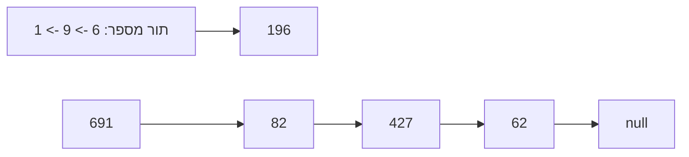
</div>

#### School Solution

```csharp
public class Solution
{
    public static int ToNumber(Queue<int> q)
    {
        int number = 0;
        int multiplier = 1;

        while (!q.IsEmpty())
        {
            number += q.Remove() * multiplier;
            multiplier *= 10;
        }

        return number;
    }

    public static int BigNumber(Node<Queue<int>> lst)
    {
        int biggest = 0;
        bool hasValue = false;

        while (lst != null)
        {
            int current = ToNumber(lst.GetValue());
            if (!hasValue || current > biggest)
            {
                biggest = current;
                hasValue = true;
            }

            lst = lst.GetNext();
        }

        return biggest;
    }
}
```

### 381b2019-6 / 06 - שאלה 6

- Required: `Solution.Range`
- Signature metadata: `int[] -> int`
- School solution length: 1464 chars

#### Question Markdown

{: .print-pdf-source}
PDF source: [original question PDF](https://xn--7dbdbn4b5c.xn--eebf2b.com/bagruyot/2019.6.381/q6.pdf)

<div markdown="1" class="print-question-source" dir="rtl">
‫מדעי המחשב‪ ,‬קיץ תשע"ט‪ ,‬מס' ‪899381‬‬                     ‫‪-9-‬‬
                                                                  ‫נתונה המחלקה ‪ Range‬שיש לה שתי תכונות‪:‬‬       ‫‪.6‬‬
                                                                                 ‫‪ — low‬מספר מטיפוס שלם‪.‬‬
                                                                                 ‫‪ — high‬מספר מטיפוס שלם‪.‬‬
                                                                                         ‫‪ high‬גדול מ־ ‪. low‬‬
                          ‫הנח שלכל תכונה הוגדרו ב־ ‪ Java‬הפעולות ‪ get‬ו־ ‪ set‬וב־ ‪ C#‬הפעולות ‪ Get‬ו־ ‪. Set‬‬


                                                                ‫עץ טווחים הוא עץ שאיבריו הם מטיפוס ‪. Range‬‬
                        ‫עץ טווחים מסודר הוא עץ ריק או עץ טווחים שבו עבור כל צומת מתקיימים התנאים האלה‪:‬‬
     ‫אם יש בן שמאלי‪ ,‬אז ה־ ‪ low‬של הצומת שווה ל־ ‪ low‬של הבן השמאלי‪ ,‬וה־ ‪ high‬של הצומת גדול או שווה‬         ‫•‬
                                                                              ‫ל־ ‪ high‬של הבן השמאלי‪.‬‬
          ‫אם יש בן ימני‪ ,‬אז ה־ ‪ high‬של הצומת שווה ל־ ‪ high‬של הבן הימני‪ ,‬וה־ ‪ low‬של הצומת קטן או שווה‬      ‫•‬
                                                                                  ‫ל־ ‪ low‬של הבן הימני‪.‬‬
                                  ‫אם יש שני בנים‪ ,‬אז ה־ ‪ high‬של הבן השמאלי קטן מה־ ‪ low‬של הבן הימני‪.‬‬      ‫•‬


                                                                                   ‫דוגמה לעץ טווחים מסודר‪:‬‬
                                                     ‫‪tree‬‬


                                                    ‫‪1 10‬‬


                                        ‫‪1‬‬   ‫‪4‬‬                    ‫‪5 10‬‬


                              ‫‪1‬‬     ‫‪3‬‬                   ‫‪5‬‬   ‫‪6‬‬             ‫‪8 10‬‬


‫כתוב פעולה חיצונית בוליאנית בשם ‪ order‬ב־‪ Java‬או ‪ Order‬ב־ ‪ , C#‬המקבלת עץ טווחים או עץ ריק ומחזירה ‪true‬‬
                                                ‫אם העץ הוא עץ טווחים מסודר‪ ,‬אחרת — הפעולה מחזירה ‪. false‬‬


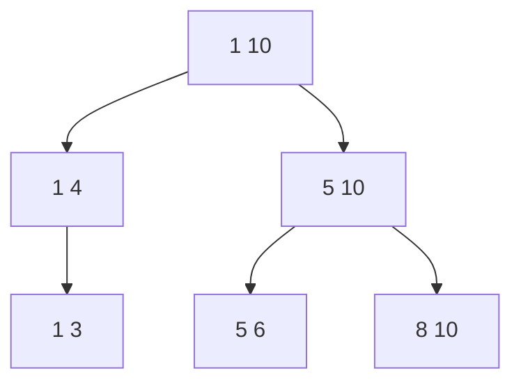
</div>

#### School Solution

```csharp
public class Range
{
    private int low;
    private int high;

    public Range(int low, int high)
    {
        this.low = low;
        this.high = high;
    }

    public int GetLow()
    {
        return low;
    }

    public int GetHigh()
    {
        return high;
    }

    public void SetLow(int low)
    {
        this.low = low;
    }

    public void SetHigh(int high)
    {
        this.high = high;
    }
}

public class Solution
{
    public static bool Order(BinNode<Range> tree)
    {
        if (tree == null)
        {
            return true;
        }

        Range current = tree.GetValue();
        BinNode<Range> left = tree.GetLeft();
        BinNode<Range> right = tree.GetRight();

        if (left != null)
        {
            Range leftValue = left.GetValue();
            if (current.GetLow() != leftValue.GetLow() || current.GetHigh() < leftValue.GetHigh())
            {
                return false;
            }
        }

        if (right != null)
        {
            Range rightValue = right.GetValue();
            if (current.GetHigh() != rightValue.GetHigh() || current.GetLow() > rightValue.GetLow())
            {
                return false;
            }
        }

        if (left != null && right != null)
        {
            if (left.GetValue().GetHigh() >= right.GetValue().GetLow())
            {
                return false;
            }
        }

        return Order(left) && Order(right);
    }
}
```


## 381b2020-5 - בגרות במדעי המחשב שאלון 899381 מועד מיוחד אוגוסט 2020

### 381b2020-5 / 04 - שאלה 4

- Required: `Solution.BuildDigit`
- Signature metadata: `int[] -> int`
- School solution length: 833 chars

#### Question Markdown

{: .print-pdf-source}
PDF source: [original question PDF](https://xn--7dbdbn4b5c.xn--eebf2b.com/bagruyot/2020.5.381/q4.pdf)

<div markdown="1" class="print-question-source" dir="rtl">
                                                       ענה על שתיים מן השאלות ( .6-4לכל שאלה —  20נקודות)
        "שרשרת מספרים שלמים חיוביים" היא שרשרת חוליות שכל חוליה בה מכילה מספר שלם הגדול מ־ . 0        •   .4
  "שרשרת ְספרות" היא שרשרת חוליות שכל חוליה בה מכילה ִספרה בין  0ל־ ( 9כולל) או את המספר ). (- 9      •
                          הספרה הראשונה מייצגת את האחדותִ ,
      הספרה השנייה את העשרות                             כל רצף ְספרות בשרשרת מייצג מספרִ :
               וכן הלאה .לאחר כל רצף של ספרות מופיע המספר ) , (- 9והוא מסמן סוף של מספר בשרשרת.

                                   לפניך דוגמה ל"שרשרת ספרות" המייצגת את המספרים. 92 , 4 , 543 :
lst
       2           9        -9         4         -9         3          4         5         - 9 null


        כתוב פעולה חיצונית בשפת  Javaבשם  buildDigitאו בשפת  C#בשם  , BuildDigitהמקבלת הפניה lst
           שאינה  nullל"שרשרת מספרים שלמים חיוביים" .הפעולה תחזיר "שרשרת ספרות" המייצגת את המספרים
                                                           שב"שרשרת מספרים שלמים חיוביים" לפי הסדר.

</div>

#### School Solution

```csharp
public class Solution
{
    public static Node<int> BuildDigit(Node<int> lst)
    {
        Node<int> head = null;
        Node<int> tail = null;

        while (lst != null)
        {
            int number = lst.GetValue();
            while (number > 0)
            {
                AppendValue(ref head, ref tail, number % 10);
                number /= 10;
            }

            AppendValue(ref head, ref tail, -9);
            lst = lst.GetNext();
        }

        return head;
    }

    private static void AppendValue(ref Node<int> head, ref Node<int> tail, int value)
    {
        Node<int> node = new Node<int>(value);

        if (head == null)
        {
            head = node;
            tail = node;
        }
        else
        {
            tail.SetNext(node);
            tail = node;
        }
    }
}
```

### 381b2020-5 / 05 - שאלה 5

- Required: `Solution.RemoveBlocks`
- Signature metadata: `int[] -> int`
- School solution length: 510 chars

#### Question Markdown

{: .print-pdf-source}
PDF source: [original question PDF](https://xn--7dbdbn4b5c.xn--eebf2b.com/bagruyot/2020.5.381/q5.pdf)

<div markdown="1" class="print-question-source" dir="rtl">
מדעי המחשב ,מועד מיוחד ,אוגוסט  ,2020מס' 899381           -8-

                                                     נגדיר "בלוק" במחסנית כרצף של לפחות שני איברים זהים.   .5
    כתוב בשפת  Javaאו בשפת  C#פעולה חיצונית המקבלת מחסנית  — stkמטיפוס שלם ,ומחזירה מחסנית חדשה.
                                      המחסנית המוחזרת תכיל את כל האיברים מהמחסנית  stkשאינם ב"בלוק".
                                                                אין חשיבות לסדר האיברים במחסנית המוחזרת.

   		    הערות — :אם מספר מסוים מופיע לא ב"בלוק" ,הוא יהיה במחסנית המוחזרת גם אם נוסף על כך אותו המספר
                                                                                מופיע ב"בלוק".   		
        		 — אם מספר מסוים מופיע כמה פעמים ,לא ב"בלוק" ,הוא יופיע אותה כמות פעמים במחסנית המוחזרת.
                                                    		 — אם המחסנית  stkריקה ,תוחזר מחסנית ריקה.

                                                                                                  דוגמה:
                                            המחסנית המוחזרת                  מחסנית stk    		
                                                     15                           ראש המחסנית ! 14
                                                      3                            15
                                                      5                             5
                                                     15                             5
                                                     14                             0
                                                                                    0
                                                                                    0
                                                                                    5
                                                                                    3
                                                                                  -4
                                                                                  -4
                                                                                   15

</div>

#### School Solution

```csharp
public class Solution
{
    public static Stack<int> RemoveBlocks(Stack<int> stk)
    {
        Stack<int> result = new Stack<int>();

        while (!stk.IsEmpty())
        {
            int value = stk.Pop();
            int count = 1;

            while (!stk.IsEmpty() && stk.Top() == value)
            {
                stk.Pop();
                count++;
            }

            if (count == 1)
            {
                result.Push(value);
            }
        }

        return result;
    }
}
```

### 381b2020-5 / 06 - שאלה 6

- Required: `Solution.TreeEqual`
- Signature metadata: `int[] -> int`
- School solution length: 519 chars

#### Question Markdown

{: .print-pdf-source}
PDF source: [original question PDF](https://xn--7dbdbn4b5c.xn--eebf2b.com/bagruyot/2020.5.381/q6.pdf)

<div markdown="1" class="print-question-source" dir="rtl">
מדעי המחשב ,מועד מיוחד ,אוגוסט  ,2020מס' 899381            -9-

                        עץ בינרי מטיפוס שלם של מספרים שאינם שליליים הוא "עץ שאריות שוויוני" במקרה הזה:        .6
        כמות האיברים שמספריהם מתחלקים ב־  3עם שארית  1שווה לכמות האיברים שמספריהם מתחלקים ב־ 3
                                  עם שארית  , 2ושווה לכמות האיברים שמספריהם מתחלקים ב־  3ללא שארית.
                                                                              דוגמה של "עץ שאריות שוויוני":
                                                    tree

                                                     9

                                               7              10

                                          9          5             11


  עץ בינרי זה הוא "עץ שאריות שוויוני" משום שיש בו שני מספרים שמתחלקים ב־  3ללא שארית ( , )9 ,9שני מספרים
                    שמתחלקים ב־  3עם שארית  )10 ,7( 1ושני מספרים שמתחלקים ב־  3עם שארית . )11 ,5( 2


   כתוב פעולה חיצונית בוליאנית בשפת  Javaבשם  treeEqualאו בשפת  C#בשם  TreeEqualהמקבלת עץ בינרי
                         מטיפוס שלם ,לא ריק ,של מספרים שאינם שליליים ובודקת אם הוא "עץ שאריות שוויוני".
                                                         אם כן — תחזיר הפעולה  , trueאחרת היא תחזיר . false


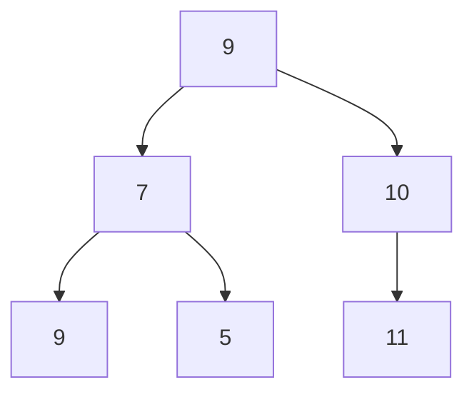
</div>

#### School Solution

```csharp
public class Solution
{
    public static bool TreeEqual(BinNode<int> tree)
    {
        int[] counts = new int[3];
        CountRemainders(tree, counts);
        return counts[0] == counts[1] && counts[1] == counts[2];
    }

    private static void CountRemainders(BinNode<int> tree, int[] counts)
    {
        if (tree == null)
        {
            return;
        }

        counts[tree.GetValue() % 3]++;
        CountRemainders(tree.GetLeft(), counts);
        CountRemainders(tree.GetRight(), counts);
    }
}
```

### 381b2020-5 / 13 - שאלה 13

- Required: `Solution.Trainer`
- Signature metadata: `int[] -> int`
- School solution length: 3190 chars

#### Question Markdown

{: .print-pdf-source}
PDF source: [original question PDF](https://xn--7dbdbn4b5c.xn--eebf2b.com/bagruyot/2020.5.381/q13.pdf)

<div markdown="1" class="print-question-source" dir="rtl">
       .13במועדון כושר "השלום" אפשר להתאמן בכל מתקני הכושר .נוסף על כך אפשר להתאמן אימון מיוחד שבו אפשר
                                              להשתמש בכל מתקני הכושר בליווי של מאמן אישי לזמן מוגדר.
                                              כדי לשמור מידע על המתרחש במועדון נבנו המחלקות שלפניך:
מאמן —  , Trainerאימון —  , Trainingאימון מיוחד —  , SpecialTלקוח —  , Clientהנהלה — . Management

                                                 התכונות של המחלקות הן בהתאם לדרישות המידע שלפניך:

                                                                             המידע ששומרים על מאמן:
                                                              — nameשם המאמן ,מטיפוס מחרוזת.       •   	
                                                                   — widמספר עובד ,מטיפוס שלם.     •   	

                                                                             המידע ששומרים על אימון:
                                   — numמספר המתקנים שבהם השתמש הלקוח באימון ,מטיפוס שלם.          •   	

                                                                       המידע ששומרים על אימון מיוחד:
                                   — numמספר המתקנים שבהם השתמש הלקוח באימון ,מטיפוס שלם.          •   	
                                       — trainerהמאמן שליווה את הלקוח באימון ,מטיפוס . Trainer     •   	
                     — timeמספר הדקות של האימון ,מטיפוס שלם .המספר גדול מ־  0ואינו מוגבל ל־ . 60   •   	

                                                                   המידע ששומרים על לקוחות המועדון:
                                                           — idמספר תעודת זהות ,מטיפוס מחרוזת.     •   	
                                                               — nameשם הלקוח ,מטיפוס מחרוזת.      •   	
                                        — visitsכל האימונים שהיו ללקוח ,במערך מטיפוס . Training    •   	

                                                                        המידע ששומרים בעבור ההנהלה:
                                      — staffכל המאמנים העובדים במועדון ,במערך מטיפוס . Trainer    •   
                                          — clientsכל הלקוחות של המועדון ,במערך מטיפוס . Client    •   
                                                  סרטט תרשים הייררכייה בין המחלקות.    א.
                                                            יש לסמן ירושה בעזרת החץ:
                                                           		
                                                       יש לסמן הכלה באמצעות הסימן:
                                                     כתוב את כותרות ותכונות המחלקה.     ב.
                                        הנח שיש פעולה בונה ופעולות  getו־  setבכל המחלקות.
 כתוב פעולה פנימית במחלקה  , Clientהמחזירה את סכום כל הדקות שלקוח התאמן אימון מיוחד.    ג.
                               הפעולה תחזיר  0אם הלקוח אף פעם לא התאמן אימון מיוחד.
כתוב פעולה פנימית במחלקה  , Managementהמחזירה את סך כל הלקוחות שהתאמנו אימון מיוחד      ד.
                                                                     לפחות פעם אחת.

</div>

#### School Solution

```csharp
public class Trainer
{
    private string name;
    private int wid;

    public Trainer(string name, int wid)
    {
        this.name = name;
        this.wid = wid;
    }

    public string GetName()
    {
        return name;
    }

    public int GetWid()
    {
        return wid;
    }

    public void SetName(string name)
    {
        this.name = name;
    }

    public void SetWid(int wid)
    {
        this.wid = wid;
    }
}

public class Training
{
    private int num;

    public Training(int num)
    {
        this.num = num;
    }

    public int GetNum()
    {
        return num;
    }

    public void SetNum(int num)
    {
        this.num = num;
    }
}

public class SpecialT : Training
{
    private Trainer trainer;
    private int time;

    public SpecialT(int num, Trainer trainer, int time)
        : base(num)
    {
        this.trainer = trainer;
        this.time = time;
    }

    public Trainer GetTrainer()
    {
        return trainer;
    }

    public int GetTime()
    {
        return time;
    }

    public void SetTrainer(Trainer trainer)
    {
        this.trainer = trainer;
    }

    public void SetTime(int time)
    {
        this.time = time;
    }
}

public class Client
{
    private string id;
    private string name;
    private Training[] visits;

    public Client(string id, string name, Training[] visits)
    {
        this.id = id;
        this.name = name;
        this.visits = visits;
    }

    public string GetId()
    {
        return id;
    }

    public string GetName()
    {
        return name;
    }

    public Training[] GetVisits()
    {
        return visits;
    }

    public void SetId(string id)
    {
        this.id = id;
    }

    public void SetName(string name)
    {
        this.name = name;
    }

    public void SetVisits(Training[] visits)
    {
        this.visits = visits;
    }

    public int TotalSpecialMinutes()
    {
        if (visits == null)
        {
            return 0;
        }

        int total = 0;
        for (int i = 0; i < visits.Length; i++)
        {
            if (visits[i] is SpecialT)
            {
                SpecialT special = (SpecialT)visits[i];
                total += special.GetTime();
            }
        }

        return total;
    }
}

public class Management
{
    private Trainer[] staff;
    private Client[] clients;

    public Management(Trainer[] staff, Client[] clients)
    {
        this.staff = staff;
        this.clients = clients;
    }

    public Trainer[] GetStaff()
    {
        return staff;
    }

    public Client[] GetClients()
    {
        return clients;
    }

    public void SetStaff(Trainer[] staff)
    {
        this.staff = staff;
    }

    public void SetClients(Client[] clients)
    {
        this.clients = clients;
    }

    public int CountClientsWithSpecialTraining()
    {
        if (clients == null)
        {
            return 0;
        }

        int count = 0;
        for (int i = 0; i < clients.Length; i++)
        {
            if (clients[i] != null && clients[i].TotalSpecialMinutes() > 0)
            {
                count++;
            }
        }

        return count;
    }
}
```

### 381b2020-5 / 14 - שאלה 14

- Required: `Solution.ItemDate`
- Signature metadata: `int[] -> int`
- School solution length: 3872 chars

#### Question Markdown

{: .print-pdf-source}
PDF source: [original question PDF](https://xn--7dbdbn4b5c.xn--eebf2b.com/bagruyot/2020.5.381/q14.pdf)

<div markdown="1" class="print-question-source" dir="rtl">
מדעי המחשב ,מועד מיוחד ,אוגוסט  ,2020מס' 899381        - 18 -

     .14בחנות הכולבו "הכול לבית" מוכרים מוצרי מזון שאינם דורשים אחסון בקירור ,מוצרי מזון הדורשים אחסון בקירור
                                                                                       ומוצרי אלקטרוניקה.

                                                   כדי לנהל את מלאי המוצרים שבחנות נבנו המחלקות האלה:
               — Itemמוצר — FoodItem ,מוצר מזון — FoodRefrigerated ,מוצר מזון הדורש אחסון בקירור,
                                                       — ElectronicItemמוצר אלקטרוניקה. ItemDate ,
  ItemDateהיא מחלקה שמייצגת תאריך ויש בה  3תכונות מטיפוס מספר שלם :יום  , dayחודש  , monthשנה . year

                                                   התכונות של המחלקות הן בהתאם לדרישות המידע שלפניך:

                                                         המידע ששומרים בנוגע לכל אחד מן המוצרים בחנות:
                                                                   — nameשם המוצר ,מטיפוס מחרוזת.        •
                                                    — catalogNumberמספר קטלוגי ,מטיפוס מחרוזת.           •
                                               — quantityמספר פריטים מן המוצר במלאי ,מטיפוס שלם.         •
                — minQuantityהמספר המינימלי של הפריטים מן המוצר שיש להחזיק במלאי ,מטיפוס שלם.            •

                                                                המידע הנוסף ששומרים בנוגע לכל מוצרי המזון:
                                          — expiryDateתאריך התפוגה של המוצר ,מטיפוס . ItemDate           •

                                          המידע הנוסף ששומרים בנוגע למוצרי המזון הדורשים אחסון בקירור:
                   — minTemperatureהטמפרטורה המינימלית הנדרשת לאחסון מוצר המזון ,מטיפוס שלם.             •
                — maxTemperatureהטמפרטורה המקסימלית האפשרית לאחסון מוצר המזון ,מטיפוס שלם.               •

                                                        המידע הנוסף ששומרים בנוגע למוצרי האלקטרוניקה:
                         — guaranteeDateתאריך סוף האחריות של היצרן על המוצר ,מטיפוס . ItemDate           •

                  הערה :מוצרי המזון שאינם דורשים אחסון בקירור ומוצרי האלקטרוניקה נשמרים בכל טמפרטורה.

                                           אפשר להניח שבכל המחלקות יש פעולות בונות ופעולות  getו־ . set
                                                                      סרטט תרשים הייררכייה בין המחלקות:    א.
Item, ElectronicItem, FoodItem, FoodRefrigerated, ItemDate.

                                                                            יש לסמן ירושה באמצעות החץ:
                                                                           יש לסמן הכלה באמצעות הסימן:
     		    ַמ ֵמש את הפעולה הפנימית )(  . isMissingהפעולה תחזיר  trueבעבור המוצר אם מספר הפריטים במלאי     ב.
                                      נמוך ממספר הפריטים המינימלי הנדרש במלאי ,אחרת היא תחזיר . false
                                                                      יש לציין באיזו מחלקה נמצאת הפעולה.
                                                                         במחלקה  Testerהוגדרה הפעולה:      ג.
 { public class Tester
          { )public static boolean canBeStored (Item item, int temp
 		            } ;)return item.canBeStored (temp
 }

          הפעולה מחזירה  trueאם אפשר לשמור את המוצר  itemבטמפרטורה  , tempאחרת היא מחזירה . false
                                              הוסף פעולות נדרשות למחלקות כדי שהפעולה תבצע את הנדרש.
                                                            ציין בעבור כל פעולה באיזו מחלקה היא מוספת.

</div>

#### School Solution

```csharp
public class ItemDate
{
    private int day;
    private int month;
    private int year;

    public ItemDate(int day, int month, int year)
    {
        this.day = day;
        this.month = month;
        this.year = year;
    }

    public int GetDay()
    {
        return day;
    }

    public int GetMonth()
    {
        return month;
    }

    public int GetYear()
    {
        return year;
    }

    public void SetDay(int day)
    {
        this.day = day;
    }

    public void SetMonth(int month)
    {
        this.month = month;
    }

    public void SetYear(int year)
    {
        this.year = year;
    }
}

public class Item
{
    private string name;
    private string catalogNumber;
    private int quantity;
    private int minQuantity;

    public Item(string name, string catalogNumber, int quantity, int minQuantity)
    {
        this.name = name;
        this.catalogNumber = catalogNumber;
        this.quantity = quantity;
        this.minQuantity = minQuantity;
    }

    public string GetName()
    {
        return name;
    }

    public string GetCatalogNumber()
    {
        return catalogNumber;
    }

    public int GetQuantity()
    {
        return quantity;
    }

    public int GetMinQuantity()
    {
        return minQuantity;
    }

    public void SetName(string name)
    {
        this.name = name;
    }

    public void SetCatalogNumber(string catalogNumber)
    {
        this.catalogNumber = catalogNumber;
    }

    public void SetQuantity(int quantity)
    {
        this.quantity = quantity;
    }

    public void SetMinQuantity(int minQuantity)
    {
        this.minQuantity = minQuantity;
    }

    public bool isMissing()
    {
        return quantity < minQuantity;
    }

    public virtual bool canBeStored(int temp)
    {
        return true;
    }
}

public class FoodItem : Item
{
    private ItemDate expiryDate;

    public FoodItem(string name, string catalogNumber, int quantity, int minQuantity, ItemDate expiryDate)
        : base(name, catalogNumber, quantity, minQuantity)
    {
        this.expiryDate = expiryDate;
    }

    public ItemDate GetExpiryDate()
    {
        return expiryDate;
    }

    public void SetExpiryDate(ItemDate expiryDate)
    {
        this.expiryDate = expiryDate;
    }
}

public class FoodRefrigerated : FoodItem
{
    private int minTemperature;
    private int maxTemperature;

    public FoodRefrigerated(string name, string catalogNumber, int quantity, int minQuantity, ItemDate expiryDate, int minTemperature, int maxTemperature)
        : base(name, catalogNumber, quantity, minQuantity, expiryDate)
    {
        this.minTemperature = minTemperature;
        this.maxTemperature = maxTemperature;
    }

    public int GetMinTemperature()
    {
        return minTemperature;
    }

    public int GetMaxTemperature()
    {
        return maxTemperature;
    }

    public void SetMinTemperature(int minTemperature)
    {
        this.minTemperature = minTemperature;
    }

    public void SetMaxTemperature(int maxTemperature)
    {
        this.maxTemperature = maxTemperature;
    }

    public override bool canBeStored(int temp)
    {
        return temp >= minTemperature && temp <= maxTemperature;
    }
}

public class ElectronicItem : Item
{
    private ItemDate guaranteeDate;

    public ElectronicItem(string name, string catalogNumber, int quantity, int minQuantity, ItemDate guaranteeDate)
        : base(name, catalogNumber, quantity, minQuantity)
    {
        this.guaranteeDate = guaranteeDate;
    }

    public ItemDate GetGuaranteeDate()
    {
        return guaranteeDate;
    }

    public void SetGuaranteeDate(ItemDate guaranteeDate)
    {
        this.guaranteeDate = guaranteeDate;
    }
}

public class Tester
{
    public static bool canBeStored(Item item, int temp)
    {
        return item.canBeStored(temp);
    }
}
```

### 381b2020-5 / 15 - שאלה 15

- Required: `Solution.Trainer`
- Signature metadata: `int[] -> int`
- School solution length: 3190 chars

#### Question Markdown

{: .print-pdf-source}
PDF source: [original question PDF](https://xn--7dbdbn4b5c.xn--eebf2b.com/bagruyot/2020.5.381/q15.pdf)

<div markdown="1" class="print-question-source" dir="rtl">
       .15במועדון כושר "השלום" אפשר להתאמן בכל מתקני הכושר .נוסף על כך אפשר להתאמן אימון מיוחד שבו אפשר
                                              להשתמש בכל מתקני הכושר בליווי של מאמן אישי לזמן מוגדר.
                                              כדי לשמור מידע על המתרחש במועדון נבנו המחלקות שלפניך:
מאמן —  , Trainerאימון —  , Trainingאימון מיוחד —  , SpecialTלקוח —  , Clientהנהלה — . Management

                                                 התכונות של המחלקות הן בהתאם לדרישות המידע שלפניך:

                                                                             המידע ששומרים על מאמן:
                                                              — nameשם המאמן ,מטיפוס מחרוזת.       •   	
                                                                   — widמספר עובד ,מטיפוס שלם.     •   	

                                                                             המידע ששומרים על אימון:
                                   — numמספר המתקנים שבהם השתמש הלקוח באימון ,מטיפוס שלם.          •   	

                                                                       המידע ששומרים על אימון מיוחד:
                                   — numמספר המתקנים שבהם השתמש הלקוח באימון ,מטיפוס שלם.          •   	
                                       — trainerהמאמן שליווה את הלקוח באימון ,מטיפוס . Trainer     •   	
                     — timeמספר הדקות של האימון ,מטיפוס שלם .המספר גדול מ־  0ואינו מוגבל ל־ . 60   •   	

                                                                   המידע ששומרים על לקוחות המועדון:
                                                           — idמספר תעודת זהות ,מטיפוס מחרוזת.     •   	
                                                               — nameשם הלקוח ,מטיפוס מחרוזת.      •   	
                                        — visitsכל האימונים שהיו ללקוח ,במערך מטיפוס . Training    •   	

                                                                        המידע ששומרים בעבור ההנהלה:
                                      — staffכל המאמנים העובדים במועדון ,במערך מטיפוס . Trainer    •   
                                          — clientsכל הלקוחות של המועדון ,במערך מטיפוס . Client    •   
                                                  סרטט תרשים הייררכייה בין המחלקות.    א.
                                                            יש לסמן ירושה בעזרת החץ:
                                                           		
                                                       יש לסמן הכלה באמצעות הסימן:
                                                     כתוב את כותרות ותכונות המחלקה.    ב.
                                       הנח שיש פעולה בונה ופעולות  Getו־  Setבכל המחלקות.
 כתוב פעולה פנימית במחלקה  , Clientהמחזירה את סכום כל הדקות שלקוח התאמן אימון מיוחד.   ג.
                               הפעולה תחזיר  0אם הלקוח אף פעם לא התאמן אימון מיוחד.
כתוב פעולה פנימית במחלקה  , Managementהמחזירה את סך כל הלקוחות שהתאמנו אימון מיוחד     ד.
                                                                     לפחות פעם אחת.

</div>

#### School Solution

```csharp
public class Trainer
{
    private string name;
    private int wid;

    public Trainer(string name, int wid)
    {
        this.name = name;
        this.wid = wid;
    }

    public string GetName()
    {
        return name;
    }

    public int GetWid()
    {
        return wid;
    }

    public void SetName(string name)
    {
        this.name = name;
    }

    public void SetWid(int wid)
    {
        this.wid = wid;
    }
}

public class Training
{
    private int num;

    public Training(int num)
    {
        this.num = num;
    }

    public int GetNum()
    {
        return num;
    }

    public void SetNum(int num)
    {
        this.num = num;
    }
}

public class SpecialT : Training
{
    private Trainer trainer;
    private int time;

    public SpecialT(int num, Trainer trainer, int time)
        : base(num)
    {
        this.trainer = trainer;
        this.time = time;
    }

    public Trainer GetTrainer()
    {
        return trainer;
    }

    public int GetTime()
    {
        return time;
    }

    public void SetTrainer(Trainer trainer)
    {
        this.trainer = trainer;
    }

    public void SetTime(int time)
    {
        this.time = time;
    }
}

public class Client
{
    private string id;
    private string name;
    private Training[] visits;

    public Client(string id, string name, Training[] visits)
    {
        this.id = id;
        this.name = name;
        this.visits = visits;
    }

    public string GetId()
    {
        return id;
    }

    public string GetName()
    {
        return name;
    }

    public Training[] GetVisits()
    {
        return visits;
    }

    public void SetId(string id)
    {
        this.id = id;
    }

    public void SetName(string name)
    {
        this.name = name;
    }

    public void SetVisits(Training[] visits)
    {
        this.visits = visits;
    }

    public int TotalSpecialMinutes()
    {
        if (visits == null)
        {
            return 0;
        }

        int total = 0;
        for (int i = 0; i < visits.Length; i++)
        {
            if (visits[i] is SpecialT)
            {
                SpecialT special = (SpecialT)visits[i];
                total += special.GetTime();
            }
        }

        return total;
    }
}

public class Management
{
    private Trainer[] staff;
    private Client[] clients;

    public Management(Trainer[] staff, Client[] clients)
    {
        this.staff = staff;
        this.clients = clients;
    }

    public Trainer[] GetStaff()
    {
        return staff;
    }

    public Client[] GetClients()
    {
        return clients;
    }

    public void SetStaff(Trainer[] staff)
    {
        this.staff = staff;
    }

    public void SetClients(Client[] clients)
    {
        this.clients = clients;
    }

    public int CountClientsWithSpecialTraining()
    {
        if (clients == null)
        {
            return 0;
        }

        int count = 0;
        for (int i = 0; i < clients.Length; i++)
        {
            if (clients[i] != null && clients[i].TotalSpecialMinutes() > 0)
            {
                count++;
            }
        }

        return count;
    }
}
```

### 381b2020-5 / 16 - שאלה 16

- Required: `Solution.ItemDate`
- Signature metadata: `int[] -> int`
- School solution length: 3872 chars

#### Question Markdown

{: .print-pdf-source}
PDF source: [original question PDF](https://xn--7dbdbn4b5c.xn--eebf2b.com/bagruyot/2020.5.381/q16.pdf)

<div markdown="1" class="print-question-source" dir="rtl">
מדעי המחשב ,מועד מיוחד ,אוגוסט  ,2020מס' 899381        - 22 -

     .16בחנות הכולבו "הכול לבית" מוכרים מוצרי מזון שאינם דורשים אחסון בקירור ,מוצרי מזון הדורשים אחסון בקירור
                                                                                       ומוצרי אלקטרוניקה.

                                                   כדי לנהל את מלאי המוצרים שבחנות נבנו המחלקות האלה:
               — Itemמוצר — FoodItem ,מוצר מזון — FoodRefrigerated ,מוצר מזון הדורש אחסון בקירור,
                                                       — ElectronicItemמוצר אלקטרוניקה. ItemDate ,
  ItemDateהיא מחלקה שמייצגת תאריך ויש בה  3תכונות מטיפוס מספר שלם :יום  , dayחודש  , monthשנה . year

                                                   התכונות של המחלקות הן בהתאם לדרישות המידע שלפניך:

                                                         המידע ששומרים בנוגע לכל אחד מן המוצרים בחנות:
                                                                   — nameשם המוצר ,מטיפוס מחרוזת.        •
                                                    — catalogNumberמספר קטלוגי ,מטיפוס מחרוזת.           •
                                               — quantityמספר פריטים מן המוצר במלאי ,מטיפוס שלם.         •
                — minQuantityהמספר המינימלי של הפריטים מן המוצר שיש להחזיק במלאי ,מטיפוס שלם.            •

                                                                המידע הנוסף ששומרים בנוגע לכל מוצרי המזון:
                                          — expiryDateתאריך התפוגה של המוצר ,מטיפוס . ItemDate           •

                                          המידע הנוסף ששומרים בנוגע למוצרי המזון הדורשים אחסון בקירור:
                   — minTemperatureהטמפרטורה המינימלית הנדרשת לאחסון מוצר המזון ,מטיפוס שלם.             •
                — maxTemperatureהטמפרטורה המקסימלית האפשרית לאחסון מוצר המזון ,מטיפוס שלם.               •

                                                        המידע הנוסף ששומרים בנוגע למוצרי האלקטרוניקה:
                         — guaranteeDateתאריך סוף האחריות של היצרן על המוצר ,מטיפוס . ItemDate           •

                  הערה :מוצרי המזון שאינם דורשים אחסון בקירור ומוצרי האלקטרוניקה נשמרים בכל טמפרטורה.

                                          אפשר להניח שבכל המחלקות יש פעולות בונות ופעולות  Getו־ . Set
                                                                     סרטט תרשים הייררכייה בין המחלקות:    א.
Item, ElectronicItem, FoodItem, FoodRefrigerated, ItemDate.

                                                                            יש לסמן ירושה באמצעות החץ:
                                                                          יש לסמן הכלה באמצעות הסימן:
     		    ַמ ֵמש את הפעולה הפנימית )(  . IsMissingהפעולה תחזיר  trueבעבור המוצר אם מספר הפריטים במלאי     ב.
                                      נמוך ממספר הפריטים המינימלי הנדרש במלאי ,אחרת היא תחזיר . false
                                                                     יש לציין באיזו מחלקה נמצאת הפעולה.
                                                                        במחלקה  Testerהוגדרה הפעולה:       ג.
 { public class Tester
          { )public static bool CanBeStored (Item item, int temp
 		            } ;)return item.CanBeStored (temp
 }

              הפעולה מחזירה  trueאם אפשר לשמור את המוצר  itemבטמפרטורה  , tempאחרת היא מחזירה . false
                                                   הוסף פעולות נדרשות למחלקות כדי שהפעולה תבצע את הנדרש.
                                                                   ציין בעבור כל פעולה באיזו מחלקה היא מוספת.

</div>

#### School Solution

```csharp
public class ItemDate
{
    private int day;
    private int month;
    private int year;

    public ItemDate(int day, int month, int year)
    {
        this.day = day;
        this.month = month;
        this.year = year;
    }

    public int GetDay()
    {
        return day;
    }

    public int GetMonth()
    {
        return month;
    }

    public int GetYear()
    {
        return year;
    }

    public void SetDay(int day)
    {
        this.day = day;
    }

    public void SetMonth(int month)
    {
        this.month = month;
    }

    public void SetYear(int year)
    {
        this.year = year;
    }
}

public class Item
{
    private string name;
    private string catalogNumber;
    private int quantity;
    private int minQuantity;

    public Item(string name, string catalogNumber, int quantity, int minQuantity)
    {
        this.name = name;
        this.catalogNumber = catalogNumber;
        this.quantity = quantity;
        this.minQuantity = minQuantity;
    }

    public string GetName()
    {
        return name;
    }

    public string GetCatalogNumber()
    {
        return catalogNumber;
    }

    public int GetQuantity()
    {
        return quantity;
    }

    public int GetMinQuantity()
    {
        return minQuantity;
    }

    public void SetName(string name)
    {
        this.name = name;
    }

    public void SetCatalogNumber(string catalogNumber)
    {
        this.catalogNumber = catalogNumber;
    }

    public void SetQuantity(int quantity)
    {
        this.quantity = quantity;
    }

    public void SetMinQuantity(int minQuantity)
    {
        this.minQuantity = minQuantity;
    }

    public bool IsMissing()
    {
        return quantity < minQuantity;
    }

    public virtual bool CanBeStored(int temp)
    {
        return true;
    }
}

public class FoodItem : Item
{
    private ItemDate expiryDate;

    public FoodItem(string name, string catalogNumber, int quantity, int minQuantity, ItemDate expiryDate)
        : base(name, catalogNumber, quantity, minQuantity)
    {
        this.expiryDate = expiryDate;
    }

    public ItemDate GetExpiryDate()
    {
        return expiryDate;
    }

    public void SetExpiryDate(ItemDate expiryDate)
    {
        this.expiryDate = expiryDate;
    }
}

public class FoodRefrigerated : FoodItem
{
    private int minTemperature;
    private int maxTemperature;

    public FoodRefrigerated(string name, string catalogNumber, int quantity, int minQuantity, ItemDate expiryDate, int minTemperature, int maxTemperature)
        : base(name, catalogNumber, quantity, minQuantity, expiryDate)
    {
        this.minTemperature = minTemperature;
        this.maxTemperature = maxTemperature;
    }

    public int GetMinTemperature()
    {
        return minTemperature;
    }

    public int GetMaxTemperature()
    {
        return maxTemperature;
    }

    public void SetMinTemperature(int minTemperature)
    {
        this.minTemperature = minTemperature;
    }

    public void SetMaxTemperature(int maxTemperature)
    {
        this.maxTemperature = maxTemperature;
    }

    public override bool CanBeStored(int temp)
    {
        return temp >= minTemperature && temp <= maxTemperature;
    }
}

public class ElectronicItem : Item
{
    private ItemDate guaranteeDate;

    public ElectronicItem(string name, string catalogNumber, int quantity, int minQuantity, ItemDate guaranteeDate)
        : base(name, catalogNumber, quantity, minQuantity)
    {
        this.guaranteeDate = guaranteeDate;
    }

    public ItemDate GetGuaranteeDate()
    {
        return guaranteeDate;
    }

    public void SetGuaranteeDate(ItemDate guaranteeDate)
    {
        this.guaranteeDate = guaranteeDate;
    }
}

public class Tester
{
    public static bool CanBeStored(Item item, int temp)
    {
        return item.CanBeStored(temp);
    }
}
```


## 381b2020-6 - בגרות במדעי המחשב שאלון 899381 מועד קיץ תש"ף 2020

### 381b2020-6 / 05 - שאלה 5

- Required: `Solution.GetMinutes`
- Signature metadata: `int[] -> int`
- School solution length: 1634 chars

#### Question Markdown

{: .print-pdf-source}
PDF source: [original question PDF](https://xn--7dbdbn4b5c.xn--eebf2b.com/bagruyot/2020.6.381/q5.pdf)

<div markdown="1" class="print-question-source" dir="rtl">
.המסלול את שסיים מתחרה המייצגת Competitor מחלקה הוגדרה מרתון ריצת תחרות לקראת .5
:תכונות שלוש יש למחלקה
.שלם מטיפוס ,) 60 ל־ מוגבל אינו הדקות (מספר המסלול את לסיים למתחרה שנדרשו הדקות מספר — minutes •
.שלם מטיפוס ,)כולל 59 עד הוא השניות (מספר המסלול את לסיים למתחרה שנדרשו השניות מספר — seconds •
.מחרוזת מטיפוס המתחרה שם — name •
. Set ו־ Get הפעולות C# ובשפת set ו־ get הפעולות Java בשפת הוגדרו תכונה שלכל הנח
המסיימים מספר .המסלול את שסיימו המתחרים כל של אוסף המאגדת Race בשם מחלקה הוגדרה כך על נוסף
.ידוע אינו
.זהה בזמן המסלול את שסיימו מתחרים שני שאין הנח
: C# ובשפת Java בשפת הכתוב Race המחלקה של חלקי ממשק לפניך
סיבוכיות
הפעולה תיאור
הפעולה כותרת
O(n)
Competitor מטיפוס עצם מקבלת הפעולה
.לאוסף אותו ומוסיפה
בשפת rank( הממשק של הבאה הפעולה :לב שים
הסיבוכיות ודרישות )C# בשפת Rank או Java
.זו פעולה מממשים שבו לאופן רלוונטיות שלה
— Java בשפת
— C# בשפת
public void add ( Competitor x )
public void Add ( Competitor x )
O(n)
,המתחרה שם את ומחזירה דירוג מקבלת הפעולה
.באוסף זה דירוג שלו
בזמן המסלול את שסיים המתחרה הוא 1 :הדרכה
המסלול את שסיים המתחרה הוא 2 ,ביותר הקצר
.הלאה וכן ביותר הקצר השני בזמן
.המבוקש בדירוג מתחרה שקיים הנח
.מהאוסף איברים למחוק אין :הערה
— Java בשפת
— C# בשפת
public String rank ( int x )
public string Rank ( int x )
</div>

#### School Solution

```csharp
public class Competitor
{
    private int minutes;
    private int seconds;
    private string name;

    public int GetMinutes()
    {
        return minutes;
    }

    public int GetSeconds()
    {
        return seconds;
    }

    public string GetName()
    {
        return name;
    }

    public void SetMinutes(int minutes)
    {
        this.minutes = minutes;
    }

    public void SetSeconds(int seconds)
    {
        this.seconds = seconds;
    }

    public void SetName(string name)
    {
        this.name = name;
    }
}

public class Race
{
    private Node<Competitor> first;

    public void Add(Competitor x)
    {
        Node<Competitor> node = new Node<Competitor>(x);

        if (first == null || IsFaster(x, first.GetValue()))
        {
            node.SetNext(first);
            first = node;
            return;
        }

        Node<Competitor> current = first;
        while (current.GetNext() != null && !IsFaster(x, current.GetNext().GetValue()))
        {
            current = current.GetNext();
        }

        node.SetNext(current.GetNext());
        current.SetNext(node);
    }

    public string Rank(int x)
    {
        Node<Competitor> current = first;

        for (int i = 1; i < x; i++)
        {
            current = current.GetNext();
        }

        return current.GetValue().GetName();
    }

    private static bool IsFaster(Competitor first, Competitor second)
    {
        if (first.GetMinutes() != second.GetMinutes())
        {
            return first.GetMinutes() < second.GetMinutes();
        }

        return first.GetSeconds() < second.GetSeconds();
    }
}
```

### 381b2020-6 / 06 - שאלה 6

- Required: `Solution.PrintAll`
- Signature metadata: `int[] -> int`
- School solution length: 569 chars

#### Question Markdown

{: .print-pdf-source}
PDF source: [original question PDF](https://xn--7dbdbn4b5c.xn--eebf2b.com/bagruyot/2020.6.381/q6.pdf)

<div markdown="1" class="print-question-source" dir="rtl">
מן בעץ מסלול וכל ,)(כולל 9 ל־ 1 בין ספרה מכיל בו צומת שכל ,שלם מטיפוס בינארי עץ הוא "מספרים "עץ :נגדיר .6
השורש עד הלאה וכן העשרות ספרת את שמעליו הרמה ,האחדות ספרת את מייצג העלה :מספר מייצג לעלה השורש
.העץ של
.)לימין משמאל בעץ (במסלולים 123 , 122 , 195 :המספרים מיוצגים שלפניך המספרים בעץ :דוגמה
.)לימין משמאל בעץ (במסלולים 216 , 216 , 26 :המספרים מיוצגים שלפניך המספרים בעץ :נוספת דוגמה
שלם מטיפוס tree מספרים עץ תקבל הפעולה . C# בשפת PrintAll או Java בשפת printAll חיצונית פעולה כתוב
.מייצגים בעץ שהמסלולים המספרים כל את ותדפיס
.דבר תדפיס לא הפעולה null הוא tree אם
.מודפסים המספרים שבו לסדר חשיבות אין :הערה

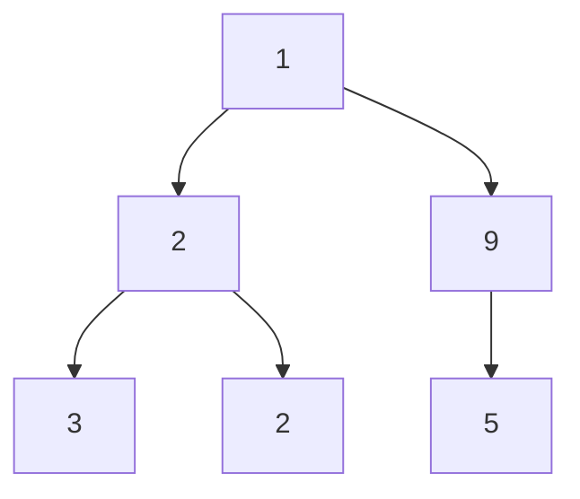

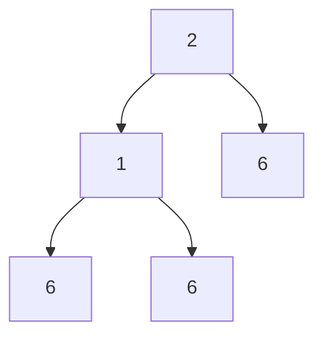
</div>

#### School Solution

```csharp
public class Solution
{
    public static void PrintAll(BinNode<int> tree)
    {
        PrintAll(tree, 0);
    }

    private static void PrintAll(BinNode<int> tree, int currentNumber)
    {
        if (tree == null)
        {
            return;
        }

        int nextNumber = currentNumber * 10 + tree.GetValue();
        if (tree.GetLeft() == null && tree.GetRight() == null)
        {
            Console.WriteLine(nextNumber);
            return;
        }

        PrintAll(tree.GetLeft(), nextNumber);
        PrintAll(tree.GetRight(), nextNumber);
    }
}
```

### 381b2020-6 / 07 - שאלה 4 בגרסת תור

- Required: `Solution.IsExist`
- Signature metadata: `int[] -> int`
- School solution length: 1284 chars

#### Question Markdown

### א. פעולה isExist

כתבו פעולה `isExist` (Java) או `IsExist` (C#):

- קלט: מספר `num` בין 0–9, תור `q`, 
- פלט: `true` אם קיים בתור מספר שספרת האחדות שלו היא `num`, אחרת `false`

הערות:
- המספרים אינם שליליים
- יש לשמור על מבנה התור

---

### ב. פעולה allExist

כתבו פעולה `allExist` (Java) או `AllExist` (C#):

- קלט: תור לא ריק `q`
- פלט: `true` אם כל הספרות המשמעותיות (הספרה השמאלית בכל מספר) מופיעות גם כספרות אחדות בתור, אחרת `false`

הערות:
- ניתן להשתמש ב־`isExist`
- ניתן להשתמש בפעולה:  
```java
public static Queue<Integer> clone(Queue<Integer> q)
````

```csharp
public static Queue<int> Clone(Queue<int> q)
```

* יש לשמור על מבנה התור

#### School Solution

```csharp
public static bool IsExist(int num, Queue<int> q)
    {
        Queue<int> temp = new Queue<int>();
        bool found = false;

        while (!q.IsEmpty())
        {
            int value = q.Remove();

            if (value % 10 == num)
                found = true;

            temp.Insert(value);
        }

        while (!temp.IsEmpty())
            q.Insert(temp.Remove());

        return found;
    }

public static Queue<int> Clone(Queue<int> q)
    {
        Queue<int> temp = new Queue<int>();
        Queue<int> copy = new Queue<int>();

        while (!q.IsEmpty())
        {
            int value = q.Remove();
            temp.Insert(value);
            copy.Insert(value);
        }

        while (!temp.IsEmpty())
            q.Insert(temp.Remove());

        return copy;
    }

public static bool AllExist(Queue<int> q)
    {
        Queue<int> copy = Clone(q);

        while (!copy.IsEmpty())
        {
            int value = copy.Remove();
            int significantDigit = GetSignificantDigit(value);

            if (!IsExist(significantDigit, q))
                return false;
        }

        return true;
    }

private static int GetSignificantDigit(int value)
    {
        while (value >= 10)
            value /= 10;

        return value;
    }
```


## 381b2021-5 - בגרות במדעי המחשב שאלון 899381 מועד קיץ נבצרים 2021

### 381b2021-5 / 04 - שאלה 4

- Required: `Solution.IsArranged`
- Signature metadata: `int[] -> int`
- School solution length: 974 chars

#### Question Markdown

{: .print-pdf-source}
PDF source: [original question PDF](https://xn--7dbdbn4b5c.xn--eebf2b.com/bagruyot/2021.5.381/q4.pdf)

<div markdown="1" class="print-question-source" dir="rtl">
                            "שרשרת מאורגנת" היא שרשרת חוליות מטיפוס שלם שמתקיימים בה התנאים האלה:          .4
                                                                    מספר החוליות בשרשרת הוא זוגי.     —
                    כל המספרים בחצי הראשון של השרשרת קטנים מכל המספרים בחצי השני של השרשרת.           —
                                                                             דוגמה ל"שרשרת מאורגנת":
 lst
          3           -4             4             7           15            9
                                                                                               null


כתוב פעולה חיצונית ששמה  isArrangedבשפת  Javaאו  IsArrangedבשפת  C#המקבלת שרשרת חוליות —              א.
         lstמטיפוס שלם ,שאינה  , nullומחזירה  trueאם היא "שרשרת מאורגנת" ,אחרת היא מחזירה . false
                                                                הערה :חובה לשמור על השרשרת . lst          		

                                                          מהי סיבוכיות זמן הריצה של פעולה זו? נמק.    ב.


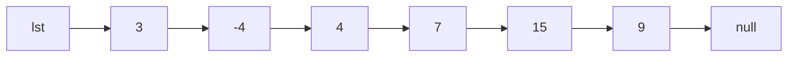
</div>

#### School Solution

```csharp
public class Solution
{
    public static bool IsArranged(Node<int> lst)
    {
        int count = 0;
        Node<int> current = lst;

        while (current != null)
        {
            count++;
            current = current.GetNext();
        }

        if (count % 2 != 0)
        {
            return false;
        }

        int half = count / 2;
        int maxFirstHalf = int.MinValue;
        int minSecondHalf = int.MaxValue;
        current = lst;

        for (int i = 0; i < half; i++)
        {
            if (current.GetValue() > maxFirstHalf)
            {
                maxFirstHalf = current.GetValue();
            }

            current = current.GetNext();
        }

        while (current != null)
        {
            if (current.GetValue() < minSecondHalf)
            {
                minSecondHalf = current.GetValue();
            }

            current = current.GetNext();
        }

        return maxFirstHalf < minSecondHalf;
    }
}
```

### 381b2021-5 / 05 - שאלה 5

- Required: `Solution.IsPrefix`
- Signature metadata: `int[] -> int`
- School solution length: 802 chars

#### Question Markdown

{: .print-pdf-source}
PDF source: [original question PDF](https://xn--7dbdbn4b5c.xn--eebf2b.com/bagruyot/2021.5.381/q5.pdf)

<div markdown="1" class="print-question-source" dir="rtl">
מדעי המחשב ,מועד קיץ נבצרים ,תשפ"א ,2021 ,מס' 899381            -6-

  שרשרת החוליות  lst1היא "תת־שרשרת תחילית" של שרשרת החוליות  lst2אם כל הערכים של  lst1מופיעים           א.   .5
                                   באותו רצף מתחילת ( lst2ייתכנו ערכים נוספים ב־  lst2אחרי רצף זה).

                                                    דוגמה ל־  lst1שהיא “תת־שרשרת תחילית" של : lst2
lst1
          3            2            4               7 null


lst2
          3            2            4               7            2            9 null


                                                    דוגמה ל־  lst1שאינה “תת־שרשרת תחילית" של : lst2
lst1
          3            2             4              7 null


lst2
          9            3             2              4            7             8            9 null


                                              דוגמה נוספת ל־  lst1שאינה “תת־שרשרת תחילית" של : lst2
lst1
          3            2             4               7 null


lst2
          3            2             4 null


  כתוב פעולה חיצונית ששמה  isPrefixבשפת  Javaאו  IsPrefixבשפת  C#המקבלת שתי שרשראות חוליות
                                                                 מטיפוס שלם  lst1ו־  lst2שאינן . null
                הפעולה תחזיר  trueאם  lst1היא “תת־שרשרת תחילית" של  , lst2אחרת היא תחזיר . false
                                                         הערה :חובה לשמור על השרשראות  lst1ו־ . lst2
 		    שרשרת החוליות  lst1היא "תת־שרשרת" של שרשרת החוליות  lst2אם כל הערכים של  lst1מופיעים         ב.
                                                                במקום כלשהו ב־  lst2באותו הרצף.

                                                       דוגמה ל־  lst1שהיא “תת־שרשרת" של : lst2
lst1
        3           2           4           7 null


lst2
        9           3           3           2             4           7            8           9 null


                                                      דוגמה ל־  lst1שאינה “תת־שרשרת" של : lst2
lst1
        4           7           8           9 null


lst2
         3          2           4           9            7            8 null


כתוב פעולה חיצונית ששמה  isSubChainבשפת  Javaאו  IsSubChainבשפת  C#המקבלת שתי שרשראות
                                                      חוליות מטיפוס שלם  lst1ו־  lst2שאינן . null
                    הפעולה תחזיר  trueאם  lst1היא "תת־שרשרת" של  , lst2אחרת היא תחזיר . false
                                                     הערה :חובה להשתמש בפעולה שכתבת בסעיף א.


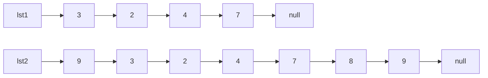

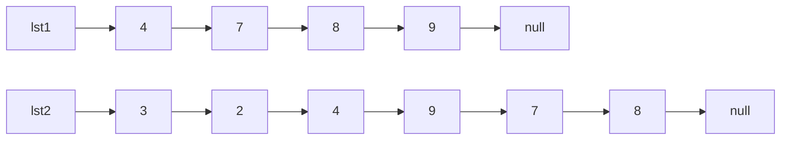
</div>

#### School Solution

```csharp
public class Solution
{
    public static bool IsPrefix(Node<int> lst1, Node<int> lst2)
    {
        Node<int> current1 = lst1;
        Node<int> current2 = lst2;

        while (current1 != null && current2 != null)
        {
            if (current1.GetValue() != current2.GetValue())
            {
                return false;
            }

            current1 = current1.GetNext();
            current2 = current2.GetNext();
        }

        return current1 == null;
    }

    public static bool IsSubChain(Node<int> lst1, Node<int> lst2)
    {
        Node<int> start = lst2;
        while (start != null)
        {
            if (IsPrefix(lst1, start))
            {
                return true;
            }

            start = start.GetNext();
        }

        return false;
    }
}
```

### 381b2021-5 / 06 - שאלה 6

- Required: `Solution.CovidTest`
- Signature metadata: `int[] -> int`
- School solution length: 1681 chars

#### Question Markdown

{: .print-pdf-source}
PDF source: [original question PDF](https://xn--7dbdbn4b5c.xn--eebf2b.com/bagruyot/2021.5.381/q6.pdf)

<div markdown="1" class="print-question-source" dir="rtl">
מדעי המחשב ,מועד קיץ נבצרים ,תשפ"א ,2021 ,מס' 899381           -8-

                              נתונה המחלקה  , CovidTestהמייצגת אדם שנבדק בדיקת קורונה ,ולה  4תכונות:      .6
                                                                  — nameשם הנבדק מטיפוס מחרוזת        •
                                                                      — idמספר זהות מטיפוס מחרוזת     •
              — cityCodeקוד של עיר המגורים ,מטיפוס שלם (לדוגמה 1030 :בעבור אשדוד 23 ,בעבור עכו)       •
                     — sickמשתנה מטיפוס בוליאני ,המקבל  trueאם הנבדק חולה ,אחרת הוא מקבל false        •
               הנח שיש פעולות  getו־  setבשפת  Javaופעולות  Getו־  Setבשפת  C#בעבור תכונות המחלקה.

            כתוב פעולה חיצונית  mostSickבשפת  Javaאו  MostSickבשפת  C#המקבלת תור —  qשאינו ריק

                   מטיפוס  . CovidTestהפעולה תחזיר את הקוד של העיר שבה כמות החולים היא הגדולה ביותר.

                                                       הערות – :מיקום הנבדקים בתור אינו לפי סדר כלשהו.
                                                              		 – כל נבדק מופיע רק פעם אחת בתור.
              		 – הקוד של העיר אינו קשור לגודל התור (לדוגמה :ייתכן שמספר האיברים בתור הוא , 1,000
                                                                 וקיים קוד עיר שמספרו .) 5000   			
                                                                      		 – אין צורך לשמור על התור.

                                                 הנח שיש רק עיר אחת שבה כמות החולים היא הגדולה ביותר.

</div>

#### School Solution

```csharp
public class CovidTest
{
    private string name;
    private string id;
    private int cityCode;
    private bool sick;

    public CovidTest(string name, string id, int cityCode, bool sick)
    {
        this.name = name;
        this.id = id;
        this.cityCode = cityCode;
        this.sick = sick;
    }

    public string GetName()
    {
        return this.name;
    }

    public string GetId()
    {
        return this.id;
    }

    public int GetCityCode()
    {
        return this.cityCode;
    }

    public bool GetSick()
    {
        return this.sick;
    }

    public void SetName(string name)
    {
        this.name = name;
    }

    public void SetId(string id)
    {
        this.id = id;
    }

    public void SetCityCode(int cityCode)
    {
        this.cityCode = cityCode;
    }

    public void SetSick(bool sick)
    {
        this.sick = sick;
    }
}

public class Solution
{
    public static int MostSick(Queue<CovidTest> q)
    {
        Dictionary<int, int> counts = new Dictionary<int, int>();
        int bestCity = -1;
        int bestCount = -1;

        while (!q.IsEmpty())
        {
            CovidTest current = q.Remove();
            if (!current.GetSick())
            {
                continue;
            }

            int cityCode = current.GetCityCode();
            int count = 1;
            if (counts.ContainsKey(cityCode))
            {
                count = counts[cityCode] + 1;
            }

            counts[cityCode] = count;
            if (count > bestCount)
            {
                bestCount = count;
                bestCity = cityCode;
            }
        }

        return bestCity;
    }
}
```


## 381b2021-6 - בגרות במדעי המחשב שאלון 899381 מועד קיץ תשפ"א 2021

### 381b2021-6 / 04 - שאלה 4

- Required: `Solution.BiList`
- Signature metadata: `int[] -> int`
- School solution length: 2351 chars

#### Question Markdown

{: .print-pdf-source}
PDF source: [original question PDF](https://xn--7dbdbn4b5c.xn--eebf2b.com/bagruyot/2021.6.381/q4.pdf)

<div markdown="1" class="print-question-source" dir="rtl">
                                          בשאלה זו תוכל להשתמש בפעולה החיצונית שלפניך בלי לממש אותה.      .4

                           כותרת הפעולה                                        תיאור הפעולה

                                                         בשפת Java       הפעולה מקבלת מספר — num
)public static Node<Integer> delete (int num, Node<Integer> lst         והפנָ יה לתחילת שרשרת חוליות
                                                           בשפת C#                              — . lst
)public static Node<int> Delete (int num, Node<int> lst                     הפעולה מוחקת את החוליות
                                                                       שבהן הערך  numומחזירה הפנָ יה
                                                                                לתחילת שרשרת החוליות.

                                                    נתונה המחלקה  — BiListדו־שרשרת ,ולה שתי תכונות:
                                                     •  — lst1הפניה לתחילת שרשרת חוליות מטיפוס שלם
                                                     •  — lst2הפניה לתחילת שרשרת חוליות מטיפוס שלם

                                              לפניך ממשק חלקי של המחלקה  BiListבשפות  Javaו־ . C#
                                                       יש להשתמש בפעולות הממשק ללא צורך לממש אותן.

                      כותרת הפעולה                                        תיאור הפעולה

)( public BiList                                                פעולה הבונה את העצם עם הפניות לשתי
                                                                                    שרשראות ריקות.

                                               בשפת Java         פעולה המוסיפה חוליה שבה הערך num
)public void addNum (int num, int codeList                  לסוף השרשרת  lst1או לסוף השרשרת lst2
                                                בשפת C#                            בהתאם ל־ : codeList
)public void AddNum (int num, int codeList                   כאשר  , codeList = 1יוכנס  numל־ , lst1
                                                            וכאשר  , codeList = 2יוכנס  numל־ . lst2
                                                                 הנח שהערך של הפרמטר  codeListתקין.
                 כתוב פעולה חיצונית ששמה  generateBilistבשפת  Javaאו  GenerateBilistבשפת  C#המקבלת
         שרשרת חוליות —  lstשל מספרים שלמים .מספר החוליות ב־  lstזוגי והמספרים בחוליות שלה שונים זה מזה.
                                                הפעולה תחזיר עצם מטיפוס  BiListשמתקיימים בו התנאים האלה:
                                  — כל אחד מן המספרים שבשרשרת  lstיופיע באחת מן השרשראות  lst1ו־ . lst2
                                       — כל המספרים בשרשרת  lst1יהיו גדולים מכל המספרים בשרשרת . lst2
                                                        — מספר החוליות בשתי השרשראות  lst1ו־  lst2יהיה זהה.

שים לב :אין להוסיף פעולות ,גם לא פעולות  getו־  setבשפת  Javaאו  Getו־  Setבשפת  , C#למחלקה . BiList

                                                                                                       דוגמה:
                                                                                    בעבור השרשרת  lstשלפניך:
lst
           88            -9               0               10           6            13 null


                                                                                   הפעולה תחזיר את העצם הזה:
BiList
  lst1
                88            10              13 null

  lst2
              -9              0               6 null


                                                                                                       הערות:
                                                                           אין צורך לשמור על השרשרת . lst   —
                                                   אין חשיבות לסדר האיברים בשרשרת  lst1ובשרשרת . lst2       —

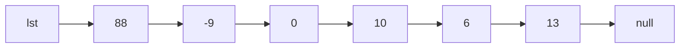

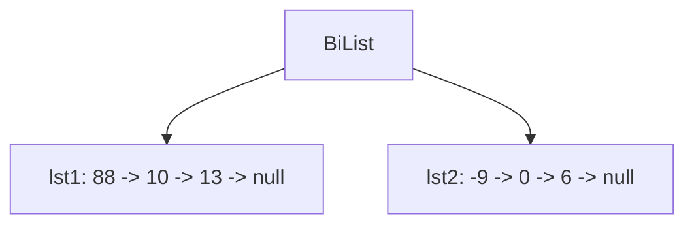
</div>

#### School Solution

```csharp
public class BiList
{
    private Node<int> lst1;
    private Node<int> lst2;

    public BiList()
    {
        lst1 = null;
        lst2 = null;
    }

    public void AddNum(int num, int codeList)
    {
        if (codeList == 1)
        {
            lst1 = AddToEnd(lst1, num);
        }
        else
        {
            lst2 = AddToEnd(lst2, num);
        }
    }

    private Node<int> AddToEnd(Node<int> head, int value)
    {
        if (head == null)
        {
            return new Node<int>(value);
        }

        Node<int> current = head;
        while (current.GetNext() != null)
        {
            current = current.GetNext();
        }

        current.SetNext(new Node<int>(value));
        return head;
    }
}

public class Solution
{
    public static Node<int> Delete(int num, Node<int> lst)
    {
        while (lst != null && lst.GetValue() == num)
        {
            lst = lst.GetNext();
        }

        Node<int> current = lst;
        while (current != null && current.GetNext() != null)
        {
            if (current.GetNext().GetValue() == num)
            {
                current.SetNext(current.GetNext().GetNext());
            }
            else
            {
                current = current.GetNext();
            }
        }

        return lst;
    }

    public static BiList GenerateBilist(Node<int> lst)
    {
        int count = 0;
        Node<int> current = lst;
        while (current != null)
        {
            count++;
            current = current.GetNext();
        }

        int half = count / 2;
        BiList result = new BiList();
        current = lst;

        for (int i = 0; i < half; i++)
        {
            int max = FindMax(current);
            result.AddNum(max, 1);
            current = Delete(max, current);
        }

        while (current != null)
        {
            result.AddNum(current.GetValue(), 2);
            current = current.GetNext();
        }

        return result;
    }

    private static int FindMax(Node<int> lst)
    {
        int max = lst.GetValue();
        Node<int> current = lst.GetNext();
        while (current != null)
        {
            if (current.GetValue() > max)
            {
                max = current.GetValue();
            }

            current = current.GetNext();
        }

        return max;
    }
}
```

### 381b2021-6 / 05 - שאלה 5

- Required: `Solution.Move`
- Signature metadata: `int[] -> int`
- School solution length: 581 chars

#### Question Markdown

{: .print-pdf-source}
PDF source: [original question PDF](https://xn--7dbdbn4b5c.xn--eebf2b.com/bagruyot/2021.6.381/q5.pdf)

<div markdown="1" class="print-question-source" dir="rtl">
מדעי המחשב ,קיץ תשפ"א ,מס' 899381                  - 14 -

  בשרשרת חוליות" ,העברה מעגלית של  nחוליות" היא העברת  nהחוליות האחרונות לתחילת השרשרת (בלי לשנות         .5
                                                                                       את סדר הופעתן).

                           בדוגמה שלפניך בעבור  : n = 2מעבירים את שתי החוליות האחרונות לתחילת השרשרת.

                                                                            שרשרת החוליות לפני ההעברה
 lst
          5            1              2            8              4 null


                                                                           שרשרת החוליות לאחר ההעברה
 lst
          8            4              5            1              2 null


       כתוב פעולה חיצונית ששמה  moveבשפת  Javaאו  Moveבשפת  C#המקבלת שרשרת חוליות — lst              א.
מטיפוס שלם ומספר  nמטיפוס שלם .הפעולה תחזיר את שרשרת החוליות לאחר "העברה מעגלית של  nחוליות".
                                                       הנח n $ 0 :ומספר החוליות בשרשרת גדול מ־ . n
                                             מהי סיבוכיות זמן הריצה של הפעולה שכתבת בסעיף א? נמק.    ב.

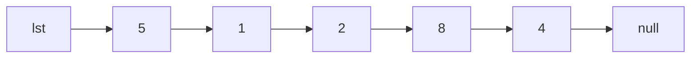

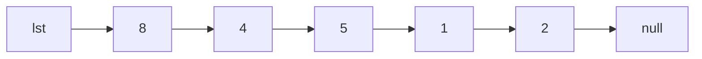
</div>

#### School Solution

```csharp
public class Solution
{
    public static Node<int> Move(Node<int> lst, int n)
    {
        int length = 1;
        Node<int> tail = lst;
        while (tail.GetNext() != null)
        {
            tail = tail.GetNext();
            length++;
        }

        int stepsToNewTail = length - n - 1;
        Node<int> newTail = lst;
        for (int i = 0; i < stepsToNewTail; i++)
        {
            newTail = newTail.GetNext();
        }

        Node<int> newHead = newTail.GetNext();
        newTail.SetNext(null);
        tail.SetNext(lst);
        return newHead;
    }
}
```

### 381b2021-6 / 07 - שאלה 7

- Required: `Solution.Size`
- Signature metadata: `int[] -> int`
- School solution length: 1356 chars

#### Question Markdown

{: .print-pdf-source}
PDF source: [original question PDF](https://xn--7dbdbn4b5c.xn--eebf2b.com/bagruyot/2021.6.381/q7.pdf)

<div markdown="1" class="print-question-source" dir="rtl">
מדעי המחשב ,קיץ תשפ"א ,מס' 899381                       - 17 -
                                                בשאלה זו תוכל להשתמש בפעולה החיצונית שלפניך בלי לממש אותה.             .7
                          כותרת הפעולה                                           תיאור הפעולה
 )public static int size (Queue<Integer> q     בשפת — Java          הפעולה מחזירה את מספר האיברים בתור q
 )public static int Size (Queue<int> q             בשפת — C#                                בלי לשנות את התור.

    שני תורים q1 ,ו־  , q2יהיו "תורים זהים" אם מספר האיברים בשני התורים זהה ,ובשני התורים מופיעים בדיוק           א.
                                                                                 אותם ערכים ובאותו הסדר.
                                                                                     דוגמה לשני תורים זהים:
            ראש                                                      ראש
            התור                                                     התור
                                            הכנסת                                                         הכנסת
q1           6       2    8      9          ערכים        q2            6     2   8       9                ערכים

         כתוב פעולה חיצונית ששמה  isIdenticalבשפת  Javaאו  IsIdenticalבשפת  C#המקבלת שני תורים
                          מטיפוס שלם  q1ו־  , q2ומחזירה  trueאם התורים זהים ,אחרת היא מחזירה . false

                                     הערה :עם סיום הפעולה ,חובה לשמור על מבנה התורים המקורי שהתקבל.

                                             "העברה מההתחלה לסוף" היא העברת מספר מראש התור לסופו.                 ב.
                                                                                                דוגמה:
                   התור המקורי                                   		 התור אחרי "העברה מההתחלה לסוף"
            ראש                                                       ראש
            התור                                                      התור
                                            הכנסת                                                         הכנסת
q            4       6    2      5          ערכים        q             6     2    5      4                ערכים

           כתוב פעולה חיצונית ששמה  isSimilarבשפת  Javaאו  IsSimilarבשפת  C#המקבלת שני תורים
     מטיפוס שלם q1 ,ו־  . q2הפעולה מחזירה  trueאם התורים  q1ו־  q2זהים — בין שהם זהים כמו שהם ובין
שהם יהיו זהים לאחר שנבצע ב־ " q1העברה מההתחלה לסוף" ,פעם אחת או יותר .אחרת הפעולה מחזירה . false

                                           דוגמה :הפעולה תחזיר  trueבעבור שני התורים  q1ו־  q2שלפניך:
            ראש                                                       ראש
            התור                                                      התור
                                            הכנסת                                                         הכנסת
q1           4       6    5      7          ערכים        q2            5     7    4      6                ערכים

     זאת מכיוון שלאחר שבתור  q1נבצע פעמיים "העברה מההתחלה לסוף" ,הוא יהיה זהה לתור  , q2וייראה כך:
            ראש
            התור
                                            הכנסת
q1           5       7    4      6          ערכים

                                                   חובה להשתמש בפעולה שכתבת בסעיף א.          —     הערות:
 /המשך בעמוד /18                         אין צורך לשמור על מבנה התורים המקורי שהתקבל.         —      		

</div>

#### School Solution

```csharp
public class Solution
{
    public static int Size(Queue<int> q)
    {
        Queue<int> temp = new Queue<int>();
        int count = 0;

        while (!q.IsEmpty())
        {
            int value = q.Remove();
            temp.Insert(value);
            count++;
        }

        while (!temp.IsEmpty())
        {
            q.Insert(temp.Remove());
        }

        return count;
    }

    public static bool IsIdentical(Queue<int> q1, Queue<int> q2)
    {
        int size1 = Size(q1);
        int size2 = Size(q2);
        if (size1 != size2)
        {
            return false;
        }

        bool identical = true;
        for (int i = 0; i < size1; i++)
        {
            int first = q1.Remove();
            int second = q2.Remove();
            if (first != second)
            {
                identical = false;
            }

            q1.Insert(first);
            q2.Insert(second);
        }

        return identical;
    }

    public static bool IsSimilar(Queue<int> q1, Queue<int> q2)
    {
        int size = Size(q1);
        if (size != Size(q2))
        {
            return false;
        }

        for (int i = 0; i < size; i++)
        {
            if (IsIdentical(q1, q2))
            {
                return true;
            }

            q1.Insert(q1.Remove());
        }

        return false;
    }
}
```


## 381b2022-6 - בגרות במדעי המחשב שאלון 899381 מועד קיץ 2022

### 381b2022-6 / 04 - שאלה 4

- Required: `Solution.Range`
- Signature metadata: `int[] -> int`
- School solution length: 1222 chars

#### Question Markdown

{: .print-pdf-source}
PDF source: [original question PDF](https://xn--7dbdbn4b5c.xn--eebf2b.com/bagruyot/2022.6.381/q4.pdf)

<div markdown="1" class="print-question-source" dir="rtl">
                                                        ענו על שתיים מן השאלות ( 7–4לכל שאלה –  25נקודות).
                                                          נתונה המחלקה  – Rangeטווח ,ולה שתי תכונות:        .4
                                                                             – lowמספר מטיפוס שלם       •
                                                                            – highמספר מטיפוס שלם       •
                                                        המספר  highגדול או שווה ל־ .(high $ low) low
                                          הניחו שיש פעולות  get/Getו־  set/Setבעבור תכונות המחלקה.
       מספר כלשהו“ , x ,מוכל" בעצם מטיפוס  Rangeאם הוא נמצא בטווח המספרים שבין  lowובין high
                                                                                        (.)high $ x $ low
שרשרת חוליות –  lst1מטיפוס שלם “מוכלת" בשרשרת חוליות –  lst2מטיפוס  Rangeאם בעבור כל מספר
                                                   בשרשרת  lst1קיימת חוליה בשרשרת  lst2המכילה אותו.

                                                               דוגמה לשרשרת  lst1המוכלת בשרשרת : lst2
lst1
           -9           -8               -7               12              14               15 null

lst2
                                                                               null

          Range        Range            Range           Range            Range
          low: -20     low: -9          low: 2          low: 12          low: 14
          high: -10    high: 0          high: 4         high: 12         high: 17


                                                        דוגמה לשרשרת  lst1שאינה מוכלת בשרשרת : lst2
lst1
             1               5                8                12 null

lst2
                                                                                 null

           Range        Range            Range            Range            Range
           low: -20     low: -9          low: 1           low: 9           low: 20
           high: -10    high: 0          high: 6          high: 12         high: 100

                                 הסבר :המספר  8שבשרשרת  lst1אינו "מוכל" בשום חוליה בשרשרת . lst2
                                                                        ממשו את הפעולה החיצונית שלהלן:

)Java – public static boolean isIncluded (Node<Integer> lst1, Node<Range> lst2
)C# – public static bool IsIncluded (Node<int> lst1, Node<Range> lst2

       הפעולה מחזירה  trueאם “ lst1מוכלת" ב־  , lst2אחרת היא מחזירה  . falseהפעולה חייבת לעבוד בסיבוכיות
                                                                                      זמן ריצה של (. O)N
                                             הערה N :הוא אורך השרשרת הארוכה יותר מבין שתי השרשראות.
                                                                                                   הנחות:
                                                                              lst1ו־  lst2אינם . null   –
                                                בשרשרת  lst2כל העצמים מטיפוס  Rangeאינם . null          –
                                                                  השרשרת  lst1ממוינת בסדר עולה.         –
   השרשרת  lst2ממוינת בסדר עולה ,כלומר ,ערך ה־  highשל כל חוליה קטן מערך ה־  lowשל החוליה הבאה          –
                                                אחריה בשרשרת (כפי שמופיע בדוגמאות בעמוד הקודם).


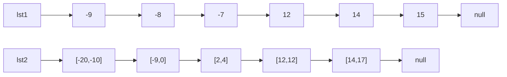

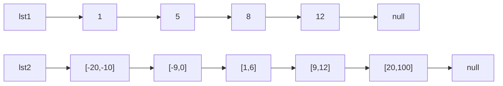
</div>

#### School Solution

```csharp
public class Range
{
    private int low;
    private int high;

    public Range(int low, int high)
    {
        this.low = low;
        this.high = high;
    }

    public int GetLow()
    {
        return this.low;
    }

    public void SetLow(int low)
    {
        this.low = low;
    }

    public int GetHigh()
    {
        return this.high;
    }

    public void SetHigh(int high)
    {
        this.high = high;
    }
}

public class Solution
{
    public static bool IsIncluded(Node<int> lst1, Node<Range> lst2)
    {
        Node<int> currentNumber = lst1;
        Node<Range> currentRange = lst2;

        while (currentNumber != null)
        {
            int value = currentNumber.GetValue();

            while (currentRange != null && currentRange.GetValue().GetHigh() < value)
            {
                currentRange = currentRange.GetNext();
            }

            if (currentRange == null)
            {
                return false;
            }

            Range range = currentRange.GetValue();
            if (value < range.GetLow())
            {
                return false;
            }

            currentNumber = currentNumber.GetNext();
        }

        return true;
    }
}
```

### 381b2022-6 / 06 - 5 בצורה של תור במקום מחסנית

- Required: `Solution.TwoQueue`
- Signature metadata: `int[] -> int`
- School solution length: 2890 chars

#### Question Markdown

### כמו 5 – תור וסכומים מצטברים

נתונה המחלקה `TwoQueue`, ולה שתי תכונות:

* `numbers` – תור מטיפוס שלם (`Queue<int>`)  
* `sums` – תור מטיפוס שלם (`Queue<int>`)

הקשר בין התור `sums` לבין התור `numbers` הוא כדלקמן:

* האיבר האחרון בתור `sums` שווה לאיבר האחרון בתור `numbers`  
* האיבר שלפניו בתור `sums` שווה לסכום שני האיברים האחרונים בתור `numbers`  
* האיבר שלפניו שווה לסכום שלושת האיברים האחרונים בתור `numbers`  
* וכן הלאה, עד האיבר הראשון בתור `sums`, ששווה לסכום כל האיברים בתור `numbers`

---

### א.

ממשו את הפעולה:

```csharp
public Queue<int> GetNums(int x)
```

הפעולה מקבלת מספר `x`, השווה לאחד המספרים בתור `sums`, ומחזירה תור חדש מטיפוס שלם (`Queue<int>`), שבו מופיעים האיברים מתוך התור `numbers` שסכומם שווה ל־`x`.

הנחות:

* המספר `x` קיים בתור `sums` ומופיע בו פעם אחת בלבד.  
* מותר לשנות את התורים של המחלקה.  
* אין חשיבות לסדר האיברים בתור המוחזר.

---

### ב.

ממשו את הפעולה:

```csharp
public void RemoveNum(int x)
```

הפעולה מוחקת את המספר `x` מן התור `numbers`, ומעדכנת את התור `sums` בהתאם.

הנחות:

* המספר `x` קיים בתור `numbers` ומופיע בו פעם אחת בלבד.  
* יש לשמור על סדר האיברים שנותרו בתור `numbers`.

#### School Solution

```csharp
public class TwoQueue
{
    public Queue<int> numbers;
    public Queue<int> sums;

    public TwoQueue()
    {
        numbers = new Queue<int>();
        sums = new Queue<int>();
    }

    public Queue<int> GetNums(int x)
    {
        Queue<int> tempSums = new Queue<int>();
        Queue<int> tempNumbers = new Queue<int>();
        Queue<int> result = new Queue<int>();

        bool found = false;

        // Move pairs from sums/numbers to temp until we find x.
        while (sums.IsEmpty() == false)
        {
            int s = sums.Remove();
            int n = numbers.Remove();

            tempSums.Insert(s);
            tempNumbers.Insert(n);

            if (s == x && !found)
            {
                // current n is start of desired suffix
                result.Insert(n);

                // move the rest of pairs into temp and collect their numbers into result
                while (sums.IsEmpty() == false)
                {
                    int sRem = sums.Remove();
                    int nRem = numbers.Remove();
                    tempSums.Insert(sRem);
                    tempNumbers.Insert(nRem);
                    result.Insert(nRem);
                }

                found = true;
                break;
            }
        }

        // Restore original queues in original order from temps
        while (tempSums.IsEmpty() == false)
        {
            int s = tempSums.Remove();
            int n = tempNumbers.Remove();
            sums.Insert(s);
            numbers.Insert(n);
        }

        return result;
    }

    public void RemoveNum(int x)
    {
        // Remove x from numbers while preserving order.
        Queue<int> kept = new Queue<int>();

        bool removed = false;
        while (numbers.IsEmpty() == false)
        {
            int n = numbers.Remove();
            if (n == x && !removed)
            {
                removed = true;
                continue;
            }
            kept.Insert(n);
        }

        // Move kept back into numbers
        while (kept.IsEmpty() == false)
        {
            int v = kept.Remove();
            numbers.Insert(v);
        }

        // Rebuild sums according to new numbers:
        // First compute total sum by moving numbers to temp.
        int total = 0;
        Queue<int> temp = new Queue<int>();
        while (numbers.IsEmpty() == false)
        {
            int v = numbers.Remove();
            total += v;
            temp.Insert(v);
        }

        // Clear existing sums before building new ones.
        while (sums.IsEmpty() == false)
        {
            sums.Remove();
        }

        // Create new sums and restore numbers.
        while (temp.IsEmpty() == false)
        {
            int v = temp.Remove();
            sums.Insert(total);
            numbers.Insert(v);
            total = total - v;
        }
    }
}
```

### 381b2022-6 / 07 - שאלה 7

- Required: `Solution.WordFromRoot`
- Signature metadata: `int[] -> int`
- School solution length: 469 chars

#### Question Markdown

{: .print-pdf-source}
PDF source: [original question PDF](https://xn--7dbdbn4b5c.xn--eebf2b.com/bagruyot/2022.6.381/q7.pdf)

<div markdown="1" class="print-question-source" dir="rtl">
מדעי המחשב ,קיץ תשפ"ב ,מס' 899381                       - 14 -

                                                                                         שאלה בנושא עץ בינארי       .7
                    בשאלה זו אפשר להשתמש בפעולה החיצונית    eraseFirst / EraseFirstשלהלן בלי לממש אותה.

              דוגמאות                         תיאור הפעולה                        כותרת הפעולה
    הפעולה מחזירה תת־מחרוזת – בעבור המחרוזת  "  , str = "hello                                   בשפת  : Java
 הפעולה תחזיר את המחרוזת  "."ello        ) public static String eraseFirst (String strשל   , strללא התו הראשון.
   – בעבור המחרוזת   "  , str = "temp     אם המחרוזת –   strריקה                                    בשפת  : C#
הפעולה תחזיר את המחרוזת  "."emp           )public static string EraseFirst (string str לפני זימון הפעולה ,תהיה
                                                          שגיאה.
      – בעבור המחרוזת  "  , str = "m
   הפעולה תחזיר מחרוזת ריקה  "".
 – בעבור המחרוזת הריקה  "" =   , str
                       תהיה שגיאה.

                                                                              ממשו את הפעולה החיצונית שלהלן:

)Java – public static boolean wordFromRoot (BinNode<Character> tree, String str
)C# – public static bool WordFromRoot (BinNode<char> tree, string str

            הפעולה מקבלת מחרוזת –   strהמכילה לפחות תו אחד ,והפניה לעץ בינארי של תווים –   treeשאינו  . null
         הפעולה תחזיר    trueאם קיים מסלול המתחיל בשורש העץ שבו רצף התווים זהה למחרוזת –  . strאחרת הפעולה
                                                                                                   תחזיר  . false
                                                                     הערה :אות קטנה ואות גדולה אינן זהות זו לזו.

                                                                                                         דוגמה:
                                                        בעבור העץ הנתון והמחרוזת  "  "helpהפעולה תחזיר  . true

                                                 tree
                                                         h
                                                 n               e

                                          p              u              l

                                                                 p

                                                                       u

                                                                                                       דוגמה:
                                                       בעבור העץ הנתון והמחרוזת  "  "helpהפעולה תחזיר  . false

                                           tree
                                                   h
                                                           v

                                                                  e

                                                           l

                                                  p

                                                           הסבר :לא קיים בעץ רצף תווים הזהה למחרוזת "."help


                                                                                                       דוגמה:
                                                       בעבור העץ הנתון והמחרוזת  "  "helpהפעולה תחזיר  . false
                                           tree
                                                  m
                                                           h

                                                   e

                                                           l

                                                  p

הסבר :אף על פי שקיים בעץ רצף תווים הזהה למחרוזת " , "helpהפעולה תחזיר   , falseכי הרצף אינו מתחיל בשורש העץ.

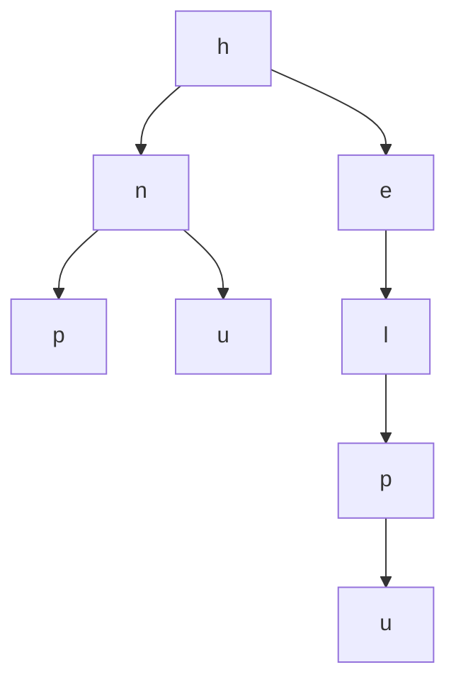

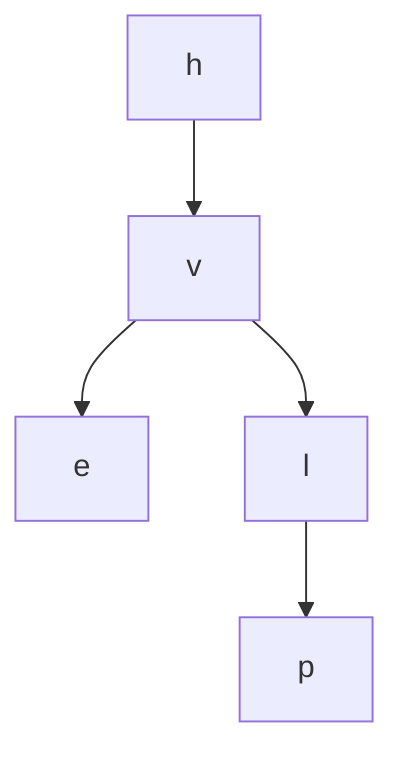

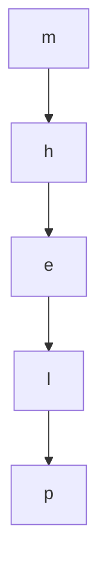
</div>

#### School Solution

```csharp
public class Solution
{
    public static bool WordFromRoot(BinNode<char> tree, string str)
    {
        if (tree == null)
        {
            return false;
        }

        if (tree.GetValue() != str[0])
        {
            return false;
        }

        if (str.Length == 1)
        {
            return true;
        }

        string rest = str.Substring(1);
        return WordFromRoot(tree.GetLeft(), rest) || WordFromRoot(tree.GetRight(), rest);
    }
}
```


## 381b2023-6 - בגרות במדעי המחשב שאלון 899381 מועד קיץ תשפ"ג 2023

### 381b2023-6 / 04 - שאלה 4

- Required: `Solution.TwoSum`
- Signature metadata: `int[] -> int`
- School solution length: 601 chars

#### Question Markdown

{: .print-pdf-source}
PDF source: [original question PDF](https://xn--7dbdbn4b5c.xn--eebf2b.com/bagruyot/2023.6.381/q4.pdf)

<div markdown="1" class="print-question-source" dir="rtl">
                                                                    ענו על שתיים מן השאלות ( 6–4לכל שאלה –  25נקודות).
                  בשאלה זו נוספה למחלקה    Queueהפעולה    size/Sizeשלפניכם .אפשר להשתמש בפעולה בלי לממש אותה.            .4

                                   כותרת הפעולה                                      תיאור הפעולה
                  )(Java – public int size                                   הפעולה מחזירה את מספר האיברים בתור.
                  )(C# – public int Size

                                                                                 ממשו את הפעולה החיצונית שלפניכם:
)Java – public static boolean twoSum (Queue<Integer> q, int x
)C# – public static bool TwoSum (Queue<int> q, int x


הפעולה מחזירה    trueאם בתור    qשהתקבל יש שני מספרים שסכומם שווה לערך הפרמטר   . xאחרת הפעולה מחזירה  . false
       דוגמה :עבור התור    qשלפניכם ו־    x = 10הפעולה תחזיר   , trueכי יש בתור שני מספרים ( )9 , 1שסכומם שווה ל־ . 10

           ראש
           התור
   q        5        4     1      4        3   15    9
                                                                                                               הערות:
                                                                           הניחו שבתור    qיש שני איברים לפחות.     –
                                                                                     אין צורך לשמור על התור  . q    –
                                                                אין להשתמש בשאלה זו במערך וברשימה מקושרת.           –

</div>

#### School Solution

```csharp
public class Solution
{
    public static bool TwoSum(Queue<int> q, int x)
    {
        while (!q.IsEmpty())
        {
            int first = q.Remove();
            Queue<int> temp = new Queue<int>();

            while (!q.IsEmpty())
            {
                int second = q.Remove();
                if (first + second == x)
                {
                    return true;
                }

                temp.Insert(second);
            }

            while (!temp.IsEmpty())
            {
                q.Insert(temp.Remove());
            }
        }

        return false;
    }
}
```

### 381b2023-6 / 05 - שאלה 5

- Required: `Solution.NumCount`
- Signature metadata: `int[] -> int`
- School solution length: 1952 chars

#### Question Markdown

{: .print-pdf-source}
PDF source: [original question PDF](https://xn--7dbdbn4b5c.xn--eebf2b.com/bagruyot/2023.6.381/q5.pdf)

<div markdown="1" class="print-question-source" dir="rtl">
מדעי המחשב ,קיץ תשפ"ג ,מס' 899381                        -6-

                                                         נתונה המחלקה   – NumCountמספר ערכים ,ולה שתי תכונות:       .5
                                                                                – numערך מספרי ,מטיפוס שלם. •
                                – countמספר המופעים של הערך  ) , (numמטיפוס שלם .המספר גדול או שווה ל־ . 0  •
             הניחו שקיימות פעולות    get/Getו־   set/Setלכל אחת מן התכונות במחלקה ,ופעולה בונה המקבלת ערכים עבור
                                                                                                תכונות המחלקה.
                                                     נתונה המחלקה   – OrderedListשרשרת ממוינת ,ולה תכונה אחת:
                                                   – lstמצביע על ראש של שרשרת חוליות מטיפוס  . NumCount      •
                      שרשרת החוליות ממוינת לפי סדר עולה של ערך התכונה –  . numערך התכונה    numשונה בכל חוליה.
   דוגמה :השרשרת שלפניכם מקיימת את תנאי המחלקה (השרשרת ממוינת בסדר עולה לפי ערך התכונה   , numוערך התכונה
                                                                                              numשונה בכל חוליה).
 OrderedList
     lst
                                                  null

                NumCount      NumCount       NumCount
                num: 3        num: 5         num: 8
                count: 9      count: 1       count: 2

                                              ( )1ממשו במחלקה    OrderedListאת הפעולה הפנימית שלפניכם:        א.
)Java – public void insertNum (int x
)C# – public void InsertNum (int x
                                                 הפעולה מוסיפה את הערך של    xלשרשרת באופן שלפניכם:
     אם קיימת בשרשרת חוליה שהתכונה    numשלה שווה ל־  , xהפעולה תגדיל  ב־   1את התכונה  (  countכמות      –
                                                                               המופעים) באותה החוליה.
אם השרשרת ריקה או שלא קיימת בשרשרת חוליה שהתכונה     numשלה שווה ל־  , xהפעולה תכניס חוליה חדשה,          –
שבה התכונה    numתהיה שווה ל־   xוהתכונה    countתהיה שווה ל־  , 1במיקום השומר את הסדר העולה של השרשרת.
                             דוגמה :עבור השרשרת המוצגת לעיל ו־  , x = 5בתום הפעולה תיראה השרשרת כך:
 OrderedList
     lst
                                                  null

                NumCount      NumCount       NumCount
                num: 3        num: 5         num: 8
                count: 9      count: 2       count: 2


  דוגמה נוספת :עבור אותה השרשרת המוצגת לעיל (בדוגמה הראשונה) ו־  , x = 4בתום הפעולה תיראה השרשרת
                                                                                                    כך:
 OrderedList
     lst
                                                                null

                NumCount      NumCount       NumCount      NumCount
                num: 3        num: 4         num: 5        num: 8
                count: 9      count: 1       count: 1      count: 2


                             ( )2מהי סיבוכיות זמן הריצה של הפעולה שכתבתם בסעיף א( ?)1נמקו את תשובתכם.
 "ערך המופע ה־  " nהוא הערך שמופיע ַ ּב ָמקום ה־  nלפי הסדר מתחילת השרשרת (בשקלול כמות המופעים –  countשל        ב.
                                                                                                      כל ערך).
                                           לדוגמה :עבור השרשרת שלפניכם ו־  n = 7הפעולה תחזיר את הערך . 8
 OrderedList
     lst
                                                                null

                NumCount      NumCount       NumCount      NumCount
                num: 3        num: 5         num: 8        num: 10
                count: 4      count: 1       count: 3      count: 1


          הסבר :סדר הערכים של השרשרת ברצף ,בהתאם לכמות המופעים שלהם ,הוא. 3 , 3 , 3 , 3 , 5 , 8 , 8 , 8 , 10 :
                                      n = 7ובמקום השביעי ברצף מופיע הערך  . 8לכן הפעולה תחזיר את הערך . 8


                                                    ממשו במחלקה  OrderedListאת הפעולה הפנימית שלפניכם:
)Java – public int valueN (int n
)C# – public int ValueN (int n
                                                  הפעולה מקבלת את המספר  , nומחזירה את "ערך המופע ה־ ." n
                                                                       הניחו ש"ערך המופע ה־  " nקיים בשרשרת.

</div>

#### School Solution

```csharp
public class NumCount
{
    private int num;
    private int count;

    public NumCount(int num, int count)
    {
        this.num = num;
        this.count = count;
    }

    public int GetNum()
    {
        return num;
    }

    public int GetCount()
    {
        return count;
    }

    public void SetNum(int num)
    {
        this.num = num;
    }

    public void SetCount(int count)
    {
        this.count = count;
    }
}

public class OrderedList
{
    private Node<NumCount> lst;

    public OrderedList(Node<NumCount> lst)
    {
        this.lst = lst;
    }

    public Node<NumCount> GetLst()
    {
        return lst;
    }

    public void SetLst(Node<NumCount> lst)
    {
        this.lst = lst;
    }

    public void InsertNum(int x)
    {
        if (lst == null)
        {
            lst = new Node<NumCount>(new NumCount(x, 1));
            return;
        }

        if (x < lst.GetValue().GetNum())
        {
            lst = new Node<NumCount>(new NumCount(x, 1), lst);
            return;
        }

        Node<NumCount> previous = null;
        Node<NumCount> current = lst;

        while (current != null && current.GetValue().GetNum() < x)
        {
            previous = current;
            current = current.GetNext();
        }

        if (current != null && current.GetValue().GetNum() == x)
        {
            current.GetValue().SetCount(current.GetValue().GetCount() + 1);
            return;
        }

        Node<NumCount> added = new Node<NumCount>(new NumCount(x, 1), current);
        previous.SetNext(added);
    }

    public int ValueN(int n)
    {
        Node<NumCount> current = lst;

        while (current != null)
        {
            if (n <= current.GetValue().GetCount())
            {
                return current.GetValue().GetNum();
            }

            n -= current.GetValue().GetCount();
            current = current.GetNext();
        }

        return 0;
    }
}
```

### 381b2023-6 / 06 - שאלה 6

- Required: `Solution.AddNodes`
- Signature metadata: `int[] -> int`
- School solution length: 810 chars

#### Question Markdown

{: .print-pdf-source}
PDF source: [original question PDF](https://xn--7dbdbn4b5c.xn--eebf2b.com/bagruyot/2023.6.381/q6.pdf)

<div markdown="1" class="print-question-source" dir="rtl">
                                 "מספר ראשוני" הוא מספר המתחלק רק בעצמו וב־ (  1גם המספרים    1ו־   2הם ראשוניים).              .6
                                      לפניכם הפעולה החיצונית   . isPrime/IsPrimeאפשר להשתמש בפעולה בלי לממש אותה.

                                  כותרת הפעולה                                             תיאור הפעולה
             )Java – public static boolean isPrime (int num                    הפעולה מחזירה    trueאם הערך    numשהתקבל
             )C# – public static bool IsPrime (int num                             הוא מספר ראשוני ,אחרת היא מחזירה  . false

                                                                                     ממשו את הפעולה החיצונית שלפניכם:     א.
)Java – public static boolean addNodes (BinNode<Integer> tr
)C# – public static bool AddNodes (BinNode<int> tr


    הפעולה מקבלת צומת ללא בנים (עלֶ ה) שערכו גדול מ־  . 0אם ערך הצומת הוא מספר ראשוני ,הפעולה מחזירה  . false
    אחרת ,הפעולה מוסיפה לצומת שני בנים שערך המכפלה שלהם שווה לערך הצומת ,והערך של כל אחד מהם גדול מ־ . 1
                                                                                     לאחר ההוספה הפעולה מחזירה  . true
                                  דוגמאות :בתום הפעולה הצמתים יכולים להיראות כך (עבור הערכים  :)100 , 100 , 5

                                 tr                              tr                            tr
                                       100                            100                            5
                             2                50            25                 4


                                      נתונה הפעולה    what/Whatשלפניכם ,המקבלת צומת ללא בנים שערכו גדול מ־ . 0             ב.

                     בשפת  C#                                                         בשפת  Java
)public static void What (BinNode<int> tr               )public static void what (BinNode<Integer> tr
{                                                       {
       ))if (AddNodes (tr                                         ))if (addNodes (tr
       {                                                          {
		           ;))(What (tr.GetLeft                       		                  ;))(what (tr.getLeft
		           ;))(What (tr.GetRight                      		                  ;))(what (tr.getRight
       }                                                          }
}                                                       }

            ייראה בתום הפעולה    what/Whatעבור צומת ללא בנים –   trשערכו  . 150
                                                                             ( )1סרטטו את העץ כפי שהוא ָ
                                                                                                    יש להראות מעקב.
                                                                            ( )2הסבירו מה מבצעת הפעולה  . what/What

</div>

#### School Solution

```csharp
public class Solution
{
    public static bool AddNodes(BinNode<int> tr)
    {
        int value = tr.GetValue();
        if (IsPrimeValue(value))
        {
            return false;
        }

        for (int factor = 2; factor < value; factor++)
        {
            if (value % factor == 0)
            {
                tr.SetLeft(new BinNode<int>(factor));
                tr.SetRight(new BinNode<int>(value / factor));
                return true;
            }
        }

        return false;
    }

    private static bool IsPrimeValue(int num)
    {
        if (num <= 2)
        {
            return true;
        }

        for (int i = 2; i * i <= num; i++)
        {
            if (num % i == 0)
            {
                return false;
            }
        }

        return true;
    }
}
```


## 381b2024-6 - בגרות במדעי המחשב שאלון 899381 מועד קיץ תשפ"ד 2024

### 381b2024-6 / 04 - שאלה 4

- Required: `Solution.IsMagic`
- Signature metadata: `int[] -> int`
- School solution length: 1458 chars

#### Question Markdown

{: .print-pdf-source}
PDF source: [original question PDF](https://xn--7dbdbn4b5c.xn--eebf2b.com/bagruyot/2024.6.381/q4.pdf)

<div markdown="1" class="print-question-source" dir="rtl">
                     ‫“איבר קסם" הוא איבר בתור של מספרים שערכו שווה לסכום הערכים של האיבר שלפניו והאיבר שאחריו‪.‬‬              ‫‪.4‬‬
                                                      ‫הערה‪ :‬המספר הראשון בתור והמספר האחרון בתור אינם "איברי קסם"‪.‬‬
                 ‫כתבו פעולה ששמה  ‪  isMagic‬בשפת  ‪  Java‬או  ‪  IsMagic‬בשפת  ‪ , C#‬המקבלת תור – ‪  q‬מטיפוס שלם‪,‬‬             ‫א‪.‬‬
                                                            ‫ומספר שלם – ‪  m‬הגדול מ־ ‪  0‬וקטן או שווה לגודל התור‪  .‬‬
                        ‫הפעולה תחזיר  ‪  true‬אם האיבר במקום ה־ ‪  m‬בתור הוא “איבר קסם"‪ ,‬אחרת היא תחזיר  ‪. false‬‬
                                             ‫בסיום הפעולה חובה לשמור על מבנה התור כפי שהתקבל‪.‬‬         ‫–‬     ‫הערות‪:‬‬
 ‫אין להשתמש בסעיף זה במערך או ברשימה מקושרת‪ .‬פתרון הכולל שימוש בהם לא יזוכה בנקודות‪.‬‬                  ‫–‬

                                                                                       ‫לדוגמה‪ :‬עבור התור שלפניכם‪:‬‬
   ‫ראש‬                                         ‫סוף‬
   ‫התור‬                                       ‫התור‬
     ‫‪1‬‬       ‫‪2‬‬      ‫‪3‬‬     ‫‪4‬‬     ‫‪5‬‬      ‫‪6‬‬       ‫‪7‬‬
    ‫‪5‬‬       ‫‪11‬‬      ‫‪6‬‬     ‫‪9‬‬     ‫‪3‬‬      ‫‪6‬‬       ‫‪3‬‬

                                           ‫עבור  ‪   m = 1‬הפעולה תחזיר  ‪(  false‬המספר הראשון בתור אינו "איבר קסם")‬
                                                                    ‫עבור   ‪   m = 2‬הפעולה תחזיר  ‪) 5 + 6 = 11(  true‬‬
                                                                   ‫עבור  ‪   m = 3‬הפעולה תחזיר  ‪)11 + 9 ! 6 (  false‬‬

‫כתבו פעולה ששמה  ‪  nMagic‬בשפת  ‪  Java‬או  ‪  NMagic‬בשפת  ‪  C#‬המקבלת תור מטיפוס שלם – ‪ , q‬ומספר שלם  ‪n‬‬                    ‫ב‪.‬‬
                                                                              ‫הגדול מ־ ‪  0‬וקטן או שווה לגודל התור‪.‬‬
‫הפעולה תחזיר  ‪  true‬אם כל האיברים הנמצאים במקומות שהם כפולה של  ‪(  n‬המקום ה־ ‪  n‬בתור‪ ,‬המקום ה־ ‪  2n‬בתור‬
                                    ‫וכן הלאה בדילוגים של  ‪  n‬מקומות) הם “איברי קסם"‪ .‬אחרת הפעולה תחזיר ‪. false‬‬
                                                                        ‫אפשר להשתמש בפעולה שכתבתם בסעיף א‪.‬‬
                                                            ‫הערות‪ – :‬בפעולה זו אין צורך לשמור על התור שהתקבל‪.‬‬
         ‫– אין להשתמש בסעיף זה במערך או ברשימה מקושרת‪ .‬פתרון הכולל שימוש בהם לא יזוכה בנקודות‪.‬‬
                                                                              ‫דוגמאות‪ :‬עבור התור שבדוגמה שלעיל‪:‬‬
          ‫עבור   ‪   n = 2‬הפעולה תחזיר  ‪  true‬מכיוון שכל האיברים הנמצאים במקומות שהם כפולה של  ‪  )2 , 4 , 6(  2‬הם‬
                                                                                                      ‫“איברי קסם"‪.‬‬
‫עבור   ‪   n = 4‬הפעולה תחזיר  ‪  true‬מכיוון שהאיבר במקום ה־ ‪  4‬הוא “איבר קסם" (אין בתור איברים נוספים במקומות‬
                                                                                                 ‫שהם כפולה של  ‪.)4‬‬
                                    ‫עבור  ‪   n = 3‬הפעולה תחזיר  ‪  false‬מכיוון שהאיבר במקום ה־ ‪  3‬אינו “איבר קסם"‪.‬‬

</div>

#### School Solution

```csharp
public class Solution
{
    public static bool IsMagic(Queue<int> q, int m)
    {
        int size = GetQueueSize(q);
        if (m <= 1 || m >= size)
        {
            return false;
        }

        int previous = 0;
        int current = 0;
        int next = 0;

        for (int i = 1; i <= size; i++)
        {
            int value = q.Remove();
            if (i == m - 1)
            {
                previous = value;
            }
            if (i == m)
            {
                current = value;
            }
            if (i == m + 1)
            {
                next = value;
            }
            q.Insert(value);
        }

        return current == previous + next;
    }

    public static bool NMagic(Queue<int> q, int n)
    {
        if (n <= 0)
        {
            return false;
        }

        int size = GetQueueSize(q);
        for (int position = n; position <= size; position += n)
        {
            if (!IsMagic(q, position))
            {
                return false;
            }
        }

        return true;
    }

    private static int GetQueueSize(Queue<int> q)
    {
        Queue<int> temp = new Queue<int>();
        int size = 0;

        while (!q.IsEmpty())
        {
            int value = q.Remove();
            temp.Insert(value);
            size++;
        }

        while (!temp.IsEmpty())
        {
            q.Insert(temp.Remove());
        }

        return size;
    }
}
```

### 381b2024-6 / 05 - שאלה 5

- Required: `Solution.Patient`
- Signature metadata: `int[] -> int`
- School solution length: 1781 chars

#### Question Markdown

{: .print-pdf-source}
PDF source: [original question PDF](https://xn--7dbdbn4b5c.xn--eebf2b.com/bagruyot/2024.6.381/q5.pdf)

<div markdown="1" class="print-question-source" dir="rtl">
                                                                   ‫נתונה המחלקה  ‪ – Patient‬חולה בחדר מיון‪ ,‬ולה שתי תכונות‪:‬‬            ‫‪.5‬‬
                                                                                   ‫‪ – id‬מספר הזהות של החולה‪ ,‬מטיפוס שלם‬           ‫•‬
   ‫‪ – priority‬רמת הדחיפות של הטיפול בחולה‪ .‬רמת הדחיפות מיוצגת במספר מטיפוס שלם בין  ‪  1‬ל־ ‪ . 10‬ככל שהמספר‬                         ‫•‬
                                                                                           ‫גבוה יותר‪ ,‬רמת הדחיפות גבוהה יותר‪.‬‬
                                                                     ‫הניחו שלתכונות המחלקה יש פעולות  ‪  get/Get‬ו־ ‪. set/Set‬‬

                                                                           ‫סדר הטיפול בחולים בחדר המיון מתנהל באופן שלהלן‪:‬‬
    ‫ככל שרמת הדחיפות של הטיפול גבוהה יותר‪ ,‬החולה מטופל מוקדם יותר‪ .‬כאשר יש יותר מחולה אחד באותה רמת דחיפות‪,‬‬
                                                                                ‫החולה שהגיע קודם לחדר מיון מטופל מוקדם יותר‪.‬‬

                                  ‫כדי לשמור על סדר הטיפול נבנתה המחלקה  ‪ – PriorQueue‬תור עדיפויות‪ ,‬ולה תכונה אחת‪:‬‬
                                                                                               ‫‪ – q‬הפניה לתור‪ ,‬מטיפוס  ‪Patient‬‬    ‫•‬

                                                                                                                    ‫דוגמה לתור  ‪: q‬‬
       ‫ראש‬                                                                           ‫סוף‬
       ‫התור‬                                                                         ‫התור‬


      ‫‪Patient‬‬        ‫‪Patient‬‬        ‫‪Patient‬‬        ‫‪Patient‬‬        ‫‪Patient‬‬         ‫‪Patient‬‬
    ‫‪id = 13893‬‬     ‫‪id = 28834‬‬     ‫‪id = 72890‬‬     ‫‪id = 12223‬‬     ‫‪id = 13335‬‬      ‫‪id = 33800‬‬
    ‫‪priority = 7‬‬   ‫‪priority = 7‬‬   ‫‪priority = 6‬‬   ‫‪priority = 4‬‬   ‫‪priority = 4‬‬    ‫‪priority = 4‬‬


                                       ‫הניחו שהחולים שרמת הדחיפות שלהם זהה מוצגים בדוגמה לפי סדר הגעתם לחדר המיון‪.‬‬

                                                    ‫ממשו את הפעולה שלפניכם השייכת לממשק המחלקה  ‪: PriorQueue‬‬                     ‫א‪.‬‬
‫)‪Java – public void priorityInsert (Patient p‬‬
‫)‪C# – public void PriorityInsert (Patient p‬‬

                         ‫הפעולה מקבלת חולה חדש – ‪  p‬ומכניסה אותו לתור  ‪  q‬בהתאם לכללים של חדר המיון הכתובים לעיל‪.‬‬
                                                                               ‫לדוגמה‪ :‬עבור התור המוצג לעיל והעצם שלפניכם‪      :‬‬
                                                        ‫‪p‬‬            ‫‪Patient‬‬
                                                                   ‫‪id = 11210‬‬
                                                                   ‫‪priority = 6‬‬

                                                                                                        ‫התור ייראה כך לאחר ההכנסה‪:‬‬
        ‫ראש‬                                                                                            ‫סוף‬
        ‫התור‬                                                                                          ‫התור‬


      ‫‪Patient‬‬        ‫‪Patient‬‬        ‫‪Patient‬‬        ‫‪Patient‬‬        ‫‪Patient‬‬         ‫‪Patient‬‬           ‫‪Patient‬‬
    ‫‪id = 13893‬‬     ‫‪id = 28834‬‬     ‫‪id = 72890‬‬     ‫‪id = 11210‬‬     ‫‪id = 12223‬‬      ‫‪id = 13335‬‬        ‫‪id = 33800‬‬
    ‫‪priority = 7‬‬   ‫‪priority = 7‬‬   ‫‪priority = 6‬‬   ‫‪priority = 6‬‬   ‫‪priority = 4‬‬    ‫‪priority = 4‬‬      ‫‪priority = 4‬‬
                                         ‫מדי פעם רמת הדחיפות של חולה מסוים משתנה במהלך שהותו בחדר המיון‪.‬‬      ‫ב‪.‬‬
                                              ‫ממשו את הפעולה שלפניכם השייכת לממשק המחלקה  ‪: PriorQueue‬‬
‫)‪Java – public void update (int id, int pri‬‬
‫)‪C# – public void Update (int id, int pri‬‬

      ‫הפעולה מקבלת מספר זהות של חולה הנמצא בתור – ‪ , id‬ומספר – ‪  pri‬המייצג את רמת הדחיפות המעודכנת שלו‪.‬‬
‫הפעולה תעדכן את התכונה  ‪  priority‬של החולה ותמקם אותו בתור לטיפול במקום המתאים לו (בהתאם לרמת הדחיפות‬
  ‫המעודכנת – ‪ .)pri‬אם בתור כבר יש חולים אחרים באותה רמת דחיפות – ‪ , pri‬החולה הנוכחי – ‪  id‬יוצב אחריהם כאילו‬
                                                                                   ‫הגיע אחריהם לחדר המיון‪.‬‬

</div>

#### School Solution

```csharp
public class Patient
{
    private int id;
    private int priority;

    public Patient(int id, int priority)
    {
        this.id = id;
        this.priority = priority;
    }

    public int GetId()
    {
        return id;
    }

    public int GetPriority()
    {
        return priority;
    }

    public void SetPriority(int priority)
    {
        this.priority = priority;
    }
}

public class PriorQueue
{
    private Queue<Patient> q;

    public PriorQueue()
    {
        q = new Queue<Patient>();
    }

    public PriorQueue(Queue<Patient> q)
    {
        this.q = q;
    }

    public Queue<Patient> GetQ()
    {
        return q;
    }

    public void PriorityInsert(Patient p)
    {
        Queue<Patient> rebuilt = new Queue<Patient>();
        bool inserted = false;

        while (!q.IsEmpty())
        {
            Patient current = q.Remove();
            if (!inserted && current.GetPriority() < p.GetPriority())
            {
                rebuilt.Insert(p);
                inserted = true;
            }

            rebuilt.Insert(current);
        }

        if (!inserted)
        {
            rebuilt.Insert(p);
        }

        q = rebuilt;
    }

    public void Update(int id, int pri)
    {
        Queue<Patient> rebuilt = new Queue<Patient>();
        Patient updated = null;

        while (!q.IsEmpty())
        {
            Patient current = q.Remove();
            if (updated == null && current.GetId() == id)
            {
                current.SetPriority(pri);
                updated = current;
            }
            else
            {
                rebuilt.Insert(current);
            }
        }

        q = rebuilt;
        if (updated != null)
        {
            PriorityInsert(updated);
        }
    }
}
```

### 381b2024-6 / 07 - שאלה 7

- Required: `Solution.BusStation`
- Signature metadata: `int[] -> int`
- School solution length: 2198 chars

#### Question Markdown

{: .print-pdf-source}
PDF source: [original question PDF](https://xn--7dbdbn4b5c.xn--eebf2b.com/bagruyot/2024.6.381/q7.pdf)

<div markdown="1" class="print-question-source" dir="rtl">
                                                    ‫נתונה המחלקה  ‪ – BusStation‬תחנת אוטובוס‪ ,‬ולה שלוש תכונות‪:‬‬       ‫‪.7‬‬
                                                                            ‫‪ – num‬מספר התחנה‪ ,‬מטיפוס שלם‬        ‫•‬
   ‫‪ – arr‬מערך מטיפוס שלם בגודל  ‪ , 10‬המכיל את מספרי קווי האוטובוס שעוצרים בתחנה‪ .‬בתחנה עוצרים עד ‪ 10‬קווים‪,‬‬      ‫•‬
                                                                           ‫והם נשמרים ברצף מתחילת המערך‪.‬‬
          ‫‪ – amount‬כמות קווי האוטובוס שעוצרים בתחנה בפועל‪ ,‬מטיפוס שלם‪ .‬בתחנה עוצר קו אוטובוס אחד לפחות‪.‬‬         ‫•‬
                                                           ‫הניחו שלתכונות המחלקה יש פעולות  ‪  get/Get‬ו־ ‪. set/Set‬‬
                                             ‫ממשו את הפעולה שלפניכם השייכת לממשק המחלקה  ‪: BusStation‬‬         ‫א‪.‬‬
‫)‪Java – public boolean isStopping (int n‬‬
‫)‪C# – public bool IsStopping (int n‬‬

          ‫הפעולה מקבלת מספר קו אוטובוס – ‪  n‬מטיפוס שלם‪ .‬הפעולה מחזירה  ‪  true‬אם קו האוטובוס עוצר בתחנה‪,‬‬
                                                                                      ‫ואחרת מחזירה  ‪. false‬‬

    ‫נתון מערך  ‪  arr‬מטיפוס  ‪ , BusStation‬ובו כל תחנות האוטובוס בעיר מסוימת‪ .‬ידוע שכמה מקווי האוטובוס עוצרים‬    ‫ב‪.‬‬
                                           ‫בכל אחת מן התחנות בעיר‪ ,‬ושאר הקווים עוצרים רק בחלק מן התחנות‪.‬‬
        ‫כתבו פעולה חיצונית ששמה  ‪  allStations‬בשפת  ‪  Java‬או ‪  AllStations‬בשפת  ‪ , C#‬המקבלת את המערך  ‪. arr‬‬
    ‫הפעולה מחזירה שרשרת חוליות מטיפוס שלם שבכל חוליה מופיע אחד ממספרי הקווים שעוצרים בכל התחנות בעיר‬
                                                                   ‫(כל קו כזה יופיע פעם אחת בלבד בשרשרת)‪.‬‬
                                                                    ‫הערה‪ :‬אין חשיבות לסדר הקווים בשרשרת‪.‬‬

</div>

#### School Solution

```csharp
public class BusStation
{
    private int num;
    private int[] arr;
    private int amount;

    public BusStation(int num, int[] arr, int amount)
    {
        this.num = num;
        this.arr = arr;
        this.amount = amount;
    }

    public int GetNum()
    {
        return num;
    }

    public int[] GetArr()
    {
        return arr;
    }

    public int GetAmount()
    {
        return amount;
    }

    public bool IsStopping(int n)
    {
        for (int i = 0; i < amount; i++)
        {
            if (arr[i] == n)
            {
                return true;
            }
        }

        return false;
    }
}

public class Solution
{
    public static Node<int> AllStations(BusStation[] arr)
    {
        if (arr == null || arr.Length == 0)
        {
            return null;
        }

        Node<int> result = null;
        BusStation firstStation = arr[0];

        for (int i = 0; i < firstStation.GetAmount(); i++)
        {
            int line = firstStation.GetArr()[i];
            if (ContainsNode(result, line))
            {
                continue;
            }

            bool inAll = true;
            for (int j = 1; j < arr.Length && inAll; j++)
            {
                if (!arr[j].IsStopping(line))
                {
                    inAll = false;
                }
            }

            if (inAll)
            {
                result = AddTail(result, line);
            }
        }

        return result;
    }

    private static bool ContainsNode(Node<int> head, int value)
    {
        Node<int> current = head;
        while (current != null)
        {
            if (current.GetValue() == value)
            {
                return true;
            }
            current = current.GetNext();
        }

        return false;
    }

    private static Node<int> AddTail(Node<int> head, int value)
    {
        Node<int> node = new Node<int>(value);
        if (head == null)
        {
            return node;
        }

        Node<int> current = head;
        while (current.GetNext() != null)
        {
            current = current.GetNext();
        }
        current.SetNext(node);
        return head;
    }
}
```

### 381b2024-6 / 14 - שאלה 14

- Required: `Solution.Contract`
- Signature metadata: `int[] -> int`
- School solution length: 1883 chars

#### Question Markdown

{: .print-pdf-source}
PDF source: [original question PDF](https://xn--7dbdbn4b5c.xn--eebf2b.com/bagruyot/2024.6.381/q14.pdf)

<div markdown="1" class="print-question-source" dir="rtl">
                                                                                            ‫תכנות מונחה עצמים בשפת ‪C#‬‬
                                     ‫‪ .14‬בחברה להשכרת כלֵ י רכב "סעו לשלום" פותחה מערכת ממוחשבת שבה המחלקות האלה‪:‬‬
                    ‫‪ –  Contract‬חוזה‪ –  Vehicle  ,‬כלִ י רכב‪ –  Car  ,‬מכונית‪ –  Truck  ,‬משאית‪ –  Motorcycle  ,‬אופנוע‪.‬‬
                                                                                         ‫להלן פירוט תכונות המחלקות‪:‬‬
   ‫למחלקה חוזה (‪ )Contract‬שלוש תכונות‪ –  name :‬שם לקוח (מחרוזת)‪ –  days  ,‬מספר ימי השכרה (מטיפוס שלם)‪,‬‬              ‫•‬
                                                               ‫‪ –  kilo‬מספר קילומטרים שנסע הלקוח (מטיפוס שלם)‪.‬‬
              ‫למחלקה כלִ י רכב (‪ )Vehicle‬שתי תכונות‪ :‬מזהה כלי רכב –  ‪(  id‬מחרוזת)‪ ,‬חוזה –  ‪.)Contract)  contract‬‬    ‫•‬
                  ‫למחלקה מכונית (‪ )Car‬שלוש תכונות‪ :‬מזהה כלי רכב –  ‪(  id‬מחרוזת)‪ ,‬חוזה –  ‪,)Contract)  contract‬‬      ‫•‬
                                                                      ‫מספר מקומות ישיבה –  ‪(  seats‬מטיפוס שלם)‪.‬‬
               ‫למחלקה משאית (‪ )Truck‬שלוש תכונות‪ :‬מזהה כלי רכב –  ‪(  id‬מחרוזת)‪ ,‬חוזה –   ‪,)Contract)  contract‬‬       ‫•‬
                                                                  ‫משקל מקסימלי להעמסה –  ‪(  max‬מטיפוס שלם)‪.‬‬
         ‫למחלקה אופנוע (‪ )Motorcycle‬שלוש תכונות‪ :‬מזהה כלי רכב –  ‪(  id‬מחרוזת)‪ ,‬חוזה –   ‪,)Contract)  contract‬‬       ‫•‬
               ‫אופנוע שטח –  ‪(  offRoad‬בוליאני‪ .‬אם האופנוע הוא אופנוע שטח התכונה היא אמת ואם לא‪ ,‬היא שקר)‪.‬‬


                            ‫(‪ )1‬סרטטו תרשים הייררכייה המתאר את הקשר בין המחלקות של המערכת הממוחשבת‪.‬‬                ‫א‪.‬‬
                                 ‫‪.‬‬           ‫  והכלה באמצעות הסימן  ‬          ‫יש לסמן ירושה באמצעות החץ  ‬
          ‫(‪ )2‬כתבו את כותרות המחלקות ואת התכונות שלהן‪ .‬הניחו שהפעולות  ‪  Get‬ו־ ‪  Set‬קיימות בכל התכונות של‬
                                                                            ‫המחלקות‪ ,‬ואין צורך לממש אותן‪.‬‬
                                                                       ‫נתונה הפעולה הבונה של המחלקה  ‪: Contract‬‬    ‫ב‪.‬‬
‫)‪public Contract (string name, int days, int kilo‬‏‬                                                                      ‫‬
                                                                                      ‫אין צורך לממש את הפעולה‪.‬‬
              ‫(‪ )1‬לפניכם כותרת הפעולה הבונה של המחלקה  ‪ . Vehicle‬הפעולה מקבלת שם לקוח‪ ,‬מספר ימי השכרה‪,‬‬
                                                               ‫מספר קילומטרים שנסע הלקוח ומזהה כלי הרכב‪.‬‬
‫)‪public Vehicle (string name, int days, int kilo, string id‬‏‬                                                            ‫‬
                                                                                    ‫ממשו את הפעולה הבונה‪.‬‬
‫(‪ )2‬לפניכם כותרת הפעולה הבונה של המחלקה  ‪ . Car‬הפעולה מקבלת שם לקוח‪ ,‬מספר ימי השכרה‪ ,‬מספר קילומטרים‬
                                                           ‫שנסע הלקוח‪ ,‬מזהה כלי הרכב ומספר מקומות ישיבה‪.‬‬
‫)‪public Car (string name, int days, int kilo, string id, int seats‬‏‬                                                     ‫‬
                                                                                    ‫ממשו את הפעולה הבונה‪.‬‬
‫התעריף הבסיסי שהחברה גובה בעבור השכרת כלִ י רכב –  ‪  Vehicle‬הוא  ‪  60‬שקלים ליום השכרה ו־ ‪  2‬שקלים לכל קילומטר‬
                                                                                                    ‫של נסיעה‪.‬‬
                                                         ‫מחיר ההשכרה של מכונית (‪ )Car‬הוא לפי התעריף הבסיסי‪.‬‬
              ‫מחיר ההשכרה של משאית (‪ )Truck‬הוא לפי התעריף הבסיסי ונוסף על כך סכום חד־פעמי של  ‪  500‬שקלים‪.‬‬
                                           ‫מחיר ההשכרה של אופנוע (‪ )Motorcycle‬הוא מחצית מן התעריף הבסיסי‪.‬‬
‫הפעולה  ‪  Payment‬מחזירה מספר ממשי השווה לסכום שהלקוח נדרש לשלם בעבור כל אחד מסוגי כלי הרכב שהחברה‬          ‫ג‪.‬‬
                                                                ‫משכירה (בהתאם לעצם שזימן את הפעולה)‪.‬‬
    ‫(‪ )1‬כתבו את הפעולה  ‪  Payment‬במחלקה  ‪(  Vehicle‬כאמור לעיל‪ ,‬הסכום לתשלום הוא לפי התעריף הבסיסי)‪.‬‬
     ‫(‪ )2‬הוסיפו את הפעולה  ‪  Payment‬במחלקה‪/‬ות האחרות כדי לבצע את הנדרש (רק במחלקות שיש בהן צורך)‪,‬‬
                                                               ‫לפי העקרונות של תכנות מונחה עצמים‪.‬‬
‫הערה‪ :‬אין להשתמש בפעולות  ‪  is‬ו־ ‪  as‬בסעיף זה ובפעולות של המחלקה  ‪  Object‬ואין לשנות את תכונות המחלקות‪.‬‬
                                                             ‫פתרון הכולל שימושים כאלה לא יזוכה בנקודות‪.‬‬

</div>

#### School Solution

```csharp
public class Contract
{
    private string name;
    private int days;
    private int kilo;

    public Contract(string name, int days, int kilo)
    {
        this.name = name;
        this.days = days;
        this.kilo = kilo;
    }

    public string GetName()
    {
        return name;
    }

    public int GetDays()
    {
        return days;
    }

    public int GetKilo()
    {
        return kilo;
    }
}

public class Vehicle
{
    private string id;
    private Contract contract;

    public Vehicle(string name, int days, int kilo, string id)
    {
        this.id = id;
        this.contract = new Contract(name, days, kilo);
    }

    public string GetId()
    {
        return id;
    }

    public Contract GetContract()
    {
        return contract;
    }

    public virtual double Payment()
    {
        return contract.GetDays() * 60 + contract.GetKilo() * 2;
    }
}

public class Car : Vehicle
{
    private int seats;

    public Car(string name, int days, int kilo, string id, int seats)
        : base(name, days, kilo, id)
    {
        this.seats = seats;
    }

    public int GetSeats()
    {
        return seats;
    }
}

public class Truck : Vehicle
{
    private int max;

    public Truck(string name, int days, int kilo, string id, int max)
        : base(name, days, kilo, id)
    {
        this.max = max;
    }

    public int GetMax()
    {
        return max;
    }

    public override double Payment()
    {
        return base.Payment() + 500;
    }
}

public class Motorcycle : Vehicle
{
    private bool offRoad;

    public Motorcycle(string name, int days, int kilo, string id, bool offRoad)
        : base(name, days, kilo, id)
    {
        this.offRoad = offRoad;
    }

    public bool GetOffRoad()
    {
        return offRoad;
    }

    public override double Payment()
    {
        return base.Payment() * 0.5;
    }
}
```

### 381b2024-6 / 15 - שאלה 15

- Required: `Solution.AA`
- Signature metadata: `int[] -> int`
- School solution length: 483 chars

#### Question Markdown

{: .print-pdf-source}
PDF source: [original question PDF](https://xn--7dbdbn4b5c.xn--eebf2b.com/bagruyot/2024.6.381/q15.pdf)

<div markdown="1" class="print-question-source" dir="rtl">
                                                           .‫  והתכונות שלהן‬BB  , AA  ‫ לפניכם כותרות המחלקות‬.15
                             .)‫הפעולות הבונות של המחלקות מסומנות ב־ *** (תיתכן יותר מפעולה בונה אחת למחלקה‬
public class AA
{
‫	‏‬   private int x;
     ***
}
‫‏‬public class BB : AA
{
‫	‏‬   private AA f;
     ***
}
                                                     . Set  ‫  ו־‬Get ‫ שימו לב – לשתי המחלקות אין פעולות‬:‫הערה‬
                                                                 :‫ הכוללת פעולה ראשית‬, Test  ‫לפניכם המחלקה‬
‫‏‬public class Test{
	‫‏‬public static void Main(string[] args) {
		‫‏‬AA a1 = new AA ();
‫		‏‬        AA a2 = new AA (8);
‫		‏‬        AA a3 = new AA (3);
		‫‏‬AA a4 = new AA (a1);
‫		‏‬        AA a5 = new AA (a2);
		‫‏‬BB b1 = new BB ();
		‫‏‬BB b2 = new BB (6, a4);
		‫‏‬BB b3 = new BB (5, a2);
‫		‏‬        BB b4 = new BB (a4);
‫		‏‬        BB b5 = new BB (a2);
     }
}
                                                   ‫לפניכם תרשים של עצמים שנוצרו בעקבות הרצת קטע הקוד‪.‬‬
                       ‫כתבו במחלקות  ‪  AA‬ו־ ‪  BB‬את הפעולות הבונות הנדרשות כדי לקבל את העצמים שבתרשים‪.‬‬
                                         ‫ציינו בעבור כל אחד מן העצמים שנוצרו את הפעולה הבונה המתאימה לו‪.‬‬
‫הערה‪ :‬אין להוסיף פעולות שאינן בונות במחלקות  ‪  AA‬ו־ ‪ . BB‬פתרון המוסיף פעולות שאינן בונות לא יזוכה בנקודות‪.‬‬


         ‫‪a1‬‬       ‫‪a2‬‬        ‫‪a3‬‬      ‫‪a4‬‬       ‫‪a5‬‬       ‫‪b1‬‬        ‫‪b2‬‬       ‫‪b3‬‬       ‫‪b4‬‬       ‫‪b5‬‬


       ‫‪AA‬‬       ‫‪AA‬‬         ‫‪AA‬‬      ‫‪AA‬‬       ‫‪AA‬‬        ‫‪BB‬‬      ‫‪BB‬‬         ‫‪BB‬‬       ‫‪BB‬‬       ‫‪BB‬‬
       ‫‪x=2‬‬      ‫‪x=8‬‬        ‫‪x=3‬‬     ‫‪x=2‬‬      ‫‪x=8‬‬      ‫‪x =1‬‬     ‫‪x=6‬‬       ‫‪x=5‬‬      ‫‪x=0‬‬      ‫‪x=0‬‬
                                                    ‫‪f = null f = a4‬‬    ‫‪f = a2‬‬    ‫=‪f‬‬       ‫=‪f‬‬

                                                                                 ‫‪AA‬‬       ‫‪AA‬‬
                                                                                 ‫‪x=2‬‬      ‫‪x=8‬‬

</div>

#### School Solution

```csharp
public class AA
{
    private int x;

    public AA()
    {
        this.x = 2;
    }

    public AA(int x)
    {
        this.x = x;
    }

    public AA(AA other)
    {
        this.x = other.x;
    }
}

public class BB : AA
{
    private AA f;

    public BB()
        : base(1)
    {
        this.f = null;
    }

    public BB(int x, AA f)
        : base(x)
    {
        this.f = f;
    }

    public BB(AA other)
        : base(0)
    {
        this.f = new AA(other);
    }
}
```
