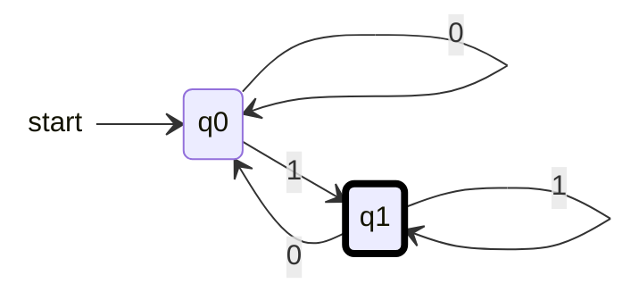

{: .box-note}
בשיעור זה נלמד לקרוא תרשים וטבלת מעברים של אוטומט סופי דטרמיניסטי, לעקוב אחרי קלט ולהסביר איזו שפה האוטומט מקבל. הדגש: מצב מקבל קובע קבלה רק לאחר קריאת המילה כולה.

[הקודם]({{ '/modelim/01-words-and-languages' | relative_url }}) · [מפת הקורס]({{ '/modelim/' | relative_url }}) · [הבא]({{ '/modelim/03-constructing-dfa' | relative_url }})

## מטרות וידע קודם

לאחר שיעור 1 נוכל לעקוב אחר מילה, לעבור בין תרשים לטבלה, ולנסח איזו שפה האוטומט מקבל. אוטומט סופי קורא את הקלט משמאל לימין פעם אחת. בכל רגע הזיכרון שלו הוא **אחד ממספר סופי של מצבים**.

## מה מכילה ההגדרה?

אוטומט סופי דטרמיניסטי מלא (אס״ד, DFA) מוגדר באמצעות $$M=(Q,\Sigma,\delta,q_0,F)$$: קבוצת מצבים סופית, אלפבית, פונקציית מעברים, מצב התחלתי וקבוצת מצבים מקבלים. הפונקציה $$\delta:Q\times\Sigma\to Q$$ נותנת **בדיוק מצב יעד אחד לכל מצב ולכל סימן**.

{: .box-note}
מקרא התרשימים בקורס: החץ מן הרווח משמאל מצביע על המצב ההתחלתי; הוא סימון התחלה ואינו מעבר חישובי. מסגרת מודגשת מסמנת מצב מקבל, במקום המעגל הכפול שבציור ידני. רשימת $$F$$ תינתן גם בטקסט. אין מעברי אפסילון. מגיעים למסקנת קבלה רק אחרי שכל הקלט נקרא.

## דוגמה פתורה 1 — מילים שמסתיימות ב־1

מעל $$\Sigma=\{0,1\}$$ מספיק לזכור האם הסימן האחרון היה `1`. נסמן זאת ב־`q1`; `q0` מציין שלא נקרא דבר או שהסימן האחרון היה `0`. המצב ההתחלתי `q0`, ו־$$F=\{q1\}$$.

אם התרשים רחב מהמסך, אפשר לגלול אותו אופקית; במקלדת התמקדו בתרשים והשתמשו בחצים.

| מצב | `0` | `1` | מקבל? |
|:---|:---|:---|---:|
| `q0` | `q0` | `q1` | לא |
| `q1` | `q0` | `q1` | כן |

הרצת `1010`:

| הקידומת שכבר נקראה | מצב | הקלט שנותר |
|:---|:---|:---|
| $$\varepsilon$$ | `q0` | `1010` |
| `1` | `q1` | `010` |
| `10` | `q0` | `10` |
| `101` | `q1` | `0` |
| `1010` | `q0` | $$\varepsilon$$ |

המילה נדחית למרות שביקרנו פעמיים במצב מקבל. האוטומט אינו "מאשר ועוצר" בביקור הראשון.

## דוגמה פתורה 2 — קוראים שפה מתוך תרשים

במטלה 1 שאלה 2 מופיע DFA עם חמישה מצבים. זוהי טבלת המעברים מתוך הציור המקורי; המצב ההתחלתי `q0`, ו־$$F=\{q2,q4\}$$:

| מצב | `a` | `b` |
|:---|:---|:---|
| `q0` | `q1` | `q3` |
| `q1` | `q2` | `q3` |
| `q2` | `q2` | `q3` |
| `q3` | `q1` | `q4` |
| `q4` | `q1` | `q4` |

ל־`q2` מגיעים בדיוק כאשר שני הסימנים האחרונים הם `aa`, ול־`q4` כאשר הם `bb`. לכן השפה היא כל המילים מעל $$\{a,b\}$$ שמסתיימות בשני סימנים זהים.

`aaba` עוברת במסלול `q0 → q1 → q2 → q3 → q1` ונדחית; `bbaabb` עוברת `q0 → q3 → q4 → q1 → q2 → q3 → q4` ומתקבלת. `abaa` ו־`bb` מתקבלות גם הן. שימו לב: "מכילה שני סימנים זהים רצופים" אינו התיאור הנכון, כפי שמראה `aaba`.

**למה זו הוכחה ולא ניחוש מדוגמאות?** אחרי סימן יחיד `q1` זוכר `a` ו־`q3` זוכר `b`. כל מעבר נוסף מעדכן את הזיכרון לפי הסיומת: חזרה על אותו סימן מובילה למצב המתאים לזוג, והחלפת סימן מתחילה רצף חדש באורך 1. לכן משמעות המצבים נשמרת לכל אורך ההרצה.

{: .box-warning}
אין להסתפק בדוגמה שעובדת: בדקו גם את המילה הריקה, את גבולות התנאים ואת הסימן שיכול לבטל קבלה. האוטומט חייב להתאים להגדרה לכל מילה מעל האלפבית.

## טעויות נפוצות

- בוחרים חץ לפי תווית הקלט, לא לפי מיקום החץ בציור.
- לולאה עצמית צורכת סימן בדיוק כמו חץ בין שני מצבים.
- חץ המסומן `a,b` מקצר שני מעברים, כל אחד על סימן יחיד; הוא אינו צורך את המילה `ab` בבת אחת.
- על `ε` לא מבצעים שום צעד: בודקים האם המצב ההתחלתי מקבל.

{: .box-success}
כדי לנסח את השפה מתוך תרשים, תנו משמעות לכל מצב והראו שהמעברים משמרים אותה. כך אפשר להסיק תשובה לכל מילה, במקום לנחש מתוך כמה מסלולים.

## תרגול

### 1. סיום לעומת ביקור

הריצו `110` ו־`011` בדוגמה הראשונה.

רמז ופתרון

**רמז:** רשמו גם את מצב ההתחלה. **פתרון:** `110`: המסלול `q0 → q1 → q1 → q0`, דחייה. `011`: המסלול `q0 → q0 → q1 → q1`, קבלה.

### 2. המילה הריקה

מה תעשה הוספת `q0` ל־$$F$$ בדוגמה הראשונה?

רמז ופתרון

**רמז:** כעת שני המצבים מקבלים. **פתרון:** השפה תהיה $$\{0,1\}^*$$, ולא רק השפה הקודמת בתוספת `ε`. כל מילה מסתיימת באחד משני המצבים. שינוי בקבלה משפיע גם על מילים לא ריקות שחוזרות לאותו מצב.

### 3. מציאת עד

מצאו את כל המילים הקצרות ביותר שמתקבלות באוטומט של מטלה 1 שאלה 2.

רמז ופתרון

**רמז:** לאחר סימן אחד מגיעים רק ל־`q1` או ל־`q3`. **פתרון:** `aa` ו־`bb`. `ε` ומילים באורך 1 נדחות, ולכן אין מילה קצרה יותר.

[הקודם]({{ '/modelim/01-words-and-languages' | relative_url }}) · [מפת הקורס]({{ '/modelim/' | relative_url }}) · [הבא]({{ '/modelim/03-constructing-dfa' | relative_url }})
