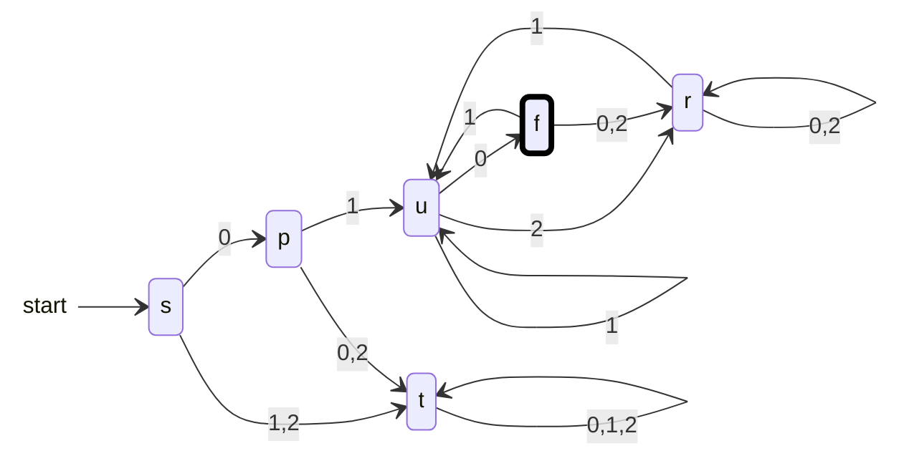

{: .box-note}
בשיעור זה נבנה אוטומטים לפי המידע שכל מצב צריך לזכור: תחילית, סיומת, הופעת רצף וספירה חסומה. נלמד לטפל בחפיפות ולהבחין בין כישלון זמני למצב מלכודת.

[הקודם]({{ '/modelim/02-reading-dfa' | relative_url }}) · [מפת הקורס]({{ '/modelim/' | relative_url }}) · [הבא]({{ '/modelim/04-finite-memory' | relative_url }})

## מטרות וידע קודם

נשתמש בטבלאות ובמעקב משיעור 2 כדי לתכנן מצבים, לטפל בחפיפה בין רצפים ולהשלים DFA מלא. לפני שמציירים, כותבים משפט שמסביר מה כל מצב זוכר. אין צורך לזכור את כל הקידומת שנקראה, אלא רק מידע שישפיע על ההמשך.

## דוגמה פתורה 1 — מתחילה ב־01 ומסתיימת ב־10

זוהי מטלה 1 שאלה 1ב, מעל $$\{0,1,2\}$$. אחרי שאישרנו את התחילית, נזכור את הסיומת הארוכה ביותר שהיא תחילית של התבנית `10`.

| מצב | משמעות | `0` | `1` | `2` |
|:---|---:|:---|:---|:---|
| `s` | עדיין לא נקרא דבר | `p` | `t` | `t` |
| `p` | נקרא רק האפס הראשון | `t` | `u` | `t` |
| `r` | התחילית תקינה, אין סיומת מועילה | `r` | `u` | `r` |
| `u` | התחילית תקינה, מסתיימים ב־1 | `f` | `u` | `r` |
| `f` | התחילית תקינה, מסתיימים ב־10 | `r` | `u` | `r` |
| `t` | התחילית כבר נפסלה | `t` | `t` | `t` |

התחלה `s`, ומקבל רק `f`. `t` הוא **מצב מלכודת**: כשל בתחילית אינו ניתן לתיקון באמצעות הוספת סימנים.

אם התרשים רחב מהמסך, אפשר לגלול אותו אופקית; במקלדת התמקדו בתרשים והשתמשו בחצים.

המילה הקצרה היא `010`: המסלול `s → p → u → f`. ה־`1` משמש גם בסוף התחילית `01` וגם בתחילת הסיומת `10`. אין לדרוש ששני הרצפים יהיו זרים במיקומם. `0110` מתקבלת, ואילו `0102` נדחית: ההופעה הקודמת של `10` אינה מבטיחה שהמילה מסתיימת כך.

כדי לפתור את סעיף 1ג, "מתחילה ב־01 ומכילה 10", משנים את `f` למצב שבו כל סימן מחזיר ל־`f`. מרגע שמצאנו את הרצף, שום המשך לא מבטל את העובדה שכבר הופיע.

## דוגמה פתורה 2 — מתחילה ב־1 ומכילה בדיוק שני 2

לסעיף 1ד אין צורך לספור בלי גבול. המצבים `c0,c1,c2` זוכרים את מספר ה־`2` שנקראו, אחרי תחילית תקינה. הופעה שלישית מעבירה למלכודת.

| מצב | `0` | `1` | `2` |
|:---|:---|:---|:---|
| `s` | `t` | `c0` | `t` |
| `c0` | `c0` | `c0` | `c1` |
| `c1` | `c1` | `c1` | `c2` |
| `c2` | `c2` | `c2` | `t` |
| `t` | `t` | `t` | `t` |

התחלה `s`, $$F=\{c2\}$$. `1202` עוברת `s → c0 → c1 → c1 → c2` ומתקבלת. `1222` מגיעה ל־`t` ונדחית. `22` נדחית למרות שיש בה בדיוק שני `2`, מפני שהתחילית אינה תקינה.

**נימוק הנכונות:** כל עוד נמצאים ב־`ci`, התחילית מתחילה ב־`1` ונקראו בדיוק $$i$$ סימני `2`. יתר הסימנים אינם משנים את הספירה. חוסר האפשרות לצאת מהמלכודת מבטא כשל שאף המשך לא יתקן.

## חפיפות: לא מוחקים מידע שעוד עשוי לעזור

בחיפוש `aba`, אחרי `ab` ואחריו `a` מצאנו הופעה. אם ממשיכים לחפש הופעות נוספות, ה־`a` האחרון יכול להתחיל את ההופעה הבאה: ב־`ababa` יש שתי הופעות חופפות. גם אחרי כישלון חלקי, שומרים סיומת מועילה: לאחר `aa` עדיין יש בסוף `a` שיכול להתחיל `aba`.

{: .box-warning}
בדיקת שתי מילים אינה הוכחת נכונות. בדקו גם מילה קצרה, חפיפה, סימן שלישי באלפבית, ומילה שנכנסת זמנית למצב מקבל וממשיכה ממנו. ההוכחה נשענת על משמעות המצבים שנשמרת בכל מעבר.

{: .box-success}
מתכננים מצב לפי המידע הדרוש להמשך: סיומת עשויה להשתנות, הופעה שכבר נמצאה נשארת נכונה, וספירה מדויקת מעבר לסף המותר מובילה למלכודת.

## תרגול

### 1. מתחילה ומסתיימת ב־1

בנו DFA מלא מעל $$\{0,1,2\}$$, כדרישת מטלה 1 שאלה 1א. האם `1` מתקבלת?

רמז ופתרון

**רמז:** התחלה תקינה אינה מחייבת שני סימנים. **פתרון:** התחלה `s`; על `1` ל־`yes`, ועל `0,2` למלכודת `t`. מ־`yes` ומ־`no`, על `1` ל־`yes`, ועל `0,2` ל־`no`. `t` לולאתית על כל האלפבית. רק `yes` מקבל. `1` מתקבלת כי אותו סימן נמצא בתחילה ובסוף.

### 2. מכילה לעומת מסתיימת

תנו מילה שמבדילה בין שני הנוסחים בדוגמה הראשונה והציגו את המסלול.

רמז ופתרון

**רמז:** הוסיפו סימן אחרי `010`. **פתרון:** `0102`: בשני האוטומטים עוברים `s → p → u → f`; בסיום האוטומט של "מסתיימת" עובר ל־`r` ודוחה, ואילו האוטומט של "מכילה" נשאר ב־`f` ומקבל.

### 3. בדיוק או לפחות?

שנו את דוגמה 2 כדי לקבל מילים שמתחילות ב־1 ומכילות לפחות שני `2`.

רמז ופתרון

**רמז:** מתי ספירה נוספת מפסיקה להיות רלוונטית? **פתרון:** שנו רק את המעבר מ־`c2` על `2` כך שיחזור ל־`c2`. כעת משמעותו "שניים או יותר". המלכודת עדיין נחוצה לתחילית פסולה.

[הקודם]({{ '/modelim/02-reading-dfa' | relative_url }}) · [מפת הקורס]({{ '/modelim/' | relative_url }}) · [הבא]({{ '/modelim/04-finite-memory' | relative_url }})
