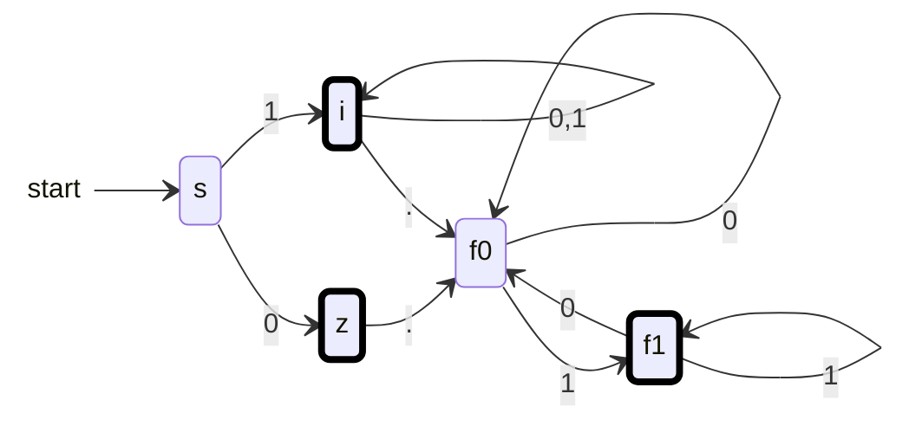

{: .box-note}
בשיעור זה נבין מה עושה מעבר חסר באוטומט דטרמיניסטי, נבנה מזהה למספרים בינאריים ונשלים אוטומט בעזרת מלכודת. נבדוק מדוע חייבים להשלים לפני בניית משלים.

[הקודם]({{ '/modelim/04-finite-memory' | relative_url }}) · [מפת הקורס]({{ '/modelim/' | relative_url }}) · [הבא]({{ '/modelim/06-nfa' | relative_url }})

## מטרות וידע קודם

נשתמש בבניית DFA משיעורים 2–4 כדי להשמיט מעברים מיותרים, להשלים אוטומט בעת הצורך, ולזהות שפה של מספרים בינאריים. **דטרמיניסטי** פירושו לכל היותר מעבר אחד על כל סימן; **מלא** מוסיף את הדרישה שהמעבר תמיד יהיה מוגדר.

אם במהלך הרצה אין מעבר מתאים לסימן הבא, המילה נדחית. אין לדלג על הסימן, אין להישאר במקום, ואין לקחת חץ ללא קריאת קלט. בקורס אין מעברי אפסילון.

## דוגמה פתורה 1 — מספרים בינאריים, מטלה 5 שאלה 1

האלפבית הוא $$\{0,1,\texttt{.}\}$$. אין אפסים מובילים; אם יש נקודה, חייבת להיות ספרה לפניה ואחריה, והספרה האחרונה חייבת להיות `1`. המספר `0` עצמו מותר, וכך גם חלק שלם `0` לפני נקודה. נקודה מופיעה לכל היותר פעם אחת.

| מצב | משמעות | `0` | `1` | `.` |
|:---|---:|:---|:---|:---|
| `s` | טרם נקראה ספרה | `z` | `i` | — |
| `z` | החלק השלם הוא בדיוק 0 | — | — | `f0` |
| `i` | חלק שלם שהתחיל ב־1 | `i` | `i` | `f0` |
| `f0` | אחרי נקודה; אין ספרה או האחרונה 0 | `f0` | `f1` | — |
| `f1` | אחרי נקודה והספרה האחרונה 1 | `f0` | `f1` | — |

התחלה `s`, $$F=\{z,i,f1\}$$. קו מפריד בטבלה משמעו מעבר לא מוגדר. שתי האפשרויות המתוארות ב־`f0` יכולות לחלוק מצב: לשתיהן אותם המשכים שיביאו לקבלה.

אם התרשים רחב מהמסך, אפשר לגלול אותו אופקית; במקלדת התמקדו בתרשים והשתמשו בחצים.

המסגרת העבה מסמנת קבלה רק בסוף הקלט; החץ ההתחלתי אינו מעבר. למשל `0.011` עוברת `s → z → f0 → f0 → f1 → f1` ומתקבלת. `0.0` מסיימת ב־`f0` ונדחית. ב־`00101` ההרצה נכשלת כבר באפס השני, כי מ־`z` אין מעבר על `0`. `1010.110` מסיימת ב־`f0` ונדחית, למרות שהתחילית שלה תקינה.

**נימוק הנכונות:** לפני נקודה אפשר להתקדם רק דרך `z` או `i`, המבטיחים חלק שלם חוקי. אין מעבר על נקודה מתוך מצבי השבר, ולכן אין נקודה שנייה. אחרי הנקודה רק `f1` מקבל, ומכאן שקיימת לפחות ספרה אחת ושהאחרונה היא `1`.

## דוגמה פתורה 2 — משלימים בעזרת מלכודת

כדי להפוך את האוטומט למלא, מוסיפים מצב לא מקבל `t`, מחליפים **כל** תא חסר בטבלה ב־`t`, ומגדירים $$\delta(t,c)=t$$ לכל $$c\in\Sigma$$. כל הרצה שנכשלה קודם ממשיכה כעת במלכודת עד סוף הקלט, ועדיין נדחית. לכן השפה אינה משתנה.

אבל אם רוצים את **המשלים**, הסדר חשוב: קודם משלימים, ורק אחר כך מחליפים מקבלים בלא־מקבלים ולהפך. `00` אינה בשפה המקורית ולכן חייבת להיכלל במשלים. אם נהפוך רק את הקבלה באוטומט הלא מלא, ההרצה שלה עדיין תיתקע והיא לא תתקבל. במלא, היא מגיעה ל־`t`, שיהיה מקבל לאחר ההיפוך.

{: .box-warning}
אין להסתפק בדוגמה שעובדת: בדקו גם את המילה הריקה, את גבולות התנאים ואת הסימן שיכול לבטל קבלה. האוטומט חייב להתאים להגדרה לכל מילה מעל האלפבית.

## טעויות נפוצות

- אין להציג מלכודת שמצוירים אליה חצים בלי להגדיר מה קורה בה, ואז לטעון שהתרשים מלא.
- אי־שלמות אינה אי־דטרמיניזם: אפס אפשרויות גורם לכישלון, שתי אפשרויות על אותו סימן יוצרות בחירה.
- מצב לא מקבל אינו בהכרח מלכודת. מ־`f0` אפשר להגיע לקבלה באמצעות `1`.

{: .box-success}
השלמה בעזרת מלכודת שומרת על השפה: כישלון באמצע ההרצה הופך להמשך שכולו דחייה. רק לאחר ההשלמה אפשר להפוך את הקבלה כדי לקבל את המשלים.

## תרגול

### 1. גבולות ההגדרה

סווגו `ε`, `.1`, `1.`, `0`, `10`, `1.01`, `1.1.1`.

רמז ופתרון

**רמז:** הפרידו תקיעה מסיום במצב שאינו מקבל. **פתרון:** מתקבלות `0`,`10`,`1.01`. `ε` מסיימת ב־`s`; `1.` מסיימת ב־`f0`; `.1` נתקעת בסימן הראשון; `1.1.1` נתקעת בנקודה השנייה.

### 2. דרישת "לא מלא"

האם אוטומט מלא שמקבל אותה שפה עונה בדיוק על הדרישה במטלה?

רמז ופתרון

**רמז:** שקילות שפות אינה זהות של דרישות הייצוג. **פתרון:** הוא נכון לגבי השפה, אך אינו עומד בדרישה המפורשת לבנות אוטומט לא מלא. כאן אפשר להסיר את המלכודת ואת המעברים אליה כדי להציג את המבנה המבוקש.

### 3. משלים מעל איזה אלפבית?

האם `2` שייכת למשלים של השפה בדוגמה 1?

רמז ופתרון

**רמז:** המשלים הוא $$\Sigma^*\setminus L$$. **פתרון:** לא; `2` אינה מילה מעל האלפבית שנקבע. אפשר להגדיר בעיה חדשה עם אלפבית מורחב, אך אין להרחיב אותו בשקט בזמן חישוב משלים.

[הקודם]({{ '/modelim/04-finite-memory' | relative_url }}) · [מפת הקורס]({{ '/modelim/' | relative_url }}) · [הבא]({{ '/modelim/06-nfa' | relative_url }})
