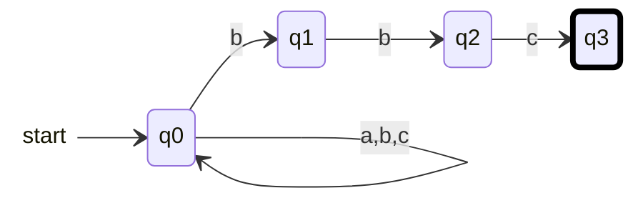

{: .box-note}
בשיעור זה נלמד לבנות אוטומט לא דטרמיניסטי ללא מעברי אפסילון, לעקוב אחרי כל המצבים האפשריים ולהמיר אותו לאוטומט דטרמיניסטי שקול. מסלול מקבל אחד מספיק, בתנאי שקרא את כל הקלט.

[הקודם]({{ '/modelim/05-incomplete-dfa' | relative_url }}) · [מפת הקורס]({{ '/modelim/' | relative_url }}) · [הבא]({{ '/modelim/07-language-operations' | relative_url }})

## מטרות וידע קודם

נרחיב את DFA של שיעורים 2–5 לאוטומט סופי לא דטרמיניסטי (אסל״ד, NFA), נעקוב אחרי קבוצת מסלולים ונמיר ל־DFA. פונקציית המעברים היא כעת $$\delta:Q\times\Sigma\to\mathcal P(Q)$$: לכל מצב וסימן מקבלים **קבוצת יעדים**, שיכולה להיות גם ריקה.

{: .box-warning}
כל חץ חישובי צורך סימן אחד. אין מעברי אפסילון, לרבות חצים "לבחירת מסלול" בתחילת ההרצה או בסופה. המילה מתקבלת אם קיים לפחות מסלול אחד שצרך את כולה וסיים במצב מקבל. מסלול שנכשל אינו פוסל מסלול אחר.

## דוגמה פתורה 1 — סיומת bbc

מטלה 2 שאלה 2א, מעל $$\{a,b,c\}$$. `q0` קורא קידומת שרירותית. על `b` אפשר גם להישאר בו וגם להתחיל לבדוק שזו תחילת הסיומת המבוקשת. התחלה `q0`, $$F=\{q3\}$$.

אם התרשים רחב מהמסך, אפשר לגלול אותו אופקית; במקלדת התמקדו בתרשים והשתמשו בחצים.

המסגרת העבה מסמנת מצב מקבל; חץ ההתחלה אינו צעד. המעברים שאינם מצוירים אינם קיימים. בענף שעובר מ־`q0` ל־`q1` כבר נקרא ה־`b` הראשון של הסיומת, ולכן נשאר לקרוא רק `bc`.

| קידומת שנקראה ב־`bbbc` | קבוצת מצבים אפשריים |
|:---|:---|
| $$\varepsilon$$ | `{q0}` |
| `b` | `{q0,q1}` |
| `bb` | `{q0,q1,q2}` |
| `bbb` | `{q0,q1,q2}` |
| `bbbc` | `{q0,q3}` |

יש מצב מקבל בקבוצה האחרונה ולכן המילה מתקבלת. על `bbbca` מגיעים אחרי `c` לאותה קבוצה, אבל ה־`a` הבא משאיר רק `{q0}`: זו דחייה. אין להוסיף לולאה ל־`q3`, כי היא תהפוך את הדרישה "מסתיימת" ל־"מכילה".

## דוגמה פתורה 2 — המרה מלאה ל־DFA

כל קבוצת מצבים אפשריים תהפוך למצב יחיד של DFA. מתחילים ב־$$\{q0\}$$; על סימן $$x$$ מחשבים $$\bigcup_{q\in S}\delta(q,x)$$. מצב קבוצה מקבל אם הוא מכיל מצב מקבל של ה־NFA.

בדוגמה שלנו יש רק ארבע קבוצות נגישות: `A={q0}`, `B={q0,q1}`, `C={q0,q1,q2}`, `D={q0,q3}`.

| מצב DFA | `a` | `b` | `c` |
|:---|:---|:---|:---|
| `A` | `A` | `B` | `A` |
| `B` | `A` | `C` | `A` |
| `C` | `A` | `C` | `D` |
| `D` | `A` | `B` | `A` |

התחלה `A`, ורק `D` מקבל. זו טבלה דטרמיניסטית מלאה. שתי ההרצות נותנות אותה תשובה לכל מילה, כי מצב ה־DFA הוא בדיוק קבוצת כל היעדים האפשריים של ה־NFA אחרי אותה קידומת. בבנייה כללית עשויה להופיע הקבוצה הריקה; היא מצב מלכודת, לא המילה הריקה.

## יישום נוסף — מכילה aaa או aba ומסתיימת ב־b

למטלה 2 שאלה 2ב אפשר להשתמש ב־`s` עם לולאה על כל האלפבית, ובנוסף `s --a--> p`. מכאן `p --a--> r`, `p --b--> t`, ואז גם `r --a--> u` וגם `t --a--> u`. כך גילינו אחת משתי התבניות. מ־`u` ומ־`v`, על `b` עוברים ל־`v`, ועל `a,c` ל־`u`; רק `v` מקבל. התחלה `s`. כל החצים צורכים סימן, ובחירת התבנית נעשית על אות קלט אמיתית.

## טעויות נפוצות

- NFA אינו מכונה ש"בוחרת תמיד נכון" בהרצה פיזית; זוהי הגדרת קבלה באמצעות קיום מסלול.
- כדי להוכיח דחייה צריך שכל המסלולים ייכשלו. מעקב קבוצות מונע שכחת ענף.
- המרה אינה מוסיפה כוח חישובי: NFA ו־DFA מקבלים בדיוק את השפות הרגולריות. NFA עשוי להיות נוח או קטן יותר.

{: .box-success}
מצב בבניית הקבוצות הוא תיאור מדויק של כל הענפים הפעילים. קבוצה שמכילה מקבל מתקבלת בסוף הקלט, וקבוצה ריקה היא כישלון של כל הענפים.

## תרגול

### 1. מעקב קבוצות

הריצו `abbbc` ו־`bbcc` בדוגמה 1.

רמז ופתרון

**רמז:** אפשר להיעזר בשמות `A,B,C,D`. **פתרון:** `abbbc`: `A → A → B → C → C → D`, קבלה. `bbcc`: `A → B → C → D → A`, דחייה.

### 2. חפיפה בין תחילית לתבנית

במטלה 2 שאלה 2ג נדרשות תחילית `ab`, הופעת `abb`, וסיומת `ab` או `bb`. מדוע מסוכן להתחיל לחפש `abb` רק אחרי שהתחילית הסתיימה?

רמז ופתרון

**רמז:** בדקו `abb`. **פתרון:** היא מקיימת את כל התנאים, כשהתחילית חופפת להופעה. לאחר קריאת `ab` יש לשמור גם התקדמות של שני סימנים בתוך `abb`. שיטה בטוחה היא מכפלה של בודק תחילית, מזהה הופעה ובודק סיומת; אפשר ליישם את הבודקים גם כ־DFA, שהוא מקרה פרטי של NFA. אין להוסיף חץ אפסילון בין הבודקים.

### 3. שני קשיים והוראה מתקנת

הציעו פעילות קצרה נגד הטענות "מסלול אחד נכשל ולכן דוחים" ו־"אפשר לעצור כשמגיעים למקבל".

רמז ופתרון

**רמז:** השוו שתי מילים שנבדלות בסימן אחרון. **פתרון:** עקבו בענפים צבעוניים אחר `bbbc` כדי לראות ענפים כושלים לצד ענף מצליח; אחר כך הוסיפו `a` וחשבו מחדש את קבוצת המצבים. הראשונה מתקבלת והשנייה נדחית. הפעילות מפרידה קיום ענף מקבל מקבלה מוקדמת.

[הקודם]({{ '/modelim/05-incomplete-dfa' | relative_url }}) · [מפת הקורס]({{ '/modelim/' | relative_url }}) · [הבא]({{ '/modelim/07-language-operations' | relative_url }})
