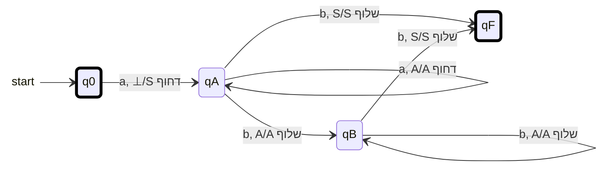

{: .box-note}
בשיעור זה נוסיף לאוטומט זיכרון מסוג מחסנית. נלמד לקרוא מעברי דחיפה ושליפה, לעקוב אחר תוכן המחסנית ולבנות אוטומטים להשוואת כמויות ולסוגריים מאוזנים — ללא מעברי אפסילון.

[הקודם]({{ '/modelim/09-language-reasoning' | relative_url }}){: data-sequence-nav="prev"} · [מפת הקורס]({{ '/modelim/' | relative_url }}) · [הבא]({{ '/modelim/11-pda-constructions' | relative_url }}){: data-sequence-nav="next"}

## מטרות וידע קודם

נדרשת היכרות עם אוטומטים ועם מגבלת הזיכרון הסופי. מחסנית פועלת בשיטת LIFO: הסימן האחרון שנדחף הוא הראשון שיישלף. מספר הסימנים אינו חסום מראש, אבל בכל מעבר בודקים רק את **ראש המחסנית**, לא תא פנימי לבחירתנו.

במודל הקורס המחסנית מתחילה בסימן תחתית `⊥`, שאותו איננו שולפים. מעבר תלוי בשלושה דברים: מצב, סימן הקלט הבא וראש המחסנית. הוא משנה מצב ומבצע פעולה אחת. כאשר יש לכל שלישייה לכל היותר מעבר אחד, האוטומט דטרמיניסטי במסגרת הזאת.

| תווית | פירוש |
|:---|---:|
| `a, S/A דחוף` | קוראים `a`, דורשים `S` בראש, ודוחפים מעליו `A` |
| `b, A/A שלוף` | קוראים `b`, דורשים `A` בראש, ושולפים אותו |
| `c, ⊥/ללא שינוי` | קוראים `c`, דורשים את סימן התחתית בראש, ומשאירים אותו |

{: .box-warning}
אחרי `/` לא כתובה כאן החלפה מלאה של ראש המחסנית: המילים **דחוף**, **שלוף** ו־**ללא שינוי** הן חלק מהסימון. אין לערבב זאת עם הסימון התאורטי `קלט, ראש/החלפה`. בכל התוויות בקורס נקרא סימן קלט אמיתי; אין מעברי אפסילון.

## דוגמה פתורה 1 — אותה כמות a ואחריה b

נבנה אוטומט ל־$$L=\{a^nb^n\mid n\ge0\}$$. `S` מייצג את ה־`a` הראשון, וכל `A` מעליו מייצג `a` נוסף. כך נדע בעת השליפה שהגענו לפריט האחרון, בלי צעד נוסף שבודק את תחתית המחסנית.

התחלה `q0`, $$F=\{q0,qF\}$$. המסגרות העבות מסמנות מקבלים; חץ ההתחלה אינו מעבר. `q0` מקבל את `ε` בלי לזוז.

אם התרשים רחב מהמסך, אפשר לגלול אותו אופקית; במקלדת התמקדו בתרשים והשתמשו בחצים.

| קידומת שנקראה | מצב | מחסנית, ראש משמאל |
|:---|:---|:---|
| $$\varepsilon$$ | `q0` | `⊥` |
| `a` | `qA` | `S⊥` |
| `aa` | `qA` | `AS⊥` |
| `aaa` | `qA` | `AAS⊥` |
| `aaab` | `qB` | `AS⊥` |
| `aaabb` | `qB` | `S⊥` |
| `aaabbb` | `qF` | `⊥` |

**האינווריאנט:** מספר הסימנים מעל `⊥` הוא מספר ה־`a` שנקראו פחות מספר ה־`b` שנקראו. `S` הוא יחידת ספירה אחת, לא תוספת מעבר לכמות. המצבים מונעים `a` אחרי תחילת ה־`b`. `qF` מושג בדיוק בשליפה האחרונה, ולא יוצאים ממנו על קלט נוסף. לכן `aabbb` נדחית, אף שהקידומת `aabb` מגיעה למקבל.

{: .box-success}
הסימן המיוחד `S` מאפשר לאותו צעד גם לצרוך את ה־`b` האחרון, גם לשלוף את היחידה האחרונה וגם לעבור למצב מקבל. אין צורך במעבר אפסילון כדי "לגלות שסיימנו".

## דוגמה פתורה 2 — סוגריים מאוזנים

כאן רוצים לאפשר גם `()()` ולא רק בלוק פתיחות ואחריו בלוק סגירות. התחלה `e` מקבלת ומייצגת מחסנית עם `⊥` בלבד; `p` אינה מקבלת ומייצגת לפחות פתיחה אחת שטרם נסגרה.

| מצב | קלט | ראש | פעולה | יעד |
|:---|:---|:---|---:|:---|
| `e` | `(` | `⊥` | דחוף `S` | `p` |
| `p` | `(` | `S` | דחוף `A` | `p` |
| `p` | `(` | `A` | דחוף `A` | `p` |
| `p` | `)` | `A` | שלוף `A` | `p` |
| `p` | `)` | `S` | שלוף `S` | `e` |

אלו כל המעברים. `(()())` משנה את גובה המחסנית מעל `⊥` כך: $$0,1,2,1,2,1,0$$, ולכן מסתיימת ב־`e`. `)(` נכשלת כבר בהתחלה. `(()` מסיימת ב־`p` ונדחית. בכל קידומת הגובה הוא מספר הפתיחות פחות הסגירות; אין מעבר שיוריד אותו מתחת לאפס. בסוף מקבלים בדיוק כשהגובה אפס.

{: .box-warning}
שוויון כולל בכמות הפתיחות והסגירות אינו מספיק. ב־`)(` הכמויות שוות, אך כבר בקידומת הראשונה יש סגירה בלי פתיחה. בנוסף, בקורס קבלה היא במצב מקבל לאחר קריאת כל הקלט, ולא כלל כללי של "מחסנית ריקה".

## תרגול

### 1. מקרי קצה

הריצו `ε`, `ab`, `aab`, `aba` בדוגמה 1.

רמז ופתרון

**רמז:** `S` הוא גם הסימן הראשון וגם האחרון במקרה $$n=1$$. **פתרון:** `ε` מתקבלת ב־`q0`. `ab` עוברת `q0 → qA → qF` ומתקבלת. `aab` מסיימת ב־`qB` עם `S⊥` ונדחית. `aba` מגיעה ל־`qF` אחרי `ab`, אך נתקעת על ה־`a` הנוסף.

### 2. למה לא לדחוף מראש?

מה ישתבש אם נתחיל עם `S⊥` ונמשיך לדחוף סימן עבור כל `a`?

רמז ופתרון

**רמז:** בדקו מה מספר הסימנים אמור לייצג לפני הקלט. **פתרון:** הוספנו יחידת ספירה שאינה מייצגת `a` שנקראה. האינווריאנט נשבר כבר בהתחלה. הסימן `⊥` הוא תשתית; `S` בדוגמה שלנו חייב להידחף רק בקריאת ה־`a` הראשון.

### 3. סגירות חוזרות

עקבו אחר `()()` ואחר `())(` באוטומט הסוגריים.

רמז ופתרון

**רמז:** מ־`e` מותר להתחיל קבוצה חדשה. **פתרון:** `()()` עוברת `e → p → e → p → e` ומתקבלת. `())(` עוברת `e → p → e`, ואז אין מעבר על הסגירה הבאה. לא מחכים לפתיחה שתגיע מאוחר יותר כדי לתקן את הכשל.

[הקודם]({{ '/modelim/09-language-reasoning' | relative_url }}){: data-sequence-nav="prev"} · [מפת הקורס]({{ '/modelim/' | relative_url }}) · [הבא]({{ '/modelim/11-pda-constructions' | relative_url }}){: data-sequence-nav="next"}
