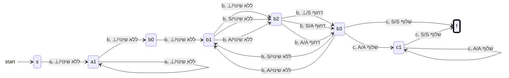

{: .box-note}
בשיעור זה נשתמש במחסנית יחד עם הזיכרון הסופי של המצבים. נבנה פתרונות ליחס בין בלוקים, לאי־שוויון בין כמויות ולהשוואת הבלוק הראשון לאחרון. בכל בנייה נגדיר מה נספר ונבדוק את מקרי הגבול, ללא מעברי אפסילון.

[הקודם]({{ '/modelim/10-pda' | relative_url }}){: data-sequence-nav="prev"} · [מפת הקורס]({{ '/modelim/' | relative_url }}) · [הבא]({{ '/modelim/12-language-hierarchy' | relative_url }}){: data-sequence-nav="next"}

## מטרות וידע קודם

נדרשת שליטה בסימון דחוף/שלוף ובסימן הבסיס `S` משיעור 10. לפני בנייה שאלו: מה צריכה יחידה אחת במחסנית לייצג? אילו בדיקות אפשר לבצע רק באמצעות מצבים? מתי מותר לעבור לשלב הבא?

## דוגמה פתורה 1 — שלושה b לכל c, ועוד b אחד

מטלה 4 שאלה 1: $$L=\{a^nb^{3k+1}c^k\mid n>0,k>0\}$$. אין צורך לספור את ה־`a`; מספיק לוודא שיש לפחות אחת. לאחר מכן צורכים `b` עודף אחד, וסופרים שלשות. בכל שלשה שלמה דוחפים יחידה אחת. רק אחרי שלשה שלמה מותר להתחיל `c`.

התחלה `s`, ורק `f` מקבל. בדיאגרמה `S` היא השלשה הראשונה, ו־`A` כל שלשה נוספת. מסגרת עבה מציינת קבלה בסוף הקלט; חץ ההתחלה אינו מעבר.

אם התרשים רחב מהמסך, אפשר לגלול אותו אופקית; במקלדת התמקדו בתרשים והשתמשו בחצים.

`abbbbc` עוברת `s → a1 → b0 → b1 → b2 → b3 → f`; רק במעבר אל `b3` נדחף `S`. `abbbc` נדחית כי `c` מגיעה מוקדם מדי, ו־`abc` נדחית כי טרם הושלמה אפילו שלשה. עבור `abbbbbbbcc` נדחפים `S` ואז `A`, ושני ה־`c` שולפים אותם בסדר הפוך.

{: .box-success}
המצבים סופרים עד שלוש שוב ושוב; המחסנית סופרת כמה שלשות הושלמו. הפרדת התפקידים חוסכת דחיפת שלושה סימנים באותו מעבר ומתאימה לפעולות הקורס.

## דוגמה פתורה 2 — יותר c מסכום שתי כמויות

מטלה 4 שאלה 2: $$K=\{a^{2n}b^mc^k\mid n,m\ge0,k>n+m\}$$. נדחוף יחידה לכל **זוג** `a` ולכל `b`, ונדרוש לפחות `c` נוספת אחרי שליפת כל היחידות.

בטבלה הבאה `T` פירושו כל אחד מהראשים `⊥,S,A` בנפרד. "דחוף יחידה" הוא קיצור לשלושה כללים: על `⊥` דחוף `S`; על `S` דחוף `A`; על `A` דחוף `A`. כל שורה עדיין צורכת סימן אחד ומבצעת דחיפה אחת לכל היותר.

| מצב | קלט | ראש | פעולה | יעד |
|:---|:---|:---|---:|:---|
| `E` | `a` | `T` | ללא שינוי | `O` |
| `O` | `a` | `T` | דחוף יחידה | `E` |
| `E` | `b` | `T` | דחוף יחידה | `B` |
| `B` | `b` | `T` | דחוף יחידה | `B` |
| `E` או `B` | `c` | `A` | שלוף `A` | `C` |
| `E` או `B` | `c` | `S` | שלוף `S` | `Z` |
| `E` או `B` | `c` | `⊥` | ללא שינוי | `F` |
| `C` | `c` | `A` | שלוף `A` | `C` |
| `C` | `c` | `S` | שלוף `S` | `Z` |
| `Z` | `c` | `⊥` | ללא שינוי | `F` |
| `F` | `c` | `⊥` | ללא שינוי | `F` |

התחלה `E`, ורק `F` מקבל. אלו כל הכללים. ב־`O` נקראה כמות אי־זוגית של `a`, ולכן אין ממנו דרך להתחיל `b` או `c`. `Z` אומר "בדיוק השווינו", ואינו מקבל כי הדרישה היא **גדול ממש**.

| קידומת בהרצת `aabccc` | מצב | מחסנית, ראש משמאל |
|:---|:---|:---|
| $$\varepsilon$$ | `E` | `⊥` |
| `a` | `O` | `⊥` |
| `aa` | `E` | `S⊥` |
| `aab` | `B` | `AS⊥` |
| `aabc` | `C` | `S⊥` |
| `aabcc` | `Z` | `⊥` |
| `aabccc` | `F` | `⊥` |

לפני שלב ה־`c`, מספר היחידות הוא $$n+m$$. כל `c` משלמת יחידה אחת עד `Z`, ורק ה־`c` הבאה מביאה לקבלה. אם $$n=m=0$$, ה־`c` הראשונה עוברת ישירות מ־`E` ל־`F`; לכן `c` מתקבלת ו־`ε` נדחית.

{: .box-warning}
המצב `Z` אינו מקבל: התרוקנות יחידות הספירה מוכיחה שוויון בלבד, אך השאלה דורשת אי־שוויון ממש. בדקו תמיד זוג מילים שנבדלות ב־`c` אחת, כמו `aabcc` ו־`aabccc`, כדי לגלות טעות גבול.

## דוגמה פתורה 3 — הבלוק הראשון שווה לאחרון

נפרש את מטלה 5 שאלה 2 לפי ההסבר המילולי:

$$H=\{a^r(ba^{j_1})\cdots(ba^{j_t})ca^r\mid r\ge1,\ t\ge0,\ j_1,\ldots,j_t\ge1\}.$$

{: .box-warning}
ב־PDF הדוגמאות `aacaba` ו־`aaacabaaa` מסומנות כחיוביות, אך מכילות `b` אחרי `c`, בניגוד להסבר ש־`c` בא לפני הבלוק האחרון. כאן נצמדים להסבר ולמבנה הבלוקים המוצהר. הדוגמאות החיוביות המתאימות הן למשל `aca`, `aacaa`, `aabaacaa`. אין לשנות את ההגדרה כדי להצדיק דוגמאות סותרות בלי לציין זאת.

סופרים רק את בלוק ה־`a` הראשון; מדלגים על בלוקי האמצע תוך בדיקת המבנה; אחרי `c` שולפים. בטבלה `T` הוא `S` או `A`, לא `⊥`.

| מצב | קלט | ראש | פעולה | יעד |
|:---|:---|:---|---:|:---|
| `s` | `a` | `⊥` | דחוף `S` | `P` |
| `P` | `a` | `T` | דחוף `A` | `P` |
| `P` או `I` | `b` | `T` | ללא שינוי | `M` |
| `M` | `a` | `T` | ללא שינוי | `I` |
| `I` | `a` | `T` | ללא שינוי | `I` |
| `P` או `I` | `c` | `T` | ללא שינוי | `R` |
| `R` | `a` | `A` | שלוף `A` | `R` |
| `R` | `a` | `S` | שלוף `S` | `F` |

התחלה `s`, ורק `F` מקבל; אין מעברים נוספים. `M` דורש `a` אחרי כל `b`, ולכן אין בלוק אמצעי ריק. `R` מאפשר רק את הבלוק האחרון. בהרצת `aabaacaa`, המחסנית לאחר `aa` היא `AS⊥`, ונשארת כך לאורך `baa` וגם בקריאת `c`; שני ה־`a` האחרונים שולפים `A,S`. זהו גם נימוק לשוויון בין הבלוקים. השפה אינה רגולרית: חיתוך עם $$a^*ca^*$$ נותן $$\{a^rca^r\mid r\ge1\}$$, שקידומותיה נבדלות כמו בשיעור 8.

## תרגול

### 1. יחס כפול ואחריו זנב רגולרי

במטלה 4 שאלה 3 השפה היא $$a^sb^{2s}(a^+b^+)^+$$ עבור $$s\ge1$$. תארו בנייה ללא אפסילון והסבירו שני קשיים אפשריים.

רמז ופתרון

**רמז:** אפשר לשלוף על כל `b` שני במקום לדחוף פעמיים על `a`. **פתרון:** בשלב ה־`a` דוחפים יחידה לכל סימן, עם `S` ראשון. בשלב ה־`b` מחליפים בין מצב "לפני הראשון בזוג" למצב "לפני השני בזוג"; הראשון אינו משנה מחסנית, השני שולף. שליפת `S` מעבירה למצב המחכה ל־`a` הראשון של הזנב. ממנו `a` מתחילה מצב `tailA`, עם לולאה על `a`; על `b` עוברים ל־`tailB` מקבל, עם לולאה על `b`; מ־`tailB` על `a` חוזרים ל־`tailA`. כל מעברי הזנב משאירים `⊥`. אין קבלה לפני הזנב ואין `b` נוסף לפני ה־`a` הראשון שלו. המילה הקצרה `abbab`. קשיים: ספירת יחס 2:1 ודרישת לפחות זוג בלוקים נוסף; מטפלים בעזרת טבלת זוגות ובדיקת `abb` שנדחית לעומת `abbab` שמתקבלת.

### 2. שוויון אינו אי־שוויון

סווגו `aac`, `aacc`, `accc`, `bcc`, `cc` לפי דוגמה 2.

רמז ופתרון

**רמז:** חשבו $$n+m$$, לא את מספר כל הסימנים לפני `c`. **פתרון:** `aac` נדחית כי $$k=n+m=1$$; `aacc` מתקבלת כי $$2>1$$; `accc` נדחית בגלל מספר אי־זוגי של `a`; `bcc` מתקבלת כי $$2>1$$; `cc` מתקבלת כי $$2>0$$.

### 3. בדיקת מבנה לפני ספירה

מדוע `abca`, `ababa`, `abaacaa` נדחות בדוגמה 3?

רמז ופתרון

**רמז:** רק באחת מהן מגיעים להשוואת כמויות תקינה במבנה שלה. **פתרון:** `abca` מכילה בלוק ריק בין `b` ל־`c`; `ababa` חסרה `c`; ב־`abaacaa` הבלוק הראשון באורך 1 והאחרון באורך 2, ולכן יש קלט נוסף אחרי שליפת `S` והגעה ל־`F`.

[הקודם]({{ '/modelim/10-pda' | relative_url }}){: data-sequence-nav="prev"} · [מפת הקורס]({{ '/modelim/' | relative_url }}) · [הבא]({{ '/modelim/12-language-hierarchy' | relative_url }}){: data-sequence-nav="next"}
