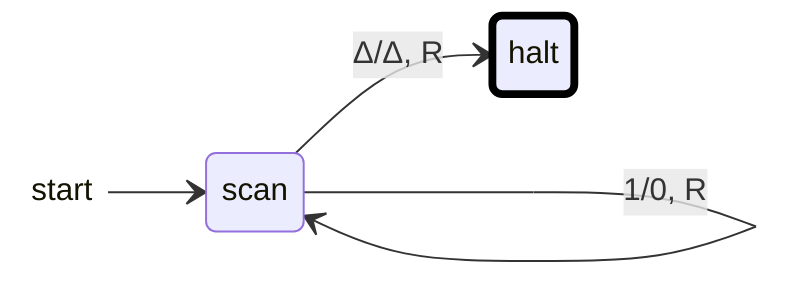
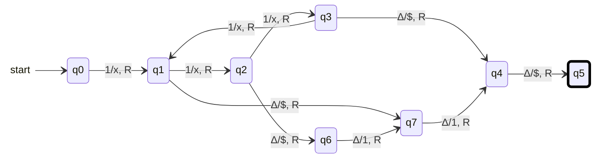

{: .box-note}
בשיעור זה נכיר סרט קריאה וכתיבה ונתרגל מעקב מדויק אחרי הראש והמצב. נבנה מכונה שהופכת ביטים, ואז ננתח את מכונת מטלה 5 ונגלה איזו פונקציה היא מחשבת על מספרים אונריים.

[הקודם]({{ '/modelim/12-language-hierarchy' | relative_url }}){: data-sequence-nav="prev"} · [מפת הקורס]({{ '/modelim/' | relative_url }}) · [הבא]({{ '/modelim/14-computing-and-models' | relative_url }}){: data-sequence-nav="next"}

## מטרות וידע קודם

נדרשת היכרות עם מצבים ועם שאריות. למכונת טיורינג סרט שאפשר להרחיב לפי הצורך, ראש שקורא וכותב תא אחד בכל צעד, ומספר סופי של מצבים. בניגוד לאוטומט סופי, היא יכולה לחזור לסימנים שכבר קראה ולשנותם.

נשתמש בסימן `Δ` לתא ריק, וב־`⊢` לסמן שמאלי בדוגמאות שזקוקות לגבול. הקלט אינו מכיל את הסימנים האלה. הראש מתחיל על הסימן הראשון של הקלט, או על תא ריק כאשר הקלט ריק. מצב עצירה הוא מצב שאין מבצעים ממנו צעדים נוספים.

תווית `a/b, R` אומרת: קוראים `a`, כותבים `b` באותו תא, זזים תא אחד ימינה ועוברים למצב שבקצה החץ. `L` מציין שמאלה. סדר השדות בטבלת המקור יכול להיות שונה; יש לתרגם לפי משמעותם, לא לפי מיקומם בלבד.

{: .box-warning}
`Δ` הוא סימן אמיתי שנמצא בתא סרט. `ε` היא מילה באורך אפס. מעבר שקורא `Δ`, כותב וזז אינו מעבר אפסילון. בכל מעבר בקורס קוראים תא ומבצעים את התנועה שנכתבה; אין לערבב בין `R` לבין "אפשר גם להישאר במקום".

## דוגמה פתורה 1 — הופכים ביטים

הקלט הוא מילה מעל $$\{0,1\}$$, והפלט יהיה באותם תאים. מתחילים ב־`scan`, ומצב העצירה הוא `halt`.

אם התרשים רחב מהמסך, אפשר לגלול אותו אופקית; במקלדת התמקדו בתרשים והשתמשו בחצים.

כאן המסגרת העבה מציינת מצב סיום החישוב; בניגוד למצבי קבלה של DFA, זהו מצב עצירה. חץ ההתחלה הוא סימון בלבד.

| לפני הצעד | מצב | ראש | תא 0 | תא 1 | תא 2 | הפעולה |
|---:|:---|:---|:---|:---|:---|---:|
| 0 | `scan` | 0 | `1` | `0` | `Δ` | כתוב `0` וזוז ימינה |
| 1 | `scan` | 1 | `0` | `0` | `Δ` | כתוב `1` וזוז ימינה |
| 2 | `scan` | 2 | `0` | `1` | `Δ` | השאר ריק, זוז ימינה ועצור |

הפלט `01`, והראש בסיום בתא 3. אחרי $$j$$ צעדים על ביטים, $$j$$ התאים הראשונים כבר הפוכים וכל היתר טרם השתנו. אחרי אורך הקלט ועוד צעד מגיעים לעצירה, גם אם הקלט ריק.

## דוגמה פתורה 2 — מה מחשבת מכונת מטלה 5 שאלה 3?

**ייצוג אונרי:** המספר $$n$$ מיוצג על ידי $$1^n$$. למשל 5 הוא `11111`, ואפס הוא מקטע שאין בו `1`. במטלה הפלט נכתב בין שני סימני `$`; הסימנים `x` משמאל הם קלט מסומן ואינם חלק מהפלט.

התחלה `q0`, עצירה `q5`. אלו המעברים שבמקור:

אם התרשים רחב מהמסך, אפשר לגלול אותו אופקית; במקלדת התמקדו בתרשים והשתמשו בחצים.

`#36;` במקור Mermaid מוצג כסימן `$` כדי לא להתנגש בסימון מתמטי. הוא אינו סימן נוסף באלפבית הסרט.

| צעד שהושלם | מצב | מיקום ראש, תא ראשון 0 | החלק הלא ריק של הסרט |
|---:|:---|:---|:---|
| 0 | `q0` | 0 | `11111` |
| 1 | `q1` | 1 | `x1111` |
| 2 | `q2` | 2 | `xx111` |
| 3 | `q3` | 3 | `xxx11` |
| 4 | `q1` | 4 | `xxxx1` |
| 5 | `q2` | 5 | `xxxxx` |
| 6 | `q6` | 6 | `xxxxx$` |
| 7 | `q7` | 7 | `xxxxx$1` |
| 8 | `q4` | 8 | `xxxxx$11` |
| 9 | `q5` | 9 | `xxxxx$11$` |

אחרי קריאת מספר חיובי של `1`, המצבים `q1,q2,q3` מציינים בהתאמה שארית 1, 2, 0 בחלוקה ב־3. מהמצבים האלה נכתבים בהתאמה אחד, שניים, או אפס סימני `1` בין המפרידים. לכן:

$$f(n)=n\bmod3\qquad(n\ge1).$$

{: .box-success}
כדי לגלות פונקציה, מפרידים בין שלב קריאת הקלט לשלב כתיבת הפלט: ראשית מוכיחים מה המצב זוכר, ואז סופרים מה כל מסלול פלט כותב. המעקב על 5 מאשר את ההסבר אך אינו מחליף אותו.

## מוסיפים טיפול באפס

במקור אין מעבר מ־`q0` על `Δ`, ולכן קלט אפס נתקע בלי פלט. נוסיף $$\delta(q0,\Delta)=(q4,\$,R)$$. המעבר כותב את המפריד הראשון; המעבר הקיים מ־`q4` כותב את השני ועוצר. מתקבל `$$`, כלומר אפס אחדות בין המפרידים. כך אותה פונקציה מוגדרת גם ב־$$n=0$$.

{: .box-warning}
במכונה מחשבת, עצירה בלי הפלט הנדרש היא כישלון של החישוב, גם אם כינינו מצב כלשהו "מקבל". יש לבדוק את מיקום הפלט, תוכנו, תנאי הקלט והאם ההרצה אכן עוצרת.

## תרגול

### 1. עקיבה קצרה

איזה פלט תיתן מכונת המטלה על 1, 3 ו־6?

רמז ופתרון

**רמז:** באיזה מצב פוגשים את התא הריק הראשון? **פתרון:** על 1 מגיעים ל־`q1`, וכותבים `$1$`. על 3 ועל 6 מגיעים ל־`q3`, וכותבים `$$`. הפלטים המספריים הם 1, 0, 0. מספר סימני `x` שונה אך הם אינם הפלט.

### 2. מיקום הראש

בדוגמת היפוך הביטים על `101`, מה הפלט ומה מיקום הראש בסיום?

רמז ופתרון

**רמז:** גם המעבר על ריק מזיז ימינה. **פתרון:** הפלט `010` בתאים 0–2. אחרי שלושת הביטים הראש בתא 3; המעבר על `Δ` מעביר אותו לתא 4 ועוצר. אין לכתוב שהוא נשאר על הריק הראשון.

### 3. הוכחת עצירה

מדוע מכונת השארית, עם התיקון לאפס, עוצרת על כל קלט אונרי חוקי?

רמז ופתרון

**רמז:** כמה צעדים אפשר לעשות על `1`, וכמה אחריהם? **פתרון:** בכל צעד קריאת `1` הראש מתקדם ימינה, ולכן יש בדיוק $$n$$ צעדים כאלה. לאחר מכן יש שני מפרידים ועד שתי אחדות, כלומר לכל היותר ארבעה צעדים נוספים. מכאן עצירה בתוך $$n+4$$ צעדים, כולל מקרה $$n=0$$.

[הקודם]({{ '/modelim/12-language-hierarchy' | relative_url }}){: data-sequence-nav="prev"} · [מפת הקורס]({{ '/modelim/' | relative_url }}) · [הבא]({{ '/modelim/14-computing-and-models' | relative_url }}){: data-sequence-nav="next"}
