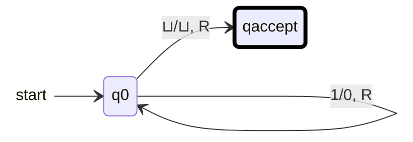

הגעת למקום הנכון! מכונת טיורינג (Turing Machine) היא אחד הקונספטים החשובים והמרתקים ביותר במדעי המחשב. למרות שמדובר במודל מתמטי תאורטי לחלוטין שהומצא על ידי אלן טיורינג ב-1936 (הרבה לפני שהיו מחשבים מודרניים), הוא מהווה את הבסיס להבנה של **מה מחשבים מסוגלים (ולא מסוגלים) לחשב**.

הנה מדריך מקיף שיסביר לך את המושג, כולל דוגמה ותרגול כדי לוודא שהבנת.

---

## 1. מהי בעצם מכונת טיורינג?

מכונת טיורינג אינה מכונה פיזית, אלא מודל מופשט של מחשב. אפשר לדמיין אותה כמורכבת מהחלקים הבאים:

* **סרט (Tape):** סרט אינסופי (או לפחות בלתי מוגבל באורכו) המחולק ל"תאים". כל תא יכול להכיל סמל אחד (למשל `0`, `1`, או סמל ריק `⊔`). הסרט משמש כזיכרון של המכונה.
* **ראש קריאה/כתיבה (Head):** רכיב שיכול לקרוא את התוכן של התא עליו הוא נמצא, לכתוב סמל חדש בתא הזה, ולזוז צעד אחד ימינה (R) או שמאלה (L).
* **אוגר מצבים (State Register):** המכונה נמצאת בכל רגע נתון ב"מצב" (State) אחד ספציפי מתוך קבוצה סופית של מצבים.
* **פונקציית מעברים (Transition Function):** "התוכנית" או "האלגוריתם" של המכונה. זוהי טבלת חוקים שאומרת למכונה מה לעשות בהתבסס על **המצב הנוכחי** שלה ו**הסמל שהראש קורא כרגע**.

### איך עובד חוק בפונקציית המעברים?

החוק תמיד ייראה כך:

> "אם את במצב $q$ וקוראת את הסמל $a$, אז תכתבי את הסמל $b$, תעברי למצב $p$, ותזוזי לכיוון $D$ (ימינה או שמאלה)."

---

## 2. ההגדרה הפורמלית (קצת מתמטיקה)

במודלים חישוביים, אנחנו אוהבים להגדיר דברים בצורה מדויקת. מכונת טיורינג מוגדרת באופן פורמלי כשביעייה (7-tuple):

$$M = (Q, \Sigma, \Gamma, \delta, q_0, q_{accept}, q_{reject})$$

* $Q$ - קבוצה סופית של מצבים.
* $\Sigma$ - א"ב הקלט (הסמלים המותרים בקלט, ללא הסמל הריק).
* $\Gamma$ - א"ב הסרט (כל הסמלים שיכולים להיכתב על הסרט, כולל הסמל הריק $\sqcup$).
* $\delta$ - פונקציית המעברים: $\delta: Q \times \Gamma \rightarrow Q \times \Gamma \times \{L, R\}$.
* $q_0$ - המצב ההתחלתי.
* $q_{accept}$ - מצב קבלה (אם המכונה מגיעה לכאן, היא עוצרת ומקבלת את הקלט).
* $q_{reject}$ - מצב דחייה (אם המכונה מגיעה לכאן, היא עוצרת ודוחה את הקלט).

---

## 3. אימון והדגמה: בניית מכונת טיורינג "הופכת ביטים"

כדי להבין איך זה עובד בפועל, נבנה מכונה פשוטה.
**המטרה:** המכונה מקבלת קלט של מחרוזת ביטים (למשל `1011`), הופכת כל `0` ל-`1` וכל `1` ל-`0`, ועוצרת כשהיא מסיימת.

**הגדרת המכונה:**

* **מצבים:** $q_0$ (המצב ההתחלתי והמבצע), $q_{accept}$ (מצב הסיום).
* **א"ב:** הסמלים הם `0`, `1`, והסמל הריק `⊔`.

**פונקציית המעברים ($\delta$):**

1. אם המכונה במצב $q_0$ וקוראת `0` $\gets$ תכתוב `1`, תזוז ימינה (R), ותישאר במצב $q_0$.
2. אם המכונה במצב $q_0$ וקוראת `1` $\gets$ תכתוב `0`, תזוז ימינה (R), ותישאר במצב $q_0$.
3. אם המכונה במצב $q_0$ וקוראת $\sqcup$ (סוף הקלט) $\gets$ אל תכתוב כלום (או תכתוב $\sqcup$), תישאר במקום (או תזוז ימינה), ותעבור למצב $q_{accept}$ (הגענו לסוף, אפשר לעצור).

**הרצה על הקלט `10`:**

* **צעד 1:** סרט:  `1 0`, ראש על `1`, מצב $q_0$. חוק 2 פועל: המכונה כותבת `0`, זזה ימינה, נשארת ב-$q_0$.
* **צעד 2:** סרט: `0 0 ⊔`, ראש על `0`, מצב $q_0$. חוק 1 פועל: המכונה כותבת `1`, זזה ימינה, נשארת ב-$q_0$.
* **צעד 3:** סרט: `0 1 ⊔`, ראש על `⊔`, מצב $q_0$. חוק 3 פועל: המכונה עוברת ל-$q_{accept}$ ועוצרת. פלט סופי: `01`.

---

## 4. למה זה כל כך חשוב?

* **תזת צ'רץ'-טיורינג:** התזה קובעת שכל בעיה שניתנת לחישוב על ידי אלגוריתם כלשהו בטבע, ניתנת לחישוב על ידי מכונת טיורינג. כלומר, המחשב הכי חזק בעולם שווה בכוחו החישובי התיאורטי למכונת טיורינג!
* **בעיית העצירה (The Halting Problem):** טיורינג הוכיח שיש בעיות שמכונת טיורינג לעולם לא תוכל לפתור. למשל, אי אפשר לבנות תוכנית שתבדוק תוכנית אחרת ותגיד בוודאות אם היא תעצור מתישהו או תרוץ בלולאה אינסופית.

זה טבעי לגמרי להתבלבל! המונחים בקורסים של מודלים חישוביים יכולים להיות מאוד מתעתעים. קודם כל, בוא נעשה סדר בטעות הנפוצה ביותר לגבי "מילים" ו"שפות":

במדעי המחשב, **מילה** (או מחרוזת) היא פשוט רצף של סמלים (כמו `0110`), ו**שפה** היא פשוט *אוסף של מילים* (למשל: "כל המילים שמתחילות ב-0"). לכן, מכונת טיורינג לא באמת מבדילה בין זיהוי מילה לזיהוי שפה – היא מקבלת *מילה* כקלט, והתפקיד שלה הוא להגיד אם המילה הזו שייכת ל*שפה* שאנחנו מחפשים.

החלוקה האמיתית של מכונות טיורינג מתבצעת בשני מישורים: **מה המכונה עושה עם הקלט** (רמות הכרעה), ו**איך המכונה בנויה** (וריאציות מבניות). הנה טבלאות שיעשו לך סדר:

## סוגי מכונות וסוגי מודלים

### 1. סוגי מכונות לפי המטרה שלהן (הכרעה לעומת זיהוי)

זהו ההבדל הקריטי ביותר במודלים חישוביים. הוא מגדיר מה קורה כשהמכונה מקבלת מילה ש*לא* שייכת לשפה.

{: .table-he}

| סוג המכונה | מה היא עושה? | אם המילה שייכת לשפה | אם המילה **לא** שייכת לשפה |
| --- | --- | --- | --- |
| **מכונה מזהה (Recognizer)** | מזהה שפה (נקראת RE). אם התשובה היא "כן", היא תמצא אותה. אם התשובה היא "לא", היא עלולה להיתקע לנצח. | עוצרת במצב $q_{accept}$ | דוחה ($q_{reject}$) או **רצה בלולאה אינסופית** |
| **מכונה מכריעה (Decider)** | מחליטה בוודאות לגבי שפה (נקראת R). היא **תמיד עוצרת**, לא משנה מה הקלט. | עוצרת במצב $q_{accept}$ | עוצרת במצב $q_{reject}$ |
| **מכונה מחשבת (Transducer)** | לא עונה "כן/לא", אלא מחשבת פונקציה. מקבלת קלט ופולטת תוצאה חדשה (כמו מכונת הופכת הביטים שבנינו). | מחזירה פלט מחושב ותקין | תלוי בהגדרת הפונקציה |

---

### 2. וריאציות מבניות (השוואות מודלים)

לפעמים מתמטיקאים מנסים "לשדרג" את מכונת טיורינג כדי לראות אם אפשר לתת לה יותר כוח. ההפתעה הגדולה היא שרוב ה"שדרוגים" האלה **לא מוסיפים לה שום כוח חישובי** תיאורטי (הם רק עושים אותה נוחה יותר).

{: .table-he}

| סוג מודל | תיאור השדרוג או השינוי | כוח חישובי ביחס למכונה רגילה |
| --- | --- | --- |
| **מכונה קלאסית / דטרמיניסטית (DTM)** | המודל הרגיל. לכל מצב וקלט יש בדיוק חוק אחד שקובע את הצעד הבא. | זהו מודל הבסיס שלנו. |
| **מכונה מרובת סרטים (Multi-tape)** | במקום סרט אחד, יש לה כמה סרטים וראשי קריאה שפועלים במקביל (כמו זיכרון מורחב). | **זהה לחלוטין**. כל מה שהיא עושה, מכונה רגילה יכולה לעשות (אולי לאט יותר). |
| **מכונה אי-דטרמיניסטית (NTM)** | יכולה לבצע "ניחושים". כשהיא קוראת סמל, היא יכולה להתפצל לכמה נתיבי חישוב במקביל. | **זהה לחלוטין!** (זו עובדה מדהימה שמוכיחים בקורס - אפשר לדמות אותה עם DTM). |

