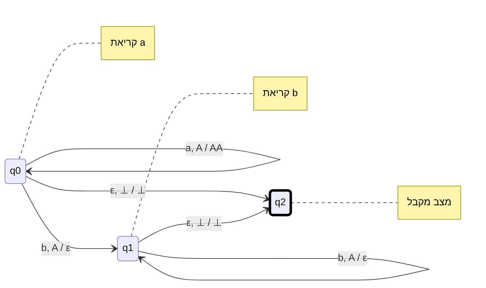
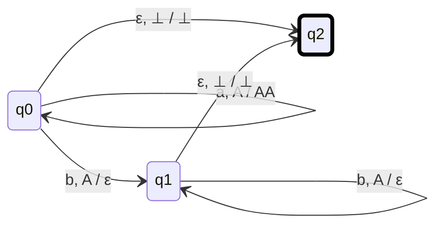
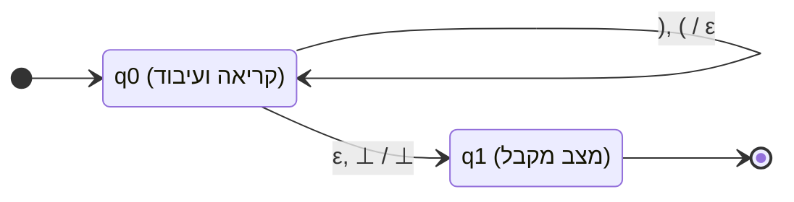
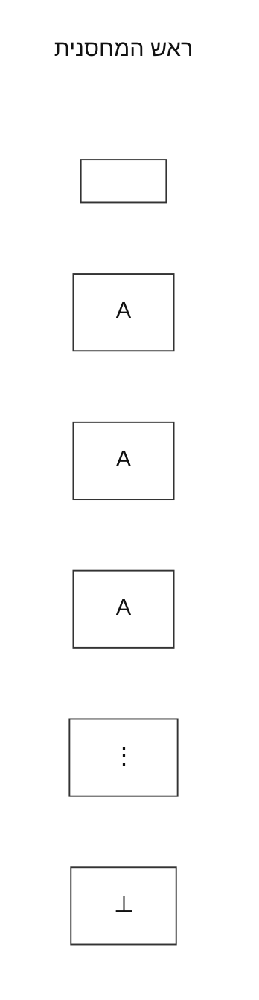
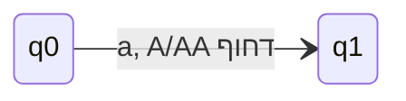
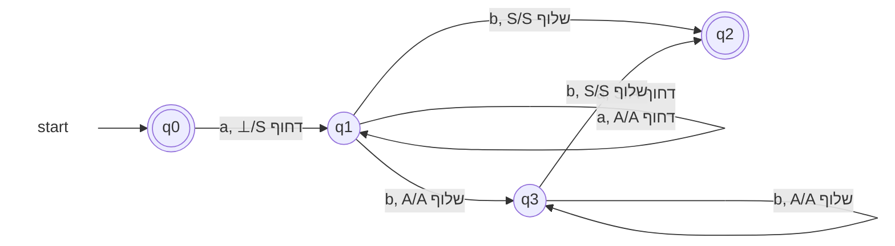

{: .box-note}
**אוטומט מחסנית** (Pushdown Automaton - ובקיצור PDA) הוא מודל חישובי שמרחיב את היכולות של אוטומט סופי (DFA/NFA) על ידי הוספת זיכרון מסוג **מחסנית** (Stack).

בעוד שאוטומט סופי יכול לזכור רק כמות מוגבלת של מידע (לפי מספר המצבים שלו), אוטומט מחסנית יכול לזכור כמות בלתי מוגבלת של מידע, אך הגישה אליו היא בשיטת **LIFO** (נכנס אחרון - יוצא ראשון). בזכות המחסנית, המודל הזה מסוגל לזהות "שפות חופשיות הקשר" (Context-Free Languages), כגון שפות שדורשות ספירה והשוואה (למשל, לוודא שמספר ה-`a` שווה למספר ה-`b`, או שסוגריים נסגרים כראוי).

## שתי צורות רישום למעברים

בדף הזה מופיעות שתי קונבנציות, וחשוב לא לערבב ביניהן:

* **סימון סטנדרטי:** `קלט, ראש/החלפה`. כאן מה שמופיע אחרי `/` הוא מה שמחליף את ראש המחסנית. למשל `a, A/AA` אומר שמחליפים `A` ב-`AA`, כלומר מוסיפים עוד `A`.
* **סימון המורה בתמונה:** `דחוף: קלט, ראש/סימן` או `שלוף: קלט, ראש/סימן`. כאן המילה `דחוף` או `שלוף` אומרת מה הפעולה, והסימן אחרי `/` הוא הסימן שדוחפים או שולפים.
* **`⊥`:** אצל המורה זהו סימן תחתית המחסנית. בספרים/מקורות אחרים אותו רעיון מסומן לפעמים כ-$Z_0$.
* **`S`:** בחלק מהשיעורים המורה משתמשת ב-`S` כסימן התחלה שמונח מעל `⊥`. בדוגמה של $a^n b^n$ הוא מסמן את ה-`a` הראשון, ולא את תחתית המחסנית עצמה.

---

### דוגמה 1: השפה $L = \{ a^n b^n \mid n \ge 0 \}$

זוהי השפה הקלאסית ביותר לאוטומט מחסנית: רצף של `a`-ים ואחריו בדיוק אותו מספר של `b`-ים (למשל `aabb`, `aaabbb`, או מילה ריקה).
**הלוגיקה:** 1. כל פעם שקוראים `a`, דוחפים את האות `A` למחסנית.
2. ברגע שמתחילים לקרוא `b`, שולפים `A` מהמחסנית על כל `b` שקוראים.
3. בסוף המילה, אם המחסנית נותרה רק עם `⊥`, המשמעות היא שכמות ה-`b` שקראנו הייתה שווה בדיוק לכמות ה-`a` שהכנסנו.

#### Option 1 — Verbose (explanations as notes)

#### Option 2 — Non-verbose (bare states, no notes at all)

{: .box-note}
Option 2 עדיין תקף, אבל הוא כתוב בסימון סטנדרטי אחר: שם החלק שאחרי `/` הוא ההחלפה המלאה של ראש המחסנית. בסימון של המורה בהמשך, המילים `דחוף` ו-`שלוף` הן חלק מהפעולה, ולכן החלק שאחרי `/` הוא הסימן שדוחפים או שולפים.

**הסבר על המעברים במרמייד (דוגמה 1):**

* `a, ⊥ / A⊥`: קראנו `a`, בראש המחסנית יש `⊥` (כלומר הגענו לתחתית המחסנית). אנחנו מחליפים אותו ב-`A⊥`, ולכן הוספנו `A` מעל סימן התחתית.
* `a, A / AA`: קראנו `a`, בראש המחסנית יש `A`. שולפים אותו ודוחפים פעמיים `A` (כלומר, הוספנו עוד `A`).
* `b, A / ε`: קראנו `b`, שולפים `A` מהמחסנית ולא דוחפים כלום (`ε`). זוהי פעולת ה"קיזוז".
* `ε, ⊥ / ⊥`: סיימנו לקרוא את המילה (קלט `ε`), נשארנו עם סימן התחתית `⊥` במחסנית - עוברים למצב מקבל.

---

### דוגמה 2: שפת הסוגריים החוקיים (Balanced Parentheses)

נניח שהא"ב שלנו הוא `{ ( , ) }` ואנחנו רוצים לקבל רק מילים שבהן הסוגריים נפתחים ונסגרים כראוי, למשל `(())`, `()()`, וכו'.
**הלוגיקה:**

1. כשרואים סוגר פותח `(`, דוחפים אותו למחסנית.
2. כשרואים סוגר סוגר `)`, שולפים סוגר פותח `(` מהמחסנית (אם אין כזה, נתקעים והמילה נדחית - למשל אם התחלנו עם סוגר סוגר).
3. בסוף המילה, נוודא שהמחסנית התרוקנה (כלומר הגענו ל-`⊥`).

**הסבר על המעברים במרמייד (דוגמה 2):**

* `(, ⊥ / (⊥`: סוגר פותח ראשון נכנס למחסנית מעל סימן התחתית.
* `(, ( / ( (`: סוגר פותח נוסף נכנס למחסנית מעל סוגר פותח קיים.
* `), ( / ε`: ראינו סוגר סוגר `)` - אנחנו שולפים סוגר פותח `(` מהמחסנית. (שים לב: אם המחסנית ריקה, כלומר יש רק `⊥`, אין לנו מעבר שמאפשר לקרוא `)`, ולכן המכונה תיתקע ותדחה את המילה, מה שמונע קבלת מילה כמו `)(`).
* `ε, ⊥ / ⊥`: הגענו לסוף המילה, המחסנית חזרה לסימן התחתית ההתחלתי, אנחנו עוברים ל-`q1` ומקבלים את המחרוזת.

---

## נספח: רישום לפי סימון המורה

{: .box-note}
במעבר כמו `דחוף: a, A/AA`: הקלט הנוכחי הוא `a`, ראש המחסנית הוא `A`, והתוצאה היא שמחזירים למחסנית שתי אותיות `A` מעל ההמשך הישן של המחסנית. הסימון `⊥` הוא תחתית המחסנית; הסימון `S`, כשמופיע בדוגמה של $a^n b^n$, הוא סימן בסיס עבור ה-`a` הראשון.

### תמלול

**רעיון לבנייה:**

* `q0` מצב מקבל כי אפסילון בשפה.
* עבור `a` ראשון נכניס `S` למחסנית.
* עבור כל `a` נוסף נכניס `A`.
* עבור `b` ראשון שרואים — **מעבר מצב**:

  1. למצב מקבל אם `S` בראש המחסנית.
  2. למצב השוואה אם `A` בראש המחסנית.
* עבור כל `b` נוסף נמשיך להוציא את ראש המחסנית, במידה והוא `A`, ונישאר במצב ההשוואה.
* אם `S` בראש המחסנית, נוציא אותו ונעבור למצב מקבל.

האוטומט מקבל את:

$$
L=\{a^n b^n\mid n\ge 0\}
$$

### Mermaid

בסימון של המורה בתמונה:

* מבנה המעבר: `תו קלט, ראש המחסנית/הסימן שעליו מבצעים את הפעולה`

בסימון הזה לא מפרשים את החלק שאחרי `/` בתור "החלפה מלאה" של ראש המחסנית. המילה `דחוף` או `שלוף` היא חלק מהסימון:

* `a, S/A דחוף` אומר: אם קראנו `a` ובראש המחסנית יש `S`, דוחפים מעליו `A`.
* `b, A/A שלוף` אומר: אם קראנו `b` ובראש המחסנית יש `A`, שולפים את ה-`A` הזה.

ב-Mermaid המילה `דחוף` או `שלוף` מופיעה בסוף התווית כדי שהחלק הסימבולי (`a, S/A`) יישאר רציף וקריא.

* `q0` מקבל את `ε`, כי עבור `n=0` המילה הריקה שייכת לשפה.
* `q1` הוא מצב קריאת ה-`a`-ים ודחיפת סימנים למחסנית.
* `q3` הוא מצב השוואת ה-`b`-ים מול ה-`A`-ים שעל המחסנית.
* `q2` הוא מצב מקבל אחרי שה-`b` האחרון שלף את `S`.
* המעברים שאינם מצוירים אינם קיימים.

### האם Option 2 עדיין תקף?

כן. Option 2 עדיין תקף ומקבל בדיוק את אותה שפה:

$$
L=\{a^n b^n\mid n\ge 0\}
$$

ההבדל הוא לא בשפה אלא בסימון ובבחירת סימני המחסנית.

ב-Option 2 משתמשים בסימון סטנדרטי של אוטומט מחסנית: `קלט, ראש/החלפה`. למשל `a, ⊥ / A⊥` אומר שמחליפים את `⊥` ב-`A⊥`, כלומר מוסיפים `A` מעל תחתית המחסנית. לפי הבנייה הזו לא צריך `S`, כי `⊥` עצמו עוזר לזהות שהסתיימה הספירה.

בציור של המורה משתמשים בסימון פעולה: `דחוף` או `שלוף`. כאן `S` מסמן את ה-`a` הראשון, וה-`A`-ים שמעליו מסמנים את ה-`a`-ים הנוספים. לכן הדיאגרמה נראית קצת ארוכה יותר, אבל היא עושה את אותו רעיון: כל `a` מוסיף סימן למחסנית, וכל `b` מוציא סימן מהמחסנית.

כלל חשוב: לא מערבבים בין שתי הקונבנציות באותה דיאגרמה. אם כותבים בסימון של Option 2, אז אחרי `/` כותבים את ההחלפה המלאה. אם כותבים בסימון של המורה, כותבים גם `דחוף` או `שלוף`, ואז אחרי `/` מופיע הסימן שדוחפים או שולפים.

### למה צריך כאן `S` ולא מתחילים ישר עם `A`?

בדוגמה של המורה ה-`S` אינו עוד אות מסתורית. הוא סימן בסיס שמסמן: "כאן נמצא ה-`a` הראשון שקראנו". מעליו נערמים ה-`A`-ים של ה-`a`-ים הנוספים.

לכן עבור המילה `aaabbb` המחסנית אחרי קריאת שלושת ה-`a`-ים נראית כך:

מלמעלה למטה:

* `A`
* `A`
* `S`
* `⊥`

הקריאה של ה-`b`-ים עובדת כך:

1. ה-`b` הראשון מוציא `A`.
2. ה-`b` השני מוציא `A`.
3. ה-`b` השלישי מוציא `S`.
4. עכשיו נשאר רק `⊥`, והמילה התקבלה.

כלומר, `S` נספר כמו ה-`a` הראשון. הוא פשוט נראה שונה מ-`A` כדי שנדע מתי הגענו לסוף הספירה.

אם `n=1`, כלומר המילה היא `ab`, אחרי קריאת ה-`a` הראשון המחסנית היא רק `S` מעל `⊥`. כשקוראים את ה-`b`, מוציאים את `S` ועוברים למצב מקבל. זה מסביר למה המעבר `שלוף: b, S/S` חשוב: הוא מטפל בדיוק במקרה שבו היה רק `a` אחד, וגם במקרה שבו סיימנו להוציא את כל ה-`A`-ים.

אז למה לא לשים `A` מההתחלה?

יש כאן שתי אפשרויות שונות, וחשוב לא לערבב ביניהן:

1. **אם שמים `A` במחסנית כבר בתחילת הדרך, לפני שקראנו קלט** - יצרנו כאילו כבר קראנו `a` אחד, למרות שלא קראנו כלום. זה משבש את הספירה, ובעיקר מפריע למילה הריקה `ε`, שאמורה להתקבל כי $0 \le n$.
2. **אם דוחפים `A` במקום `S` רק אחרי שקוראים את ה-`a` הראשון** - זה יכול לעבוד, אבל אז צריך דרך אחרת לדעת מתי הגענו ל-`A` האחרון. בדרך כלל משתמשים ב-`⊥` כדי לזהות שהסתיימה הספירה. זו צורת בנייה אחרת מזו שהמורה מציירת.

בנייה בלי `S` הייתה נראית בערך כך:

* `a` ראשון: `דחוף: a, ⊥/A`
* `a` נוסף: `דחוף: a, A/A`
* `b`: `שלוף: b, A/A`
* סוף: נשארים עם `⊥`

זו יכולה להיות בנייה תקינה, אבל היא כבר לא בדיוק הציור של המורה. בבנייה כזו צריך להשתמש ב-`⊥` בתור הסימן שמזהה את סוף הספירה. בבנייה של המורה משאירים את `⊥` כסימן טכני של תחתית, ומשתמשים ב-`S` בתור הסימן שאומר: "זה ה-`a` הראשון, וכשמוציאים אותו סיימנו להשוות".

לכן הרעיון של המורה הוא:

* `a` ראשון: `דחוף: a, ⊥/S`
* `a` נוסף מעל `S`: `דחוף: a, S/A`
* `a` נוסף מעל `A`: `דחוף: a, A/A`
* `b` מול `A`: `שלוף: b, A/A`
* `b` אחרון מול `S`: `שלוף: b, S/S`

השורה החשובה ביותר היא `שלוף: b, S/S`: היא אומרת שה-`b` האחרון צריך להתאים ל-`a` הראשון. אם אחרי זה נשארים עוד תווים בקלט, אין מעבר מתאים והמילה נדחית. אם נגמר הקלט, עברנו למצב מקבל.
