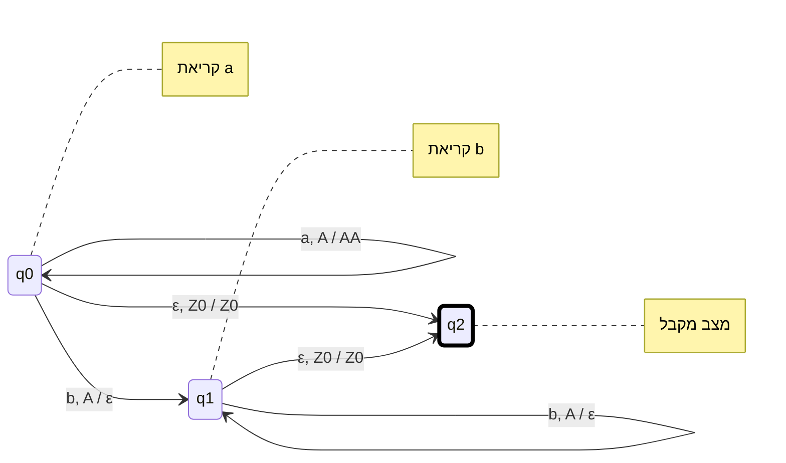
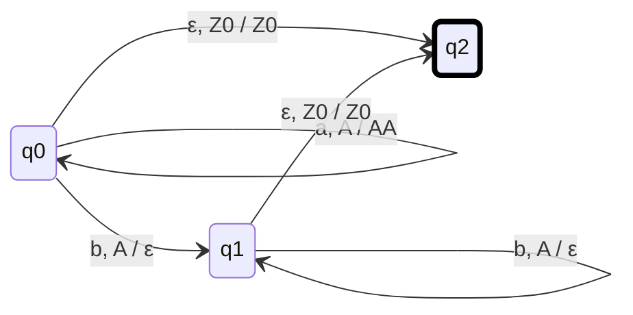
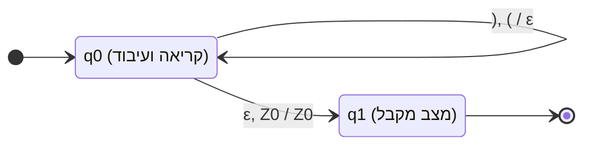

{: box-note}
**אוטומט מחסנית** (Pushdown Automaton - ובקיצור PDA) הוא מודל חישובי שמרחיב את היכולות של אוטומט סופי (DFA/NFA) על ידי הוספת זיכרון מסוג **מחסנית** (Stack).

בעוד שאוטומט סופי יכול לזכור רק כמות מוגבלת של מידע (לפי מספר המצבים שלו), אוטומט מחסנית יכול לזכור כמות בלתי מוגבלת של מידע, אך הגישה אליו היא בשיטת **LIFO** (נכנס אחרון - יוצא ראשון). בזכות המחסנית, המודל הזה מסוגל לזהות "שפות חופשיות הקשר" (Context-Free Languages), כגון שפות שדורשות ספירה והשוואה (למשל, לוודא שמספר ה-`a` שווה למספר ה-`b`, או שסוגריים נסגרים כראוי).

## צורת רישום מעברים (משמאל לימין)

**`נדחף / נשלף ,קלט`** (או באנגלית: `Input, Pop / Push`)

* **קלט:** האות שאנחנו קוראים מהמילה (או `ε` אם לא קוראים כלום).
* **נשלף (Pop):** האות שאנחנו מוציאים מראש המחסנית. (המעבר יקרה רק אם האות הזו אכן נמצאת בראש המחסנית).
* **נדחף (Push):** האות (או המחרוזת) שאנחנו מכניסים לראש המחסנית במקום מה שהוצאנו. (אם כתוב `ε`, סימן שרק שלפנו ולא דחפנו כלום).
* **$Z_0$:** מקובל לסמן את תחתית המחסנית (הסימן ההתחלתי) באות זו.

---

### דוגמה 1: השפה $L = \{ a^n b^n \mid n \ge 0 \}$

זוהי השפה הקלאסית ביותר לאוטומט מחסנית: רצף של `a`-ים ואחריו בדיוק אותו מספר של `b`-ים (למשל `aabb`, `aaabbb`, או מילה ריקה).
**הלוגיקה:** 1. כל פעם שקוראים `a`, דוחפים את האות `A` למחסנית.
2. ברגע שמתחילים לקרוא `b`, שולפים `A` מהמחסנית על כל `b` שקוראים.
3. בסוף המילה, אם המחסנית נותרה רק עם $Z_0$, המשמעות היא שכמות ה-`b` שקראנו הייתה שווה בדיוק לכמות ה-`a` שהכנסנו.

#### Option 1 — Verbose (explanations as notes)

#### Option 2 — Non-verbose (bare states, no notes at all)

**הסבר על המעברים במרמייד (דוגמה 1):**

* `a, Z0 / A Z0`: קראנו `a`, בראש המחסנית יש $Z_0$ (מחסנית ריקה). אנחנו שולפים אותו ודוחפים `A` ומתחתיו את $Z_0$ (כלומר, הוספנו `A`).
* `a, A / AA`: קראנו `a`, בראש המחסנית יש `A`. שולפים אותו ודוחפים פעמיים `A` (כלומר, הוספנו עוד `A`).
* `b, A / ε`: קראנו `b`, שולפים `A` מהמחסנית ולא דוחפים כלום (`ε`). זוהי פעולת ה"קיזוז".
* `ε, Z0 / Z0`: סיימנו לקרוא את המילה (קלט `ε`), נשארנו עם $Z_0$ במחסנית - עוברים למצב מקבל.

---

### דוגמה 2: שפת הסוגריים החוקיים (Balanced Parentheses)

נניח שהא"ב שלנו הוא `{ ( , ) }` ואנחנו רוצים לקבל רק מילים שבהן הסוגריים נפתחים ונסגרים כראוי, למשל `(())`, `()()`, וכו'.
**הלוגיקה:**

1. כשרואים סוגר פותח `(`, דוחפים אותו למחסנית.
2. כשרואים סוגר סוגר `)`, שולפים סוגר פותח `(` מהמחסנית (אם אין כזה, נתקעים והמילה נדחית - למשל אם התחלנו עם סוגר סוגר).
3. בסוף המילה, נוודא שהמחסנית התרוקנה (כלומר הגענו ל-$Z_0$).

**הסבר על המעברים במרמייד (דוגמה 2):**

* `(, Z0 / ( Z0`: סוגר פותח ראשון נכנס למחסנית.
* `(, ( / ( (`: סוגר פותח נוסף נכנס למחסנית מעל סוגר פותח קיים.
* `), ( / ε`: ראינו סוגר סוגר `)` - אנחנו שולפים סוגר פותח `(` מהמחסנית. (שים לב: אם המחסנית ריקה, כלומר יש $Z_0$, אין לנו מעבר שמאפשר לקרוא `)`, ולכן המכונה תיתקע ותדחה את המילה, מה שמונע קבלת מילה כמו `)(`).
* `ε, Z0 / Z0`: הגענו לסוף המילה, המחסנית חזרה ל-$Z_0$ ההתחלתי, אנחנו עוברים ל-`q1` ומקבלים את המחרוזת.
