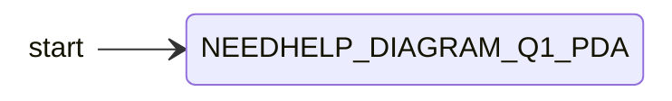
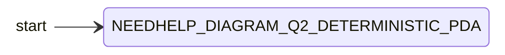
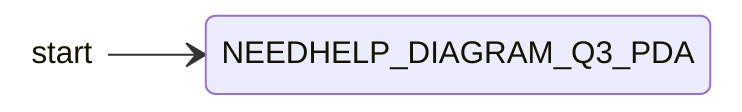

{: .box-note}
מסמך זה הוא תמלול של שאלות המטלה בלבד. אין כאן פתרונות. מקומות הדורשים השלמה או בדיקה סומנו במילת חיפוש ברורה: **NEEDHELP**.

## הנחיות כלליות

ענה על כל השאלות שלפניך.

---

שאלה 1 - שפה מעל הא״ב {a,b,c} ואוטומט מחסנית

לפניך השפה $$L$$ מעל הא״ב $$\{a,b,c\}$$:

$$
L = \{a^n b^{3k+1} c^k \mid n>0,\ k>0\}
$$

| רכיב | תנאי |
|---|---|
| מספר ה-`a` | $$n>0$$ |
| מספר ה-`b` | $$3k+1$$ |
| מספר ה-`c` | $$k>0$$ |
{: .table-en}

א. כתוב את המילה הקצרה ביותר בשפה $$L$$.

> NEEDHELP_Q1A_ANSWER_PLACEHOLDER

ב. בנה אוטומט מחסנית שיקבל את השפה $$L$$.

> NEEDHELP_Q1B_COMPLETE_PDA

---

שאלה 2 - אוטומט מחסנית דטרמיניסטי

בנה אוטומט מחסנית דטרמיניסטי שמקבל את השפה הבאה:

$$
L = \{a^{2n} b^m c^k \mid n,m \ge 0,\ k>n+m\}
$$

| רכיב | תנאי |
|---|---|
| מספר ה-`a` | $$2n$$ |
| מספר ה-`b` | $$m$$ |
| מספר ה-`c` | $$k$$ |
| תנאי על הפרמטרים | $$n,m \ge 0,\ k>n+m$$ |
{: .table-en}

> NEEDHELP_Q2_COMPLETE_DETERMINISTIC_PDA

---

שאלה 3 - שפה עם רצפים וקשיים צפויים לתלמידים

לפניך השפה $$L$$:

$$
L = \left\{
    a^s b^{2s} a^{i_1} b^{j_1} a^{i_2} b^{j_2} \ldots a^{i_n} b^{j_n}
    \ \middle|\
    s \ge 1,\ n \ge 1,\ \forall 1 \le k \le n:\ i_k \ge 1,\ j_k \ge 1
\right\}
$$

> NEEDHELP_VERIFY_Q3_FORMULA - הנוסחה בעמוד המקור מעט מטושטשת; בדוק במיוחד את החלק $$a^s b^{2s}$$ ואת האינדקסים $$i_k, j_k$$.

| רכיב | תנאי |
|---|---|
| תחילת המילה | $$a^s b^{2s}$$ |
| המשך המילה | $$a^{i_1} b^{j_1} a^{i_2} b^{j_2} \ldots a^{i_n} b^{j_n}$$ |
| תנאי על $$s,n$$ | $$s \ge 1,\ n \ge 1$$ |
| תנאי על כל רצף המשך | לכל $$1 \le k \le n$$ מתקיים $$i_k \ge 1,\ j_k \ge 1$$ |
{: .table-en}

א. כתוב את המילה הקצרה ביותר בשפה $$L$$.

> NEEDHELP_Q3A_ANSWER_PLACEHOLDER

ב. בנה אוטומט מחסנית שיקבל את השפה $$L$$.

> NEEDHELP_Q3B_COMPLETE_PDA

ג. בפתרון שאלה זו עלולים להיות לתלמידים מספר קשיים. ציין מהם והצע כיצד תתמודד איתם.

| קושי אפשרי | דרך התמודדות מוצעת |
|---|---|
| NEEDHELP_Q3C_DIFFICULTY_1 | NEEDHELP_Q3C_RESPONSE_1 |
| NEEDHELP_Q3C_DIFFICULTY_2 | NEEDHELP_Q3C_RESPONSE_2 |
| NEEDHELP_Q3C_DIFFICULTY_3 | NEEDHELP_Q3C_RESPONSE_3 |
{: .table-en}

---

שאלה 4 - סיווג שפות וטענות על שפות

לפניך השפות הבאות מעל הא״ב $$\Sigma = \{a,b\}$$:

$$
L_1 = \{(ab)^n (ab)^m \mid n \ge m \ge 0\}
$$

$$
L_2 = \{a^n b^n a^m \mid n \ge m \ge 0\}
$$

$$
L_3 = \{a^n b^{2n} a^{n\%3} \mid n,m \ge 0\}
$$

> NEEDHELP_CLARIFY_Q4_L3 - בתנאי של $$L_3$$ מופיע $$m$$, אך הוא לא מופיע בביטוי השפה. בדוק האם זו טעות הקלדה במקור או שיש משמעות חסרה.

$$
L_4 = \{w \mid \#_a(w) > \#_b(w)\}
$$

$$
L_5 = L_2 \cap L_3
$$

## א. סיווג כל שפה

לגבי כל אחת מהשפות, ציין האם היא:

- רגולרית
- לא רגולרית וחופשית הקשר
- לא חופשית הקשר

נמק את קביעתך.

| שפה | הגדרת השפה | רגולרית | לא רגולרית וחופשית הקשר | לא חופשית הקשר | נימוק |
|---|---|---|---|---|---|
| $$L_1$$ | $$\{(ab)^n (ab)^m \mid n \ge m \ge 0\}$$ | NEEDHELP | NEEDHELP | NEEDHELP | NEEDHELP |
| $$L_2$$ | $$\{a^n b^n a^m \mid n \ge m \ge 0\}$$ | NEEDHELP | NEEDHELP | NEEDHELP | NEEDHELP |
| $$L_3$$ | $$\{a^n b^{2n} a^{n\%3} \mid n,m \ge 0\}$$ | NEEDHELP | NEEDHELP | NEEDHELP | NEEDHELP |
| $$L_4$$ | $$\{w \mid \#_a(w) > \#_b(w)\}$$ | NEEDHELP | NEEDHELP | NEEDHELP | NEEDHELP |
| $$L_5$$ | $$L_2 \cap L_3$$ | NEEDHELP | NEEDHELP | NEEDHELP | NEEDHELP |
{: .table-en}

## ב. בדיקת טענות

עבור הטענות הבאות, ענה האם הטענה נכונה ונמק את קביעתך:

| מספר | טענה | נכון / לא נכון | נימוק |
|---|---|---|---|
| 1 | $$L_2 \subset L_4$$ | NEEDHELP | NEEDHELP |
| 2 | $$L_3 \cap L_4 \ne \varnothing$$ | NEEDHELP | NEEDHELP |
| 3 | $$\overline{L_4} \cap L_1 \ne \varnothing$$ | NEEDHELP | NEEDHELP |
{: .table-en}

---

בהצלחה ✌️
