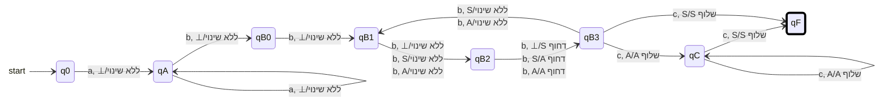
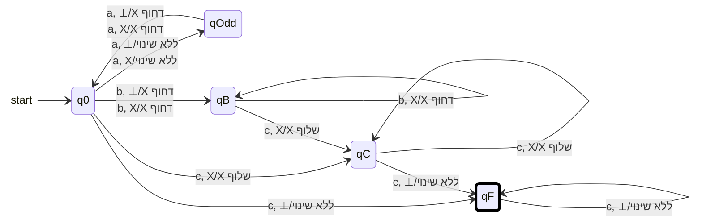
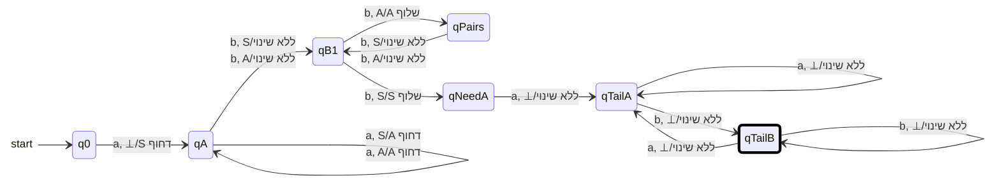
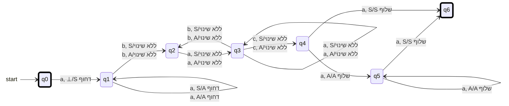

{: .box-note}
המטלה נפתרה בעזרת codex 5.5 High עקב מצוקת זמן ועומס יתר.

---

<details open markdown="1">
<summary>שאלה 1 - שפה מעל הא״ב {a,b,c} ואוטומט מחסנית</summary>

לפניך השפה $$L$$ מעל הא״ב $$\{a,b,c\}$$:

$$
L = \{a^n b^{3k+1} c^k \mid n>0,\ k>0\}
$$

{: .table-rl}

| רכיב | תנאי |
|---|---|
| מספר ה-`a` | $$n>0$$ |
| מספר ה-`b` | $$3k+1$$ |
| מספר ה-`c` | $$k>0$$ |


## א. המילה הקצרה ביותר

כדי לקבל את המילה הקצרה ביותר נבחר את הערכים המינימליים:

$$
n=1,\quad k=1
$$

ולכן:

$$
a^1b^{3\cdot1+1}c^1 = abbbbc
$$

המילה הקצרה ביותר היא:

```text
abbbbc
```

## ב. אוטומט מחסנית

הרעיון: קוראים לפחות `a` אחת בלי לשנות את המחסנית. לאחר מכן קוראים `b` אחד "עודף", ואז כל שלושה `b` נוספים דוחפים סימן אחד למחסנית. בשלב ה-`c` שולפים סימן אחד עבור כל `c`. הסימן `S` מסמן את שלשת ה-`b` הראשונה, כדי שאפשר יהיה לזהות מתי נשלף הסימן האחרון בלי מעבר אפסילון.



</details>

---

<details open markdown="1">
<summary>שאלה 2 - אוטומט מחסנית דטרמיניסטי</summary>

בנה אוטומט מחסנית דטרמיניסטי שמקבל את השפה הבאה:

$$
L = \{a^{2n} b^m c^k \mid n,m \ge 0,\ k>n+m\}
$$

{: .table-rl}

| רכיב | תנאי |
|---|---|
| מספר ה-`a` | $$2n$$ |
| מספר ה-`b` | $$m$$ |
| מספר ה-`c` | $$k$$ |
| תנאי על הפרמטרים | $$n,m \ge 0,\ k>n+m$$ |


## פתרון

הרעיון: כל זוג `a` מייצר חוב אחד, וכל `b` מייצר חוב אחד. כל `c` סוגר חוב אחד. כדי להתקבל צריך לקרוא לפחות `c` אחד נוסף אחרי שכל החובות נסגרו, ולכן התנאי הוא בדיוק:

$$
k>n+m
$$

האוטומט דטרמיניסטי: בכל מצב, עבור תו קלט וראש מחסנית נתונים, יש לכל היותר מעבר אחד.



</details>

---

<details open markdown="1">
<summary>שאלה 3 - שפה עם רצפים וקשיים צפויים לתלמידים</summary>

לפניך השפה $$L$$:

$$
L = \left\{
    a^s b^{2s} a^{i_1} b^{j_1} a^{i_2} b^{j_2} \ldots a^{i_n} b^{j_n}
    \ \middle|\
    s \ge 1,\ n \ge 1,\ \forall 1 \le k \le n:\ i_k \ge 1,\ j_k \ge 1
\right\}
$$

{: .table-rl}

| רכיב | תנאי |
|---|---|
| תחילת המילה | $$a^s b^{2s}$$ |
| המשך המילה | $$a^{i_1} b^{j_1} a^{i_2} b^{j_2} \ldots a^{i_n} b^{j_n}$$ |
| תנאי על $$s,n$$ | $$s \ge 1,\ n \ge 1$$ |
| תנאי על כל רצף המשך | לכל $$1 \le k \le n$$ מתקיים $$i_k \ge 1,\ j_k \ge 1$$ |
{: .table-en}

## א. המילה הקצרה ביותר

כדי לקבל מילה קצרה ביותר נבחר:

$$
s=1,\quad n=1,\quad i_1=1,\quad j_1=1
$$

ולכן:

$$
a^1b^2a^1b^1 = abbab
$$

המילה הקצרה ביותר היא:

```text
abbab
```

## ב. אוטומט מחסנית

הרעיון: עבור כל `a` בתחילת המילה דוחפים סימן למחסנית. לאחר מכן קוראים את ה-`b` בזוגות, וכל `b` שני שולף סימן אחד. אחרי שנשלף הסימן האחרון, חייב להופיע המשך מהצורה $$(a^+b^+)+$$.



## ג. קשיים צפויים ודרכי התמודדות


{: .table-he}

| קושי אפשרי | דרך התמודדות מוצעת |
|---|---|
| בלבול בין התחילית $$a^s b^{2s}$$ לבין ההמשך $$(a^+b^+)+$$ | להפריד את הפתרון לשני שלבים: קודם בודקים יחס של פי שניים, ורק אחר כך עוברים לאוטומט סופי עבור הרצפים שבהמשך. |
| ניסיון לשלוף סימן על כל `b` במקום על כל זוג `b` | לצייר קודם טבלת מעקב קטנה, למשל עבור `abbab` ועבור `aabbbbaab`, ולראות שרק ה-`b` השני בכל זוג סוגר `a` אחד. |
| קושי לזהות מתי נגמר שלב ה-`b^{2s}` בלי מעבר אפסילון | להשתמש בסימן מחסנית מיוחד `S` עבור ה-`a` הראשון. כאשר שולפים את `S`, יודעים שזהו הסימן האחרון ועוברים מיד לשלב ההמשך. |

</details>

---

<details open markdown="1">
<summary>שאלה 4 - סיווג שפות וטענות על שפות</summary>

לפניך השפות הבאות מעל הא״ב $$\Sigma = \{a,b\}$$:

$$
L_1 = \{(ab)^n (ab)^m \mid n \ge m \ge 0\}
$$

$$
L_2 = \{a^n b^n a^m \mid n \ge m \ge 0\}
$$

$$
L_3 = \{a^n b^{2n} a^{n\%3} \mid n,m \ge 0\}
$$

{: .box-note}
ב-$$L_3$$ הפרמטר $$m$$ מופיע בתנאי אך אינו מופיע בביטוי השפה. לכן התייחסתי אליו כאל טעות הקלדה שאינה משפיעה על השפה.

$$
L_4 = \{w \mid \#_a(w) > \#_b(w)\}
$$

$$
L_5 = L_2 \cap L_3
$$

## א. סיווג כל שפה

{: .table-he}

| שפה | הגדרת השפה | סיווג | נימוק |
|---|---|---|---|
| $$L_1$$ | $$\{(ab)^n (ab)^m \mid n \ge m \ge 0\}$$ | רגולרית | אין מפריד בין שני החלקים, ולכן כל מילה היא פשוט $$(ab)^{n+m}$$. לכל $$t\ge0$$ אפשר לבחור $$n=t,m=0$$, ולכן $$L_1=(ab)^*$$. |
| $$L_2$$ | $$\{a^n b^n a^m \mid n \ge m \ge 0\}$$ | לא חופשית הקשר | אם $$L_2$$ הייתה חופשית הקשר, אז גם $$h^{-1}(L_2)\cap a^*b^*c^*$$ הייתה חופשית הקשר עבור ההומומורפיזם $$h(a)=a,\ h(b)=b,\ h(c)=a$$. אבל מתקבלת השפה $$\{a^n b^n c^m \mid n\ge m\ge0\}$$, שאינה חופשית הקשר לפי למת הניפוח, למשל על המילה $$a^p b^p c^p$$. |
| $$L_3$$ | $$\{a^n b^{2n} a^{n\%3} \mid n,m \ge 0\}$$ | לא רגולרית וחופשית הקשר | היא חופשית הקשר כי אפשר לדחוף שני סימנים עבור כל `a`, לשלוף סימן עבור כל `b`, ולעקוב במצבים אחרי $$n\bmod3$$ כדי לבדוק את הסיומת. היא אינה רגולרית, כי החיתוך שלה עם השפה הרגולרית $$(aaa)^*b^*$$ נותן את $$\{a^{3t}b^{6t}\mid t\ge0\}$$, שאינה רגולרית. |
| $$L_4$$ | $$\{w \mid \#_a(w) > \#_b(w)\}$$ | לא רגולרית וחופשית הקשר | היא חופשית הקשר: אוטומט מחסנית יכול לבטל זוגות `a` ו-`b` ולבדוק שבסוף נשאר עודף של `a`. היא אינה רגולרית לפי מייהיל-נרוד: התחיליות $$b^0,b^1,b^2,\ldots$$ נבדלות על ידי הסיומת $$a^{i+1}$$. |
| $$L_5$$ | $$L_2 \cap L_3$$ | רגולרית | כדי שמילה תהיה בשתי השפות צריך בו זמנית מספר `b` שווה ל-$$n$$ כמו ב-$$L_2$$ וגם שווה ל-$$2n$$ כמו ב-$$L_3$$. לכן האפשרות היחידה היא $$n=0$$, ומתקבל $$L_5=\{\varepsilon\}$$. |


## ב. בדיקת טענות

{: .table-he}

| מספר | טענה | נכון / לא נכון | נימוק |
|---|---|---|---|
| 1 | $$L_2 \subset L_4$$ | לא נכון | למשל $$\varepsilon\in L_2$$ כאשר $$n=m=0$$, אבל $$\#_a(\varepsilon)=\#_b(\varepsilon)=0$$ ולכן $$\varepsilon\notin L_4$$. |
| 2 | $$L_3 \cap L_4 \ne \varnothing$$ | לא נכון | במילה מ-$$L_3$$ מספר ה-`a` הכולל הוא $$n+(n\bmod3)$$ ומספר ה-`b` הוא $$2n$$. לכל $$n$$ מתקיים $$n+(n\bmod3)\le2n$$, ולכן אין מילה שבה מספר ה-`a` גדול ממספר ה-`b`. |
| 3 | $$\overline{L_4} \cap L_1 \ne \varnothing$$ | נכון | $$L_1=(ab)^*$$, ולכן למשל $$ab\in L_1$$. במילה `ab` יש מספר שווה של `a` ושל `b`, לכן היא אינה ב-$$L_4$$ ושייכת ל-$$\overline{L_4}$$. |


</details>

## נספח prompt

<div markdown ="1" class="box-note english">
Complete modelim\matala4\matala4.md in place. you have a backup reference in modelim\matala4.md

The important steps are:

- replace instructions with titles and answers
- write mermaids stateDiagram-v2. in mermaids use this technique to avoid nodes at the start, end, and mark the accepting states:

    state " " as start
    start --> q0

    class start invisible
    classDef accepting stroke:#000,stroke-width:4px
    classDef invisible fill:transparent,stroke:transparent

- No epsilon moves allows
- Use this as reference of the accepted syntax and notation including the line break to keep multiple commands over a single edge.
  


</div>
